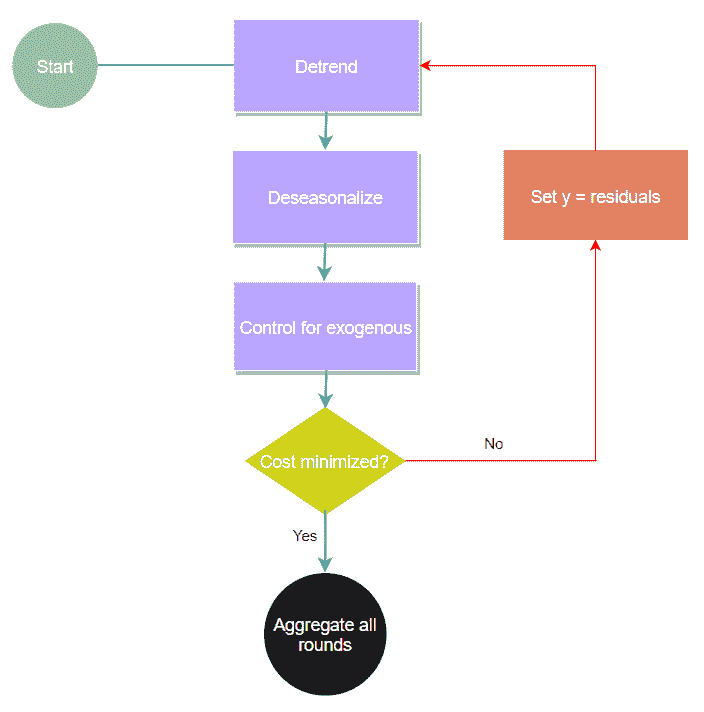
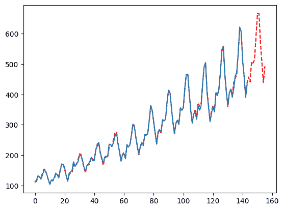
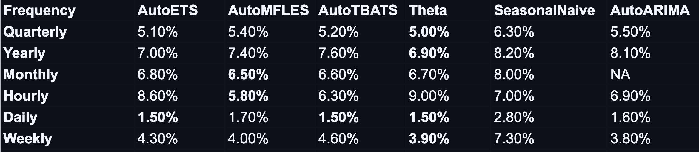
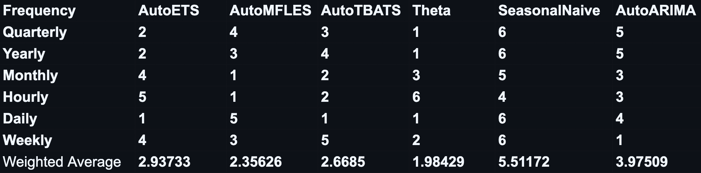

# 使用 MFLES 进行时间序列预测

> 原文：[`towardsdatascience.com/time-series-forecasting-with-mfles-c452ede7834c/`](https://towardsdatascience.com/time-series-forecasting-with-mfles-c452ede7834c/)


图片由[David Todd McCarty](https://unsplash.com/@davidtoddmccarty?utm_content=creditCopyText&utm_medium=referral&utm_source=unsplash)在[Unsplash](https://unsplash.com/photos/brown-cupcake-on-white-textile-udHpkduEOYU?utm_content=creditCopyText&utm_medium=referral&utm_source=unsplash)提供

## 简介

[StatsForecast](https://nixtlaverse.nixtla.io/statsforecast/index.html)是 Python 生态系统中的一个主要统计预测包。我倾向于认为它是‘三大’之一，其他两个是 Sktime 和 DARTS。StatsForecast 的创建者和维护者 Nixtla 创建了一个令人印象深刻的时序预测框架生态系统。这项工作涵盖了时序领域的各个方面，从机器学习、深度学习到甚至分层预测包应有尽有。

今天，我们将关注他们的 StatsForecast 包，它主要位于时间序列预测的‘传统’领域。具体来说，我们将查看他们最新的发布版本，其中包含一种新的混合方法，模糊了预测方法‘传统’的界限。这种方法在 Statsforecast 的许多基准测试中表现出色，最近还成为了[VN1 预测竞赛](https://www.datasource.ai/en/home/data-science-competitions-for-startups/phase-2-vn1-forecasting-accuracy-challenge/leaderboard)前几名结果中最常用的统计方法。

首先，一个快速提示：我极度有偏见，正如我应该的那样，因为我创造了这个方法！

## MFLES 方法


作者图片

MFLES 是一种基于梯度提升时间序列分解来预测时间序列的方法，它将传统的分解视为提升过程中的基础估计器。与正常的梯度提升不同，学习率是在组件级别（趋势/季节性/外生变量）而不是总估计器上应用的。

该方法的名字来源于一些可以进入提升过程的底层估计器，具体包括：简单的中位数、用于季节性的傅里叶函数、简单的/分段线性趋势和指数平滑。

MFLES 似乎在广泛的预测活动中表现良好，例如多季节性或高度可变的历史数据。

## 梯度提升时间序列分解理论

让我们快速概述一下底层的‘理论’。

这个想法很简单，将分解过程视为一种“伪”梯度提升，因为我们像标准梯度提升一样传递残差。然后应用梯度提升方法，如使用全局机制迭代控制过程，并为过程中的每个组件（如趋势、季节性或外生变量）引入学习率。通过这样做，我们从这个“伪”方法过渡到完整的梯度提升。

以这种方式利用梯度提升在时间序列环境中解锁了许多功能。

例如，我们可以在每个提升回合中估计一个季节性周期。有效地将过程泛化以适应无限的季节性。我们可以在每个回合中寻找一个变化点，并通过提升，拟合你心中所想的变化点数量！最后，我们能够合并许多估计器，这些估计器对于传统上被视为时间序列分解中的“异类”的各个组件来说，由于消耗了太多信号而没有留下太多供其他组件学习。

当然，这些都可能导致过拟合和其他问题，我们可以通过利用组件学习率来对抗这些问题！

这个过程听起来可能很复杂，但实际上非常简单。希望这个插图能让你明白主要思想。



图片由作者提供

如果你仍然想了解更多，你可以查看我在 ThymeBoost 上的一些其他文章，该平台实现了这个想法。

[使用 ThymeBoost 进行时间序列预测](https://medium.com/towards-data-science/thymeboost-a0529353bf34)

[使用 ThymeBoost 的 M4 预测竞赛](https://medium.com/towards-data-science/the-m4-time-series-forecasting-competition-with-thymeboost-b31196fc319)

最终，MFLES 是 ThymeBoost 的一个特定实现，通常效果很好！

## 一个快速示例

现在我们已经回顾了一些 MFLES 的基础理论和具体细节，让我们看看如何使用 StatsForecast 进行预测！

以下示例也可以在[文档](https://nixtlaverse.nixtla.io/statsforecast/docs/models/mfles.html)中找到（我也为该方法编写了文档）

对于这个例子，我们将使用臭名昭著的航空乘客数据集，它有一个很好的趋势和乘法季节性。

```py
import pandas as pd
import numpy as np
from statsforecast.models import AutoMFLES
import matplotlib.pyplot as plt

df = pd.read_csv(r'https://raw.githubusercontent.com/jbrownlee/Datasets/master/airline-passengers.csv')
y = df['Passengers'].values # make array

mfles_model = AutoMFLES(
      season_length = [12],
      test_size = 12,
      n_windows=2,
      metric = 'smape')
mfles_model.fit(y=y)
predicted = mfles_model.predict(12)['mean']
fitted = mfles_model.predict_in_sample()['fitted']

plt.plot(np.append(fitted, predicted), linestyle='dashed', color='red')
plt.plot(y)
plt.show()
```



图片由作者提供

我们在这里传递给 MFLES 的一些参数，有些人可能会说对于一个“自动”预测模型来说参数太多。无论如何，让我们回顾一下这些关键参数：

+   **季节长度**：一个按感知重要性排序的季节周期列表。

+   **test_size**: AutoMFLES 通过时间序列交叉验证进行优化。测试集大小决定了每个测试折叠中使用的周期数。当进行优化时，这可能是最重要的参数，你应该在设置时权衡季节长度、预测范围和一般数据长度。但一个好的经验法则是选择最重要的季节长度或其一半，以便 MFLES 能够捕捉到季节性。

+   **n_windows**: 在优化参数时使用的测试集数量。在这个例子中，2 表示我们总共使用了 24 个月（12 * 2）的数据，分在两个窗口之间。

+   **指标**: 这个很简单，它就是我们想用参数优化的指标。在这里，我们使用默认的 smape，这是默认用于在 M4 上重现实验结果的。你也可以传递‘rmse’、‘mape’或‘mae’来优化其他指标。

## M4 基准测试

当然，我们并不太关心拟合单个序列。我们想知道 MFLES 在更大的基准测试上的表现。这本质上就是“为什么我应该关心 MFLES”。幸运的是，有一些基准测试是在 M4 数据集上进行的。

如果你不知道 M4 竞赛是什么，以及随后的 M4 数据集是什么，那么它是在 2018 年举行的一个预测竞赛。就数据集而言，M4 数据集包含了来自各个领域的**100,000 个时间序列**。

### 数据集特征

+   **数据频率**: 时间序列被分为六个不同的频率：

1.  **年数据**: 23,000 个系列

1.  **季度数据**: 24,000 个系列

1.  **月数据**: 48,000 个系列

1.  **周数据**: 359 个系列

1.  **日数据**: 4227 个系列

1.  **小时数据**: 414 个系列

### 表示的领域

数据集包括了来自不同领域的时序数据：

+   **人口统计学**: 人口计数、出生率等。

+   **金融数据**: 股票价格、货币汇率等。

+   **行业**: 生产量、能源消耗等。

+   **宏观经济数据**: GDP、通货膨胀等。

+   **微观数据**: 来自公司、商店或产品的销售数据。

+   **其他**: 不符合上述类别的一系列数据集。

对于与 MFLES 的基准测试，结果可以在[这里](https://github.com/Nixtla/statsforecast/tree/main/experiments/mfles)找到，Nixtla 将该方法与许多标准统计方法进行了比较，如 ARIMA、ETS 和 Theta 模型。

以下是可以看到的 sMAPE 结果：



作者图片

在赢家方面——MFLES 在 6 个数据集中的 2 个中是最好的方法，仅输给了在 3 个中表现最佳的 Theta 方法。但让我们看看排名，并考虑到系列的数量。

这里是每个数据集的方法排名：



作者图片

根据基准测试，MFLES 实际上排名第二，仅次于 Theta 方法。

更令人印象深刻的是 MFLES 的灵活性。该方法可以处理：

1.  多重季节性

1.  外生特征

1.  趋势变化点

Theta 通常不擅长处理的事情。当然，你可以将 Theta 引入梯度提升分解框架以进行泛化，但这将是另一篇文章的内容！

## 结论

在这篇文章中，我们探讨了 Nixtla 在 2024 年 5 月发布的 MFLES，它已经取得相当不错的成绩——考虑到所有因素。MFLES 还有一些即将推出的额外功能。其中最有趣的是任何估计器外生组件，这将允许你使用任何方法（如提升树、SVM 或甚至神经网络）来拟合你的外生特征。这些方法在时间序列背景下通常会消耗太多信号。

无论如何，我希望你们喜欢这个概述！一如既往，如果你想看到我更多的内容，确保注册接收我发布通知。我保证今年我会做得更好！

[订阅](https://medium.com/@tylerblume/subscribe)
