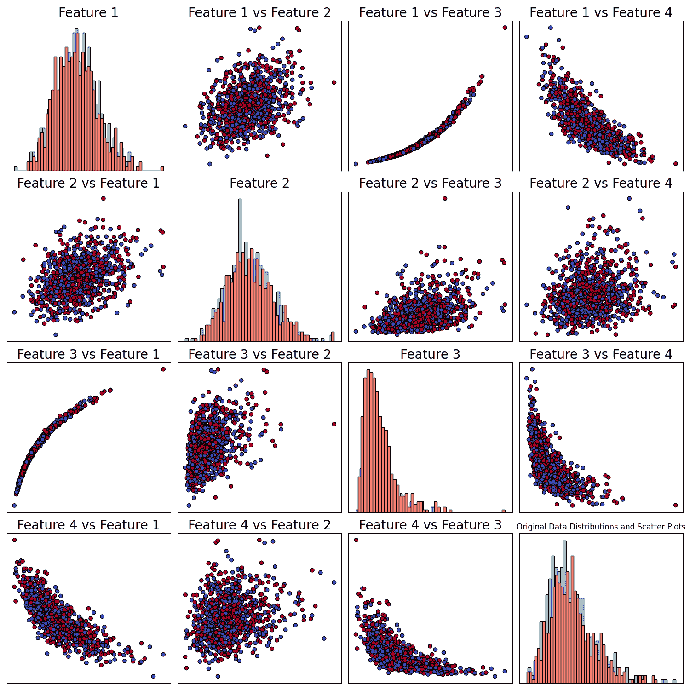
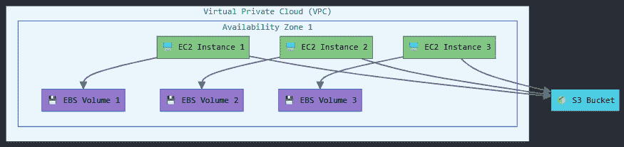
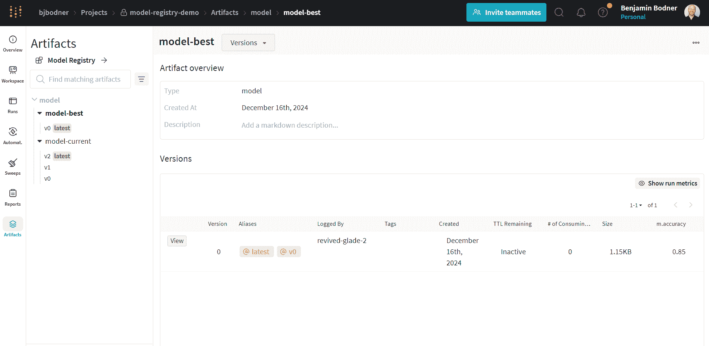
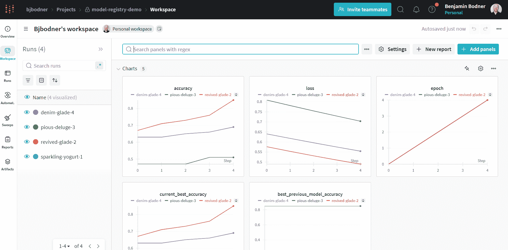

# 2025 年数据科学家需要掌握的 12 项技能

> 原文：[`towardsdatascience.com/top-12-skills-data-scientists-need-to-succeed-in-2025-c80f54cf227a/`](https://towardsdatascience.com/top-12-skills-data-scientists-need-to-succeed-in-2025-c80f54cf227a/)


来源：图像由作者制作，受益于 Claude 的帮助。

> 2025 年的 AI 领域发展速度比火箭还要快，想要跟上变得越来越困难了！
> 
> 你会保持当前职位，被雇佣，晋升还是被解雇？这取决于你，以及你适应变化的速度。
> 
> 这并不是说如果你不适应，你就会灭亡。

许多事情在变化，但有些事情并没有变化。理解哪些变化需要你的关注是**成功的关键**。

是的，新的 AI 革命正在经济的大规模领域迅速扩散，带来了大量新工具来提升生产力和自动化许多任务。如果你去年感到不知所措，那么就系好安全带，准备再次体验一场刺激的旅程吧！

> 那么，你应该如何应对这股不断加速的 AI 炒作和工具的浪潮？
> 
> 通过关注重要的事情。

尽管 AI 工具非常闪亮且强大，但真正能帮助你在职业生涯中取得成功的许多技能在过去几十年甚至几个世纪中变化不大！

我将引导你了解作为数据科学家、机器学习工程师或应用科学家在 2025 年成功所需的 12 项关键技能。从永恒的能力到新兴技术，我会提供实际案例和资源，帮助你开始并发展每一项技能。换句话说：

> 这篇文章将是你提升 2025 年技能的一站式商店。

* * *

## 在我们开始之前

> 2025 年数据科学家会做什么？
> 
> 好吧，这取决于。

首先，我可能会松散地使用“数据科学家”这个术语来指代处理数据、机器学习、深度学习和生成人工智能模型的职位。然而，这类职位的其他名称还包括机器学习工程师、应用科学家、算法开发人员等等。

那么，在这些角色中，你应该期待什么？好吧，我已经审查了 500 多个职位描述中列出的职责，以下是我的发现：

### 数据科学家前五项职责：

1.  **数据与建模（Data & Modelling）：** 处理和工程化大规模数据集。利用统计学和数据分析。构建、训练和评估机器学习模型（包括大型语言模型、计算机视觉、表格数据、时间序列、音频和推荐系统）。开发生成人工智能应用和工作流程。

1.  **研发（Research & Development）：** 构建内部工具。进行文献综述。紧跟最新发展。从原型到部署，拥有项目。

1.  **基础设施设计与开发（Infrastructure Design & Development）：** 设计基于云的模型服务基础设施。构建数据、训练和推理管道。

1.  **绩效与监控**：定义和跟踪成功指标。构建仪表板和监控工具。确保模型在大规模上的可靠性。

1.  **协作与沟通**：向利益相关者和客户展示。与团队成员分享知识。跨团队工作。

那么，有多少人工智能炒作进入了这些职位描述？没有你想象的那么多。利用这一点，选择你想要成长的特定领域，但永远不要忘记你的根基。

* * *

## 那么，2025 年哪些技能很重要？


来源：作者使用 Dall E 3 创建的图像。

## 1. 沟通技巧

> 没有人知道你在做什么，你在想什么。

你有什么想要的东西吗？你有任何问题吗？你卡住了吗？你有什么问题吗？不要保留，说出来。

> 如果你没有要求，你为什么要得到你想要的东西？

在数据科学中取得成功以及在一般意义上保持高效，沟通你的问题、问题、思想、结果和结论至关重要。

我知道有时问一些愚蠢的、“笨拙的”和天真的问题可能会感到尴尬。然而，根据我的经验，那些经常问“愚蠢”问题的人会更快地取得进步。这是因为他们学得更快，创造价值更快，并获得宝贵的联系和信任。

> 我个人非常喜欢问“愚蠢”和“琐碎”的问题，比如“**什么是错误？**”。这几乎总是让人停下来，质疑他们最基本的前提，通常会导致对项目和问题的更好理解，同时改善团队成员之间的沟通。

掌控你的职业生涯，打断你的朋友，提出你的问题。他们会因此更加尊重你。你越练习表达你的需求、思想和观点，你在这方面就会变得越好——不仅是在你的职业生涯中，而且在生活中总体上。

### 你应该练习什么？

1.  **解释技术内容**：尝试将你所做或刚刚学到的内容解释给你的非技术朋友或家人。使用[ELI5 技术](https://blog.groovehq.com/the-eli5-technique#:~:text=The%20ELI5%20(explain%20it%20like,treat%20your%20customers%20like%20children)（就像我 5 岁一样解释）并在深入细节之前先说明业务影响。

1.  **讲故事**：为你要讲述的故事创建一个叙述。创建引人入胜的可视化或演示来支持你的故事。你可以使用[渐进式披露原则](https://patthomson.net/2022/05/30/%EF%BF%BCusing-the-progressive-disclosure-principle-in-academic-writing/)或[金字塔原理](https://lindsayangelo.com/thinkingcont/strategic-storytelling-pyramid-principle)，后者是反过来的。

1.  **与利益相关者沟通：** 利益相关者没有空闲时间。他们想要快速、简洁的信息。练习[Bottom Line Up Front](https://en.wikipedia.org/wiki/BLUF_(communication))（BLUF）和[红/黄/绿](https://medium.com/@TomHenricksen/what-is-the-project-status-red-amber-green-what-does-that-mean-b883f1164bc8)（RAG）技术来传达你的信息。

1.  **书面沟通：** 使用[BLUF](https://en.wikipedia.org/wiki/BLUF_(communication))和[RAG](https://medium.com/@TomHenricksen/what-is-the-project-status-red-amber-green-what-does-that-mean-b883f1164bc8)，然后总结已经完成的工作、下一步计划以及阻碍进展的因素。在记录你的工作时，关注问题、方法、可重复性和可访问性。

1.  **避免陷阱：** 在说话之前先思考，不要无结构地闲聊；避免用技术细节或行话压倒人；最后，不要拖延，不要等太久才沟通；有比什么都不做更好的沟通方式。

### 你在哪里可以练习？

> 有很多机会可以去寻找！

尝试向同事、朋友或家人解释你的工作。通过电子邮件或你的消息应用发送频繁的状态更新。自愿在团队会议或会议上进行演示。加入或创建一个期刊俱乐部来练习讨论技术论文。

你也可以寻求对你离线沟通和演示的反馈。创建一个博客或为技术文档做出贡献，以改善你的离线沟通。

> 机会无限，你只需要去寻找它们！

* * *

## 2. 编程技能（Python）

> 对的，Python 排名第二。

在沟通之后，我不需要告诉你核心编程技能对于数据科学家来说非常重要。

作为数据科学家，你需要一种脚本语言，如`Python`，来完成你需要完成的工作！从数据抓取、提取、操作和分析，到开发自定义模型及其训练、评估、推理管道、部署服务和构建交互式应用程序。

你需要的不仅仅是机器学习相关的库。（这是列表中的第 6 项）。

> 熟悉你在 Python 中能做的全部范围。

尽量熟悉[Python 标准库](https://docs.python.org/3/library/index.html)中的尽可能多的内置模块。它提供了一堆超级有用的工具，这将扩展你之前认为 Python 能做的事情的范围。

例如，`[dataclasses](https://docs.python.org/3/library/dataclasses.html)`是管理通过对象传递的数据非常有用的工具。这个例子展示了某个模型（目标检测器）的输出被传递给第二个模型（姿态估计器）。

运行此命令应产生以下输出：

```py
----------------------------------------
detection 1: person, conf: 91.94%
bbox (92, 46, 62, 171)
keypoints:
[[114.488144  96.92579 ]
 [144.00072   67.28505 ]
 [138.01134   59.30764 ]]
----------------------------------------
detection 2: cat, conf: 25.65%
bbox (175, 65, 31, 93)
```

* * *

## 3. 深入理解数据

> 你知道你的数据中有什么吗？

### 3.1 数据验证

> 你有哪些数据问题？哪些边缘情况、损坏、噪声？

如果你不知道这些问题的答案，你可能会构建一个数据管道或预处理组件，它会产生难以理解和捕捉的错误，或者更糟的是——沉默错误！（在这种情况下，一切运行正常，但你得到了你不想看到的行为）。

你如何避免这些问题？

> 通过明确测试你对你数据的所有假设。

例如，你的数据是否没有重复和缺失值？所有的值是否都是数值、字符串或张量？所有的标签是否都是正整数？所有的文件是否都存在？路径是否按照你相信的方式组织？

**把它想象成对你数据的测试。**

> 太多次我跳过了这个关键步骤，结果付出了沉默错误的代价，这些错误非常难以通过没有明确测试来捕捉。这就是为什么我永远不会忘记鲍勃·科尔韦尔的名言：“如果你没有测试它，它就不起作用”。

* * *

### 3.2 理解你的数据



来源：来自《深度学习与数据科学：谁将获胜？》的图片([Deep Learning vs Data Science: Who Will Win?](https://towardsdatascience.com/deep-learning-vs-data-science-who-will-win-103bfbad0a65))

> 探索性数据分析（EDA）是你的朋友！

理解涉及到的分布，在数据上训练时的学习任务难度，如何划分你的数据以提供洞察力，分析性能，改进训练，并鼓励行为。

这将帮助你找到你不知道你不知道的事情！

> 假设检验有助于发现你知道你不知道的事情，例如，你知道要问哪些问题，但你不知道答案。
> 
> 但你有没有想过你没有想过要问的问题？

这就是可视化发挥作用的地方。这是你打开思维并让它驰骋于各种可能性中的机会。这是你发现模式和学会提出你从未想过要问的新问题的机会。

与 `[matplotlib](https://matplotlib.org/)`、`[seaborn](https://seaborn.pydata.org/)`、`[plotly](https://plotly.com/)` 和相关库等工具非常熟悉。任何 LLM 都可能实现一些用于可视化数据的入门代码，但你仍然应该知道如何进入并调整它以满足你的确切需求。

记住，创建清晰、信息丰富的可视化，有效地传达洞察力是一种**技能，而不是艺术**，熟能生巧。

* * *

### 3.3 理解影响

最后但同样重要的是，考虑如果你的模型将在数据上训练，你期望它表现出什么样的行为。

> 你的模型真的能够学习到你想要它学习的东西吗？

你能否使用特征工程来提高学习信号？这是那些你应该尝试利用你的数学直觉、统计方法知识和概率理论的地方。

这也与评估数据相关。试着想想在数据的某个特定分区上获取某些指标意味着什么。**这真的支持或反驳了一个假设或商业目标吗？** 如果不是，哪种类型的数据将更好地与目标一致？

* * *

## 4. 软件工程最佳实践

> 我不是已经讲过了吗？
> 
> 不。我们讨论了“如何”用代码做事，现在让我们谈谈“应该做什么”。

每种编程语言都有其优点、缺点、好处和怪癖。话虽如此，软件工程中有许多最佳实践你应该掌握，因为这些概念将使你在同行中具有竞争优势，并使你成为你领域的真正专业人士。

从我的经验（作为一个在职业生涯后期才学习这些概念的人）来看，这些技能可能比任何单一框架或工具都更有价值：

1.  版本控制 ([Git](https://git-scm.com/book/ms/v2/Getting-Started-About-Version-Control) 和 [Github](https://github.com/))：谨慎的提交、分支、拉取请求和文档。

1.  编写 [干净的代码](https://refactoring.guru/refactoring/what-is-refactoring) 和避免 [有问题的代码](https://refactoring.guru/refactoring/smells)。

1.  不同类型的 [测试](https://www.geeksforgeeks.org/software-engineering-seven-principles-of-software-testing/)。

1.  面向对象编程（OOP）概念：[基础](https://www.geeksforgeeks.org/introduction-of-object-oriented-programming/) 和 [SOLID](https://www.geeksforgeeks.org/solid-principle-in-programming-understand-with-real-life-examples/) 原则，以及 [常见设计模式](https://refactoring.guru/design-patterns/catalog)。

1.  [容器化](https://www.docker.com/resources/what-container/)。

以这个有问题的代码为例：

> 它有什么问题？
> 
> 实际上有很多事情。

方法和变量的名称没有意义（l,x,y），没有类型提示，没有输入验证，逻辑重复（`>=` 比较），可能产生不希望的行为，空列表和无效的等级。

我们能做得更好吗？当然可以！看看这段代码：

**这种干净的代码好得多！**

例如，变量和函数有有意义的名称和类型提示，这清楚地定义了输入和输出类型（使其更容易阅读和测试），常量定义清晰，没有重复的逻辑，输入验证确保可靠的行为。

为了进一步阅读，我强烈推荐查看 [refactoring.guru](https://refactoring.guru/)，它有大量关于这些主题的非常好和精确的信息。

* * *

## 5. 与数据库交互

> 作为数据科学家，你不处理数据吗？
> 
> 那你的数据在哪里？

想象一下：你刚刚加入一家快速发展的初创公司担任数据科学家。在你的第一天，你发现你的数据散布在六个不同的系统中。客户信息存储在[PostgreSQL](https://www.postgresql.org/)，用户行为数据流入[MongoDB](https://www.mongodb.com/)，会话数据位于 Redis 中，而你的营销团队刚刚将大量营销数据倒入 Snowflake。

> 欢迎来到现代数据生态系统。

尽管如此，不要感到不知所措；实际情况并没有你想象的那么糟糕。有各种各样的数据库，但最基本的家庭是[关系型数据库和 NoSQL 数据库](https://aws.amazon.com/compare/the-difference-between-relational-and-non-relational-databases/)。

+   **关系型数据库**（例如[PostgreSQL](https://www.postgresql.org/)和[MySQL](https://www.mysql.com/))：这些数据库将数据存储在结构化的表中，当你的数据可以自然地适应行和列的表格，不同类型的数据之间有**明确的关系**，具有相对**稳定的数据库模式**，并且需要运行复杂的查询时，这是很好的。

+   **NoSQL 数据库**：这个家族实际上有几种不同的数据存储方式。它实际上是一个“所有其他存储方法”的家族，包括：**a. 基于文档的**：例如[MongoDB](https://www.mongodb.com/)。适用于半结构化数据。**b. 基于键值对的**：例如[Redis](https://redis.io/)。适用于简单快速的查找。**c. 基于宽列的**：例如[Cassandra](https://cassandra.apache.org/_/index.html)。适用于在多个服务器上处理大量结构化数据。**d. 基于图的**：例如[Neo4j](https://neo4j.com/)。适用于条目之间关系重要的场景。**e. 基于向量的**：例如[Pinecone](https://www.pinecone.io/?utm_term=pinecone%20vector%20database&utm_campaign=brand-eu&utm_source=adwords&utm_medium=ppc&hsa_acc=3111363649&hsa_cam=21023356007&hsa_grp=156209469342&hsa_ad=690982079000&hsa_src=g&hsa_tgt=kwd-1538083228315&hsa_kw=pinecone%20vector%20database&hsa_mt=e&hsa_net=adwords&hsa_ver=3&gclid=CjwKCAiA65m7BhAwEiwAAgu4JNoc9BbwsghLoxDmrpna0-GrVQEyJ6CZIFhK5LvEtUGpzdBqJ-ZhUBoCJz8QAvD_BwE)。适用于相似性查询和存储高维数据，如特征嵌入。

    ### 那么，你应该学习哪些查询语言呢？

> 在这个问题上稍微懒惰一点是可以的。

我建议从[MySQL](https://www.w3schools.com/sql/)和[MongoDB](https://www.mongodb.com/)开始，我认为这些是良好的起点。如果你想的话，可以看看[Redis](https://redis.io/)、[DynamoDB](https://aws.amazon.com/dynamodb/)、[Pinecone](https://www.pinecone.io/?utm_term=pinecone%20vector%20database&utm_campaign=brand-eu&utm_source=adwords&utm_medium=ppc&hsa_acc=3111363649&hsa_cam=21023356007&hsa_grp=156209469342&hsa_ad=690982079000&hsa_src=g&hsa_tgt=kwd-1538083228315&hsa_kw=pinecone%20vector%20database&hsa_mt=e&hsa_net=adwords&hsa_ver=3&gad_source=1&gclid=CjwKCAiA65m7BhATEiwAO2-R6n3MgOZ3Q4DPqJb4QumfwyGHO2EALEjDxP0E6p82wzCeElR_Rw3O-BoCIbEQAvD_BwE:G:s&s_kwcid=AL!4422!3!645125273261!e!!g!!aws!19574556887!145779846712)、[Neo4j](https://neo4j.com/)和其他数据库。**然而，不要陷入其中。**

也有必要了解一些关于[数据管道](https://www.ibm.com/think/topics/data-pipeline)、[数据湖](https://aws.amazon.com/what-is/data-lake/)和[数据仓库](https://cloud.google.com/learn/what-is-a-data-warehouse)的基本概念。

作为数据科学家，你不需要成为这些框架的大师。只需从最基本的知识点开始，边学边建，并始终关注真正的目标：将数据转化为洞察。

* * *

## 6. 云计算



虚拟私有云（VPC）的示例。来源：作者用 Claude 制作的图片。

> 如果你无法获取数据，甚至没有电脑，你如何训练你的模型？

作为数据科学家，你很可能会与云平台（如[AWS](https://aws.amazon.com/free/?gclid=CjwKCAiAg8S7BhATEiwAO2-R6n3MgOZ3Q4DPqJb4QumfwyGHO2EALEjDxP0E6p82wzCeElR_Rw3O-BoCIbEQAvD_BwE&trk=2d3e6bee-b4a1-42e0-8600-6f2bb4fcb10c&sc_channel=ps&ef_id=CjwKCAiAg8S7BhATEiwAO2-R6n3MgOZ3Q4DPqJb4QumfwyGHO2EALEjDxP0E6p82wzCeElR_Rw3O-BoCIbEQAvD_BwE:G:s&s_kwcid=AL!4422!3!645125273261!e!!g!!aws!19574556887!145779846712)、[GCP](https://cloud.google.com/gcp?utm_source=google&utm_medium=cpc&utm_campaign=emea-il-all-en-bkws-all-all-trial-e-gcp-1011340&utm_content=text-ad-none-any-DEV_c-CRE_500236788696-ADGP_Hybrid+%7C+BKWS+-+EXA+%7C+Txt+-+GCP+-+General+-+v1-KWID_43700060384861723-kwd-87853815-userloc_1008006&utm_term=KW_gcp-NET_g-PLAC_&&gad_source=1&gclid=CjwKCAiAg8S7BhATEiwAO2-R6kPnaUBPuFCZNATK5G6x5AzBU2SClc8UCqs9nA2JH_ljoP_Cv9CNXhoCoEsQAvD_BwE&gclsrc=aw.ds)、[Azure](https://azure.microsoft.com/en-us/))用于数据存储和处理，以及模型训练、评估和部署。

即使你很可能始终有一个[DevOps](https://www.atlassian.com/devops#:~:text=A%20DevOps%20team%20includes%20developers,the%20organizations%20they%20work%20for.)团队支持你，但一些基本的云服务理解和实践经验将给你带来**相对于同事的明显优势**！

> 这就像学习游泳，但是在抽象概念的大海中。

这项知识将帮助您更好地传达您的需求，使您在计算资源方面拥有更多的独立性，帮助您获得更多更强的 GPU，并加速您的发展、培训和推理！

例如，在我之前的一个项目中，我通过优化团队在其预算内使用的资源，成功地将团队拥有的强大 GPU 数量**翻倍**。

### 如何开始？

与所有技术技能一样，我认为学习它们的最佳方式是**立即开始动手教程**。让我们用亚马逊的简单存储服务（[S3](https://aws.amazon.com/pm/serv-s3/?gclid=CjwKCAiAmrS7BhBJEiwAei59i5MPy3cjsHiA-OhstEQnKwAyeEArrEqWpuKs2_OGQWpivukmEbD-nRoC1aYQAvD_BwE&trk=bf68dcca-a5e6-45e2-9193-a408d1a29481&sc_channel=ps&ef_id=CjwKCAiAmrS7BhBJEiwAei59i5MPy3cjsHiA-OhstEQnKwAyeEArrEqWpuKs2_OGQWpivukmEbD-nRoC1aYQAvD_BwE:G:s&s_kwcid=AL!4422!3!717563062548!e!!g!!s3!21818514919!169838296718)）来保存和下载一些数据。

### 6.1 从账户设置和安装开始：

如果您没有账户，请在[aws.amazon.com](https://aws.amazon.com/)上创建一个，然后创建一个具有访问[S3](https://aws.amazon.com/pm/serv-s3/?gclid=CjwKCAiAmrS7BhBJEiwAei59i5MPy3cjsHiA-OhstEQnKwAyeEArrEqWpuKs2_OGQWpivukmEbD-nRoC1aYQAvD_BwE&trk=bf68dcca-a5e6-45e2-9193-a408d1a29481&sc_channel=ps&ef_id=CjwKCAiAmrS7BhBJEiwAei59i5MPy3cjsHiA-OhstEQnKwAyeEArrEqWpuKs2_OGQWpivukmEbD-nRoC1aYQAvD_BwE:G:s&s_kwcid=AL!4422!3!717563062548!e!!g!!s3!21818514919!169838296718)权限的策略的[IAM 用户](https://docs.aws.amazon.com/IAM/latest/UserGuide/id_users.html)。

> 没有理解其中的任何内容？不用担心。

希望您的 DevOps 团队能够帮助您设置这些，如果不能，我建议查看[这个关于 IAM 的出色教程](https://www.youtube.com/watch?v=_ZCTvmaPgao)，[这个关于 S3 的教程](https://www.datacamp.com/tutorial/aws-s3-efs-tutorial)，以及[这个动手教程](https://docs.aws.amazon.com/cli/latest/userguide/getting-started-quickstart.html)。

> 准备好了吗？
> 
> 让我们开始吧！

首先，让我们安装剩余的 pip 包：

```py
pip install awscli boto3 torch torchvision
```

现在，配置您的环境。

```py
aws configure
# Enter your:
# - AWS Access Key ID
# - AWS Secret Access Key
# - Default region (e.g., us-east-1)
# - Default output format (json)
```

在您设置好之后，您的环境将通过具有访问[S3](https://aws.amazon.com/pm/serv-s3/?gclid=CjwKCAiAmrS7BhBJEiwAei59i5MPy3cjsHiA-OhstEQnKwAyeEArrEqWpuKs2_OGQWpivukmEbD-nRoC1aYQAvD_BwE&trk=bf68dcca-a5e6-45e2-9193-a408d1a29481&sc_channel=ps&ef_id=CjwKCAiAmrS7BhBJEiwAei59i5MPy3cjsHiA-OhstEQnKwAyeEArrEqWpuKs2_OGQWpivukmEbD-nRoC1aYQAvD_BwE:G:s&s_kwcid=AL!4422!3!717563062548!e!!g!!s3!21818514919!169838296718)权限的访问策略与您的[IAM 用户](https://docs.aws.amazon.com/IAM/latest/UserGuide/id_users.html)相链接，无论是通过 AWS 命令行界面([AWSCLI](https://aws.amazon.com/cli/))还是通过他们的 Python 库([boto3](https://aws.amazon.com/sdk-for-python/))。

> 理解了吗？很好。

### 6.2 设置我们的辅助类

现在我们创建一个小的类来管理从[S3](https://aws.amazon.com/pm/serv-s3/?gclid=CjwKCAiAmrS7BhBJEiwAei59i5MPy3cjsHiA-OhstEQnKwAyeEArrEqWpuKs2_OGQWpivukmEbD-nRoC1aYQAvD_BwE&trk=bf68dcca-a5e6-45e2-9193-a408d1a29481&sc_channel=ps&ef_id=CjwKCAiAmrS7BhBJEiwAei59i5MPy3cjsHiA-OhstEQnKwAyeEArrEqWpuKs2_OGQWpivukmEbD-nRoC1aYQAvD_BwE:G:s&s_kwcid=AL!4422!3!717563062548!e!!g!!s3!21818514919!169838296718)上传和下载数据以及验证数据。在这里，我们将处理来自本地目录的图像和`labels.pt`张量。

### 6.3 与 S3 交互

然后，我们可以使用以下脚本运行这些操作，我们将上传[FashionMNIST](https://github.com/zalandoresearch/fashion-mnist)测试数据集的前 10 个图像和标签（MIT 许可证）。

运行此命令应产生以下输出，其中我们确认我们下载的文件（在我们上传它们之后）与我们开始时相同的文件。

```py
data saved locally to dataFashionMNISTprocessedtest
Created bucket: fashionmnist-s3-demo-20241230210543
uploading data
done
downloading data
done
downloading data
done
Dataset verification: passed
```

最后，我们还可以使用命令行界面来确认数据是否仍然存在于我们的 S3 存储桶中。在这种情况下，让我们使用[AWSCLI](https://aws.amazon.com/cli/)：

`aws s3 ls --recursive {BUCKET_NAME}`

```py
$ aws s3 ls --recursive fashionmnist-s3-demo-20241230210543
2024-12-30 21:05:45        394 cifar10/test/images/0.png
2024-12-30 21:05:45        582 cifar10/test/images/1.png
2024-12-30 21:05:45        391 cifar10/test/images/2.png
2024-12-30 21:05:45        408 cifar10/test/images/3.png
2024-12-30 21:05:45        635 cifar10/test/images/4.png
2024-12-30 21:05:45        444 cifar10/test/images/5.png
2024-12-30 21:05:45        542 cifar10/test/images/6.png
2024-12-30 21:05:46        700 cifar10/test/images/7.png
2024-12-30 21:05:46        224 cifar10/test/images/8.png
2024-12-30 21:05:46        381 cifar10/test/images/9.png
2024-12-30 21:05:46        808 cifar10/test/labels.pt
```

### 重要！

总是清理你使用的云资源，以避免过高的成本！请注意，在这个演示中，每次运行脚本时，存储桶将具有不同的名称（带时间戳），所以**务必在完成后在 S3 中删除这些存储桶**！

```py
aws s3 rm s3://{BUCKET_NAME} - - recursive
aws s3 rb s3://{BUCKET_NAME}
```

* * *

## 7. 掌握机器学习框架

> 你知道这一点，所以我就不深入探讨了。

作为数据科学家，你需要知道如何，并且愿意与 ML 框架打交道，因此熟练使用它们非常重要！这些包括[PyTorch](https://pytorch.org/)、[TensorFlow](https://www.tensorflow.org/)和[Scikit-Learn](https://scikit-learn.org/stable/)等框架。

例如，这里有一个用例，你想要为预训练视觉变换器的特定标记训练一个自定义头部，以在图像的一个区域中定位对象。它还使用不同的学习率来利用预训练的权重，而不“擦除”它们。

你可能在高层次的训练器中找不到这种功能，比如使用[Hugging Face](https://huggingface.co/docs/transformers/en/main_classes/trainer)或[Fastai](https://fastai1.fast.ai/training.html)训练器时。

* * *

## 8. MLOps

> 你曾经忘记你把最好的模型放在哪里了吗？

MLOps 是一个总称，包括推动 ML 项目通过其整个生命周期所需的所有技术，从初始实验跟踪到生产部署。这包括容器化、监控以及随着时间的推移维护模型性能。

> 即使你一个人工作，也需要使用所有这些工具吗？在某个实验性的项目上？在一周的项目上？
> 
> 是的，是的，是的。

根据我的经验，从“我们只是在尝试一些东西”到“我们需要有组织地工作”**进展得太慢了**，有时甚至从未发生！

### 我的经验法则是：

**对于任何项目，始终使用实验和配置管理器**来跟踪你的配置、指标和模型检查点。

这就是为什么**你应该掌握实验管理器的基本功能**，例如 `[wandb](https://wandb.ai/site/)`、`[mlflow](https://mlflow.org/)`、`[clearml](https://clear.ml/?utm_feeditemid&utm_device=c&utm_term=clearml&utm_source=adwords&utm_medium=ppc&utm_campaign=Search%20%7C%20Brand&hsa_cam=16563267736&hsa_grp=134088880946&hsa_mt=e&hsa_src=g&hsa_ad=636186357048&hsa_acc=4043203093&hsa_net=adwords&hsa_kw=clearml&hsa_tgt=kwd-784171082579&hsa_ver=3&gad_source=1&gclid=Cj0KCQiAvP-6BhDyARIsAJ3uv7ar2la2E9xUmv68XJBn9E67dMsdCCNSr0kcrtPip1t7f2aAWFOIlNkaAnucEALw_wcB)`、`[neptune](https://docs.neptune.ai/usage/)` 以及类似的东西。不用担心，它们都有相同的基本功能，所以只需专注于一个即可。

更详细的 MLOps 组件可以等到项目更加成熟时再考虑，但**学习它们会给你带来优势**。这包括数据、训练、评估、CI/CD 和推理管道、模型和数据版本控制、ML 监控等。

这里是一个使用 `[wandb](https://wandb.ai/site/)` 的例子，用于训练模型并跟踪其指标和配置，然后使用他们的 [artifacts](https://docs.wandb.ai/guides/artifacts/) API 将其保存到模型注册表中。

当打开 `[wandb](https://wandb.ai/site/)` 网页应用时，你应该能看到已运行的实验及其指标、配置和相关的已保存 [artifacts](https://docs.wandb.ai/guides/artifacts/)。



wandb 中创建的文物截图。来源：作者截图。



wandb 中跟踪的指标截图。来源：作者截图。

* * *

## 9. 理解指标

数据科学中最困难的事情之一是决定你的任务或目标成功意味着什么。你可能能想到很多指标，例如 `[准确率](https://scikit-learn.org/1.5/modules/generated/sklearn.metrics.accuracy_score.html)`、`[F1](https://scikit-learn.org/1.5/modules/generated/sklearn.metrics.f1_score.html)`、`[精确率](https://scikit-learn.org/1.5/modules/generated/sklearn.metrics.precision_score.html)`、`[召回率](https://scikit-learn.org/1.5/modules/generated/sklearn.metrics.recall_score.html)`、`[AUROC](https://scikit-learn.org/1.5/modules/generated/sklearn.metrics.roc_auc_score.html)`、`[mAP](https://towardsdatascience.com/map-mean-average-precision-might-confuse-you-5956f1bfa9e2)`、`[MSE](https://scikit-learn.org/1.5/modules/generated/sklearn.metrics.mean_squared_error.html)` 等。

然而，这些真的是你真正关心的吗？如果你的模型在其中一个方面表现非常好，这是否意味着你的项目是成功的？

> 通常不是。

为了开发能够为你的客户和利益相关者提供价值的系统，你需要了解他们的需求，定义成功意味着什么，并找到一种方法来量化它。

> 许多指标对于改进模型来说可能非常有用，但选择**正确的指标**来指示成功将确保你真正提供了价值。
> 
> ### 如何在这个方面变得擅长？

尝试刷新你对不同损失函数和性能指标的知识。你可以查看机器学习框架中支持的指标，例如 `[sklearn.metrics](https://scikit-learn.org/1.5/modules/model_evaluation.html)`、`[torchmetrics](https://lightning.ai/docs/torchmetrics/stable/)`、`[torch loss functions](https://neptune.ai/blog/pytorch-loss-functions)` 以及更多。

许多这些指标在统计量和概率理论中有着深厚的根基。然而，我相信尝试直接理解这些指标可能比研究这些领域更有益。

**想要获得更多直观感受吗**？要积极主动，尝试用不同的输入运行这些指标，并绘制你得到的结果。确保你能够向别人解释为什么这些图表看起来是这样的。

> 这就是如何培养对这些主题的直观感受。

* * *

## 10. 问题解决与批判性思维


来源：作者用 Dall E 3 制作的图片

> 你是否曾经处于这种姿势？难道不是最好的吗？沉浸在思考中，考虑不同的方法、解决方案和结果。

解决问题应该是你的拿手好戏。然而，除非你是爱因斯坦，否则你需要一种系统的方法来处理新问题。以下是我使用的方法：

1.  **明确界定你的问题**：你的当前情况、期望的结果、约束条件和成功指标。

1.  **在深入之前，退一步思考**：算法解决方案真的必要吗？是否有足够质量的数据？解决这个问题是否能为你的利益相关者、客户或团队提供价值？

1.  **做出数据驱动的决策**：*保持天真，从小处着手，并迭代*。尝试一个超级简单的假设并对其进行测试。记录你测试的假设，进行小规模实验，记录结果，调整假设，增加复杂性，并重复。

话虽如此，确实可以考虑不同的问题解决框架，这些框架可能更适合你，例如 [PDCA](https://en.wikipedia.org/wiki/PDCA)、[IDEAL](https://www.linkedin.com/pulse/ideal-problem-solving-framework-khaled-hussain-g7whc/)、[5 Whys](https://en.wikipedia.org/wiki/Five_whys) 和 [First Principles Thinking](https://www.forbes.com/councils/forbescommunicationscouncil/2023/09/13/first-principles-thinking-the-blueprint-for-solving-business-problems/#:~:text=First%20principles%20thinking%20is%20a,discard%20inherited%20assumptions%20and%20conventions.).

当寻找简单的解决方案和测试你的假设时，统计量是你的朋友。这包括如[Student 的 t 检验](https://en.wikipedia.org/wiki/Student%27s_t-test)、[皮尔逊相关系数](https://en.wikipedia.org/wiki/Pearson_correlation_coefficient)和[Wilcoxon 符号秩检验](https://en.wikipedia.org/wiki/Wilcoxon_signed-rank_test)这样的度量。

* * *

## 11. 基于 AI 的工具和工作流程

> 等等，你不是说这不仅仅是关于 AI 炒作吗？
> 
> 好吧，我承认了。

我确实说过，但我还认为它们可以在**自动化你已“某种程度上”理解的某些任务**中提供真正的价值。这是因为你永远不应该在没有自己验证的情况下信任这些 AI 模型的输出。

> 这将确保你提供真正的价值，并且**不要看起来像一个只是复制了 AI 模型输出的傻瓜**。

### 11.1 基于 AI 的工具

现在有许多不同的 AI 工具，所以我更想关注**你应该如何使用这些工具，而不是使用哪些工具**。

1.  **与代码相关的 AI 工具**：生成、编辑、审查和测试你的代码——无论是通过 API、UI（例如，OpenAI 画布）还是在你的 IDE 中。如果你没有使用这些工具，*醒醒!* 这些工具在 2025 年将是必须的，并将显著提高你的生产力和代码质量。

1.  **媒体生成器（图像、音频、3D 和视频）**：作为一名数据科学家，你必须相当多地传达你的想法和结果。（记住第一项技能？）。这些工具可以帮助你在演示中做到这一点。

1.  **AI 同事**：就工作和生活决策中的想法、反馈和建议进行头脑风暴。始终带着怀疑的态度。

1.  **知识门户**：无论是阅读助手、摘要工具、搜索引擎，还是仅仅是一个 LLM 的响应。这些工具可以使知识更加易于获取，但要注意幻觉现象！

1.  **沟通助手**：无论是翻译到或从你的母语，起草电子邮件、信件或幻灯片，这些工具可能会节省时间并帮助提高你的沟通技巧。

1.  **“应用内”AI 工具**：如 Copilot 这样的 AI 工具用于电子表格、演示文稿、文本编辑器等。与旧的图形用户界面相比，这些以 AI 为中心的用户界面可以节省您的时间。

### 11.2 基于 AI 的工作流程

尽管不是每个数据科学家今天都在开发基于 API 的 AI 应用程序，但我认为至少熟悉你可以使用 AI API 构建的可能的应用程序和工作流程范围是至关重要的。

> 我知道你可能会说什么：
> 
> 听起来很复杂，无论如何，我并不需要这些。

但我不同意。这些应用程序现在可以处理任何类型的数据，并且有可能自动化你日常工作中的一大块工作，让你专注于真正重要的事情——做好数据科学。

最好的是，实际上开始构建工作流程非常简单！这肯定比许多其他机器学习系统简单。

* * *

让我们看看一个使用基于 LLM 的代理构建工作流程的简单示例，该代理决定使用哪些（如果有的话）工具。

如果您对这些事情是新手，请将“**工具**”视为基于规则的行动，代理可以根据其输入决定采取这些行动。这可以包括运行一个方法或脚本、执行终端命令、调用另一个 API、使用某些资源，甚至创建和/或运行不同的代理。

### 11.2.1 安装和环境设置

```py
pip install -qU langchain-anthropic langgraph langchain-core
```

在这里获取您的 [Anthropic API 密钥](https://docs.anthropic.com/en/api/getting-started) 并将其设置为环境变量：

```py
export ANTHROPIC_API_KEY='your-api-key-here'
```

### 11.2.2 导入和辅助函数

让我们定义模型想要使用的工具以及一些用于调用模型和根据其决策进行路由的辅助函数。

接下来，我们可以构建并运行一个使用模型根据其输入调用相关工具的工作流程。在这种情况下，我们将使用固定输入，尽管您也可以从终端解析它或从文件加载它。

### 11.2.3 运行图

这应该会产生以下输出：

```py
================================ Human Message =================================
what's the weather in the coolest cities?
================================== Ai Message ==================================
[{'text': "I'll help you find out the weather in the coolest cities. I'll break this down into two steps:nn1\. First, I'll get the list of coolest citiesn2\. Then, I'll check the weather for each of those cities", 'type': 'text'}, {'id': 'toolu_012ZCXz6Db7bFa4M4FVmibQ3', 'input': {}, 'name': 'get_coolest_cities', 'type': 'tool_use'}]
Tool Calls:
get_coolest_cities (toolu_012ZCXz6Db7bFa4M4FVmibQ3)
Call ID: toolu_012ZCXz6Db7bFa4M4FVmibQ3
Args:
================================= Tool Message =================================
Name: get_coolest_cities
nyc, sf
================================== Ai Message ==================================
[{'text': "Now, I'll check the weather for New York City (NYC) and San Francisco (SF):", 'type': 'text'}, {'id': 'toolu_01WARnjshmMJ1qc6vjrAEqL3', 'input': {'location': 'nyc'}, 'name': 'get_weather', 'type': 'tool_use'}, {'id': 'toolu_01RgkFQ6ijpm39hZvqvYJLoQ', 'input': {'location': 'sf'}, 'name': 'get_weather', 'type': 'tool_use'}]
Tool Calls:
get_weather (toolu_01WARnjshmMJ1qc6vjrAEqL3)
Call ID: toolu_01WARnjshmMJ1qc6vjrAEqL3
Args:
location: nyc
get_weather (toolu_01RgkFQ6ijpm39hZvqvYJLoQ)
Call ID: toolu_01RgkFQ6ijpm39hZvqvYJLoQ
Args:
location: sf
================================= Tool Message =================================
Name: get_weather
It's 60 degrees and foggy.
================================== Ai Message ==================================
Here's the weather in the coolest cities:
New York City (NYC): It's 90 degrees and sunny
San Francisco (SF): It's 60 degrees and foggy

Quite a contrast between the two cities! NYC is experiencing a hot, sunny day, while SF is cool and foggy. Would you like to know anything else about these cities or their weather?
```

* * *

## 12.适应性 & 持续学习


来源：作者使用 Dall E 3 创建的图像。

> 这可能是最重要的一个。
> 
> 在 2025 年保持相关性的关键不仅仅是学习所有新知识，而是以正确的速度学习正确的事情。

记住，您已经以某种形式拥有了这些技能中的大部分。有策略地拥抱新的 AI 工具——这关乎磨砺您的长矛，而不是追逐每一个闪亮的东西。以下是一些建议：

1.  **创建学习框架**：每周留出 2-3 个小时专门用于学习，最好是在每周同一时间，以养成习惯。维护一个“技能清单”文档，跟踪您的当前专业知识水平并确定差距；这些可以是新技能或现有技能。

1.  **AI 工具的 80/20 法则**：用 80%的时间掌握您已经拥有的技能，用 20%的时间尝试新技术。始终尝试将您所学应用到您正在处理的真实问题和项目中。

1.  **使用"[学习-应用-教授](https://tndl.medium.com/learn-apply-teach-repeat-guidelines-for-technical-learning-ad164a5f8abb)"方法**：学习新知识，在一周内将其应用于真实项目，然后向同事解释。在个人维基中记录您的学习，没有人需要看到。

1.  **衡量进度并保持相关性**：设定每季度的学习目标，具有具体、可衡量的成果。跟踪您的“胜利”，即您成功应用新技能的地方。最重要的是，审查和更新您的目标。

* * *

## 结论

> 成为数据科学家并不容易。

您需要大量的软技能和硬技能，这些技能可能需要数年才能培养。但不用担心，没有人是完美的，没有人擅长所有这些技能，而且没有人会永远如此。

在本文中，我们回顾了在 2025 年就业市场中最重要的前 12 项技能：

1.  沟通技巧

1.  编程技能（Python）。

1.  数据理解和处理。

1.  软件工程最佳实践。

1.  与数据库交互。

1.  云计算。

1.  机器学习框架。

1.  MLOps。

1.  理解指标。

1.  解决问题的技能。

1.  AI 工具。

1.  持续学习。

**那么，你应该如何处理所有这些信息呢？**

> 采取行动，开始提升你的技能！

话虽如此，一步一步来。不要试图一次性全部吸收；你会感到不知所措，拖延，并不可避免地停滞不前。

> 如果你想提高，就从小事做起。
> 
> 今天从这个列表中选择一项技能，并投入下一个月的时间去掌握它。每个月选择不同的技能，你将覆盖它们全部！

将这篇帖子视为一个**学习路线图**，了解 2025 年职场中**重要**的内容。我希望它能帮助你们中的所有人尽快找到第一份工作，或者使你们在当前职位上具有独特的价值并脱颖而出。

> 学习顺利。你太棒了！

***

## 资源和进一步阅读：

[1] 邱，长乐，戴孙豪，魏晓驰，蔡恒毅，王帅强，尹大伟，徐军，文吉荣。“[使用大型语言模型进行工具学习：综述](https://arxiv.org/abs/2405.17935)。”（2024）。*arXiv 预印本 arXiv:2405.17935*。

[2] 多索夫斯基，阿列克谢。“[一张图片胜过 16×16 个字：大规模图像识别中的 Transformer](https://arxiv.org/abs/2010.11929)。”（2020）。*arXiv 预印本 arXiv:2010.11929*。

[3] 查斯，H. (2022). LangChain [计算机软件]。[`github.com/langchain-ai/langchain`](https://github.com/langchain-ai/langchain)。

[4] 重构大师。[`refactoring.guru/`](https://refactoring.guru/)

[5] LangGraph。[`github.com/langchain-ai/langgraph`](https://github.com/langchain-ai/langgraph)。

[6] 摩尔，福雷斯特。“使用这种简单技巧向任何人解释复杂概念).”。

[7] 汤普森，帕特。“[在学术写作中使用渐进式披露原则](https://patthomson.net/2022/05/30/%ef%bf%bcusing-the-progressive-disclosure-principle-in-academic-writing/)。”（2022）。

[8] 安吉洛，林赛*。“[战略故事讲述：提升商业沟通和影响力的实用技巧](https://lindsayangelo.com/thinkingcont/strategic-storytelling-pyramid-principle)。”

[9] "[底线前置 (BLUF)](https://en.wikipedia.org/wiki/BLUF_(communication))"。*维基百科：自由百科全书*。

[10] 亨里克森，汤姆。“[项目状态是什么？红色、琥珀色、绿色意味着什么？](https://medium.com/@TomHenricksen/what-is-the-project-status-red-amber-green-what-does-that-mean-b883f1164bc8)”（2023）*Medium.com*。

[11] Python 软件基金会。 "Python 标准库)". (2024). [`docs.python.org/3/library/index.html`](https://docs.python.org/3/library/index.html).

[12] Geeks For Geeks. [www.geeksforgeeks.org](http://www.geeksforgeeks.org).

[13] datacamp.com. [`www.datacamp.com/tutorial/aws-s3-efs-tutorial`](https://www.datacamp.com/tutorial/aws-s3-efs-tutorial).

[14] AWS 文档。 [`docs.aws.amazon.com/`](https://docs.aws.amazon.com/).

[15] Weights And Biases 文档。 [`docs.wandb.ai/guides/`](https://docs.wandb.ai/guides/).

[16] "[计划-执行-检查-行动](https://en.wikipedia.org/wiki/PDCA)". *Wikipedia：自由百科全书.*

[17] "[五问法](https://en.wikipedia.org/wiki/Five_whys)". *Wikipedia：自由百科全书.*

[18] Tubis, Nick. "[第一性原理思考：解决商业问题的蓝图](https://www.forbes.com/councils/forbescommunicationscouncil/2023/09/13/first-principles-thinking-the-blueprint-for-solving-business-problems/#:~:text=First%20principles%20thinking%20is%20a,discard%20inherited%20assumptions%20and%20conventions.)." (2023). *Forbes*.

[19] Tindle, Austin. "[学习、应用、教学、重复：技术学习的指南](https://tndl.medium.com/learn-apply-teach-repeat-guidelines-for-technical-learning-ad164a5f8abb)". (2019). *medium.com.*

[20] Xiao, Han, Kashif Rasul, and Roland Vollgraf. "[Fashion-mnist：用于基准测试机器学习算法的新图像数据集](https://arxiv.org/abs/1708.07747)." (2017). *arXiv 预印本 arXiv:1708.07747.*
