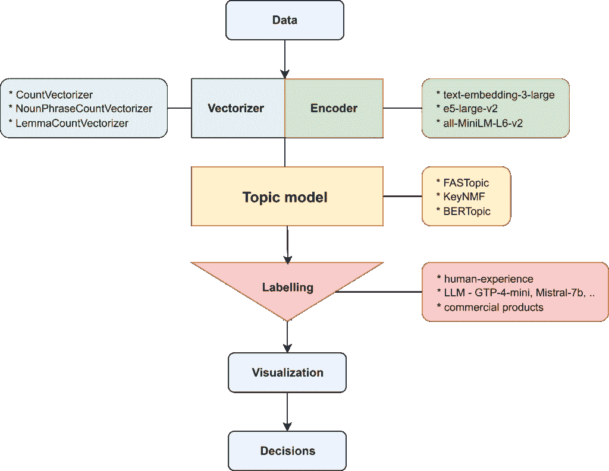
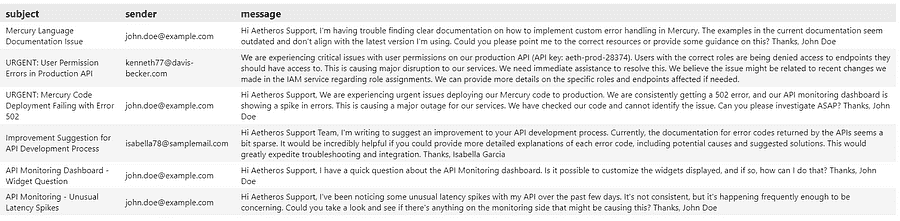
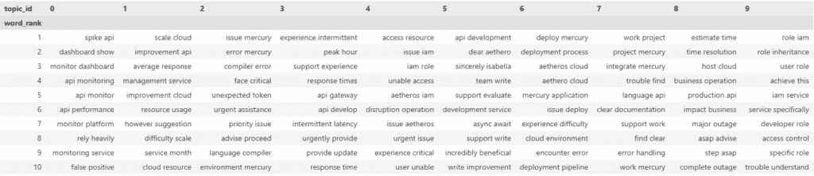
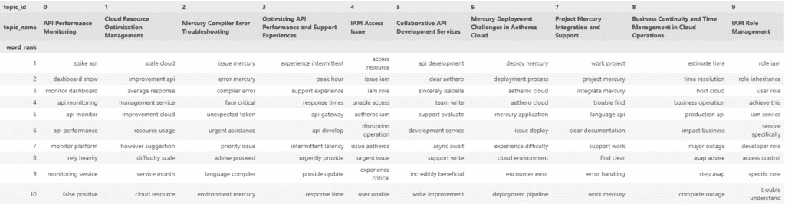
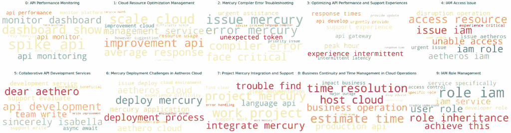

# 使用 LLMs 进行主题模型标注

> 原文：[`towardsdatascience.com/topic-model-labelling-with-llms/`](https://towardsdatascience.com/topic-model-labelling-with-llms/)

**作者**：*Petr Koráb*，*Martin Feldkircher*，**Viktoriya Teliha** (*Text Mining Stories，布拉格，**维也纳国际关系学院**，**澳大利亚应用宏观经济学分析中心**)。

**<mdspan datatext="el1752002640909" class="mdspan-comment">人工标注</mdspan>** 主题模型生成的术语需要领域经验，并且可能对标注者具有主观性。特别是当主题数量增长很大时，使用 LLM 自动为主题分配人类可读的名称可能很方便。简单地将结果复制粘贴到 UI 中，如 [chatgpt.com](https://chatgpt.com)，相当于是“黑盒”且缺乏系统性。更好的选择是将主题标注添加到代码中，使用有文档的标注器，这使工程师对结果有更多的控制权，并确保可重复性。本教程将详细探讨：

+   如何使用全新的 **Turftopic** Python 包训练主题模型

+   如何使用 GPT-4.0 mini 标注主题模型结果

我们将训练一个由 Xiaobao Wu 等人 [3](https://arxiv.org/pdf/2405.17978) 在去年 NeurIPS [4](https://neurips.cc/virtual/2024/poster/96416) 上提出的尖端 **FASTopic** 模型。该模型在几个关键指标（例如，主题多样性）上优于其他竞争模型，如 **BERTopic**，并在商业智能领域有广泛的应用 [5](https://medium.com/data-science/topic-modelling-in-business-intelligence-fastopic-and-bertopic-in-code-2d3949260a37?sk=9a88660d4e4c64a1d91ad8ede730a520)。

## 1. 主题建模流程的组成部分

标注是主题建模流程中的关键部分，因为它将模型输出与实际世界的决策联系起来。模型为每个主题分配一个数字，但商业决策依赖于人类可读的文本标签来总结每个主题中的典型术语。模型通常由以下方式标注：(1) 具有领域经验的标注者，通常使用一个定义良好的标注策略，(2) LLMs，以及(3) 商业工具。通过主题模型从原始数据到决策的路径在图 1 中得到了很好的解释。



图 1. 主题建模流程的组成部分。

来源：改编和扩展自 Kardos 等人 [2]。

管道从原始数据开始，该数据经过预处理和矢量化以用于主题模型。模型返回以整数命名的主题，包括典型术语（单词或二元组）。标签层将主题名称中的整数替换为文本标签。然后，模型用户（[产品经理](https://xenoss.io/blog/topic-modeling-for-business-introduction)，[客户关怀](https://medium.com/text-mining-stories/choose-the-right-one-evaluating-topic-models-for-business-intelligence-1e2f418d7573?sk=3bc07126cc44a1d254fb8a0967702957)部门等）与标记化的术语一起工作，做出基于数据的决策。在下面的建模示例中，我们将逐步进行。

## 2. 数据

我们将使用 FASTopic 将客户投诉数据分类为 10 个主题。示例用例使用 Kaggle 上可用的合成[客户关怀电子邮件](https://www.kaggle.com/datasets/rtweera/customer-care-emails)数据集，该数据集受[GPL-3 许可证](https://www.gnu.org/licenses/gpl-3.0.html)许可。预过滤的数据包括 692 封发送到客户关怀部门的电子邮件，如下所示：



图像 2. [客户关怀电子邮件](https://www.kaggle.com/datasets/rtweera/customer-care-emails)数据集。图像由作者提供。

### 2.1. 数据预处理

文本数据按顺序进行六步预处理。首先删除数字，然后是表情符号。之后删除英语停用词，然后是标点符号。在词干提取之前，删除额外的标记（如公司和个人名称）。有关主题模型文本预处理的更多信息，请参阅我们的[先前教程](https://medium.com/data-science/topic-modelling-in-business-intelligence-fastopic-and-bertopic-in-code-2d3949260a37?sk=9a88660d4e4c64a1d91ad8ede730a520)。

首先，我们读取干净的数据并对数据集进行标记化：

```py
import pandas as pd

# Read data
data = pd.read_csv("data.csv", usecols=['message_clean'])

# Create corpus list
docs = data["message_clean"].tolist()
```


图像 3. 主题模型推荐的清理管道。图像由作者提供。

### 2.2. 二元矢量化

接下来，我们创建一个二元标记器，在模型训练过程中将标记作为二元组处理。二元模型提供了更相关的信息，并能比单字模型更好地识别对商业决策有重要性的关键品质和问题（例如，“delivery”与“poor delivery”，“stomach”与“sensitive stomach”等）。

```py
from sklearn.feature_extraction.text import CountVectorizer

bigram_vectorizer = CountVectorizer(
    ngram_range=(2, 2),               # only bigrams
    max_features=1000                 # top 1000 bigrams by frequency
)
```

## 3. 模型训练

目前，FASTopic 模型在两个 Python 包中实现：

+   [**Fastopic**](https://pypi.org/project/fastopic/): 由 X. Wu 提供的官方包

+   [**Turftopic**](https://pypi.org/project/turftopic/): 一个新 Python 包，提供了许多有用的主题建模功能，包括使用 LLM 进行标签[2]

我们将使用 Turftopic 实现，因为它直接连接到提供 LLM 标签的[Namer](https://x-tabdeveloping.github.io/turftopic/namers/)。

让我们设置模型并将其拟合到数据上。设置随机状态对于确保训练的可重复性至关重要。

```py
from turftopic import FASTopic

# Model specification
topic_size  = 10
model = FASTopic(n_components = topic_size,       # train for 10 topics
                 vectorizer = bigram_vectorizer,  # generate bigrams in topics
                 random_state = 32).fit(docs)     # set random state 

# Fit model to corpus
topic_data = model.prepare_topic_data(docs)
```

现在，让我们准备一个包含主题 ID 和从模型接收到的概率最高的前 10 个二元组的 dataframe（代码[在此](https://github.com/PetrKorab/Topic-Model-Labelling-with-LLMs/blob/main/code.ipynb)）。



图 4. FASTopic 中的未标注主题。图由作者提供。

## 4. 主题标注

在下一步中，我们使用 GPT4-o-mini 给主题 ID 添加文本标签。让我们按照以下步骤进行：

+   创建一个[Open AI 账户](https://auth.openai.com/create-account)并选择一个计费计划（例如，“每月基础版”）

+   设置一个环境变量，使用 OpenAI API 密钥

+   使用[Turftopic 的 Namer](https://x-tabdeveloping.github.io/turftopic/namers)用 LLM 标注主题中的关键词。

使用此代码，我们标注主题并在数据框中添加一个新的行*topic_name*。

```py
from turftopic.namers import OpenAITopicNamer
import os

# OpenAI API key key to access GPT-4
os.environ["OPENAI_API_KEY"] = ""   

# use Namer to label topic model with LLM
namer = OpenAITopicNamer("gpt-4o-mini")
model.rename_topics(namer)

# create a dataframe with labelled topics
topics_df = model.topics_df()
topics_df.columns = ['topic_id', 'topic_name', 'topic_words']

# split and explode
topics_df['topic_word'] = topics_df['topic_words'].str.split(',')
topics_df = topics_df.explode('topic_word')
topics_df['topic_word'] = topics_df['topic_word'].str.strip()

# add a rank for each word within a topic
topics_df['word_rank'] = topics_df.groupby('topic_id').cumcount() + 1

# pivot to wide format
wide = topics_df.pivot(index='word_rank', 
                       columns=['topic_id', 'topic_name'], values='topic_word')
```

这里是经过额外转换后的标注主题表。将 LLM 的结果与熟悉公司流程和客户群的内部人士的结果进行比较将很有趣。数据集是合成的，所以我们依赖 GPT-4 的标注。



图 5. GPT4–o-mini 在 FASTopic 中的标注主题。图由作者提供。

我们还可以可视化标注的主题以获得更好的展示效果。从模型生成的主题中生成的二元组词云可视化的代码[在此](https://github.com/PetrKorab/Topic-Model-Labelling-with-LLMs)。



图 6. GPT4–o-mini 标注的主题词云可视化。图由作者提供。

## 摘要

+   新的 Turftopic Python 包将最近的主题模型与基于 LLM 的标注器[LLM-based labeler](https://x-tabdeveloping.github.io/turftopic/namers/)链接起来，用于生成可读的主题名称。

+   主要好处是：1) 不依赖于标注者的主观经验，2) 能够标注人类标注者可能难以独立标注的大量主题，3) 更多的代码控制和可重复性。

+   使用 LLM 进行主题标注在多个领域有着广泛的应用。阅读我们关于中央银行沟通主题建模的最新论文[《我们的最新论文》](https://crawford.anu.edu.au/sites/default/files/2025-06/35_2025_Feldkircher_Korab_Teliha_1.pdf)，其中 GPT-4 对 FASTopic 模型进行了标注。

+   即使有随机状态，每个训练的标签也略有不同。这不是由 Namer 引起的，而是由模型训练中的随机过程引起的，这些过程以降序输出带有概率的二元组。概率的差异在很小的小数中，因此每次训练都会在顶部 10 个中生成几个新术语，这然后会影响 LLM 标注器。

本教程的数据和完整代码[在此](https://github.com/PetrKorab/Topic-Model-Labelling-with-LLMs)。

***Petr Korab**是一位资深数据分析师和[Text Mining Stories](https://textminingstories.com/)的创始人，拥有超过八年的商业智能和 NLP 经验。*

*注册[我们的博客](https://textminingstories.com/blog)以获取 NLP 行业的最新消息！*

## 参考文献

[1] Feldkircher, M., Korab, P., Teliha, V., (2025).“[中央银行家们谈论了什么？来自 BIS 档案的证据](https://ideas.repec.org/p/een/camaaa/2025-35.html),” CAMA Working Papers 2025–35, Centre for Applied Macroeconomic Analysis, Crawford School of Public Policy, The Australian National University.

[2] Kardos, M., Enevoldsen, K. C., Kostkan, J., Kristensen-McLachlan, R. D., Rocca, R. (2025). Turftopic: 基于 Sentence Transformers 的上下文表示的主题建模。*开源软件杂志*，10(111)，8183，[`doi.org/10.21105/joss.08183`](https://doi.org/10.21105/joss.08183).

[3] Wu, X, Nguyen, T., Ce Zhang, D., Yang Wang, W., Luu, A. T. (2024). FASTopic: [一种快速、自适应、稳定且可迁移的主题建模范式](https://arxiv.org/abs/2405.17978). arXiv 预印本：2405.17978.
