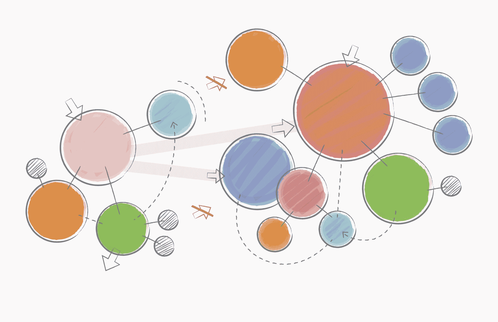
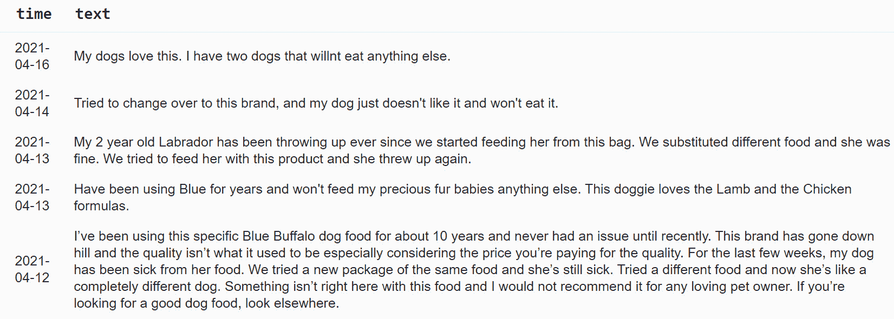
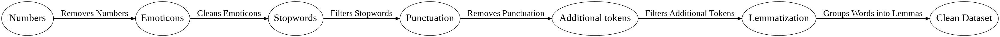
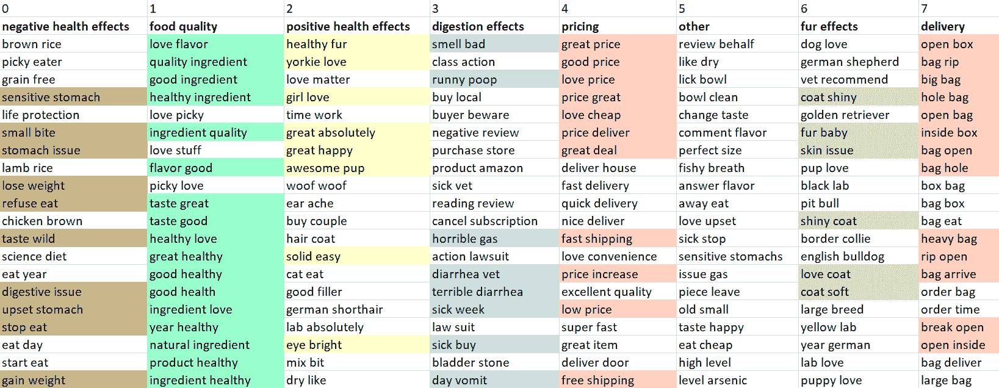
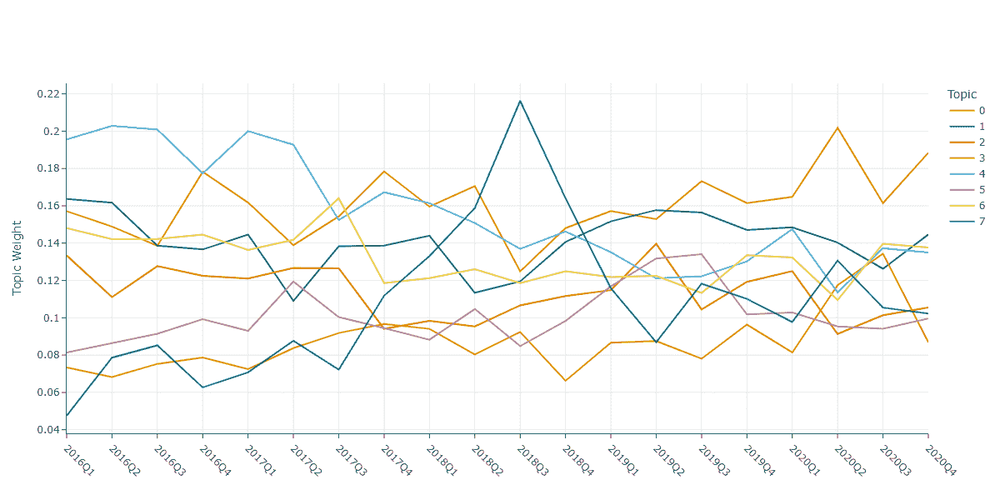
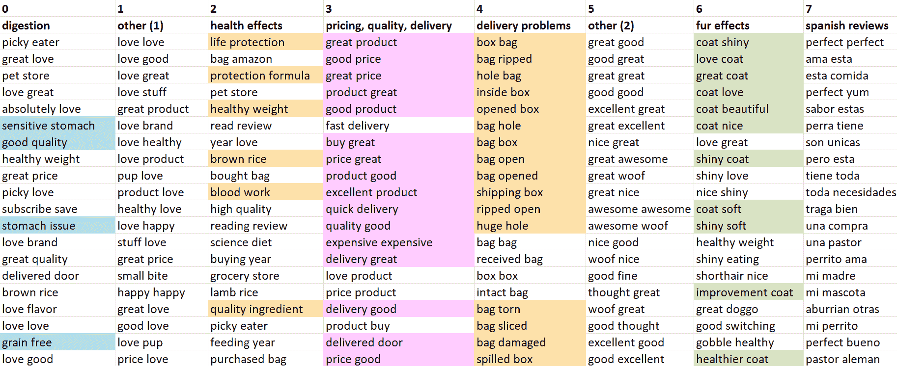
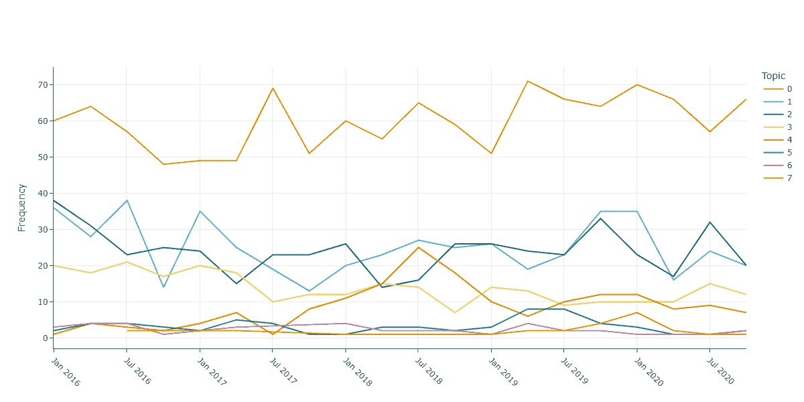

# 商业智能中的主题建模：代码中的 FASTopic 和 BERTopic

> 原文：[`towardsdatascience.com/topic-modelling-in-business-intelligence-fastopic-and-bertopic-in-code-2d3949260a37/`](https://towardsdatascience.com/topic-modelling-in-business-intelligence-fastopic-and-bertopic-in-code-2d3949260a37/)

商业智能中的主题建模：代码中的 FASTopic 和 BERTopic



来源：[Freepic](https://www.freepik.com/free-vector/illustration-network-shareing_2808109.htm#fromView=search&page=2&position=3&uuid=c11e1dc6-4be2-45d5-9c7b-29bc16bc69f0)，图片由 rawpixel.com 提供

**客户评价**关于产品和服务的评价提供了关于客户满意度的宝贵信息。它们提供了关于整个产品开发中应该改进什么的见解。商业智能中的动态主题模型可以识别关键产品品质和其他满意度因素，将它们聚类成类别，并评估业务决策如何随着时间的推移在客户满意度中体现。这对产品经理来说是非常有价值的信息。

本文将比较两种最新的主题模型来分类客户投诉数据。由[Maarten Grootendorst (2022)](https://arxiv.org/pdf/2203.05794)提出的**BERTopic**和去年在[NeurIPS](https://neurips.cc/virtual/2024/poster/96416)上提出的最新**[FASTopic](https://pypi.org/project/fastopic/)**，是目前客户数据分析主题分析的前沿模型。对于这些模型，我们将用 Python 代码进行探索：

+   如何有效地**预处理数据**

+   如何训练一个**二元主题模型**用于客户投诉分析

+   如何对**主题活动**进行建模。

# 1. 公司的客户投诉数据

投诉数据是通过与客户的互动产生的，通常记录在[ERP 系统](https://www.sap.com/products/erp/what-is-erp.html)中。客户可以提出关于产品或服务的担忧的渠道有很多。以下只是其中的一些例子：

+   **电子邮件**：电子邮件通信被存储在 BI 团队使用的 SQL 数据库中。

+   **售后服务调查**：在产品购买后发送给客户的反馈。公司要么自己发送电子邮件，要么使用价格比较网站（例如，德国的[Billiger](https://www.billiger-mietwagen.de/)），客户在那里订购产品。

+   **电话录音**：在获得客户事先同意后，一些公司会记录与客户的电话通信，然后这些通信对 BI 团队可用。

+   **谷歌评价**：客户在全世界的产品和服务上留下评论和评价。谷歌允许授权用户[导出数据](https://takeout.google.com/?pli=1)，不仅用于文本挖掘目的。

+   **评论平台：** 独立评论平台 ****（例如 [Trustpilot](https://www.trustpilot.com/)）为顾客提供了一个向品牌和公司提供反馈的地方。这些数据可以通过 [各种 API](https://developers.trustpilot.com/service-reviews-api) 获取。

+   **社交媒体** **对话**：Instagram、X 和 Facebook 充满了产品或品牌相关的评论。最简单的方法是使用官方 API 来收集数据。对于 Instagram 和 Facebook，请访问 [开发者门户](https://developers.facebook.com/) 获取 API 密钥。X 的工作方式 [相同](https://developer.x.com/en/docs/x-api)。

## 2. 示例数据

作为示例数据，我们将使用 **[亚马逊狗粮评论](https://huggingface.co/datasets/NiyatiC/amazon_food_reviews)** 数据集，该数据集由 **Hugging Face** 发布，遵循 [Apache-2.0 许可协议](https://github.com/huggingface/datasets/blob/main/LICENSE)。用于主题建模的子集仅包含 3693 条在 02/01/2016 至 31/12/2020 期间收集的客户评论。以下是数据的外观：



图像 1. 亚马逊狗粮评论数据集



图像 2. (客户反馈)主题建模的一般预处理步骤。图由作者提供

## 3. 数据预处理

按照正确的顺序系统地处理数据可以保留关键信息，而不会添加新的偏差。让我们按照以下步骤进行：

+   ***#1: 数字：*** 通常在第一步中移除的是数字字符。

+   ***#2: 表情符号：*** 产品评论通常充满了它们。在客户评论的主题建模中，表情符号没有太多意义。

+   ***#3: 停用词：*** 除了 [标准停用词](https://www.geeksforgeeks.org/removing-stop-words-nltk-python/) 之外，通常还会移除一个 [扩展](https://github.com/PetrKorab/Arabica/blob/main/stopwords_extended.py) 停用词列表，用于一种或多种语言。

+   ***#4: 标点符号：*** 通用语言中有无数的特殊字符和标点符号，这些应该在这一步中清理。

+   ***#5: 额外停用词：*** 根据用例，一些额外的单词也有助于移除。在亚马逊狗粮评论中，这些是 *"dog"，"food"，"blue"，"buffalo"，"ha"，"month"*, 和 *"ago"。*

> "Delivery" 和 "deliveries"，"box" 和 "Boxes"，或 "Price" 和 "prices" 具有相同的词根，但如果没有词形还原，主题模型会将它们建模为不同的因素。这就是为什么产品评论应该在预处理步骤的最后一步进行词形还原。

+   ***#6: 词形还原：*** 将单词组合成单一形式（词干），保留单词的词根信息和语义。

文本预处理是针对特定模型的：

+   ***FASTopic*** 在输入数据上使用干净的数据；一些清洁（停用词）可以在训练期间完成。最简单且最有效的方法是使用 ***[Washer：无代码文本数据清洗应用](https://washer.textminingstories.com/)***，它提供了一种无代码处理数据用于文本挖掘项目的方法。

+   ***BERTopic：*** 文档[说明](https://maartengr.github.io/BERTopic/faq.html#how-do-i-reduce-topic-outliers)建议“在预处理步骤中移除停用词是不推荐的，因为我们使用的基于 transformer 的嵌入模型需要完整的上下文来创建准确的嵌入”。它使用基于真实文本的 transformer，而不是没有停用词、词元或标记的清洁文本。因此，清洁操作应包含在模型训练中。


来源：[Freepic](https://www.freepik.com/free-vector/romantic-train-trip-background_5972223.htm#fromView=search&page=1&position=24&uuid=1b2ccb61-1b56-453e-b67a-befe1eba6858)，图片由 macrovector 提供

## 4\. 使用顶级模型进行主题建模

现在我们来检查满意度因素在各个主题中的分布情况。我们在这里提出的问题是：

+   *客户报告的产品中的关键问题和优点是什么？*

+   *产品满意度随时间如何变化？*

[BERTopi](https://arxiv.org/pdf/2203.05794)c 和 [FASTopic](https://arxiv.org/pdf/2405.17978) 论文详细描述了模型架构。此外，我的关于主题建模的 [TDS 教程](https://towardsdatascience.com/topic-modelling-with-berttopic-in-python-8a80d529de34) 解释了在政治演讲数据集上使用 BERTopic 进行主题分类。

### 4.1\. FASTopic

导入库和数据（完整代码和需求[在此](https://github.com/PetrKorab/Topic-Modelling-in-Business-Intelligence-BERTopic-and-FASTopic-in-Code/tree/main)）。然后，创建一个干净的评论列表：

```py
import pandas as pd
from fastopic import FASTopic
from sklearn.feature_extraction.text import CountVectorizer 
from topmost.preprocessing import Preprocessing             

# create a list of reviews
docs = data['clean_text'].tolist()
```

在 FASTopic 中，bigram 生成不是直接实现的。为了解决这个问题，我们将创建一个 bigram 预处理类。该模型以与单个标记相同的方式处理 bigram，因此我们使用下划线将 bigram 中的单词连接起来。

```py
# custom preprocessing class with bigram generation
class NgramPreprocessing:
    def __init__(self, ngram_range=(1, 1), 
                       vocab_size=10000, 
                       stopwords='English'): 

        self.ngram_range = ngram_range
        self.preprocessing = Preprocessing(vocab_size=vocab_size, 
                                           stopwords=stopwords)

        # use a custom analyzer to join bigrams with "_"
        self.vectorizer = CountVectorizer(ngram_range=self.ngram_range, 
                                          max_features=vocab_size, 
                                          analyzer=self._custom_analyzer)

        # custom analyzer function to join bigrams with underscores
    def _custom_analyzer(self, doc):
        # tokenize the document and create bigrams
        tokens = CountVectorizer(ngram_range=self.ngram_range).build_analyzer()(doc)

        # replace spaces in bigrams with "_"
        return [token.replace(" ", "_") for token in tokens]

    def preprocess(self, 
                   docs, 
                   pretrained_WE=False):

        parsed_docs = self.preprocessing.preprocess(docs, 
                      pretrained_WE=pretrained_WE)["train_texts"]
        train_bow = self.vectorizer.fit_transform(parsed_docs).toarray()
        rst = {
            "train_bow": train_bow,
            "train_texts": parsed_docs,
            "vocab": self.vectorizer.get_feature_names_out()
        }
        return rst

# initialize preprocessing with bigrams
ngram_preprocessing = NgramPreprocessing(ngram_range=(2, 2))
```

让我们训练模型以八个主题为目标，并在数据框中显示每个主题的前 20 个 bigram。我们首先在单个标记上训练，然后删除下划线以生成 bigram。

```py
# model training
model = FASTopic(8, ngram_preprocessing, num_top_words=10000)

# fit model to documents
topic_top_words, doc_topic_dist = model.fit_transform(docs)

# retrieve 20 bigrams for each topic
import pandas as pd

max_bigrams = 20

# Retrieve the bigrams for each topic and select only the word columns
topic_0 = pd.DataFrame(model.get_topic(0, max_bigrams), columns=["Topic_0_word", "Topic_0_prob"])[["Topic_0_word"]]
topic_1 = pd.DataFrame(model.get_topic(1, max_bigrams), columns=["Topic_1_word", "Topic_1_prob"])[["Topic_1_word"]]
topic_2 = pd.DataFrame(model.get_topic(2, max_bigrams), columns=["Topic_2_word", "Topic_2_prob"])[["Topic_2_word"]]
topic_3 = pd.DataFrame(model.get_topic(3, max_bigrams), columns=["Topic_3_word", "Topic_3_prob"])[["Topic_3_word"]]
topic_4 = pd.DataFrame(model.get_topic(4, max_bigrams), columns=["Topic_4_word", "Topic_4_prob"])[["Topic_4_word"]]
topic_5 = pd.DataFrame(model.get_topic(5, max_bigrams), columns=["Topic_5_word", "Topic_5_prob"])[["Topic_5_word"]]
topic_6 = pd.DataFrame(model.get_topic(6, max_bigrams), columns=["Topic_6_word", "Topic_6_prob"])[["Topic_6_word"]]
topic_7 = pd.DataFrame(model.get_topic(7, max_bigrams), columns=["Topic_7_word", "Topic_7_prob"])[["Topic_7_word"]]

# concatenate the dataframes
topics_df = pd.concat([topic_0,topic_1, topic_2, topic_3, topic_4,topic_5,topic_6,topic_7], axis=1)

# remove underscores from bigrams
topics_df = topics_df.applymap(lambda x: x.replace('_', ' ') if isinstance(x, str) else x)
```

我们使用狗粮产品对客户满意度因素进行了八个不同主题的建模。以下是手动标注的主题名称：



图 3：使用 FASTopic 进行满意度因素建模。图片由作者提供

FASTopic 返回相对独特的话题，对客户的评论进行排序：

+   **0：负面健康影响，** *"敏感的胃"，"小咬"，"胃问题"，"减肥"，"拒绝进食"，"味道野生"，"消化问题"，"胃部不适"，"停止进食"，"增重"*

+   **1: 食品质量，** *"喜欢口味", "优质成分", "好成分", "健康成分", "成分质量", "口味好", "味道好", "健康喜欢", "健康好", "好健康", "好健康", …*

+   **2: 正面健康效果，** *"健康的皮毛", "棒棒的狗狗", "眼睛明亮"*

+   **3: 消化效果，** *"气味难闻", "稀便", "可怕的气体", "腹泻兽医", "可怕的腹泻", "生病的一周", "生病购买", "一天呕吐"*

+   **4: 定价，** *"好价格", "好价格", "爱的价格", "价格好", "便宜爱", "价格交付", "大优惠", "价格上涨", "免费送货", …*

+   **5: 其他，**其他因素。

+   **6: 毛发效果，** *"皮毛闪亮", "毛孩子", "皮肤问题", "闪亮的皮毛", "爱的皮毛", "柔软的皮毛"*

+   **7: 交付，** *"打开盒子", "袋子撕裂", "大袋子", "袋子有洞", "打开袋子", "盒子内部", "袋子打开", "袋子有洞", "重的袋子", "撕裂打开", …*

检查这些类别在数据中的权重也是有用的。完整代码[在这里](https://github.com/PetrKorab/Topic-Modelling-in-Business-Intelligence-BERTopic-and-FASTopic-in-Code/blob/main/FASTopic.ipynb)。

> 我们已经用狗粮产品对客户满意度因素进行了建模。但这对公司有什么好处？动态主题模型提供了一种简单直接的方法来监控客户满意度随时间的变化。它们表明产品相关的问题，并有助于采取正确的措施。一旦业务决策付诸实施，主题模型将检查它们是否随时间产生影响。

为了做到这一点，让我们以季度频率对主题活动进行建模。

```py
import plotly.graph_objects as go

# convert date column to datetime
data['time'] = pd.to_datetime(data['time'])

# format date column to quarterly periods
data['date_quarterly'] = data['time'].dt.to_period('Q').astype(str)

periods = data['date_quarterly'].tolist()

# calculate topic activity over time
act = model.topic_activity_over_time(periods)

# visualize topic activity
fig = model.visualize_topic_activity(top_n=8, topic_activity=act, time_slices=periods)

# update legend to display only the topic number
fig.data = sorted(fig.data, key=lambda trace: trace.name)

for trace in fig.data:
    trace.name = trace.name[0]

# update the layout
fig.update_layout(
    width=1200,
    height=600,
    title='',
    legend_title_text='Topic',
    xaxis_tickangle=45         # set x-axis labels to 45-degree angle
)

# show the figure
fig.show()
```

主题 7 的交付问题在 2018 年第三季度达到顶峰。客户经常抱怨打开和撕裂的盒子，但这些问题在 2019 年初得到解决（见下图）。



图 4：主题活动随时间变化，FASTopic。图由作者提供。

### 4.2. BERTopic

BERTopic 使用 _[vectorizer_model](https://scikit-learn.org/1.5/modules/generated/sklearn.feature_extraction.text.CountVectorizer.html)_ 实现二元组，它也作为一个数据处理管道。代码和需求[在这里](https://github.com/PetrKorab/Topic-Modelling-in-Business-Intelligence-BERTopic-and-FASTopic-in-Code/tree/main)。

```py
from bertopic import BERTopic
from umap import UMAP
from sklearn.feature_extraction.text import CountVectorizer
from nltk.corpus import stopwords
import nltk
from nltk import word_tokenize          
from nltk.stem import WordNetLemmatizer
import pandas as pd
import re

nltk.download('stopwords')

# create a list of speeches
docs = data['text'].tolist()
```

我们在原始数据上训练，并用向量器对其进行清理。在训练过程中，向量器从数据中清除数字和停用词，为二元组模型返回词元化标记。

```py
# create stopwords list
standard_stopwords = list(stopwords.words('english'))

# extended list of English stopwords
stopwords_extended = [ "0o",  ..]      

# additional tokens to remove
additional_stopwords = ['blue','buffalo','dog','food','ha','month','ago'] 

# combine standard, extended stopwords, and additional tokens
full_stopwords = standard_stopwords 
                 + additional_stopwords
                 + stopwords_extended

# define tokenizer retrurning lemmatized text without numbers
class LemmaTokenizer:
    def __init__(self):
        self.wnl = WordNetLemmatizer()
    def __call__(self, doc):
        doc = re.sub(r'd+', '', doc)  # clean numbers
        return [self.wnl.lemmatize(t) for t in word_tokenize(doc)] # lemmatize

# vectorizer makes data processing and generates bigrams
vectorizer_model = CountVectorizer(tokenizer=LemmaTokenizer(),
                                  ngram_range=(2, 2),
                                  stop_words=full_stopwords)

# set-up model
model = BERTopic(n_gram_range=(2,2), # returns bigrams
                nr_topics=9,         # generate 9 topics, leave -1 for outliers
                top_n_words=20,      # return top 20 bigrams
                min_topic_size=20,   # topics contains at least 20 tokens
                vectorizer_model=vectorizer_model,
                umap_model = UMAP(random_state=1))  # setting seed topics reproduce

# fit model to data
topics, probabilities = model.fit_transform(docs)
```

接下来，让我们准备一个包含模型标记的分数据框。

```py
import pandas as pd

# retrieve bigrams for each topic and select only the word columns
topic_0 = pd.DataFrame(model.get_topic(0), columns=["Topic_0_word", "Topic_0_prob"])[["Topic_0_word"]]
topic_1 = pd.DataFrame(model.get_topic(1), columns=["Topic_1_word", "Topic_1_prob"])[["Topic_1_word"]]
topic_2 = pd.DataFrame(model.get_topic(2), columns=["Topic_2_word", "Topic_2_prob"])[["Topic_2_word"]]
topic_3 = pd.DataFrame(model.get_topic(3), columns=["Topic_3_word", "Topic_3_prob"])[["Topic_3_word"]]
topic_4 = pd.DataFrame(model.get_topic(4), columns=["Topic_4_word", "Topic_4_prob"])[["Topic_4_word"]]
topic_5 = pd.DataFrame(model.get_topic(5), columns=["Topic_5_word", "Topic_5_prob"])[["Topic_5_word"]]
topic_6 = pd.DataFrame(model.get_topic(6), columns=["Topic_6_word", "Topic_6_prob"])[["Topic_6_word"]]
topic_7 = pd.DataFrame(model.get_topic(7), columns=["Topic_7_word", "Topic_7_prob"])[["Topic_7_word"]]

# concatenate the dataframes
topics_df = pd.concat([topic_0, topic_1, topic_2, topic_3, topic_4, 
                       topic_5, topic_6,topic_7], axis=1)
```

注释的主题显示与 FASTopic 相似的分类。不同之处在于将西班牙语标记分类到单独的主题（T7），并在 T1 和 T5 中填充具有积极意义的形容词。T4 中的交付问题与 FASTopic 的分类相同。



图 5：使用 BERTopic 进行满意度因素建模。图由作者提供

再次，让我们关注主题随时间的变化，这为动态主题模型在商业智能中提供了额外的价值。BERTopic 使用标记频率（而不是 FASTopic 中的主题权重）进行主题活动分析。

```py
# topic activity over time
import plotly.graph_objects as go

# create timestamps
data['time'] = pd.to_datetime(data['time'])
timestamps = data['time'].to_list()

# generate topics over time, 20 bins correspond to Q frequency
topics_over_time = model.topics_over_time(docs, timestamps, nr_bins=20)

# filter out topic -1 containing outliers
topics_over_time_filtered = topics_over_time[topics_over_time['Topic'] != -1]

# visualize the filtered topics over time
fig = model.visualize_topics_over_time(topics_over_time_filtered)

# update legend to display only the topic number
fig.data = sorted(fig.data, key=lambda trace: trace.name)

for trace in fig.data:
    trace.name = trace.name[0]

# update the layout
fig.update_layout(
    width=1200,
    height=600,
    title='',
    legend_title_text='Topic',
    xaxis_tickangle=45           # set x-axis labels to 45-degree angle
)

# show the figure
fig.show()
```

大多数主题随着时间的推移保持稳定，除了 T4，它将配送问题分类。与 FASTopic 类似，BERTopic 显示客户对损坏箱子的负面投诉在 2018 年中旬有所增加。



图像 6：BERTopic 随时间变化的主题活动。图由作者提供。

## 摘要

两个模型都在 2018 年中旬指出了配送问题，这些问题在 2019 年初消失。通过一个主题模型 API 监控各种渠道的客户评论，这些问题可以在它们对品牌造成有害影响之前得到解决。

正确的 **数据处理** 对于主题模型在应用世界中具有意义至关重要。按照正确的顺序清理文本可以最小化每个清理操作的偏差。通常首先移除数字和表情符号，然后是停用词。之后清理标点符号，这样停用词就不会被分成两个标记（"we’ve" -> "we" + ‘ve'）。在词形还原之前，下一步移除清洁数据中的额外标记，以统一具有相同语义的标记。

**FASTopic** 值得更好的 [文档](https://github.com/BobXWu/FASTopic)，目前它只提供了基本的信息。特别是由于其（1）使用简便和（2）在小数据集上训练的稳定性，使其成为 BERTopic 的顶级替代品。它主要适用于像网店这样的小型公司，这些公司通常不收集大量文本数据集，并寻求简单高效解决方案。本教程的数据和完整代码 [在此](https://github.com/PetrKorab/Topic-Modelling-in-Business-Intelligence-BERTopic-and-FASTopic-in-Code/tree/main)。

*如果您喜欢我的工作，您可以邀请我 [喝咖啡](https://www.buymeacoffee.com/petrkorab) 并支持我的写作。您还可以订阅我的 [邮件列表](https://medium.com/subscribe/@petrkorab)，以获取关于我新文章的通知。谢谢！*

## 参考文献

[1] Grootendorst (2022). Bertopic: 基于类别的 TF-IDF 程序的神经主题建模。*[计算机科学](https://arxiv.org/abs/2203.05794)*

[2] Wu, X, Nguyen, T., Ce Zhang, D., Yang Wang, W., Luu, A. T. (2024). FASTopic: [一种快速、自适应、稳定且可迁移的主题建模范式](https://arxiv.org/abs/2405.17978). arXiv 预印本：2405.17978。
