# Torchvista：为笔记本构建的交互式 Pytorch 可视化包

> 原文：[`towardsdatascience.com/torchvista-building-an-interactive-pytorch-visualization-package-for-notebooks/`](https://towardsdatascience.com/torchvista-building-an-interactive-pytorch-visualization-package-for-notebooks/)

## <mdspan datatext="el1753296200159" class="mdspan-comment">简介</mdspan>

在这篇帖子中，我讨论了构建 torchvista 的动机、复杂性和实现细节，torchvista 是一个开源包，可以从基于网络的笔记本中交互式地可视化任何 Pytorch 模型的正向传递。

在阅读这篇帖子时，为了了解 torchvista 的工作原理，你可以查看：

+   如果你想要通过`pip`安装它并从基于网络的笔记本（Jupyter、Colab、Kaggle、VSCode 等）中使用，请访问[**Github 页面**](https://github.com/sachinhosmani/torchvista)

+   一个包含各种知名模型可视化的交互式[**演示页面**](https://sachinhosmani.github.io/torchvista/)

+   一个[**Google Colab**](https://colab.research.google.com/drive/1wrWKhpvGiqHhE0Lb1HnFGeOcS4uBqGXw?usp=sharing)教程

+   一个视频演示：

## **动机**

Pytorch 模型可以变得非常大且复杂，仅从代码中理解一个模型可能是一项繁琐甚至难以实现的练习。拥有一个类似图形的可视化正是我们使这一过程更容易所需的。

尽管存在 Netron、pytorchviz 和 torchview 等工具使这一过程变得更容易，但我构建 torchvista 的动机是，我发现它们在某些或所有这些要求上有所欠缺：

+   **交互支持**：可视化的图应该是交互式的，而不是静态图像。它应该是一个你可以缩放、拖动、展开/折叠等的结构。模型可以变得非常大，如果你看到的是巨大的静态图像，你如何真正地探索它？

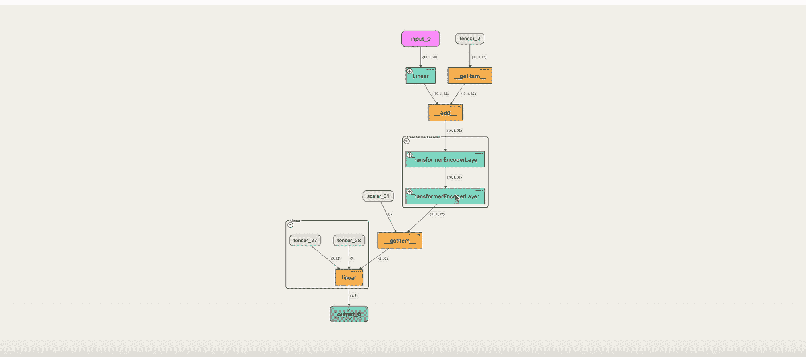

拖动和缩放以探索大型模型

+   **模块化探索**：大型 Pytorch 模型在思想和实现上都是模块化的。例如，考虑一个包含几个`Attention`块的`Sequential`模块，这些块反过来又包含具有激活函数的`Linear`层的全连接块。该工具应允许你深入到这种模块化结构中，而不仅仅是展示低级别的张量链接图。

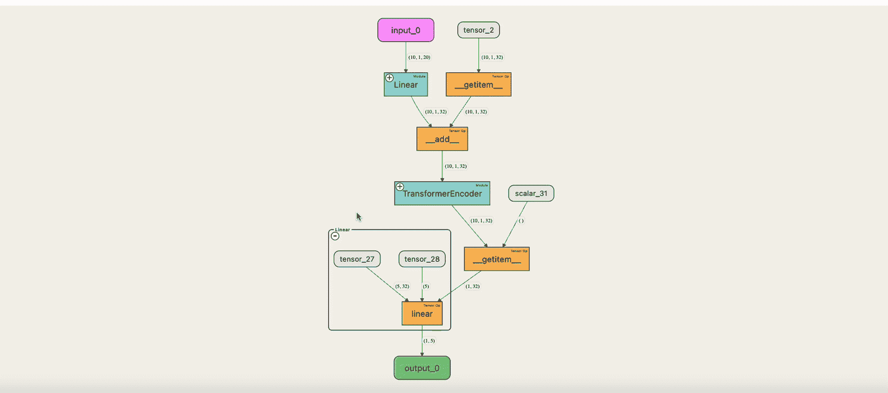

以模块化方式扩展模块

+   **笔记本支持**：我们倾向于在笔记本中原型设计和构建我们的模型。如果有一个作为独立应用程序的工具，需要你构建模型并加载以进行可视化，那么反馈循环就太长了。因此，工具理想情况下需要在笔记本内部工作。

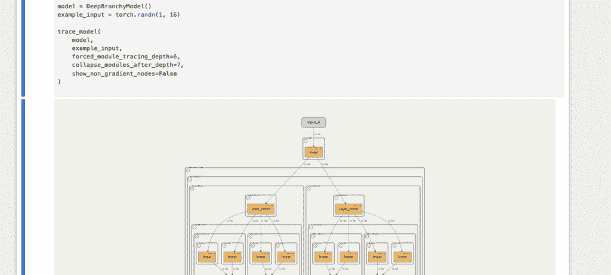

在 Jupyter 笔记本中进行可视化

+   **错误调试支持**：在从头开始构建模型时，我们经常遇到许多错误，直到模型能够从头到尾运行完整的正向传递。因此，可视化工具应该具有容错性，即使在出现错误的情况下也能显示部分可视化图，这样你就可以调试错误。

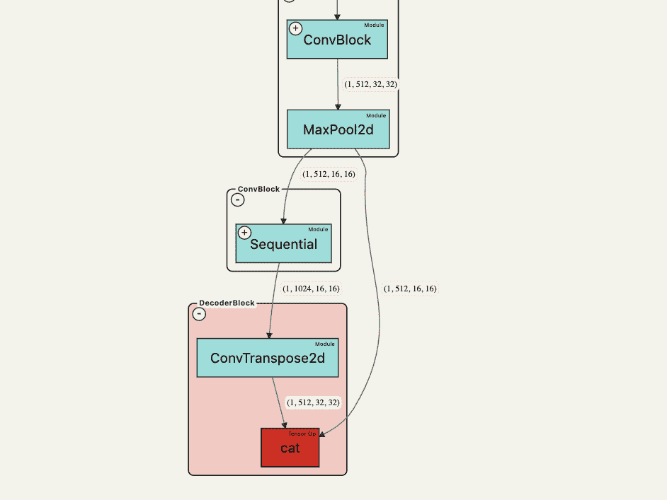

当 `torch.cat` 由于张量形状不匹配而失败时的示例可视化

+   **正向传递追踪**：Pytorch 通过其 autograd 系统原生地暴露了反向传递图，该包 [pytorchviz](https://github.com/szagoruyko/pytorchviz) 将其作为图暴露，但这与正向传递不同。当我们构建、研究和想象模型时，我们更多地考虑正向传递，这可以非常有用进行可视化。

## 构建 torchvista

### 基本 API

目标是拥有一个简单的 API，它可以与几乎任何 Pytorch 模型一起工作。

```py
import torch
from transformers import XLNetModel
from torchvista import trace_model

model = XLNetModel.from_pretrained("xlnet-base-cased")
example_input = torch.randint(0, 32000, (1, 10))

# Trace it!
trace_model(model, example_input)
```

通过一行代码调用 `trace_model(<model_instance>, <input>)`，它应该只生成正向传递的交互式可视化。

### 涉及的步骤

在幕后，torchvista 在调用时分为两个阶段：

1.  **追踪**：这是 torchvista 从模型的正向传递中提取图数据结构的地方。Pytorch 并没有天生暴露这个图结构（尽管它确实暴露了反向传递的图），所以 torchvista 必须自己构建这个数据结构。

1.  **可视化**：一旦提取了图，torchvista 就必须生成实际的交互式图作为可视化。torchvista 的追踪器通过加载嵌入 JS 的模板 HTML 文件，并将序列化的图数据结构对象作为字符串注入模板中，然后由浏览器引擎加载来实现这一点。

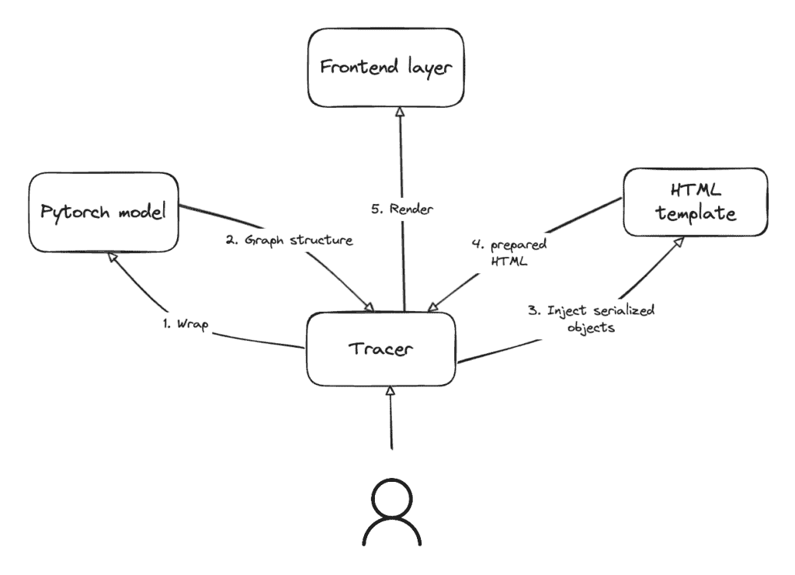

trace_model() 的幕后

### 追踪

追踪本质上是通过（临时地）包装所有重要的已知张量操作和标准 Pytorch 模块来完成的。包装的目标是修改函数，以便在调用时，它们会额外执行追踪所需的账目记录。

#### 图的结构

从模型中提取的图是一个有向图，其中：

+   节点是各种张量操作和在正向传递期间调用的各种内置 Pytorch 模块。

    +   此外，输入和输出张量以及常量值张量也是图中的节点。

+   从前一个节点到后一个节点的每个张量都存在一个边。

+   边标签是相关张量的维度。

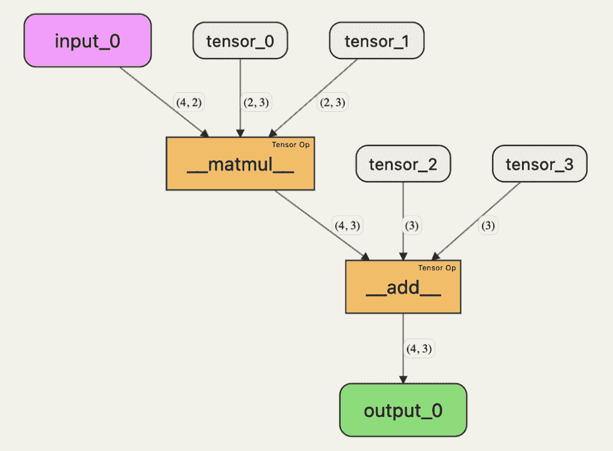

以操作和输入/输出/常量张量作为节点，以及每个发送的张量都有一个边的示例图，边标签设置为张量的维度

但是，我们图表的结构可能更加复杂，因为大多数 Pytorch 模块调用张量操作，有时还会调用其他模块的 `forward` 方法。这意味着我们必须维护一个包含信息的图表结构，以便在任何深度级别上可视化探索。

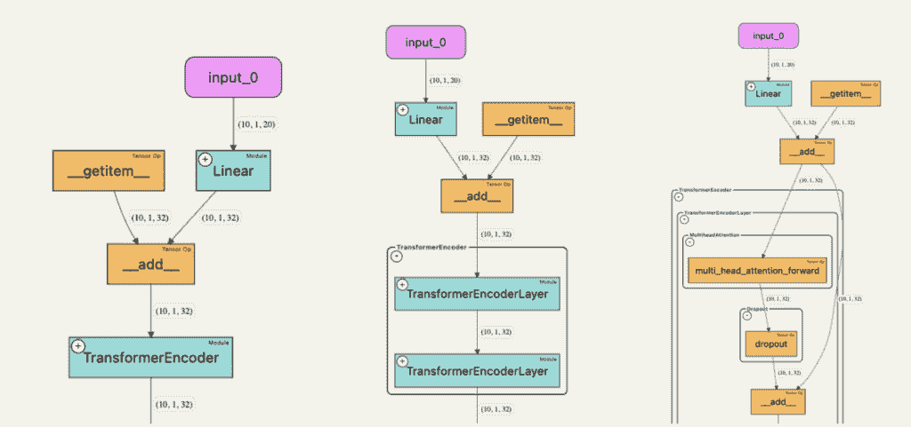

展示不同深度的嵌套模块的例子：TransformerEncoder 使用 TransformerEncoderLayer，它调用 multi_head_attention_forward、dropout 和其他操作。

因此，torchvista 提取的结构包括两个主要的数据结构：

+   最低级别操作/模块的邻接表，这些操作/模块被调用。

```py
input_0 -> [ linear ]
linear -> [ __add__ ]
__getitem__ -> [ __add__ ]
__add__ -> [ multi_head_attention_forward ]
multi_head_attention_forward -> [ dropout ]
dropout -> [ __add__ ]
```

+   将每个节点映射到其父模块容器（如果存在）的层次结构图

```py
linear -> Linear
multi_head_attention_forward -> MultiheadAttention
MultiheadAttention -> TransformerEncoderLayer
TransformerEncoderLayer -> TransformerEncoder
```

通过这两个，我们能够在可视化层构建任何所需的正向传递视图。

#### 包装操作和模块

包装背后的整个想法是在实际操作前后做一些记录，以便当操作被调用时，我们的包装函数被调用，并执行记录。记录的目标是：

+   根据张量引用记录节点之间的连接。

+   记录张量维度，以显示为边标签。

+   记录模块层次结构，以处理模块嵌套的情况

这里是一个简化的代码片段，说明包装是如何工作的：

```py
original_operations = {}
def wrap_operation(module, operation):
  original_operations[get_hashable_key(module, operation)] = operation
  def wrapped_operation(*args, **kwargs):
    # Do the necessary pre-call bookkeeping
    do_pre_call_bookkeeping()

    # Call the original operation
    result = operation(*args, **kwargs)

    do_post_call_bookkeeping()

    return result
  setattr(module, func_name, wrapped_operation)

for module, operation in LONG_LIST_OF_PYTORCH_OPS:
  wrap_operation(module, operation) 
```

当 trace_model 即将完成时，我们必须将一切重置回其原始状态：

```py
for module, operation in LONG_LIST_OF_PYTORCH_OPS:
  setattr(module, func_name, original_operations[get_hashable_key(module,
    operation)])
```

这同样适用于内置 Pytorch 模块的 `forward()` 方法，如 `Linear`、`Conv2d` 等。

#### 节点之间的连接

如前所述，如果从节点 A 发送张量到节点 B，则两个节点之间存在边。这构成了在构建图表时创建节点之间连接的基础。

这里是一个简化的代码片段，说明它是如何工作的：

```py
adj_list = {}
def do_post_call_bookkeeping(module, operation, tensor_output):
  # Set a "marker" on the output tensor so that whoever consumes it
  # knows which operation produced it
  tensor_output._source_node = get_hashable_key(module, operation)

def do_pre_call_bookkeeping(module, operation, tensor_input):
  source_node = tensor_input._source_node

  # Add a link from the producer of the tensor to this node (the consumer)
  adj_list[source_node].append(get_hashable_key(module, operation)) 
```

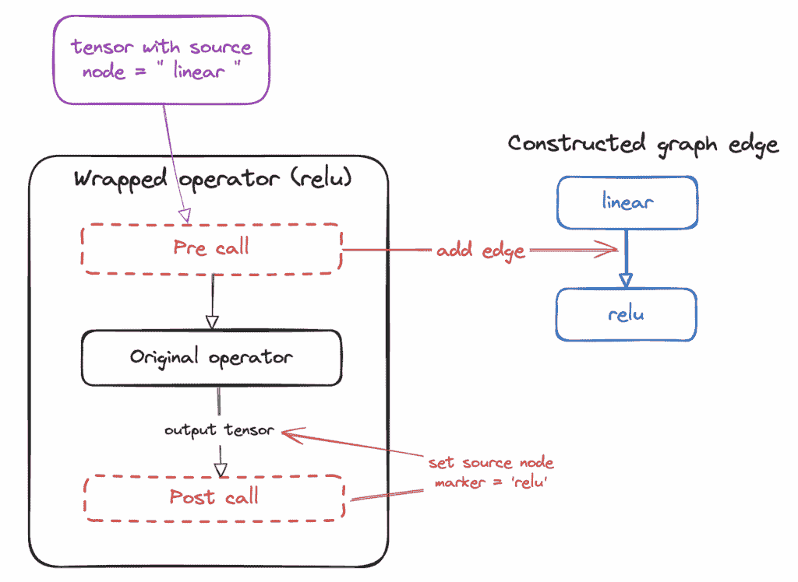

图边是如何创建的

#### 模块层次结构图

当我们包装模块时，为了构建模块层次结构图，必须做一些不同的处理。想法是维护一个模块调用栈，以便栈顶始终代表层次结构图中的直接父级。

这里是一个简化的代码片段，说明它是如何工作的：

```py
hierarchy_map = {}
module_call_stack = []
def do_pre_call_bookkeeping_for_module(package, module, tensor_output):
  # Add it to the stack
  module_call_stack.append(get_hashable_key(package, module))

def do_post_call_bookkeeping_for_module(module, operation, tensor_input):
  module_call_stack.pop()
  # Top of the stack now is the parent node
  hierarchy_map[get_hashable_key(package, module)] = module_call_stack[-1] 
```

### 可视化

这部分完全由 JavaScript 处理，因为可视化发生在基于网络的笔记本中。这里使用的关键库包括：

+   graphviz：用于生成图表布局（[viz-js](https://github.com/mdaines/viz-js/) 是 JS 版本）

+   [d3](https://github.com/d3/d3)：用于在画布上绘制交互式图表

+   [iPython](https://github.com/ipython/ipython)：在笔记本中渲染 HTML 内容

#### 图布局

正确获取图表布局是一个极其复杂的问题。主要目标是图表的边从上到下有“流动”，最重要的是，各种节点、边和边标签之间没有重叠。

当我们处理一个“层次”图时，这个图中有“容器”框来表示模块，其中显示了底层节点和子组件，这时事情就变得更加复杂了。

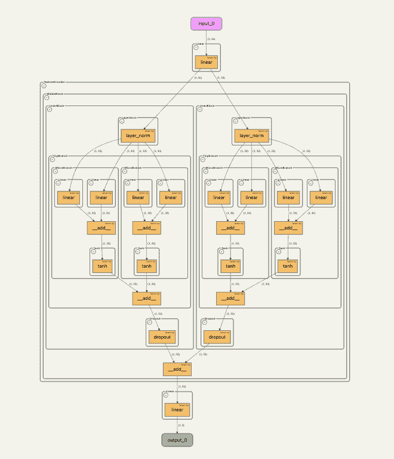

一个布局复杂、从上到下流畅且无重叠的图形

幸运的是，graphviz ([viz-js](https://github.com/mdaines/viz-js)) 为我们提供了帮助。graphviz 通过一种叫做“[DOT 语言](https://graphviz.org/doc/info/lang.html)”的语言来指定我们需要的图形布局是如何构建的。

下面是上述图形的 DOT 语法的示例：

```py
# Edges and nodes
  "input_0" [width=1.2, height=0.5];
  "output_0" [width=1.2, height=0.5];
  "input_0" -> "linear_1"[label="(1, 16)", fontsize="10", edge_data_id="5623840688" ];
  "linear_1" -> "layer_norm_1"[label="(1, 32)", fontsize="10", edge_data_id="5801314448" ];
  "linear_1" -> "layer_norm_2"[label="(1, 32)", fontsize="10", edge_data_id="5801314448" ];
...

# Module hierarchy specified using clusters
subgraph cluster_FeatureEncoder_1 {
  label="FeatureEncoder_1";
  style=rounded;
  subgraph cluster_MiddleBlock_1 {
    label="MiddleBlock_1";
    style=rounded;
    subgraph cluster_InnerBlock_1 {
      label="InnerBlock_1";
      style=rounded;
      subgraph cluster_LayerNorm_1 {
        label="LayerNorm_1";
        style=rounded;
        "layer_norm_1";
      }
      subgraph cluster_TinyBranch_1 {
        label="TinyBranch_1";
        style=rounded;
        subgraph cluster_MicroBranch_1 {
          label="MicroBranch_1";
          style=rounded;
          subgraph cluster_Linear_2 {
            label="Linear_2";
            style=rounded;
            "linear_2";
          }
...
```

一旦从我们的邻接表和层次图中生成这种 DOT 表示，graphviz 就会生成所有节点和边的位置和大小布局。

#### 渲染

一旦生成布局，就使用 d3 来渲染图形。所有内容都绘制在一个画布上（这使得它很容易实现拖动和缩放），我们设置了各种事件处理器来检测用户点击。

当用户对模块进行这两种类型的展开/折叠点击（使用‘+’和‘-’按钮）时，torchvista 会记录动作执行在哪个节点上，并且因为布局需要重建，所以只重新渲染图形，然后根据记录的点击前位置自动拖动并缩放到适当的级别。

使用 d3 渲染图形是一个非常详细的话题，而且并不特指 torchvista，因此我在这篇文章中省略了细节。

### [附加内容] 处理 Pytorch 模型中的错误

当用户追踪他们的 Pytorch 模型（尤其是在开发模型时），有时模型会抛出错误。在这种情况下，torchvista 本可以放弃，让用户先修复错误，然后再使用 torchvista。但 torchvista 反而出手帮助调试这些错误，通过尽可能多的追踪模型来做到这一点。这个想法很简单——追踪尽可能多的内容直到错误发生，然后只渲染出那么多的图形（带有视觉指示器显示错误发生的位置），然后抛出异常，这样用户也可以像平时一样看到堆栈跟踪。

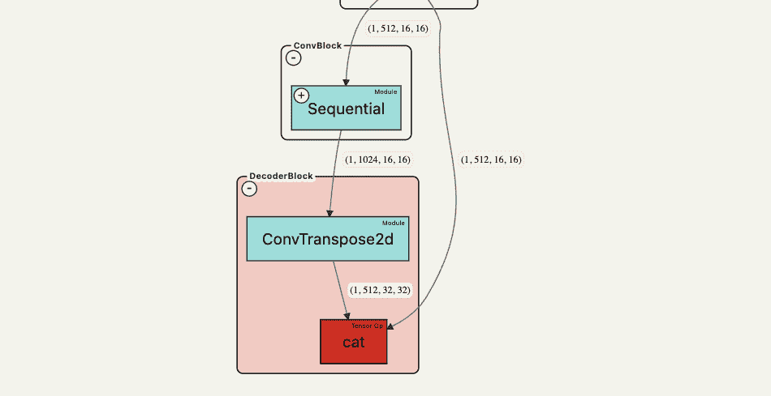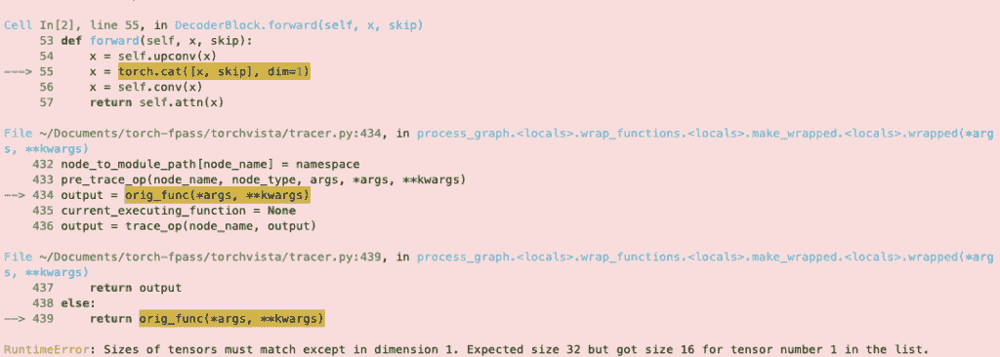

当抛出错误时，部分渲染的图形下方也会显示堆栈跟踪。

下面是一个简化的代码片段，展示了它是如何工作的：

```py
def trace_model(...):
  exception = None
  try:
    # All the tracing code
  except Exception as e:
    exception = e
  finally:
    # do all the necessary cleanups (unwrapping all the operations and modules)
  if exception is not None:
    raise exception
```

## 总结

本文简要介绍了构建 Pytorch 可视化包的历程。我们首先通过与其他类似工具的比较，讨论了构建此类工具的非常具体的动机。然后，我们分两部分讨论了 torchvista 的设计和实现。第一部分是关于使用（临时）包装操作和模块来追踪 Pytorch 模型的前向传递过程，以提取有关模型前向传递的详细信息，包括各种操作之间的连接以及模块层次结构。然后，在第二部分中，我们讨论了可视化层，以及布局生成的复杂性，这些问题是通过正确选择库来解决的。

torchvista 是开源的，所有贡献，包括反馈、问题和拉取请求，都欢迎。我希望 torchvista 能帮助所有水平的专家构建和可视化他们的模型（无论模型大小），展示他们的工作，并作为教育他人了解机器学习模型的一种工具。

### 未来方向

torchvista 的潜在未来改进包括：

+   添加对“滚动”的支持，如果模型的相同子结构重复多次，则只显示一次，并显示重复的次数

+   系统性地探索最先进的模型，以确保所有它们的张量操作都得到充分覆盖

+   支持将模型的静态图像导出为 png 或 pdf 文件

+   效率和速度改进

## 参考文献

+   使用了的开源库：

    +   [viz-js](https://github.com/mdaines/viz-js/)，graphviz 的 JavaScript 版本

    +   [d3](https://github.com/d3/d3) 可视化库

    +   [iPython](https://github.com/ipython/ipython)

+   [Dot 语言](https://graphviz.org/doc/info/lang.html) 来自 graphviz

+   其他类似的可视化工具：

    +   [Netron](https://github.com/lutzroeder/netron)

    +   [pytorchviz](https://github.com/szagoruyko/pytorchviz/) 

    +   [torchview](https://github.com/mert-kurttutan/torchview/)

+   torchvista:

    +   [Github](https://github.com/sachinhosmani/torchvista)

    +   交互式[演示页面](https://sachinhosmani.github.io/torchvista/)，展示了各种知名模型的可视化

    +   [Google Colab](https://colab.research.google.com/drive/1wrWKhpvGiqHhE0Lb1HnFGeOcS4uBqGXw?usp=sharing) 教程

* * *

*除非另有说明，所有图像均由作者提供*。
