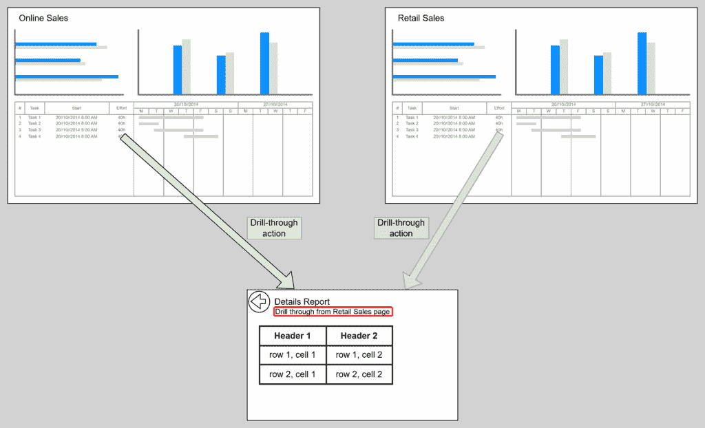
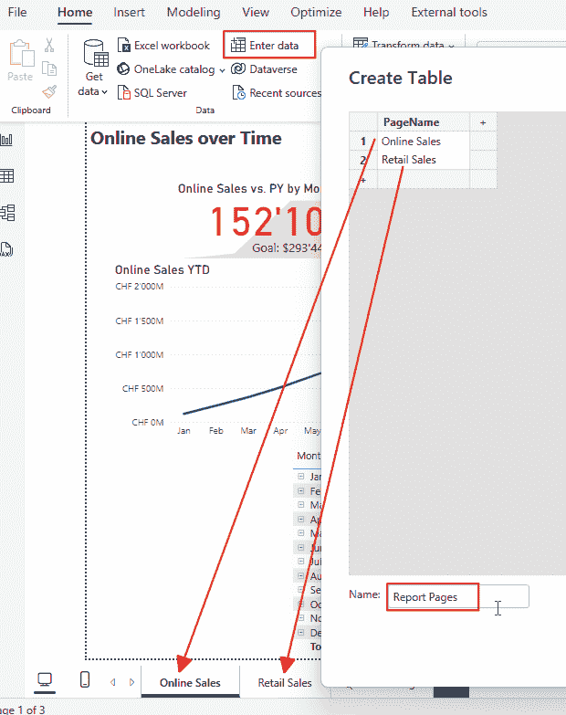
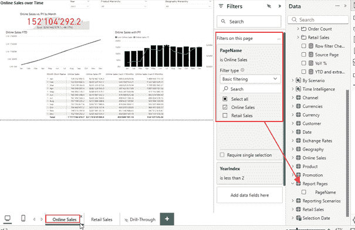
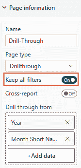
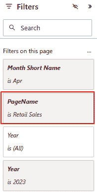
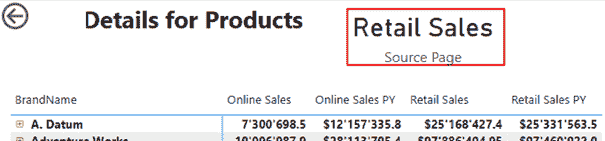
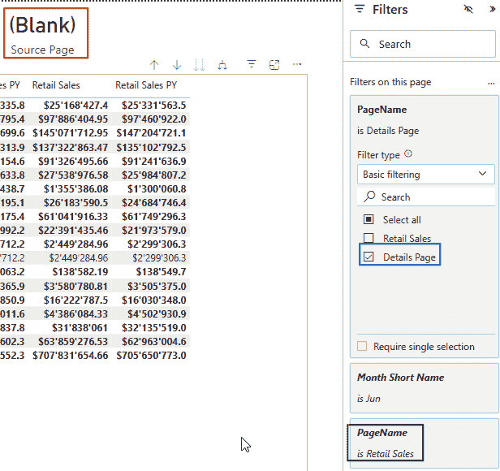
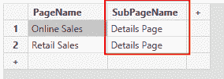
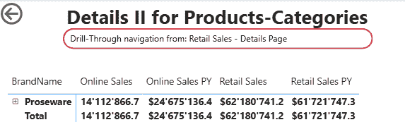

# 跟踪 Power BI 报告标题上的钻取操作

> 原文：[`towardsdatascience.com/tracking-drill-through-actions-on-power-bi-report-titles/`](https://towardsdatascience.com/tracking-drill-through-actions-on-power-bi-report-titles/)

## <mdspan datatext="el1752518663105" class="mdspan-comment">简介</mdspan>

想象这种情况：

我们有两个报告：

+   一个显示在线销售随时间变化的数据，并与上一年进行比较

+   一个显示零售销售随时间变化的数据，并与上一年进行比较

我们有一个详情页面，它作为两个页面的钻取目标，显示有关销售的详细信息。



图 1 – 场景，我们有两个报告页面，它们都指向同一个钻取页面（图由作者提供）

现在的问题是：我们如何知道哪个页面是从钻取操作开始的原始页面？

这就是我们如何在钻取页面上创建一个动态标题的解决方案，显示原始页面。

## 准备数据模型

第一步是在执行钻取操作之前存储有关当前活动页面的信息。

不幸的是，DAX 没有获取当前页面名称的函数。

因此，我们必须创建一个自定义解决方案。

第一步是创建一个包含报告中所有页面名称的表。

我使用“输入数据”功能来完成这项工作。

在那里我创建了这个表：



图 2 – 使用“输入数据”功能创建“报告页面”表（图由作者提供）

在这里，我必须输入所有报告页面，这些页面可以是钻取操作的起始页面。

注意，在表中输入的名称将在钻取页面上显示。因此，我们输入有意义的名称，这些名称可能与页面名称不同。

下一步是创建一个度量值来获取当前值：

```py
Source Page = SELECTEDVALUE('Report Pages'[PageName])
```

这就是为此解决方案所做的所有准备。

## 设置报告页面

接下来，我们必须在每个页面上添加一个过滤器，该过滤器设置页面名称：



图 3 – 将页面过滤器设置为当前页面名称（图由作者提供）

我们使用相应的页面名称对两个页面都进行此操作。

在钻取页面上，我们将“保留所有过滤器”设置设置为开启：



图 4 – 在钻取页面上将“保留所有过滤器”设置设置为“开启”（图由作者提供）

必须激活此设置以确保解决方案按预期工作。

将此设置为“开启”的原因是，添加到源页面的过滤器必须传递到钻取页面。我只有通过这种方法才能看到 DAX 的值。

这就是钻取页面上的样子：



图 5 – 钻取页面上的页面过滤器，显示源页面的过滤器（图由作者提供）

但我遇到过这种设置导致不希望的效果的情况。例如，当钻取页面必须显示不受源页面或源视觉上现有过滤器影响的 数据时。这不是一个典型场景，但它可能发生。

但是，除非源视觉也包括这个列，否则将 PageName 作为钻取列添加是没有帮助的。将这个列添加到一个视觉中是没有意义的，因为它与显示的数据没有关联或意义。

因此，这是将源页面名称传递到钻取页的唯一有效方式。

我不知道还有其他方法来解决这个挑战。

## 它工作吗？

现在，让我们向钻取页面添加一个卡片视觉，并将之前创建的度量作为值添加。

在从零售销售页面进行钻取操作后，它看起来像这样：



图 6 – 显示源页面度量的卡片视觉（图由作者提供）

基于此结果，我们可以创建一个标题或副标题文本的度量，该度量包括此度量。

完成解决方案，我们只需做这些。

## 缺点

这是获取原始页面信息的一个直接解决方案。

然而，它有两个缺点：

1.  一旦我添加了一个新的报告页面，它可以作为钻取源页面，我必须记得将新页面的名称添加到“报告页面”表中。

1.  当你计划有第二级钻取页面时，这不会起作用。

对于第二个问题，当你计划从第一个钻取页面跳转到另一个钻取页面时，你必须添加更多的功能。

例如，一个单独的表或在“报告页面”表中的另一个列。

你必须根据你计划添加类似面包屑文本的东西来选择方法，这使用户能够看到从第一个到第二个源页面的整个路径。

让我们看看为什么这是必要的：

例如，你为第一个钻取页面添加一个新行到“报告页面”表中，页面名称为“详情页面”。

然后，你将页面过滤器添加到钻取页面，指定钻取页面名称。

第一次钻取操作后的结果将是这样的：



图 7 – 向钻取页面添加过滤器时的冲突过滤器结果（图由作者提供）

+   蓝色标记的过滤器是设置 PageName 为“详情页面”的过滤器。

+   绿色标记的过滤器是钻取操作通过并设置为“零售销售”的过滤器。

我们现在有两个过滤器，它们相互覆盖，导致输出为空。结果是**不是**一个包含两个过滤器值的表格，而是冲突的过滤器。

因此，我们不能使用[CONCATENATEX()](https://dax.guide/concatenatex/)来检索这两个值。

因此，我们需要在报告页面表中添加一个额外的列，这种情况就是使用的，或者为详细页面使用一个单独的表。

这里有一个额外列的方法：



图 8 – 带有 SubPageName 列的扩展报告页面表（图由作者提供）

SubPageName 列包含从源页面可到达的钻取页面（的）名称。

在将页面过滤器添加到 SubPageName 并添加一个新度量来检索 SubPageName 列的值之后，我得到了这个结果：


图 9 – 检索 PageName 和 SubPageName 两列的两个度量结果（图由作者提供）

将这两个度量合并到一个标题度量中可以创建一个可以在第二个钻取页面上显示的面包屑路径：



图 10 – 第二个钻取页面的面包屑子标题（图由作者提供）

所使用的度量只是一个文本和两个度量的组合：

```py
Sub Page Breadcrumb = "Drill-Through mavigation from: " & [Source Page] & " - " & [Source Sub Page]
```

## 结论

现在我已经为你提供了所有必要的工具，你可以构建你的解决方案来跟踪钻取场景中的原始页面名称。

实现起来很简单。然而，你必须意识到技术要求和潜在的副作用。

一旦你掌握了它们，你就可以将它们应用到所有报告中。

我希望你在使用它时取得很多成功。

## 参考文献

就像在我之前的文章中一样，我使用了 Contoso 示例数据集。你可以从微软[这里](https://www.microsoft.com/en-us/download/details.aspx?id=18279)免费下载 ContosoRetailDW 数据集。

根据描述[在此文档](https://github.com/microsoft/Power-BI-Embedded-Contoso-Sales-Demo)中的 MIT 许可证，Contoso 数据可以免费使用。我将数据集更改以将数据转移到当代日期。
