# 从 TRPO 到 GRPO 训练大型语言模型

> 原文：[`towardsdatascience.com/training-large-language-models-from-trpo-to-grpo/`](https://towardsdatascience.com/training-large-language-models-from-trpo-to-grpo/)

DeepSeek 最近在 AI 社区中引起了**相当大的轰动**，这得益于其在相对较低的成本下所展现的出色性能。我认为这是一个深入了解大型语言模型（LLMs）是如何训练的绝佳机会。在这篇文章中，我们将重点关注训练的强化学习（RL）方面：我们将涵盖 TRPO、PPO，以及最近出现的 GRPO（别担心，我很快会解释所有这些术语！）

我的目标是使这篇文章相对容易阅读和获取，通过最小化数学内容，这样你就不需要深厚的强化学习背景也能理解。然而，我会假设你对机器学习、深度学习以及 LLMs 的工作原理有基本的了解。

我希望你喜欢这篇文章！

### LLM 训练的 3 个步骤

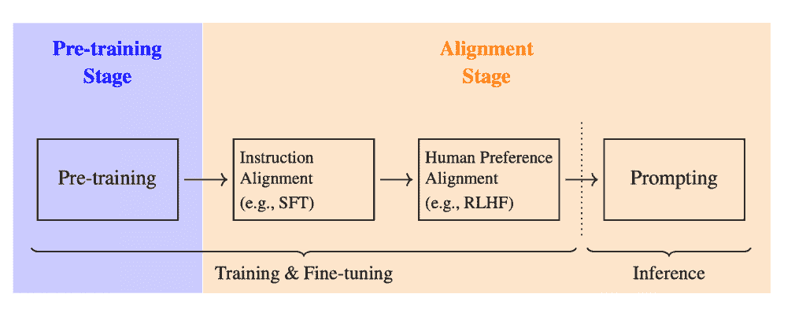

LLM 训练的 3 个步骤![1]

在深入探讨 RL 的具体细节之前，让我们简要回顾一下训练大型语言模型的三个主要阶段：

+   **预训练**：模型在大量数据集上训练，以根据前面的标记预测序列中的下一个标记。

+   **监督微调（SFT）**：然后模型在更针对性的数据上进行微调，并与特定指令对齐。

+   **强化学习**（通常称为*RLHF*，即带有人类反馈的强化学习）：这是本文的重点。主要目标是进一步细化响应与人类偏好的对齐，通过允许模型直接从反馈中学习。

### 强化学习基础

一个试图逃离迷宫的机器人![2]

在深入探讨之前，让我们简要回顾一下强化学习的核心思想。

在高层次上，RL 相当容易理解：一个**代理**与环境**交互**。代理位于环境中的特定**状态**，并可以采取**行动**以过渡到其他状态。每个行动都会从环境中获得一个**奖励**：这就是环境如何提供反馈以引导代理的未来行动。

考虑以下示例：一个**机器人**（代理）在**迷宫**（环境）中导航（并尝试退出）。

+   **状态**是环境（机器人迷宫中的位置）的当前情况。

+   机器人可以采取不同的**行动**：例如，它可以向前移动、向左转或向右转。

+   成功地导航到出口会得到**正面奖励**，而撞墙或被困在迷宫中会导致**负面奖励**。

简单！现在，让我们将 RL 在 LLMs 的上下文中的应用做一个类比。

### LLMs 上下文中的 RL

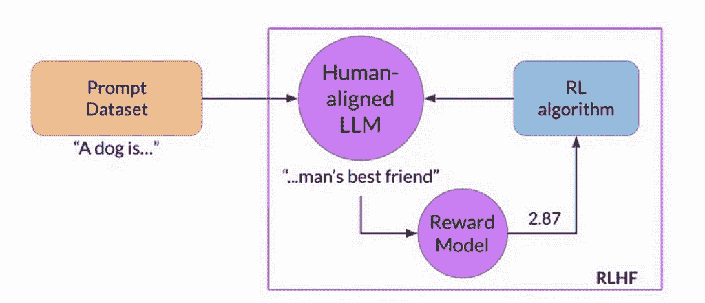

简化的 RLHF 过程![3]

在 LLM 训练期间使用时，RL 由以下组件定义：

+   LLM 本身**是代理**

+   **环境**：LLM 外部的一切，包括用户提示、反馈系统和其他上下文信息。这基本上是 LLM 在训练期间与之交互的框架。

+   **行动**：这是模型对查询的响应。更具体地说：这是 LLM 决定在响应查询时生成的**标记**。

+   **状态**：当前正在回答的查询以及 LLM 迄今为止生成的标记（即部分响应）。

+   **奖励**：这里有点棘手：与上面的迷宫示例不同，通常没有二元奖励。在 LLM 的上下文中，奖励通常来自一个单独的*奖励模型*，该模型为每个（查询，响应）对输出一个分数。该模型是从人工标注的数据中训练的（因此称为“RLHF”），其中标注者对不同的响应进行排名。目标是让高质量的响应获得更高的奖励。

> 注意：在某些情况下，奖励实际上可以更简单。例如，在 DeepSeekMath 中，可以使用基于规则的**方法**，因为数学响应往往更确定（正确或错误答案）

**策略**是我们现在需要的最后一个概念。在 RL 术语中，策略是决定采取哪个行动的策略。在 LLM 的情况下，策略在每个步骤输出可能的标记的概率分布：简而言之，这就是模型用来采样生成下一个标记的方法。具体来说，策略由模型的参数（权重）决定。在 RL 训练期间，我们调整这些参数，使 LLM 更有可能生成“更好”的标记——也就是说，产生更高奖励分数的标记。

我们通常将策略写成：

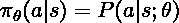

其中 *a* 是行动（要生成的标记），*s* 是状态（查询和迄今为止生成的标记），以及 *θ*（模型的参数）。

这个找到最佳策略的想法正是 RL 的全部意义！由于我们没有标记数据（就像我们在监督学习中那样），我们使用奖励来调整我们的策略以采取更好的行动。（在 LLM 的术语中：我们调整 LLM 的参数以生成更好的标记。）

### TRPO（信任区域策略优化）

#### 与监督学习的类比

让我们快速回顾一下监督学习通常是如何工作的。你有标记数据，并使用损失函数（如交叉熵）来衡量你的模型预测与真实标签的接近程度。

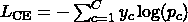

然后，我们可以使用反向传播和梯度下降等算法来最小化我们的损失函数并更新模型权重θ。

回想一下，我们的策略也输出概率！从这个意义上讲，它与监督学习中的模型预测类似……我们忍不住想写点像这样的东西：

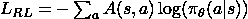

其中 *s* 是当前状态，*a* 是一个可能的动作。

*A(s, a)* 被称为**优势函数**，它衡量在当前状态下所选动作相对于基线有多好。这与监督学习中的**标签**概念非常相似，但它是从**奖励**而不是显式标记中派生出来的。**为了简化**，我们可以将优势写成：

在实践中，基线是使用**价值函数**计算的。这是一个在 RL 中常见的术语，我稍后会解释。现在你需要知道的是，它衡量的是如果我们从状态 *s* 继续遵循当前策略，我们将获得的预期奖励。

#### 什么是 TRPO？

TRPO（信任区域策略优化）基于使用优势函数这一想法，但增加了一个关键的**稳定性**成分：它在每个更新步骤中**限制**新策略与旧策略的偏差程度（例如，类似于我们使用批量梯度下降所做的那样）。

+   它引入了当前策略和旧策略之间的 KL 散度项（可以将其视为相似度的度量）：

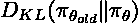

+   它还将策略除以旧策略。这个比率乘以优势函数，给我们一个关于每个更新相对于旧策略的**相对有益程度**的感觉。

将所有内容综合起来，TRPO 试图在**KL 散度约束**下**最大化**一个代理目标（涉及优势和政策比率）。

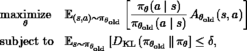

### PPO（近端策略优化）

虽然 TRPO 是一个重大的进步，但由于其计算密集型的梯度计算，它现在在实践中的应用不再广泛，尤其是在训练 LLM 时。

> 相反，现在 PPO 是大多数 LLM 架构中首选的方法，包括 ChatGPT、Gemini 等。

实际上它与 TRPO 非常相似，但与强制**KL 散度上的硬约束**不同，PPO 引入了一个“**剪裁**代理目标”，这隐式地限制了策略更新，并极大地简化了优化过程。

这里是对我们调整模型参数所最大化的 PPO 目标函数的分解。

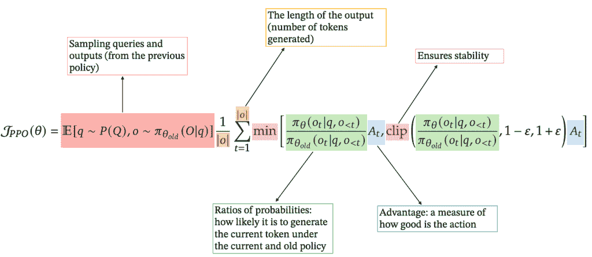

### GRPO（分组相对策略优化）

#### 价值函数通常是如何获得的？

让我们先更详细地谈谈我之前介绍的**优势**和**价值函数**。

在典型的设置（如 PPO）中，一个**价值模型**与策略一起训练。其目标是预测我们采取的每个动作（模型生成的每个标记）的价值，使用我们获得的奖励（记住，价值应该代表预期的累积奖励）。

这里是如何在实践中工作的。以查询“2+2 等于多少？”为例。我们的模型输出“2+2 等于 4”，并为此响应获得 0.8 的奖励。然后我们回溯并给每个前缀分配**折扣奖励**：

+   “2+2=4” 得到 0.8 的值

+   “2+2=”（向后退 1 个标记）得到 0.8*γ* 的值

+   “2+2”（向后退 2 个标记）得到 0.8*γ²* 的值

+   等等。

其中 *γ* 是折扣因子（例如 0.9）。然后我们使用这些前缀及其相关值来训练价值模型。

> 重要提示：价值模型和奖励模型是两回事。奖励模型在强化学习过程之前进行训练，并使用（查询，响应）对和人类排名。价值模型与策略同时训练，旨在预测生成过程中的每个步骤的预期奖励。

#### GRPO 的新特点

即使在实践中，奖励模型通常是从策略（仅训练“头部”）派生出来的，我们最终还是维护了许多模型并处理多个训练过程（策略、奖励、价值模型）。**GRPO**通过引入一种更有效的方法来简化这一过程。

记得我之前说过的话吗？

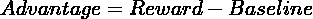

在 PPO 中，我们决定使用我们的价值函数作为基线。GRPO 选择的是其他东西：具体来说，**对于每个查询**，GRPO 生成一组响应（大小为 G 的组）并使用它们的奖励来计算每个响应的优势作为 **z 分数**：

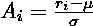

其中 *rᵢ* 是第 *i* 个响应的奖励，而 *μ* 和 *σ* 是该组奖励的均值和标准差。

这自然消除了对单独价值模型的必要性。当你思考这个问题时，这个想法很有道理！**它与之前引入的价值函数相一致**，并且在某种程度上衡量了我们可以获得的一个“预期”奖励。此外，这种方法非常适合我们的问题，因为 LLMs 可以通过使用低 *温度*（控制标记生成的随机性）轻松生成多个 **非确定性输出**。

> 这就是 GRPO 的主要思想：摒弃价值模型。

最后，GRPO 直接将其目标中的 **KL 散度**项（确切地说，GRPO 使用 KL 散度的简单近似来进一步改进算法）添加到其目标中，比较当前策略与一个 **参考策略**（通常是经过 SFT 的模型）。

请看下面的最终公式：

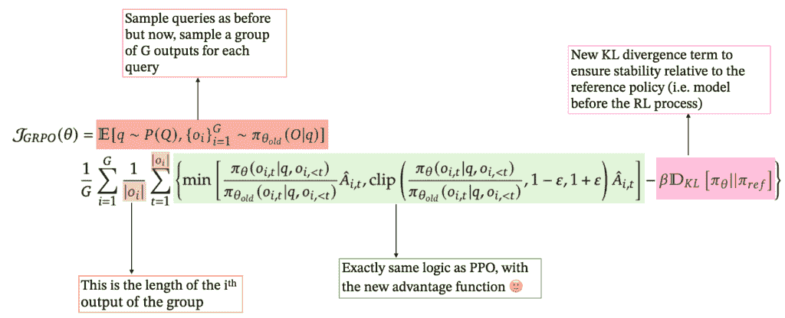

**而且，这就是 GRPO 的主要内容！** 我希望这能给你一个清晰的过程概述：它仍然依赖于与 TRPO 和 PPO 相同的基础思想，但引入了额外的改进，使训练更加高效、更快、更便宜——这是 **DeepSeek 成功的关键因素**。

### 结论

强化学习已经成为训练今天的大型语言模型的基础，尤其是通过 PPO，最近还有 GRPO。每种方法都建立在相同的强化学习基础之上——状态、动作、奖励和政策——但都添加了自己的特色来平衡稳定性、效率和人类对齐：

• **TRPO** 通过 KL 散度引入了严格的政策约束

• **PPO** 通过剪辑目标值放宽了这些限制

• **GRPO** 通过移除价值模型的要求并使用基于组的奖励归一化迈出了额外的一步。当然，DeepSeek 也受益于其他创新，如高质量数据和其他训练策略，但这将是另一篇文章的内容！

我希望这篇文章能让你对这些方法的联系和演变有一个更清晰的了解。我相信强化学习将成为训练大型语言模型**的主要关注点**，以提升其性能，超越预训练和微调，推动未来的创新。

如果你对深入了解感兴趣，请随时查看下面的参考文献或探索我之前的帖子。

感谢阅读，欢迎点赞和评论！

* * *

想了解更多关于 Transformer 或深入了解维度诅咒背后的数学？请查看我之前的文章：

## [Transformers: How Do They Transform Your Data?](https://towardsdatascience.com/transformers-how-do-they-transform-your-data-72d69e383e0d/)

[Deep Learning](https://towardsdatascience.com/category/artificial-intelligence/deep-learning/)

深入了解 Transformer 架构以及它们在语言任务中不可战胜的原因

[Maxime Wolf](https://towardsdatascience.com/author/maxwolf34/)Mar 2812 min read

* * *

+   欢迎在 [LinkedIn](https://www.linkedin.com/in/maxime-wolf/) 上与我联系

+   关注我的 [GitHub](https://github.com/maxime7770) 以获取更多内容

+   访问我的网站：[maximewolf.com](http://maximewolf.com/)

* * *

参考文献：

+   [1] “Foundations of Large Language Models”, 2025\. [`arxiv.org/pdf/2501.09223`](https://arxiv.org/pdf/2501.09223)

+   [2] **“**强化学习**。”** Enaris. Available at: [`enaris.org/material/en/Reinforcement%20Learning/index.html`](https://enaris.org/material/en/Reinforcement%20Learning/index.html)

+   [3] Y. Gokhale. “Introduction to LLMs and the Generative AI Part 5: RLHF,” *Medium*, 2023\. Available at: [`medium.com/@yash9439/introduction-to-llms-and-the-generative-ai-part-5-rlhf-64e83fbcd795`](https://medium.com/@yash9439/introduction-to-llms-and-the-generative-ai-part-5-rlhf-64e83fbcd795)

+   [4] L. Weng. “An Overview of Reinforcement Learning,” 2018\. Available at: [`lilianweng.github.io/posts/2018-02-19-rl-overview/`](https://lilianweng.github.io/posts/2018-02-19-rl-overview/)

+   [5] “DeepSeek-R1: Incentivizing Reasoning Capability in LLMs via Reinforcement Learning”, 2025\. [`arxiv.org/pdf/2501.12948`](https://arxiv.org/pdf/2501.12948)

+   [6] “DeepSeekMath: Pushing the Limits of Mathematical Reasoning in Open Language Models”, 2025\. [`arxiv.org/pdf/2402.03300`](https://arxiv.org/pdf/2402.03300)

+   [7] “Trust Region Policy Optimization”, 2017\. [`arxiv.org/pdf/1502.05477`](https://arxiv.org/pdf/1502.05477)
