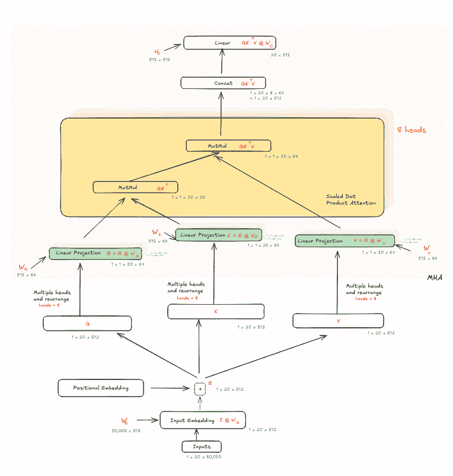
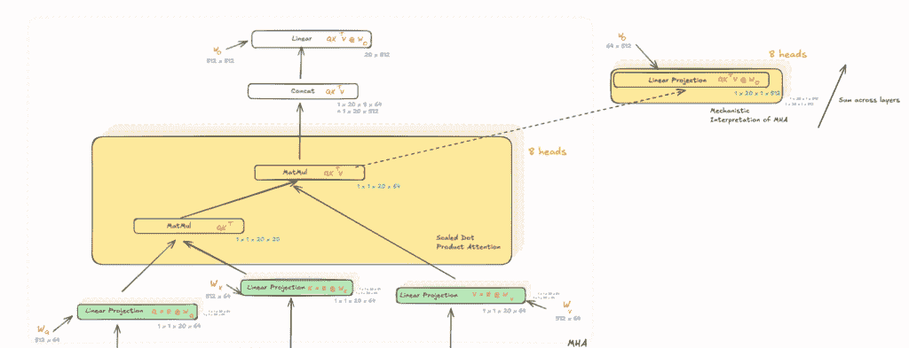
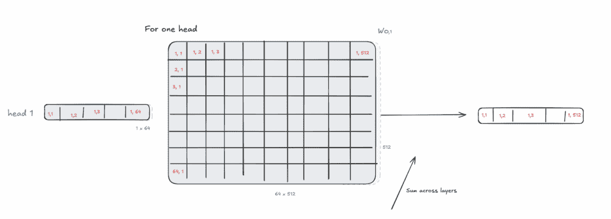

# 多头注意力是一种复杂的加法机器

> 原文：[`towardsdatascience.com/transformers-and-attention-are-just-fancy-addition-machines/`](https://towardsdatascience.com/transformers-and-attention-are-just-fancy-addition-machines/)

**<mdspan datatext="el1753243111506" class="mdspan-comment">机制解释</mdspan>** 是人工智能领域的一个相对较新的子领域，专注于通过逆向工程其内部机制和表示来理解神经网络的功能，旨在将它们转化为人类可理解算法和概念。这与传统的可解释性技术（如 SHAP 和 LIME）形成对比，并超越了它们。

SHAP 代表**SH**apley **A**dditive **e**x**P**lanations（Shapley 加性解释）。它计算每个特征对模型预测的贡献，局部和全局，即对于单个示例以及整个数据集。这使得 SHAP 可以用于确定用例中特征的一般重要性。与此同时，LIME 在单个示例-预测对上工作，它通过扰动示例输入并使用扰动及其输出来近似黑盒模型的简化替代品。因此，这两者都在特征级别上工作，并为我们提供了一些解释和启发式方法来衡量每个输入对模型预测或输出的影响。

另一方面，机制解释在更细粒度上理解事物，因为它能够提供一条路径，说明不同层的不同神经元如何学习该特征，以及这种学习如何在网络层中演变。这使得它擅长追踪网络中特定特征的路径，并且还能看到该特征如何影响结果。

SHAP 和 LIME 回答的问题是“*哪个特征对结果贡献最大？*”，而机制解释回答的问题是“*哪些神经元激活了哪些特征，以及该特征如何演变并影响网络的结果？*”

由于可解释性通常是一个与更深层次网络相关的问题，这个子领域主要与深度模型（如 transformers）一起工作。在几个地方，机制可解释性对 transformers 的看法与传统方式不同，其中之一是 *多头注意力*。正如我们将看到的，这种差异在于将“Attention is All You Need”论文中定义的乘法和拼接操作重新构造成加法操作，这开辟了一系列新的可能性。

但首先，回顾一下 Transformer 架构。

## Transformer 架构

图片由作者提供：Transformer 架构

这些是我们工作的尺寸：

+   *批量大小 B* =1;

+   *序列长度 S = 20;*

+   *词汇量大小 V = 50,000;*

+   *隐藏维度 D = 512;*

+   *头数 H = 8*

这意味着 Q、K、V 向量的维度数为 512/8 (L) = 64。 *(如果你不记得，以下是对查询、键和值的类比理解：想法是，对于一个给定位置的标记(K)，基于其上下文(Q)，我们希望得到与它相关的位置的对齐（重新加权）（V）。)*

这些是转换器中注意力计算步骤。 (以下假设张量的形状作为示例，以便更好地理解。斜体中的数字表示矩阵乘法的维度。)

| **步骤** | **操作** | **输入 1 维度** (形状) | **输入 2 维度** (形状) | **输出维度** (形状) |
| --- | --- | --- | --- | --- |
| 1 | N/A | B x S x V (1 x 20 x 50,000) | N/A | B x S x V (1 x 20 x 50,000) |
| 2 | 获取嵌入 | B x S x V (1 x 20 x *50,000*) | V x D (*50,000* x 512) | B x S x D (1 x 20 x 512) |
| 3 | 添加位置嵌入 | B x S x D (1 x 20 x 512) | N/A | B x S x D (1 x 20 x 512) |
| 4 | 将嵌入复制到 Q，K，V | B x S x D (1 x 20 x 512) | N/A | B x S x D (1 x 20 x 512) |
| 5 | 线性变换 *对于每个头 **H=8*** | B x S x D (1 x 20 x *512*) | D x L (*512* x *64*) | BxHxSxL (1 x 1 x 20 x 64) |
| 6 | 缩放点积（Q@K’）*在每个头中* | BxHxSxL (1 x 1 x 20 x *64*) | (LxSxHxB) (*64* x 20 x 1 x 1) | BxHxSxS (1 x 1 x 20 x 20)  |
| 7 | 缩放点积（注意力计算）Q@K’V *在每个头中* | BxHxSxS (1 x 1 x 20 x *20*) | BxHxSxL (1 x 1 x *20* x 64) | BxHxSxL (1 x 1 x 20 x 64) |
| 8 | 沿所有头拼接 **H=8** | BxHxSxL (1 x 1 x *20 x 64*) | N/A | B x S x D (1 x 20 x 512) |
| 9 | 线性投影 | B x S x D (1 x 20 x 512) | D x D (512 x 512) | B x S x D (1 x 20 x 512) |

表格视图：Transformer 中注意力计算的形状变换

以下是对表格的详细解释：

1.  我们从一个序列长度为 20 的单个输入句子开始，该句子被 one-hot 编码以表示序列中存在的词汇表中的单词。形状 (B x S x V)：(1 x 20 x 50,000)

1.  我们将这个输入与形状为(V x D)的可学习嵌入矩阵 Wₑ相乘以获得嵌入。形状 (B x S x D)：(1 x 20 x 512)

1.  接下来，向嵌入中添加了相同形状的可学习位置编码矩阵

1.  结果嵌入随后被复制到 Q、K 和 V 矩阵中。Q、K 和 V 各自在 D 维度上分割并重塑。形状 (B x S x D)：(1 x 20 x 512)

1.  Q、K 和 V 的矩阵分别被输入到一个线性变换层中，该层将它们与形状为(D x L)的可学习权重矩阵 Wq、Wₖ和 Wᵥ相乘 *(每个头 H=8 各有一个副本)*。形状 (B x H x S x L)：(1 x 1 x 20 x 64)，其中 H=1，因为这是每个头的最终形状。

1.  接下来，我们使用缩放点积注意力来计算注意力，其中 Q 和 K（转置）首先在每个头中相乘。形状 (B x H x S x L) x (L x S x H x B) → (B x H x S x S)：(1 x 1 x 20 x 20)。

1.  接下来有一个缩放和掩码步骤，我已经跳过了，因为那不是理解 MHA 不同视角的重要部分。所以，接下来我们乘以 QK 和 V *每个头*。形状 (B x H x S x S) x (B x H x S x L) → (B x H x S x L)：(1 x 1 x 20 x 64)

1.  **连接**：在这里，我们将所有头的注意力结果在 L 维度上连接起来，以得到形状为 (B x S x D) → (1 x 20 x 512)

1.  此输出再次使用另一个可学习的权重矩阵 Wₒ 进行线性投影，其形状为 (D x D)。最终形状为 (B x S x D)：(1 x 20 x 512)

## 重新构想多头注意力

现在，让我们看看机制解释领域是如何看待这个问题的，我们还将看到为什么它在数学上是等价的。在上面的图像右侧，你可以看到重新构想多头注意力的模块。

我们不连接注意力输出，而是在头部内部进行乘法或线性投影，此时 Wₒ 的形状为 (L x D)，它与形状为 (B x H x S x L) 的 QK’V 相乘，得到形状为 (B x S x H x D) 的结果：(1 x 20 x 1 x 512)。然后，我们对 H 维度求和，再次得到形状为 (B x S x D)：(1 x 20 x 512)。

从上面的表格中，最后两个步骤是变化的：

| **步骤** | **操作** | **输入 1 维度** (形状) | **输入 2 维度** (形状) | **输出维度** (形状) |
| --- | --- | --- | --- | --- |
| 8 | 每个头上的线性投影 **H=8** | BxHxSxL (1 x 1 x *20 x 64*) | L x D (*64* x 512) | BxSxHxD (1 x 20 x 1 x 512) |
| 9 | 对头部求和 (H 维度) | BxSxHxD (1 x 20 x 1 x 512) | N/A | B x S x D (1 x 20 x 512) |

**备注**：这种“求和”与 CNN 中不同通道求和的方式相似。在 CNN 中，每个滤波器作用于输入，然后我们在通道间求输出之和。同样，这里每个头可以看作是一个通道，模型学习一个权重矩阵将每个头的贡献映射到最终的输出空间。

但为什么 **投影 + 求和** 在数学上等同于 **连接 + 投影**？简而言之，因为在机制视角下的投影权重只是传统视图下权重的切片版本（沿 *D* 维度切片并分割以匹配每个头）。

让我们先关注乘以 Wₒ 之前的 H 和 D 维度。从上面的图像中，每个头现在都有一个大小为 64 的向量，它与形状为 (64 x 512) 的权重矩阵相乘。让我们用 R 表示结果，用 h 表示头。

要得到 R₁₁，我们有这个方程：

R₁,₁ = h₁,₁ x Wₒ₁,₁ + h₁,₂ x Wₒ₂,₁ + …. + h₁ₓ₆₄ x Wₒ₆₄,₁

现在假设我们将头部连接起来，得到一个注意力输出形状为 (1 x 512) 和形状为 (512, 512) 的权重矩阵，那么方程将是：

R₁,₁ = h₁,₁ x Wₒ₁,₁ + h₁,₂ x Wₒ₂,₁ + …. + h₁ₓ**₅₁₂** x Wₒ**₅₁₂**,₁

因此，h₁ₓ₆**₅** x Wₒ₆**₅**,₁ + … + h₁ₓ**₅₁₂** x Wₒ**₅₁₂**,₁这一部分将被添加。但这个被添加的部分是以模 64 的方式存在于其他每个头中。换句话说，如果没有连接，Wₒ₆**₅**,₁就是第二个头中 Wₒ₁,₁的值，Wₒ₁₂₉,₁是第三个头中 Wₒ₁,₁的值，以此类推，如果我们想象每个头的值都依次排列。因此，即使没有连接，"对头求和"操作也会得到相同的值被添加。

总结来说，这个洞见为将变压器视为纯粹加性模型奠定了基础，即变压器中的所有操作都是基于初始嵌入并对其进行添加。这种观点开启了新的可能性，例如通过*加法*追踪特征在层中的学习过程（称为电路追踪），这正是我在接下来的文章中将要展示的机制可解释性的内容。

* * *

我们已经证明，这种观点在数学上等同于另一种截然不同的观点，即多头注意力通过分割 Q、K、V 并行化并优化了注意力的计算。更多关于这方面的内容请参阅这篇博客[这里](https://mccormickml.com/2025/02/18/patterns-and-messages-part-1-wo-i/)，以及介绍这些观点的实际论文[这里](https://transformer-circuits.pub/2021/framework/index.html)。
