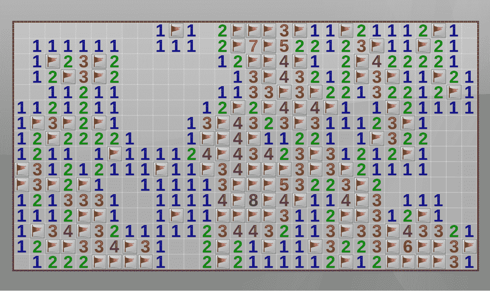

# 思维树提示：教 LLMs 慢慢思考

> 原文：[`towardsdatascience.com/tree-of-thought-prompting-teaching-llm-to-think-slowly/`](https://towardsdatascience.com/tree-of-thought-prompting-teaching-llm-to-think-slowly/)
> 
> *“慢思考（系统 2）是费力的、不频繁的、逻辑的、计算的、有意识的。”*
> 
> — 丹尼尔·卡尼曼，《思考，快与慢》

## <mdspan datatext="el1748380071877" class="mdspan-comment">简介</mdspan>

大型语言模型（LLMs）如 ChatGPT 通常表现为 2002 年诺贝尔经济学奖获得者丹尼尔·卡尼曼（Daniel Kahneman）所定义的系统 1：它快速、自信且几乎不费力。你是正确的：还有一个系统 2，这是一种更慢、更费力的思考模式。

这些年，研究人员一直在开发方法，通过更好的提示策略将系统 2 风格的思考引入 LLMs。思维树（ToT）提示是其中最突出的技术之一，它允许模型遵循多个推理路径，可能导致更好的决策。

在这篇博客文章中，我将进行一个案例研究，其中 ToT 驱动的 LLM 代理玩经典的扫雷游戏——不是通过猜测，而是通过推理。就像你一样。

## CoT 和 ToT

我们可能从**思维链（CoT）提示**开始我们的故事——这是一种引导 LLMs 逐步推理的技术。看看以下例子：

**Q:** 我在超市买了 10 个苹果。然后我给了邻居 2 个苹果，又给了我的猪 2 个。现在对我来说苹果不够了！！然后我又从杂货店买了 5 个苹果，但有一个是烂的。现在有多少个苹果？

**A:** 你原本有 10 个苹果。你给了邻居 2 个苹果，又给了猪 2 个。现在你有 6 个苹果。然后你买了 5 个更多的苹果，所以你有 11 个苹果。最后，你吃了一个苹果，所以最后你仍然有 10 个苹果。

如你所见，通过逐步引导思考，LLM 模拟了更好的推理。

**思维树（ToT）提示**扩展了 CoT。正如其名所示，它像树一样组织推理，其中每个节点都是一个潜在的“思想”，分支是可能的路径。它不遵循 CoT 的线性过程。

在实践中，ToT 创建了一个带有分支的树结构，每个分支都有子步骤，最终导致一个解决方案。然后模型评估每个步骤，给每个想法分配一个分类，如“确定”、“可能”或“不可能”。接下来，ToT 通过应用搜索算法，如**广度优先搜索（BFS）**和**深度优先搜索（DFS）**，遍历整个问题空间，以选择最佳路径。

这里有一个在办公楼中的例子：我有一个最多容纳 20 人的办公室，但这个星期有 28 人来。我有以下三个可能的解决方案：

+   **分支 1：移动 8 个人**

    +   附近有其他房间吗？→ 是的

    +   它有空间再容纳 8 个人吗？→ 是的

    +   我们能否在不进行任何行政程序的情况下移动人员？→ 可能

    +   评估：有希望！

+   **分支 2：扩大房间**

    +   我们能否使房间更大？→ 可能

    +   这在安全方面允许吗？→ 不允许

    +   我们能否在建筑中请求例外？→ 不行

    +   评估：这行不通！

+   **分支 3：将小组分成两组**

    +   我们能否将这些人分成两组？→ 可以

    +   我们能否让他们在不同的日子来？→ 可能

    +   评估：有很好的潜力！

正如你所见，这个过程模仿了我们解决难题的方式：我们不是直线思考。相反，我们探索、评估和选择。

## 案例研究

### 矿雷扫雷



矿雷扫雷：[维基百科](https://en.wikipedia.org/wiki/Minesweeper_%28video_game%29)

几乎不可能，但如果你不知道的话，扫雷是一款简单的视频游戏。

棋盘被分成单元格，其中地雷随机分布。单元格上的数字显示与它相邻的地雷数量。当你打开所有单元格时，你就赢了。然而，如果你在打开所有单元格之前触碰到地雷，游戏就结束了，你输了。

我们在扫雷中应用 ToT，这需要一些逻辑规则和约束下的推理。

我们用以下代码来模拟游戏：

```py
# --- Game Setup ---
def generate_board():
   board = np.zeros((BOARD_SIZE, BOARD_SIZE), dtype=int)
   mines = set()
   while len(mines) < NUM_MINES:
       r, c = random.randint(0, BOARD_SIZE-1), random.randint(0, BOARD_SIZE-1)
       if (r, c) not in mines:
           mines.add((r, c))
           board[r][c] = -1  # -1 represents a mine

   # Fill in adjacent mine counts
   for r in range(BOARD_SIZE):
       for c in range(BOARD_SIZE):
           if board[r][c] == -1:
               continue
           count = 0
           for dr in [-1, 0, 1]:
               for dc in [-1, 0, 1]:
                   if 0 <= r+dr < BOARD_SIZE and 0 <= c+dc < BOARD_SIZE:
                       if board[r+dr][c+dc] == -1:
                           count += 1
           board[r][c] = count
   return board, mines
```

你可以看到我们生成了一个 `BOARD_SIZE*BOARD_SIZE` 大小的棋盘，上面有 `NUM_MINES` 个地雷。

## ToT LLM 代理

我们现在准备好构建我们的 ToT LLM 代理来解决扫雷难题。首先，我们需要定义一个函数，该函数使用 LLM（如 GPT-4o）返回当前棋盘上的想法。

```py
def llm_generate_thoughts(board, revealed, flagged_mines, known_safe, k=3):

   board_text = board_to_text(board, revealed)

   valid_moves = [[r, c] for r in range(BOARD_SIZE) for c in range(BOARD_SIZE) if not revealed[r][c] and [r, c] not in flagged_mines]

   prompt = f"""

You are playing a 8x8 Minesweeper game.

- A number (0–10) shows how many adjacent mines a revealed cell has.

- A '?' means the cell is hidden.

- You have flagged these mines: {flagged_mines}

- You know these cells are safe: {known_safe}

- Your job is to choose ONE hidden cell that is least likely to contain a mine.

- Use the following logic:

 - If a cell shows '1' and touches exactly one '?', that cell must be a mine.

 - If a cell shows '1' and touches one already flagged mine, other neighbors are safe.

 - Cells next to '0's are generally safe.

You have the following board:

{board_text}

Here are all valid hidden cells you can choose from:

{valid_moves}

Step-by-step:

1\. List {k} possible cells to click next.

2\. For each, explain why it might be safe (based on adjacent numbers and known info).

3\. Rate each move from 0.0 to 1.0 as a safety score (1 = definitely safe).

Return your answer in this exact JSON format:

[

 {{ "cell": [row, col], "reason": "...", "score": 0.95 }},

 ...

]

"""

   try:

       response = client.chat.completions.create(

           model="gpt-4o",

           messages=[{"role": "user", "content": prompt}],

           temperature=0.3,

       )

       content = response.choices[0].message.content.strip()

       print("\n[THOUGHTS GENERATED]\n", content)

       return json.loads(content)

   except Exception as e:

       print("[Error in LLM Generation]", e)

       return []
```

这可能看起来有点长，但函数的核心部分是提示部分，它不仅向 LLM 解释游戏的规则（如何理解棋盘、哪些移动是有效的等），还解释了每个有效移动背后的推理。此外，它还说明了如何为每个可能的移动分配分数。这些构成了我们的思维分支，最终形成了我们的树形 ToT。例如，我们有一个逐步指南：

```py
1\. List {k} possible cells to click next.

2\. For each, explain why it might be safe (based on adjacent numbers and known info).

3\. Rate each move from 0.0 to 1.0 as a safety score (1 = definitely safe).
```

这些行指导 LLM 提出多个移动，并基于当前状态为每个移动进行辩护；然后它必须通过从 0 到 1 的分数来评估每个可能的移动。代理将使用这些分数来找到最佳选项。

我们现在使用这些生成的想法构建一个 LLM 代理来执行“真实”的移动。考虑以下代码：

```py
def tot_llm_agent(board, revealed, flagged_mines, known_safe):

   thoughts = llm_generate_thoughts(board, revealed, flagged_mines, known_safe, k=5)

   if not thoughts:

       print("[ToT] Falling back to baseline agent due to no thoughts.")

       return baseline_agent(board, revealed)

   thoughts = [t for t in thoughts if 0 <= t["cell"][0] < BOARD_SIZE and 0 <= t["cell"][1] < BOARD_SIZE]

   thoughts.sort(key=lambda x: x["score"], reverse=True)

   for t in thoughts:

       if t["score"] >= 0.9:

           move = tuple(t["cell"])

           print(f"[ToT] Confidently choosing {move} with score {t['score']}")

           return move

   print("[ToT] No high-confidence move found, using baseline.")

   return baseline_agent(board, revealed)
```

代理首先调用 LLM 建议几个可能的下一步移动，并带有置信度分数。如果 LLM 无法返回任何想法，代理将回退到之前定义的基线代理，并且它只能做出随机移动。如果我们足够幸运，得到了 LLM 提出的几个移动，代理将进行第一轮过滤，排除无效的移动，例如那些超出棋盘范围的移动。然后，它将根据置信度分数按降序排列有效的想法，如果分数高于 0.9，则返回最佳移动。如果没有建议的分数高于这个阈值，它将回退到基线代理。

## 开始游戏

现在我们将尝试玩一个标准的 8×8 扫雷棋盘游戏，其中有 10 个隐藏的地雷。我们玩了 10 场游戏，达到了 100% 的准确率！请查看[笔记本](https://colab.research.google.com/drive/1z4zheiBZckN1ELjDlncrZXmGMYsV8Gbx#scrollTo=2f04458d-59ce-42b8-91de-cd6862985942)以获取完整的代码。

## 结论

ToT 提示词赋予 GPT-4o 等大型语言模型更强的推理能力，超越了快速直观思考。我们已经将 ToT 应用于扫雷游戏，并取得了良好的效果。这个例子表明，ToT 可以将 LLM 从聊天助手转变为具有真实逻辑和推理能力的复杂问题解决者。
