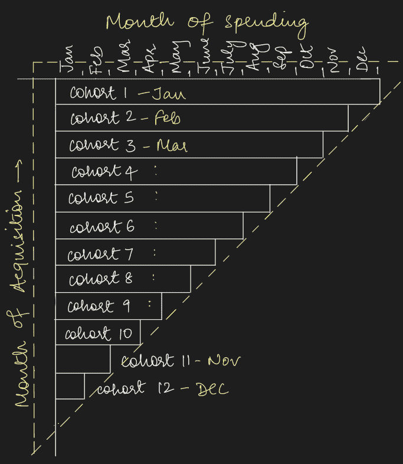
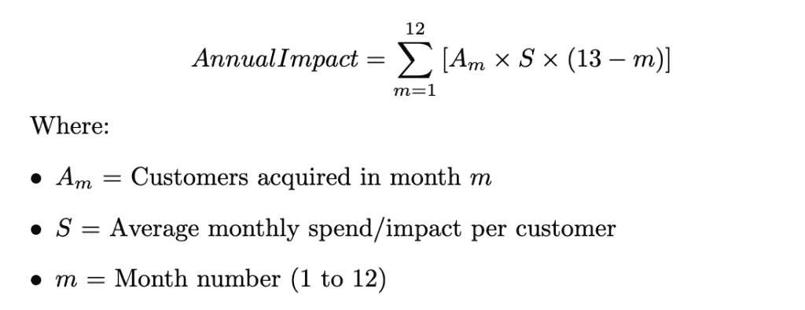
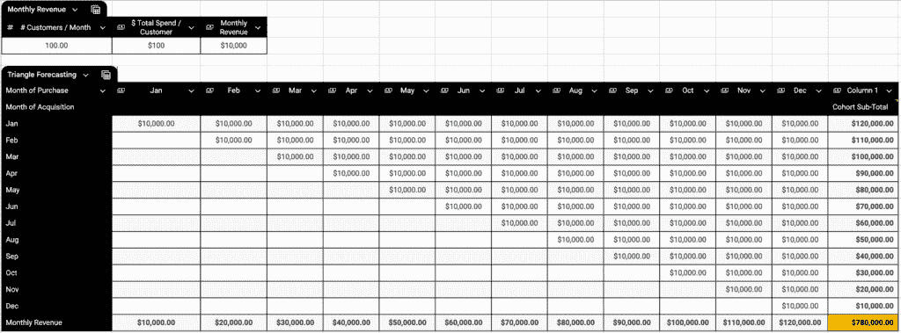
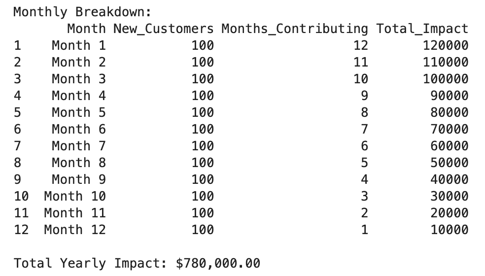
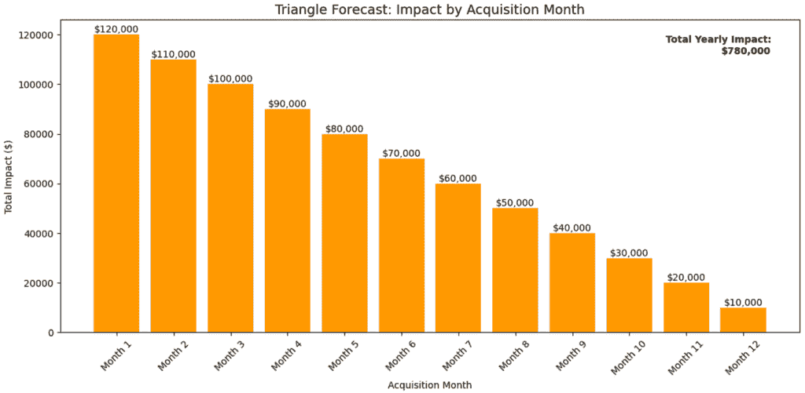
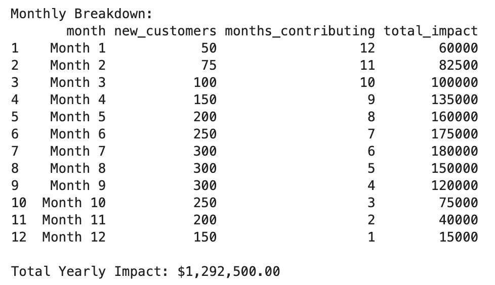
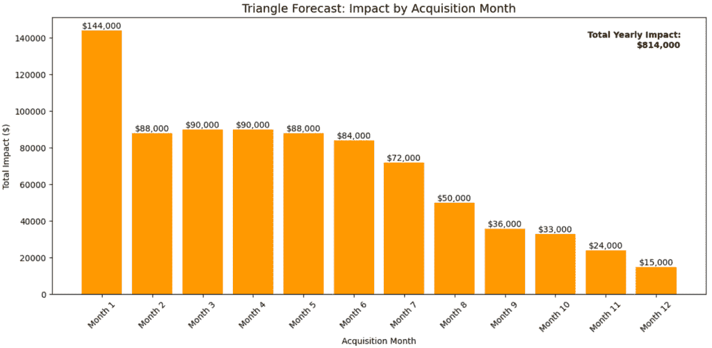

# 三角形预测：为什么传统的影响评估被夸大（以及如何修复它们）

> 原文：[`towardsdatascience.com/triangle-forecasting-why-traditional-impact-estimates-are-inflated-and-how-to-fix-them/`](https://towardsdatascience.com/triangle-forecasting-why-traditional-impact-estimates-are-inflated-and-how-to-fix-them/)

**准确的影响评估可以决定你的商业案例的成功与否。**

尽管其重要性不言而喻，但大多数团队使用过于简化的计算方法，这可能导致夸大的预测。这些盲目的数字不仅会破坏与利益相关者的信誉，还可能导致资源分配不当和项目失败。但有一种更好的方法来预测逐渐获取客户的影响，而不需要使用混乱的 Excel 电子表格和容易出错的公式。

到这篇文章结束时，你将能够计算准确的年度预测，并实施一个可扩展的 Python 解决方案用于三角形预测。

## 预测不准确的影响的隐藏成本

当被要求提供年度影响评估时，产品团队通常会通过应用一种适用于所有客户群体的通用方法来高估影响。团队经常选择一种简单的方法：

*将月收入（或任何其他相关指标）乘以十二来估算年度影响。*

虽然计算很简单，但这个公式忽略了一个适用于大多数企业的基本前提：

> **客户获取在整个年度内逐渐发生。**

由于后期群体贡献的月份较少，因此所有客户对年度估计的贡献并不相等。

**三角形预测可以通过考虑客户获取时间线的影响来减少预测误差。**

让我们用一个基本的例子来探讨这个概念。假设你正在推出一项新的订阅服务：

+   每月订阅费：每位客户$100

+   每月客户获取目标：100 个新客户

+   目标：计算年度总收入

过于简化的乘法表明第一年的收入为$1,440,000（= 100 个新客户/月 * 12 个月 * 每月花费$100 * 12 个月）。

实际数字仅为$780,000！

**这种 46%的过度估计是为什么影响评估经常无法通过利益相关者的审查。**

> 准确的预测不仅仅是数学问题—
> 
> 这是一个帮助你建立信任并快速获得项目批准的工具，而无需承担过度承诺和未能交付的风险。

此外，数据专业人员花费数小时在 Excel 中手动构建预测，这些预测是易变的，可能导致公式错误，并且难以迭代。

拥有一个标准化、可解释的方法可以帮助简化这个过程。

## 介绍三角形预测

三角形预测是一种系统性的数学方法，用于估计客户逐渐获取时的年度影响。它考虑了新客户将根据他们何时加入你的产品而以不同的方式对年度影响做出贡献的事实。

这种方法特别有用：

+   **新产品发布：** 当客户获取随时间发生时

+   **订阅收入预测：** 为基于订阅的产品提供准确的收入预测

+   **分阶段推出：** 为估计逐步推出的累积影响

+   **获取规划：** 为设定现实的每月获取目标以实现年度目标



由作者生成的图像

三角预测中的“三角形”指的是个人队列贡献的视觉化方式。队列指的是客户被获取的月份。三角形中的每一根条形代表一个队列对年度影响的贡献。早期队列的条形更长，因为它们贡献了更长时间。

要计算第一年新举措、模型或功能的影响：

1.  对于每年的每个月（m）：

+   计算获取的客户数量（Am）

+   计算每位客户的平均每月支出/影响（S）

+   计算年度剩余月份（Rm = 13-m）

+   月度队列影响 = Am × S × Rm

2. 总年度影响 = 所有月度队列影响的总和



由作者生成的图像

### 构建您的第一个三角预测

让我们计算我们的订阅服务的实际收入：

+   一月：100 客户 × $100 × 12 个月 = $120,000

+   二月：100 客户 × $100 × 11 个月 = $110,000

+   三月：100 客户 × $100 × 10 个月 = $100,000

+   等等……

在 Excel 中进行计算，我们得到：



由作者生成的图像

总年度收入等于 **$780,000**——比简化的估计低 46%！

**💡小贴士：将电子表格计算保存为模板，以便在不同场景中重复使用。**

需要在没有完美数据的情况下构建估计？请阅读我的指南“在数据不完美时构建可防御的影响估计”。

### 将理论付诸实践：实施指南

虽然我们可以使用上述方法在 Excel 中实现三角预测，但这些电子表格变得难以维护或快速修改。当假设或时间表发生变化时，产品所有者也难以快速更新预测。

这样我们就可以在几分钟内用 Python 构建相同的预测：

```py
import pandas as pd
import numpy as np
import matplotlib.pyplot as plt

def triangle_forecast(monthly_acquisition_rate, monthly_spend_per_customer):
    """
    Calculate yearly impact using triangle forecasting method.
    """
    # Create a DataFrame for calculations
    months = range(1, 13)
    df = pd.DataFrame(index=months, 
                     columns=['month', 'new_customers', 
                             'months_contributing', 'total_impact'])

    # Convert to list if single number, else use provided list
    acquisitions = [monthly_acquisitions] * 12 if type(monthly_acquisitions) in [int, float] else monthly_acquisitions

    # Calculate impact for each cohort
    for month in months:
        df.loc[month, 'month'] = f'Month {month}'
        df.loc[month, 'new_customers'] = acquisitions[month-1]
        df.loc[month, 'months_contributing'] = 13 - month
        df.loc[month, 'total_impact'] = (
            acquisitions[month-1] * 
            monthly_spend_per_customer * 
            (13 - month)
        )

    total_yearly_impact = df['total_impact'].sum()

    return df, total_yearly_impact
```

继续我们之前的订阅服务示例，每个月度队列的收入可以如下可视化：

```py
# Example
monthly_acquisitions = 100  # 100 new customers each month
monthly_spend = 100        # $100 per customer per month

# Calculate forecast
df, total_impact = triangle_forecast(monthly_acquisitions, monthly_spend)

# Print results
print("Monthly Breakdown:")
print(df)
print(f"\nTotal Yearly Impact: ${total_impact:,.2f}")
```



由作者生成的图像

我们还可以利用 Python 将队列贡献可视化成条形图。注意，随着我们进入月份，影响线性下降。



由作者生成的图像

使用这段 Python 代码，你现在可以快速高效地生成和迭代年度影响估计，无需手动对崩溃的电子表格进行版本控制。

## 除此之外的基本预测

虽然上述示例很简单，假设每月的获取和支出在所有月份都是恒定的，但这并不一定正确。三角形预测可以轻松调整和扩展，以考虑：

+   **多个支出层级**

对于基于支出层级的可变月度支出，为每个群体创建一个独特的三角形预测，然后汇总各个群体的个别影响以计算总年度影响。

+   **可变的获取率**

通常，企业在一年中不会以恒定的速率获取客户。获取可能以缓慢的速度开始，随着营销活动的开展而加速，或者我们可能会有早期采用者的爆发，随后增长放缓。为了处理不同的速率，传递一个月度目标的列表而不是单一速率：

```py
# Example: Gradual ramp-up in acquisitions
varying_acquisitions = [50, 75, 100, 150, 200, 250, 
                        300, 300, 300, 250, 200, 150]
df, total_impact = triangle_forecast(varying_acquisitions, monthly_spend)
```



由作者生成的图像

+   **季节性调整**

为了考虑季节性，在计算总影响之前，将每个月的影响乘以其相应的季节性因素（例如，12 月份的高峰月份为 1.2，2 月份的低峰月份为 0.8 等）。

这里是如何修改 Python 代码以考虑季节性变化的：

```py
import pandas as pd
import numpy as np
import matplotlib.pyplot as plt

def triangle_forecast(monthly_acquisitions, monthly_spend_per_customer, seasonal_factors = None):
    """
    Calculate yearly impact using triangle forecasting method.
    """    
    # Create a DataFrame for calculations
    months = range(1, 13)
    df = pd.DataFrame(index=months, 
                     columns=['month', 'new_customers', 
                             'months_contributing', 'total_impact'])

    # Convert to list if single number, else use provided list
    acquisitions = [monthly_acquisitions] * 12 if type(monthly_acquisitions) in [int, float] else monthly_acquisitions

    if seasonal_factors is None:
        seasonality = [1] * 12
    else:
        seasonality = [seasonal_factors] * 12 if type(seasonal_factors) in [int, float] else seasonal_factors        

    # Calculate impact for each cohort
    for month in months:
        df.loc[month, 'month'] = f'Month {month}'
        df.loc[month, 'new_customers'] = acquisitions[month-1]
        df.loc[month, 'months_contributing'] = 13 - month
        df.loc[month, 'total_impact'] = (
            acquisitions[month-1] * 
            monthly_spend_per_customer * 
            (13 - month)*
            seasonality[month-1]
        )

    total_yearly_impact = df['total_impact'].sum()

    return df, total_yearly_impact

# Seasonality-adjusted example 
monthly_acquisitions = 100  # 100 new customers each month
monthly_spend = 100        # $100 per customer per month
seasonal_factors = [1.2,  # January (New Year)
            0.8,  # February (Post-holiday)
            0.9,  # March
            1.0,  # April
            1.1,  # May
            1.2,  # June (Summer)
            1.2,  # July (Summer)
            1.0,  # August
            0.9,  # September
            1.1, # October (Halloween) 
            1.2, # November (Pre-holiday)
            1.5  # December (Holiday)
                   ]

# Calculate forecast
df, total_impact = triangle_forecast(monthly_acquisitions, 
                                     monthly_spend, 
                                     seasonal_factors)
```



由作者生成的图像

这些自定义设置可以帮助你模拟不同的增长场景，包括：

+   在发布初期的逐步增长

+   基于促销活动的阶梯式增长

+   客户获取的季节性变化

## 核心观点

拥有可靠且直观的预测可以决定你的倡议是成功还是失败。

但这还不是全部——三角形预测还适用于收入预测之外的应用，包括计算：

+   客户激活

+   投资组合损失率

+   信用卡支出

**准备好跳入了吗？** 下载上面共享的 Python 模板，15 分钟内构建你的第一个三角形预测！

1.  输入你的月度获取目标

1.  设置你预期的月度客户影响

1.  使用自动化可视化来可视化您的年度轨迹

*现实世界的估计通常需要处理不完美或不完整的数据。查看我的文章“当数据不完美时构建可防御的影响估计”以了解在这种情况下构建可防御估计的框架。*

**致谢：**

> 感谢我的杰出导师 [Kathryne Maurer](https://www.linkedin.com/in/kathrynem/)，她开发了三角形预测方法的核心概念和第一个迭代版本，并允许我通过方程和代码在此基础上进行构建。

我总是欢迎关于如何使这些指南对你更有价值的反馈和建议。祝您阅读愉快！
