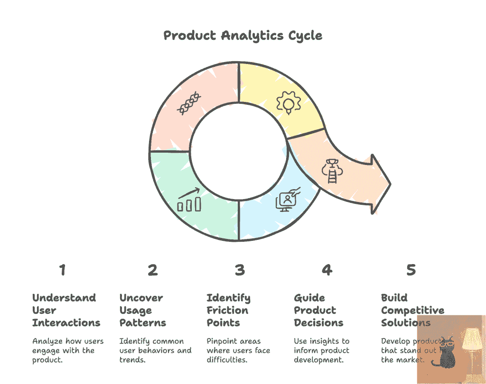
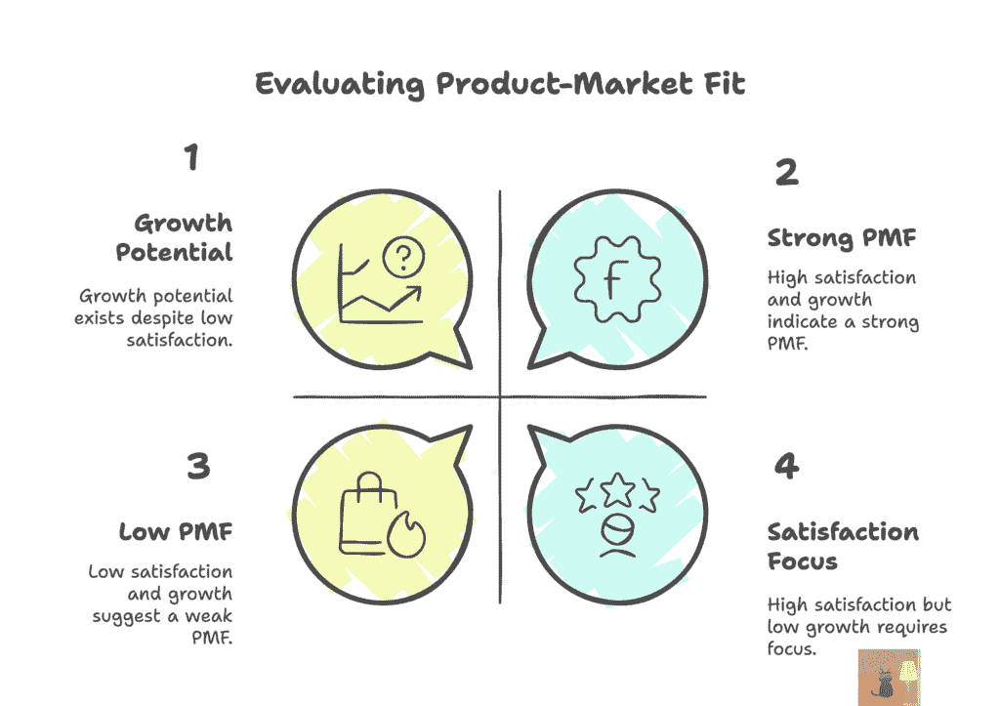
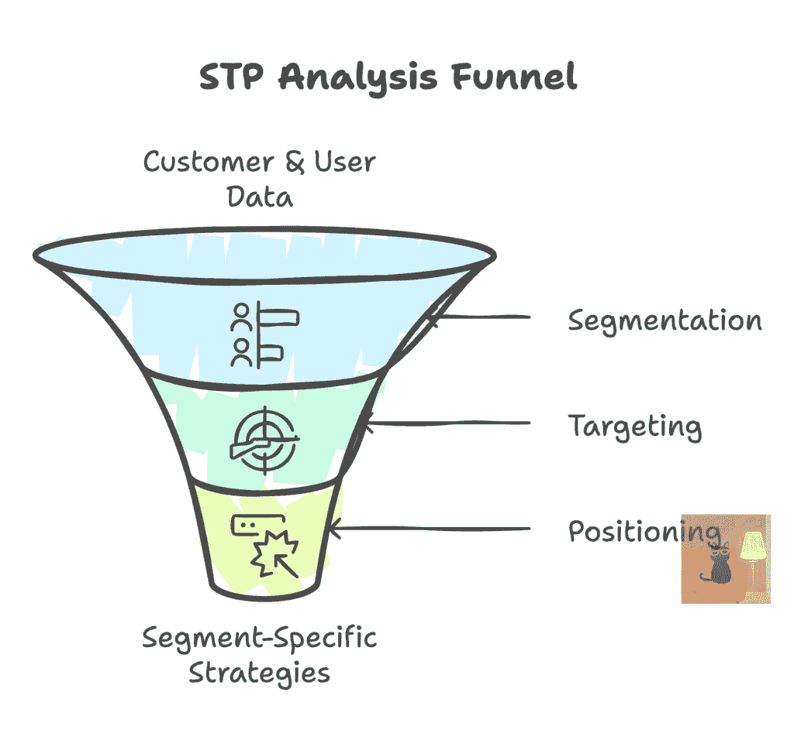
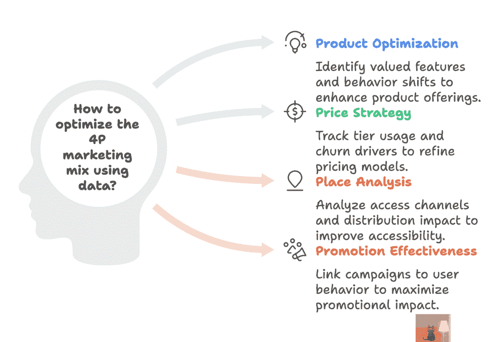
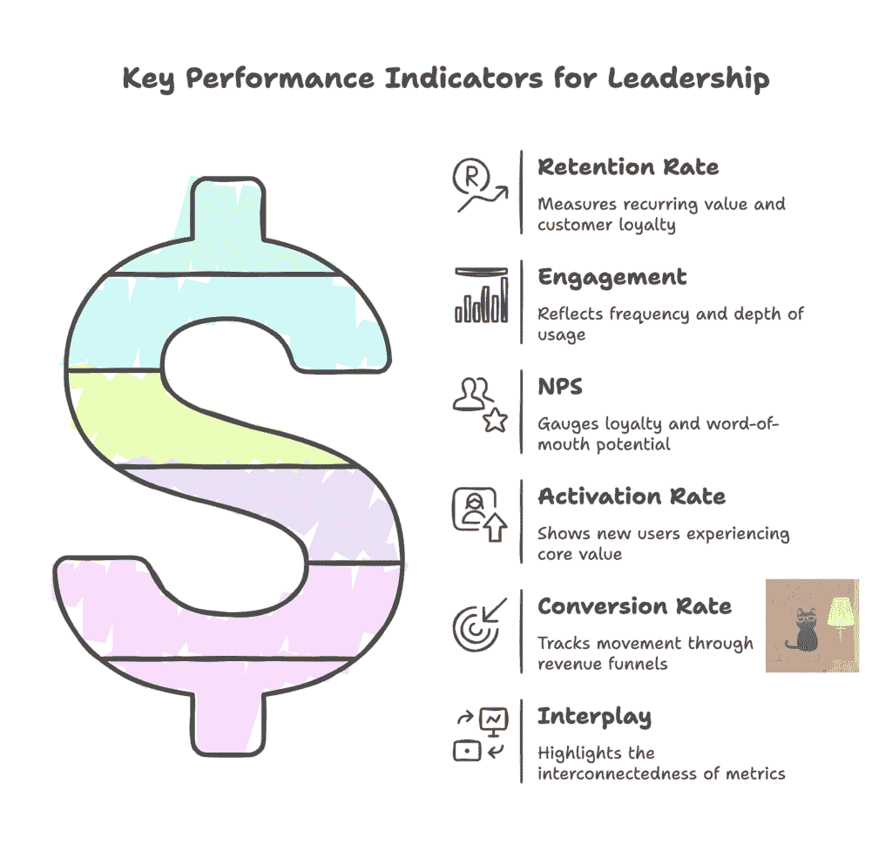

# 将产品数据转化为战略决策

> 原文：[`towardsdatascience.com/turning-product-data-into-strategic-decisions/`](https://towardsdatascience.com/turning-product-data-into-strategic-decisions/)

## <mdspan datatext="el1746056462381" class="mdspan-comment">什么是产品分析以及为什么它很重要</mdspan>

产品分析是跟踪、分析和解释现有和潜在客户如何与您的产品互动的过程。它揭示了行为模式，确定了客户旅程中的摩擦点，并揭示了真正推动采用、留存和转化的因素。在本质上，产品分析提供可操作的见解，帮助业务了解不仅他们的客户是谁，他们在做什么，而且为什么他们这样做，以及如何最好地接近他们。

在今天快速发展的数字化转型中，期望很高而注意力稀缺，产品分析对于中小企业和大型企业都是基础。它帮助团队设计更直观的体验，优先考虑正确的功能，并识别可能被忽视的差距。

对于商业领袖来说，产品分析不仅仅是跟踪关键绩效指标（KPIs）或构建仪表板。它提供了一个战略视角，可以将产品开发与关键业务成果对齐。它将决策从假设转变为证据，明确指出投资方向、需要改进的地方以及如何增长。无论你是在优化定价、探索新细分市场，还是改进用户入门流程，产品分析都能确保最佳选择基于现实。

图片由 Weiwei Hu 提供，来自 [The Next Step](https://thenextsteps1.substack.com/)

* * *

## 理解产品-市场匹配度（PMF）

产品-市场匹配度（PMF）是可持续增长和长期业务可行性的基础。当产品可靠地解决一个明确客户细分市场的有意义问题时，PMF 就实现了，以至于客户不仅采用它，而且还会继续回来，向他人推荐它，并认为它是不可或缺的。

今天，产品分析使评估 PMF 成为一种结构化、数据驱动的方法。这些关键指标包括：

+   **用户群留存趋势**：PMF 最清晰的信号之一是留存曲线的形状。当留存稳定，意味着一组用户随着时间的推移持续返回并参与，这是一个强有力的指标，表明这些用户正在发现持续的价值。相反，急剧的下降或“悬崖”曲线表明，产品尚未提供必需的体验。

+   **PMF 调查**：PMF 常用的定性信号之一是询问用户：“如果你不能再使用这个产品，你会感到怎样？”如果，比如说，有>= 40%的用户回答“非常失望”，研究表明，该业务已经达到高度满意用户的临界质量。这个阈值有助于量化情感依恋，这是产品-市场匹配度强的指示。

+   **其他基于行为和情感信号：**

    +   有机增长（用户在没有付费获取的情况下发现产品）

    +   核心用户的高参与度和功能使用

    +   推荐或口碑增长

    +   强大的净推荐者评分（NPS），表明客户满意度和倡导

这些信号中的任何一个都不能单独工作，但结合起来，它们形成了一个全面的视角，即产品是否真正与客户产生共鸣。这些指标很重要，因为在不具备最小可行产品（PMF）的情况下扩大产品规模可能是成本高昂且不可持续的。分析和见解为业务提供了所需的清晰度，以评估产品准备情况，不仅是否有人注册，而且是否有人留存、深度参与，并看到足够的价值来倡导产品。当这些信号一致时，就是扩大规模的绿灯。当它们不一致时，它们指出了在投资增长之前需要改进的地方。

图片由胡伟伟提供，来自[下一步](https://thenextsteps1.substack.com/)

* * *

## 细分、定位和定位

STP 框架（细分、定位和定位）帮助业务将精力集中在正确的用户身上，提供正确的价值，并在正确的时间以正确的方式传达信息。当由产品分析驱动时，它成为了一种高度可操作的方法，用于协调产品开发、营销和增长战略。

### 1. 细分：寻找重要的模式

细分涉及根据共享特征、行为或使用模式将现有和潜在客户群分解成有意义的群体。而不是依赖于可能掩盖重要差异的平均值，细分允许团队发现可操作见解，例如：

+   哪些客户最快采用新功能？

+   谁倾向于在旅程早期流失？

+   哪个细分市场能带来最高的终身价值？

通过在使用频率、入职行为、公司规模、用户角色或产品层级等维度上切割数据，你揭示了否则可能隐藏的模式。这种清晰度有助于团队设计更有针对性的体验，优先考虑与特定群体产生共鸣的功能，并识别特定用户的独特摩擦点。最终，智能细分不仅揭示了产品是如何被使用的，而且揭示了它最适合谁。

### 2. 定位：关注关键领域

一旦定义了细分市场，定位就是决定优先考虑和关注的细分市场。这个决定可以基于战略一致性和绩效指标的结合，包括：

+   客户参与深度

+   随时间推移的保留和忠诚度

+   转换或扩展潜力

+   与业务目标一致（例如，向上市场移动或进入新的垂直领域）

产品分析为这一决策提供了清晰度。例如，如果 A 细分市场的流失率是 B 细分市场的 2 倍，或者 C 细分市场持续带来每用户更高的收入，那么前进的道路就更加明显。有效的定位确保产品、营销和 GTM（全球市场拓展）努力集中在最重要的用户上，最大化商业影响，而不仅仅是覆盖范围。

### 3. 定位：定制故事和体验

定位关乎塑造产品被感知的方式，并确保这种感知与您最关心的用户产生共鸣。它影响：

+   用于吸引和转化现有和潜在客户的宣传信息

+   为他们突出显示的功能和好处

+   为不同客户量身定制的入门流程和支持

产品分析通过揭示特定细分市场真正重视的内容，赋予了优化定位的能力。一个群体可能对速度和简单性做出反应，而另一个群体可能更重视定制或数据洞察。有了这种理解，企业可以制定直接针对客户需求的信息，相应地调整产品体验，并个性化指导或推动采用。

通过从产品分析的角度应用 STP 框架，团队可以超越一刀切的思想。不再为普通用户设计，而是为那些有意义的细分市场设计，特别是那些保留、增长和倡导的用户。结果？更清晰的信息传递、更强的产品市场一致性和更高效的增长。

图片由胡伟伟来自 [The Next Step](https://thenextsteps1.substack.com/)

* * *

## 产品、价格、地点、促销的数据驱动决策

4Ps 框架（产品、价格、地点和促销）提供了一种全面的方法，将产品推向市场并成功扩展。当与产品分析相结合时，每个“P”都成为一个数据驱动的决策点，帮助您将您的产品与用户行为、市场状况和商业目标对齐。

### 1. 产品：基于实际使用进行优化

产品分析揭示了客户最重视的功能、他们在哪些方面遇到困难以及他们在整个生命周期中的参与方式。它使团队能够：

+   根据使用频率和客户满意度优先考虑高影响功能

+   识别用户流程中的摩擦点或流失点

+   A/B 测试变化并衡量对保留或参与度的影响

通过将产品决策建立在真实客户行为而非假设上，团队将能够更有信心地进行迭代，并构建真正与客户产生共鸣的体验。

### 2. 价格：将价值感知与支付意愿对齐

定价不仅仅是商业决策，它更是一种产品体验。例如，如果客户经常触及免费计划的限制，但又不进行升级，分析工具可以利用这些信息更好地理解这是否由于定价、入门差距或价值传递不明确。因此，有效的定价分析有助于企业：

+   了解客户在不同定价层或计划中的行为

+   发现与价值差距或付费墙相关的潜在流失风险

+   测试新的模型（例如，免费增值、基于使用量）并跟踪转换提升或下降

### 3. 地点：在用户所在之处接触用户

地点指的是产品如何在平台、设备、地理区域和/或销售渠道中访问和分发。在这里，产品和市场分析可以协同工作来：

+   揭示最有效的获取和参与渠道

+   揭示未得到充分服务的地理区域或客户类型

+   指导平台特定优化投资

假设，大多数使用都来自移动设备，但您的入门流程仅针对桌面优化，产品分析可以帮助识别这些低效之处，并帮助团队快速纠正这种不匹配。

### 4. 促销：优化质量而非仅仅数量

促销是获取正确用户的过程，这些用户可以转换、参与并保持。它创造了营销和产品之间的良性循环：推动高质量流量的促销可以促进更好的产品决策，反之亦然。产品分析帮助企业：

+   通过评估参与度和货币化来衡量真正的投资回报率

+   将获取来源（广告、推荐、内容）与注册后的行为联系起来

+   确定哪些活动带来快速激活并长期保留的用户

当每个 4P（产品、价格、地点和促销）都由真实客户和用户数据引导时，产品和市场策略变得更加敏锐、快速，并且更符合人们实际使用和体验产品的行为。而不是依赖于假设或经验，企业正在做出基于真实数据驱动的决策，这些决策可以减少浪费，提高可衡量的成果，并在整个产品-市场关系中创造更强的对齐。

图片由胡伟伟来自 [The Next Step](https://thenextsteps1.substack.com/) 提供

***

## 产品健康的核心指标

有 5 个基础指标可以提供对产品健康和战略进展的平衡视角。当有效监控时，它们讲述了一个关于客户体验、价值交付和业务影响的强大故事：

+   **留存率：**衡量您在一段时间内保持用户的能力。强大的留存表明持续的价值，这对于可持续增长是基本的。

+   **参与度：**跟踪使用频率、深度和质量。参与度高的客户不仅会回来，还会探索、贡献并留下来。高参与度通常与满意度和长期客户价值相关。

+   **净推荐值（NPS）：**衡量客户满意度以及向他人推荐产品的可能性。这是一个简单但强大的客户情绪、忠诚度和有机增长潜力的指标。

+   **激活率**：捕捉新用户体验产品核心价值的有效性。高激活率意味着用户正在看到早期成功，这是保留和最终转换的关键指标。

+   **转换率**：衡量用户在关键漏斗步骤中的表现如何，无论是注册、升级还是购买。它是衡量您的产品如何将兴趣转化为商业价值的一个直接指标，因此是收入增长和利润优化的关键指标。

这些指标并非孤立存在。它们的真正价值在于它们如何相互连接。例如，激活可以提高保留率，参与度可以影响转换率等。综合起来，它们提供了产品性能的完整图景：

+   高激活率促进更好的保留率

+   强烈的参与度提升转换率

+   高 NPS 通常与推荐驱动的增长一致

+   保留率 + 转换率共同提高客户终身价值（LTV）

另一方面，孤立地跟踪这些指标可能导致错误积极的结论。例如，高注册转换率可能看起来很好，直到你注意到几天后保留率下降。真正的见解来自于理解这些指标如何相互移动并反映完整的用户生命周期。

通过将这些指标嵌入到常规审查中，战略决策变得更加清晰和以客户为中心。无论您是在优化入职流程、完善定价还是评估新功能赌注，这些核心产品健康指标都将确保您的团队能够专注于对客户成功和业务增长真正重要的事情。

图片由胡伟伟来自 [The Next Step](https://thenextsteps1.substack.com/)

* * *

## 将产品分析与企业目标和市场趋势对齐

当产品分析不仅仅是事后的仪表板或冗长的报告，而是业务设定方向、优先分配资源并适应变化的核心部分时，它才真正具有战略意义。为了最大化其价值，分析应嵌入到内部规划周期和外部市场意识中。以下是方法：

### 1. 将指标与战略业务目标链接

分析应该与您的业务实际试图实现的目标相一致，无论是增加客户终身价值、提高保留率、增加收入还是扩展到新细分市场。

对于每个业务目标，确定最能表明进展的产品指标（s）。例如，如果您的目标是扩展收入，则跟踪升级转换率和与更高等级计划相关的功能采用率。在 OKRs、仪表板和规划文档中明确这些联系。当团队知道他们的工作如何推动指针移动时，他们会保持专注、对齐和有动力。指标变得有意义，而不仅仅是机械的。

### 2. 用数据做决策，而不仅仅是报告

许多团队收集数据但未能采取行动。从被动报告转向主动决策是区分数据感知组织和数据驱动组织的关键。利用分析来指导路线图优先级、定价实验和 GTM 时间。将数据审查融入产品规划仪式中，不仅仅是季度审查，还包括冲刺规划、发布前的复盘等。鼓励基于假设的分析，即我们相信执行 X 将使指标 Y 提高 Z%，然后进行测试和验证。数据不应是回顾性的。它应积极塑造团队下一步应该做什么。建立一个好奇心和迭代是标准的文化。

### 3. 将定量数据与定性洞察相结合

行为数据告诉你客户做了什么，但不知道为什么。没有背景，企业可能会误解他们的信号或优化错误的事情。例如，客户是否因为陡峭的学习曲线而流失，或者他们是否转向了具有更好定价的竞争对手？用定性输入补充指标，例如 NPS 评论、调查回复、支持工单、客户访谈等。然后，创建混合数据和分析客户意见（VOC）的复合洞察报告，以获得全面的视角。记住：没有同理心的数据可能导致错误的假设。结合两者可以增强商业决策并构建更强大的产品。

### 4. 跟踪市场趋势和行业基准

产品分析不应孤立存在。了解不同指标与外部标准的比较为团队提供了评估绩效的关键背景。例如，使用行业基准来校准期望（例如，B2B SaaS 的 30 天留存率与消费者移动应用相比）。关注竞争性市场变化：新进入者是否在改变用户期望？是否有一个行业向自助服务或移动优先的转变？根据市场趋势调整指标重点。例如，随着隐私变得越来越重要，客户信任和数据选择率可能成为关键指标。商业成功是相对的，你需要超越，而不仅仅是改善。市场背景有助于企业优先考虑正确的指标。

### 5. 建立数据驱动文化和沟通机制

为了扩大影响力，产品分析必须成为团队间共享的语言，而不仅仅是数据或产品团队所拥有的。建立定期的跨职能指标审查，涉及产品、营销、增长、客户成功和领导层。在高管审查中包括产品健康指标和财务指标。庆祝由于特定举措而指标改善的胜利，以加强学习和动力。提供易于访问的仪表板，并附有清晰的解释，以便即使是非技术利益相关者也能与数据互动。组织内的数据流畅性导致更好的决策、更快的对齐以及一个以洞察力驱动行动的文化。

当产品分析紧密地与业务目标和市场环境对齐时，它就从一项战术工具转变为战略优势。它变成了：

+   一种保持你的策略基于真实客户行为的真相来源

+   一个有助于业务适应有效与无效的反馈循环

+   一个统一的指南针，将多个职能团队联合起来。

产品分析不是数据或报告层。它是一个战略决策引擎。它明确了方向，明确了优先事项，并揭示了可能被隐藏的机会。当以意图和纪律来对待时，它使团队能够构建既对客户又有益于业务的产品。

因此，为了使产品分析真正具有战略意义，业务将需要：

+   跟踪反映产品健康、用户价值和业务影响的正确指标。

+   采用 PMF、STP 和 4P 等分析框架，将数据转化为对业务有意义的洞察。

+   将数据与业务目标对齐，确保每个洞察都转化为有意义的成果。

+   培养一种数据驱动的行动文化，其中洞察不仅被审查，还被辩论、应用和衡量。

对我来说，最好的策略不仅仅依赖于直觉、经验或孤立的数据。它们在证据和判断的交汇处蓬勃发展，在那里分析指导决策，而领导力则带着愿景引领。当产品分析融入业务团队思考、计划和行动的方式时，你的产品不仅会增长，还会适应、共鸣并引领。这就是真正进步发生的方式。

* * *

**作者注：**

产品分析不仅仅是仪表盘和报告。它是一种保持对业务真正重要事项的关注的方法。我探讨了如何将指标与业务目标联系起来，并使用数据来指导产品、战略和增长方面的更明智决策。无论你是产品团队的领导者，还是仅仅对分析如何融入更大的图景感到好奇，这都是一本关于有目的地使用数据的实用指南。📈

*本文最初发表在[*The Next Step*](https://thenextsteps1.substack.com/)上，我在那里分享关于领导力、个人成长和构建未来的反思。*欢迎订阅以获取更多见解！*
