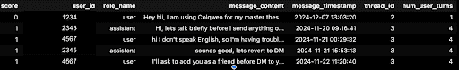
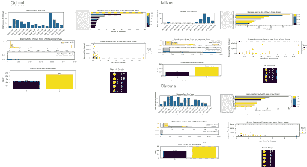
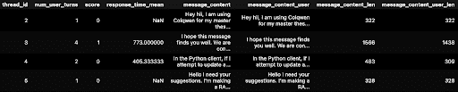
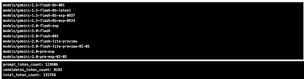
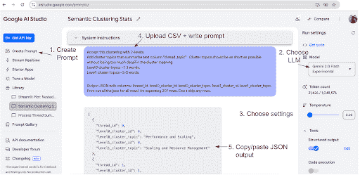
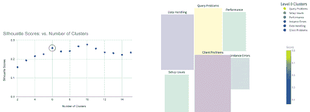
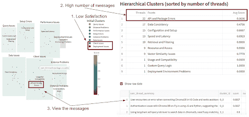
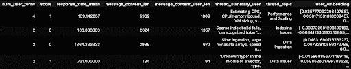
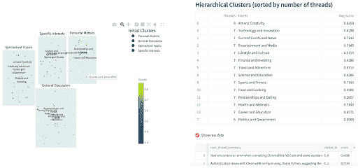
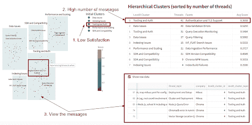

# 教程：使用 LLM 提示进行用户消息语义聚类

> 原文：[`towardsdatascience.com/tutorial-semantic-clustering-of-user-messages-with-llm-prompts/`](https://towardsdatascience.com/tutorial-semantic-clustering-of-user-messages-with-llm-prompts/)

作为开发者倡导者，跟上用户论坛消息并理解用户所说的大致情况是一项挑战。有很多有价值的内容——但如何快速找到关键对话呢？在这个教程中，我将向您展示一个通过提示 LLM 进行语义聚类的 AI 技巧！

TL;DR 🔄 这篇博客文章是关于如何从（数据科学 + 代码）→（AI 提示 + LLMs）获得相同的结果——只是更快、更省力！🤖⚡。它组织如下：

+   灵感与数据来源

+   使用仪表板探索数据

+   使用 LLM 提示生成 KNN 聚类

+   尝试自定义嵌入

+   在多个 Discord 服务器上进行聚类

## **灵感与数据来源**

首先，我要给 2024 年 12 月的论文**[Clio**](https://arxiv.org/abs/2412.13678) **（Claude 见解和观察）**点个赞，这是一个保护隐私的平台，它使用 AI 助手分析并展示数百万对话中的聚合使用模式。阅读这篇论文激发了我尝试这个想法。

**数据**。我只使用了公开可用的[Discord](https://discord.com/)消息，特别是“论坛线程”，其中用户寻求技术帮助。此外，我还汇总并匿名化了本博客的内容。每个线程，我将数据格式化为对话轮格式，用户角色被标识为“用户”，提出问题，或“助手”，任何回答用户初始问题的人。我还添加了一个简单的、硬编码的二进制情感评分函数（0 表示“不开心”，1 表示“开心”），基于用户在其线程中是否任何时候说了谢谢。对于 vectorDB 供应商，我使用了 Zilliz/Milvus、Chroma 和 Qdrant。

第一步是将数据转换为 pandas 数据框。下面是摘录。您可以看到对于 thread_id=2，用户只问了一个问题。但对于 thread_id=3，用户在同一个线程中问了 4 个不同的问题（其他 2 个问题在更晚的时间戳下，下面未显示）。



第一步是将匿名数据转换为具有以下列的 pandas 数据框：score, user, role, message, timestamp, thread, user_turns。

我添加了一个简单的 0|1 情感评分函数。

```py
def calc_score(df):
   # Define the target words
   target_words = ["thanks", "thank you", "thx", "🙂", "😉", "👍"]

   # Helper function to check if any target word is in the concatenated message content
   def contains_target_words(messages):
       concatenated_content = " ".join(messages).lower()
       return any(word in concatenated_content for word in target_words)

   # Group by 'thread_id' and calculate score for each group
   thread_scores = (
       df[df['role_name'] == 'user']
       .groupby('thread_id')['message_content']
       .apply(lambda messages: int(contains_target_words(messages)))
   )
   # Map the calculated scores back to the original DataFrame
   df['score'] = df['thread_id'].map(thread_scores)
   return df

...

if __name__ == "__main__":

   # Load parameters from YAML file
   config_path = "config.yaml"
   params = load_params(config_path)
   input_data_folder = params['input_data_folder']
   processed_data_dir = params['processed_data_dir']
   threads_data_file = os.path.join(processed_data_dir, "thread_summary.csv")

   # Read data from Discord Forum JSON files into a pandas df.
   clean_data_df = process_json_files(
       input_data_folder,
       processed_data_dir)

   # Calculate score based on specific words in message content
   clean_data_df = calc_score(clean_data_df)

   # Generate reports and plots
   plot_all_metrics(processed_data_dir)

   # Concat thread messages & save as CSV for prompting.
   thread_summary_df, avg_message_len, avg_message_len_user = \
   concat_thread_messages_df(clean_data_df, threads_data_file)
   assert thread_summary_df.shape[0] == clean_data_df.thread_id.nunique() 
```

## **使用仪表板探索数据**

从上述处理后的数据中，我构建了传统的仪表板：

+   **消息量：** 在 Qdrant 和 Milvus 等供应商中的一次性峰值（可能由于营销活动）。

+   **用户参与度：** 顶级用户条形图和响应时间与用户回合数的散点图显示，总的来说，更多的用户回合意味着更高的满意度。但是，满意度与响应时间**并不相关**。散点图的暗点在 y 轴（响应时间）上似乎随机。也许用户不在生产环境中，他们的问题不是非常紧急？存在异常值，如 Qdrant 和 Chroma，可能是由机器人驱动的异常。

+   **满意度趋势：** 大约 70% 的用户对任何互动都感到满意。*数据说明：请确保检查每个供应商的表情符号，有时用户会使用表情符号而不是文字来回应！例如 Qdrant 和 Chroma。*



图片由作者提供的汇总、匿名化数据。左上角：图表显示 Chroma 的最高消息量，其次是 Qdrant，然后是 Milvus。右上角：顶级消息用户，Qdrant + Chroma 可能的机器人（见顶级消息用户图表中的顶部栏）。中间右侧：响应时间与用户回合数的散点图显示与暗点及 y 轴（响应时间）无相关性。通常与 x 轴（用户回合数）的满意度更高，除了 Chroma。左下角：满意度水平的条形图，确保你捕捉到可能的基于表情符号的反馈，见 Qdrant 和 Chroma。

## **LLM 提示以生成 KNN 聚类**

对于提示，下一步是按 thread_id 汇总数据。对于 LLM，你需要将文本连接在一起。我将用户消息从整个线程消息中分离出来，以查看是否其中之一会产生更好的聚类。最终我仅使用了用户消息。



提示的示例匿名化数据。所有消息文本连接在一起。

使用 CSV 文件进行提示，你就可以开始使用 LLM 进行数据科学了！

```py
!pip install -q google.generativeai
import os
import google.generativeai as genai

# Get API key from local system
api_key=os.environ.get("GOOGLE_API_KEY")

# Configure API key
genai.configure(api_key=api_key)

# List all the model names
for m in genai.list_models():
   if 'generateContent' in m.supported_generation_methods:
       print(m.name)

# Try different models and prompts
GEMINI_MODEL_FOR_SUMMARIES = "gemini-2.0-pro-exp-02-05"
model = genai.GenerativeModel(GEMINI_MODEL_FOR_SUMMARIES)
# Combine the prompt and CSV data.
full_input = prompt + "\n\nCSV Data:\n" + csv_data
# Inference call to Gemini LLM
response = model.generate_content(full_input)

# Save response.text as .json file...

# Check token counts and compare to model limit: 2 million tokens
print(response.usage_metadata) 
```



图片由作者提供。顶部：示例 LLM 模型名称。底部：示例推理调用至 Gemini LLM 令牌计数：prompt_token_count = 输入令牌；candidates_token_count = 输出令牌；total_token_count = 总令牌使用量。

不幸的是，Gemini API 一直截断 `response.text`。我直接使用 [AI Studio](https://aistudio.google.com/) 时运气更好。



图片由作者提供：Google [AI Studio](https://aistudio.google.com/) 的示例输出截图。

我为 [Gemini Flash & Pro](https://ai.google.dev/gemini-api/docs/models/gemini)（温度设置为 0）的 5 个提示如下。

### **提示#1：获取线程摘要：**

> *给定这个.csv 文件，每行添加 3 列：**– thread_summary = 205 个字符或更少的对行‘message_content’列的总结**– user_thread_summary = 126 个字符或更少的对行‘message_content_user’列的总结**– thread_topic = 3-5 个词的超高级分类**确保总结捕捉到主要内容，同时不丢失太多细节。确保用户线程总结直接了当，捕捉主要内容，避免过多细节，跳过引言文本。如果简短的总结足够好，则优先选择简短的总结。确保主题足够通用，以至于所有数据中只有不到 20 个高级主题。优先选择较少的主题。输出 JSON 列：thread_id, thread_summary, user_thread_summary, thread_topic.*

### **提示#2：获取聚类统计信息：**

> *给定这个消息的 CSV 文件，使用列=’user_thread_summary’对所有行执行语义聚类。使用技术=Silhouette，链接方法=ward，距离度量=余弦相似度。现在只需给我 Silhouette 分析方法的统计信息。*

### **提示#3：执行初始聚类：**

> *给定这个消息的 CSV 文件，使用列=’user_thread_summary’使用 Silhouette 方法将所有行聚类到 N=6 个聚类中。使用列=”thread_topic”用 1-3 个词总结每个聚类主题。输出包含以下列的 JSON：thread_id, level0_cluster_id, level0_cluster_topic.*

**Silhouette 分数**衡量一个对象与其自身聚类（凝聚力）相比与其他聚类（分离度）的相似度。分数范围从-1 到 1。较高的平均轮廓分数通常表示定义良好且分离度好的聚类。更多详情，请查看[scikit-learn 轮廓分数文档](https://scikit-learn.org/stable/modules/generated/sklearn.metrics.silhouette_score.html)。

**应用于 Chroma 数据。** 下面，我展示了 Prompt#2 的结果，即轮廓分数的图表。我选择了**N=6 个聚类**作为高分和较少聚类之间的折中方案。如今，大多数用于数据分析的 LLM 都接受 CSV 作为输入，输出 JSON。



图像由聚合、匿名化数据的作者提供。左：我选择了 N=6 个聚类作为高分和较少聚类之间的折中方案。右：使用 N=6 的实际聚类。最高情感（最高分数）是关于查询的主题。最低情感（最低分数）是关于“客户问题”的主题。

从上面的图表中，你可以看到我们终于进入了用户所说内容的实质部分！

### **提示#4：获取层次聚类统计信息：**

> *给定这个消息的 CSV 文件，使用列=’thread_summary_user’将所有行聚类到具有 2 个级别的层次聚类（聚合）中。使用 Silhouette 分数。下一个级别 0 和级别 1 的最佳聚类数量是多少？每个级别 1 聚类有多少个线程？现在只需给我统计信息，我们稍后会进行实际聚类。*

### **提示#5：执行层次聚类：**

> **接受 2 级聚类。添加总结文本列“thread_topic”的聚类主题。聚类主题应尽可能简短，同时不失去太多聚类意义中的细节。**– Level0 聚类主题约 1-3 个单词。**– Level1 聚类主题约 2-5 个单词。**输出包含以下列的 JSON：thread_id, level0_cluster_id, level0_cluster_topic, level1_cluster_id, level1_cluster_topic.*

我还提示生成 Streamlit 代码来可视化聚类（因为我不是 JS 专家😄）。以下显示了相同 Chroma 数据的可视化结果。



图像由聚合、匿名化数据的作者提供。左图：每个散点图点代表一个带有悬停信息的线程。右图：具有原始数据钻取功能的层次聚类。Api 和 Package Errors 看起来是 Chroma 最需要修复的紧急话题，因为情绪低落且消息量高。

我发现这一点非常有见地。对于 Chroma，聚类结果显示，尽管用户对查询、距离和性能等主题感到满意，但他们对于数据、客户端和部署等领域则不太满意。

## **尝试自定义嵌入向量**

我重复了上述聚类提示，在 CSV 中仅使用数值嵌入向量（“user_embedding”），而不是原始文本摘要（“user_text”）。我之前在[博客](https://zilliz.com/blog/choosing-the-right-embedding-model-for-your-data)中详细解释了嵌入向量，以及过度拟合模型在排行榜上的风险。OpenAI 提供了可靠的[嵌入向量](https://openai.com/index/new-embedding-models-and-api-updates/)，通过 API 调用非常经济实惠。以下是如何创建嵌入向量的示例代码片段。

```py
from openai import OpenAI

EMBEDDING_MODEL = "text-embedding-3-small"
EMBEDDING_DIM = 512 # 512 or 1536 possible

# Initialize client with API key
openai_client = OpenAI(
   api_key=os.environ.get("OPENAI_API_KEY"),
)

# Function to create embeddings
def get_embedding(text, embedding_model=EMBEDDING_MODEL,
                 embedding_dim=EMBEDDING_DIM):
   response = openai_client.embeddings.create(
       input=text,
       model=embedding_model,
       dimensions=embedding_dim
   )
   return response.data[0].embedding

# Function to call per pandas df row in .apply()
def generate_row_embeddings(row):
   return {
       'user_embedding': get_embedding(row['user_thread_summary']),
   }

# Generate embeddings using pandas apply
embeddings_data = df.apply(generate_row_embeddings, axis=1)
# Add embeddings back into df as separate columns
df['user_embedding'] = embeddings_data.apply(lambda x: x['user_embedding'])
display(df.head())

# Save as CSV ... 
```



提示示例数据。列“user_embedding”是一个长度为 512 的浮点数数组。

有趣的是，Perplexity Pro 和 Gemini 2.0 Pro 有时会产生关于聚类主题的幻觉（例如，将关于慢查询的问题错误地分类为“个人事务”）。

***结论：在进行带有提示的 NLP 操作时，让 LLM 生成自己的嵌入向量——外部生成的嵌入向量似乎会混淆模型。***



图像由聚合、匿名化数据的作者提供。Perplexity Pro 和 Google 的 Gemini 1.5 Pro 在给定外部生成的嵌入列时，都产生了关于聚类主题的幻觉。结论——在进行带有提示的 NLP 操作时，只需保留原始文本，让 LLM 在幕后创建自己的嵌入向量。输入外部生成的嵌入向量似乎会混淆 LLM！

## **跨多个 Discord 服务器进行聚类**

最后，我将分析范围扩大到包括来自三个不同 VectorDB 供应商的 Discord 消息。生成的可视化突出了常见问题——例如，Milvus 和 Chroma 都面临着身份验证问题。



由作者提供的聚合、匿名化数据图像：多厂商 VectorDB 仪表板显示了许多公司的顶级问题。值得注意的是，Milvus 和 Chroma 都在身份验证方面遇到了麻烦。

## **总结**

这里是我在使用 LLM 提示进行语义聚类时遵循的步骤总结：

1.  提取 Discord 线程。

1.  将数据格式化为带有角色的对话轮次（“用户”，“助手”）。

1.  评分情感并保存为 CSV。

1.  使用 Google Gemini 2.0 快闪提示进行线程摘要。

1.  使用相同的 CSV 文件，通过 Prompt Perplexity Pro 或 Gemini 2.0 Pro 进行基于线程摘要的聚类。

1.  使用 Prompt Perplexity Pro 或 Gemini 2.0 Pro 编写 [Streamlit](https://streamlit.io/) 代码以可视化聚类（因为我不是 JavaScript 专家 😆）。

通过遵循这些步骤，您可以快速将原始论坛数据转换为可操作的见解——过去需要几天编码的工作现在只需一个下午就能完成！

### **参考文献**

1.  Clio：对现实世界 AI 使用的隐私保护见解，[`arxiv.org/abs/2412.13678`](https://arxiv.org/abs/2412.13678)

1.  Anthropic 关于 Clio 的博客，[`www.anthropic.com/research/clio`](https://www.anthropic.com/research/clio)

1.  [Milvus Discord 服务器](https://discord.com/invite/8uyFbECzPX)，最后访问日期：2025 年 2 月 7 日

    [Chroma Discord 服务器](https://discord.com/invite/chromadb)，最后访问日期：2025 年 2 月 7 日

    [Qdrant Discord 服务器](https://discord.com/invite/qdrant)，最后访问日期：2025 年 2 月 7 日

1.  Gemini 模型，[`ai.google.dev/gemini-api/docs/models/gemini`](https://ai.google.dev/gemini-api/docs/models/gemini)

1.  关于 Gemini 2.0 模型的博客，[`blog.google/technology/google-deepmind/gemini-model-updates-february-2025/`](https://blog.google/technology/google-deepmind/gemini-model-updates-february-2025/)

1.  [Scikit-learn 影子分数](https://scikit-learn.org/stable/modules/generated/sklearn.metrics.silhouette_score.html)

1.  [OpenAI 马特罗什卡嵌入](https://openai.com/index/new-embedding-models-and-api-updates/)

1.  [Streamlit](https://streamlit.io/)
