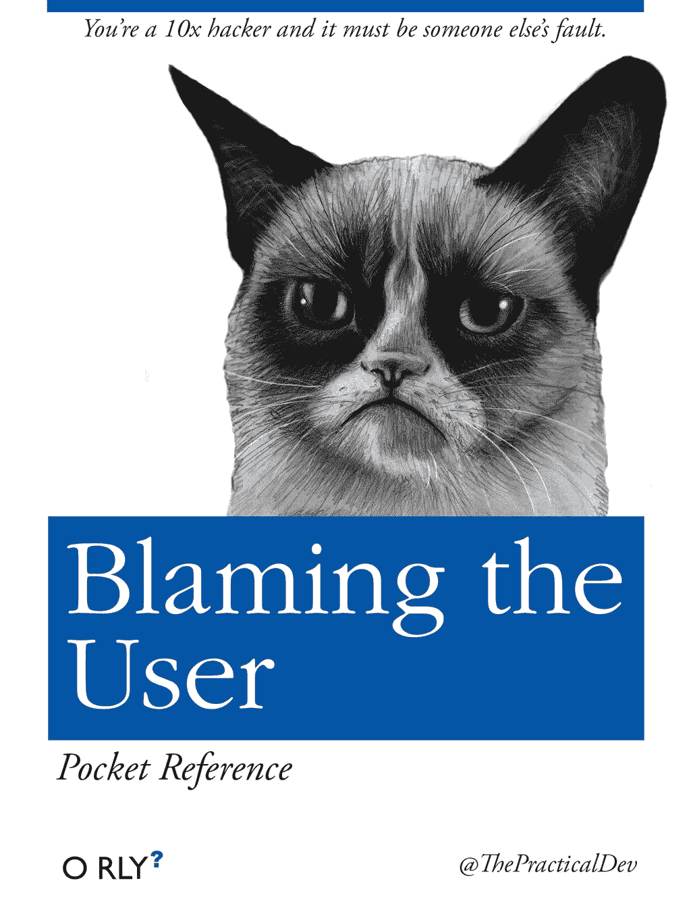

# 嘿嘿，无罪

> 原文：[`towardsdatascience.com/uh-uh-not-guilty/`](https://towardsdatascience.com/uh-uh-not-guilty/)

<mdspan datatext="el1746667449210" class="mdspan-comment">当库克县监狱的六位快乐的谋杀犯登上芝加哥音乐剧的舞台时，[她们在信息上是一致的](https://www.youtube.com/watch?v=C1VVB_9nCmg&ab_channel=ED5International)：

> 他们是自找的，他们一直以来都是。
> 
> 我没有做。
> 
> 但如果是我做的，你怎么能告诉我我是错的呢？

而我觉得这首歌中有趣的部分是他们通过道德视角重新定义了他们的暴力行为：“*这是一场谋杀，但不是犯罪。*”

简而言之，这部音乐剧讲述了一个关于[贪婪、谋杀、不公](https://www.loreto.ac.uk/chicago-the-musical/#:~:text=greed%2C%20murder%20and%20injustice)，以及在世界真相被媒体、精明的律师和公众对丑闻的迷恋操纵的世界中展开的**责任转移情节**。

作为观众席上的旁观者，很容易被受害者眼中描绘的故事所吸引，他们只是对无法容忍的情况做出反应。

对于责任转移感觉满足的原因，似乎有一个科学解释。将负面事件归因于外部原因（其他人或情况）[激活了与奖励处理相关的脑区](https://pmc.ncbi.nlm.nih.gov/articles/PMC8019091/#:~:text=choosing%20a%20self%2Dserving%20attribution%20is%20a%20selection%20of%20the%20highest%20rewarding%20alternative)。如果感觉良好，它就会加强这种行为并使其更加自动化。

这种有趣的责怪转移戏码现在正在生活中上演，人类也可以开始指责由 LLM（大型语言模型）驱动的**工具**在决策和生活结果上的不足。可能还会提出这样的论点……

### [艺术差异](https://www.allmusicals.com/lyrics/chicago/cellblocktango.htm#:~:text=I%20guess%20you%20can%20say%20we%20broke%20up%20because%20of%20artistic%20differences)

了解差异（艺术或非艺术）如何让我们为自己的不良行为辩护并将责任推给他人后，认为我们会对 AI 及其背后的模型做同样的事情，这似乎是常识。

在寻找 AI 相关失败的责任方时，一篇名为“[*AI 的错，不是我的错*](https://pubmed.ncbi.nlm.nih.gov/39693294/)*,*”的论文揭示了人类根据涉及的人和他们的参与方式归因责任的模式。

研究探讨了两个关键问题：

+   (1) 如果我们把 AI 看作具有类似人类的特点，我们会更多地责怪 AI 吗？

+   (2) 这是否方便地减少了人类利益相关者（程序员、团队、公司、政府）的责任？

通过 2022 年初进行的三个研究，在通过 UI“官方”开始生成 AI 时代之前，研究考察了当 AI 系统犯下道德违规行为时，人类如何分配责任，例如显示种族偏见、向儿童展示不适当的内容或不公平地分配医疗资源，并发现以下情况：

> 当 AI 被描绘成具有更多类似人类的认知能力时，参与者更愿意指责 AI 系统在道德上的失败。

其他发现表明，并非所有人类代理都能同样摆脱干系：

+   **公司**从这种责任转移游戏中受益更多，当 AI 看起来更像是人类时，它们承担的责任更少。

+   同时，**AI 程序员、团队和政府监管机构**无论 AI 看起来多么像人类，都没有减少责任。

可能最重要的发现是：

> 在所有场景中，与人类代理相比，AI 始终承担了更小的责任比例，而**AI 程序员或 AI 团队**承担了最重的责任负担。

这些发现是如何解释的？

研究表明，这与**感知角色和结构清晰度**有关：

+   **公司**由于其“复杂且往往不透明的结构”，当 AI 看起来更像是人类时，可以减少责任。他们更容易将自己与 AI 事故分开，并将责任转移到看似自主的 AI 系统上。

+   **程序员**在直接参与创建 AI 功能时，无论 AI 是否具有拟人化特征，都承担着坚定的责任。他们在系统决策架构上的“指纹”使得他们几乎无法声称“AI 独立行动”。

+   **政府机构**在维持其监管监督角色时，保持了稳定的（尽管总体上有所下降）责任水平，因为它们对监控 AI 系统的责任依然明确，无论 AI 看起来多么像人类。

这种“[道德替罪羊](https://en.wikipedia.org/wiki/Scapegoating)”表明，随着 AI 系统看起来更加自主和像人类，企业责任可能会逐渐消失。

研究中将道德替罪羊定义为将个人或团体归咎于负面结果的过程，以转移个人或集体的责任。[照片由[Vaibhav Sanghavi](https://unsplash.com/@photoframiac?utm_source=medium&utm_medium=referral)在[Unsplash](https://unsplash.com?utm_source=medium&utm_medium=referral)上拍摄]

你现在可能会说，这是…

### [所有那爵士乐](https://en.wikipedia.org/wiki/All_That_Jazz_%28song%29#:~:text=cynical%20comment%20on%20the%20willingness%20of%20humans...to%20act%20solely%2C%20simply%2C%20and%20remorselessly%20in%20their%20own%20interest)

当风险很高时，媒体通常会发布大标题，将反派定位为：

+   [*“纽约律师因在法律简报中使用虚假 ChatGPT 案例而受到处罚*](https://www.reuters.com/legal/new-york-lawyers-sanctioned-using-fake-chatgpt-cases-legal-brief-2023-06-22/)*”*

+   [*“光标 AI 聊天机器人发明虚假政策，激怒开发者*](https://scalebytech.com/cursor-ai-chatbot-invents-fake-policy-sparks-developer-outrage/)*”*

+   *“*[*希腊女子因 ChatGPT‘预测’其丈夫会出轨而离婚!*](http://tovima.com/society/greek-woman-divorces-husband-after-chatgpt-predicted-he-would-cheat-on-her/)*”*

从所有这些标题中，你可以立即因为对新工具（是的，[工具](https://medium.com/ai-advances/the-good-enough-truth-c7cb2e633799#:~:text=a%20tool.-,A%20tool%20that%20can%E2%80%99t%20understand.,-A%20tool%20that)!) 的构建方式和如何使用、实施或测试缺乏了解而责怪最终用户或开发者，但这一切在损害已经造成，需要有人对此负责时，都无济于事。

谈到责任，我无法跳过[欧盟人工智能法案](https://artificialintelligenceact.eu/high-level-summary/)，以及其监管框架，该框架将人工智能[*提供者*、*部署者*和*进口商*](https://www.ibm.com/think/topics/eu-ai-act#:~:text=Subscribe%20today-,Who%20does%20the%20EU%20AI%20Act%20apply%20to%3F,-The%20EU%20AI)置于风口浪尖，通过以下方式陈述：

> “高风险人工智能系统的使用者（部署者）有一些义务，虽然比提供者（开发者）少。”

因此，法案解释了[不同类别的人工智能系统](https://digital-strategy.ec.europa.eu/en/library/commission-publishes-guidelines-ai-system-definition-facilitate-first-ai-acts-rules-application#:~:text=The%20AI%20Act%2C%20which%20aims,those%20subject%20to%20transparency%20obligations.)，并将**高风险人工智能系统**归类为那些用于招聘、基本服务、执法、移民、司法行政和民主进程等关键领域的系统。

对于这些系统，*提供者*必须实施一个[**风险管理系统**](https://artificialintelligenceact.eu/article/9/)，该系统在整个人工智能系统的生命周期中识别、分析和缓解风险。

这扩展到了一个强制性的[**质量管理体系**](https://artificialintelligenceact.eu/article/17/)，涵盖了监管合规、设计流程、开发实践、测试程序、数据管理和上市后监控。它必须包括“[*一个责任框架，规定了管理层和其他员工的责任。*](https://artificialintelligenceact.eu/article/17/#:~:text=an%20accountability%20framework%20setting%20out%20the%20responsibilities%20of%20the%20management%20and%20other%20staff)”。

在另一方面，[高风险 AI 系统的**部署者**](https://artificialintelligenceact.eu/article/26/)需要实施适当的技术措施，确保人类监督，监控系统性能，并在某些情况下，进行[基本权利影响评估](https://artificialintelligenceact.eu/article/27/)。

> 为了使这一点更加明确，[不遵守规定的处罚](https://artificialintelligenceact.eu/article/99/)可能导致高达 3500 万欧元或全球年营业额的 7%的罚款。

也许你现在认为，“*我摆脱了干系……我只是一个最终用户，所有这些都与我无关*”，但让我提醒你上面已经存在的标题，其中没有任何律师能够[迷惑](https://www.youtube.com/watch?v=8ZYG2PCyNfE&ab_channel=BingeSociety)法官相信在严重影响了其他当事人的工作环境中利用 AI 是无辜的。

既然我们已经澄清了这一点，让我们讨论每个人如何为 AI 责任圈做出贡献。

“你是一个 10 倍黑客，这一定是别人的错。” [图片来源：[链接](https://orlybooks.com/books/blaming-the-user)。图片来自免费在线分发。]

### [当你对 AI 好，AI 对你也好](https://www.youtube.com/watch?v=3t6_odu4lNc&ab_channel=Miramax)

在 AI 管道中承担真正的责任需要所有参与者的个人承诺，并且有了这一点，你能做的最好的事情是：

+   **了解 AI**：不要盲目依赖 AI 工具，首先了解它们是如何构建的，[它们可以解决哪些任务](https://medium.com/ai-advances/did-we-skip-on-machine-learning-d8893d88a02a)。你同样可以将你的任务分类为不同的关键性，并了解在哪些情况下需要人类来完成，以及在哪些情况下 AI 可以通过[人机交互](https://learn.microsoft.com/en-us/semantic-kernel/frameworks/process/examples/example-human-in-loop?pivots=programming-language-python)或独立介入。

+   **建立一个测试系统**：在采取行动之前，创建个人清单以交叉检查 AI 输出与其他来源，并确保有不止一种测试技术和不止一个人类测试员。 (我能说什么呢，归咎于[良好的开发实践](https://www.practitest.com/resource-center/blog/software-testing-best-practices-checklist/)。)

+   **质疑输出结果（始终如此，即使是测试系统）**：在接受 AI 推荐之前，问自己“我对这个输出有多自信？”以及“如果这是错误的，最坏的情况是什么，谁会受到影响？”

+   **记录你的流程**：保留记录你如何使用 AI 工具，你提供了什么输入，以及你基于输出做出的决策。如果你一切都按照规定进行，并遵循流程，那么在 AI 辅助决策过程中，文档将是一个关键的证据。

+   **提出你的担忧**：如果你在使用 AI 工具时注意到有问题的模式，请向相关的人类代理报告。对 AI 系统故障保持沉默不是一个好策略，即使你造成了这个问题的一部分。然而，及时反应并承担责任是通往长期成功的道路。

最后，我建议**熟悉相关法规**，以便在了解你的权利的同时，也能了解你的责任。没有任何框架能改变 AI 决策带有人类指纹的事实，以及人类会认为其他人类，而不是工具，应对 AI 错误负责。

与芝加哥音乐剧中虚构的谋杀犯不同，在真实的 AI 失败案例中，证据链不会随着一个聪明的律师和肤浅的故事而消失。

*感谢阅读！*

*如果你觉得这篇文章有价值，请随意与你的网络分享。👏*

*关注更多故事，请访问*[*Medium*](https://medium.com/@martosi/subscribe)*✍️ 和 *[*LinkedIn*](https://www.linkedin.com/in/martosi/)*🖇️。
