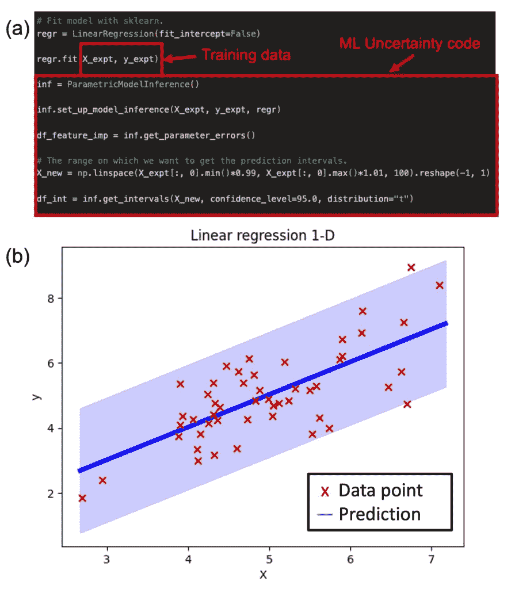
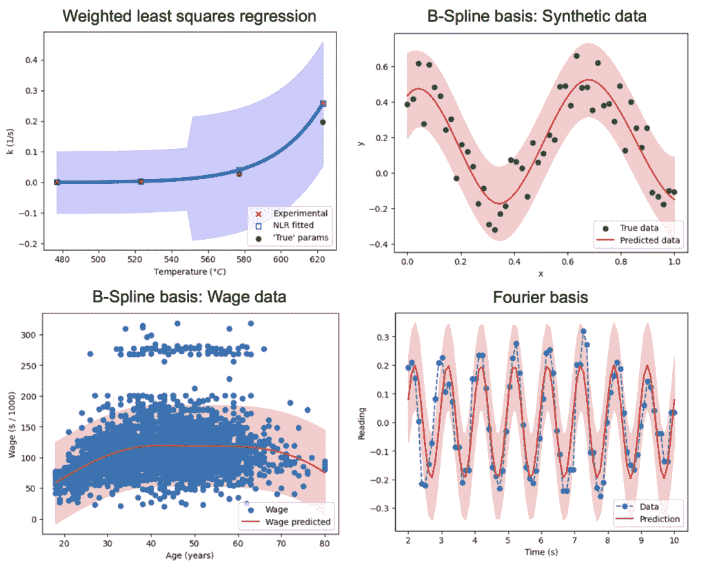
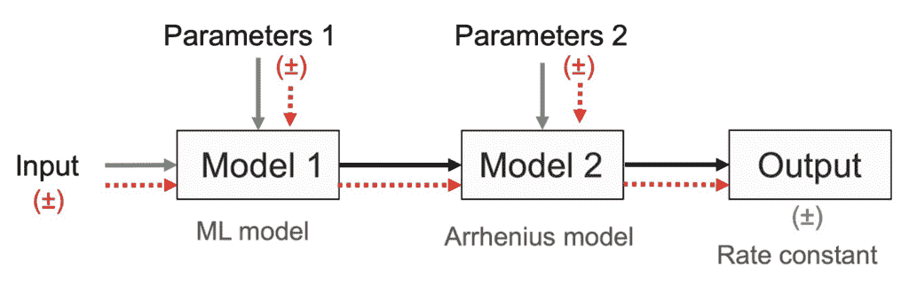

# 带有简单 Python 界面的机器学习中的不确定性量化

> 原文：[`towardsdatascience.com/uncertainty-quantification-in-machine-learning-with-an-easy-python-interface/`](https://towardsdatascience.com/uncertainty-quantification-in-machine-learning-with-an-easy-python-interface/)

<mdspan datatext="el1743016348252" class="mdspan-comment">不确定性量化</mdspan>（UQ）在机器学习（ML）模型中允许估计其预测的精度。这对于在现实世界任务中使用其预测至关重要。例如，如果一个机器学习模型被训练来预测材料的属性，一个预测值有 20%的不确定性（误差），在整体决策过程中可能被非常不同于一个预测值有 5%的不确定性（误差）。尽管其重要性不言而喻，但在 Python 中流行的机器学习软件，如 scikit-learn、Tensorflow 和 Pytorch，并没有提供不确定性量化功能。

介绍 ML Uncertainty：一个旨在解决此问题的 Python 包。它建立在流行的 Python 库之上，如 SciPy 和 scikit-learn，ML Uncertainty 提供了一个非常直观的界面来估计机器学习预测中的不确定性，以及在可能的情况下，模型参数。执行这些估计只需要大约四行代码，该包在后台利用了强大的、理论严谨的数学方法。它利用了所讨论的机器学习模型的潜在统计特性，使得该包在计算上成本低廉。此外，这种方法扩展了其实际应用范围，适用于那些通常只有少量数据可用的情况。

## 动机

我过去 10 年一直是一个狂热的 Python 用户。我喜欢大量创建和维护的强大库，以及非常活跃的社区。当我正在处理一个混合机器学习问题时，我产生了 ML Uncertainty 的想法。我构建了一个机器学习模型来预测某些聚合物的应力-应变曲线。应力-应变曲线——聚合物的关键属性——遵循某些基于物理的规则；例如，在低应变值时，它们有一个线性区域，而拉伸模量随温度降低而减小。

我从文献中找到了一些非线性模型来描述曲线和这些行为，从而将应力-应变曲线简化为一组具有物理意义的参数。然后，我训练了一个机器学习模型来预测这些参数，这些参数可以从一些容易测量的聚合物属性中得出。值得注意的是，我只有几百个数据点，这在科学应用中相当常见。在训练了模型、微调了超参数并进行了异常值分析后，一位利益相关者问我：“这些都很好，但你的预测误差估计是多少？”我意识到用 Python 没有优雅的方式来估计这个。我也意识到这不会是这个问题最后一次出现。这让我走上了最终导致这个包诞生的道路。

在花了一些时间学习统计学之后，我怀疑这个数学问题并非不可能或特别困难。我开始研究并阅读了像《统计学习引论》和《统计学习元素》这样的书籍（1,2），并在那里找到了一些答案。机器学习不确定性是我尝试将这些方法实现为 Python 代码，以更紧密地将统计学整合到机器学习中的尝试。我相信机器学习的未来取决于我们提高预测可靠性和模型可解释性的能力，这是朝着这个目标迈出的一小步。在开发了这个包之后，我经常在我的工作中使用它，它对我帮助很大。

这是对机器学习不确定性的介绍，概述了其背后的理论。我包含了一些方程式来解释理论，但如果这些方程式让你感到困惑，你可以自由地略过它们。对于每一个方程式，我都说明了它所代表的关键思想。

## 开始使用：一个示例

我们通常通过实践学习得最好。所以，在深入之前，让我们考虑一个例子。比如说，我们正在处理一个传统的线性回归问题，其中模型是用 scikit-learn 训练的。我们认为模型已经训练得很好，但我们想要更多信息。例如，输出的预测区间是什么？使用机器学习不确定性，这可以在以下 4 行中完成，如下所示，并在本例中讨论：[`github.com/architdatar/ml_uncertainty/blob/v0.1.1/examples/linear_regression.ipynb`](https://github.com/architdatar/ml_uncertainty/blob/v0.1.1/examples/linear_regression.ipynb)。

展示机器学习不确定性代码（a）和线性回归的图（b）。图片由作者提供。

本包的所有示例都可以在这里找到：[`github.com/architdatar/ml_uncertainty/tree/main/examples`](https://github.com/architdatar/ml_uncertainty/tree/main/examples)。

## 深入探讨：揭开面纱

ML Uncertainty 通过让 ParametricModelInference 类围绕 scikit-learn 中的 LinearRegression 估计器进行包装，以提取进行不确定性计算所需的所有信息来执行这些计算。它遵循不确定性估计的标准程序，这在许多统计学教科书中都有详细说明，²以下是一个概述。

由于这是一个可以用参数（\( \beta \)）表示为 \( y = X\beta \) 的线性模型，ML Uncertainty 首先计算模型的自由度（\( p \)）、误差自由度（\( n – p – 1 \)）和残差平方和（\( \hat{\sigma}² \)）。然后，它计算模型参数的不确定性；即方差-协方差矩阵。³

\( \text{Var}(\hat{\beta}) = \hat{\sigma}² (J^T J)^{-1} \)

其中 \( J \) 是参数的雅可比矩阵。对于线性回归，这可以转化为：

\( \text{Var}(\hat{\beta}) = \hat{\sigma}² (X^T X)^{-1} \)

最后，*get_intervals* 函数通过传播输入和参数中的不确定性来计算预测区间。因此，对于预测和不确定性需要估计的数据 \( X^* \)，预测 \( \hat{y^*} \) 以及 \( (1 – \alpha) \times 100\% \) 的预测区间为：

\( \hat{y^*} \pm t_{1 – \alpha/2, n – p – 1} \, \hat{\sigma} \sqrt{\text{Var}(\hat{y^*})} \)

假设，

\( \text{Var}(\hat{y^*}) = (\nabla_X f)(\delta X^*)²(\nabla_X f)^T + (\nabla_\beta f)(\delta \hat{\beta})²(\nabla_\beta f)^T + \hat{\sigma}² \)

用英语来说，这意味着输出中的不确定性取决于输入的不确定性、参数的不确定性以及残差不确定性。对于多线性模型进行简化，并假设输入没有不确定性，这可以转化为：

\( \text{Var}(\hat{y^*}) = \hat{\sigma}² \left(1 + X^* (X^T X)^{-1} X^{*T} \right) \)

## 线性回归的扩展

因此，当执行线性回归的这四行代码时，幕后发生的就是这些操作。但这并非全部。ML Uncertainty 还配备了两个更强大的功能：

1.  **正则化：** ML Uncertainty 支持 L1、L2 和 L1+L2 正则化。结合线性回归，这意味着它可以满足 LASSO、岭回归和弹性网络回归的需求。查看这个[示例](https://github.com/architdatar/ml_uncertainty/blob/v0.1.1/examples/parametric_model.ipynb)。

1.  **加权最小二乘回归：** 有时，并非所有观测值都是相等的。我们可能希望给某些观测值赋予更高的权重，而给其他观测值赋予较低的权重。在科学研究中，这种情况通常发生在某些观测值具有很高的不确定性，而某些观测值则更为精确时。我们希望回归模型能够反映更精确的观测值，但又不希望完全丢弃具有高不确定性的观测值。在这种情况下，使用加权最小二乘回归。

最重要的是，线性回归的一个关键假设是所谓的*同方差性*；即，响应变量的样本是从具有相似方差的总体中抽取的。如果情况不是这样，可以通过根据它们的方差倒数分配权重来处理。在 ML Uncertainty 中，可以通过简单地指定在*ParametricModelInference*类的*y_train_weights*参数中使用的样本权重来轻松处理，其余的将由系统处理。这一应用在[示例](https://github.com/architdatar/ml_uncertainty/blob/v0.1.1/examples/weighted_non_linear_regression_arrhenius.ipynb)中展示，尽管是针对非线性回归案例。

### 基础展开

我总是对仅通过正确进行线性回归就能完成多少机器学习任务感到着迷。许多类型的数据，如趋势、时间序列、音频和图像，都可以通过基展开来表示。这些表示具有类似线性模型的行为，并具有许多惊人的特性。ML Uncertainty 可以轻松计算这些模型的误差。请查看这些名为[*spline_synthetic_data*](https://github.com/architdatar/ml_uncertainty/blob/v0.1.1/examples/spline_synthetic_data.ipynb)、[*spline_wage_data*](https://github.com/architdatar/ml_uncertainty/blob/v0.1.1/examples/spline_wage_data.ipynb)和[*fourier_basis*](https://github.com/architdatar/ml_uncertainty/blob/v0.1.1/examples/fourier_basis.ipynb)的示例。

使用 ML Uncertainty 进行加权最小二乘回归的结果，包括使用合成数据的 B-Spline 基、使用工资数据的 B-Spline 基和傅里叶基。图片由作者提供。

## 超越线性回归

我们经常遇到无法将底层模型表示为线性模型的情况。这在科学领域很常见，例如，在复杂反应动力学、传输现象、过程控制问题建模时。标准的 Python 包，如 scikit-learn 等，不允许直接拟合这些非线性模型并对它们进行不确定性估计。ML Uncertainty 附带一个名为*NonLinearRegression*的类，能够处理非线性模型。用户可以指定要拟合的模型，该类通过使用类似 scikit-learn 的接口进行拟合，在后台使用 SciPy *least_squares* 函数。这可以轻松地与*ParametericModelInference*类集成，以实现无缝的不确定性估计。与线性回归一样，我们可以处理加权最小二乘法和正则化以用于非线性回归。以下是一个[示例](https://github.com/architdatar/ml_uncertainty/blob/v0.1.1/examples/weighted_non_linear_regression_arrhenius.ipynb)。

## 随机森林

随机森林在领域内获得了显著的流行。它们通过平均决策树的预测来操作。决策树反过来识别一组规则来划分预测变量空间（输入空间），并为每个终端节点（叶子）分配一个响应值。决策树的预测被平均以提供随机森林的预测。¹ 它们特别有用，因为它们可以识别数据中的复杂关系，准确，并且比回归对数据的假设要少。

虽然它在流行的 ML 库如 scikit-learn 中得到了实现，但没有直接的方法来估计预测区间。这对于回归尤为重要，因为随机森林由于其高度的灵活性，往往会对训练数据进行过度拟合。由于随机森林没有像传统回归模型那样的参数，不确定性量化需要以不同的方式进行。

我们使用 Hastie 等人在其书《统计学习的元素》第七章中描述的通过自助法估计预测区间的基本思想。我们可以利用的核心思想是，对于某些数据 \( Z \) 的预测 \( S(Z) \) 的方差可以通过其自助样本的预测来估计，如下所示：

\( \widehat{\text{Var}}[S(Z)] = \frac{1}{B – 1} \sum_{b=1}^{B} \left( S(Z^{*b}) – \bar{S}^{*} \right)² \)

其中 \( \bar{S}^{*} = \sum_b S(Z^{*b}) / B \)。自助样本是从原始数据集中反复独立抽取的样本，从而允许重复。幸运的是，随机森林使用每个决策树的一个自助样本进行训练。因此，每棵树的预测结果都会形成一个分布，其方差为我们提供了预测的方差。但仍然存在一个问题。假设我们想要获得第 \( i^{\text{th}} \) 个训练样本的预测方差。如果我们简单地使用上述公式，一些预测将来自包含 \( i^{\text{th}} \) 个样本的自助样本的树。这可能导致不切实际的方差估计值较小。

为了解决这个问题，ML Uncertainty 中实现的算法只考虑了没有使用 \( i^{\text{th}} \) 个样本进行训练的树的预测。这导致了一个无偏的方差估计值。

这种方法的优点在于我们不需要任何额外的重新训练步骤。相反，*EnsembleModelInference* 类优雅地包装了 scikit-learn 中的 *RandomForestRegressor* 估计器，并从中获取所有必要的信息。

此方法使用张等人⁴所述的方法进行基准测试，该方法指出，一个正确的 \( (1 – \alpha) \times 100\% \) 预测区间是指其包含观察到的响应的概率为 \( (1 – \alpha) \times 100\% \)。从数学上讲，

\( P(Y \in I_{\alpha}) \approx 1 – \alpha \)

这里有一个[示例](https://github.com/architdatar/ml_uncertainty/blob/v0.1.1/examples/ensemble_model.ipynb)，展示了随机森林模型中机器学习不确定性的实际应用。

## 不确定性传播（误差传播）

输入变量和/或模型参数的不确定性对响应变量中的不确定性影响有多大？这种不确定性（认知不确定性）与响应变量内在的不确定性（随机不确定性）相比如何？通常，回答这些问题对于决定行动方针非常重要。例如，如果发现模型参数的不确定性对预测的不确定性贡献很大，那么可以收集更多数据或研究替代模型以减少这种不确定性。相反，如果认知不确定性小于随机不确定性，进一步减少它可能毫无意义。使用机器学习不确定性，这些问题可以轻松回答。

给定一个将预测变量与响应变量相关联的模型，*ErrorPropagation* 类可以轻松计算响应的不确定性。比如说，响应（\( y \)）通过某个函数（\( f \)）和某些参数（\( \beta \)）与预测变量（\( X \)）相关联，表示为：

\( y = f(X, \beta) \).

我们希望获得一些预测数据（\( X^* \)）的响应（\( \hat{y^*} \)）的预测区间，其中模型参数估计为 \( \hat{\beta} \)。\( X^* \) 和 \( \hat{\beta} \) 的不确定性分别由 \( \delta X^* \) 和 \( \delta \hat{\beta} \) 给出。然后，响应变量的 \( (1 – \alpha) \times 100\% \) 预测区间将给出如下：

\( \hat{y^*} \pm t_{1 – \alpha/2, n – p – 1} \, \hat{\sigma} \sqrt{\text{Var}(\hat{y^*})} \)

其中，

\( \text{Var}(\hat{y^*}) = (\nabla_X f)(\delta X^*)²(\nabla_X f)^T + (\nabla_\beta f)(\delta \hat{\beta})²(\nabla_\beta f)^T + \hat{\sigma}² \)

这里重要的是要注意预测的不确定性包括了来自输入、参数以及响应内在不确定性的贡献。

机器学习不确定性包能够传播输入和参数的不确定性，这使得它在科学领域非常实用，因为我们非常关注预测的每个值中的误差（不确定性）。考虑一下经常讨论的混合机器学习概念。在这里，我们通过第一性原理来建模数据中的已知关系，而未知关系则使用黑盒模型。使用机器学习不确定性，可以从这些不同方法中获得的不确定性轻松地通过计算图传播。

一个非常简单的例子是阿伦尼乌斯模型，用于预测反应速率常数。公式 \( k = Ae^{-E_a / RT} \) 非常著名。比如说，参数 \( A, E_a \) 是从某个机器学习模型中预测出来的，并且具有 5% 的不确定性。我们想知道这种不确定性在反应速率常数中会转化为多少误差。

这可以通过使用 ML Uncertainty 轻松实现，如本[示例](https://github.com/architdatar/ml_uncertainty/blob/v0.1.1/examples/error_propagation.ipynb)所示。

通过计算图展示不确定性传播的示意图。图片由作者提供。

## 局限性

截至 v0.1.1 版本，ML Uncertainty 仅适用于使用 scikit-learn 训练的 ML 模型。它原生支持以下 ML 模型：随机森林、线性回归、LASSO 回归、岭回归、弹性网络和回归样条。对于任何其他模型，用户可以创建模型、残差、损失函数等，如非线性回归示例所示。该包尚未针对神经网络、转换器和其他深度学习模型进行测试。

欢迎并高度赞赏开源 ML 社区的贡献。虽然还有很多工作要做，但一些关键的工作领域包括将 ML Uncertainty 适配到其他框架，如 PyTorch 和 Tensorflow，增加对其他 ML 模型的支持，突出显示问题，并改进文档。

## 基准测试

ML Uncertainty 代码已与 Python 的 statsmodels 包进行了基准测试。具体案例可以在[这里](https://github.com/architdatar/ml_uncertainty/tree/main/tests/benchmarking)找到。

## 背景

在机器学习中，不确定性量化已被 ML 社区研究，并且对该领域越来越感兴趣。然而，截至目前，现有的解决方案仅适用于非常特定的用例，并且存在关键的限制。

对于线性模型，statsmodels 库可以提供不确定性量化能力。虽然理论上严谨，但它无法处理非线性模型。此外，模型需要以包特定的格式表达。这意味着用户无法利用 scikit-learn 等 ML 包提供的强大预处理、训练、可视化和其他功能。虽然它可以基于模型参数的不确定性提供置信区间，但它无法传播预测变量（输入变量）的不确定性。

另一类解决方案是模型无关的不确定性量化。这些解决方案利用训练数据的子样本，基于它反复训练模型，并使用这些结果来估计预测区间。虽然在大数据量的极限情况下有时是有用的，但这些技术在训练数据集较小的情况下可能无法提供准确的估计，因为选定的样本可能会导致显著不同的估计。此外，这是一个计算成本高昂的练习，因为模型需要多次重新训练。使用此方法的包包括 MAPIE、PUNCC、UQPy 和 NIST 的 ml_uncertainty（同名，不同包）等，以及其他许多包。(5–8)

使用 ML Uncertainty，目标是保持模型训练及其不确定性量化（UQ）的分离，满足更多通用模型（超越线性回归），利用模型的潜在统计特性，并避免多次重新训练模型以降低计算成本。

## 摘要和未来工作

这是对机器学习不确定性的介绍——一个用于轻松计算机器学习不确定性的 Python 软件包。本包的主要特性已在本文中介绍，其开发的一些哲学思想也进行了讨论。更详细的文档和理论可以在[docs](https://github.com/architdatar/ml_uncertainty/tree/v0.1.1/docs/theory)中找到。虽然这只是个开始，但有很大的扩展空间。欢迎提问、讨论和贡献。代码可以在[GitHub](https://github.com/architdatar/ml_uncertainty/tree/main)上找到，该包可以从[PyPi](https://pypi.org/project/ml-uncertainty/)安装。使用*pip install ml-uncertainty*尝试一下。

## 参考文献

(1) James, G.; Witten, D.; Hastie, T.; Tibshirani, R. *An Introduction to Statistical Learning*; Springer US: New York, NY, 2021\. https://doi.org/10.1007/978-1-0716-1418-1.

(2) Hastie, T.; Tibshirani, R.; Friedman, J. *The Elements of Statistical Learning*; Springer New York: New York, NY, 2009\. https://doi.org/10.1007/978-0-387-84858-7.

(3) Börlin, N. *Nonlinear Optimization*. https://www8.cs.umu.se/kurser/5DA001/HT07/lectures/lsq-handouts.pdf.

(4) Zhang, H.; Zimmerman, J.; Nettleton, D.; Nordman, D. J. Random Forest Prediction Intervals. *Am Stat* **2020**, *74* (4), 392–406\. https://doi.org/10.1080/00031305.2019.1585288.

(5) Cordier, T.; Blot, V.; Lacombe, L.; Morzadec, T.; Capitaine, A.; Brunel, N. Flexible and Systematic Uncertainty Estimation with Conformal Prediction via the MAPIE Library. In *Conformal and Probabilistic Prediction with Applications*; 2023.

(6) Mendil, M.; Mossina, L.; Vigouroux, D. PUNCC: A Python Library for Predictive Uncertainty and Conformalization. In *Proceedings of the Twelfth Symposium on Conformal and Probabilistic Prediction with Applications*; Papadopoulos, H., Nguyen, K. A., Boström, H., Carlsson, L., Eds.; Proceedings of Machine Learning Research; PMLR, 2023; Vol. 204, pp 582–601.

(7) Tsapetis, D.; Shields, M. D.; Giovanis, D. G.; Olivier, A.; Novak, L.; Chakroborty, P.; Sharma, H.; Chauhan, M.; Kontolati, K.; Vandanapu, L.; Loukrezis, D.; Gardner, M. UQpy v4.1: Uncertainty Quantification with Python. *SoftwareX* **2023**, *24*, 101561\. https://doi.org/10.1016/j.softx.2023.101561.

(8) Sheen, D. *Machine Learning Uncertainty Estimation Toolbox*. https://github.com/usnistgov/ml_uncertainty_py.

\[\]
