# 理解矩阵 | 第一部分：矩阵-向量乘法

> 原文：[`towardsdatascience.com/understanding-matrices-part-1-matrix-vector-multiplication/`](https://towardsdatascience.com/understanding-matrices-part-1-matrix-vector-multiplication/)

<mdspan datatext="el1748294644376" class="mdspan-comment">代数矩阵</mdspan>是现代计算机科学和数学各个领域的根本对象，包括但不限于线性代数、机器学习和计算机图形学。

在本系列的 4 个故事中，我将展示一种解释代数矩阵的方法，以便使各种矩阵分析公式的物理意义更加清晰。例如，两个矩阵相乘的公式：

\[\begin{equation}

c_{i,j} = \sum_{k=1}^{p} a_{i,k}*b_{k,j}

\end{equation}\]

或者矩阵链式求逆的公式：

\[\begin{equation}

(ABC)^{-1} = C^{-1}B^{-1}A^{-1}

\end{equation}\]

对于我们大多数人来说，当我们第一次阅读矩阵相关的定义和公式时，可能会产生如下问题：

+   矩阵实际上代表什么，

+   乘以向量的矩阵的物理意义是什么，

+   为什么两个矩阵的乘法要使用这样一个非常规的公式，

+   为什么第一个矩阵的列数必须等于第二个矩阵的行数，

+   矩阵转置的意义是什么，

+   为什么对于某些类型的矩阵，求逆等于转置，

+   …等等。

在这个系列中，我计划介绍一种回答大多数列出问题的方法。那么，让我们开始吧！

在开始之前，这里有一些我在整个系列中使用的符号规则：

+   矩阵用大写字母表示（如 *A*，*B*），而向量和标量用小写字母表示（如 *x*，*y* 或 *m*，*n*），

+   *a[i,j]* – 矩阵 ‘*A*‘ 的第 *i* 行和第 *j* 列的值，

+   *x[i]* – 向量 ‘*x*‘ 的第 *i* 个值。

* * *

## 矩阵乘以向量的运算

让我们暂时把矩阵的最简单操作——加法和减法——放在一边。下一个最简单的操作可能是矩阵与向量的乘法：

\[\begin{equation}

y = Ax

\end{equation}\]

我们知道这种操作的结果是另一个向量 ‘*y*‘，其长度等于 ‘*A*‘ 的行数，而 ‘*x*‘ 的长度应该等于 ‘*A*‘ 的列数。

让我们首先关注 “*n***n*” 方阵（行数和列数相等的矩阵）。稍后我们将观察矩形矩阵的行为。

计算 *y[i]* 的公式是：

\[\begin{equation}

y_i = \sum_{j=1}^{n} a_{i,j}*x_j

\end{equation}\]

…如果以展开的形式书写，则是：

\[\begin{equation}

\begin{cases}

y_1 = a_{1,1}x_1 + a_{1,2}x_2 + \dots + a_{1,n}x_n \\

y_2 = a_{2,1}x_1 + a_{2,2}x_2 + \dots + a_{2,n}x_n \\

\;\;\;\;\; \vdots \\

y_n = a_{n,1}x_1 + a_{n,2}x_2 + \dots + a_{n,n}x_n

\end{cases}

\end{equation}\]

这种扩展的表示法清楚地表明，每个单元格*a[i,j]*在方程组中只出现一次。更精确地说，*a[i,j]*作为*x[j]*的因子出现，并且只参与*y[i]*的总和。这使我们得出以下解释：

> *在矩阵与向量“y = Ax”的乘积中，某个单元格 a[i,j]描述了输出值 y[i]受到输入值 x[j]影响的程度。*

有了这些，我们可以以以下方式在几何上绘制矩阵：

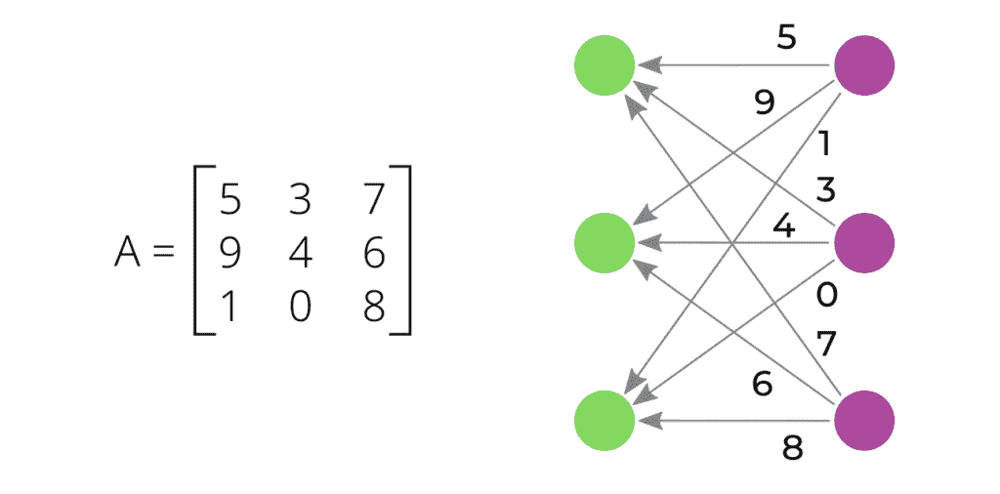

*3×3 矩阵“A”的几何解释（写在左侧）。右侧的堆栈（紫色项）对应于矩阵的输入，即向量‘x’的值。左侧的堆栈（绿色项）对应于矩阵的输出，即向量‘y’的值。每个从‘x[j]’开始并结束于‘y[i]’的箭头对应于某个特定的单元格“a[i,j]”.*

由于我们将要解释矩阵‘*A*’为*x[j]*对*y[i]*的影响，因此将‘*x*’的值附加到右侧堆栈上是合理的，这将导致‘*y*’的值出现在左侧堆栈上。

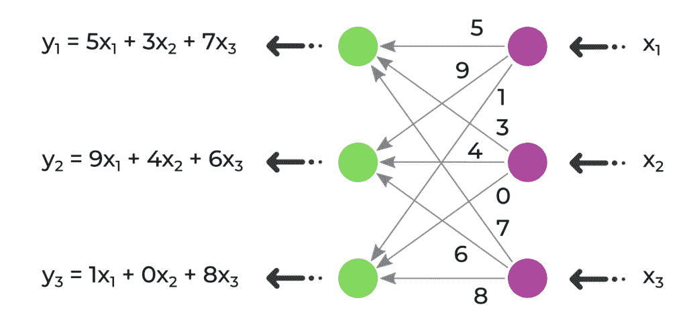

*将输入向量“x = (x[1]，x[2]，x[3]）”的值放置在右侧堆栈上，清楚地显示了输出向量“y = (y[1]，y[2]，y[3]）”的值是如何在左侧堆栈上获得的。*

我更喜欢将矩阵的这种解释称为“X-way 解释”，因为展示的箭头位置看起来像英文字母“X”。对于某个特定的矩阵‘*A*’，我更喜欢将其这样的图形称为‘*A*’的“X 图”。

这种解释清楚地表明，输入向量‘*x*’经历了一种从右到左的某种转换，变成了向量‘*y*’。这就是为什么在线性代数中，矩阵也被称为“变换矩阵”。

如果查看左侧堆栈的任何第*k*项，我们可以看到所有*x*的值是如何被累积到它上面，同时乘以系数*a[k,j]*（这是矩阵的第*k*行）。

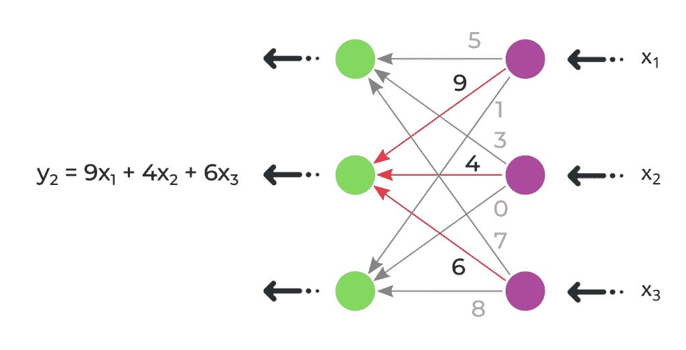

*所有输入值（x[1]，x[2]，x[3]）累积到输出值‘y[2]’上，用红色箭头突出显示。输入值分别乘以系数（9，4，6），这些是矩阵‘A’的 2 行。*

同时，如果我们查看右侧堆栈的任何第*k*项，我们可以看到*x[k]*的值是如何被分配到所有‘y’的值上，同时乘以系数*a[i,k]*（现在矩阵的第*k*列）。

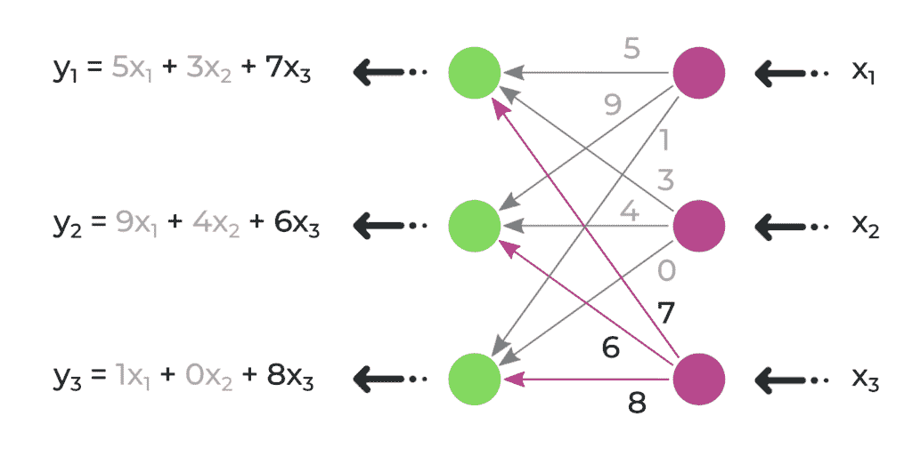

*输入值‘x[3]’向所有输出值（y[1]，y[2]，y[3]）的分布用红色箭头突出显示。输入值‘x[3]’分别乘以系数（7，6，8），这些系数现在是矩阵“A”的第三列。*

这已经给我们带来了另一个洞见，即在 X 向解释矩阵时，左侧堆叠可以与矩阵的行相关联，而右侧堆叠可以与它的列相关联。

当然，如果我们对定位某个值*a[i,j]*感兴趣，查看其 X 图并不像查看矩阵的常规方式（作为一个数字的矩形表）那样方便。但是，正如我们稍后和在这个系列的下一个故事中将要看到的，X 向解释明确地展示了矩阵上各种代数运算的意义。

* * *

## 矩阵

只有当向量“*x*”的长度等于矩阵“A”的列数时，才允许进行形式为“*y* = *Ax*”的乘法。同时，结果向量“*y*”的长度将等于矩阵“A”的行数。因此，如果“A”是一个矩形矩阵，向量“*x*”在通过其变换时将改变其长度。我们可以通过查看 X 向解释来观察这一点：

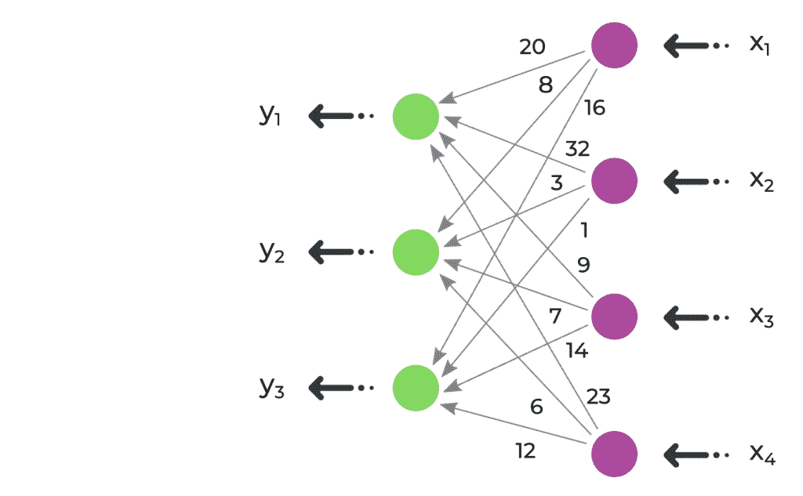

*3*4 矩阵“A”的 X 向解释。我们看到其左侧堆叠的高度为 3（“A”的行数），而其右侧堆叠的高度为 4（“A”的列数）。总共有 3*4=12 条箭头，每条箭头对应一个单独的单元格 a[i,j]。*

现在很清楚，为什么我们只能在长度等于矩阵“A”列数的向量“*x*”上乘以“*A*”，否则向量“*x*”将无法适应 X 图的右侧。

同样，很明显，为什么结果向量“*y* = *Ax*”的长度等于矩阵“A”的行数。

在 X 向划痕中查看矩形矩阵，我们之前已经有一个洞见，即 X 图的左侧堆叠的项目对应于矩阵的行，而其右侧堆叠的项目对应于列。

* * *

## 在 X 向解释中观察几个特殊矩阵

让我们看看 X 向解释如何帮助我们理解某些特殊矩阵的行为：

### 规模/对角矩阵

规模矩阵是这样的方阵，其主对角线上的所有单元格都等于某个值“*s*”，而其他所有单元格都等于 0。将向量“*x*”乘以这样的矩阵会导致“*x*”的每个值都乘以“*s*”：

\[\begin{equation*}

\begin{pmatrix}

y_1 \\ y_2 \\ \vdots \\ y_{n-1} \\ y_n

\end{pmatrix}

=

\begin{bmatrix}

s & 0 & \dots & 0 & 0 \\

0 & s & \dots & 0 & 0 \\

& & \vdots \\

0 & 0 & \dots & s & 0 \\

0 & 0 & \dots & 0 & s

\end{bmatrix}

*

\begin{pmatrix}

x_1 \\ x_2 \\ \vdots \\ x_{n-1} \\ x_n

\end{pmatrix}

=

\begin{pmatrix}

s x_1 \\ s x_2 \\ \vdots \\ s x_{n-1} \\ s x_n

\end{bmatrix}

\end{equation*}\]

X 轴解释的缩放矩阵显示了其物理意义。由于这里唯一的非零单元格是主对角线上的单元格 – *a[i,i]*，X 图将只在相应的输入和输出值对之间有箭头，即*x[i]*和*y[i]*。

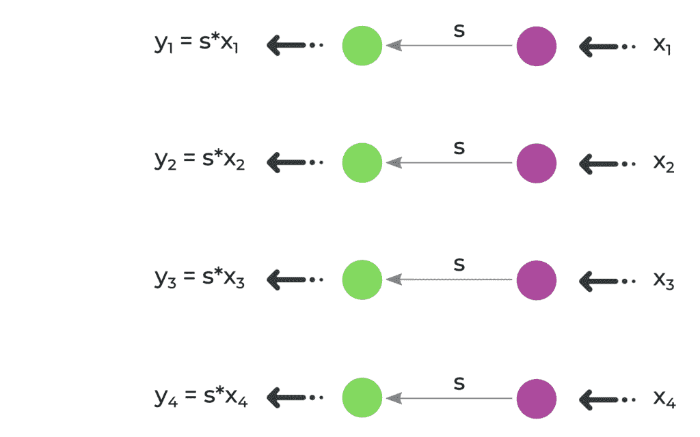

*缩放矩阵的 X 图。每个输出值‘y[i]‘只受输入值‘x[i]‘的影响，这就是为什么图中的所有箭头都是严格水平的。缩放矩阵将输入向量“x”的值乘以’s’，这就是为什么所有箭头附近的系数都等于’s’。*

缩放矩阵的一个特殊情况是对角矩阵（也称为“单位矩阵”），通常用字母“*E*”或“*I*”表示（在本写作中我们将使用“*E*”）。它是一个参数为“*s*=1”的缩放矩阵。

\[\begin{equation*}

\begin{pmatrix}

y_1 \\ y_2 \\ \vdots \\ y_{n-1} \\ y_n

\end{pmatrix}

=

\begin{bmatrix}

1 & 0 & \dots & 0 & 0 \\

0 & 1 & \dots & 0 & 0 \\

& & \vdots \\

0 & 0 & \dots & 1 & 0 \\

0 & 0 & \dots & 0 & 1

\end{bmatrix}

*

\begin{pmatrix}

x_1 \\ x_2 \\ \vdots \\ x_{n-1} \\ x_n

\end{pmatrix}

=

\begin{pmatrix}

x_1 \\ x_2 \\ \vdots \\ x_{n-1} \\ x_n

\end{pmatrix}

\end{equation*}\]

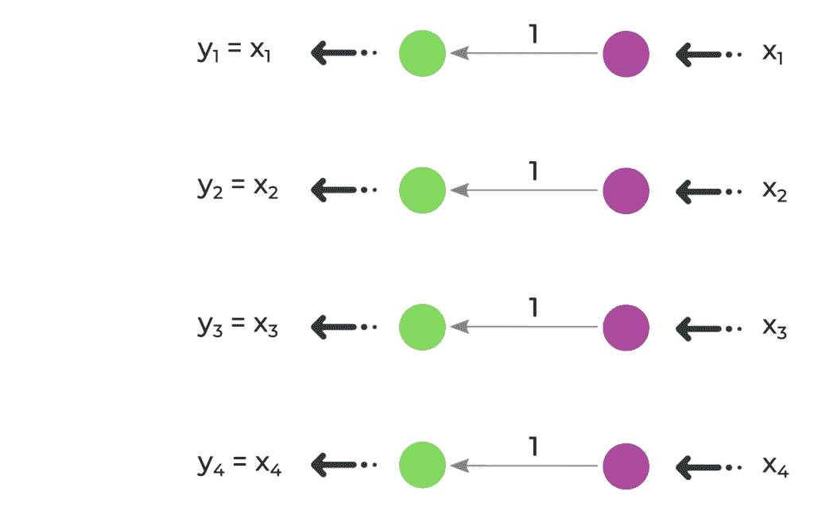

*单位矩阵“E”是一个主对角线上值为“s=1”的缩放矩阵。*

我们看到，进行乘法“*y* = *Ex*”将只使向量‘*x*‘保持不变，因为每个值*x[i]*只是乘以 1。

### 90°旋转矩阵

一个矩阵，它将给定点(x[1], x[2])绕原点(0,0)逆时针旋转 90 度，具有简单形式：

\[\begin{equation*}

\begin{pmatrix}

y_1 \\ y_2

\end{pmatrix}

=

\begin{bmatrix}

0 & -1 \\

1 & \phantom{-}0

\end{bmatrix}

*

\begin{pmatrix}

x_1 \\ x_2

\end{pmatrix}

=

\begin{pmatrix}

-x_2 \\ \phantom{-}x_1

\end{pmatrix}

\end{equation*}\]

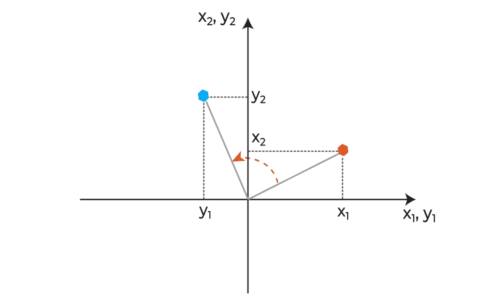

*逆时针在平面上旋转。我们看到，如果原始（红色）点的坐标是(x1, x2)，那么旋转后的（蓝色）点的坐标是(y1, y2) = (-x2, x1)。*

90°旋转矩阵的 X 轴解释显示了这种行为：

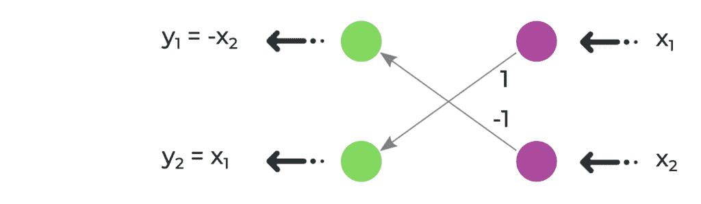

*90°旋转矩阵的 X 轴解释显示了平面上 x[1]和 x[2]坐标的交换。*

### 交换矩阵

交换矩阵‘*J*‘是这样的矩阵，其反对角线上有 1，其他所有单元格都是 0。将其乘以向量‘*x*‘会导致*x*‘的值顺序颠倒：

\[\begin{equation*}

\begin{pmatrix}

y_1 \\ y_2 \\ \vdots \\ y_{n-1} \\ y_n

\end{pmatrix}

=

\begin{bmatrix}

0 & 0 & \dots & 0 & 1 \\

0 & 0 & \dots & 1 & 0 \\

& & \vdots \\

0 & 1 & \dots & 0 & 0 \\

1 & 0 & \dots & 0 & 0

\end{bmatrix}

*

\begin{pmatrix}

x_1 \\ x_2 \\ \vdots \\ x_{n-1} \\ x_n

\end{pmatrix}

=

\begin{pmatrix}

x_n \\ x_{n-1} \\ \vdots \\ x_2 \\ x_1

\end{pmatrix}

\end{equation*}\]

这一事实在交换矩阵‘*J*’的 X 方向解释中得到了明确的说明：

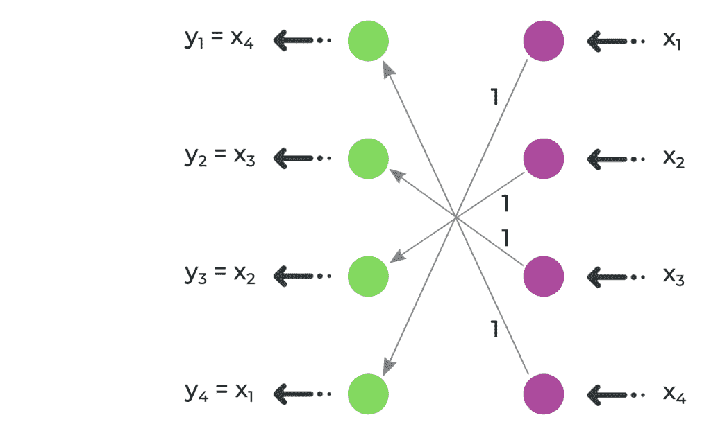

*X 方向的解释显示，输入向量“x”的第 i 个值只流向输出向量“y”的第 i 个值。这些箭头的系数总是 1。这就是为什么向量“y”成为序列“x”的逆序*。

在这里，1 只存在于反对角线上，这意味着输出值 *y[1]* 只受输入值 *x[n]* 的影响，然后 *y[2]* 只受 *x[n-1]* 的影响，依此类推，直到 *y[n]* 只受 *x[1]* 的影响。这在交换矩阵‘*J*’的 X 图中是可见的。

### 位移矩阵

一个位移矩阵是这样的矩阵，它在某些对角线上有 1，这些对角线与主对角线平行，而在所有其他单元格上都有 0：

\[\begin{equation*}

\begin{pmatrix}

y_1 \\ y_2 \\ y_3 \\ y_4 \\ y_5

\end{pmatrix}

=

\begin{bmatrix}

0 & 1 & 0 & 0 & 0 \\

0 & 0 & 1 & 0 & 0 \\

0 & 0 & 0 & 1 & 0 \\

0 & 0 & 0 & 0 & 1 \\

0 & 0 & 0 & 0 & 0

\end{bmatrix}

*

\begin{pmatrix}

x_1 \\ x_2 \\ x_3 \\ x_4 \\ x_5

\end{pmatrix}

=

\begin{pmatrix}

x_2 \\ x_3 \\ x_4 \\ x_5 \\ 0

\end{pmatrix}

\end{equation*}\]

将这样的矩阵与向量“*x*”相乘，结果得到相同的向量，但所有值都向上或向下移动了‘*k*’个位置。‘*k*’等于 1 的对角线与主对角线之间的距离。在所提供的例子中，我们有“*k*=1” (1 的对角线仅比主对角线上方一个位置)。如果 1 的对角线位于右上角，就像在所提供的例子中那样，那么“*x*”的值就会向上移动。否则，值的移动就会向下。

位移矩阵也可以在 X 方向上明确表示：

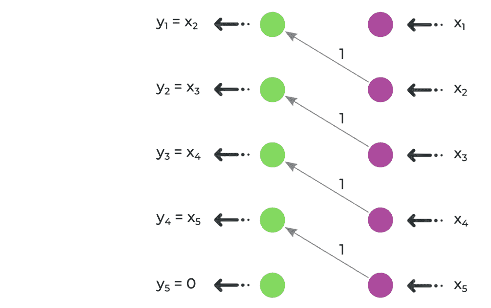

*位移矩阵的 X 图表明，每个输入值“x[i]”只是被转移到输出值“y[i-k]”，其中‘k’是 1 的对角线与主对角线之间的距离。这导致输入向量“x”的值被移动了‘k’个位置。在这里我们有“k=1”*。

### 排列矩阵

排列矩阵是由 0 和 1 组成的矩阵，它以某种方式重新排列输入向量“*x*”的所有值。给人的印象是，当乘以这样的矩阵时，“*x*”的值会被置换。

为了实现这一点，必须有一个 *n***n*-大小的排列矩阵‘*P*’，它必须有‘*n*’个 1，而所有其他单元格都必须是 0。此外，不能在同一行或同一列中出现两个 1。一个排列矩阵的例子是：

\[\begin{equation*}

\begin{pmatrix}

y_1 \\ y_2 \\ y_3 \\ y_4 \\ y_5

\end{pmatrix}

=

\begin{bmatrix}

0 & 0 & 0 & 1 & 0 \\

1 & 0 & 0 & 0 & 0 \\

0 & 0 & 0 & 0 & 1 \\

0 & 0 & 1 & 0 & 0 \\

0 & 1 & 0 & 0 & 0

\end{bmatrix}

*

\begin{pmatrix}

x_1 \\ x_2 \\ x_3 \\ x_4 \\ x_5

\end{pmatrix}

=

\begin{pmatrix}

x_4 \\ x_1 \\ x_5 \\ x_3 \\ x_2

\end{pmatrix}

\end{equation*}\]

如果绘制上述置换矩阵‘*P*’的 X 图，我们将看到这种行为的解释：

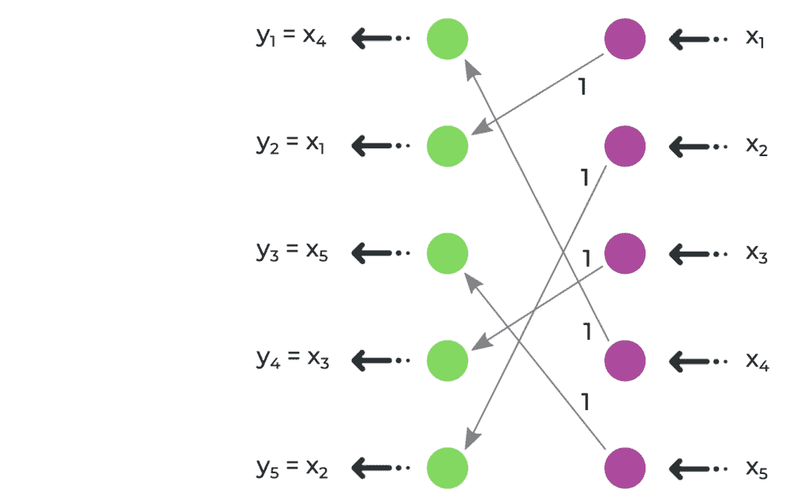

*上述置换矩阵的 X 图。*

没有两个 1 必须出现在同一列的约束意味着只有一个箭头应该从任何右堆中的项目出发。没有两个 1 必须出现在同一行的约束意味着只有一个箭头必须到达左堆中的每个项目。最后，置换矩阵中所有非零单元格必须为 1 的约束意味着某个输入值*x[j]*，在到达输出值*y[i]*时，将不会被任何系数相乘。所有这些结果导致向量“*x*”的值以某种方式重新排列。

### 三角矩阵

三角矩阵是一种矩阵，其主对角线以下或以上的所有单元格都是 0。让我们观察上三角矩阵（其中 0 位于主对角线以下），因为下三角矩阵具有类似的性质。

\[

\begin{equation*}

\begin{pmatrix}

y_1 \\ y_2 \\ y_3 \\ y_4

\end{pmatrix}

=

\begin{bmatrix}

a_{1,1} & a_{1,2} & a_{1,3} & a_{1,4} \\

0 & a_{2,2} & a_{2,3} & a_{2,4} \\

0 & 0 & a_{3,3} & a_{3,4} \\

0 & 0 & 0 & a_{4,4}

\end{bmatrix}

*

\begin{pmatrix}

x_1 \\ x_2 \\ x_3 \\ x_4

\end{pmatrix}

=

\begin{pmatrix}

\begin{aligned}

a_{1,1}x_1 + a_{1,2}x_2 + a_{1,3}x_3 + a_{1,4}x_4 \\

a_{2,2}x_2 + a_{2,3}x_3 + a_{2,4}x_4 \\

a_{3,3}x_3 + a_{3,4}x_4 \\

a_{4,4}x_4

\end{aligned}

\end{pmatrix}

\end{equation*}

\]

这种扩展的表示法说明了任何输出值*y[i]*只受具有更高或相等索引的输入值的影响，即*x[i]，x[i+1]，x[i+2]，…，x[N]*。如果绘制上述上三角矩阵的 X 图，这一事实将变得明显：

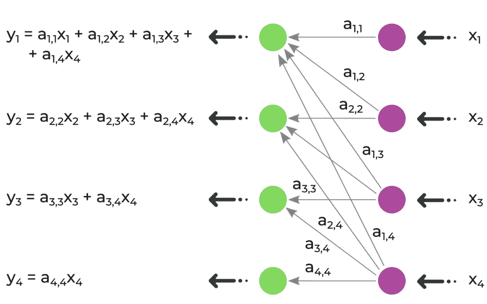

*在上三角矩阵的 X 图中，所有箭头要么是水平的，要么是向上的，这说明了任何输出值‘y[i]’只受相同或更高索引的输入值的影响——‘x[i]’，‘x[i+1]’，‘x[i+2]’，…，‘x[N]’。*

* * *

## 结论

在本系列的第一个故事中，我们探讨了如何将矩阵几何地表示，并将其称为“X 图解释”。这种解释明确突出了矩阵-向量乘法的各种性质，以及几种特殊类型矩阵的行为。

在本系列的下一篇文章中，我们将找到通过操作它们的 X 图来解释两个矩阵乘法的方法，所以请期待第二篇的到来！

* * *

> *我要感谢：*
> 
> – Roza Galstyan，为仔细审阅草案。*
> 
> *如果你喜欢阅读这个故事，请随时在 LinkedIn 上与我联系，在那里，我还会发布其他更新（[`www.linkedin.com/in/tigran-hayrapetyan-cs/`](https://www.linkedin.com/in/tigran-hayrapetyan-cs/)）。*
> 
> *所有使用的图片，除非另有说明，均为作者定制设计。*
