# 理解矩阵 | 第二部分：矩阵-矩阵乘法

> 原文：[`towardsdatascience.com/understanding-matrices-part-2-matrix-matrix-multiplication/`](https://towardsdatascience.com/understanding-matrices-part-2-matrix-matrix-multiplication/)

在本系列的[第一篇故事](https://towardsdatascience.com/understanding-matrices-part-1-matrix-vector-multiplication/) [1]中，我们有：

+   矩阵与向量的乘法运算,

+   介绍了一个给定矩阵的 X 图概念，

+   观察到几个特殊矩阵在乘以向量时的行为。

在当前的第二篇故事中，我们将掌握矩阵-矩阵乘法的物理意义，理解为什么乘法不是对称操作（即为什么“A*B ≠ B*A”），最后，我们将看到几个特殊矩阵在相互乘法时的行为。

让我们开始吧，我们将通过回忆我在整个系列中使用的定义来完成它：

+   矩阵用大写字母表示（如‘*A*’和‘*B*’），而向量和标量用小写字母表示（如‘*x*’、‘*y*’或‘*m*’、‘*n*’）。

+   |*x*| – 向量‘*x*’的长度,

+   *rows*(*A*) – 矩阵‘*A*’的行数,

+   *columns*(*A*) – 矩阵‘*A*’的列数。

* * *

## 矩阵乘法的概念

两个矩阵“*A*”和“*B*”的乘法可能是矩阵分析中最常见的操作。一个已知的事实是，“*A*”和“*B*”只有在“*columns*(*A*) = *rows*(*B*)”的情况下才能相乘。同时，“*A*”可以有任意多的行，而“*B*”可以有任意多的列。乘积矩阵“*C* = *A***B*”的单元格通过以下公式计算：

\[

\begin{equation*}

c_{i,j} = \sum_{k=1}^{p} a_{i,k}*b_{k,j}

\end{equation*}

\]

其中“*p* = *columns*(*A*) = *rows*(*B*)”。结果矩阵“*C*”将具有以下维度：

> *rows*(*C*) = *rows*(*A*),
> 
> *columns*(*C*) = *columns*(*B*).

在对乘法公式进行操作时，计算“*A***B*”时，我们应该并行扫描“*A*”的*i*-行和“*B*”的*j*-列，然后将所有乘积“*a[i,k]***b[k,j]*”相加，我们就会得到“*c[i,j]*”的值。

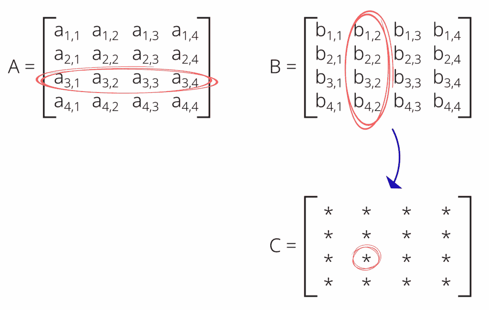

*要扫描的行和列，以计算乘积矩阵“C = A*B”中的单元格“c[i,j]”。在这里，我们扫描“A”的第三行和“B”的第二列，从而得到值“c[3,2]”。

另一个众所周知的事实是，矩阵乘法不是对称操作，即“*A***B* ≠ *B***A*”。无需深入细节，我们已能看出，当乘以两个矩形矩阵时：

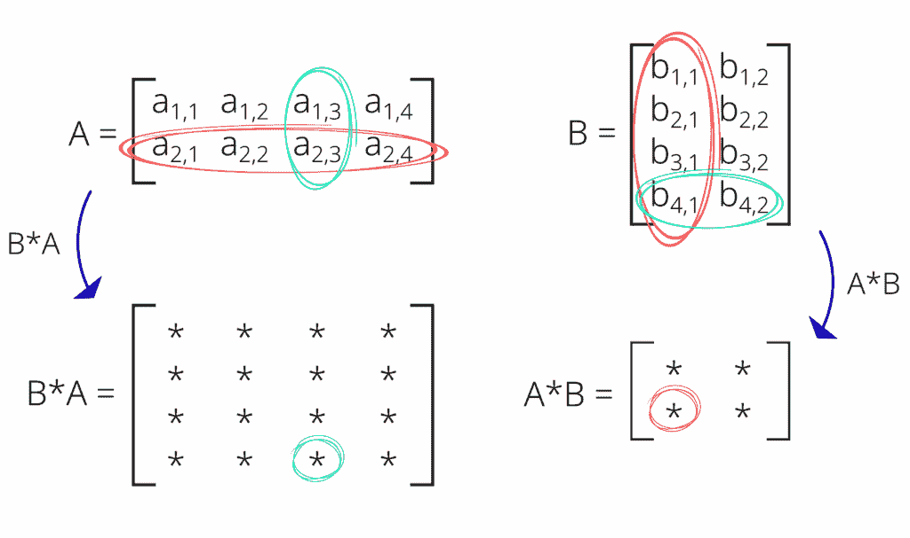

*两个矩阵“A”和“B”，分别具有 2×4 和 4×2 的大小。乘以“A*B”将得到一个 2×2 大小的矩阵，而乘以“B*A”将得到一个 4×4 大小的矩阵。高亮区域显示了扫描方向——红色区域用于计算“A*B”的一个单元格，绿色区域用于计算“B*A”的一个单元格。*

对于新手来说，矩阵乘法不是对称操作的事实往往显得很奇怪，因为几乎为任何其他对象定义的乘法都是对称操作。另一个往往不清楚的事实是为什么矩阵乘法要使用这样一个奇怪的公式。

在这个故事中，我将给出我对这两个问题的答案，而不仅仅是它们...

* * *

## 矩阵乘法公式的推导

乘以“*A***B*”应该产生这样一个矩阵‘*C*’，使得：

> *y* = *C***x* = (*A***B*)**x* = *A**(*B***x*).

换句话说，将任何向量‘*x*’乘以乘法矩阵“*C*=*A***B*”应该得到相同的向量‘*y*’，这是我们首先将‘*B*’乘以‘*x*’，然后乘以那个中间结果时将收到的。

这已经解释了为什么在“*C*=*A***B*”中，应该保持“*columns*(*A*) = *rows*(*B*)”的条件。这是因为中间向量的长度。让我们用‘*t*’表示它：

> *t* = *B***x*,
> 
> *y* = *C***x* = (*A***B*)**x* = *A**(*B***x*) = *A***t*.

显然，由于“*t* = *B***x*”，我们将得到一个长度为“|*t*| = *rows*(*B*)”的向量‘*t*’。但后来，矩阵‘*A*’将要乘以‘*t*’，这要求‘*t*’的长度为“|*t*| = *columns*(*A*)”。从这两个事实中，我们就可以推断出：

> *rows*(*B*) = |*t*| = *columns*(*A*), 或者
> 
> *rows*(*B*) = *columns*(*A*).

在本系列的第一个故事[1]中，我们学习了矩阵-向量乘法“*A***x*”的“X-way 解释”。考虑到对于“*y* = (*A***B*)*x*”，向量‘*x*’首先通过矩阵‘*B*’的变换，然后继续通过矩阵‘*A*’的变换，我们可以扩展“X-way 解释”的概念，并将矩阵-矩阵乘法“*A***B*”表示为 2 个相邻的 X 图：

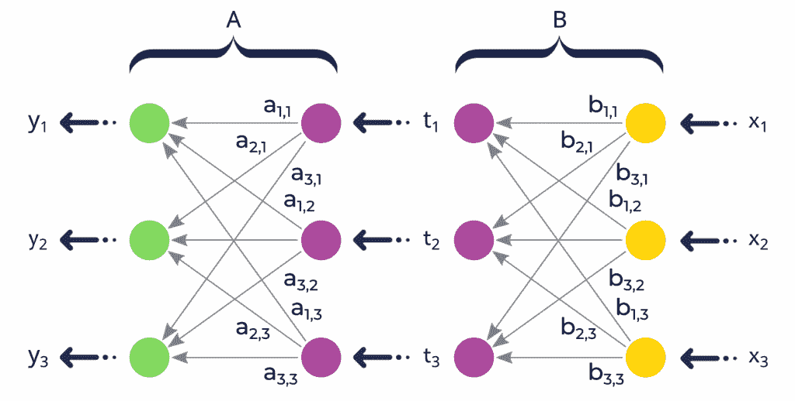

向量‘x’（右侧堆栈）通过乘法矩阵“C=A*B”从右向左的变换。最初，它通过矩阵‘B’，并产生一个中间向量‘t’（中间堆栈）。然后‘t’通过变换‘A’并产生最终的向量‘y’（左侧堆栈）。

现在，矩阵‘*C*’的某个单元格“*c[i,j]*”应该等于什么？从第一部分——“矩阵-向量乘法” [1] 中，我们记得“*c[i,j]*”的物理意义是——输入值‘*x[j]*’对输出值‘*y[i]*’的影响程度。考虑到上面的图，让我们看看某个输入值‘*x[j]*’如何影响某个其他输出值‘*y[i]*’。它可以通过中间值‘*t[1]*’影响，即通过箭头“*a[i,1]*”和“*b[1,j]*”。同样，影响也可以通过中间值‘*t[2]*’发生，即通过箭头“*a[i,2]*”和“*b[2,j]*”。一般来说，‘*x[j]*’对‘*y[i]*’的影响可以通过中间向量‘*t*’的任何值‘*t[k]*’发生，即通过箭头“*a[i,k]*”和“*b[k,j]*”。

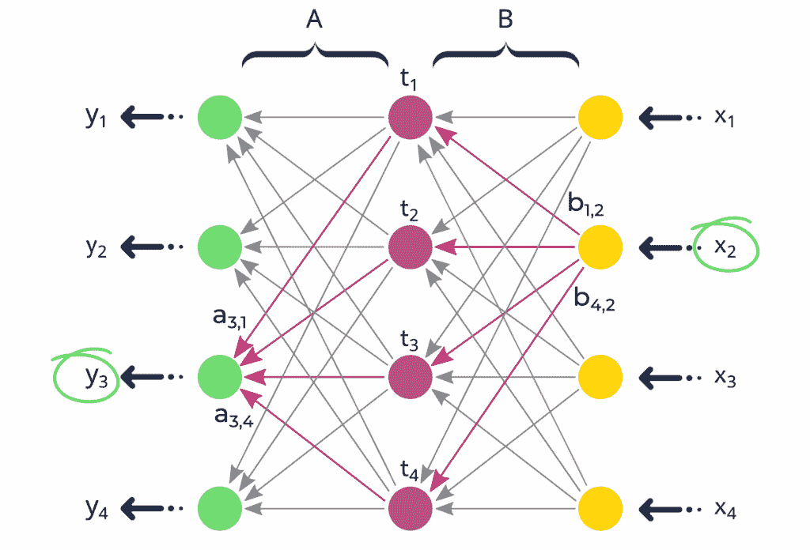

*输入值‘x[2]’可以影响输出值‘y[3]’的所有可能方式的示意图。影响可以通过中间值‘t[1]’（作为“a[3,1]*b[1,2]”），以及通过中间值‘t[2]’（作为“a[3,2]*b[2,2]”），或者通过中间向量‘t’的任何其他 k-th 值（作为“a[3,k]*b[k,2]”）。所有 4 种可能的方式都用红色突出显示。

因此，存在‘*p*’种可能的方式，其中值‘*x[j]*’影响‘*y[i]*’，其中‘*p*’是中间向量的长度：“*p* = |*t*| = |*B***x*|”。影响如下：

\[\begin{equation*}

\begin{matrix}

a_{i,1}*b_{1,j}, \\

a_{i,2}*b_{2,j}, \\

a_{i,3}*b_{3,j}, \\

\dots \\

a_{i,p}*b_{p,j} \\

\end{matrix}

\end{equation*}\]

所有这些‘*p*’影响都是相互独立的，这就是为什么在矩阵乘法的公式中它们以和的形式参与：

\[\begin{equation*}

c_{i,j} =

a_{i,1}*b_{1,j} + a_{i,2}*b_{2,j} + \dots + a_{i,p}*b_{p,j} =

\sum_{k=1}^{p} a_{i,k}*b_{k,j}

\end{equation*}\]

这是我对矩阵-矩阵乘法公式的视觉解释。顺便说一下，将“*A***B*”解释为“*A*”和“*B*”的 X 图的连接明确显示了为什么应该保持条件“*columns*(*A*) = *rows*(*B*)”。这很简单，因为否则将无法连接两个 X 图：

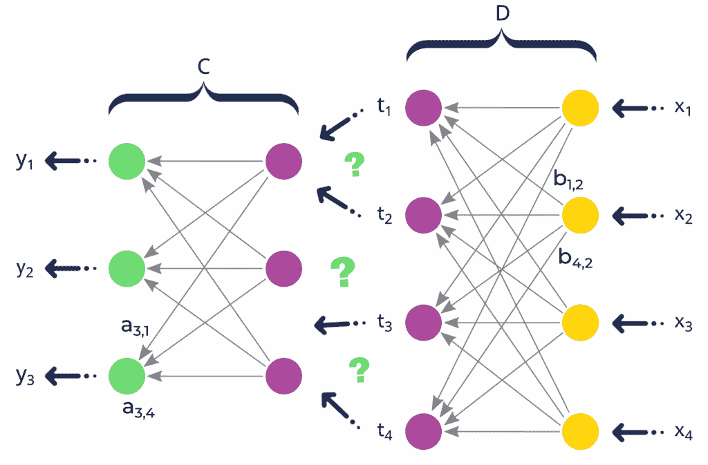

*尝试乘以这样的两个矩阵“C”和“D”，其中“columns(C) ≠ rows(D)”。它们的 X 图将不会匹配，也不能连接。

* * *

## 为什么“A*B ≠ B*A”

将矩阵乘法“*A***B*”解释为“*A*”和“*B*”的 X 图的连接也解释了为什么矩阵乘法不是对称的，即“*A***B* ≠ *B***A*”。让我在两个特定的矩阵上展示这一点：

\[\begin{equation*}

A =

\begin{bmatrix}

0 & 0 & 0 & 0 \\

0 & 0 & 0 & 0 \\

a_{3,1} & a_{3,2} & a_{3,3} & a_{3,4} \\

a_{4,1} & a_{4,2} & a_{4,3} & a_{4,4}

\end{bmatrix}

,\ \ B =

\begin{bmatrix}

b_{1,1} & b_{1,2} & 0 & 0 \\

b_{2,1} & b_{2,2} & 0 & 0 \\

b_{3,1} & b_{3,2} & 0 & 0 \\

b_{4,1} & b_{4,2} & 0 & 0

\end{bmatrix}

\end{equation*}\]

在这里，矩阵‘*A*’的上半部分填充了零，而‘*B*’在其右侧有零。相应的 X 图如下：

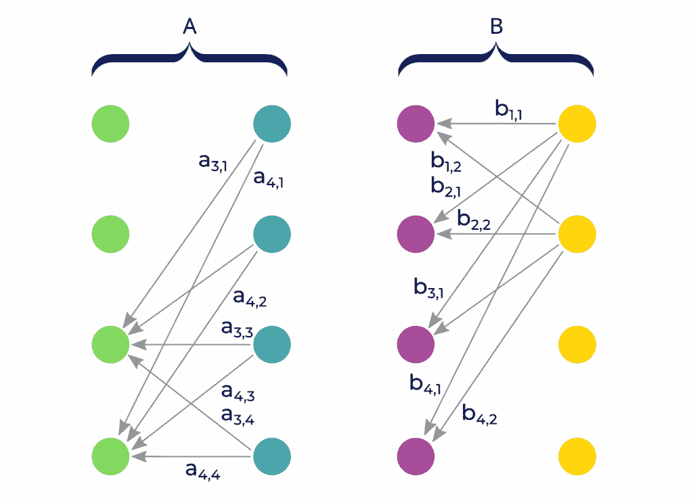

*对应于上述矩阵“A”和“B”的 X 图。注意，对于零单元格，我们只是不画相应的箭头。

由于‘A’在其上方行有零，导致其左侧堆叠的上方项是断开的。

由于‘B’在其右侧列有零，导致其右侧堆叠的较低项是断开的。

如果尝试乘以“*A***B*”会发生什么？那么 A 的 X 图应该放在 B 的 X 图的左侧。

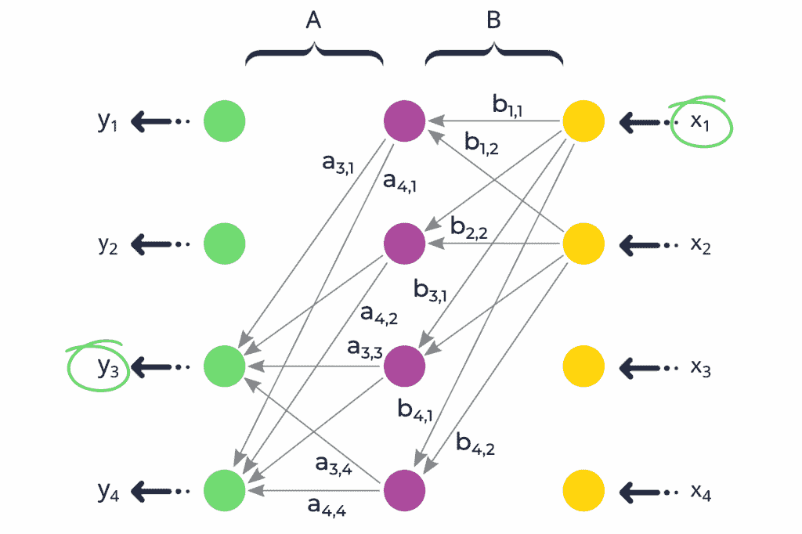

“A”和“B”的 X 图的连接，对应于“A*B”。有 4 对左右项，实际上可以相互影响。一个示例对是（y*[*3*]*，x*[*1*]*)，已突出显示.*

有这样的放置，我们看到输入值‘*x*[1]‘和‘*x*[2]‘可以影响输出值‘*y*[3]‘和‘*y*[4]‘。特别是，这意味着乘积矩阵“*A***B*”是非零的。

\[

\begin{equation*}

A*B =

\begin{bmatrix}

0 & 0 & 0 & 0 \\

0 & 0 & 0 & 0 \\

c_{3,1} & c_{3,2} & 0 & 0 \\

c_{4,1} & c_{4,2} & 0 & 0

\end{bmatrix}

\end{equation*}

\]

现在，如果我们尝试以相反的顺序乘这两个矩阵，会发生什么？为了表示乘积“*B***A*”，B 的 X 图应该画在 A 的图的左侧：

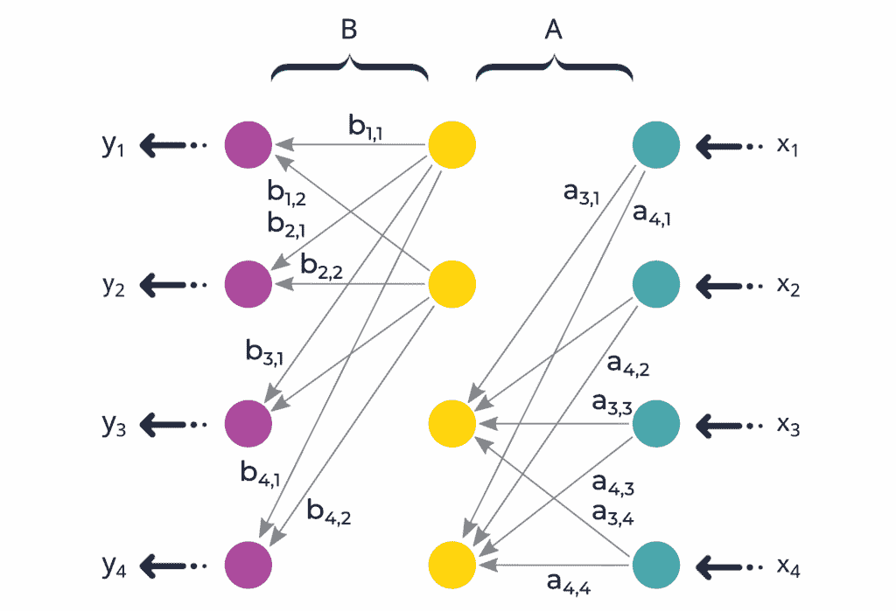

*“B”和“A”的 X 图的连接，对应于乘积“B*A”。这导致两个不相交的部分，因此没有任何方式可以使右栈中的任何项‘x[j]‘影响左栈中的任何项‘y[i]‘.*

我们看到现在没有连接路径，任何输入值“*x*[*j*]”都无法影响任何输出值“*y*[*i*]”。换句话说，在乘积矩阵“*B***A*”中没有任何影响，实际上是一个零矩阵。

\[\begin{equation*}

B*A =

\begin{bmatrix}

0 & 0 & 0 & 0 \\

0 & 0 & 0 & 0 \\

0 & 0 & 0 & 0 \\

0 & 0 & 0 & 0

\end{bmatrix}

\end{equation*}\]

这个例子清楚地说明了为什么矩阵-矩阵乘法中的顺序很重要。当然，还可以找到许多其他例子。

* * *

## 矩阵乘链

当我们乘以 3 个或更多矩阵时，X 图也可以连接。例如，对于以下情况：

> *G* = *A***B***C*,

我们可以按以下方式绘制连接：

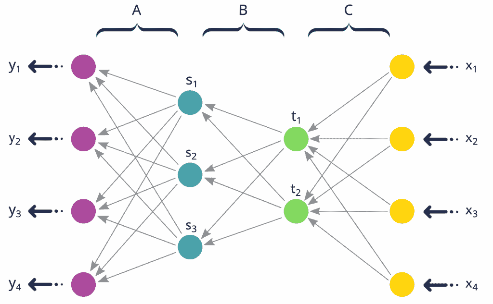

3 个 X 图的连接，对应于矩阵“A”，“B”和“C”。矩阵的大小分别为 4×3，3×2 和 2×4。两个中间向量‘t’和‘s’用浅绿色和深绿色项目表示.*

这里我们现在有两个中间向量：

> *t* = *C***x*, and
> 
> *s* = (*B***C*)**x* = *B**(*C**x) = *B***t*

while the result vector is:

> *y* = (*A***B***C*)**x* = *A**(*B**(*C***x*)) = *A**(*B***t*) = *A***s*.

一些输入值“*x[j]*”可以影响一些输出值“*y[i]*”的可能方式数量在这里增长了一个数量级。

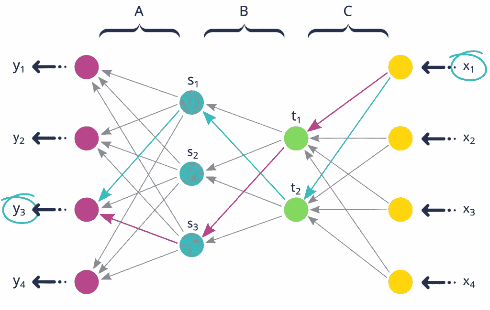

*两种可能的方式，用红色和浅蓝色突出显示，通过输入值“x[1]”可以影响输出值“y[3]”的六种方式中两种.*

更精确地说，某些“*x[j]*”对“*y[i]*”的影响可以通过第一个中间栈“*t*”中的任何一项，以及第二个中间栈“*s*”中的任何一项来实现。因此，影响的方式数量变为“|*t*|*|*s*|”，而“*g[i,j]*”的公式变为：

\[\begin{equation*}

g_{i,j} = \sum_{v=1}^{|s|} \sum_{u=1}^{|t|} a_{i,v}*b_{v,u}*c_{u,j}

\end{equation*}\]

* * *

## 特殊类型矩阵的乘法

我们已经可以直观地解释矩阵-矩阵乘法。在本系列的第一个故事[1]中，我们还学习了几个特殊类型的矩阵——尺度矩阵、移位矩阵、置换矩阵以及其他。那么，让我们看看这些类型的矩阵是如何进行乘法的。

### 尺度矩阵的乘法

尺度矩阵仅在它的对角线上有非零值：

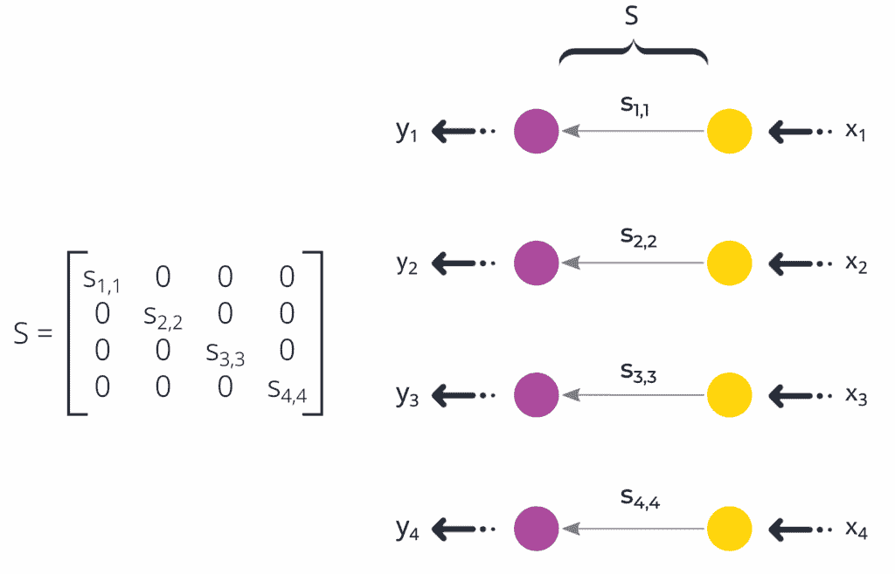

*4x4 尺度矩阵的 X 图。每个输入项“x[i]”只能影响相应的输出项“y[i]”。*

从理论我们知道，乘以两个尺度矩阵会产生另一个尺度矩阵。为什么是这样呢？让我们连接两个尺度矩阵的 X 图：

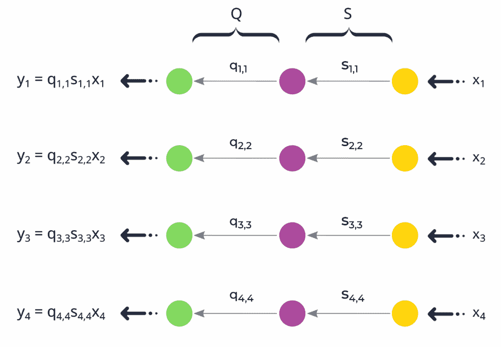

*两个尺度矩阵“Q”和“S”的乘法，作为它们 X 图的连接。*

连接 X 图清楚地显示，任何输入项“*x[i]*”仍然只能影响相应的输出项“*y[i]*”。它无法影响任何其他输出项。因此，结果结构的行为与某些其他尺度矩阵相同。

### 移位矩阵的乘法

移位矩阵是一种，当乘以某些输入向量“*x*”时，将“*x*”的值向上或向下移动某些“*k*”个位置，并用零填充空位。为了实现这一点，移位矩阵“*V*”必须在与其主对角线平行的行上有 1(s)，在其他所有单元格上有 0(s)。

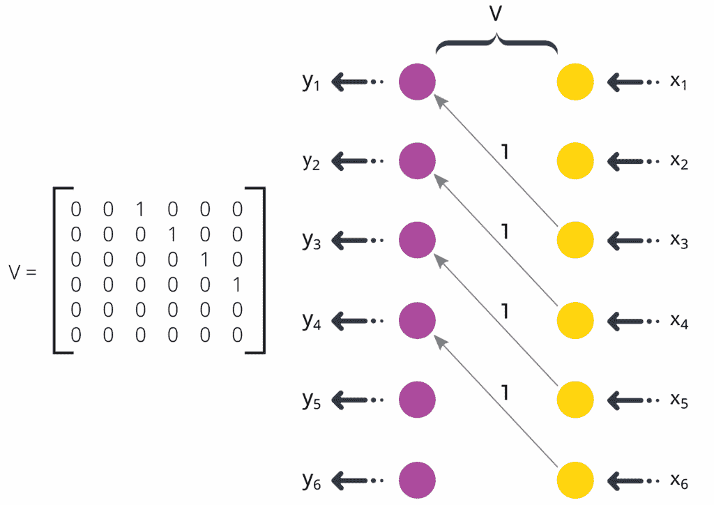

*“V”矩阵的示例及其 X 图。该矩阵将输入向量“x”的所有值向上移动 2 个位置。*

理论上讲，乘以两个移位矩阵“*V1*”和“*V2*”会产生另一个移位矩阵。使用 X 图进行解释可以清楚地说明这一点。乘以移位矩阵“*V1*”和“*V2*”相当于连接它们的 X 图：

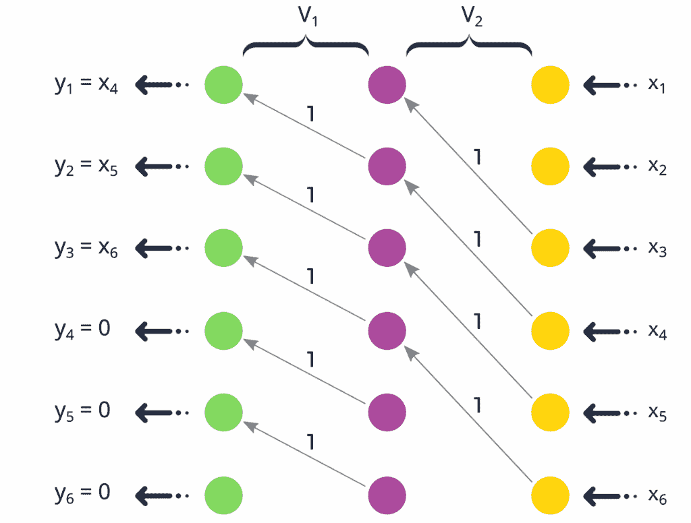

*两个移位矩阵“V1”和“V2”的 X 图连接表现为另一个移位矩阵，因为输入向量“x”的每个值仍然被向上移动一定数量的位置。*

我们可以看到，如果移位矩阵“*V1*”将其输入向量的值向上移动“*k1*”个位置，而移位矩阵“*V2*”将其输入向量的值向上移动“*k2*”个位置，那么结果矩阵“*V3* = *V1***V2*”将输入向量的值向上移动“*k1*+*k2*”个位置，这意味着“*V3*”也是一个移位矩阵。

### 置换矩阵的乘法

置换矩阵是一种，当乘以输入向量“*x*”时，会重新排列“*x*”中值的顺序。为了这样做，大小为*N*x*N*的置换矩阵“*P*”必须满足以下标准：

+   它应该有*N* 1(s)，

+   没有两个 1(s)应该在同一行或同一列，

+   所有剩余的单元格应为 0(s)。

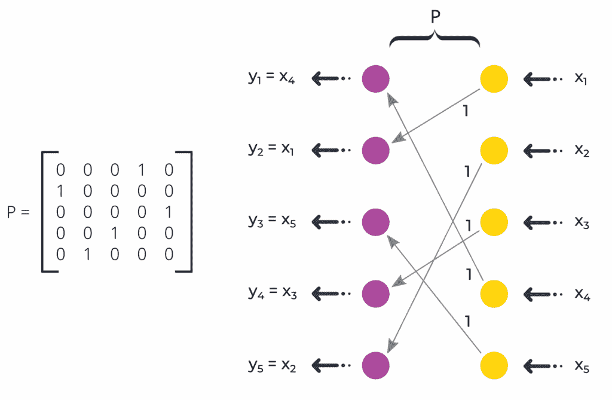

*一个 5×5 大小的置换矩阵‘P’的示例及其对应的 X 图。我们看到输入向量“（x1, x2, x3, x4, x5）”的值正在被重新排列为“（x4, x1, x5, x3, x2）”*。

根据理论，乘以两个置换矩阵‘*P1*’和‘*P2*’会产生另一个置换矩阵‘*P3*’。虽然如果以常规方式（如扫描‘*P1*’的行和‘*P2*’的列）来看矩阵乘法，这个原因可能不够清楚，但如果通过 X 图的解释来看，就会变得非常清晰。乘以“*P1***P2*”等同于连接‘*P1*’和‘*P2*’的 X 图。

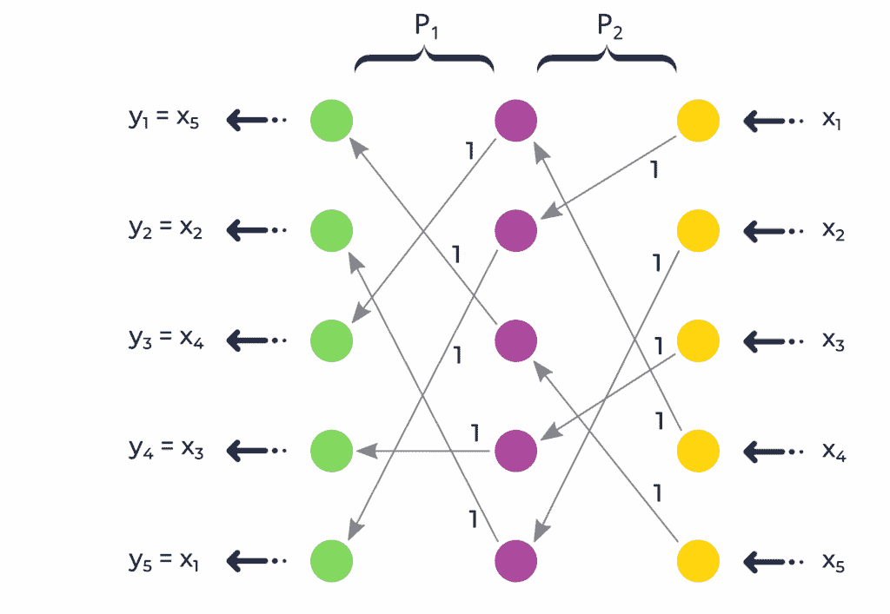

*置换矩阵‘P1’和‘P2’的 X 图的连接表现为值的另一种重新排列*。

我们看到，右侧堆栈的每个输入值‘*x[j]*’仍然只有一条路径可以到达左侧堆栈上的某个其他位置‘*y[i]*’。因此，“*P1***P2*”仍然作用于输入向量‘*x*’的所有值的重新排列，换句话说，“*P1***P2*”也是一个置换矩阵。

### 三角矩阵的乘法

三角矩阵的所有零要么在其主对角线之上，要么在其之下。在这里，让我们专注于上三角矩阵，其中零在主对角线之下。下三角矩阵的情况类似。

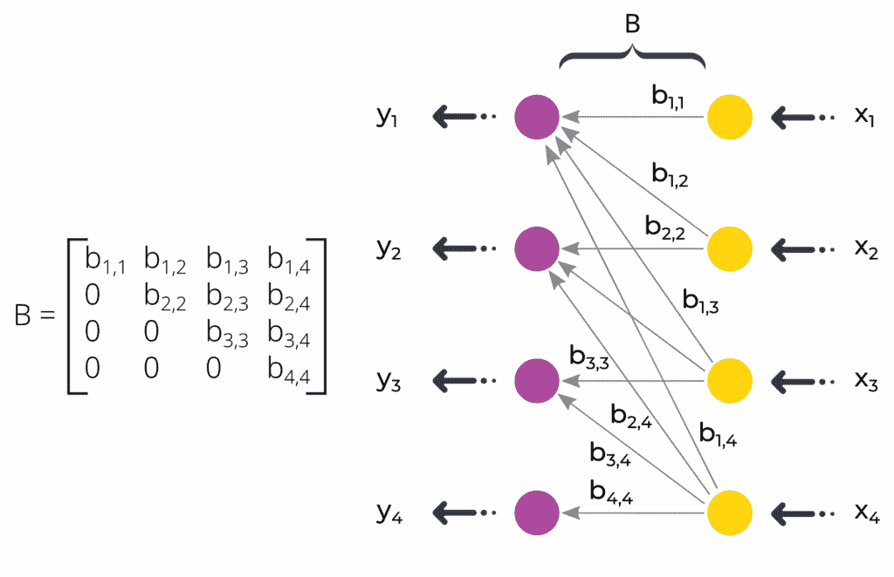

*上三角矩阵‘B’及其 X 图的示例*。

‘*B*’的非零值要么在其主对角线上，要么在其之上，这使得其 X 图的所有箭头要么是水平的，要么是向上的。这反过来又意味着右侧堆栈的任何输入值‘*x[j]*’只能影响左侧堆栈的输出值‘*y[i]*’，这些输出值的索引较小或相等（即，“*i* ≤ *j*”）。这是上三角矩阵的一个特性。

根据理论，乘以两个上三角矩阵会产生另一个上三角矩阵。在这里，使用 X 图进行解释也清楚地说明了这一点。乘以两个上三角矩阵‘*A*’和‘*B*’等同于连接它们的 X 图：

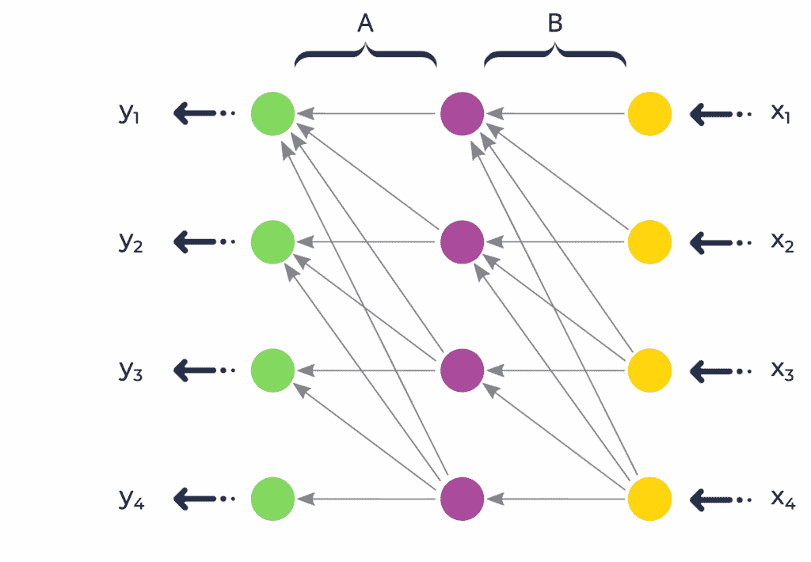

*两个上三角矩阵‘A’和‘B’的 X 图的连接*。

我们看到，将三角矩阵‘*A*’和‘*B*’的两个 X 图放在一起，会得到这样一个图，其中右侧堆栈的每个输入值‘*x[j]*’仍然只能影响左侧堆栈的输出值‘*y[i]*’，这些输出值要么在其级别上，要么在其之上（换句话说，“*i* ≤ *j*”）。这意味着乘积“*A***B*”也像一个上三角矩阵一样表现；因此，它必须在主对角线以下有零。

* * *

## 结论

在本系列的当前第 2 个故事中，我们观察了矩阵-矩阵乘法如何借助所谓的“X 图”进行可视化展示。我们了解到，进行乘法“*C* = *A***B*”等同于连接这两个矩阵的 X 图。这种方法清楚地说明了矩阵乘法的各种性质，例如为什么它不是对称操作（“*A***B* ≠ *B***A*”），以及解释了以下公式：

\[\begin{equation*}

c_{i,j} = \sum_{k=1}^{p} a_{i,k}*b_{k,j}

\end{equation*}\]

我们还观察到，当操作数是特殊类型的矩阵（尺度、平移、排列和三角形矩阵）时，乘法为何会以特定方式表现。

希望你喜欢阅读这个故事！

在接下来的故事中，我们将探讨如何用 X 图来解释矩阵转置“*A^T*”，以及我们可以从这种解释中获得什么，所以订阅我的页面，不要错过更新！

* * *

> *我要感谢：
> 
> – Roza Galstyan，感谢她对草稿的仔细审阅（ [`www.linkedin.com/in/roza-galstyan-a54a8b352`](https://www.linkedin.com/in/roza-galstyan-a54a8b352?miniProfileUrn=urn%3Ali%3Afs_miniProfile%3AACoAAFgUsCAB74BzBVzoGRVNfPmYv36qpYQYHMY&lipi=urn%3Ali%3Apage%3Ad_flagship3_search_srp_all%3B6KOqdj3KTMuxi6LTt2ZehA%3D%3D) ）*
> 
> *如果你喜欢阅读这个故事，请随意在 LinkedIn 上关注我，在那里，我还会发布更新（ [`www.linkedin.com/in/tigran-hayrapetyan-cs/`](https://www.linkedin.com/in/tigran-hayrapetyan-cs/) ）.*
> 
> *所有使用的图片，除非另有说明，都是根据作者的要求设计的。*

* * *

## 参考文献

[1] – 理解矩阵 | 第一部分：矩阵-向量乘法 : [`towardsdatascience.com/understanding-matrices-part-1-matrix-vector-multiplication/`](https://towardsdatascience.com/understanding-matrices-part-1-matrix-vector-multiplication/)
