# 理解矩阵 | 第三部分：矩阵转置

> 原文：[`towardsdatascience.com/understanding-matrices-part-3-matrix-transpose/`](https://towardsdatascience.com/understanding-matrices-part-3-matrix-transpose/)

<mdspan datatext="el1753219251677" class="mdspan-comment">在本系列的</mdspan>前两个故事[[1]](https://towardsdatascience.com/understanding-matrices-part-1-matrix-vector-multiplication/), [[2]](https://towardsdatascience.com/understanding-matrices-part-2-matrix-matrix-multiplication/)中，我们：

+   介绍了矩阵的 X 向解释

+   观察矩阵-向量乘法的物理意义和特殊情况

+   看看矩阵-矩阵乘法的物理意义

+   观察了矩阵的几个特殊情况的行为

在这个故事中，我想分享我对矩阵转置的想法，表示为*A*^(*T*)，这是一种仅仅翻转正方形表格内容的对角线操作。

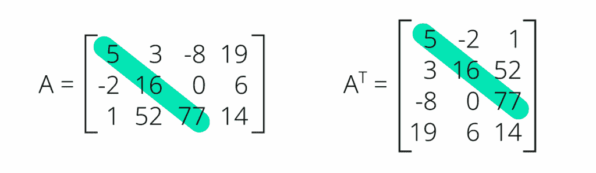

*一个 3×4 矩阵“A”及其转置“A^T”的例子。*

与许多其他矩阵操作相比，在纸上转置给定的矩阵‘*A*’相当容易。然而，其物理意义往往被忽视。另一方面，为什么以下与转置相关的公式实际上有效并不那么清楚：

+   (*AB*)^(*T*) = *B^TA^T*，

+   (*y*, *Ax*) = (*x*, *A^Ty*),

+   (*A^TA*)^(*T*) = *A^TA*.

在这个故事中，我将给出我对转置操作的解读，这将在其他方面展示为什么提到的公式实际上是这样的。所以，让我们深入探讨吧！

但首先，让我提醒一下本系列故事中使用的所有定义：

+   矩阵用大写字母表示（如‘*A*’，‘*B*’），而向量和标量用小写字母表示（如‘*x*’，‘*y*’或‘*m*’，‘*n*’）。

+   |*x*| – 向量‘*x*’的长度，

+   *rows(*A*) – 矩阵‘*A*’的行数，

+   *columns(*A*) – 矩阵‘*A*’的列数，

+   *A^T* – 矩阵‘*A*’的转置，

+   *a^T[i]*[,*j*] – 转置矩阵*A^T*的第*i*行和第*j*列的值，

+   (*x*, *y*) – 向量‘*x*’和‘*y*’的点积（即“*x*[1]*y*[1] + *x*[2]*y*[2] + … + *x[n]*y[n]*”）。

* * *

## 转置与 X 向解释的比较

在本系列的[第一部分](https://towardsdatascience.com/understanding-matrices-part-1-matrix-vector-multiplication/) – “矩阵-向量乘法” [1] 中，我介绍了矩阵的 X 向解释。让我们用一个例子来回顾它：

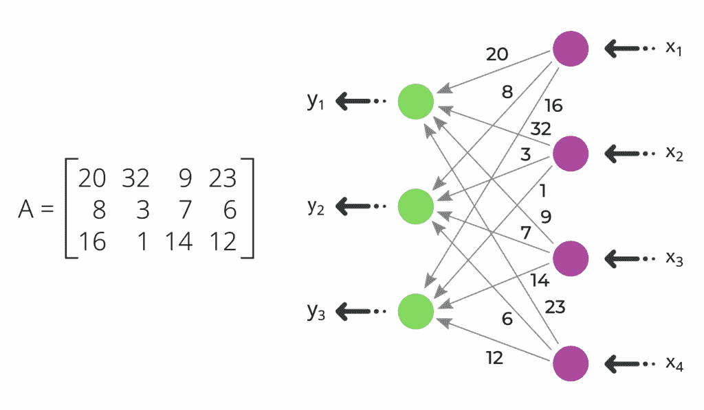

*一个矩阵及其相应的 X 图的例子。图中的所有箭头都是从右向左指向的。从右侧的“j”项开始，指向左侧的“i”项的箭头对应于矩阵的“a[i,j]”单元格。*

从那里，我们也记得，‘*A*’的 X 图的左侧堆栈可以与矩阵‘*A*’的行相关联，而其右侧堆栈可以与列相关联。

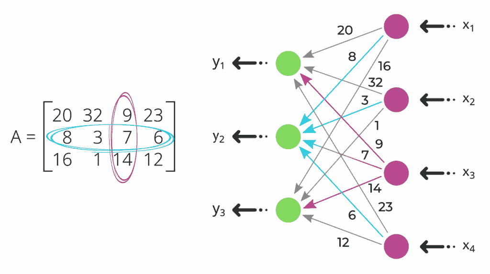

在矩阵‘A’的 X 图中，从右堆顶部第三项开始的值是矩阵‘A’的第三列值（用红色突出显示）。

同时，来自左堆第二行顶部的值是矩阵‘A’的第二行值（用紫色突出显示）。

现在，如果转置一个矩阵实际上是围绕主对角线翻转表格，这意味着矩阵‘*A*’的所有列都变成了矩阵‘*A^T*’中的行，反之亦然。

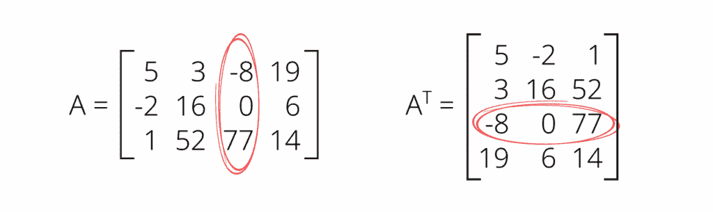

*原始矩阵‘A’及其转置‘A^T‘。我们看到‘A’的第三列变成了‘A^T‘的第三行。*

如果转置意味着交换行和列的位置，那么也许我们可以在 X 图中做同样的操作？因此，为了交换 X 图的行和列，我们应该水平翻转它：

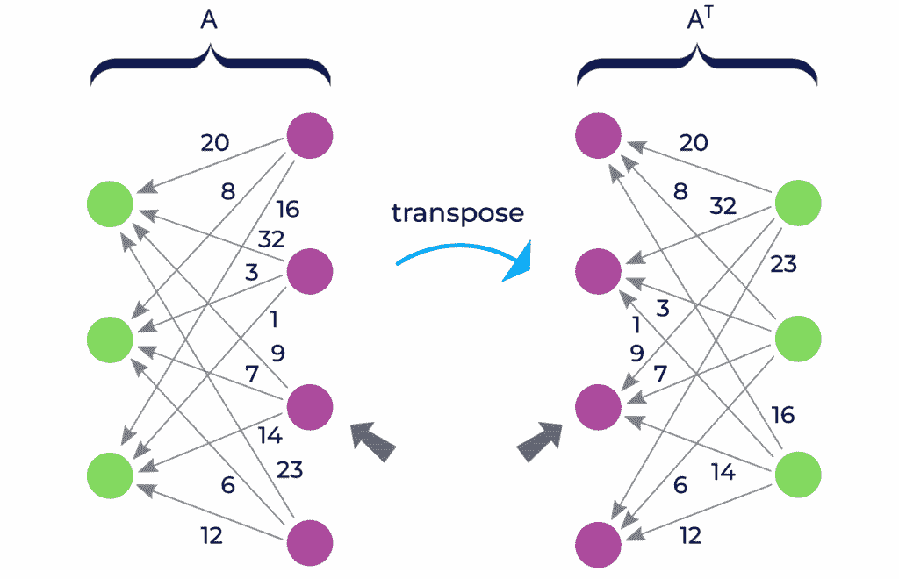

*‘A’的 X 图的水平翻转对应于‘A’的转置。我们看到原始 X 图的右堆顶部第三项相邻的值（‘A’的第三列），即[9, 7, 14]，与翻转 X 图的左堆顶部第三项相邻的值（A^T 的第三行）相同。*

‘*A*’的水平翻转 X 图将代表‘*A^T*’的 X 图吗？我们知道单元格“*a[i]*[,*j*]”在 X 图中作为从左堆的*j*‘th 项开始的箭头，指向右堆的*i*‘th 项。在水平翻转后，同样的箭头现在将从右堆的*i*‘th 项开始，并指向左堆的*j*‘th 项。

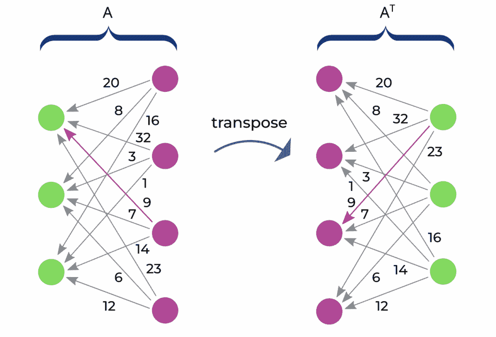

*值“a[1,3] = 9”等于值“a^T[3,1] = 9”。*

这意味着转置的定义“*a[i]*[,*j*] = *a^T*[*j*,*i*]”确实是成立的。

总结本章，我们看到了转置矩阵‘*A*’等同于水平翻转其 X 图。

* * *

## 转置矩阵链

让我们看看将*A^T*解释为其 X 图水平翻转如何帮助我们揭示一些与转置相关的公式的物理意义。让我们从以下内容开始：

\[\begin{equation*}

(AB)^T = B^T A^T

\end{equation*}\]

这意味着转置乘法“*A***B*”等同于乘以转置矩阵*A^T*和*B^T*，但顺序相反。现在，为什么顺序实际上变成了相反的呢？

从本系列的[第二部分](https://towardsdatascience.com/understanding-matrices-part-2-matrix-matrix-multiplication/)——“矩阵乘法” [2] 中，我们记得矩阵乘法“A*B”可以解释为‘*A*’和‘*B*’的 X 图的连接。因此，我们有：

> *y* = (*AB*)*x* = *A**(*Bx*)

将迫使输入向量‘*x*’首先通过矩阵‘*B*’的变换，然后中间结果将通过矩阵‘*A*’的变换，之后将获得输出向量‘*y*’。

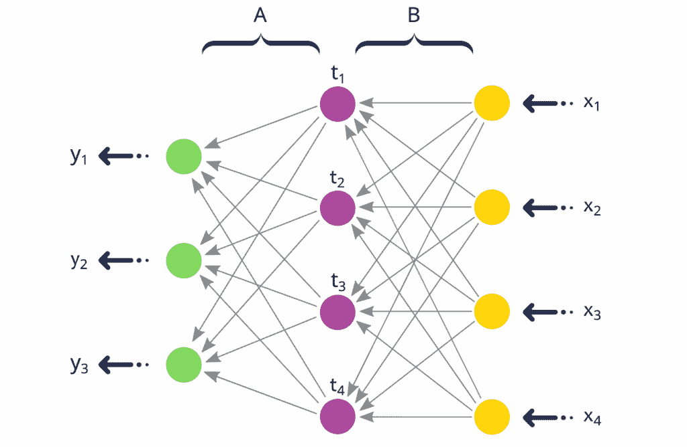

*将输入向量‘x’从右向左移动，通过‘A’和‘B’的 X 图。首先，在通过‘B’的变换后，它变成了中间向量‘t = Bx’，然后通过‘A’的变换，变成了最终的向量‘y = At = A(Bx)’。*

现在公式“(*AB*)^(*T*) = *B^TA^T*”的物理意义变得清晰：将乘积“*A***B*”的 X 图水平翻转将显然翻转“A*”和“*B*”各自的 X 图，但也会反转它们的顺序：

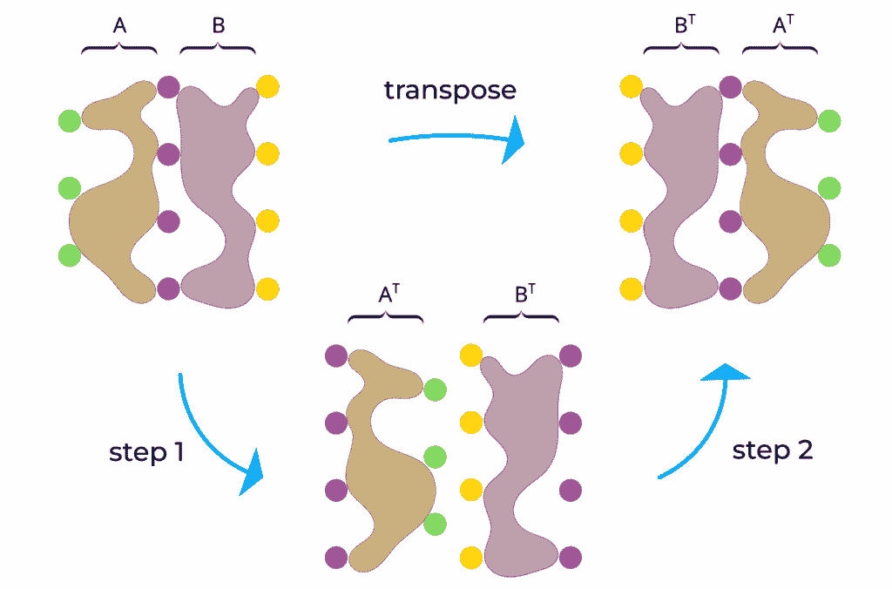

*水平翻转 2 个相邻的图形‘A’和‘B’将导致这两个图形分别水平翻转（步骤 1），以及交换它们的顺序（步骤 2）。*

在前面的故事[[2]](https://towardsdatascience.com/understanding-matrices-part-2-matrix-matrix-multiplication/)中，我们也看到，乘积矩阵‘*C*=*A***B*’中的单元格*c[i]*[,*j*]描述了输入向量‘*x*’的*x[j]*可以影响输出向量‘*y* = (*AB*)*x*’的*y[i]*的所有可能方式。

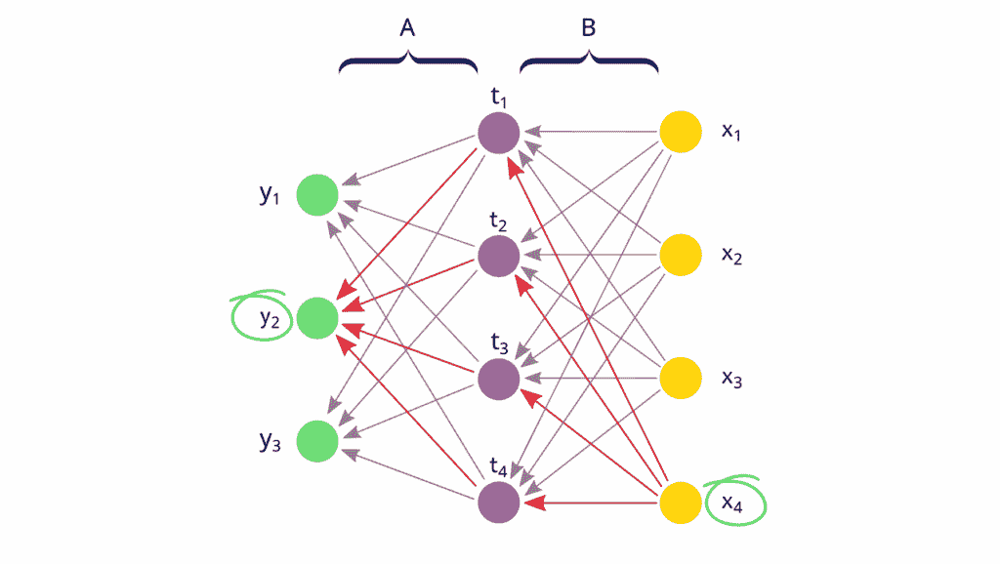

*‘A’和‘B’的 X 图的连接，对应于乘积“A*B”。所有 4 种可能的路径，通过输入值‘x[4]’可以影响输出值‘y[2]’，都用红色突出显示。*

现在，当我们对乘积“*C*=*A***B*”进行转置，即计算矩阵*C^T*时，我们希望得到镜像效果——因此*c^T*[*j*,*i*]将描述*y[j]*可以影响*x[i]*的所有可能方式。为了得到这个效果，我们只需翻转连接图：

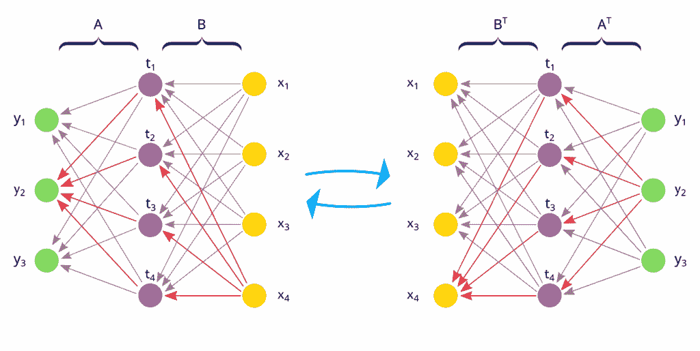

*如果“C = A*B”，则“c[2,4]”的值对应于从‘x[4]’到‘y[2]’的所有 4 种可能的路径之和（用红色突出显示）。同时，它等于“c[2,4] = c^T[4,2]”，这对应于在水平翻转的“A*B”中从‘y[2]’到‘x[4]’的相同 4 种可能的路径之和，即“B^TA^T”。*

当然，这种解释可以推广到多个矩阵的乘积的转置：

\[\begin{equation*}

(ABC)^T = C^T B^T A^T

\end{equation*}\]

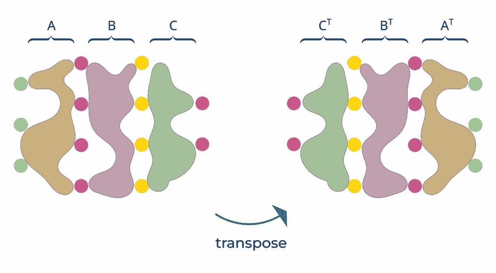

*水平翻转 3 个相邻的项目‘A’，‘B’，和‘C’（不一定是矩阵），并反转它们的顺序将产生水平翻转序列“ABC”本身的效果。*

* * *

## 为什么任何矩阵*A*的*A^TA*总是对称的

一个对称矩阵‘*S*’是一个*n*x*n*的方阵，其中对于任何索引*i*，*j* ∈ [1..*n*]，我们有‘*s[i]*[,*j*] = *s[j]*[,*i*]‘。这意味着它在对角线上是对称的，同时翻转它也不会产生任何效果。

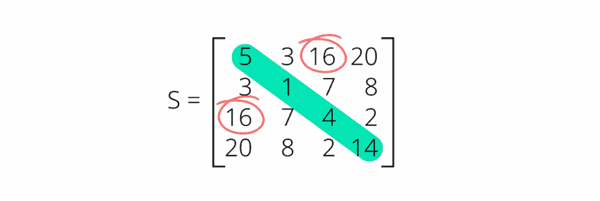

*一个 4×4 对称矩阵的例子。所有值都沿着主对角线对称。例如，“a[3,1] = a[1,3] = 16”。*

我们看到，转置对称矩阵将没有任何效果。因此，一个矩阵‘S’是对称的，当且仅当：

\[\begin{equation*}

\( S^T = S \)

\end{equation*}\]

同样，对称矩阵‘S’的 X 图具有这样的性质：它在水平翻转后不会改变。这是因为对于任何箭头\s[i]*[,*j*]，我们都有一个等价的箭头\s[j]*[,*i*]：

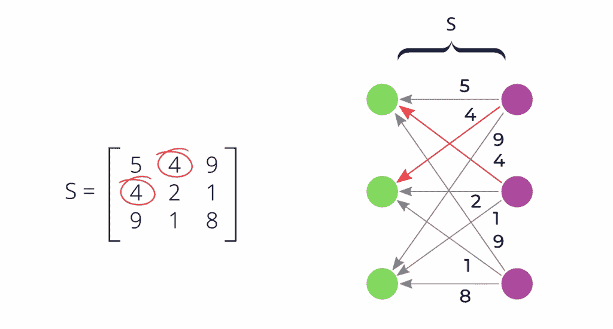

*一个 3×3 对称矩阵‘S’及其 X 图的例子。我们那里有‘s[1,2] = s[2,1] = 4’。相应的箭头被突出显示。*

在矩阵分析中，我们有一个公式指出，对于任何矩阵‘A’（不一定是对称的），乘积*A^TA*始终是对称矩阵。换句话说：

\[\begin{equation*}

\((A^T A)^T = A^T A\)

\end{equation*}\]

如果按照传统的矩阵乘法方式来看，很难直观地感受到这个公式的正确性。但如果将矩阵乘法看作是它们 X 图的连接，其正确性就变得明显了：

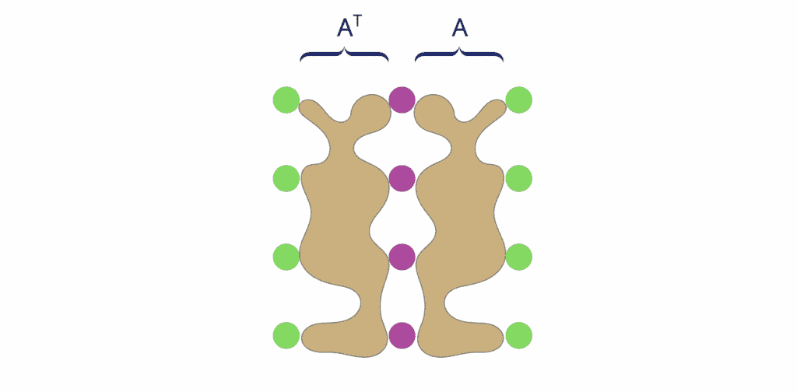

*“A^T”和“A”的连接，即两个镜像对象的连接，始终是一个对称对象。水平翻转这样的连接将没有任何效果。*

如果一个任意的矩阵‘A’与其水平翻转*A^T*连接会发生什么？结果*A^TA*将是对称的，因为水平翻转后，右因子‘A’移动到左侧并翻转，成为*A^T*，而左因子*A*^(*T*)移动到右侧并也翻转，成为‘A’。

这就是为什么对于任何矩阵‘A’，乘积*A^TA*始终是对称的。

***

## 理解为什么\((y, Ax) = (x, A^T y)\)

在矩阵分析中，还有一个公式，指出：

\[\begin{equation*}

\((y, Ax) = (x, A^T y)\)

\end{equation*}\]

其中“(*u*, *v*)”是向量‘u’和‘v’的点积：

\[\begin{equation*}

(u,v) = u_1 v_1 + u_2 v_2 + \dots + u_n v_n

\end{equation*}\]

点积只能计算长度相等的向量。此外，点积不是一个向量，而是一个单一的数字。如果试图以类似于 X 图的方式说明点积“(*u*, *v*)”，我们可以画出如下内容：

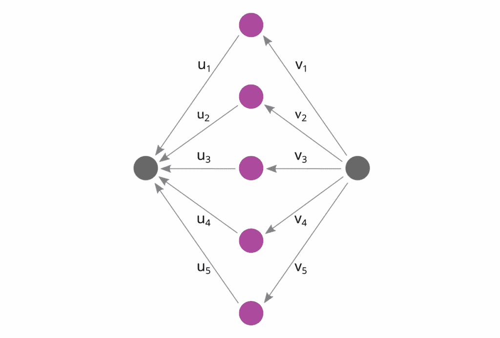

*由于点积是 u[i]*v[i]项的累积，我们可以将其表示为从右端点到左端点所有可能路径的总和。*

现在，表达式\((y, Ax)\)实际上代表什么？它是向量‘y’与向量“A*x*”（或者与经过“A”变换的向量‘x’）的点积。为了使表达式\((y, Ax)\)有意义，我们应该有：

> \(|x| = \text{列}(\text{A}),\) 和
> 
> \(|y| = \text{行}(\text{A}).\)

首先，让我们正式计算 (*y*, *Ax*)。在这里，每个值 *y[i]* 都乘以向量 *Ax* 的第 *i* 个值，这里表示为 “*(Ax*)[*i*]”：

\[\begin{equation*}

(Ax)_i = a_{i,1}x_1 + a_{i,2}x_2 + ... + a_{i,m}x_m

\end{equation*}\]

乘法之后，我们将得到：

\[\begin{equation*}

y_i(Ax)_i = y_i a_{i,1}x_1 + y_i a_{i,2}x_2 + ... + y_i a_{i,m}x_m

\end{equation*}\]

通过将所有项按 “*i* ∈ [1, *n*]” 求和，我们将得到：

\[\begin{equation*}

\begin{split}

(y, Ax) = y_1(Ax)_1 + y_2(Ax)_2 + ... + y_n(Ax)_n = \\

= y_1 a_{1,1}x_1 + y_1 a_{1,2}x_2 + &... + y_1 a_{1,m}x_m + \\

+ y_2 a_{2,1}x_1 + y_2 a_{2,2}x_2 + &... + y_2 a_{2,m}x_m + \\

&... \\

+ y_n a_{n,1}x_1 + y_n a_{n,2}x_2 + &... + y_n a_{n,m}x_m

\end{split}

\end{equation*}\]

这清楚地表明，在 (*y*, *Ax*) 的乘积中，矩阵 “*A*” 的每个单元格 *a*[*i*,*j*] 都恰好参与一次，与因子 *y[i]* 和 *x[j]* 一起。

现在，让我们转向 X-图。如果我们想绘制向量 “*Ax*” 的 X-图，我们可以这样做：

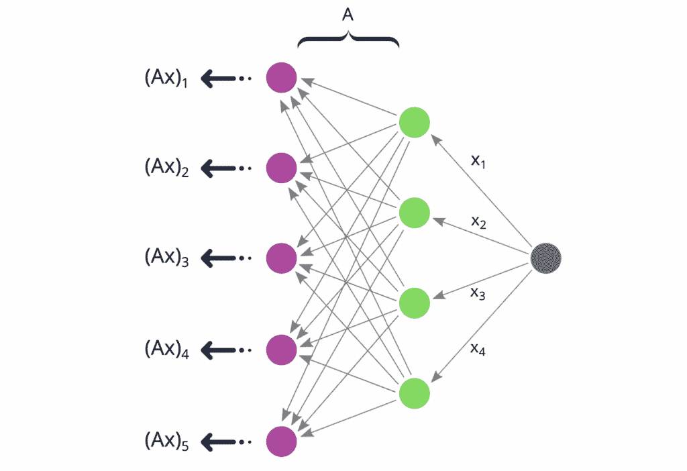

*“Ax”的乘积是一个长度等于“|Ax| = rows(A)”的向量，而“|x| = columns(A)”。在这里，向量“x”的值从右侧附加，而在左侧，我们得到结果向量“Ax”的值。*

接下来，如果我们想绘制点积 (*y*, *Ax*)，我们可以这样做：

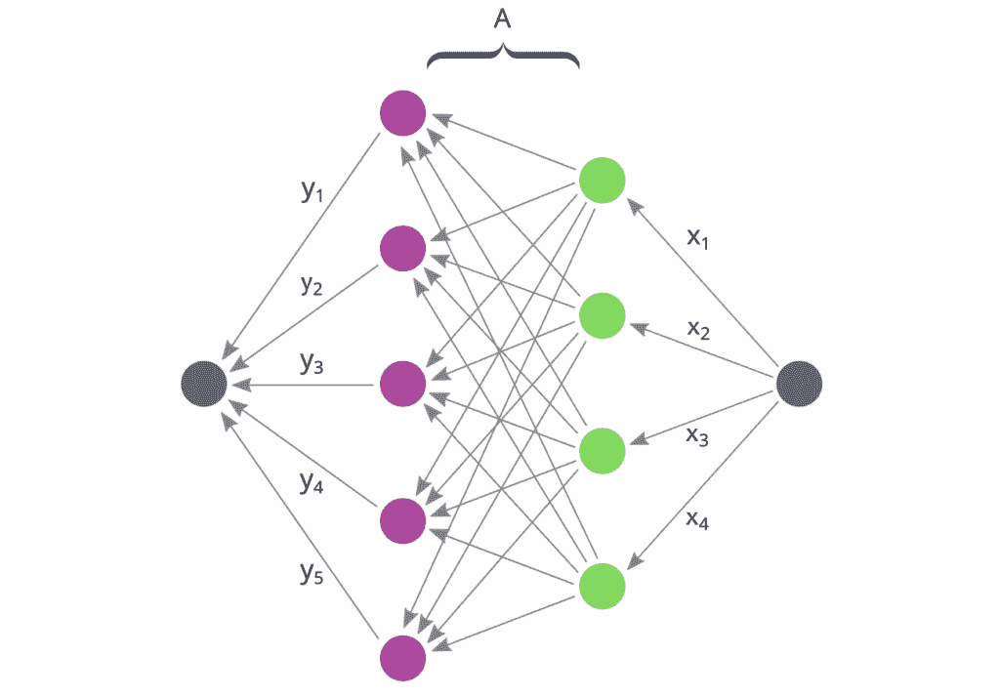

*向量‘y’的值附加在“A”的 X 图的左侧，而向量‘x’的值保持在它的右侧。*

在这个图中，让我们看看有多少种从右端点到左端点的方法。从右到左的路径可以通过“A”的 X 图中的任何箭头。如果通过某个箭头 *a[i]*[,*j*]，那么它将由 *x[j]*、箭头 *a[i]*[,*j*] 和 *y[i]* 组成。

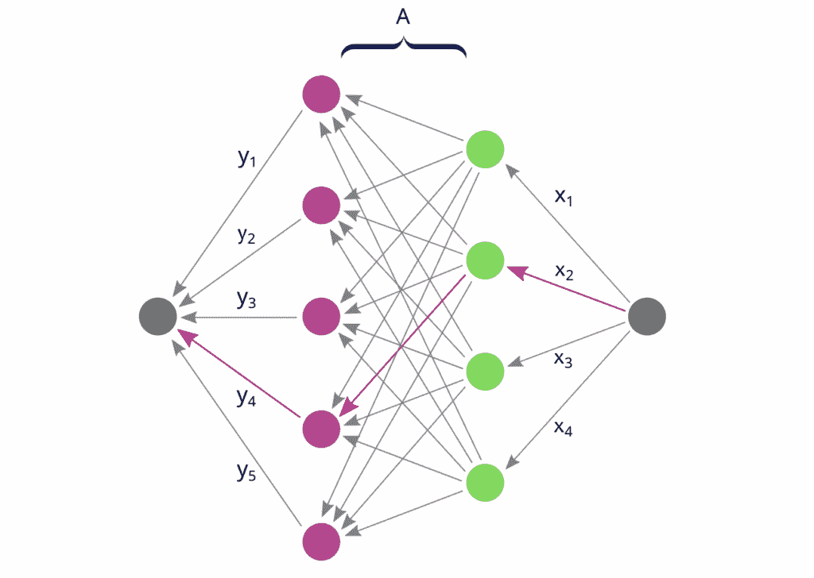

*如果从右到左的路径通过“A”的 X 图的箭头“a[4,2]”，那么它也会通过值“y[4]”和“x[2]”。*

这与上面推导出的形式化行为 (*y*, *Ax*) 完全匹配，其中 (*y*, *Ax*) 是所有形式为 “*y[i]*a[i][,*j*]*x[j]*” 的三元的和。因此，我们可以得出结论，如果在 X-解释中查看 (*y*, *Ax*)，它等于从右端点到左端点所有可能路径的总和。

现在，如果我们水平翻转整个图，会发生什么？

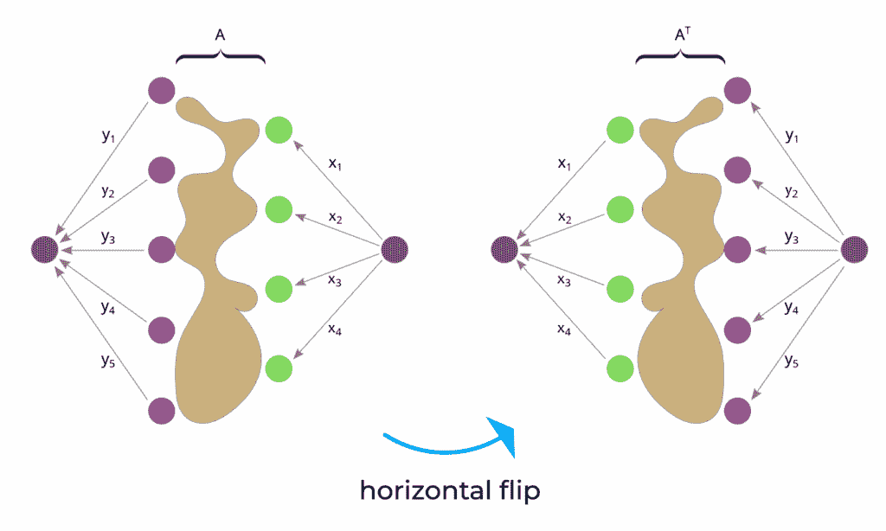

*将“(y, Ax)”的 X 图水平翻转，得到“(x, A*^(*T*)*y)”的 X 图。*

从代数角度来看，从右到左所有路径的总和不会改变，因为所有参与项都保持不变。但从几何角度来看，向量‘*y*’移动到右侧，向量‘*x*’移动到左侧，矩阵“*A*”正在水平翻转；换句话说，“*A*”是转置的。因此，翻转的 X 图现在对应于向量“*x*”和“*A^Ty*”的点积，或者具有(*x*, *A^Ty*)的值。我们看到(y, *Ax*)和(*x*, *A^Ty*)代表相同的总和，这证明了：

\[\begin{equation*}

(y, Ax) = (x, A^T y)

\end{equation*}\]

* * *

## 结论

关于矩阵转置操作，我想说的就这些。我希望上述展示的视觉方法能帮助我们更好地理解各种矩阵运算。

在本系列的下一（可能是最后一）个故事中，我将讨论矩阵的求逆，以及它如何通过 X 解释来可视化。我们将看到为什么像“(*AB*)^(-1) = *B*^(-1)*A*^(-1)”这样的公式实际上是这样的，我们将观察逆矩阵在几种特殊类型的矩阵上的作用。

下一个故事见！

* * *

> *我要感谢的人：*
> 
> *– 罗扎·加尔斯蒂扬，感谢您仔细审阅草案 (*[*linkedin.com/in/roza-galstyan-a54a8b352/*](https://www.linkedin.com/in/roza-galstyan-a54a8b352/))*.*
> 
> *如果您喜欢阅读这个故事，请随意在 LinkedIn 上关注我，在那里，我还会发布其他更新（[linkedin.com/in/tigran-hayrapetyan-cs/](https://www.linkedin.com/in/tigran-hayrapetyan-cs/))).*
> 
> *除非另有说明，所有使用的图像都是根据作者的要求设计的。*

* * *

## 参考文献

[1] – 理解矩阵 | 第一部分：矩阵-向量乘法 – [`towardsdatascience.com/understanding-matrices-part-1-matrix-vector-multiplication/`](https://towardsdatascience.com/understanding-matrices-part-1-matrix-vector-multiplication/)

[2] – 理解矩阵 | 第二部分：矩阵-矩阵乘法 – [`towardsdatascience.com/understanding-matrices-part-2-matrix-matrix-multiplication/`](https://towardsdatascience.com/understanding-matrices-part-2-matrix-matrix-multiplication/)
