# 理解矩阵 | 第四部分：矩阵逆

> 原文：[`towardsdatascience.com/understanding-matrices-part-4-matrix-inverse/`](https://towardsdatascience.com/understanding-matrices-part-4-matrix-inverse/)

<mdspan datatext="el1756512026123" class="mdspan-comment">在本系列的最初 3 个故事中</mdspan> [[1]](https://towardsdatascience.com/understanding-matrices-part-1-matrix-vector-multiplication/), [[2]](https://towardsdatascience.com/understanding-matrices-part-2-matrix-matrix-multiplication/), 和 [[3]](https://towardsdatascience.com/understanding-matrices-part-3-matrix-transpose/), 我们已经观察到：

+   矩阵乘以向量的解释，

+   矩阵-矩阵乘法的物理意义。

+   几种特殊类型矩阵的行为，以及

+   矩阵转置的可视化。

在这个故事中，我想分享我对矩阵求逆背后所隐藏的东西的看法，为什么与求逆相关的不同公式实际上是这样的，最后，为什么对于几种特殊类型的矩阵，计算逆可以更容易地进行。

在本系列故事中，我使用的定义如下：

+   矩阵用大写字母表示（如 ‘*A*’、‘*B*’），而向量和标量用小写字母表示（如 ‘*x*’、‘*y*’ 或 ‘*m*’、‘*n*’）。

+   |*x*| – 是向量 ‘*x*’ 的长度，

+   *A^T* – 是矩阵 ‘*A*‘ 的转置，

+   *B*^(-1) – 是矩阵 ‘*B*‘ 的逆。

* * *

## 逆矩阵的定义

从本系列的 [第一部分](https://towardsdatascience.com/understanding-matrices-part-1-matrix-vector-multiplication/) – “矩阵-向量乘法” [1]，我们记得，当某个矩阵 “*A*” 乘以向量 ‘*x*’ 作为 “*y* = *Ax*”，它可以被视为将输入向量 ‘*x*’ 转换为输出向量 ‘*y*’ 的变换。如果是这样，那么逆矩阵 *A*^(-1) 应该进行相反的变换 – 它应该将向量 ‘*y*’ 转换回 ‘*x*’：

\[\begin{equation*}

x = A^{-1}y

\end{equation*}\]

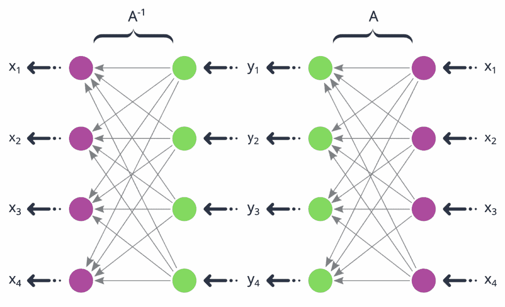

将 “*y* = *Ax*” 代入其中将给出：

\[\begin{equation*}

x = A^{-1}y = A^{-1}(Ax) = (A^{-1}A)x

\end{equation*}\]

这意味着原始矩阵与其逆矩阵 – *A*^(-1)*A* 的乘积应该是一个矩阵，它不对任何输入向量 ‘*x*’ 进行变换。换句话说：

\[\begin{equation*}

(A^{-1}A) = E

\end{equation*}\]

其中 “*E*” 是单位矩阵。

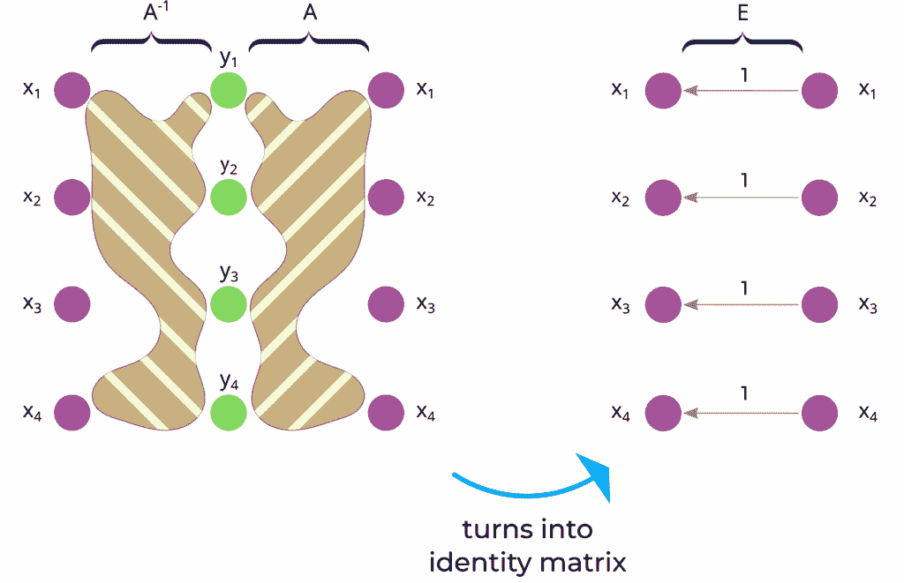

*Concatenating X-diagrams of A^(-1) and A turns into the identity matrix E.*

这里可能出现的第一个问题是，是否总是可以逆转某个矩阵“*A*”的影响？答案是——只有当没有两个不同的输入向量*x*[1]和*x*[2]通过“*A*”转换成相同的输出向量‘*y*’时，才有可能逆转。换句话说，逆矩阵*A*^(-1)只存在于对于任何输出向量‘*y*’，存在且仅存在一个输入向量‘*x*’，它通过“*A*”转换成它：

\[\begin{equation*}

y = Ax

\end{equation*}\]

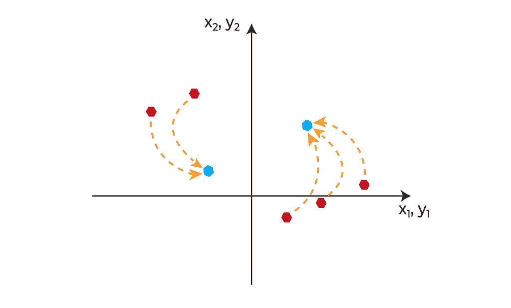

*情况 1：几个输入向量‘x’（红色点）被转换成相同的输出向量‘y’（浅蓝色点）。在这种情况下，我们无法设计一个逆矩阵，因为对于某个向量‘y’，乘积“x = A^(-1)y”将是模糊的。*

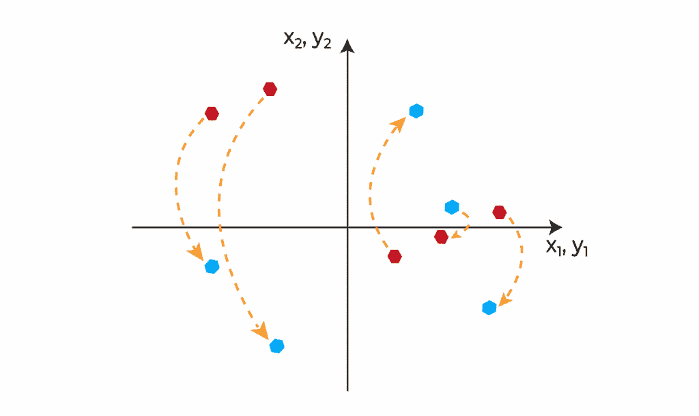

*情况 2：每个输入向量‘x’（红色点）被转换成不同的输出向量‘y’（浅蓝色点）。能够进行反向变换“x = A^(-1)y”的逆矩阵确实存在。*

在这个系列中，我不想过多地深入定义和证明的正式部分。相反，我想观察几个实际上可以求逆的给定矩阵“*A*”的情况，我们将看到对于这些情况中的每一个，逆矩阵*A*^(-1)是如何计算的。

* * *

## 矩阵链的求逆

与矩阵逆相关的一个重要公式是：

\[\begin{equation*}

(AB)^{-1} = B^{-1}A^{-1}

\end{equation*}\]

该公式表明矩阵乘积的逆等于逆矩阵的乘积，但顺序相反。让我们理解为什么矩阵的顺序被反转。

(*AB*)^(-1)的物理意义是什么？它应该是一个能够逆转矩阵(*AB*)影响的矩阵。所以如果：

\[\begin{equation*}

y = (AB)x,

\end{equation*}\]

然后，我们应该有：

\[\begin{equation*}

x = (AB)^{-1}y.

\end{equation*}\]

现在变换“*y* = (*AB*)*x*”分为两步：首先，我们做：

\[\begin{equation*}

Bx = t,

\end{equation*}\]

这给出了一个中间向量‘*t*’，然后那个‘*t*’被乘以“*A*”：

\[\begin{equation*}

y = At = A(Bx).

\end{equation*}\]

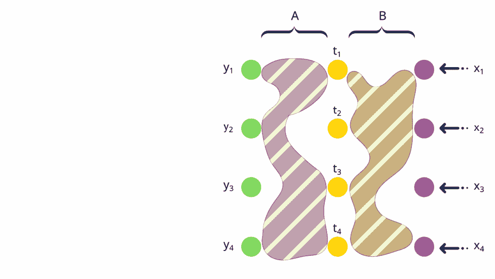

*在计算“y = (AB)x”时，输入向量‘x’首先被矩阵“B”转换，产生一个中间向量“t = Bx”，然后这个‘*t*’被矩阵“A”转换，产生最终的向量“y = A(Bx) = At”.*

因此，矩阵“*A*”影响了向量，在它已经被“*B*”影响之后。在这种情况下，为了逆转这种连续的影响，首先我们应该逆转“*A*”的影响，通过将*A*^(-1)乘以‘*y*’，这将给我们：

\[\begin{equation*}

A^{-1}y = A^{-1}(ABx) = (A^{-1}A)Bx = EBx = Bx = t,

\end{equation*}\]

…中间向量‘*t*’，产生在上方一点。

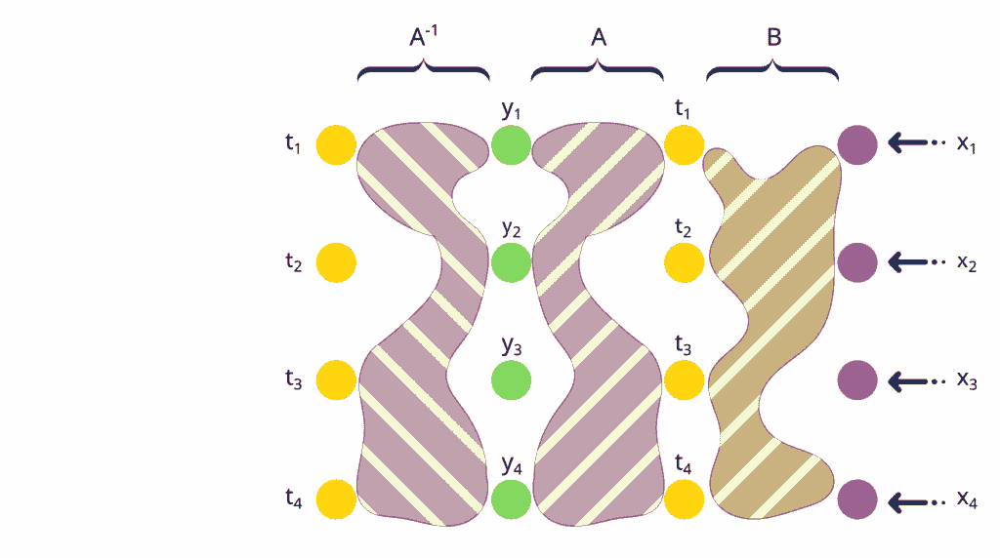

*乘积“A^(-1)(AB)x = (A^(-1)A)Bx = EBx = Bx = t”。

注意，向量‘t’在这里也参与了两次。

然后，在得到中间向量‘*t*’之后，为了恢复‘*x*’，我们还应该逆转矩阵“*B*”的影响。这是通过将 *B*^(-1) 乘以‘*t*’来完成的：

\[\begin{equation*}

B^{-1}t = B^{-1}(Bx) = (B^{-1}B)x = Ex = x,

\end{equation*}\]

或者将其全部展开：

\[\begin{equation*}

x = B^{-1}(A^{-1}A)Bx = (B^{-1}A^{-1})(AB)x,

\end{equation*}\]

这明确表明，为了逆转矩阵(*AB*)的影响，我们应该使用(*B*^(-1)*A*^(-1))。

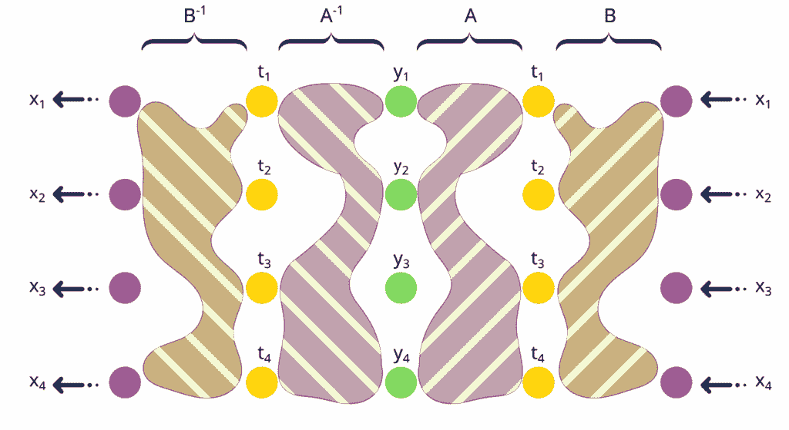

*“(B^(-1)A^(-1))(AB)x = B^(-1)(A^(-1)A)Bx = B^(-1)EBx = B^(-1)Bx = Ex = x”*。

注意，向量‘x’和‘t’在这里都参与了两次。

这就是为什么在矩阵乘积的逆中，它们的顺序是相反的：

\[\begin{equation*}

(AB)^{-1} = B^{-1}A^{-1}

\end{equation*}\]

当我们有一系列矩阵时，也应用同样的原理，例如：

\[\begin{equation*}

(ABC)^{-1} = C^{-1}B^{-1}A^{-1}

\end{equation*}\]

* * *

## 几个特殊矩阵的求逆

现在，让我们在理解矩阵求逆的基础上，看看几种特殊类型的矩阵是如何被求逆的。

### 循环移位矩阵的逆

一个循环移位矩阵是一个“*V*”矩阵，当它与输入向量‘*x*’相乘时，产生输出向量“*y* = *Vx*”，其中‘*x*’的所有值都通过某些‘*k*’位置进行循环移位。为了实现这一点，循环移位矩阵“*V*”有两条“1”的行，它们与其主对角线平行，而其余所有单元格都是“0”。

\[\begin{equation*}

\begin{pmatrix}

y_1 \\ y_2 \\ y_3 \\ y_4 \\ y_5

\end{pmatrix}

= y = Vx =

\begin{bmatrix}

0 & 0 & 1 & 0 & 0 \\

0 & 0 & 0 & 1 & 0 \\

0 & 0 & 0 & 0 & 1 \\

1 & 0 & 0 & 0 & 0 \\

0 & 1 & 0 & 0 & 0

\end{bmatrix}

*

\begin{pmatrix}

x_1 \\ x_2 \\ x_3 \\ x_4 \\ x_5

\end{pmatrix}

=

\begin{pmatrix}

x_3 \\ x_4 \\ x_5 \\ x_1 \\ x_2

\end{pmatrix}

\end{equation*}\]

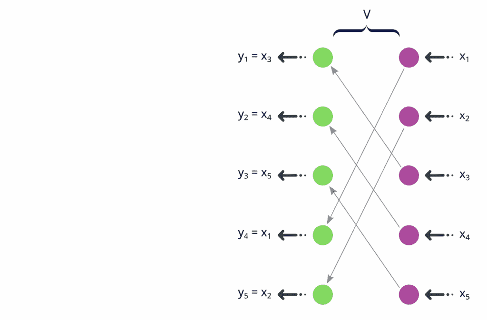

*该 5×5 循环移位矩阵“V”的 X 图。当应用于输入向量‘x’时，它将所有值循环上移 2 个位置，产生输出向量‘y’*。

现在，我们该如何撤销循环移位矩阵“*V*”的变换呢？显然，我们应该应用另一个循环移位矩阵 *V*^(-1)，它现在将所有‘*y*’的值向下循环移位‘*k*’个位置（记住，“*V*”是将所有‘*x*’的值向上移位）。

\[\begin{equation*}

\begin{pmatrix}

x_1 \\ x_2 \\ x_3 \\ x_4 \\ x_5

\end{pmatrix}

= x = V^{-1}Vx =

\begin{bmatrix}

0 & 0 & 0 & 1 & 0 \\

0 & 0 & 0 & 0 & 1 \\

1 & 0 & 0 & 0 & 0 \\

0 & 1 & 0 & 0 & 0 \\

0 & 0 & 1 & 0 & 0

\end{bmatrix}

\begin{bmatrix}

0 & 0 & 1 & 0 & 0 \\

0 & 0 & 0 & 1 & 0 \\

0 & 0 & 0 & 0 & 1 \\

1 & 0 & 0 & 0 & 0 \\

0 & 1 & 0 & 0 & 0

\end{bmatrix}

\begin{pmatrix}

x_1 \\ x_2 \\ x_3 \\ x_4 \\ x_5

\end{pmatrix}

= V^{-1}y

\end{equation*}\]

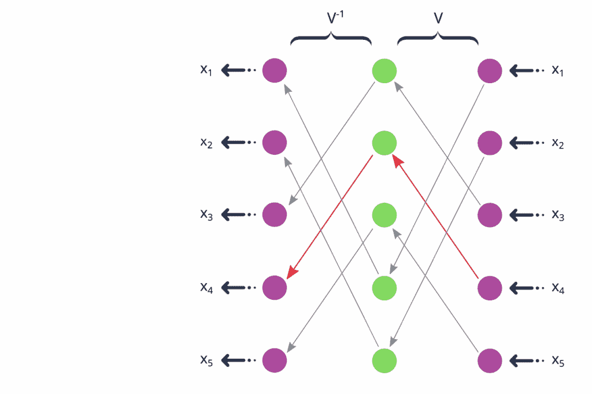

*两个循环移位矩阵 V^(-1)V 的乘积的 X 图表明，向量 ‘x’ 的每个输入值 x[i] 在经过 V^(-1)Vx 变换后都出现在相同的位置。例如，值 x[4] 的路径被突出显示。*

这就是为什么循环移位矩阵的逆矩阵又是另一个循环移位矩阵：

\[\begin{equation*}

V_1^{-1} = V_2

\end{equation*}\]

更多的是，我们可以注意到 V^(-1) 的 X 图实际上是“*V*”的 X 图的水平翻转。并且从本系列的先前部分——“矩阵的转置” [[3]](https://towardsdatascience.com/understanding-matrices-part-3-matrix-transpose/)，我们记得 X 图的水平翻转对应于该矩阵的转置。这就是为什么循环移位矩阵的逆等于其转置：

\[\begin{equation*}

V^{-1} = V^T

\end{equation*}\]

### 交换矩阵的逆

交换矩阵，通常用“*J*”表示，是一种矩阵，当它与输入向量“*x*”相乘时，产生输出向量“*y*”，它具有与“*x*”相同的所有值，但顺序相反。为了实现这一点，“*J*”在其反对角线上有‘1’，而其他所有单元格都是‘0’。

\[\begin{equation*}

\begin{pmatrix}

y_1 \\ y_2 \\ y_3 \\ y_4 \\ y_5

\end{pmatrix}

= y = Jx =

\begin{bmatrix}

0 & 0 & 0 & 0 & 1 \\

0 & 0 & 0 & 1 & 0 \\

0 & 0 & 1 & 0 & 0 \\

0 & 1 & 0 & 0 & 0 \\

1 & 0 & 0 & 0 & 0

\end{bmatrix}

*

\begin{pmatrix}

x_1 \\ x_2 \\ x_3 \\ x_4 \\ x_5

\end{pmatrix}

=

\begin{pmatrix}

x_5 \\ x_4 \\ x_3 \\ x_2 \\ x_1

\end{pmatrix}

\end{equation*}\]

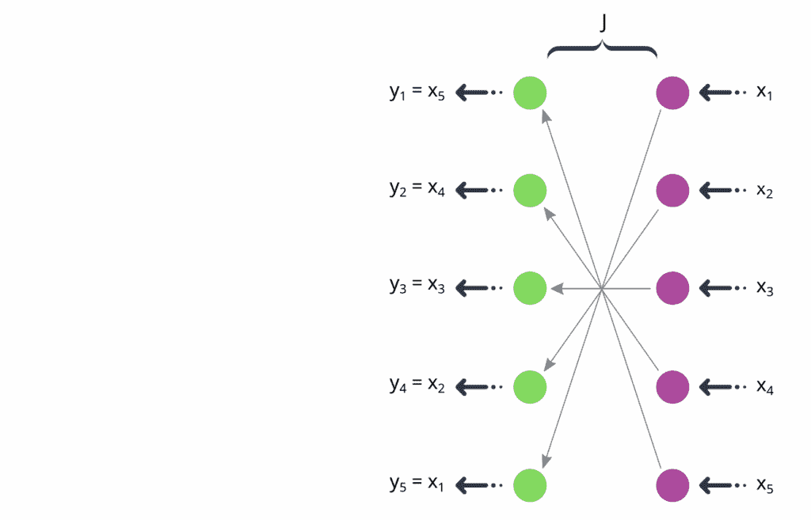

*交换矩阵“J”的 X 图表明，所有‘n’个箭头（对应于矩阵中‘1’的‘n’个单元格）只是翻转了输入向量‘x’的内容。因此，‘x’的顶部第 k 个值成为输出向量‘y’的底部第 k 个值。*

显然，要撤销此类变换，我们应该应用一个额外的交换矩阵。

\[

\begin{equation*}

\begin{pmatrix}

x_1 \\ x_2 \\ x_3 \\ x_4 \\ x_5

\end{pmatrix}

= x = J^{-1}Jx =

\begin{bmatrix}

0 & 0 & 0 & 0 & 1 \\

0 & 0 & 0 & 1 & 0 \\

0 & 0 & 1 & 0 & 0 \\

0 & 1 & 0 & 0 & 0 \\

1 & 0 & 0 & 0 & 0

\end{bmatrix}

\begin{bmatrix}

0 & 0 & 0 & 0 & 1 \\

0 & 0 & 0 & 1 & 0 \\

0 & 0 & 1 & 0 & 0 \\

0 & 1 & 0 & 0 & 0 \\

1 & 0 & 0 & 0 & 0

\end{bmatrix}

\begin{pmatrix}

x_1 \\ x_2 \\ x_3 \\ x_4 \\ x_5

\end{pmatrix}

= J^{-1}y

\end{equation*}\]

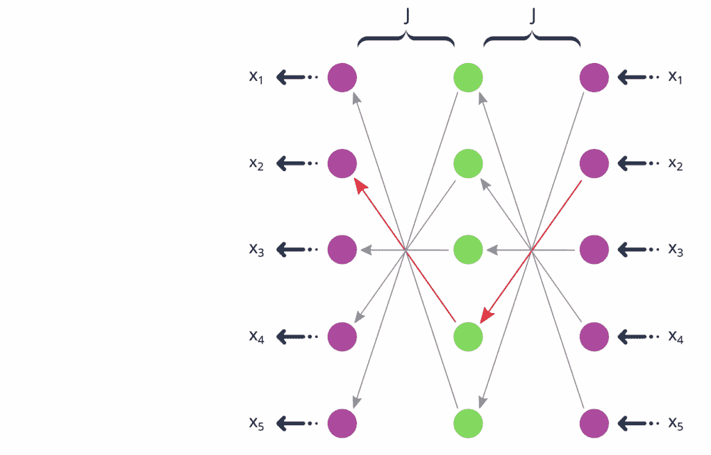

*在连续应用两个交换矩阵“JJ”到输入向量‘x’之后，任何顶部第 k 个值都会回到相同的位置，因此整个向量‘x’会回到其原始状态。例如，值“x[2]”的路径被突出显示。*

这就是为什么交换矩阵的逆矩阵就是交换矩阵本身：

\[\begin{equation*}

J^{-1} = J

\end{equation*}\]

### 交换矩阵的逆

排列矩阵是这样一种矩阵 “*P*”，当它与输入向量 ‘*x*‘ 相乘时，会以不同的顺序重新排列其值。为了实现这一点，一个 *n***n*-大小的排列矩阵 “*P*” 有 ‘*n*‘ 个 1，排列方式是没有任何两个 1 出现在同一行或同一列上。而 “*P*” 的其他单元格都是 0。

\[\begin{equation*}

\begin{pmatrix}

y_1 \\ y_2 \\ y_3 \\ y_4 \\ y_5

\end{pmatrix}

= y = Px =

\begin{bmatrix}

0 & 0 & 1 & 0 & 0 \\

1 & 0 & 0 & 0 & 0 \\

0 & 0 & 0 & 1 & 0 \\

0 & 0 & 0 & 0 & 1 \\

0 & 1 & 0 & 0 & 0

\end{bmatrix}

*

\begin{pmatrix}

x_1 \\ x_2 \\ x_3 \\ x_4 \\ x_5

\end{pmatrix}

=

\begin{pmatrix}

x_3 \\ x_1 \\ x_4 \\ x_5 \\ x_2

\end{pmatrix}

\end{equation*}\]

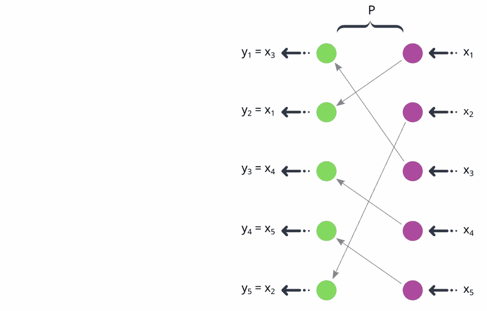

*所展示的排列矩阵 “P” 的 X 图显示，当生成输出向量 ‘y’ 时，所有 ‘n’ 个输入值 x*[*i*] 都被重新排列了。*

现在，排列矩阵的逆矩阵应该是什么类型的矩阵？换句话说，如何撤销排列矩阵 “*P*” 的变换？显然，我们需要进行另一种重新排列，其作用顺序相反。例如，如果输入值 *x*[3] 被矩阵 “*P*” 移动到输出值 *y*[1]，那么在逆排列矩阵 *P*^(-1) 中，输入值 *y*[1] 应该被移回到输出值 *x*[3]。这意味着在绘制排列矩阵 “*P*^(-1)” 和 “*P*” 的 X 图时，一个将是另一个的镜像。

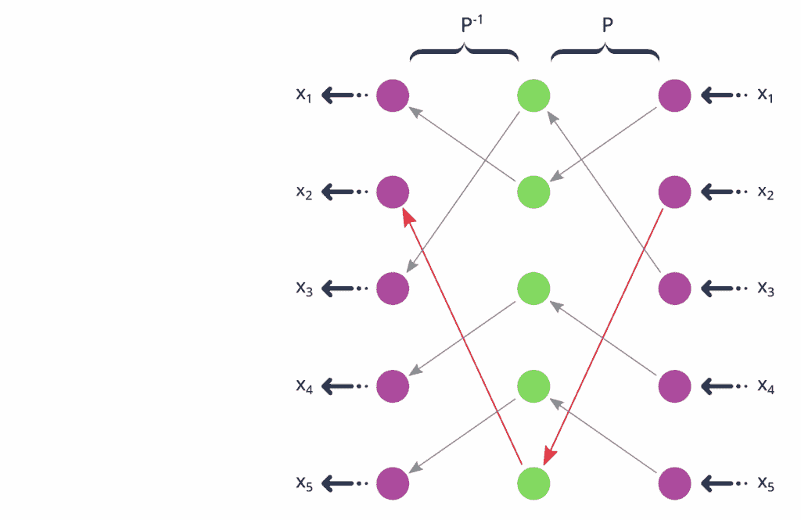

*产品矩阵 P^(-1)P 的 X 图。我们看到输入值 ‘x[2]‘ 被矩阵 “P” 放置到中间值 ‘y[5]‘，然后又被 P^(-1) 放回原始位置 ‘x[2]‘。同样的情况也适用于其他输入值 ‘x[i]‘。*

与交换矩阵的情况类似，在排列矩阵的情况下，我们可以直观地注意到 “*P*” 和 *P*^(-1) 的 X 图仅相差一个水平翻转。这就是为什么任何排列矩阵 “*P*” 的逆矩阵都等于其转置：

\[\begin{equation*}

P^{-1} = P^T

\end{equation*}\]

\[\begin{equation*}

\begin{pmatrix}

x_1 \\ x_2 \\ x_3 \\ x_4 \\ x_5

\end{pmatrix}

= x = P^{-1}Px =

\begin{bmatrix}

0 & 1 & 0 & 0 & 0 \\

0 & 0 & 0 & 0 & 1 \\

1 & 0 & 0 & 0 & 0 \\

0 & 0 & 1 & 0 & 0 \\

0 & 0 & 0 & 1 & 0

\end{bmatrix}

\begin{bmatrix}

0 & 0 & 1 & 0 & 0 \\

1 & 0 & 0 & 0 & 0 \\

0 & 0 & 0 & 1 & 0 \\

0 & 0 & 0 & 0 & 1 \\

0 & 1 & 0 & 0 & 0

\end{bmatrix}

\begin{pmatrix}

x_1 \\ x_2 \\ x_3 \\ x_4 \\ x_5

\end{pmatrix}

= P^{-1}y

\end{equation*}\]

### 逆旋转矩阵

在二维平面上的旋转矩阵是这样一种矩阵 “*R*”，当它与向量 (*x*[1], *x*[2]) 相乘时，将点 “*x*=(*x*[1], x[2])” 以一定角度 “*ϴ*” 逆时针绕原点旋转。其公式是：

\[

\begin{equation*}

\begin{pmatrix}

y_1 \\ y_2

\end{pmatrix}

= y = Rx =

\begin{bmatrix}

cos(\theta) & -sin(\theta) \\

sin(\theta) & \phantom{+} cos(\theta)

\end{bmatrix}

*

\begin{pmatrix}

x_1 \\ x_2

\end{pmatrix}

\end{equation*}\]

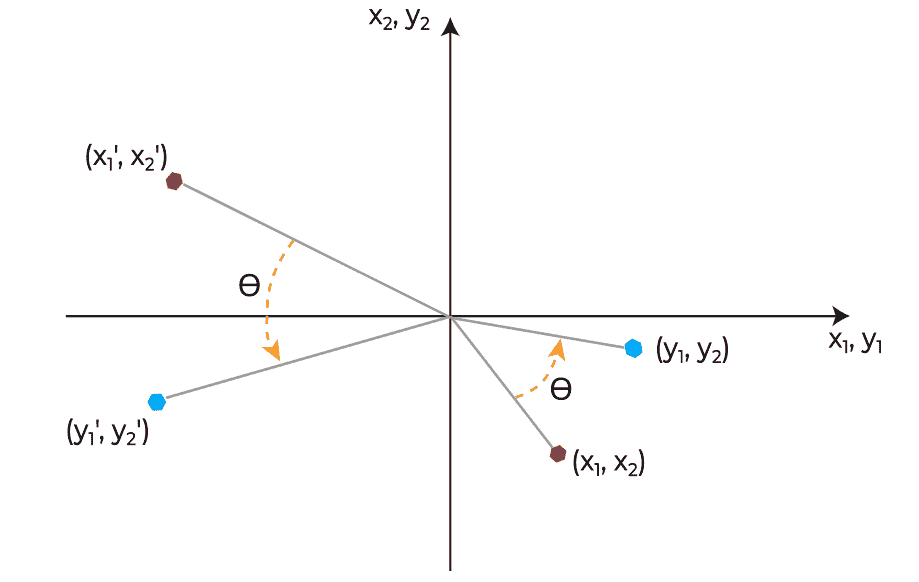

*旋转矩阵作用于任何点，通过旋转角度 “ϴ” 来旋转它，同时保持其与零点的距离。原始点用红色表示，而旋转后的点用蓝色表示。*

现在，旋转矩阵的逆矩阵应该是什么？如何撤销由矩阵 “*R*” 产生的旋转？显然，那应该又是另一个旋转矩阵，这次的角度是 “-*ϴ*” （或 “360°-*ϴ*”）：

\[\begin{equation*}

R^{-1} =

\begin{bmatrix}

cos(-\theta) & -sin(-\theta) \\

sin(-\theta) & \phantom{+} cos(-\theta)

\end{bmatrix}

=

\begin{bmatrix}

\phantom{+} cos(\theta) & sin(\theta) \\

-sin(\theta) & cos(\theta)

\end{bmatrix}

=

R^T

\end{equation*}\]

这就是为什么旋转矩阵的逆矩阵又是另一个旋转矩阵。我们还看到，逆矩阵 *R*^(-1) 等于原始矩阵 “*R*” 的转置。

### 三角矩阵的逆

上三角矩阵是一个方阵，其对角线以下的元素为零。正因为如此，在其 X 图中，没有向下方向的箭头：

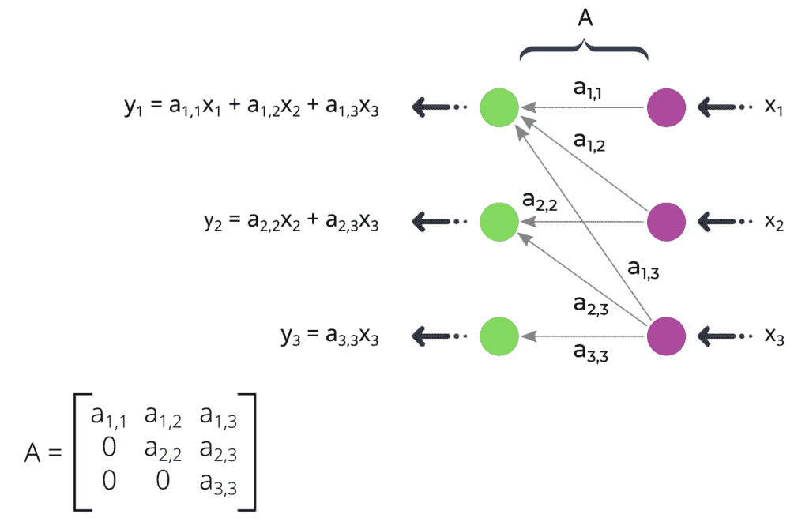

*一个 3×3 的上三角矩阵及其 X 图。*

水平箭头对应于对角线上的单元格，而向上方向的箭头对应于对角线以上的单元格。

同样，下三角矩阵被定义为，其主对角线以上的元素为零。在这篇文章中，我们将只关注上三角矩阵，因为对于下三角矩阵，求逆的方法是类似的。

为了简单起见，我们首先讨论如何求一个 2×2 大小的上三角矩阵 ‘*A*’ 的逆。

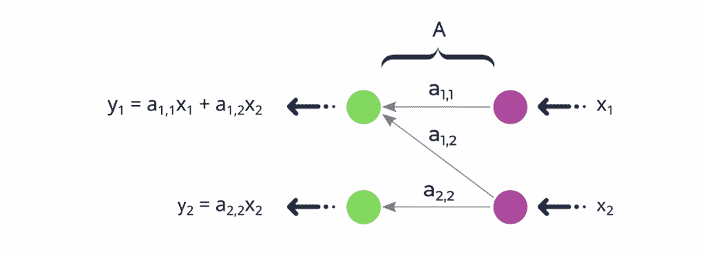

*2×2 大小的上三角矩阵。*

一旦 ‘*A*’ 与输入向量 ‘*x*’ 相乘，结果向量 “*y* = *Ax*” 具有以下形式：

\[\begin{equation*}

y =

\begin{pmatrix}

y_1 \\ y_2

\end{pmatrix}

=

\begin{bmatrix}

a_{1,1} & a_{1,2} \\

0 & a_{2,2}

\end{bmatrix}

\begin{pmatrix}

x_1 \\ x_2

\end{pmatrix}

=

\begin{pmatrix}

\begin{aligned}

a_{1,1}x_1 + a_{1,2}x_2 \\

a_{2,2}x_2

\end{aligned}

\end{pmatrix}

\end{equation*}\]

现在，当计算矩阵 *A*^(-1) 的逆矩阵时，我们希望它以相反的顺序起作用：

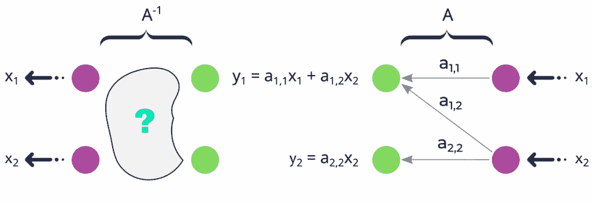

*给定值 (y[1], y[2])，矩阵 A^(-1) 应该恢复原始值 (x[1], x[2])。*

我们应该如何从 (*y*[1], *y*[2]) 恢复 (*x*[1], *x*[2])？第一步也是最简单的一步是仅使用 *y*[2] 恢复 *x*[2]，因为 *y*[2] 原本只受 *x*[2] 的影响。我们不需要 *y*[1] 的值：

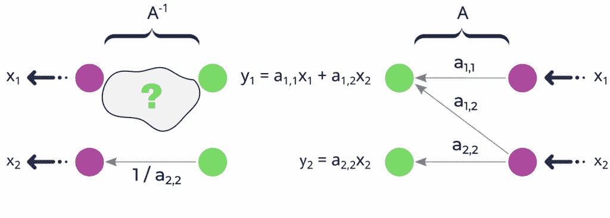

*为了恢复 ‘x[2]’，我们只需要 ‘y[2]’ 的值。*

接下来，我们该如何恢复 *x*[1] 呢？这次，我们不能再只使用 *y*[1]，因为值 “*y*[1] = *a*[1,1]*x*[1] + *a*[1,2]*x*[2]” 是 *x*[1] 和 *x*[2] 的混合。但如果我们适当地使用 *y*[1] 和 *y*[2]，我们就可以恢复 *x*[1]。这次，*y*[2] 将帮助过滤掉 *x*[2] 的影响，从而恢复 *x*[1] 的纯值：

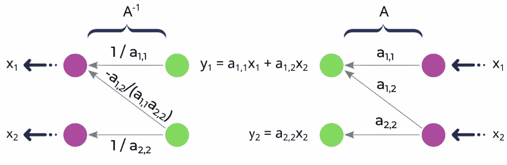

*为了恢复‘x[1]’，我们需要‘y[1]’和‘y[2]’的值。*

我们现在看到，上三角矩阵 “*A*” 的逆矩阵 *A*^(-1) 也是一个上三角矩阵。

大型三角矩阵又是怎样的呢？这次我们拿一个 3×3 的大矩阵，并找到它的逆矩阵。

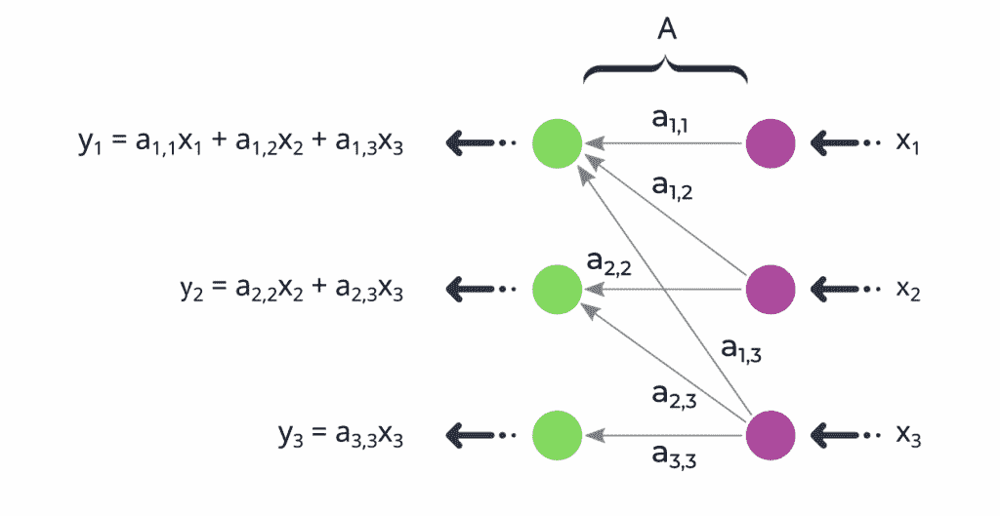

*3×3 上三角矩阵 ‘A’ 的 X 图。*

现在从 ‘*x*‘ 获取输出向量 ‘*y*‘ 的值如下：

\[

\begin{equation*}

y =

\begin{pmatrix}

y_1 \\ y_2 \\ y_3

\end{pmatrix}

= Ax =

\end{pmatrix}

a_{1,1} & a_{1,2} & a_{1,3} \\

0 & a_{2,2} & a_{2,3} \\

0 & 0 & a_{3,3}

\end{bmatrix}

\begin{pmatrix}

x_1 \\ x_2 \\ x_3

\end{pmatrix}

=

\begin{pmatrix}

\begin{aligned}

a_{1,1}x_1 + a_{1,2}x_2 + a_{1,3}x_3 \\

a_{2,2}x_2 + a_{2,3}x_3 \\

a_{3,3}x_3

\end{aligned}

\end{pmatrix}

\end{equation*}\]

由于我们感兴趣的是构建逆矩阵 *A*^(-1)，我们的目标是找到 (*x*[1], *x*[2], *x*[3])，并具有 (*y*[1], *y*[2], *y*[3]) 的值：

\[\begin{equation*}

\begin{pmatrix}

x_1 \\ x_2 \\ x_3

\end{pmatrix}

= A^{-1}y =

\begin{bmatrix}

\text{?} & \text{?} & \text{?} \\

\text{?} & \text{?} & \text{?} \\

\text{?} & \text{?} & \text{?}

\end{bmatrix}

*

\begin{pmatrix}

y_1 \\ y_2 \\ y_3

\end{pmatrix}

\end{equation*}\]

换句话说，我们必须解决上面提到的线性方程组。

做这件事将首先恢复 *x*[3] 的值：

\[\begin{equation*}

y_3 = a_{3,3}x_3, \hspace{1cm} x_3 = \frac{1}{a_{3,3}} y_3

\end{equation*}\]

这将阐明 *A*^(-1) 的最后一行的单元格：

\[\begin{equation*}

\begin{pmatrix}

x_1 \\ x_2 \\ x_3

\end{pmatrix}

= A^{-1}y =

\begin{bmatrix}

\text{?} & \text{?} & \text{?} \\

\text{?} & \text{?} & \text{?} \\

0 & 0 & \frac{1}{a_{3,3}}

\end{bmatrix}

*

\begin{pmatrix}

y_1 \\ y_2 \\ y_3

\end{pmatrix}

\end{equation*}\]

确定了 *x*[3] 后，我们可以将其所有出现都移到系统的左侧：

\[\begin{equation*}

\begin{pmatrix}

y_1 – a_{1,3}x_3 \\

y_2 – a_{2,3}x_3 \\

y_3 – a_{3,3}x_3

\end{pmatrix}

=

\begin{pmatrix}

\begin{aligned}

a_{1,1}x_1 + a_{1,2}x_2 \\

a_{2,2}x_2 \\

0

\end{aligned}

\end{pmatrix}

\end{equation*}\]

这将使我们能够计算出 *x*[2] 如下：

\[\begin{equation*}

y_2 – a_{2,3}x_3 = a_{2,2}x_2, \hspace{1cm}

x_2 = \frac{y_2 – a_{2,3}x_3}{a_{2,2}} = \frac{y_2 – (a_{2,3}/a_{3,3})y_3}{a_{2,2}}

\end{equation*}\]

这已经阐明了 *A*^(-1) 的第二行的单元格：

\[\begin{equation*}

\begin{pmatrix}

x_1 \\ x_2 \\ x_3

\end{pmatrix}

= A^{-1}y =

\begin{bmatrix}

\text{?} & \text{?} & \text{?} \\[0.2cm]

0 & \frac{1}{a_{2,2}} & – \frac{a_{2,3}}{a_{2,2}a_{3,3}} \\[0.2cm]

0 & 0 & \frac{1}{a_{3,3}}

\end{bmatrix}

*

\begin{pmatrix}

y_1 \\ y_2 \\ y_3

\end{pmatrix}

\end{equation*}\]

最后，在确定了 *x*[3] 和 *x*[2] 的值之后，我们可以将 *x*[2] 移到系统的左侧：

\[\begin{equation*}

\begin{pmatrix}

\begin{aligned}

y_1 – a_{1,3}x_3 & – a_{1,2}x_2 \\

y_2 – a_{2,3}x_3 & – a_{2,2}x_2 \\

y_3 – a_{3,3}x_3 &

\end{aligned}

\end{pmatrix}

=

\begin{pmatrix}

a_{1,1}x_1 \\

0 \\

0

\end{pmatrix}

\end{equation*}\]

从中可以推导出 *x*[1] 的值：

\[\begin{equation*}

\begin{aligned}

& y_1 – a_{1,3}x_3 – a_{1,2}x_2 = a_{1,1}x_1, \\

& x_1

= \frac{y_1 – a_{1,3}x_3 – a_{1,2}x_2}{a_{1,1}}

= \frac{y_1 – (a_{1,3}/a_{3,3})y_3 – a_{1,2}\frac{y_2 – (a_{2,3}/a_{3,3})y_3}{a_{2,2}}}{a_{1,1}}

\end{aligned}

\end{equation*}\]

因此，矩阵 *A*^(-1) 的第一行也将被阐明：

\[\begin{equation*}

\begin{pmatrix}

x_1 \\ x_2 \\ x_3

\end{pmatrix}

= A^{-1}y =

\begin{bmatrix}

\frac{1}{a_{1,1}} & – \frac{a_{1,2}}{a_{1,1}a_{2,2}} & \frac{a_{1,2}a_{2,3} – a_{1,3}a_{2,2}}{a_{1,1}a_{2,2}a_{3,3}} \\[0.2cm]

0 & \frac{1}{a_{2,2}} & – \frac{a_{2,3}}{a_{2,2}a_{3,3}} \\[0.2cm]

0 & 0 & \frac{1}{a_{3,3}}

\end{bmatrix}

*

\begin{pmatrix}

y_1 \\ y_2 \\ y_3

\end{pmatrix}

\end{equation*}\]

在解析地推导出 *A*^(-1) 之后，我们可以看到它也是一个上三角矩阵。

通过关注我们用来计算 *A*^(-1) 的操作顺序，我们可以肯定地说，任何上三角矩阵‘*A*’的逆矩阵也是一个上三角矩阵：

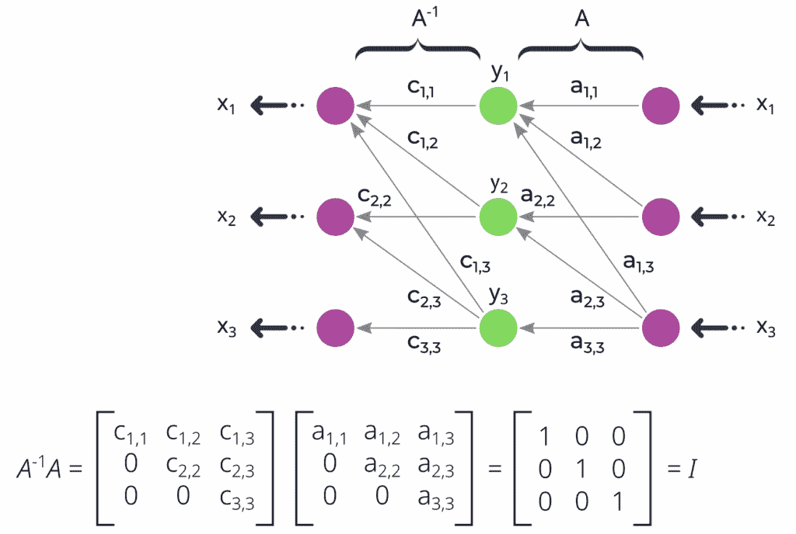

*3×3 大小的上三角矩阵‘A’的逆矩阵也是一个上三角矩阵。*

类似的判断将表明，下三角矩阵的逆矩阵也是一个下三角矩阵。

* * *

## 矩阵链求逆的数值示例

让我们再次看看，为什么在矩阵链的求逆过程中，它们的顺序被反转。回顾公式：

\[\begin{equation*}

(AB)^{-1} = B^{-1}A^{-1}

\end{equation*}\]

这次，对于‘*A*’和‘*B*’，我们将取某些类型的矩阵。第一个矩阵“*A*=*V*”将是一个循环移位矩阵：

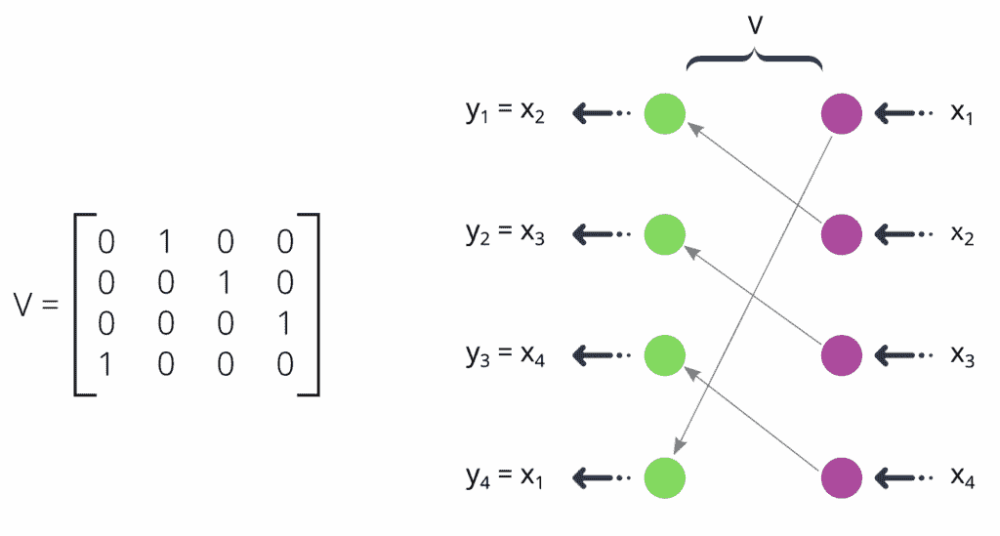

*矩阵‘V’将输入向量‘x’的值向上循环移位 1 位。*

让我们在这里回顾一下，为了恢复输入向量‘*x*’，逆矩阵 *V*^(-1) 应该做相反的操作——将参数向量‘*y*’的值向下循环移位：

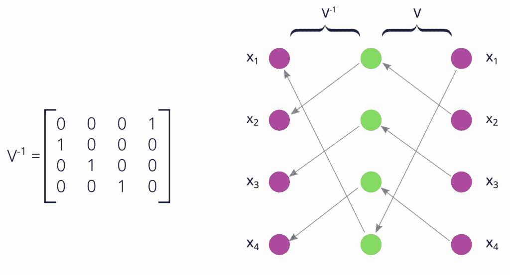

*将 V^(-1)V 连接起来，结果是不变的输入向量‘x’。*

第二个矩阵“*B*=*S*”将是一个对角矩阵，其对角线上的值不同：

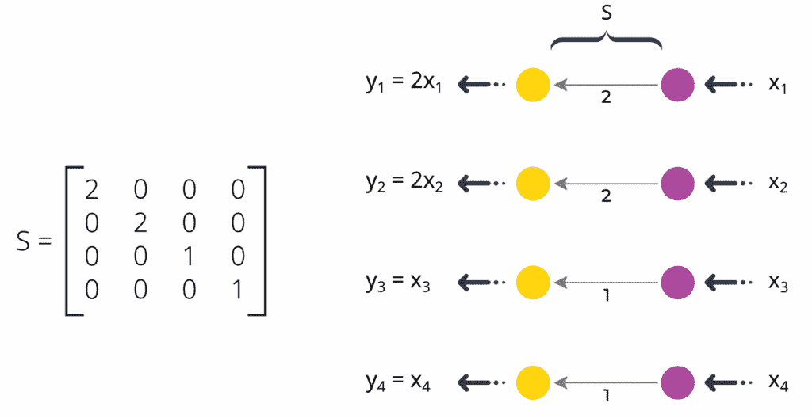

*4×4 矩阵‘S’仅将输入向量‘x’的前两个值加倍。*

要恢复原始向量‘*x*’，必须将此类比例矩阵的逆矩阵‘*S*^(-1)’的参数向量‘*y*’的前两个值减半：

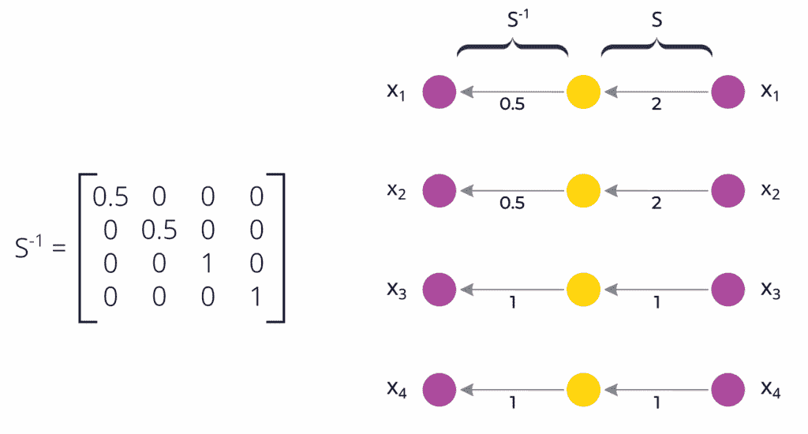

*将 S^(-1)S 连接起来得到不变的输入向量‘x’。*

现在，乘积矩阵“*VS*”会有什么行为？当计算“*y* = *VSx*”时，它只会将输入向量‘*x*’的前两个值加倍，并将整个结果向上循环移动。

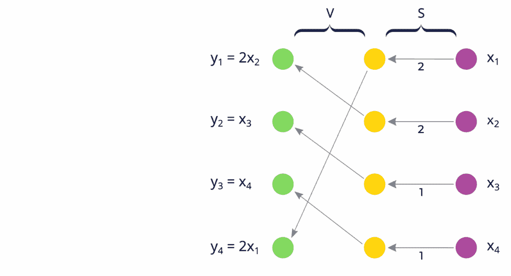

*“V*S”乘积矩阵只将输入向量‘x’的前两个值加倍，并将结果向上循环移动一个位置。*

我们已经知道，一旦计算出输出向量“*y* = *VSx*”，为了逆转乘积矩阵“*VS*”的影响并恢复输入向量‘*x*’，我们应该这样做：

\[\begin{equation*}

x = (VS)^{-1}y = S^{-1}V^{-1}y

\end{equation*}\]

换句话说，在求逆时，矩阵‘*V*’和‘*S*’的顺序应该颠倒：

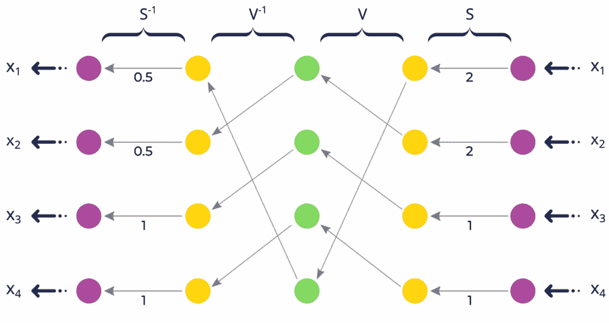

*乘积矩阵“VS”的逆等于“S^(-1)V^(-1)”。“x”输入向量右侧的所有值在左侧都得到了恢复。*

如果我们尝试以不正确的方式逆转“*VS*”的影响，不颠倒矩阵的顺序，假设应该使用*V*^(-1)*S*^(-1)：

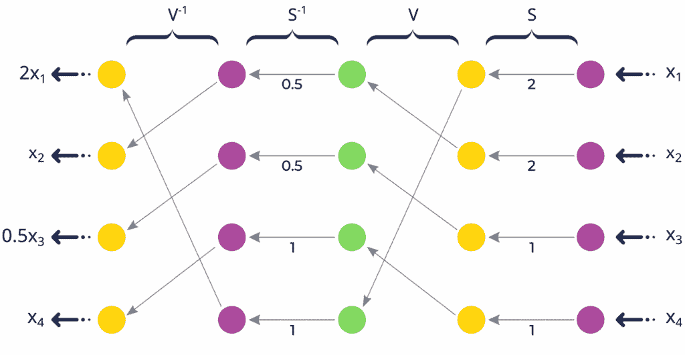

*尝试使用 S^(-1)V^(-1)来求逆矩阵“SV”不会得到单位矩阵“E”。*

我们看到，右侧的原始向量 (*x*[1], *x*[2], *x*[3], *x*[4]) 现在并没有在左侧恢复。相反，我们现在有向量

(2*x*[1], *x*[2], 0.5*x*[3], *x*[4])。一个原因是*x*[3]的值不应该在其路径上减半，但实际上它被减半了，因为在矩阵*S*^(-1)应用的那一刻，*x*[3]出现在从顶部数起的第二个位置，这实际上减半了。同样适用于*x*[1]的路径。所有这些都导致左侧出现一个改变了的向量。

* * *

## 结论

在这个故事中，我们研究了矩阵求逆运算 *A*^(-1) 作为一种撤销给定矩阵“*A*”变换的方法。我们观察到为什么逆序矩阵链如 (*ABC*)^(-1) 实际上会反转乘法顺序，从而得到 *C*^(-1)*B*^(-1)*A*^(-1)。我们还从视觉上了解了为什么逆序几种特殊类型的矩阵会得到相同类型的另一个矩阵。

感谢阅读！

这可能是我的“理解矩阵”系列的最后一部分。希望您喜欢阅读所有 4 个部分！如果是这样，请随意关注我的领英，因为希望其他文章很快就会出来，我会在那里发布更新！

* * *

> *我要感谢：*
> 
> *– 罗扎·加尔斯蒂扬，感谢仔细审阅草案和有用的建议 ([linkedin.com/in/roza-galstyan-a54a8b352/](https://www.linkedin.com/in/roza-galstyan-a54a8b352/))*.
> 
> *如果您喜欢阅读这个故事，请随时在 LinkedIn 上与我联系 ([linkedin.com/in/tigran-hayrapetyan-cs/](https://www.linkedin.com/in/tigran-hayrapetyan-cs/)).*
> 
> *所有使用的图片，除非另有说明，均为作者设计请求。*

* * *

## 参考文献:

[[1] – 理解矩阵 | 第一部分：矩阵-向量乘法](https://towardsdatascience.com/understanding-matrices-part-1-matrix-vector-multiplication/)

[[2] – 理解矩阵 | 第二部分：矩阵-矩阵乘法](https://towardsdatascience.com/understanding-matrices-part-2-matrix-matrix-multiplication/)

[[3] – 理解矩阵 | 第三部分：矩阵转置](https://towardsdatascience.com/understanding-matrices-part-3-matrix-transpose/)
