# 理解模型校准：温和的介绍与视觉探索

> 原文：[`towardsdatascience.com/understanding-model-calibration-a-gentle-introduction-visual-exploration/`](https://towardsdatascience.com/understanding-model-calibration-a-gentle-introduction-visual-exploration/)

#### **你的预测有多可靠？**

**### **关于**

**要被认为是可靠的，模型必须校准，使其在每个决策中的置信度与其真实结果紧密相关。在这篇博客文章中，我们将探讨校准最常用的定义，然后深入探讨模型校准常用的评估指标。然后，我们将介绍这个指标的缺点以及这些缺点如何导致了校准额外概念的必要性，这些概念需要它们自己的新评估指标。本文的目的不是深入剖析所有关于校准的工作，也不是专注于如何校准模型。相反，它旨在温和地介绍不同的概念及其评估指标，以及重新强调一些仍然广泛用于评估校准的指标存在的问题。

### **目录**

+   **什么是校准？**

+   **评估校准——期望校准误差（ECE）**

+   **ECE（期望校准误差）最常提到的缺点**

+   **校准的其他定义**

+   **摘要**

### **什么是校准？**

校准确保模型估计的概率与实际世界的结果相匹配。*例如，如果一个天气预报模型预测在几天内有 70%的降雨概率，那么大约 70%的这些日子实际上应该是雨天，这样模型才能被认为是校准良好的。*这使得模型预测更加*可靠*和*可信*，因此校准对于各个领域的许多应用都具有重要意义。

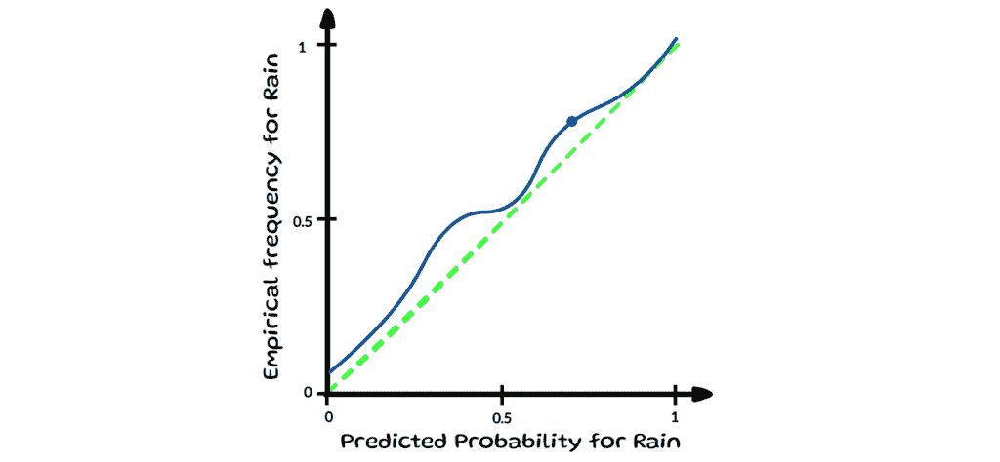

可靠性图——图片由作者提供

现在，**校准**的确切含义取决于所考虑的具体定义。我们将探讨机器学习中最常见的概念，由 Guo 提出并由 Kull 命名为***置信度校准***。但首先，让我们为这篇博客定义一些正式的符号。

在这篇博客文章中，我们考虑一个有***K***个可能类别的分类任务，标签***Y*** ∈ {**1**, …, ***K***}，以及一个分类模型***p̂*** :*𝕏* **→ Δᴷ*，它接受*𝕏*（例如图像或文本）作为输入，并返回一个概率向量作为其输出。*Δᴷ*指的是*K*-单纯形，这意味着输出向量必须加起来为 1，并且向量中的每个估计概率都在 0 & 1 之间。*这些个别概率（或置信度）表明输入属于***K***个类别中的哪一个的可能性有多大。

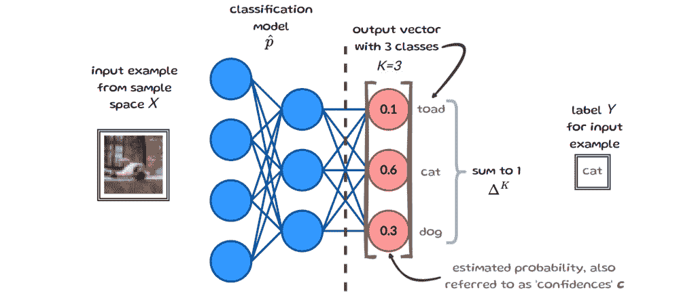

符号说明 — 图片由作者提供 — 输入示例来源于 [Uma](https://www.jair.org/index.php/jair/article/view/12752/26751)

### **1.1 (置信度) 校准**

**一个模型如果对于所有置信度 ***c***，模型正确 ***c*** 比例的时间，则被认为是置信度校准的**：

其中 (X,Y) 是一个数据点，p̂ : 𝕏 → Δᴷ 返回一个概率向量作为其输出

这种校准的定义确保了模型的最终预测与在该置信度水平下观察到的准确性相一致。下面的左图通过桶可靠性图可视化所有置信度下的完美校准结果 *(绿色对角线)*。在右侧，它显示了 10 个样本中特定置信度水平下的两个示例。

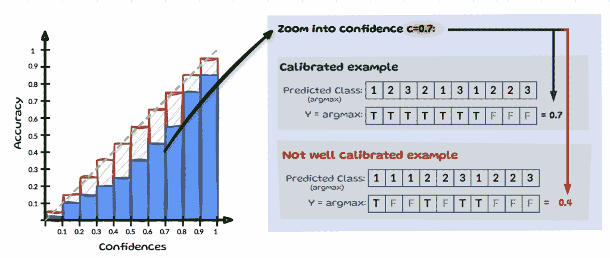

自信校准  — 图片由作者提供

为了简化，我们假设我们只有 3 个类别，如图 2（符号说明）所示，我们将置信度 ***c=0.7*** 放大查看，见上图。假设我们这里有 10 个输入，其中最自信的预测 (*max*) 等于 ***0.7***。如果模型在 10 个预测中正确分类了 7 个 (*true*)，则认为它在置信度水平 0.7 下是校准的。为了使模型完全校准，这一点必须从 0 到 1 的所有置信度水平上保持一致。在相同的置信度水平 c=0.7 下，如果模型只做出 4 个正确的预测，则认为它是误校准的。

* * *

### **2 评估校准 — 期望校准误差 (ECE)**

**一个广泛使用的置信度校准评估指标是期望校准误差 (ECE)。ECE 通过对平均精度 *(acc)* 和平均置信度 *(conf)* 之间的绝对差异进行加权平均来衡量模型估计概率与观察概率匹配的程度。该指标涉及将所有 ***n*** 数据点分成 *M* 个等间距的桶**：

其中 ***B*** 用于表示“桶”，***m*** 用于表示桶号，而 *acc* 和 *conf* 是：

***ŷᵢ*** 是模型对样本 ***i*** 的预测类别 *(arg max)*，***yᵢ*** 是样本 ***i*** 的真实标签。**1** 是一个 *指示函数*，意味着当预测标签 ***ŷᵢ*** 等于真实标签 ***yᵢ*** 时，它评估为 1，否则为 0。让我们通过一个示例来澄清 *acc, conf* 以及整个分桶方法，以逐步视觉化的方式。

### **2.1 ECE — 逐步视觉示例**

**在下面的图像中，我们可以看到我们有 *9* 个样本，由 ***i*** 索引，估计概率为 ***p̂(xᵢ)*（简化为 **p̂ᵢ***）对于类别 **cat (C)**，**dog (D)** 或 **toad (T)**。最后一列显示真实类别 ***yᵢ***，倒数第二列包含预测类别 ***ŷᵢ*****。

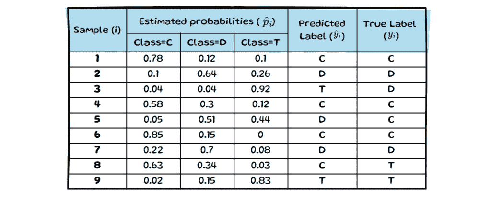

表 1 — ECE 玩具示例 — 图片由作者提供

在 ECE 中，仅使用确定预测标签的最大概率，因此我们将仅根据类别的最大概率对样本进行分箱（参见下图中左侧的表格）。为了使示例简单，我们将数据分为 5 个**等距**的分箱 ***M=5***。如果我们现在查看每个样本的最大估计概率，我们可以将其分组到 5 个分箱中的任何一个（参见下图中右侧）。

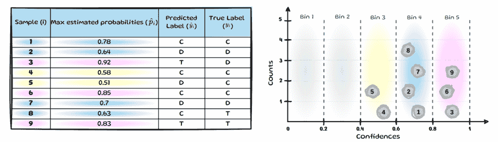

表 2 & 分箱图 — 图片由作者提供

我们仍然需要确定预测的类别是否正确，以便能够确定每个分箱的平均准确率。如果模型正确预测了类别（即 ***yᵢ*** = ***ŷᵢ***），则预测结果将以绿色突出显示；错误的预测将以红色标记：

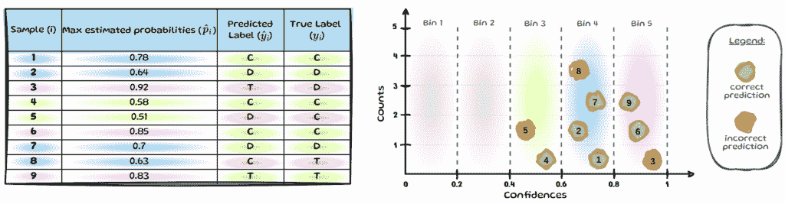

表 3 & 分箱图 — 图片由作者提供

我们现在已经可视化了所有用于 ECE 所需的信息，并将简要介绍如何

计算分箱 5（***B******₅***）的值。其他分箱随后将遵循相同的过程，见下文。

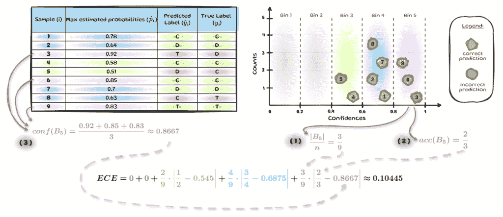

表 4 & 分箱 5 的示例 — 图片由作者提供

我们可以通过评估有多少个样本中的**9**个样本落入***B******₅***，来获得样本落入***B******₅***的实证概率，见**（1）**。然后我们得到***B******₅***的平均准确率，见**（2）**，最后得到***B******₅***的平均估计概率，见**（3）**。***对所有分箱重复此操作，在我们的 9 个样本的小例子中，我们最终得到 ECE 为*0.10445*。一个完美校准的模型将具有 ECE 为 0。

*要详细了解 ECE 的逐步解释，请参阅[*这篇博客文章*](https://contributor.insightmediagroup.io/expected-calibration-error-ece-a-step-by-step-visual-explanation-with-python-code-c3e9aa12937d/)*.*

### **2.1.1  预期校准误差的缺点**

上面的分箱图像提供了 ECE 如何导致非常不同的值的视觉指南，如果我们使用了更多的分箱或可能使用相同数量的项目进行分箱而不是使用等宽分箱。ECE 的这些缺点以及更多缺点在早期的一些工作中已被突出显示。*然而，尽管存在已知的弱点，ECE 仍然被广泛用于评估机器学习中的置信度校准。*

### **3 最常提到的 ECE 缺点**

**#### **3.1 病态 — 低 ECE ≠ 高准确率**

**一个最小化 ECE 的模型，不一定具有高精度。例如，如果一个模型总是用该类平均流行率作为概率来预测多数类，它将具有 ECE 为 0。这在上面的图像中得到了可视化，我们有一个包含 10 个样本的数据集，其中 7 个是猫，2 个是狗，只有一个是一只蟾蜍。现在，如果模型总是以平均 0.7 的置信度预测猫，它将具有 ECE 为 0。还有更多这样的病理情况。为了不仅仅依赖于 ECE，一些研究人员使用 Brier 分数或 LogLoss 等额外指标与 ECE 一起使用。**

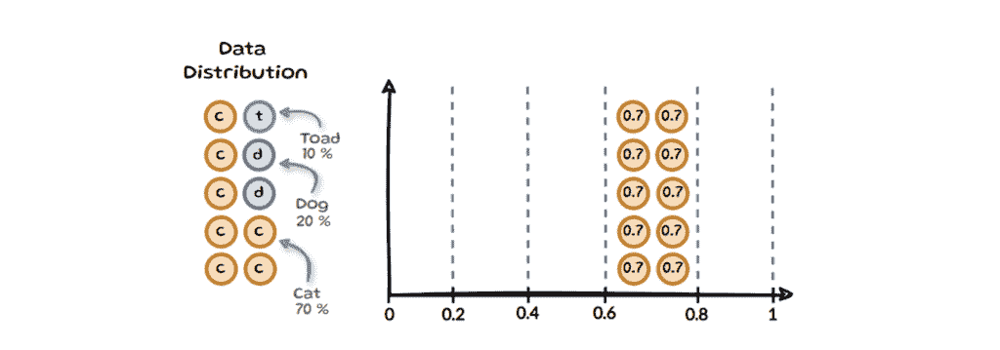

样本病理学—作者图片

#### **3.2 区间划分方法**

ECE 最常提到的问题之一是其对区间划分变化的敏感性。这有时被称为***偏差-方差权衡***：较少的区间减少方差但增加偏差，而较多的区间会导致稀疏填充的区间增加方差。如果我们回顾我们的包含 9 个样本的 ECE 示例，并将区间从 5 个改为 10 个，我们最终得到以下结果：

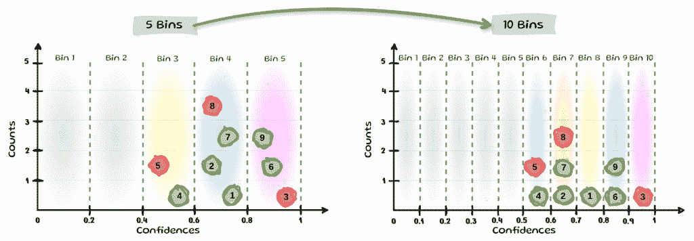

更多区间示例—作者图片

我们可以看到，区间*8*和*9*各自只包含一个样本，而且现在有一半的区间没有样本。然而，上述只是一个玩具示例，因为现代模型往往具有更高的置信度值，样本通常最终会落在最后几个区间中，这意味着它们在 ECE 中获得了所有权重，而空区间的平均误差对 ECE 的贡献为 0。

为了减轻固定区间宽度的这些问题，一些作者提出了更自适应的区间划分方法：

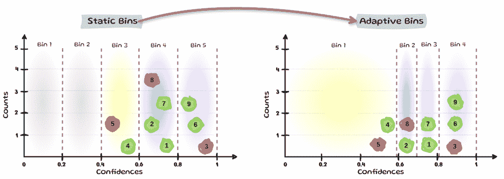

自适应区间示例—作者图片

基于等样本数量的区间划分的评估方法，与固定区间划分方法（如 ECE）相比，显示出更低的偏差。这导致 Roelofs 强烈反对使用等宽区间划分，他们建议使用一种替代方案：***ECEsweep***，该方案在确保校准函数单调性的同时，*最大化等质量区间的数量*。*自适应校准误差（**ACE**）*和*阈值自适应校准误差（**TACE**）*是 ECE 的两种其他变体，它们使用灵活的区间划分。然而，有些人认为它对区间和阈值的选择很敏感，导致对不同模型的排名不一致。另外两种方法旨在完全消除区间划分：***MacroCE***通过平均正确和错误预测的实例级校准误差来实现这一点，而基于 KDE 的 ECE 则通过用非参数密度估计器替换区间来实现，具体来说是核密度估计（KDE）。

#### **3.3 只考虑最大概率**

**ECE 经常被提到的另一个缺点是它只考虑最大估计概率。只有最大置信度应该校准的想法，可以通过一个简单的例子来最好地说明：**

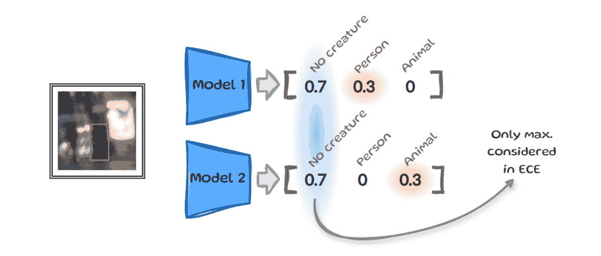

只有最大概率 — 图片由作者提供 — 输入示例来源于 [Schwirten](https://arxiv.org/abs/2405.08794)

假设我们训练了两个不同的模型，现在它们都需要确定相同的输入图像是否包含 *人*、*动物* 或 *无生物*。两个模型输出的向量具有略微不同的估计概率，但它们对“*无生物*”的最大置信度相同。由于 ECE 只关注这些顶级值，它会认为这两个输出是相同的。然而，当我们考虑现实世界的应用时，我们可能希望我们的自动驾驶汽车在不同的情境中表现出不同的行为。这种仅限于最大置信度的限制促使各种作者重新考虑校准的定义，这给我们带来了两个额外的置信度解释：**多类** 和 **类别校准**。

### **3.3.1 多类校准**

一个模型被认为是多类校准的，如果对于任何预测向量 ***q=***(*q*₁​,…,*q*ₖ) ∈ **Δᴷ**​，模型输出的相同预测 ***p̂(X)=q*** 的所有 ***X*** 值中的类别比例与预测向量 ***q*** 中的值相匹配。

其中 (X,Y) 是一个数据点，p̂ : 𝕏 → Δᴷ 返回一个概率向量作为其输出

这在简单术语中意味着什么？我们现在不是针对 ***c*** 进行校准，而是针对一个具有 k 个类别的向量 ***q***。下面我们来看一个例子：

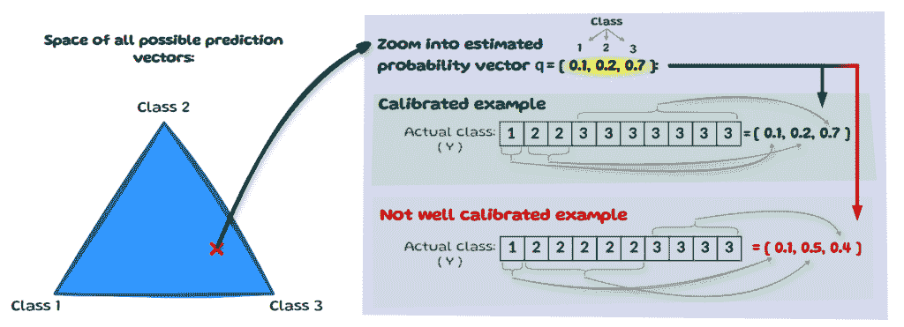

多类校准 — 图片由作者提供

在左边，我们有所有可能的预测向量空间。让我们放大我们的模型预测的一个这样的向量，假设模型有 10 个实例，它预测的向量 ***q***=*[0.1,0.2,0.7]*。现在，为了使其多类校准，真实（实际）类别的分布需要与预测向量 ***q*** 匹配。上面的图像显示了一个校准的例子，*[0.1,0.2,0.7]*，以及一个未校准的例子，*[0.1,0.5,0.4]*。

### **3.3.2 类别校准**

**如果一个模型被认为是类别校准的，对于每个类别 k，所有共享估计概率 ***p̂*****ₖ*****(X)*** 的输入与单独考虑类别 k 的真实频率相一致：**

其中 (X,Y) 是一个数据点；q ∈ Δᴷ 和 p̂ : 𝕏 → Δᴷ 返回一个概率向量作为其输出

类别校准是一个比**多类别校准**更**弱**的定义，因为它考虑每个类别的概率是**独立**的，而不是需要完整的向量来对齐。下面的图片通过放大类别 1 的概率估计来说明这一点：***q******₁******=0.1***。再次强调，我们假设我们有 10 个实例，模型对类别 1 的预测概率估计为 0.1。然后我们查看所有类别中***q******₁******=0.1***的真实类别频率。如果经验频率与***q******₁***匹配，则表示校准正确。

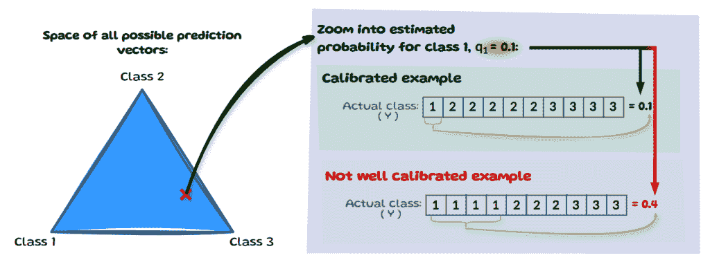

类别校准 — 图片由作者提供

为了评估这种不同的校准概念，对 ECE 进行了一些更新以计算类别的错误。一个想法是为每个类别计算 ECE，然后取平均值。其他人引入了 KS 测试用于类别的校准，并建议使用统计假设检验而不是基于 ECE 的方法。还有研究人员开发了一个假设测试框架（TCal）来检测模型是否显著校准不当，并在此基础上开发 L2 ECE 的置信区间。

* * *

以上提到的所有方法**都共享一个关键假设：存在真实标签**。在这种金标准思维模式下，预测要么是正确的，要么是错误的。然而，标注者可能在真实标签上无法解决且合理地存在分歧。以下是一个简单的例子：

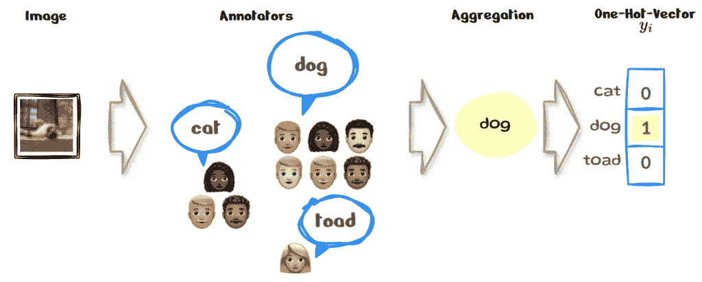

金标准标注 | One-Hot-Vector — 图片由作者提供

我们有与入门示例相同的图片，可以看到标注者选择的标签不同。在标注过程中解决此类问题的常见方法是用某种形式的汇总。比如说，在我们的例子中，我们选择了多数投票，所以我们最终评估的是我们的模型如何校准这样的“真实标签”。有人可能会想，图像很小且像素化；当然，人类的选择不会很确定。然而，这种分歧并不是例外，而是普遍存在的。因此，当数据集中存在大量的人类分歧时，可能不是校准汇总的“金”标签的好主意。与金标签不同，越来越多的研究人员正在使用软标签或平滑标签，这些标签更能代表人类的不确定性，以下是一个示例：

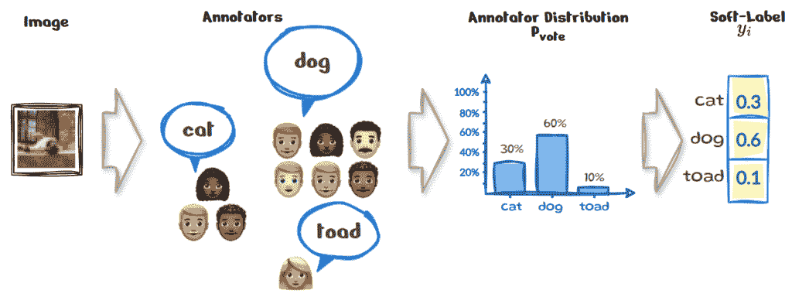

集体意见标注 | 软标签 — 图片由作者提供

在上述相同示例中，我们不仅可以简单地使用标注者的投票频率来创建标签的分布 Pᵥₒₜₑ，从而得到新的***yᵢ***，而不是简单地汇总标注者的投票。这种转向基于集体标注者观点训练模型，而不是依赖于单一的真实来源，促使另一个校准定义的产生：校准模型以对抗人类的不确定性。

### **3.3.3 人类不确定性校准**

如果对于每个特定的样本 ***x***，每个类别 k 的预测概率与该类别正确的“*实际*”概率 Pᵥₒₜₑ 相匹配，则认为该模型是经过人类不确定性校准的。

其中 (X,Y) 是一个数据点，p̂ : 𝕏 → Δᴷ 返回一个概率向量作为其输出。

这种校准的解释使模型的预测与人类不确定性相一致，这意味着模型做出的每个预测都是单独可靠的，并且与该实例的人类水平不确定性相匹配。以下是一个例子：

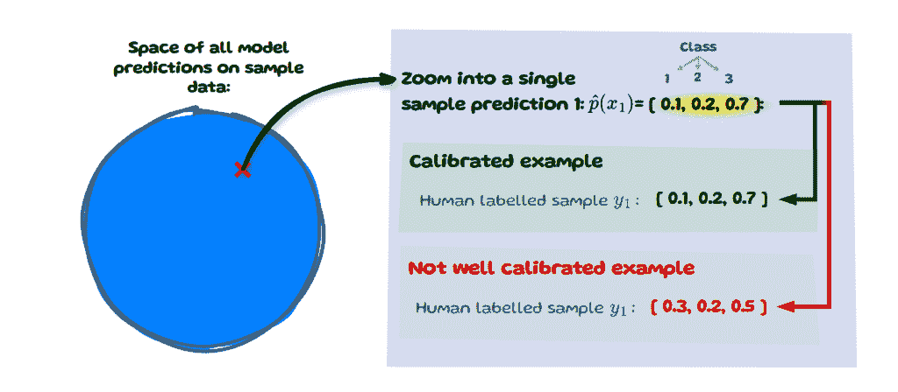

人类不确定性校准——作者提供的图像

我们有我们的样本数据 (*左*)，并放大单个样本 ***x***，其索引为 ***i=1***。该模型对该样本的预测概率向量为 *[0.1,0.2,0.7]*。如果人类标记的分布 ***yᵢ*** 与此预测向量相匹配，则该样本被认为是校准的。

这种校准的定义比之前的定义更细粒度和严格，因为它直接应用于单个预测的水平，而不是在样本集上平均或评估。它还严重依赖于对人类判断分布的准确估计，这需要每个项目有大量的注释。具有此类注释属性的数据集正逐渐变得更多。

为了评估人类不确定性校准，研究人员引入了三个新的度量：**人类熵校准误差 *(EntCE)*、人类排名校准分数 *(RankCS)* 和人类分布校准误差 *(DistCE)***。

其中 ***H(.)*** 表示熵。

***EntCE*** 旨在捕捉模型的不确定性 ***H*(*p̂*ᵢ)*** 与样本 ***i*** 的人类不确定性 ***H*(*yᵢ*)*** 之间的协议。然而，熵对概率值的排列是不变的；换句话说，当你重新排列概率值时，它不会改变。这在下图中得到了可视化：

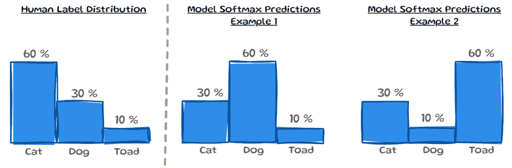

EntCE 的缺点——作者提供的图像

在左侧，我们可以看到人类标签分布 ***yᵢ***，在右侧是针对该相同样本的两个不同模型预测。这三个分布将具有相同的熵，因此比较它们将导致 0 *EntCE*。虽然这并不是比较分布的理想方法，但熵在评估标签分布的噪声水平方面仍然是有帮助的。

其中 argsort 简单地返回排序数组所需的索引。

因此，***RankCS*** 检查每个样本的估计概率排序 ***p̂ᵢ*** 是否与 ***yᵢ*** 的排序相匹配。如果对于特定样本 ***i*** 相匹配，则可以将其计为 1；如果不匹配，则可以计为 0，然后用于对所有样本 N 进行平均。¹

由于这种方法使用排名，它不关心实际概率值的大小。以下两个预测，尽管在类别概率上不同，但会有相同的排名。这有助于评估模型的总体排名能力，并超越了仅仅关注最大置信度。然而，同时它并没有完全捕捉到人类的不确定性校准，因为它忽略了实际概率值。

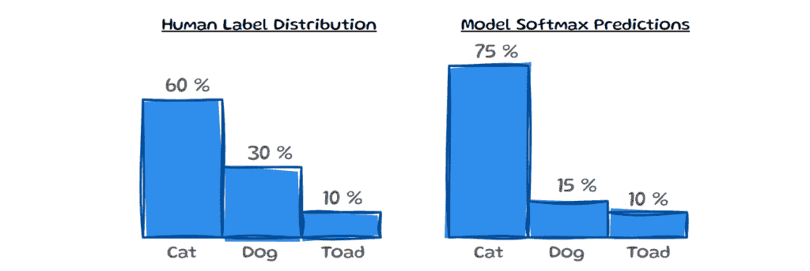

RankCS 的缺点  — 作者图片

***DistCE***已被提出作为这种校准概念的额外评估。它简单地使用两个分布之间的总变差距离（***TVD***），旨在反映它们彼此之间有多少差异。*DistCE*和*EntCE*捕获实例级信息。因此，为了对整个数据集有一个感觉，可以简单地取每个测量的绝对值的平均期望值：E[∣DistCE∣]和 E[∣EntCE∣]。也许未来的努力将引入进一步结合排名和噪声估计优势的测量方法，用于这种校准概念。

## **4 最后的想法**

**我们已经讨论了校准的最常见定义、ECE 的不足以及存在的一些新的校准概念。我们还简要提到了一些新提出的评估措施及其不足。尽管有多个工作反对使用 ECE 来评估校准，但它仍然被广泛使用。本博客文章的目的是引起对这些工作和它们替代方法的关注。*确定哪种校准概念最适合特定情境以及如何评估它应避免误导性结果。然而，也许 ECE 之所以如此简单、直观，并且对于大多数应用来说足够好，以至于它将一直存在？***

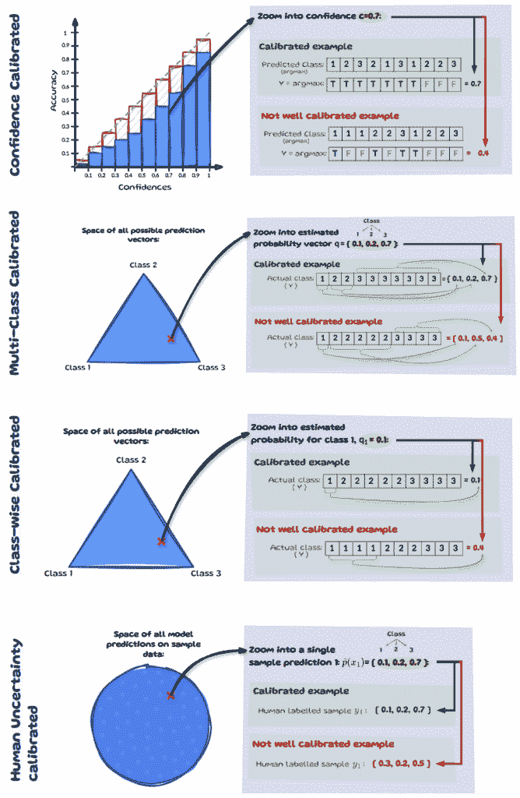

**. . .**

> **更新（2025 年 7 月）：**这篇文章发表在**ICLR 会议博客文章轨道**上，也可以在他们的[**网站这里**](https://iclr-blogposts.github.io/2025/blog/calibration/)找到。也可以在[**ArXiv**](https://arxiv.org/abs/2501.19047)找到 pdf 版本。

**. . .**

***脚注***

¹*在论文中更普遍地表述为：如果 argsorts 匹配，则意味着排名是一致的，这有助于整体 RankCS 得分。***********************
