# 使用 Python (scikit-learn) 理解随机森林

> 原文：[`towardsdatascience.com/understanding-random-forest-using-python-scikit-learn/`](https://towardsdatascience.com/understanding-random-forest-using-python-scikit-learn/)

<mdspan datatext="el1747270837364" class="mdspan-comment">决策</mdspan>树是一种流行的监督学习算法，其优点包括能够用于回归和分类，以及易于解释。然而，决策树并不是性能最好的算法，由于训练数据中的微小变化，它们容易过拟合。这可能导致完全不同的树。这就是为什么人们经常转向像 Bagged Trees 和 Random Forests 这样的集成模型。这些模型由多个在自助数据上训练的决策树组成，并通过聚合来达到比任何单个树都能提供的更好的预测性能。本教程包括以下内容：

+   什么是袋装

+   随机森林的独特之处

+   使用 Scikit-Learn 训练和调整随机森林

+   计算和解释特征重要性

+   在随机森林中可视化单个决策树

如往常一样，本教程中使用的代码可在我的 [GitHub](https://github.com/mGalarnyk/Python_Tutorials/blob/master/Sklearn/CART/Random_Forest/RandomForestUsingPython.ipynb) 上找到。对于那些更喜欢视觉跟随的人，本教程的视频版本也已在我的 YouTube 频道上提供。[video version](https://youtu.be/R9tJeEgHyeo)。有了这些，让我们开始吧！

## 什么是袋装（Bootstrap Aggregating）

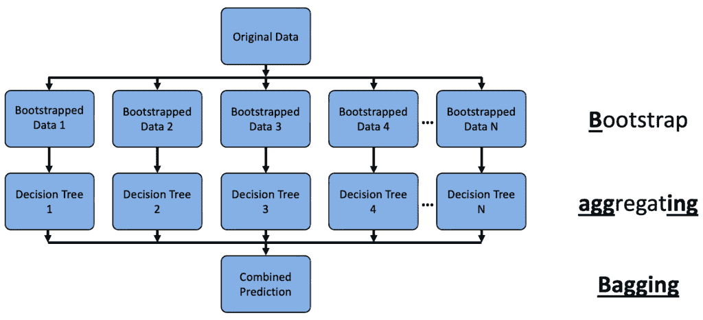

**B**ootstrap + **agg**rega**ting** = Bagging. 图像由 Michael Galarnyk 提供。

随机森林可以被归类为袋装算法（**b**ootstrap **agg**regat**ing**）。袋装算法包括两个步骤：

1.) 自助采样：通过从原始数据集中随机抽取有放回的样本来创建多个训练集。这些新的训练集，称为自助训练集，通常包含与原始数据集相同数量的行，但个别行可能多次出现或根本不出现。平均而言，每个自助训练集包含约 63.2%的原始数据中的唯一行。剩余的~36.8%的行被排除在外，可用于袋外（OOB）评估。有关此概念的更多信息，请参阅我的 [sampling with and without replacement blog post](https://towardsdatascience.com/understanding-sampling-with-and-without-replacement-python-7aff8f47ebe4/)。

2.) 预测聚合：每个通过自助法得到的训练集用于训练不同的决策树模型。最终的预测是通过结合所有单个树的结果来完成的。对于分类，这通常是通过多数投票来完成的。对于回归，预测值是平均的。

在不同的自助样本上训练每棵树引入了树之间的变异。虽然这并不能完全消除相关性——特别是在某些特征占主导地位时——但它有助于与聚合相结合时减少过拟合。许多此类树的预测平均值降低了集成整体的**方差**，提高了泛化能力。

## 随机森林的独特之处

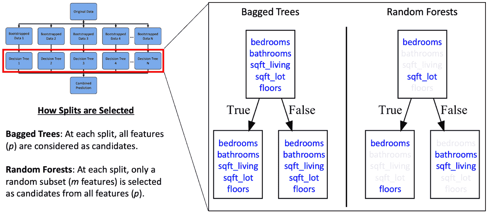

与其他一些集成树算法相比，在随机森林中，每个决策树在每个决策节点上只随机选择特征的一个子集，并使用该子集的最佳分割特征。图片由 Michael Galarnyk 提供。

假设你的数据集中有一个强大的特征。在[集成树](https://youtu.be/urb2wRxnGz4?si=voTNstvcYQMLdlNJ)中，每棵树可能会反复在该特征上分割，导致相关性树和聚合的益处减少。随机森林通过引入更多的随机性来减少这个问题。具体来说，它们在训练期间改变了分割的选择方式：

1). 创建 N 个自助数据集。请注意，尽管自助法在随机森林中常用，但它并非绝对必要，因为第 2 步（随机特征选择）已经在树之间引入了足够的多样性。

2). 对于每棵树，在每个节点上，选择一个随机特征子集作为候选，并从该子集中选择最佳分割。在 scikit-learn 中，这由`max_features`参数控制，对于分类器默认为`'sqrt'`，对于回归器默认为`1`（相当于集成树）。

3). 预测聚合：分类时投票，回归时平均。

注意：随机森林使用[替换抽样](https://towardsdatascience.com/understanding-sampling-with-and-without-replacement-python-7aff8f47ebe4/)来自助数据集，以及[非替换抽样](https://towardsdatascience.com/understanding-sampling-with-and-without-replacement-python-7aff8f47ebe4/)来选择特征子集。

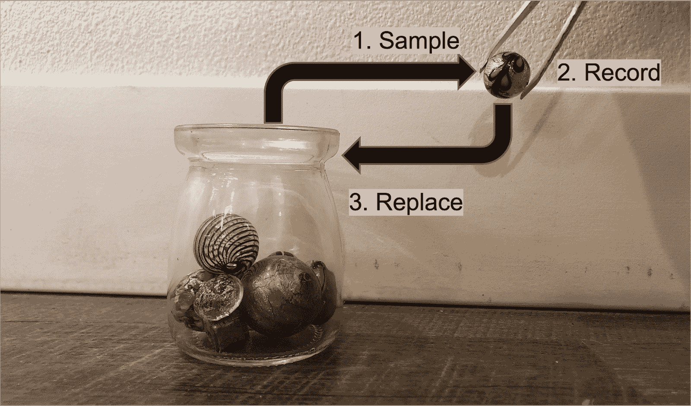

替换抽样程序。图片由 Michael Galarnyk 提供

### 出袋（OOB）分数

由于大约 36.8%的训练数据被排除在任何给定树之外，你可以使用这部分保留数据来评估该树的预测。Scikit-learn 通过设置 oob_score=True 参数允许这样做，提供了一种高效估计泛化误差的方法。你将在教程后面的训练示例中看到这个参数的使用。

## 在 Scikit-Learn 中训练和调整随机森林

由于其简单性、可解释性和能够[并行化](https://www.anyscale.com/blog/how-to-speed-up-scikit-learn-model-training)的能力（因为每棵树都是独立训练的），随机森林在表格数据中仍然是一个强大的基线。本节演示了如何加载数据，[执行训练测试分割](https://youtu.be/rCevxk3jeKs?si=SCzxap0-l3vBSrvM)，训练基线模型，使用网格搜索调整超参数，并在测试集上评估最终模型。

### 第 1 步：训练基线模型

在调整之前，使用合理的默认值训练基线模型是一个好的做法。这让你对性能有一个初步的了解，并允许你使用袋外（OOB）分数来验证泛化能力，这是袋装模型（如随机森林）内置的。本例使用的是金县房屋销售数据集（CCO 1.0 通用许可），该数据集包含 2014 年 5 月至 2015 年 5 月之间的西雅图地区房产销售数据。这种方法允许我们在调整后保留测试集进行最终评估。

```py
# Import libraries

# Some imports are only used later in the tutorial
import matplotlib.pyplot as plt

import numpy as np

import pandas as pd

# Dataset: Breast Cancer Wisconsin (Diagnostic)
# Source: UCI Machine Learning Repository
# License: CC BY 4.0
from sklearn.datasets import load_breast_cancer

from sklearn.ensemble import RandomForestClassifier

from sklearn.ensemble import RandomForestRegressor

from sklearn.inspection import permutation_importance

from sklearn.model_selection import GridSearchCV, train_test_split

from sklearn import tree

# Load dataset
# Dataset: House Sales in King County (May 2014–May 2015)
# License CC0 1.0 Universal
url = 'https://raw.githubusercontent.com/mGalarnyk/Tutorial_Data/master/King_County/kingCountyHouseData.csv'

df = pd.read_csv(url)

columns = ['bedrooms',

            'bathrooms',

            'sqft_living',

            'sqft_lot',

             'floors',

             'waterfront',

             'view',

             'condition',

             'grade',

             'sqft_above',

             'sqft_basement',

             'yr_built',

             'yr_renovated',

             'lat',

             'long',

             'sqft_living15',

             'sqft_lot15',

             'price']

df = df[columns]

# Define features and target

X = df.drop(columns='price')

y = df['price']

# Train/test split

X_train, X_test, y_train, y_test = train_test_split(X, y, random_state=0)

# Train baseline Random Forest

reg = RandomForestRegressor(

    n_estimators=100,        # number of trees

    max_features=1/3,        # fraction of features considered at each split

    oob_score=True,          # enables out-of-bag evaluation

    random_state=0

)

reg.fit(X_train, y_train)

# Evaluate baseline performance using OOB score

print(f"Baseline OOB score: {reg.oob_score_:.3f}")
```

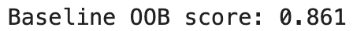

### 第 2 步：使用网格搜索调整超参数

虽然基线模型提供了一个强大的起点，但通过调整关键超参数通常可以提高性能。`GridSearchCV`实现的网格搜索交叉验证系统地探索超参数的组合，并使用交叉验证评估每个组合，选择具有最高验证性能的配置。最常调整的超参数包括：

+   `n_estimators`：森林中决策树的数量。更多的树可以提高准确性，但会增加训练时间。

+   `max_features`：在寻找最佳分割时考虑的特征数量。较低的值可以减少树之间的相关性。

+   `max_depth`：每棵树的最大深度。较浅的树更快，但可能欠拟合。

+   `min_samples_split`：分割内部节点所需的最小样本数。较高的值可以减少过拟合。

+   `min_samples_leaf`：达到叶节点所需的最小样本数。有助于控制树的大小。

+   `bootstrap`：在构建树时是否使用自助样本。如果为 False，则使用整个数据集。

```py
param_grid = {

    'n_estimators': [100],

    'max_features': ['sqrt', 'log2', None],

    'max_depth': [None, 5, 10, 20],

    'min_samples_split': [2, 5],

    'min_samples_leaf': [1, 2]

}

# Initialize model

rf = RandomForestRegressor(random_state=0, oob_score=True)

grid_search = GridSearchCV(

    estimator=rf,

    param_grid=param_grid,

    cv=5,             # 5-fold cross-validation

    scoring='r2',     # evaluation metric

    n_jobs=-1         # use all available CPU cores

)

grid_search.fit(X_train, y_train)

print(f"Best parameters: {grid_search.best_params_}")

print(f"Best R² score: {grid_search.best_score_:.3f}")
```

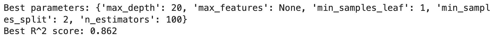

### 第 3 步：在测试集上评估最终模型

现在我们已经根据交叉验证选择了最佳性能的模型，我们可以在保留的测试集上评估它，以估计其泛化性能。

```py
# Evaluate final model on test set

best_model = grid_search.best_estimator_

print(f"Test R² score (final model): {best_model.score(X_test, y_test):.3f}")
```

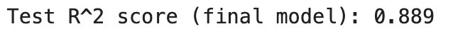

## 计算随机森林特征重要性

随机森林的一个关键优势是其可解释性——这是大型语言模型（LLMs）通常缺乏的。虽然 LLMs 功能强大，但它们通常作为黑盒运行，并且可能[表现出难以识别的偏见](https://youtu.be/2v18R02mq8I?si=oeJadtZT3ytFmTE8)。相比之下，scikit-learn 支持两种主要方法来衡量随机森林中的特征重要性：平均不纯度减少和置换重要性。

1). 平均不纯度减少（MDI）：也称为基尼重要性，这种方法计算了每个特征在所有树中带来的不纯度总减少。这是快速且通过`reg.feature_importances_`内置到模型中的。然而，基于不纯度的特征重要性可能会误导，特别是对于具有高基数（许多唯一值）的特征，因为这些特征更有可能被选择，仅仅是因为它们提供了更多的潜在分割点。

```py
importances = reg.feature_importances_

feature_names = X.columns

sorted_idx = np.argsort(importances)[::-1]

for i in sorted_idx:

    print(f"{feature_names[i]}: {importances[i]:.3f}")
```

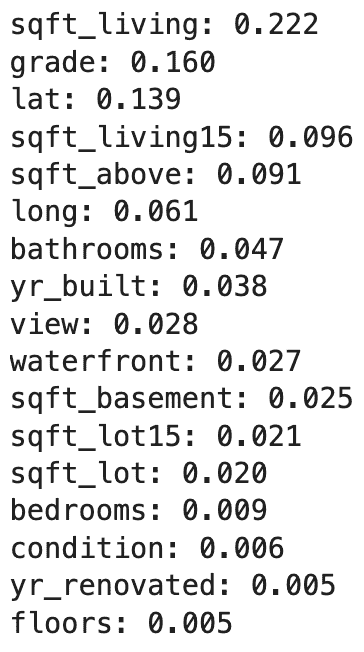

2). 置换重要性：这种方法评估当单个特征的值随机打乱时模型性能的下降。与 MDI 不同，它考虑了特征交互和相关性。它更可靠，但计算成本也更高。

```py
# Perform permutation importance on the test set

perm_importance = permutation_importance(reg, X_test, y_test, n_repeats=10, random_state=0)

sorted_idx = perm_importance.importances_mean.argsort()[::-1]

for i in sorted_idx:

    print(f"{X.columns[i]}: {perm_importance.importances_mean[i]:.3f}")
```

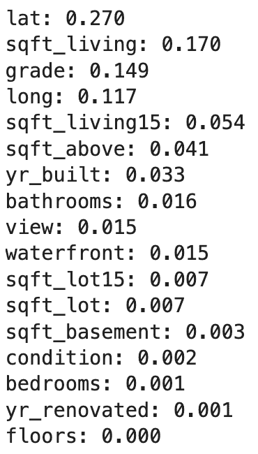

重要的是要注意，我们的地理特征经纬度在可视化方面也非常有用，如下面的图所示。公司如 Zillow 可能在其估值模型中广泛利用位置信息。

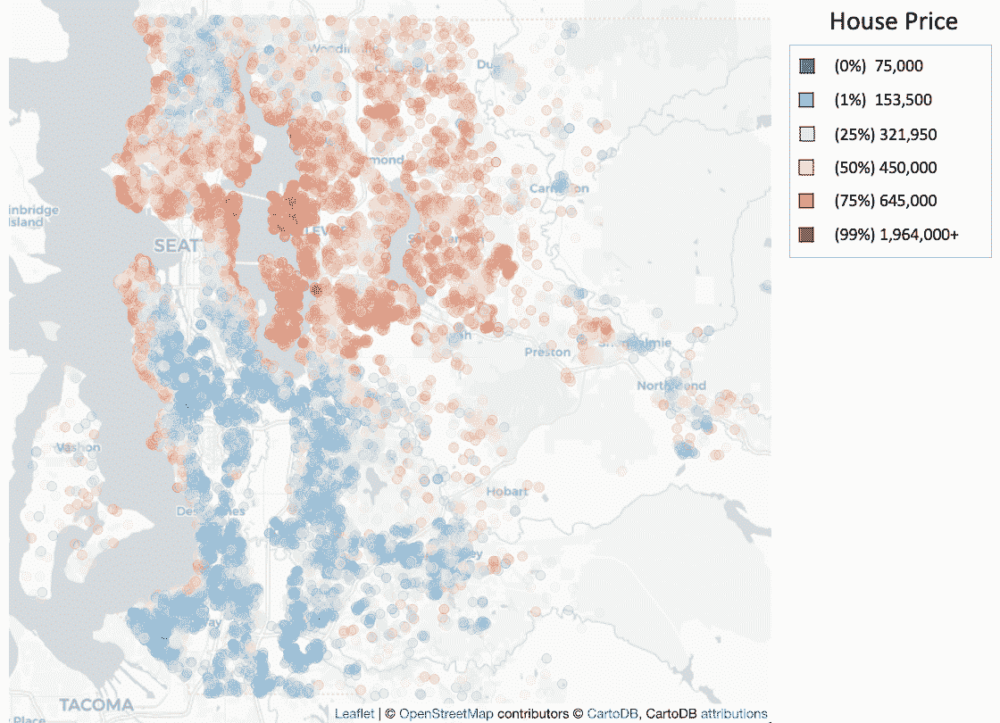

金郡的房价百分位数。图片由 Michael Galarnyk 提供。

## 在随机森林中可视化单个决策树

随机森林由多个决策树组成——每个估计器对应一个通过`n_estimators`参数指定的决策树。在训练模型后，您可以通过`.estimators_`属性访问这些单个树。可视化这些树中的几个可以帮助说明每个树如何由于自助训练样本和每个分割处的随机特征选择而以不同的方式分割数据。虽然早期示例使用了 RandomForestRegressor，但这里我们使用在威斯康星州乳腺癌数据集（CC BY 4.0 许可）上训练的 RandomForestClassifier 进行可视化，以突出随机森林在回归和分类任务中的多功能性。[此简短视频](https://www.youtube.com/embed/X8UeOrsUKQ4)展示了来自此数据集的 100 个训练估计器的样子。

### 使用 Scikit-Learn 拟合随机森林模型

```py
# Load the Breast Cancer (Diagnostic) Dataset

data = load_breast_cancer()

df = pd.DataFrame(data.data, columns=data.feature_names)

df['target'] = data.target

# Arrange Data into Features Matrix and Target Vector

X = df.loc[:, df.columns != 'target']

y = df.loc[:, 'target'].values

# Split the data into training and testing sets

X_train, X_test, Y_train, Y_test = train_test_split(X, y, random_state=0)

# Random Forests in `scikit-learn` (with N = 100)

rf = RandomForestClassifier(n_estimators=100,

                            random_state=0)

rf.fit(X_train, Y_train)
```

### 使用 Matplotlib 从随机森林中绘制单个估计器（决策树）

您现在可以查看拟合模型中的所有单个树。

`rf.estimators_`

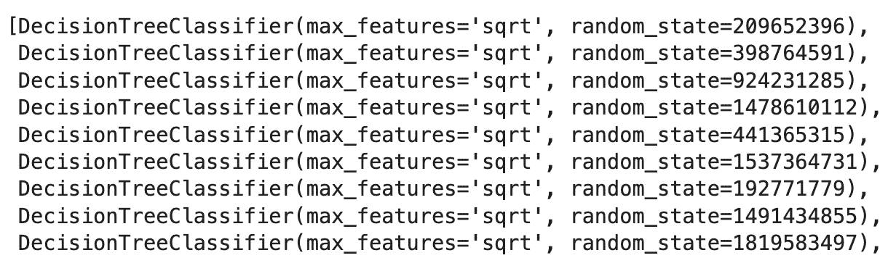

您现在可以可视化单个树。下面的代码可视化了第一个决策树。

```py
fn=data.feature_names

cn=data.target_names

fig, axes = plt.subplots(nrows = 1,ncols = 1,figsize = (4,4), dpi=800)

tree.plot_tree(rf.estimators_[0],

               feature_names = fn, 

               class_names=cn,

               filled = True);

fig.savefig('rf_individualtree.png')
```

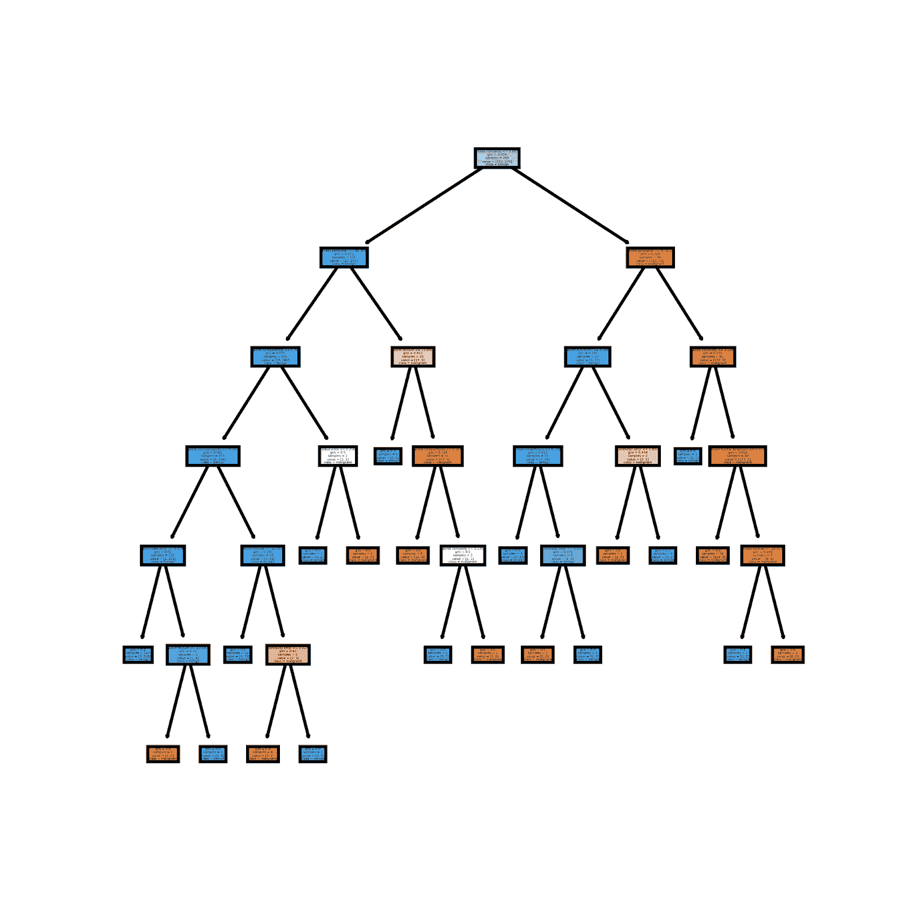

虽然绘制许多树可能难以解释，但您可能希望探索估计器之间的多样性。以下示例展示了如何可视化森林中的前五个决策树：

```py
# This may not the best way to view each estimator as it is small

fig, axes = plt.subplots(nrows=1, ncols=5, figsize=(10, 2), dpi=3000)

for index in range(5):

    tree.plot_tree(rf.estimators_[index],

                   feature_names=fn,

                   class_names=cn,

                   filled=True,

                   ax=axes[index])

    axes[index].set_title(f'Estimator: {index}', fontsize=11)

fig.savefig('rf_5trees.png')
```

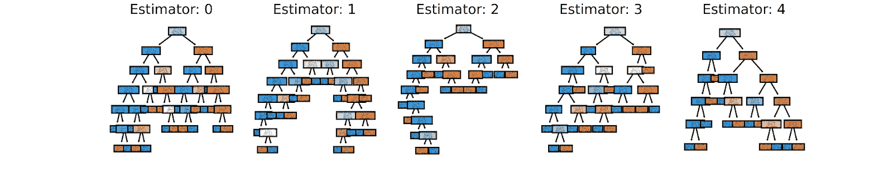

## 结论

随机森林由多个决策树组成，这些决策树是在通过自助法（bootstrapped）的数据上训练的，以实现比任何单个决策树更好的预测性能。如果您对教程有任何疑问或想法，请随时通过[YouTube](https://youtu.be/R9tJeEgHyeo?si=_TD53gsapwTk3VLk)或[X](https://twitter.com/GalarnykMichael)联系我。
