# 理解 ChatGPT 的演变：第三部分- Codex 和 InstructGPT 的见解

> 原文：[`towardsdatascience.com/understanding-the-evolution-of-chatgpt-part-3-insights-from-codex-and-instructgpt-04ece2967bf7/`](https://towardsdatascience.com/understanding-the-evolution-of-chatgpt-part-3-insights-from-codex-and-instructgpt-04ece2967bf7/)


（图片来自[Unsplash](https://www.istockphoto.com/photo/success-transformation-gm1417761158-464748077)）

这是我们的 GPT 系列文章中的第三篇，也是最具实用性的：最后，我们将讨论如何有效地微调 LLM。

它是**实用的**，因为如果你今天被要求训练自己的 LLM，你可以跳过预训练，直接使用开源 LLM 或 SLM；然而，你很可能仍然需要在自己的数据和任务上对其进行一些微调，这正是本文可以提供帮助的地方。

更具体地说，我们将关注两个微调模型——Codex 和 InstructGPT，因为它们代表了解决 LLM 微调中的两种类型挑战：

+   Codex 需要将预训练的 LLM 适应到不同的模态（代码脚本），因为编程语言与自然语言相比具有许多独特的特征；

+   InstructGPT 旨在使模型更符合人类偏好，这不能通过传统的语言建模目标自动实现。

正如我们稍后将会看到的，这两个挑战在微调过程的每个阶段都需要创造力和谨慎：如何收集高质量数据，如何修改模型架构，如何有效地初始化模型，如何确定合适的目标，以及如何恰当地评估它。

下面是本文的提纲：

+   **概述**：为什么我们需要微调以及它为什么如此具有挑战性；GPT3.5 及其微调版本。

+   **Codex**：如何恰当地评估代码生成，如何收集数据以及如何使模型适应处理编程语言。

+   **InstructGPT 和 ChatGPT**：如何评估一致性，为什么 RLHF 有效，以及它在 InstructGPT 中的实现方式。

+   **摘要：** LLM 微调的最佳实践。

下面是链接到我们之前的文章，如果你感兴趣的话：

+   [第一部分：深入探讨 GPT-1 及其灵感来源](https://medium.com/towards-data-science/understanding-the-evolution-of-gpt-part-1-an-in-depth-look-at-gpt-1-and-what-inspired-it-b7388a32e87d)：其中我们涵盖了**预训练加微调**范式及其从计算机视觉到自然语言处理的演变，之前的预训练努力如**Word2Vec**和**GloVe**，**仅解码器 Transformers**，**自回归**与**自编码**语言模型，以及**GPT-1**的关键创新。

+   [第二部分：GPT-2 和 GPT-3](https://medium.com/towards-data-science/understanding-the-evolution-of-chatgpt-part-2-gpt-2-and-gpt-3-77a01ed934c5)：在这里，我们介绍了 GPT 模型是如何在“任务无关的预训练”哲学下，通过“规模假设”和“上下文学习”从 11.7 亿扩展到 175 亿的。

* * *

## 概述

正如我们在[我们的第二篇文章](https://medium.com/towards-data-science/understanding-the-evolution-of-chatgpt-part-2-gpt-2-and-gpt-3-77a01ed934c5)中解释的那样，GPT-2 和 GPT-3 都可以被视为 OpenAI 测试任务无关预训练潜力的实验。在这样做的同时，作者也提到了微调作为未来研究的一个有希望的领域，因为它可能有助于模型在某些任务上进一步提高其性能。

### 为什么需要微调？

原因有三。

第一个原因是当然的性能。预训练模型更像是多面手，可以合理地完成各种任务，但它们仍然可能难以战胜在特定任务上训练的专家。如果我们目标是拥有这样的专业模型来帮助我们完成一个非常具体的任务，那么微调肯定应该被考虑。

另一个原因是，尽管 GPT-3 模型在一般情况下很强大，但它们并不总是可靠地遵循人类指令，尤其是在这些指令变得复杂时。这是因为，正如作者在 InstructGPT 论文中解释的那样，预训练目标主要关注语言建模，如预测下一个标记，但这种能力无法转化为遵循指令。因此，需要一些特殊的微调策略。

由于与自回归语言建模单独不足以强制模型避免生成有害或偏见答案的相似原因，也存在对安全和伦理方面的担忧。针对这个问题，微调也可以使我们更好地控制生成过程。

### 微调挑战

从广义上讲，在微调大型语言模型（LLM）时存在两种类型的挑战：需要适应新的模态，以及需要将模型与人类偏好对齐。

以 Codex 为例，对于前者的情况，预训练模型需要应用于具有某些独特特性的不同模态，例如，处理代码脚本时，它需要理解特定编程语言的基本语法，处理静态和动态类型，甚至推断类型，并在像 Python 这样的语言中正确处理缩进。

后者的情况在某种程度上更为复杂，因为“对齐”本身是一个相当模糊且具有争议的概念，在我们真正朝着这个目标进行微调之前，它必须被更清晰地定义并转化为一系列可衡量的方面。此外，即使我们已经制定了对齐的定义，实现这个目标也是非同小可的，因为没有现成的训练目标可以直接与之相连。

此外，我们还需要收集高质量的特定领域训练数据，并重新思考评估过程，包括评估数据集以及要使用的评估指标。

在后面的章节中，我们将看到 Codex 和 InstructGPT 如何处理这些问题。特别是，我们将强调他们如何以创造性和细致入微的方式实施每一步，从中学到的东西可以帮助任何想要微调自己 LLM 的人。

### GPT-3.5

GPT-3.5 系列通常指的是在 GPT-3 上微调的模型系列，包括以下变体（见 [wiki](https://en.wikipedia.org/wiki/GPT-3#GPT-3.5)）：

+   code-davinvi-002：Codex 的一个版本。

+   text-davinci-002：从 GPT-3 到 InstructGPT 的过渡模型。

+   text-davinci-003：与 InstructGPT 更相似。

总体而言，GPT-3.5 可以被认为是经过微调的 GPT-3，具有增强的指令遵循能力、更好的生成质量和更好的可控性。它是 ChatGPT、Codex、Whisper 和 DALL-E2 的文本模型等几个其他模型的基础，这展示了在特定任务上有效微调 LLM 的潜力。

在接下来的章节中，我们将更深入地探讨 Codex 和 InstructGPT。我们不会涵盖它们微调过程的每一个细节，而是主要关注最能展示创造力和细致入微重要性的方面。

* * *

## Codex

[Codex](https://arxiv.org/pdf/2107.03374) 模型于 2021 年发布，专门用于 Python 代码编写。

下面是一些我们想要强调的方面。

### 代码生成评估

当构建一个新任务的模型时，首先想到的往往是如何恰当地评估这个任务。

这很重要，因为没有有效的评估协议，我们无法确定我们是否真的取得了进步，有时甚至无法首先识别我们当前模型中的差距。

在 Codex 的情况下，作者首先意识到，像 BLEU 分数这样的基于匹配的标准指标并不适合衡量代码生成性能。

如果你对 **BLEU 分数** 不熟悉：它被广泛用于评估文本生成任务，如机器翻译，通过比较重叠的短语并计算一个精确度分数，同时考虑文本长度以确保平衡。

然而，相同的编码问题可能使用不同的数据结构或算法来解决。例如，生成斐波那契序列可以通过自顶向下或自底向上的 DP 算法实现，从而产生非常不同的代码脚本：

```py
def fib_top_down(n, memo={}):
    if n in memo:
        return memo[n]
    if n <= 1:
        return n
    memo[n] = fib_top_down(n-1, memo) + fib_top_down(n-2, memo)
    return memo[n]

def fib_bottom_up(n):
    if n <= 1:
        return n
    dp = [0] * (n + 1)
    dp[0], dp[1] = 0, 1
    for i in range(2, n + 1):
        dp[i] = dp[i-1] + dp[i-2]
    return dp[n]
```

在这种情况下，如果我们使用 BLEU 分数来评估这两个解决方案与给定的参考解决方案，那么其中一个或两个解决方案的 BLEU 分数可能会非常低，尽管这两个解决方案都是正确的。

另一种方法是按照作者们所说的“**功能正确性**”来评估，例如 [Kulal 等人](https://arxiv.org/pdf/1906.04908)使用的 ***pass@k*** 指标，其中对于每个问题，我们将生成 ***k*** 个代码样本并测试它们，然后如果一个样本通过单元测试，就可以认为问题得到了解决。最后，报告解决问题的总比例。然而，正如作者们所指出的，由于这个过程中的随机性，使用这种定义计算 ***pass@k*** 将导致高方差，尤其是在 ***k*** 很小的时候。

为了缓解这个问题，作者们提出了另一种估计 ***pass@k*** 的方法：不是直接生成 k 个样本，而是为每个任务生成 n ≥ k 个样本。随着生成的样本和测试样本的增加，即使 k 很小，估计过程也将更加可靠。然后，基于正确样本的数量（假设有 c 个样本通过单元测试），可以估计一个无偏估计值，如下所示：

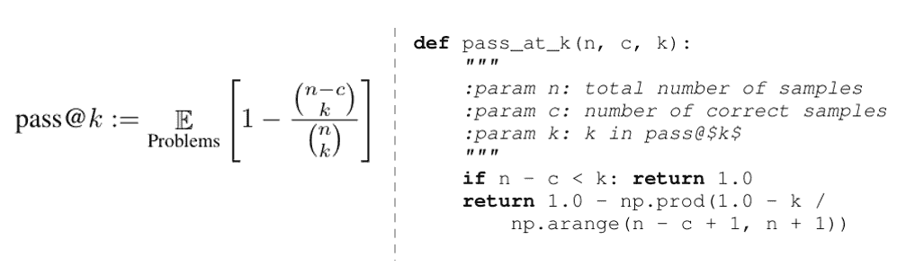

图 1. 左：优化的 pass@k 定义。右：计算 pass@k 的数值稳定脚本。（图片来自 [Codex 论文](https://arxiv.org/pdf/2107.03374)。）

其中

+   *C(n, k)* 是从 n 个样本中选择 k 个样本的方法数；

+   *C(n-c, k)* 是从 (n-c) 个错误样本中选择 k 个样本的方法数；

+   因此，*C(n-c, k)/C(n, k)* 表示所有选择的样本都是错误的概率；

+   最后，*1 – C(n-c, k)/C(n, k)* 表示至少有一个样本是正确的概率。

为了进一步证明优化 BLEU 分数与优化功能正确性不等价，作者们还绘制了 4 个随机编码问题的正确（蓝色）和错误（绿色）解决方案的 BLEU 分数密度，其中分布明显不可分离：

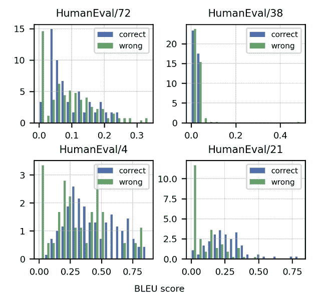

图 2. 4 个随机问题的正确（蓝色）和错误（绿色）解决方案的 BLEU 分数概率密度。（图片来自 [Codex 论文](https://arxiv.org/pdf/2107.03374)。）

除了优化评估指标之外，作者们还构建了一个名为 **HumanEval** 的新数据集，其中包含 164 个手写的编程问题。如下面的示例所示，每个问题包括一个函数签名、一个文档字符串、一个主体以及平均 7.7 个单元测试：

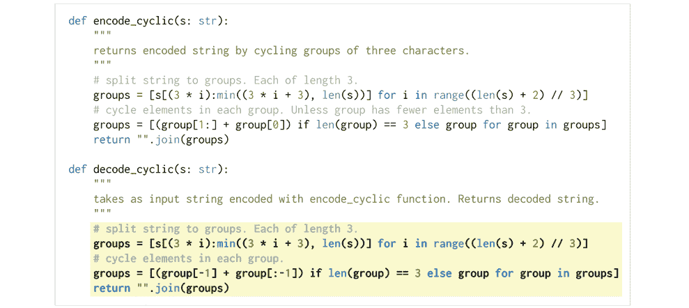

图 3. 来自 HumanEval 数据集的示例问题。（图片来自 [Codex 论文](https://arxiv.org/pdf/2107.03374)。）

注意，正如作者在论文中提到的，这些任务必须是手写的，否则评估问题时可能存在与训练问题重叠的情况。此外，为了确保测试过程不会因恶意代码而带来任何风险，作者还创建了一个沙盒来执行代码脚本。

### 训练数据收集

转到训练部分，第一个问题是如何收集高质量的训练数据。对于代码生成，好消息是我们可以利用 GitHub 上的大量代码仓库，但仍然需要一些数据清洗策略，正如论文中提到的：

> 我们过滤掉了可能自动生成的文件，平均行长度大于 100，最大行长度大于 1000，或者包含少量字母数字字符的文件。

注意，大多数这些清洗策略都是针对编程语言的，因此在我们自己清洗数据时可能需要想出其他主意。

### 微调适应

最重要的适应是分词器，因为很明显，GitHub 代码中单词的分布与自然语言的分布有很大不同。在 Codex 论文中，作者指出，这在**编码空白字符**时尤其如此，使得原始的 GPT-3 分词器效果较差。

为了解决这个问题，词汇表中添加了一组额外的标记，用于表示不同长度的空白字符序列。正如论文中提到的，这种简单的修改使得用 30%更少的标记来表示代码成为可能。

因此，如果我们的模型需要处理具有与自然语言不同分布的输入语料库，我们可能需要对分布进行研究，并对分词器进行一些修改。

### 评估发现

首先，下面的图显示了不同模型在 HumanEval 数据集上的通过率。总体而言，所有 Codex 变体与 GPT-3 相比都表现出显著更好的性能，其中

+   Codex（在代码上微调）解决了 28%的问题；

+   Codex-S（在独立函数上微调）解决了 37.7%的问题；

+   Codex-S 通过生成 100 个样本并选择具有最高平均对数概率的样本，解决了 44.5%的问题；

+   Codex-S 神经元选择通过单元测试的样本，解决了 77.5%的问题。

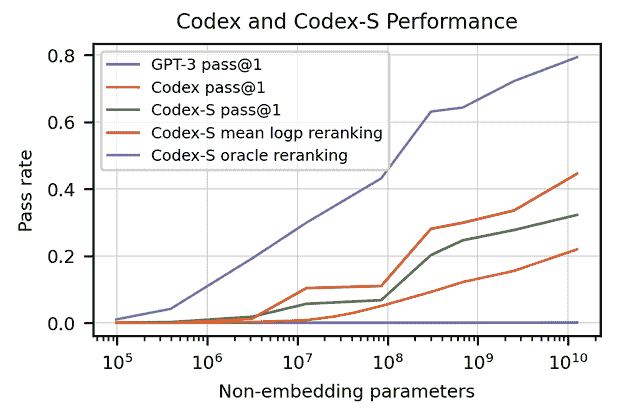

图 4\. Codex 通过率. (图片来自 [Codex 论文](https://arxiv.org/pdf/2107.03374).)

此外，还观察到类似于 GPT-3 的扩展定律，表明使用更大的模型可以获得更好的性能：

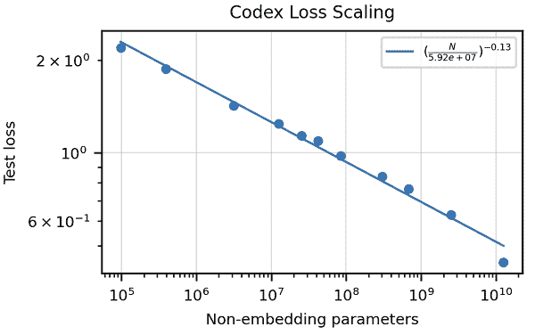

图 5\. 测试损失与参数数量对比. (图片来自 [Codex 论文](https://arxiv.org/pdf/2107.03374).)

作者还注意到，对于较大的 k，较高的温度更受欢迎，这突出了仔细调整超参数的重要性：

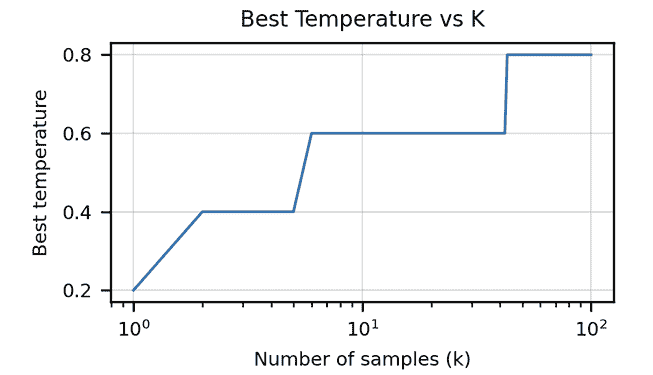

图 6. 对于较大的 k，较高的温度更受欢迎。（图片来自 [Codex 论文](https://arxiv.org/pdf/2107.03374).）

* * *

## InstructGPT 和 ChatGPT

### 对齐评估

如何正确评估“对齐”也是一个挑战，因为对齐的定义不像准确性等其他方面那样清晰。在这项工作中，作者将对齐定义为**如果模型是“有帮助、诚实和无害的”**，并将它们转换为更可衡量的属性**：**

+   **有帮助**：通过衡量模型是否能够**遵循指令**，甚至从少量提示中推断意图。

+   **诚实**：通过衡量真实性，或者用作者的话说，“如果模型关于世界的陈述是真实的”。更具体地说，他们建议通过 TruthfulQA 数据集上的**幻觉率**来衡量它。

+   **无害**：通过衡量“如果输出在客户助理的情境中不适当、贬低受保护群体或包含色情或暴力内容”，并在旨在衡量**偏差**和**毒性**的数据集上进行基准测试。

此外，为了确保微调过程不会对预训练性能造成严重退化，评估过程还需要反映预训练和微调目标的质量。因此，InstructGPT 在两个不同的数据集上进行了评估：

+   **API 分发评估**：这主要是为了评估微调质量，通过让人类标注员对哪些输出更受欢迎进行评分；

+   **公共 NLP 数据集评估**：这评估了预训练和微调质量，包括传统的 NLP 数据集以及用于评估模型安全性的数据集，如真实性、毒性和偏差。

接下来，我们将简要解释 RLHF 的工作原理以及它在 InstructGPT 中的实现方式。

### RLHF（基于人类反馈的强化学习）

下图展示了典型强化学习场景中的 5 个元素：

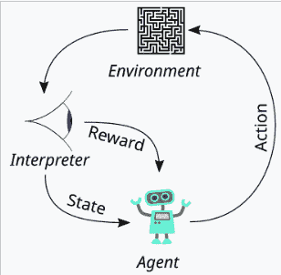

图 7. 强化学习中的五个元素：代理、环境、奖励、状态和动作。（图片来自 [wiki](https://en.wikipedia.org/wiki/Reinforcement_learning).）

现在想象你正在教你的小狗坐下，你可以找到所有 5 个元素：

+   **代理**：你的小狗在学习这个新命令“坐下”。

+   **环境**：围绕你的小狗的一切。

+   **状态**：你的小狗所处的情境（是否坐着）。

+   **奖励**：当你的小狗遵循你的命令时，你给它的奖励；

+   **动作**：你的小狗能做的事情，比如坐着、跳跃或吠叫。

强化学习是这样工作的：一开始你的狗（智能体）不明白“坐下”是什么意思，但它会在你的房子（环境）中尝试不同的动作，比如奔跑、坐下甚至吠叫。每次它坐下，它都会得到一份奖励。随着时间的推移，你的小狗学会坐下会得到奖励，看起来它终于明白了“坐下”的意思。

使用强化学习训练模型遵循一个非常相似的**试错**方法。强化学习的关键是有一个精心设计的奖励。这个奖励必须与目标紧密一致；否则，智能体将无法学习到期望的行为。同时，产生这样的奖励应该尽可能简单快捷，因为如果计算奖励太慢或太复杂，强化学习过程也会变得极其缓慢，使其在实用任务中变得不那么有用。

例如，在游戏中，智能体采取的每一个动作都会自动从环境中获得一个分数，而这个分数直接关联到智能体在玩游戏时的表现。

然而，在许多实际应用中，并没有现成的奖励可以使用，比如游戏中的得分。相反，研究人员必须付出巨大的努力来定义一个合适的奖励函数。此外，一些期望的行为很难转化为奖励函数——例如，如何定义一个奖励函数来指导智能体以更礼貌的方式回答问题？

这导致了**RLHF**：**从人类反馈中进行强化学习**。

在小狗训练的例子中，再次想象你的小狗最终学会了坐下，但有时它也会在坐下时吠叫，或者它会先跳上沙发而不是安静地坐在地上。

在这种情况下，你能做什么？

使用**RLHF**，你不必每次狗坐下就给它奖励。相反，你通过**比较**它的行为来给予奖励。例如，如果小狗安静地坐在地上，它会得到比它在吠叫或跳上沙发后坐下更大的奖励。这样，你的小狗就会学会安静地坐在地上更好，即使你没有明确解释“安静”是什么意思。

正如我们之前提到的，有一个简单快速的奖励是强化学习的关键，这使得在训练循环中涉及人类以提供直接反馈变得不切实际。为了克服这个问题，我们可以先收集一些人类反馈，然后使用这些反馈来学习一个奖励函数，以便在比较两个动作时模仿人类的偏好。

总结来说，RLHF 通常涉及三个阶段：

+   **收集人类反馈**：采样模型输出，并请人类裁判比较哪个更好。

+   **通过模仿人类裁判的偏好来学习奖励模型**。

+   **训练更好的策略**，在强化学习过程中使用学习到的奖励模型。

如果你不太熟悉强化学习术语：**策略**指的是智能体根据环境状态选择动作的策略。

接下来，我们将介绍如何将这种 RLHF 方法应用于微调 InstructGPT。

### InstructGPT 中 RLHF 的实现

[InstructGPT](https://arxiv.org/pdf/2203.02155) 和 [ChatGPT](https://openai.com/index/chatgpt/) 使用相同的模型进行训练（参见这篇[博客](https://openai.com/index/chatgpt/)），其中 RLHF 是微调的关键元素。

训练过程在很大程度上遵循我们在上一节中介绍的方法，特别关注数据质量和实施细节，在我看来，**这些与使 InstructGPT 取得如此成功同等重要**。

现在让我来分解一下。

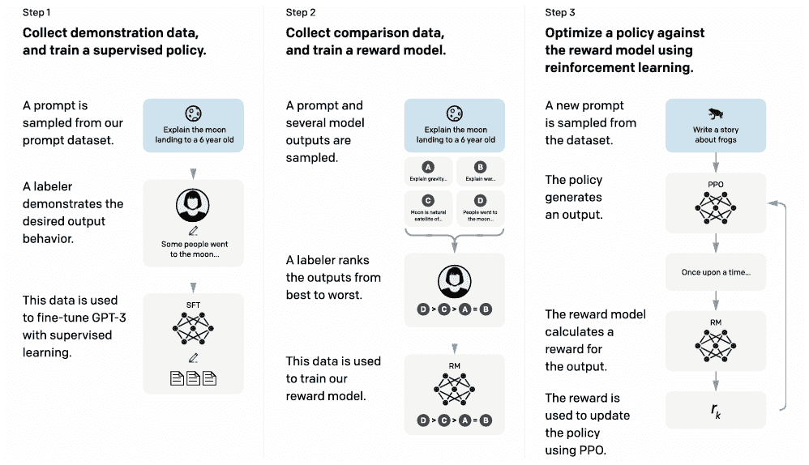

图 8. 训练 InstructGPT/ChatGPT 中 RLHF 步骤的示意图。（图片来自[InstructGPT 论文](https://arxiv.org/pdf/2203.02155)。）

**步骤 1：收集演示数据和训练监督策略**

在这一步，要求人类标注者为每个提示提供高质量的行为演示。

**提示数据集**：首先，你需要有一个提示数据集，从中你可以抽取单个提示，理想情况下，这个提示数据集应该既有用又多样化。

为了做到这一点，作者采取了一种迭代的方法：在最开始，要求标注者手动编写一些种子提示，然后使用这些数据通过监督学习训练一个模型。这个模型后来部署到 OpenAI API，以收集用户的文本提示，这些提示后来形成了提示数据集。

下表显示了此提示数据集的分布，因为多样性对于确保模型将在各种任务上进行训练非常重要：

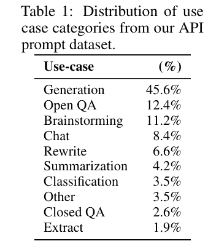

**人类数据收集**：在整个 RLHF 过程中，需要三个组成部分的人类数据，包括在步骤 1 中编写演示，在步骤 2 中提供比较数据，以及在微调后进行最终评估。

在论文中，作者提到了许多确保数据质量的实践：

+   首先，高质量的数据来自优秀的标注者。为了确保他们在数据标注方面的能力，进行了一次筛选测试，以选择那些“对不同人口群体的偏好敏感，并且擅长识别可能有害的输出”的标注者。

+   其次，为了确保所有标注者之间的一致性，建立了一个入职流程来培训所有标注者，并为每个任务提供了详细的说明。作者还提到，他们建立了一个共享聊天室来回答标注者的问题。

+   最后，为了看看模型如何泛化到不同标注者的偏好，雇佣了一个没有通过筛选测试的独立标注者团队进行评估。

基于这些人类演示数据，在第一步中，使用监督学习对预训练的 GPT-3 模型进行了微调。这个模型被称为基线策略，它将在步骤 2 中生成比较输出，并在步骤 3 中初始化 PPO 算法。

**步骤 2：收集比较数据并训练奖励模型**

**比较数据收集**：一旦基线策略可用，它就被用来为一些采样的提示生成输出，然后这些输出将由人类标注员从最好到最差进行审查和排名。为了加快排名过程，将同时向人类标注员展示一组 K 个输出，其中 K 的范围从 4 到 9。

**奖励模型训练**：奖励模型是从监督基线策略初始化的，通过移除最终的未嵌入层并在比较数据上训练。特别是，作者提到，将每个提示的所有比较作为一个单独的批次进行训练，而不是对比较进行洗牌，可以帮助减轻过拟合。它被训练为对输入-响应对分配标量分数，具有 60 亿个参数。请注意，在决定此奖励模型的大小时，我们需要寻求平衡：它需要足够大，以便准确模拟人类偏好，但它不能太大，因为它需要在 RL 过程中支持快速推理。

**步骤 3：使用 PPO 和奖励模型优化策略**

到目前为止，我们已经为使用 RLHF 微调模型准备好了所有东西：初始策略和奖励模型。这一步的训练遵循典型的 RL 过程：在每个回合中，采样一个新的提示（“**状态**”），当前策略（“**智能体**”）将根据当前策略生成新的输出（模型的“**动作**”），然后奖励模型将根据输出计算一个奖励（“**奖励**”），根据这个奖励，策略将使用 PPO 进行更新。

如果你对**PPO**不熟悉，不要担心——它仅仅是一种旨在帮助智能体**缓慢**更新其策略的方法。

这里有一些需要提及的事项：

+   在每个标记处添加了按标记的 KL 惩罚，以减轻奖励模型的过度优化。

+   作者进一步实验了将预训练梯度与 PPO 梯度混合，以修复在公共 NLP 数据集上的性能回归（这种回归通常被称为“**对齐税**”），这被称为“PPO-ptx”。在这篇论文中，**InstructGPT**实际上指的是 PPO-ptx 模型。

注意，步骤 2 和步骤 3 可以持续迭代：

+   使用更新后的策略（从步骤 3 开始），我们可以生成新的输出并收集更多的比较数据，这些数据可以通过重复步骤 2 来训练一个新的奖励模型；

+   使用新的奖励模型（从步骤 2 开始），我们可以通过重复步骤 3 来获得更好的策略。

### 评估中的发现

由于篇幅限制，我们不会在这篇文章中详细介绍所有评估结果，而是只突出几个新的发现。

也许是最重要的发现，结果显示**RLHF 确实可以改善一致性**。下方的图显示了由人类评委评估的，与监督的 175B GPT3 模型的胜率。根据此图，PPO 和 PPO-ptx 在 GPT 基线模型上都有显著超越，即使是 1.3B PPO 模型也比 175B GPT-3 更好。这一结果清楚地证明了 RLHF 的有效性。

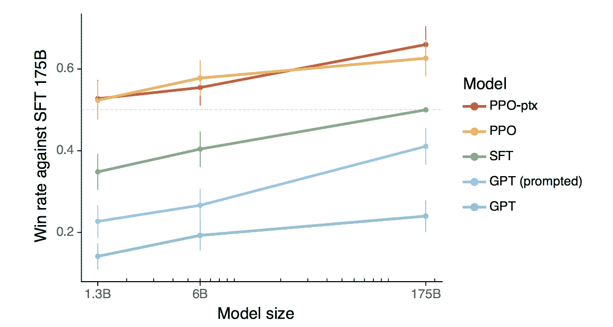

图 9. 人类评估结果。（图片来自[InstructGPT 论文](https://arxiv.org/pdf/2203.02155)。）

作者还发现，InstructGPT 在**真实性方面有所提高**（幻觉率从 41%降至 21%），**在毒性方面略有改善**（毒性输出减少 25%），但在**减少偏见方面没有显著改善**。

另一个发现是，PPO-ptx 可以在公共 NLP 数据集上最小化性能退化，如图下所示。

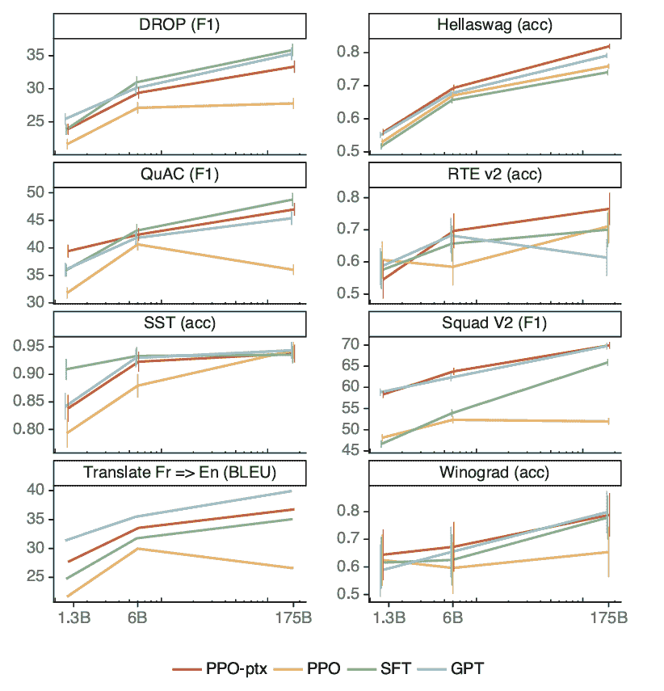

图 10. 公共 NLP 数据集上的少样本性能。（图片来自[InstructGPT 论文](https://arxiv.org/pdf/2203.02155)。）

## 摘要

训练 LLM 通常涉及多个阶段，如预训练、监督微调和 RLHF 的校准。对于我们的任务，我们通常可以从一个开源的预训练 LLM 开始，并在特定领域的数据上进行微调。

在微调自己的 LLMs 时需要询问的一些问题（尽管这并不是一个详尽的列表）：

+   我们对模型期望的行为有明确的定义吗？我们如何评估这些行为？如果没有可用的指标，我们可以自己创建一个吗？

+   我们是否有可用的训练数据？如果没有，我们如何自己收集这样的数据？如果需要人工标注员，如何确保他们的标注质量？

+   我们需要什么样的清理或预处理？我们可以使用哪些启发式方法来检查数据质量？

+   我们的数据是否涵盖了广泛的场景？

+   我们需要修改我们的分词器吗？我们需要修改模型结构吗？我们需要添加辅助微调目标吗？

+   微调会导致预训练性能下降吗？我们可以寻求平衡吗？

+   微调会导致一些意外的负面行为吗？我们如何减轻这种情况？

+   如何在微调过程中防止过拟合？

+   我们可以在微调或评估期间调整哪些超参数？我们可以利用哪些启发式方法？

最后，探索新的任务总是既具有挑战性又令人兴奋，我希望这篇文章的收获可以帮助使它更具挑战性，更令人兴奋，并最终更加愉快 🙂

感谢您的阅读！
