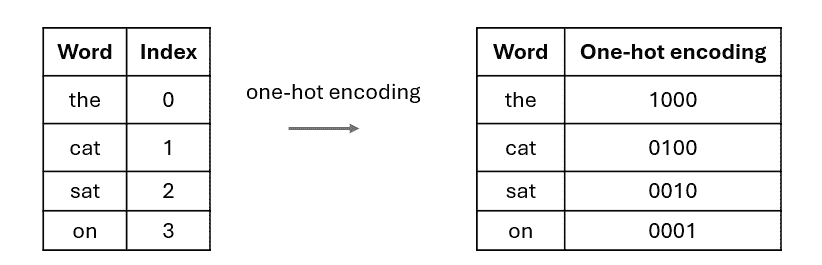
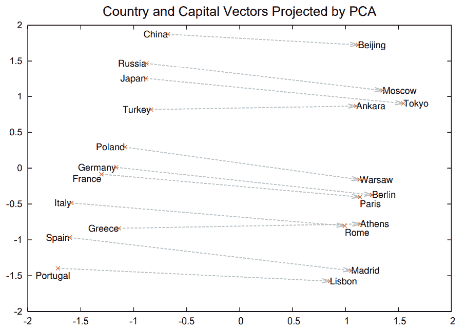
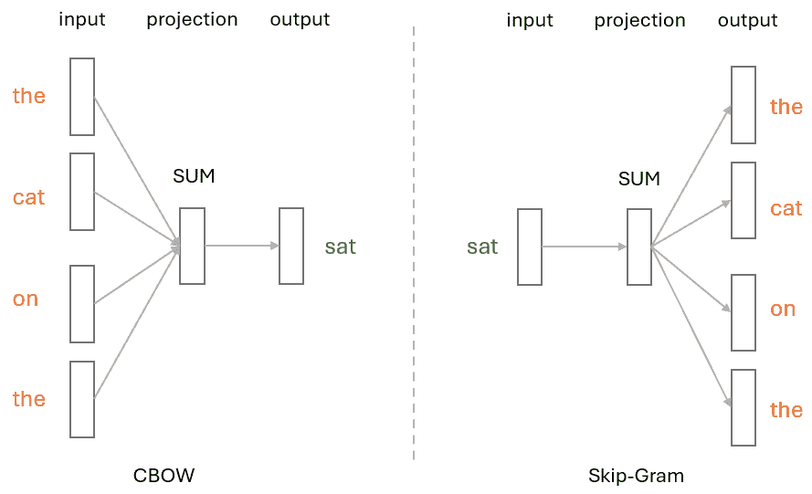
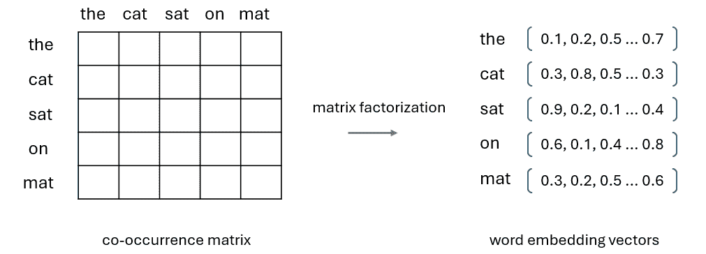
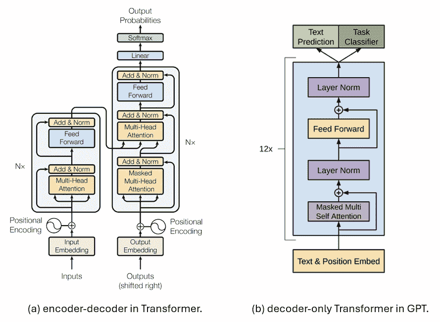
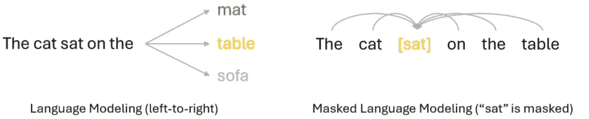
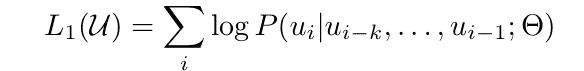
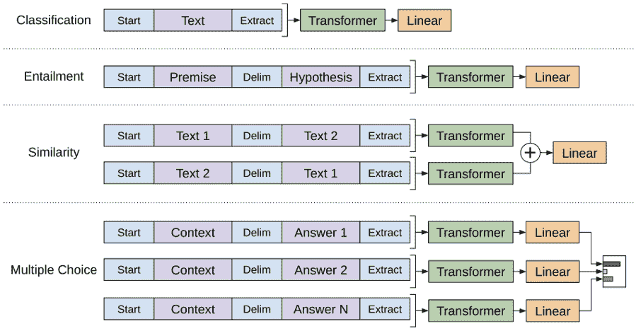

# 理解 ChatGPT 的演变：第一部分-深入探讨 GPT-1 及其灵感来源

> 原文：[`towardsdatascience.com/understanding-the-evolution-of-gpt-part-1-an-in-depth-look-at-gpt-1-and-what-inspired-it-b7388a32e87d/`](https://towardsdatascience.com/understanding-the-evolution-of-gpt-part-1-an-in-depth-look-at-gpt-1-and-what-inspired-it-b7388a32e87d/)

（图片来自[Unsplash](https://www.istockphoto.com/photo/success-transformation-gm1417761158-464748077)）

GPT（生成预训练）模型系列，由 OpenAI 于 2018 年首次推出，是 Transformer 架构的重要应用之一。它随后通过 GPT-2、GPT-3 和 InstructGPT 等版本的发展，最终导致了 OpenAI 强大 LLM 的开发。

换句话说：理解 GPT 模型对于任何想要深入了解 LLM 世界的人来说都是至关重要的。

这是我们的 GPT 系列的第一部分，我们将尝试探讨 GPT-1 的核心概念以及启发它的先前工作。

以下链接是本 GPT 系列的第二部分和第三部分，如果您感兴趣的话：

+   [第二部分：GPT-2 和 GPT-3](https://medium.com/towards-data-science/understanding-the-evolution-of-chatgpt-part-2-gpt-2-and-gpt-3-77a01ed934c5)

+   [第三部分：从 Codex 和 InstructGPT 中获得见解](https://medium.com/towards-data-science/understanding-the-evolution-of-chatgpt-part-3-insights-from-codex-and-instructgpt-04ece2967bf7)

以下是我们将在本文中涵盖的主题：

GPT-1 之前：

+   预训练和微调范式：从 CV 到 NLP 的旅程。

+   原先的工作：Word2vec、GloVe 以及其他使用 LM 进行预训练的方法。

+   仅解码器的 Transformer。

+   自回归语言模型与自编码语言模型。

GPT-1 的核心概念：

+   关键创新。

+   预训练。

+   微调。

* * *

## GPT-1 之前

### 预训练和微调

预训练+微调范式，最初在计算机视觉中流行，指的是使用两个阶段来训练模型的过程：预训练然后微调。

在**预训练**阶段，模型在相关的下游任务的大型数据集上进行训练。在计算机视觉中，这通常是通过在 ImageNet 上学习图像分类模型来完成的，其最常用的子集 ILSVR 包含 1K 个类别，每个类别有 1K 张图片。

> 尽管按今天的标准，100 万张图片听起来并不像“大规模”，但在十年前 ILSVR 确实非常出色，并且确实比我们为特定 CV 任务所能拥有的数据集大得多。
> 
> 此外，计算机视觉社区也探索了许多方法来消除监督预训练，例如**[MoCo](https://arxiv.org/pdf/1911.05722)**（由 Kaiming He 等人提出）和**[SimCLR](https://arxiv.org/pdf/2002.05709)**（由 Ting Chen 等人提出）等。

预训练后，假设模型已经学习了一些关于任务的通用知识，这可以加速下游任务的学习过程。

然后是**微调**：在这个阶段，模型将在一个具有高质量标记数据的特定下游任务上进行训练，通常比 ImageNet 规模小得多。在这个阶段，模型将获得一些与当前任务相关的特定领域知识，这有助于提高其性能。

对于许多计算机视觉任务，这种**预训练+微调**范式与直接在有限的特定任务数据上从头开始训练相同的模型相比，表现出更好的性能，尤其是在模型复杂且更有可能在有限的训练数据上过拟合的情况下。结合现代 CNN 网络如 ResNet，这导致了许多计算机视觉基准测试中的性能飞跃，其中一些甚至达到了接近人类的表现。

因此，一个自然的问题出现了：我们如何在 NLP 中复制这样的成功？

### GPT-1 之前的预训练探索

实际上，NLP 社区从未停止在这一方向上的尝试，其中一些努力可以追溯到 2013 年，例如**[Word2Vec](https://arxiv.org/pdf/1310.4546)**和**[GloVe](https://aclanthology.org/D14-1162.pdf)**（全球向量表示单词）。

**Word2Vec**

> Word2Vec 论文“**单词和短语的分布式表示及其组合性**”在 NeurIPS 2023 上荣获“时间考验”奖项。对于不熟悉这项工作的人来说，这是一篇必读之作。

今天将单词或标记表示为嵌入向量似乎很自然，但在 Word2Vec 出现之前并非如此。那时，单词通常由**独热编码**或一些基于计数的统计方法表示，例如**TF-IDF**（词频-逆文档频率）或**共现矩阵**。

例如，在独热编码中，给定一个大小为 N 的词汇表，这个词汇表中的每个单词都将被分配一个索引 i，然后它将被表示为一个长度为 N 的稀疏向量，其中只有第 i 个元素被设置为 1。

以以下案例为例：在这个玩具词汇中，我们只有四个单词：the（索引 0），cat（索引 1），sat（索引 2）和 on（索引 3），因此每个单词都将表示为一个长度为 4 的稀疏向量（the ->1000，cat -> 0100，sat -> 0010，on -> 0001）。

图 1. 使用 4 个单词的玩具词汇的独热编码示例。（图片由作者提供）

这种简单方法的缺点是，随着词汇在现实世界案例中越来越大，独热向量会变得极其长。此外，神经网络并未设计来高效地处理这些稀疏向量。

此外，在这次过程中，由于每个词的索引是随机分配的，因此相关词之间的语义关系将会丢失，意味着相似词在这个表示中没有联系。

通过这样，你现在可以更好地理解 Word2Vec 贡献的重要性：通过将词表示为高维空间中的连续向量，其中具有相似上下文的词具有相似的向量，它彻底改变了自然语言处理领域。

使用 Word2Vec，相关词将在嵌入空间中映射得更近。例如，在下面的图中，作者展示了某些国家和它们对应首都的词嵌入的 PCA 投影，Word2Vec 自动捕捉了它们的关系，而无需提供任何监督信息。

图 2. Word2Vec 对国家和首都向量的 PCA 投影。（图片来自 Word2Vec 论文）

Word2Vec 以无监督的方式进行学习，一旦学习到嵌入，它们就可以很容易地用于下游任务。这是探索自然语言处理中半监督学习的早期努力之一。

更具体地说，它可以利用**CBOW**（连续词袋）或**Skip-Gram**架构来学习词嵌入。

在 CBOW 中，模型试图根据其周围的词来预测目标词。例如，给定句子"The cat sat on the mat"，CBOW 将尝试根据上下文词"The"、"cat"、"on"、"the"来预测目标词"sat"。这种架构在目标是预测上下文中的一个单词时非常有效。

然而，Skip-Gram 的工作方式正好相反——它使用目标词来预测其周围的上下文词。以相同的句子为例，这次目标词"sat"成为输入，模型将尝试预测上下文词如"The"、"cat"、"on"和"the"。Skip-Gram 特别适用于通过利用它们出现的上下文来捕捉罕见词汇。

图 3. Word2Vec 中 CBOW 与 Skip-Gram 架构对比，其中"sat"是目标词。（图片由作者提供）

**GloVe**

沿着这条研究路线的另一个工作是 GloVe，它也是一种用于生成词嵌入的无监督方法。与专注于局部上下文的 Word2Vec 不同，GloVe 通过构建词共现矩阵并对其进行分解以获得密集的词向量来设计捕捉全局统计信息。

图 4. GloVe 中词嵌入生成的示意图。（图片由作者提供）

注意，Word2Vec 和 GloVe 主要可以转移词级信息，这在处理复杂的 NLP 任务时通常是不够的，因为我们需要在嵌入中捕捉高级语义。这导致了最近对 NLP 模型的无监督预训练的更多探索。

**无监督预训练**

在 GPT 出现之前，许多研究已经探索了不同目标的无监督预训练，例如语言模型、机器翻译和话语连贯性等。然而，每种方法仅在特定的下游任务上优于其他方法，而且什么优化目标最有效或最有用仍然不清楚。

你可能已经注意到，在早期的一些工作中，语言模型已经被探索作为训练目标，但为什么这些方法没有像 GPT 那样成功？

答案是 **Transformer** 模型。

当早期的工作被提出时，还没有 Transformer 模型，因此研究人员只能依赖 LSTM 等循环神经网络模型进行预训练。

这引出了下一个话题：GPT 中使用的 Transformer 架构。

### 仅解码器 Transformer

在 GPT 中，Transformer 架构是原始 Transformer 的一个修改版本，称为 [仅解码器 Transformer](https://arxiv.org/pdf/1801.10198)。这是 Google 在 2018 年提出的一个简化 Transformer 架构，它只包含解码器。

下面是原始 Transformer 中引入的编码器-解码器架构与 GPT 中使用的仅解码器 Transformer 架构的比较。基本上，仅解码器架构完全去除了编码器部分以及交叉注意力，从而导致了更简化的架构。

图 5\. [Transformer](https://arxiv.org/pdf/1706.03762) 中的编码器-解码器架构与 [GPT](https://cdn.openai.com/research-covers/language-unsupervised/language_understanding_paper.pdf) 中的仅解码器 Transformer 架构的比较。（图片来自 Transformer 和 GPT 论文）

**那么，只使用 Transformer 解码器有什么好处呢？**

与仅编码器模型如 BERT 相比，仅解码器模型在生成连贯且上下文相关的文本方面通常表现更好，这使得它们非常适合文本生成任务。

另一方面，像 BERT 这样的仅编码器模型，在需要理解输入数据的任务上通常表现更好，如文本分类、情感分析和命名实体识别等。

另一类模型同时使用编码器和解码器 Transformer，如 T5 和 BART，其中编码器处理输入，解码器根据编码表示生成输出。虽然这种设计使它们在处理广泛任务时更加灵活，但它们通常比仅编码器或仅解码器模型计算量更大。

简而言之，虽然两者都基于 Transformer 模型并试图利用预训练 + 微调方案，但 GPT 和 BERT 选择非常不同的方式来实现这一相似的目标。更具体地说，GPT 以**自回归**的方式进行预训练，而 BERT 采用**自编码**方法。

### 自回归语言模型与自编码语言模型

理解它们之间差异的一个简单方法是比较它们的训练目标。

在自回归语言模型中，训练目标通常是预测序列中的下一个标记，基于前面的标记。由于依赖于前面的标记，这通常导致单向（通常是左到右）的方法，正如我们在图 6 的左侧所示。

相比之下，自编码语言模型通常使用掩码语言模型或从损坏版本中重建整个输入等目标进行训练。这通常以双向方式进行，模型可以利用掩码周围的全部标记，换句话说，即左右两侧的标记。这如图 6 的右侧所示。

图 6. 自回归语言模型与自编码语言模型对比。（图片由作者提供）

简而言之，自回归语言模型更适合文本生成，但其单向建模方法可能限制其在理解完整上下文方面的能力。另一方面，自编码语言模型在上下文理解方面可以做得更好，但并未设计用于生成任务。

***

## GPT-1 的核心概念

### 关键创新

GPT-1 的大多数关键创新已在上述章节中介绍，因此我只需在此简要总结：

+   GPT-1 是第一个成功利用自回归语言建模作为无监督预训练任务的工作，使预训练 + 微调范式成为 NLP 任务的标准化程序。

+   与其依赖 RNN 和 LSTM 的先前工作不同，GPT-1 采用仅解码器 Transformer 架构，这提高了并行化和长距离依赖处理能力，从而带来了更好的性能。

### 无监督预训练

在 GPT 预训练中，使用标准的语言模型目标：

其中 k 是上下文窗口的大小，条件概率 P 使用仅解码器 Transformer 模型进行建模，其参数表示为 θ。

### 监督微调

一旦模型预训练完成，可以通过在特定下游任务的数据集上进行微调，使用适当的监督学习目标来适应特定的下游任务。

这里的问题之一是 GPT 需要一个连续的文本序列作为输入，而某些任务可能涉及多个输入序列。例如，在蕴涵任务中，我们既有前提也有假设，在某些问答任务中，我们可能需要处理三个不同的输入序列：文档、问题和答案。

为了使其更容易适应不同的任务，GPT 在微调阶段采用了一些特定任务的输入转换，如图下所示：

图 7.不同任务上的微调输入转换。（[图片来自 GPT 论文](https://cdn.openai.com/research-covers/language-unsupervised/language_understanding_paper.pdf)）

更具体地说，

+   对于**蕴涵**任务，前提和假设序列将连接成一个单独的序列，中间用分隔符标记。

+   对于**相似度**任务，由于句子没有固有的顺序，我们可以简单地通过交换两个输入序列来构建两个输入序列，获取它们的相应嵌入，然后以逐元素的方式将这些嵌入相加。

+   对于更复杂的**问答**和**常识推理**任务，在这些任务中我们通常被给出一个上下文文档、一个问题以及一组可能的答案，我们可以将文档上下文和问题与每个可能的答案（再次使用分隔符标记）连接起来，独立处理这些序列，然后使用 softmax 层来产生最终输出分布，覆盖所有可能的答案。

## 结论

在这篇文章中，我们回顾了启发 GPT-1 的关键技术，并强调了其主要创新。

这是我们的 GPT 系列的第一部分，在下一篇文章中，我们将回顾从 GPT-1 到 GPT-2、GPT-3 和 InstructGPT 的演变过程。

感谢阅读！
