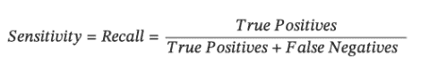
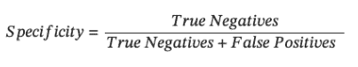
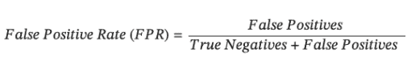
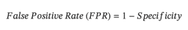
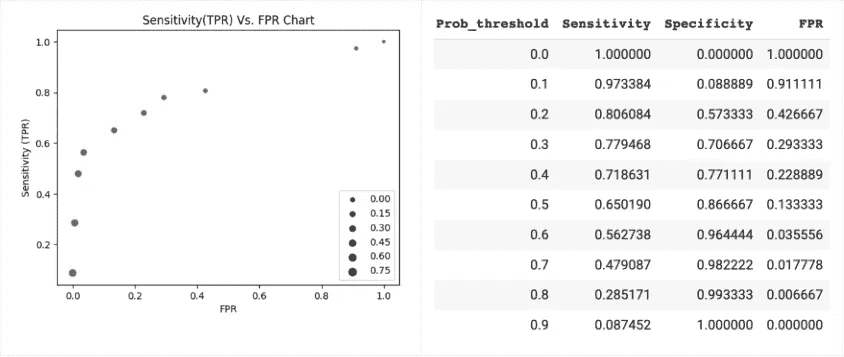
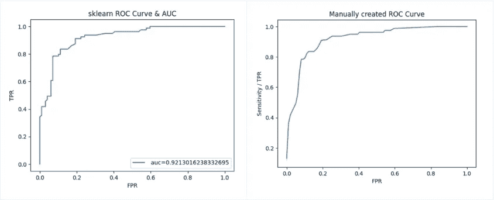
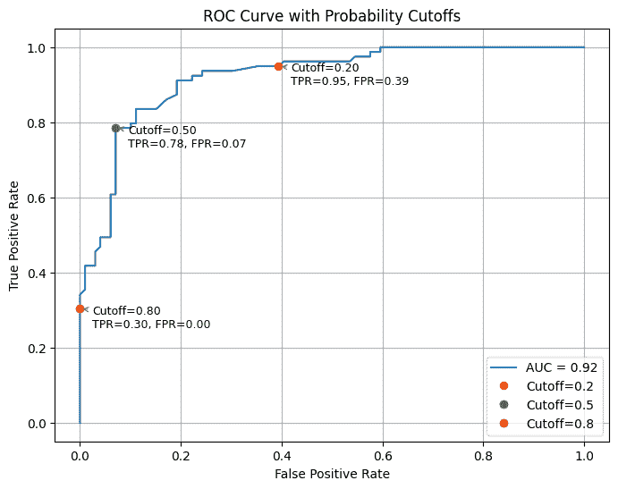
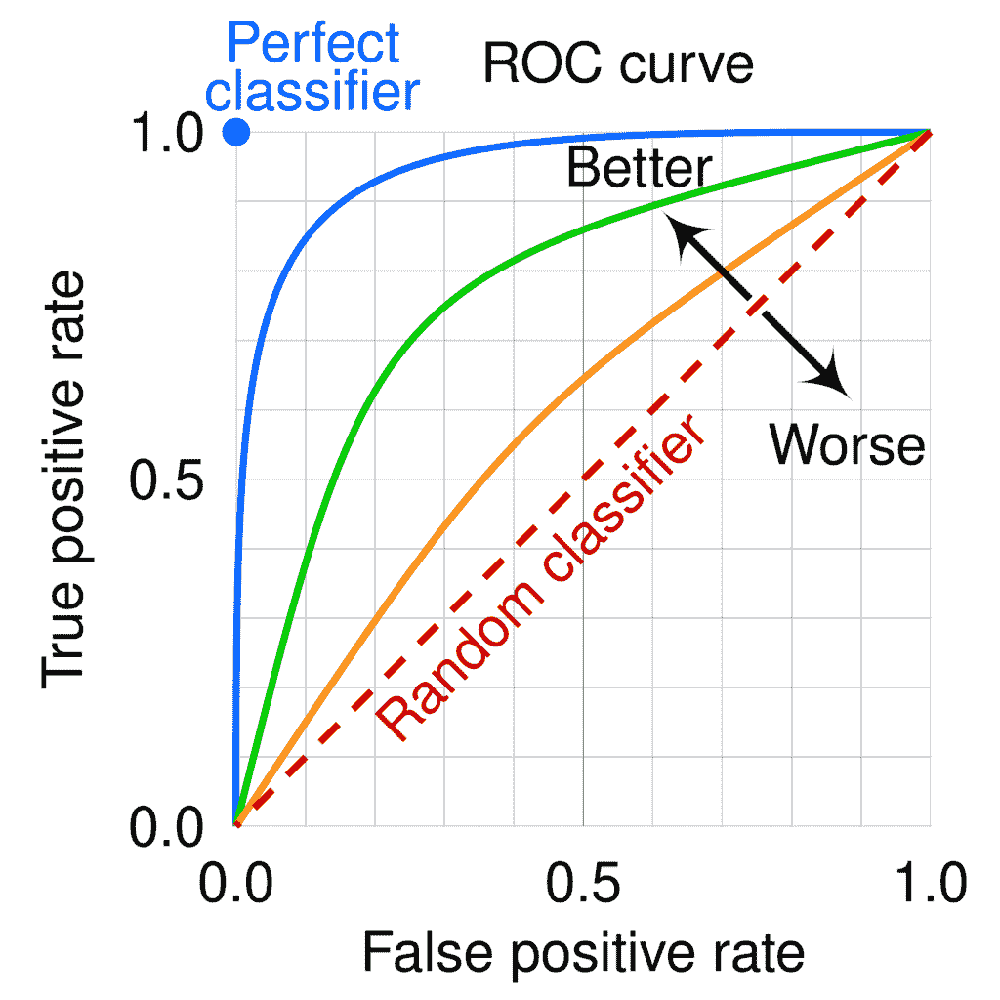
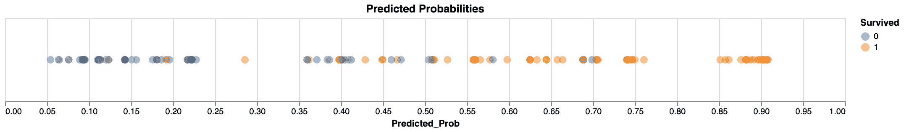
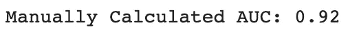

# 解锁 ROC 曲线的力量：更好的模型评估的直观洞察

> 原文：[`towardsdatascience.com/unlock-the-power-of-roc-curves-intuitive-insights-for-better-model-evaluation/`](https://towardsdatascience.com/unlock-the-power-of-roc-curves-intuitive-insights-for-better-model-evaluation/)

<mdspan datatext="el1744140846685" class="mdspan-comment">我们</mdspan>都经历过那个时刻，对吧？盯着图表，就像它是某种古老的脚本，想知道我们该如何理解这一切。这正是我最近在工作中被要求解释 ROC 曲线的 AUC 时感受到的。

虽然我对它背后的数学有很好的理解，但将其分解成简单、易消化的术语却是一项挑战。我意识到，如果我都在为此感到困难，其他人可能也是如此。因此，我决定写这篇文章，分享一种通过实际例子直观理解 AUC-ROC 曲线的方法。这里没有枯燥的定义——只有清晰、直接的解释，专注于直觉。

这里是本文使用的[code](https://github.com/Swpnilsp/ROC-AUC-Curve/blob/main/RoC_Curve_Analysis%20(2).ipynb)¹。

每个数据科学家都会经历评估分类模型的过程。在众多评估指标中，接收者操作特征（ROC）曲线和曲线下面积（AUC）是衡量模型性能不可或缺的工具。在这篇全面的文章中，我们将讨论基本概念，并使用我们熟悉的[Titanic 数据集](https://www.kaggle.com/competitions/titanic/data)²来展示它们的应用。

## **第一部分：ROC 曲线**

> *在本质上，ROC 曲线直观地描绘了模型在变化分类阈值下的敏感性和特异性的微妙平衡。*

要完全掌握 ROC 曲线，让我们深入探讨相关概念：

+   **灵敏度/召回率（真阳性率）：** 灵敏度量化模型正确识别正例的能力。在我们的泰坦尼克号例子中，灵敏度对应于模型准确地将实际生存案例标记为正例的比例。

+   **特异率（真阴性率）：** 特异率衡量模型正确识别负例的能力。对于我们的数据集，它表示模型正确地将实际非生存案例（生存 = 0）识别为负例的比例。

+   **假阳性率（FPR）：** FPR 衡量模型错误地将负例分类为正例的比例。

注意，特异性和 FPR 是相互补充的。特异性能专注于正确分类负例，而 FPR 专注于将负例错误分类为正例。因此-

现在我们已经了解了定义，让我们用一个例子来工作。对于泰坦尼克号数据集，我构建了一个简单的逻辑回归模型，用于预测乘客是否在船难中幸存，使用以下特征：*乘客等级、性别、船上的兄弟姐妹/配偶数量、乘客票价和登船港口。*请注意，该模型预测的是“生存概率”。sklearn 中逻辑回归的默认阈值为 0.5。然而，这个默认阈值可能并不总是适用于所解决的问题，我们需要调整概率阈值，即如果预测概率 > 阈值，实例被预测为阳性，否则为阴性。

现在，让我们重新审视上面提到的敏感性、特异性和 FPR 的定义。由于我们的预测二元分类依赖于概率阈值，对于给定的模型，这三个指标将根据我们使用的概率阈值而变化。如果我们使用更高的概率阈值，我们将把更少的案例分类为阳性，即我们的真正阳性将更少，从而导致较低的敏感性/召回率。更高的概率阈值也意味着更少的假阳性，因此 FPR 较低。因此，提高敏感性/召回率可能会导致 FPR 增加。

对于我们的训练数据，我们将使用 10 个不同的概率截止值，并计算敏感性/TPR 和 FPR，然后在下面的图表中绘制。注意，散点图中圆圈的大小对应于用于分类的概率阈值。

图表 1：DataFrame 中的 FPR 与 TPR 图表以及实际值（图片由作者提供）

好了，就是这样。我们上面创建的图表，展示了在各个概率阈值下敏感性（TPR）与 FPR 的关系，这就是 ROC 曲线！

在我们的实验中，我们使用了 10 个不同的概率截止值，增量为 0.1，给我们提供了 10 个观察值。如果我们使用更小的概率阈值增量，我们将得到更多的数据点，图表将看起来像我们熟悉的 ROC 曲线。

为了确认我们的理解，对于我们为预测乘客生存而构建的模型，我们将遍历各种预测概率阈值，并计算测试数据集的 TPR 和 FPR（见下面的代码片段）。在图表中绘制结果，并将此图表与使用 sklearn 的 `roc_curve` 函数绘制的 ROC 曲线进行比较。

图表 2：左侧为 sklearn ROC 曲线，右侧为手动创建的 ROC 曲线（图片由作者提供）

如我们所见，两条曲线几乎完全相同。注意 **AUC=0.92** 是使用 `roc_auc_score` 函数计算的。我们将在本文的后续部分讨论这个 AUC。

> **总结来说，ROC 曲线显示了模型在各个概率阈值下的 TPR 和 FPR。**请注意，图中**实际概率**并未显示，但可以假设曲线左下方的观测值对应于更高的概率阈值（低 TPR），而右上方的观测值对应于更低的概率阈值（高 TPR）。

为了可视化上述内容，请参考下方的图表，其中我尝试在不同概率阈值下标注了 TPR（真正例率）和 FPR（假正例率）。

图表 3：不同概率阈值下的 ROC 曲线（作者：[作者名]）

* * *

## **第二部分：AUC**

现在我们对 ROC 曲线有了某种直觉，下一步是理解**曲线下面积（AUC）**。但在深入具体细节之前，让我们思考一下完美分类器是什么样的。在理想情况下，我们希望模型能够完美地区分正例和负例。换句话说，模型对负例分配低概率，对正例分配高概率，没有重叠。因此，将存在某个概率阈值，使得所有预测概率小于该阈值的观测值都是负例，所有概率大于等于该阈值的观测值都是正例。当这种情况发生时，真正例率将是 1，假正例率将是 0。所以理想状态是 TPR=1 且 FPR=0。***在现实中，这种情况不会发生，更实际的期望是最大化 TPR 并最小化 FPR。***

通常情况下，随着概率阈值的降低，TPR 会增加，同时 FPR 也会增加（参见图表 1）。我们希望 TPR 远高于 FPR。这可以通过 ROC 曲线向左上方弯曲来表示。下面的 ROC 空间图显示了具有蓝色圆圈的完美分类器（TPR=1 且 FPR=0）。产生接近蓝色圆圈的 ROC 曲线的模型更好。***直观上，这意味着模型能够公平地分离负例和正例。***在下面的 ROC 曲线中，浅蓝色最佳，其次是绿色和橙色。虚线对角线代表随机猜测（想想抛硬币）。

图表 4：ROC 曲线比较 ([来源](https://en.wikipedia.org/wiki/Receiver_operating_characteristic)⁵)

现在我们已经了解了偏向左上方的 ROC 曲线更好，那么我们如何量化这一点呢？数学上，这可以通过计算曲线下面积（AUC）来实现。***ROC 曲线的曲线下面积（AUC）总是在 0 到 1 之间，因为我们的 ROC 空间在两个轴上都被限制在 0 到 1 之间。***在上述 ROC 曲线中，与浅蓝色 ROC 曲线对应的模型比绿色和橙色的模型更好，因为它具有更高的 AUC。

但 AUC 是如何计算的？从计算的角度来看，AUC 涉及到 ROC 曲线的积分。对于生成离散预测的模型，可以使用[梯形法则](https://en.wikipedia.org/wiki/Trapezoidal_rule)来近似 AUC。在它的最简单形式中，梯形法则通过将图形下的区域近似为梯形并计算其面积来工作。我可能会在另一篇文章中讨论这个问题。

这引出了最后一个也是最令人期待的环节——如何直观地理解 AUC？假设你构建了一个分类模型的第一个版本，其 AUC 为 0.7，后来你对模型进行了微调。改进后的模型 AUC 为 0.9。我们理解 AUC 值更高的模型更好。但它究竟意味着什么？它对我们的预测能力提升有何含义？为什么这很重要？嗯，有很多文献解释 AUC 及其解释。其中一些过于技术性，一些不完整，还有一些是完全错误的！对我最有意义的解释是：

> **AUC 是指随机选择的一个正例实例具有比随机选择的一个负例实例更高的预测概率的概率。**

让我们来验证这个解释。对于我们所构建的简单逻辑回归，我们将可视化正类和负类的预测概率（即是否幸存于海难）。

图表 5：幸存和未幸存乘客的预测概率（作者：本人）

我们可以看到模型在为幸存案例分配比未幸存案例更高的概率方面表现相当好。中间部分有一些概率的重叠。使用 sklearn 中的`auc score`函数在测试数据集上计算出的我们的模型的 AUC 是**0.92**（见图表 2）。所以根据上述 AUC 的解释，如果我们随机选择一个正例实例和一个负例实例，正例实例具有比负例实例更高的预测概率的概率应该是**~92%**。

为了这个目的，我们将创建正类和负类预测概率的池。现在我们从这两个池中随机选择一个观测值，并比较它们的预测概率。我们重复这个过程 100K 次。然后我们计算正例实例的预测概率大于负例实例预测概率的百分比。如果我们的解释是正确的，这应该等于<mdspan datatext="el1744084809114" class="mdspan-comment">AUC</mdspan>。

我们确实得到了 0.92！希望这有所帮助。

请告诉我你的评论，并且请随意在[LinkedIn](https://www.linkedin.com/in/swapnilsp/)上与我联系。

**注意**——这篇文章是我在 2023 年在 Medium 上写的[原始文章](https://medium.com/@swpnilsp/receiver-operator-curve-navigating-performance-metrics-exploring-roc-curves-and-auc-for-b1e42f7dc2b3)的修订版。

* * *

*参考文献:*

1.  [ROC-AUC 曲线分析](https://github.com/Swpnilsp/ROC-AUC-Curve/blob/main/RoC_Curve_Analysis%20(2).ipynb)

1.  [泰坦尼克号竞赛数据](https://www.kaggle.com/competitions/titanic/data) (许可-CC0: [公有领域](https://creativecommons.org/publicdomain/zero/1.0/))

1.  [scikit-learn 的 roc_curve 函数](https://scikit-learn.org/stable/modules/generated/sklearn.metrics.roc_curve.html#sklearn.metrics.roc_curve)

1.  [scikit-learn 的 roc_auc_score 函数](https://scikit-learn.org/stable/modules/generated/sklearn.metrics.roc_auc_score.html)

1.  [接收者操作特征](https://en.wikipedia.org/wiki/Receiver_operating_characteristic)

1.  [梯形法则](https://en.wikipedia.org/wiki/Trapezoidal_rule)
