# 使用 Gemini 解锁多模态视频转录

> 原文：[`towardsdatascience.com/unlocking-multimodal-video-transcription-with-gemini/`](https://towardsdatascience.com/unlocking-multimodal-video-transcription-with-gemini/)

* * *

*在开始之前，请快速了解一下：*

+   *我是谷歌云的一名开发者。我很高兴分享这篇文章，希望你能学到一些东西。观点和意见完全是我的个人观点。*

+   *您可以在[这个笔记本](https://github.com/GoogleCloudPlatform/generative-ai/blob/main/gemini/use-cases/video-analysis/multimodal_video_transcription.ipynb)（Apache License 版本 2.0）中找到这篇文章的源代码（包括未来的更新）。*

+   *您可以在[Google AI Studio](https://aistudio.google.com)上免费实验 Gemini，并获得一个 API 密钥以编程方式调用 Gemini。*

+   *所有图像，除非另有说明，均为本人所绘。*

* * *

## ✨ 概述

传统的机器学习（ML）感知模型通常专注于特定的特征和单一模态，仅从自然语言、语音或视觉分析中得出见解。历史上，由于处理分离、复杂架构和数据“在翻译中丢失”的风险，从多个模态中提取和整合信息一直具有挑战性。然而，像 Gemini 这样的多模态和长上下文大型语言模型（LLM）可以通过在相同上下文中处理所有模态来克服这些问题，开辟新的可能性。

超越语音转文本，本文探讨了如何利用所有可用的模态实现全面的视频转录。它涵盖了以下主题：

+   一种使用多模态大型语言模型解决新或复杂问题的方法

+   一种用于解耦数据和保留注意力的提示技术：表格提取

+   利用 Gemini 单个请求中的 1M-token 上下文的策略

+   多模态视频转录的实际示例

+   小贴士与优化

* * *

## 🔥 挑战

要完全转录视频，我们需要回答以下问题：

+   1️⃣ 说了什么，什么时候说的？

+   2️⃣ 谁是说话者？

+   3️⃣ 谁说了什么？

我们能否以直接且高效的方式解决这个问题？

* * *

## 🌟 最先进的技术

### 1️⃣ 说了什么，什么时候说的？

这是一个已知的问题，已有解决方案：

+   **语音转文本**（STT）是一个将音频输入转换为文本的过程。STT 可以在单词级别提供时间戳。它也被称为自动语音识别（ASR）。

在过去十年中，针对特定任务的机器学习模型最有效地解决了这个问题。

* * *

### 2️⃣ 谁是说话者？

我们可以从两个来源检索视频中的说话者姓名：

+   **所写内容**（例如，当说话者第一次说话时，可以使用屏幕信息介绍说话者）

+   **所说的内容**（例如，“你好，鲍勃！爱丽丝！你怎么样？”）

视觉和自然语言处理（NLP）模型可以帮助以下功能：

+   视觉：**光学字符识别** (OCR)，也称为文本检测，提取图像中可见的文本。

+   视觉：**人物检测** 识别图像中是否存在人物以及人物的位置。

+   NLP：**实体提取** 可以在文本中识别命名实体。

* * *

### 3️⃣ 谁说了什么？

这又是一个部分解决方案（与语音转文本互补）的已知问题：

+   **说话者分割**（也称为说话者转换分割）是一个将音频流分割成不同检测到的说话者段（“说话者 A”、“说话者 B”等）的过程。

研究人员在几十年里在这个领域取得了重大进展，尤其是在近年来，随着机器学习模型的发展，但这仍然是一个活跃的研究领域。现有的解决方案存在不足：它们通常需要人类监督和提示（例如，说话者的最小和最大数量，使用的语言），并且通常只支持有限的语言集合。

* * *

## 🏺 传统机器学习流程

解决 1️⃣、2️⃣ 和 3️⃣ 并非易事。这可能会涉及到建立一个复杂的监督处理流程，基于几个最先进的机器学习模型，如下所示：

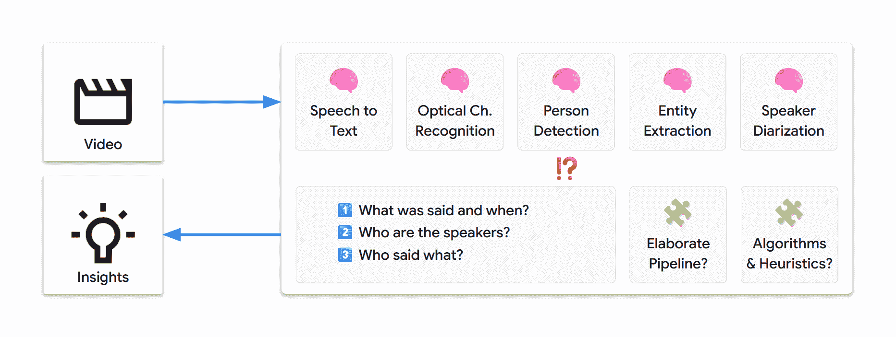

我们可能需要几天或几周的时间来设计和设置这样的流程。此外，在撰写本文时，我们的多模态视频转录挑战尚未解决，因此绝对没有达到可行解决方案的确定性。

* * *

## 💡 一个新的问题解决工具箱

Gemini 允许基于提示的快速问题解决。仅通过文本指令，我们就可以提取信息并将其转化为新的见解，通过简单自动的工作流程。

### 🎬 多模态

Gemini 本地支持多模态，这意味着它可以处理不同类型的输入：

+   文本

+   图片

+   音频

+   视频

+   文档

* * *

### 🌐 多语言

Gemini 也支持 [多语言](https://cloud.google.com/vertex-ai/generative-ai/docs/learn/models#languages-gemini)：

+   它可以在 100 多种语言中处理输入并生成输出

+   如果我们能解决一种语言的视频挑战，那么该解决方案应该自然地扩展到所有其他语言

* * *

### 🧰 自然语言工具箱

在单个模型中实现多模态和多语言理解，使我们能够从依赖特定任务的机器学习模型转向使用一个通用的 LLM。

我们现在的挑战看起来要简单得多：

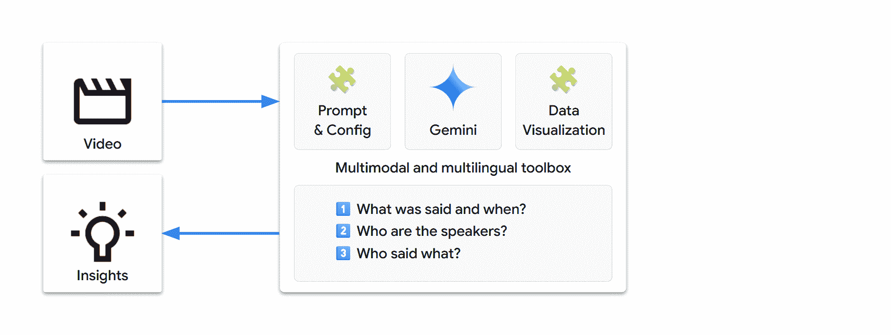

换句话说，让我们重新表述我们的挑战：我们能否仅使用以下内容就能完全转录视频？

+   1 个视频

+   1 个提示

+   1 个请求

让我们尝试使用 Gemini…

* * *

## 🏁 设置

### 🐍 Python 包

我们将使用以下包：

+   `google-genai`：Google Gen AI Python SDK [Google Gen AI Python SDK](https://pypi.org/project/google-genai) 允许我们通过几行代码调用 Gemini

+   `pandas` 用于数据可视化

我们还将使用以下包（`google-genai` 的依赖项）：

+   `pydantic` 用于数据管理

+   `tenacity` 用于请求管理

```py
pip install --quiet "google-genai>=1.49.0" "pandas[output-formatting]"
```

* * *

### 🔗 Gemini API

我们有两种主要方式向 Gemini 发送请求：

+   [Vertex AI](https://cloud.google.com/vertex-ai/generative-ai/docs): 在 Google Cloud 上构建企业级项目

+   [Google AI Studio](https://aistudio.google.com): 进行实验、原型设计和部署小型项目

Google Gen AI SDK 为这些 API 提供了一个统一的接口，我们可以使用环境变量进行配置。

<details class="wp-block-details is-layout-flow wp-block-details-is-layout-flow"><summary>**选项 A – 通过 Vertex AI 使用 Gemini API 🔽</summary>

要求：

+   一个 Google Cloud 项目

+   必须为该项目启用[Vertex AI API](https://console.cloud.google.com/flows/enableapi?apiid=aiplatform.googleapis.com)

Gen AI SDK 环境变量：

+   `GOOGLE_GENAI_USE_VERTEXAI="True"`

+   `GOOGLE_CLOUD_PROJECT="<PROJECT_ID>"`

+   `GOOGLE_CLOUD_LOCATION="<LOCATION>"`（见[Google 模型端点位置](https://cloud.google.com/vertex-ai/generative-ai/docs/learn/locations#google_model_endpoint_locations)）

了解如何[设置项目和开发环境](https://cloud.google.com/vertex-ai/docs/start/cloud-environment).</details> <details class="wp-block-details is-layout-flow wp-block-details-is-layout-flow"><summary>**选项 B – 通过 Google AI Studio 使用 Gemini API 🔽</summary>

要求：

+   一个 Gemini API 密钥

Gen AI SDK 环境变量：

+   `GOOGLE_GENAI_USE_VERTEXAI="False"`

+   `GOOGLE_API_KEY="<API_KEY>"`

了解如何从 Google AI Studio 获取 Gemini API 密钥的更多信息[获取 Gemini API 密钥](https://aistudio.google.com/app/apikey).</details>

💡 您可以将环境配置存储在源代码之外：

| 环境 | 方法 |
| --- | --- |
| IDE | `.env` 文件（或等效） |
| Colab | Colab 秘密（左面板中的🗝️图标，见下方代码） |
| Colab 企业版 | Google Cloud 项目和位置将自动定义 |
| Vertex AI 工作台 | Google Cloud 项目和位置将自动定义 |

<details class="wp-block-details is-layout-flow wp-block-details-is-layout-flow"><summary>定义以下环境检测函数。如果需要，您也可以手动定义配置。🔽</summary>

```py
import os
import sys
from collections.abc import Callable

from google import genai

# Manual setup (leave unchanged if setup is environment-defined)

# @markdown **Which API: Vertex AI or Google AI Studio?**
GOOGLE_GENAI_USE_VERTEXAI = True  # @param {type: "boolean"}

# @markdown **Option A - Google Cloud project [+location]**
GOOGLE_CLOUD_PROJECT = ""  # @param {type: "string"}
GOOGLE_CLOUD_LOCATION = "global"  # @param {type: "string"}

# @markdown **Option B - Google AI Studio API key**
GOOGLE_API_KEY = ""  # @param {type: "string"}

def check_environment() -> bool:
    check_colab_user_authentication()
    return check_manual_setup() or check_vertex_ai() or check_colab() or check_local()

def check_manual_setup() -> bool:
    return check_define_env_vars(
        GOOGLE_GENAI_USE_VERTEXAI,
        GOOGLE_CLOUD_PROJECT.strip(),  # Might have been pasted with line return
        GOOGLE_CLOUD_LOCATION,
        GOOGLE_API_KEY,
    )

def check_vertex_ai() -> bool:
    # Workbench and Colab Enterprise
    match os.getenv("VERTEX_PRODUCT", ""):
        case "WORKBENCH_INSTANCE":
            pass
        case "COLAB_ENTERPRISE":
            if not running_in_colab_env():
                return False
        case _:
            return False

    return check_define_env_vars(
        True,
        os.getenv("GOOGLE_CLOUD_PROJECT", ""),
        os.getenv("GOOGLE_CLOUD_REGION", ""),
        "",
    )

def check_colab() -> bool:
    if not running_in_colab_env():
        return False

    # Colab Enterprise was checked before, so this is Colab only
    from google.colab import auth as colab_auth  # type: ignore

    colab_auth.authenticate_user()

    # Use Colab Secrets (🗝️ icon in left panel) to store the environment variables
    # Secrets are private, visible only to you and the notebooks that you select
    # - Vertex AI: Store your settings as secrets
    # - Google AI: Directly import your Gemini API key from the UI
    vertexai, project, location, api_key = get_vars(get_colab_secret)

    return check_define_env_vars(vertexai, project, location, api_key)

def check_local() -> bool:
    vertexai, project, location, api_key = get_vars(os.getenv)

    return check_define_env_vars(vertexai, project, location, api_key)

def running_in_colab_env() -> bool:
    # Colab or Colab Enterprise
    return "google.colab" in sys.modules

def check_colab_user_authentication() -> None:
    if running_in_colab_env():
        from google.colab import auth as colab_auth  # type: ignore

        colab_auth.authenticate_user()

def get_colab_secret(secret_name: str, default: str) -> str:
    from google.colab import userdata  # type: ignore

    try:
        return userdata.get(secret_name)
    except Exception as e:
        return default

def get_vars(getenv: Callable[[str, str], str]) -> tuple[bool, str, str, str]:
    # Limit getenv calls to the minimum (may trigger UI confirmation for secret access)
    vertexai_str = getenv("GOOGLE_GENAI_USE_VERTEXAI", "")
    if vertexai_str:
        vertexai = vertexai_str.lower() in ["true", "1"]
    else:
        vertexai = bool(getenv("GOOGLE_CLOUD_PROJECT", ""))

    project = getenv("GOOGLE_CLOUD_PROJECT", "") if vertexai else ""
    location = getenv("GOOGLE_CLOUD_LOCATION", "") if project else ""
    api_key = getenv("GOOGLE_API_KEY", "") if not project else ""

    return vertexai, project, location, api_key

def check_define_env_vars(
    vertexai: bool,
    project: str,
    location: str,
    api_key: str,
) -> bool:
    match (vertexai, bool(project), bool(location), bool(api_key)):
        case (True, True, _, _):
            # Vertex AI - Google Cloud project [+location]
            location = location or "global"
            define_env_vars(vertexai, project, location, "")
        case (True, False, _, True):
            # Vertex AI - API key
            define_env_vars(vertexai, "", "", api_key)
        case (False, _, _, True):
            # Google AI Studio - API key
            define_env_vars(vertexai, "", "", api_key)
        case _:
            return False

    return True

def define_env_vars(vertexai: bool, project: str, location: str, api_key: str) -> None:
    os.environ["GOOGLE_GENAI_USE_VERTEXAI"] = str(vertexai)
    os.environ["GOOGLE_CLOUD_PROJECT"] = project
    os.environ["GOOGLE_CLOUD_LOCATION"] = location
    os.environ["GOOGLE_API_KEY"] = api_key

def check_configuration(client: genai.Client) -> None:
    service = "Vertex AI" if client.vertexai else "Google AI Studio"
    print(f"Using the {service} API", end="")

    if client._api_client.project:
        print(f' with project "{client._api_client.project[:7]}…"', end="")
        print(f' in location "{client._api_client.location}"')
    elif client._api_client.api_key:
        api_key = client._api_client.api_key
        print(f' with API key "{api_key[:5]}…{api_key[-5:]}"', end="")
        print(f" (in case of error, make sure it was created for {service})")
```</details>

* * *

### 🤖 Gen AI SDK

要发送 Gemini 请求，创建一个 `google.genai` 客户端：

```py
from google import genai

check_environment()

client = genai.Client()
```

检查您的配置：

```py
check_configuration(client)
```

```py
Using the Vertex AI API with project "lpdemo-…" in location "europe-west9"
```

* * *

### 🧠 Gemini 模型

Gemini 有不同的[版本](https://cloud.google.com/vertex-ai/generative-ai/docs/learn/models#gemini-models)。

让我们开始使用 Gemini 2.0 Flash，因为它提供了高性能和低延迟：

+   `GEMINI_2_0_FLASH = "gemini-2.0-flash"`

> 💡 我们特意选择了 Gemini 2.0 Flash。虽然 Gemini 2.5 模型系列通常可用且功能更强大，但我们想进行实验并了解 Gemini 的核心多模态行为。如果我们用 2.0 完成挑战，这也应该适用于较新的模型。

* * *

### ⚙️ Gemini 配置

Gemini 可以用不同的方式使用，从事实到创意模式。我们试图解决的问题是一个**数据提取**用例。我们希望结果尽可能事实和确定。为此，我们可以更改[内容生成参数](https://cloud.google.com/vertex-ai/generative-ai/docs/multimodal/content-generation-parameters)。

我们将设置`temperature`、`top_p`和`seed`参数以最小化随机性：

+   `temperature=0.0`

+   `top_p=0.0`

+   `seed=42`（任意固定值）

* * *

### 🎞️ 视频来源

这里是 Gemini 可以分析的主要视频来源：

| source | URI | Vertex AI | Google AI Studio |
| --- | --- | --- | --- |
| Google Cloud Storage | `gs://bucket/path/to/video.*` | ✅ |  |
| 网页 URL | `https://path/to/video.*` | ✅ |  |
| YouTube | `https://www.youtube.com/watch?v=YOUTUBE_ID` | ✅ | ✅ |

⚠️ 重要注意事项

+   我们的视频测试套件主要使用公共 YouTube 视频。这样做是为了简化。

+   在分析 YouTube 来源时，Gemini 接收到的原始音频/视频流没有任何附加元数据，就像处理来自云存储的相应视频文件一样。

+   YouTube 确实提供了字幕/子标题/文本功能（用户提供的或自动生成的）。然而，这些功能专注于单词级别的语音转文字，并且限制在 40 多种语言。Gemini 不会接收任何此类数据，您会看到使用 Gemini 的多模态转录提供了额外的优势。

+   此外，我们的挑战还涉及识别说话者和提取说话者数据，这是一种独特的新功能。

* * *

### 🛠️ 辅助工具

<details class="wp-block-details is-layout-flow wp-block-details-is-layout-flow"><summary>定义我们的辅助函数和数据 🔽</summary>

```py
import enum
from dataclasses import dataclass
from datetime import timedelta

import IPython.display
import tenacity
from google.genai.errors import ClientError
from google.genai.types import (
    FileData,
    FinishReason,
    GenerateContentConfig,
    GenerateContentResponse,
    Part,
    VideoMetadata,
)

class Model(enum.Enum):
    # Generally Available (GA)
    GEMINI_2_0_FLASH = "gemini-2.0-flash"
    GEMINI_2_5_FLASH = "gemini-2.5-flash"
    GEMINI_2_5_PRO = "gemini-2.5-pro"
    # Default model
    DEFAULT = GEMINI_2_0_FLASH

# Default configuration for more deterministic outputs
DEFAULT_CONFIG = GenerateContentConfig(
    temperature=0.0,
    top_p=0.0,
    seed=42,  # Arbitrary fixed value
)

YOUTUBE_URL_PREFIX = "https://www.youtube.com/watch?v="
CLOUD_STORAGE_URI_PREFIX = "gs://"

def url_for_youtube_id(youtube_id: str) -> str:
    return f"{YOUTUBE_URL_PREFIX}{youtube_id}"

class Video(enum.Enum):
    pass

class TestVideo(Video):
    # For testing purposes, video duration is statically specified in the enum name
    # Suffix (ISO 8601 based): _PT[<h>H][<m>M][<s>S]

    # Google DeepMind | The Podcast | Season 3 Trailer | 59s
    GDM_PODCAST_TRAILER_PT59S = url_for_youtube_id("0pJn3g8dfwk")
    # Google Maps | Walk in the footsteps of Jane Goodall | 2min 42s
    JANE_GOODALL_PT2M42S = "gs://cloud-samples-data/video/JaneGoodall.mp4"
    # Google DeepMind | AlphaFold | The making of a scientific breakthrough | 7min 54s
    GDM_ALPHAFOLD_PT7M54S = url_for_youtube_id("gg7WjuFs8F4")
    # Brut | French reportage | 8min 28s
    BRUT_FR_DOGS_WATER_LEAK_PT8M28S = url_for_youtube_id("U_yYkb-ureI")
    # Google DeepMind | The Podcast | AI for science | 54min 23s
    GDM_AI_FOR_SCIENCE_FRONTIER_PT54M23S = url_for_youtube_id("nQKmVhLIGcs")
    # Google I/O 2025 | Developer Keynote | 1h 10min 03s
    GOOGLE_IO_DEV_KEYNOTE_PT1H10M03S = url_for_youtube_id("GjvgtwSOCao")
    # Google Cloud | Next 2025 | Opening Keynote | 1h 40min 03s
    GOOGLE_CLOUD_NEXT_PT1H40M03S = url_for_youtube_id("Md4Fs-Zc3tg")
    # Google I/O 2025 | Keynote | 1h 56min 35s
    GOOGLE_IO_KEYNOTE_PT1H56M35S = url_for_youtube_id("o8NiE3XMPrM")

class ShowAs(enum.Enum):
    DONT_SHOW = enum.auto()
    TEXT = enum.auto()
    MARKDOWN = enum.auto()

@dataclass
class VideoSegment:
    start: timedelta
    end: timedelta

def generate_content(
    prompt: str,
    video: Video | None = None,
    video_segment: VideoSegment | None = None,
    model: Model | None = None,
    config: GenerateContentConfig | None = None,
    show_as: ShowAs = ShowAs.TEXT,
) -> None:
    prompt = prompt.strip()
    model = model or Model.DEFAULT
    config = config or DEFAULT_CONFIG

    model_id = model.value
    if video:
        if not (video_part := get_video_part(video, video_segment)):
            return
        contents = [video_part, prompt]
        caption = f"{video.name} / {model_id}"
    else:
        contents = prompt
        caption = f"{model_id}"
    print(f" {caption} ".center(80, "-"))

    for attempt in get_retrier():
        with attempt:
            response = client.models.generate_content(
                model=model_id,
                contents=contents,
                config=config,
            )
            display_response_info(response)
            display_response(response, show_as)

def get_video_part(
    video: Video,
    video_segment: VideoSegment | None = None,
    fps: float | None = None,
) -> Part | None:
    video_uri: str = video.value

    if not client.vertexai:
        video_uri = convert_to_https_url_if_cloud_storage_uri(video_uri)
        if not video_uri.startswith(YOUTUBE_URL_PREFIX):
            print("Google AI Studio API: Only YouTube URLs are currently supported")
            return None

    file_data = FileData(file_uri=video_uri, mime_type="video/*")
    video_metadata = get_video_part_metadata(video_segment, fps)

    return Part(file_data=file_data, video_metadata=video_metadata)

def get_video_part_metadata(
    video_segment: VideoSegment | None = None,
    fps: float | None = None,
) -> VideoMetadata:
    def offset_as_str(offset: timedelta) -> str:
        return f"{offset.total_seconds()}s"

    if video_segment:
        start_offset = offset_as_str(video_segment.start)
        end_offset = offset_as_str(video_segment.end)
    else:
        start_offset = None
        end_offset = None

    return VideoMetadata(start_offset=start_offset, end_offset=end_offset, fps=fps)

def convert_to_https_url_if_cloud_storage_uri(uri: str) -> str:
    if uri.startswith(CLOUD_STORAGE_URI_PREFIX):
        return f"https://storage.googleapis.com/{uri.removeprefix(CLOUD_STORAGE_URI_PREFIX)}"
    else:
        return uri

def get_retrier() -> tenacity.Retrying:
    return tenacity.Retrying(
        stop=tenacity.stop_after_attempt(7),
        wait=tenacity.wait_incrementing(start=10, increment=1),
        retry=should_retry_request,
        reraise=True,
    )

def should_retry_request(retry_state: tenacity.RetryCallState) -> bool:
    if not retry_state.outcome:
        return False
    err = retry_state.outcome.exception()
    if not isinstance(err, ClientError):
        return False
    print(f"❌ ClientError {err.code}: {err.message}")

    retry = False
    match err.code:
        case 400 if err.message is not None and " try again " in err.message:
            # Workshop: project accessing Cloud Storage for the first time (service agent provisioning)
            retry = True
        case 429:
            # Workshop: temporary project with 1 QPM quota
            retry = True
    print(f"🔄 Retry: {retry}")

    return retry

def display_response_info(response: GenerateContentResponse) -> None:
    if usage_metadata := response.usage_metadata:
        if usage_metadata.prompt_token_count:
            print(f"Input tokens   : {usage_metadata.prompt_token_count:9,d}")
        if usage_metadata.candidates_token_count:
            print(f"Output tokens  : {usage_metadata.candidates_token_count:9,d}")
        if usage_metadata.thoughts_token_count:
            print(f"Thoughts tokens: {usage_metadata.thoughts_token_count:9,d}")
    if not response.candidates:
        print("❌ No `response.candidates`")
        return
    if (finish_reason := response.candidates[0].finish_reason) != FinishReason.STOP:
        print(f"❌ {finish_reason = }")
    if not response.text:
        print("❌ No `response.text`")
        return

def display_response(
    response: GenerateContentResponse,
    show_as: ShowAs,
) -> None:
    if show_as == ShowAs.DONT_SHOW:
        return
    if not (response_text := response.text):
        return
    response_text = response.text.strip()

    print(" start of response ".center(80, "-"))
    match show_as:
        case ShowAs.TEXT:
            print(response_text)
        case ShowAs.MARKDOWN:
            display_markdown(response_text)
    print(" end of response ".center(80, "-"))

def display_markdown(markdown: str) -> None:
    IPython.display.display(IPython.display.Markdown(markdown))

def display_video(video: Video) -> None:
    video_url = convert_to_https_url_if_cloud_storage_uri(video.value)
    assert video_url.startswith("https://")

    video_width = 600
    if video_url.startswith(YOUTUBE_URL_PREFIX):
        youtube_id = video_url.removeprefix(YOUTUBE_URL_PREFIX)
        ipython_video = IPython.display.YouTubeVideo(youtube_id, width=video_width)
    else:
        ipython_video = IPython.display.Video(video_url, width=video_width)

    display_markdown(f"### Video (source)")
    IPython.display.display(ipython_video)
```</details>

* * *

## 🧪 原型设计

### 🌱 自然行为

在深入研究之前，看看 Gemini 对简单指令的反应，以发展对其自然行为的直觉是有趣的。

让我们先看看使用简约提示和简短英语视频能得到什么。

```py
video = TestVideo.GDM_PODCAST_TRAILER_PT59S
display_video(video)

prompt = "Transcribe the video's audio with time information."
generate_content(prompt, video) 
```

* * *

### 视频 ([来源](https://www.youtube.com/watch?v=0pJn3g8dfwk))

```py
----------------- GDM_PODCAST_TRAILER_PT59S / gemini-2.0-flash -----------------
Input tokens   :    16,708
Output tokens  :       421
------------------------------ start of response -------------------------------
[00:00:00] Do I have to call you Sir Demis now?
[00:00:01] Oh, you don't.
[00:00:02] Absolutely not.
[00:00:04] Welcome to Google DeepMind the podcast with me, your host Professor Hannah Fry.
[00:00:06] We want to take you to the heart of where these ideas are coming from.
[00:00:12] We want to introduce you to the people who are leading the design of our collective future.
[00:00:19] Getting the safety right is probably, I'd say, one of the most important challenges of our time.
[00:00:25] I want safe and capable.
[00:00:27] I want a bridge that will not collapse.
[00:00:30] just give these scientists a superpower that they had not imagined earlier.
[00:00:34] autonomous vehicles.
[00:00:35] It's hard to fathom that when you're working on a search engine.
[00:00:38] We may see entirely new genre or entirely new forms of art come up.
[00:00:42] There may be a new word that is not music, painting, photography, movie making, and that AI will have helped us create it.
[00:00:48] You really want AGI to be able to peer into the mysteries of the universe.
[00:00:51] Yes, quantum mechanics, string theory, well, and the nature of reality.
[00:00:55] Ow.
[00:00:57] the magic of AI.
------------------------------- end of response --------------------------------
```

结果：

+   Gemini 自然地输出一系列`[时间]文本行`。

+   这就是一行代码的语音转文字！

+   看起来我们可以回答“1️⃣ 说了什么以及何时说的？”。

那么，“2️⃣ 谁是说话者？”怎么样？

```py
prompt = "List the speakers identifiable in the video."
generate_content(prompt, video)
```

```py
----------------- GDM_PODCAST_TRAILER_PT59S / gemini-2.0-flash -----------------
Input tokens   :    16,705
Output tokens  :        46
------------------------------ start of response -------------------------------
Here are the speakers identifiable in the video:

*   Professor Hannah Fry
*   Demis Hassabis
*   Anca Dragan
*   Pushmeet Kohli
*   Jeff Dean
*   Douglas Eck
------------------------------- end of response --------------------------------
```

结果：

+   Gemini 可以整合视频中的标题卡上可见的名称。

+   这就是一行代码的 OCR + 实体提取！

+   “2️⃣ 谁是说话者？”看起来也解决了！

* * *

### ⏩ 别急！

自然的下一步是跳到最后一步指令，一次性解决我们的问题。

```py
prompt = """
Transcribe the video's audio including speaker names (use `?` if not found).

Format example:
[00:02] John Doe - Hello Alice!
"""
generate_content(prompt, video)
```

```py
----------------- GDM_PODCAST_TRAILER_PT59S / gemini-2.0-flash -----------------
Input tokens   :    16,732
Output tokens  :       378
------------------------------ start of response -------------------------------
Here is the audio transcription of the video:

[00:00] ? - Do I have to call you Sir Demis now?
[00:01] Demis Hassabis - Oh, you don't. Absolutely not.
[00:04] Professor Hannah Fry - Welcome to Google DeepMind the podcast with me, your host, Professor Hannah Fry.
[00:06] Professor Hannah Fry - We want to take you to the heart of where these ideas are coming from. We want to introduce you to the people who are leading the design of our collective future.
[00:19] Anca Dragan - Getting the safety right is probably, I'd say, one of the most important challenges of our time. I want safe and capable. I want a bridge that will not collapse.
[00:29] Pushmeet Kohli - Just give these scientists a superpower that they had not imagined earlier.
[00:34] Jeff Dean - Autonomous vehicles. It's hard to fathom that when you're working on a search engine.
[00:38] Douglas Eck - We may see entirely new genre or entirely new forms of art come up. There may be a new word that is not music, painting, photography, movie making, and that AI will have helped us create it.
[00:48] Professor Hannah Fry - You really want AGI to be able to peer into the mysteries of the universe.
[00:51] Demis Hassabis - Yes, quantum mechanics, string theory, well, and the nature of reality.
[00:55] Professor Hannah Fry - Ow!
[00:57] Douglas Eck - The magic of AI.
------------------------------- end of response --------------------------------
```

这几乎是正确的。第一个片段没有归因于主持人（主持人稍后才会被介绍），但其他所有内容看起来都是正确的。

尽管如此，这些并不是真实世界的条件：

+   视频非常短（不到一分钟）

+   视频也很简单（说话者通过屏幕标题卡清楚地介绍）

让我们尝试这个 8 分钟（并且更复杂）的视频：

```py
generate_content(prompt, TestVideo.GDM_ALPHAFOLD_PT7M54S)
```

<details class="wp-block-details is-layout-flow wp-block-details-is-layout-flow"><summary>**输出** 🔽</summary>

```py
------------------- GDM_ALPHAFOLD_PT7M54S / gemini-2.0-flash -------------------
Input tokens   :   134,177
Output tokens  :     2,689
------------------------------ start of response -------------------------------
[00:02] ? - We've discovered more about the world than any other civilization before us.
[00:08] ? - But we have been stuck on this one problem.
[00:11] ? - How do proteins fold up?
[00:13] ? - How do proteins go from a string of amino acids to a compact shape that acts as a machine and drives life?
[00:22] ? - When you find out about proteins, it is very exciting.
[00:25] ? - You could think of them as little biological nano machines.
[00:28] ? - They are essentially the fundamental building blocks that power everything living on this planet.
[00:34] ? - If we can reliably predict protein structures using AI, that could change the way we understand the natural world.
[00:46] ? - Protein folding is one of these holy grail type problems in biology.
[00:50] Demis Hassabis - We've always hypothesized that AI should be helpful to make these kinds of big scientific breakthroughs more quickly.
[00:58] ? - And then I'll probably be looking at little tunings that might make a difference.
[01:02] ? - It should be creating a histogram on and a background skill.
[01:04] ? - We've been working on our system AlphaFold really hard now for over two years.
[01:08] ? - Rather than having to do painstaking experiments, in the future biologists might be able to instead rely on AI methods to directly predict structures quickly and efficiently.
[01:17] Kathryn Tunyasuvunakool - Generally speaking, biologists tend to be quite skeptical of computational work, and I think that skepticism is healthy and I respect it, but I feel very excited about what AlphaFold can achieve.
[01:28] Andrew Senior - CASP is when we, we say, look, DeepMind is doing protein folding.
[01:31] Andrew Senior - This is how good we are, and maybe it's better than everybody else, maybe it isn't.
[01:37] ? - We decided to enter CASP competition because it represented the Olympics of protein folding.
[01:44] John Moult - CASP, we started to try and speed up the solution to the protein folding problem.
[01:50] John Moult - When we started CASP in 1994, I certainly was naive about how hard this was going to be.
[01:58] ? - It was very cumbersome to do that because it took a long time.
[02:01] ? - Let's see what, what, what are we doing still to improve?
[02:03] ? - Typically 100 different groups from around the world participate in CASP, and we take a set of 100 proteins and we ask the groups to send us what they think the structures look like.
[02:15] ? - We can reach 57.9 GDT on CASP 12 ground truth.
[02:19] John Jumper - CASP has a metric on which you will be scored, which is this GDT metric.
[02:25] John Jumper - On a scale of zero to 100, you would expect a GDT over 90 to be a solution to the problem.
[02:33] ? - If we do achieve this, this has incredible medical relevance.
[02:37] Pushmeet Kohli - The implications are immense, from how diseases progress, how you can discover new drugs.
[02:45] Pushmeet Kohli - It's endless.
[02:46] ? - I wanted to make a, a really simple system and the results have been surprisingly good.
[02:50] ? - The team got some results with a new technique, not only is it more accurate, but it's much faster than the old system.
[02:56] ? - I think we'll substantially exceed what we're doing right now.
[02:59] ? - This is a game, game changer, I think.
[03:01] John Moult - In CASP 13, something very significant had happened.
[03:06] John Moult - For the first time, we saw the effective application of artificial intelligence.
[03:11] ? - We've advanced the state of the art in the field, so that's fantastic, but we still got a long way to go before we've solved it.
[03:18] ? - The shapes were now approximately correct for many of the proteins, but the details, exactly where each atom sits, which is really what we would call a solution, we're not yet there.
[03:29] ? - It doesn't help if you have the tallest ladder when you're going to the moon.
[03:33] ? - We hit a little bit of a brick wall, um, since we won CASP, then it was back to the drawing board and like what are our new ideas?
[03:41] ? - Um, and then it's taken a little while, I would say, for them to get back to where they were, but with the new ideas.
[03:51] ? - They can go further, right?
[03:52] ? - So, um, so that's a really important moment.
[03:55] ? - I've seen that moment so many times now, but I know what that means now, and I know this is the time now to press.
[04:02] ? - We need to double down and go as fast as possible from here.
[04:05] ? - I think we've got no time to lose.
[04:07] ? - So the intention is to enter CASP again.
[04:09] ? - CASP is deeply stressful.
[04:12] ? - There's something weird going on with, um, the learning because it is learning something that's correlated with GDT, but it's not calibrated.
[04:18] ? - I feel slightly uncomfortable.
[04:20] ? - We should be learning this, you know, in the blink of an eye.
[04:23] ? - The technology advancing outside DeepMind is also doing incredible work.
[04:27] Richard Evans - And there's always the possibility another team has come somewhere out there field that we don't even know about.
[04:32] ? - Someone asked me, well, should we panic now?
[04:33] ? - Of course, we should have been panicking before.
[04:35] ? - It does seem to do better, but still doesn't do quite as well as the best model.
[04:39] ? - Um, so it looks like there's room for improvement.
[04:42] ? - There's always a risk that you've missed something, and that's why blind assessments like CASP are so important to validate whether our results are real.
[04:49] ? - Obviously, I'm excited to see how CASP 14 goes.
[04:51] ? - My expectation is we get our heads down, we focus on the full goal, which is to solve the whole problem.
[05:14] ? - We were prepared for CASP to start on April 15th because that's when it was originally scheduled to start, and it's been delayed by a month due to coronavirus.
[05:24] ? - I really miss everyone.
[05:25] ? - No, I struggled a little bit just kind of getting into a routine, especially, uh, my wife, she came down with the, the virus.
[05:32] ? - I mean, luckily it didn't turn out too serious.
[05:34] ? - CASP started on Monday.
[05:37] Demis Hassabis - Can I just check this diagram you've got here, John, this one where we ask ground truth.
[05:40] Demis Hassabis - Is this one we've done badly on?
[05:42] ? - We're actually quite good on this region.
[05:43] ? - If you imagine that we hadn't have said it came around this way, but had put it in.
[05:47] ? - Yeah, and that instead.
[05:48] ? - Yeah.
[05:49] ? - One of the hardest proteins we've gotten in CASP thus far is a SARS-CoV-2 protein, uh, called Orf8.
[05:55] ? - Orf8 is a coronavirus protein.
[05:57] ? - We tried really hard to improve our prediction, like really, really hard, probably the most time that we have ever spent on a single target.
[06:05] ? - So we're about two-thirds of the way through CASP, and we've gotten three answers back.
[06:11] ? - We now have a ground truth for Orf8, which is one of the coronavirus proteins.
[06:17] ? - And it turns out we did really well in predicting that.
[06:20] Demis Hassabis - Amazing job, everyone, the whole team.
[06:23] Demis Hassabis - It's been an incredible effort.
[06:24] John Moult - Here what we saw in CASP 14 was a group delivering atomic accuracy off the bat, essentially solving what in our world is two problems.
[06:34] John Moult - How do you look to find the right solution, and then how do you recognize you've got the right solution when you're there?
[06:41] ? - All right, are we, are we mostly here?
[06:46] ? - I'm going to read an email.
[06:48] ? - Uh, I got this from John Moult.
[06:50] ? - Now I'll just read it.
[06:51] ? - It says, John, as I expect you know, your group has performed amazingly well in CASP 14, both relative to other groups and in absolute model accuracy.
[07:02] ? - Congratulations on this work.
[07:05] ? - It is really outstanding.
[07:07] Demis Hassabis - AlphaFold represents a huge leap forward that I hope will really accelerate drug discovery and help us to better understand disease.
[07:13] John Moult - It's pretty mind-blowing.
[07:16] John Moult - You know, these results were, for me, having worked on this problem so long, after many, many stops and starts and will this ever get there, suddenly this is a solution.
[07:28] John Moult - We've solved the problem.
[07:29] John Moult - This gives you such excitement about the way science works, about how you can never see exactly or even approximately what's going to happen next.
[07:37] John Moult - There are always these surprises, and that really, as a scientist, is what keeps you going.
[07:41] John Moult - What's going to be the next surprise?
------------------------------- end of response --------------------------------
```</details>

这失败了：大多数片段都没有识别出说话者！

由于我们正在尝试解决一个全新的复杂问题，LLMs 未经任何已知解决方案的训练。这可能是为什么直接指令没有产生预期的答案。

在这个阶段：

+   我们可能得出结论，我们无法用真实世界的视频解决这个问题。

+   通过尝试更多和更复杂的提示来坚持解决这个未解决的问题可能会浪费时间。

让我们退一步，思考一下内部发生了什么…

* * *

## ⚛️ 内部机制

现代 LLMs 大多基于 Transformer 架构，这是 2017 年谷歌研究人员发表的一篇题为《Attention Is All You Need》的论文中详细描述的一种新的神经网络设计。该论文介绍了自注意力机制，这是一个关键创新，从根本上改变了机器处理语言的方式。

### 🪙 标记

标记是 LLM 的构建块。我们可以将标记视为代表信息的一部分。

Gemini 多模态标记的示例（使用默认参数）：

| 内容 | 标记 | 详细信息 |
| --- | --- | --- |
| `hello` | 1 | 常见单词/序列的 1 个标记 |
| `passionately` | 2 | `passion•ately` |
| `passionnément` | 3 | `passion•né•ment` (法语中的相同副词) |
| 图片 | 258 | 每张图片（或根据图像分辨率每块） |
| 无时间码的音频 | 每秒 25 | 由音频标记器处理 |
| 无音频的视频 | 每帧 258 | 由视频标记器在每秒 1 帧的速率下处理 |
| `MM:SS` 时间码 | 5 | 音频块或视频帧的时间参考 |
| `H:MM:SS` 时间码 | 7 | 类似地，对于超过 1 小时的内容 |

* * *

### 🎞️ 采样帧率

默认情况下，视频帧以每秒 1 帧（1 FPS）的速率采样。这些帧与其对应的时间码一起包含在上下文中。

您可以使用自定义采样帧率通过 `Part.video_metadata.fps` 参数：

| 视频类型 | 改变 | 帧率范围 |
| --- | --- | --- |
| 静态，缓慢 | 降低帧率 | `0.0 < fps < 1.0` |
| 动态，快速 | 提高帧率 | `1.0 < fps <= 24.0` |

> 💡 对于 `1.0 < fps`，Gemini 被训练以理解 `MM:SS.sss` 和 `H:MM:SS.sss` 时间码。

* * *

### 🔍 媒体分辨率

默认情况下，每个采样的帧用 258 个标记表示。

您可以使用 `GenerateContentConfig.media_resolution` 参数指定中等或低媒体分辨率：

| 视频输入的媒体分辨率 | 每帧标记数 | 利益 |
| --- | --- | --- |
| `MEDIA_RESOLUTION_MEDIUM` (默认) | 258 | 更高的精度，允许更详细的理解 |
| `MEDIA_RESOLUTION_LOW` | 66 | 更快更便宜的推理，允许更长的视频 |

> 💡 “媒体分辨率”可以看作是“图像标记分辨率”：用于表示图像的标记数量。

* * *

### 🧮 一直到底的概率

LLM 在完美自然语言交流方面的能力非常令人印象深刻，但很容易陷入错误假设。

记住 LLM 是如何工作的：

+   LLM 是在一个庞大的标记化数据集上训练的，这代表了它的知识（它的长期记忆）

+   在训练过程中，其神经网络学习标记模式

+   当你向 LLM 发送请求时，你的输入被转换为标记（标记化）

+   为了回答你的请求，LLM 逐个预测下一个可能的标记

+   总体而言，LLMs 是卓越的统计标记预测机器，似乎模仿了我们大脑的一些工作方式

这有几个后果：

+   LLM 的输出只是对你输入的统计上可能的后续

+   LLM 显示出一些推理形式：它们可以匹配复杂的模式，但没有真正的深入理解

+   LLM 没有意识：它们被设计用来生成标记，并将根据你的指示这样做

+   顺序很重要：首先生成的标记将影响随后生成的标记

对于下一步，一些有组织的提示制作可能会有所帮助…

* * *

## 🏗️ 提示制作

### 🪜 方法论

提示制作，也称为提示工程，是一个相对较新的领域。它涉及设计和改进文本指令，以引导 LLM 生成所需的输出。像写作一样，它既是艺术也是科学，是一种可以通过练习开发的技能。

我们可以找到无数关于提示制作的参考资料。一些提示可能非常长、复杂，甚至令人恐惧。使用像 Gemini 这样的高性能 LLM 制作提示要简单得多。以下有三个关键形容词需要记住：

+   迭代

+   精确

+   简洁

**迭代**

提示制作通常是一个迭代的过程。以下是一些建议：

+   逐步制作你的提示

+   跟踪你的连续迭代

+   在每个迭代中，确保衡量哪些有效，哪些无效

+   如果你达到回归，回溯到一个成功的迭代

**精确**

精确度是关键：

+   使用尽可能具体的词语

+   具有多个含义的单词可以引入变化，因此请使用精确的表达

+   精确度将影响有利于你的概率

**简洁**

简洁性有额外的优势：

+   短提示更容易让我们开发者理解（和维护！）

+   你的提示越长，你引入不一致性或甚至矛盾的可能性就越大，这会导致对你指令的多种解释

+   测试并信任 LLM 的知识：这种知识作为隐含的上下文，可以使你的提示更简短、更清晰

总体而言，尽管这似乎有些矛盾，但如果你花时间进行迭代、精确和简洁，你很可能会节省很多时间。

> 💡 如果你想探索这个主题，请查看[提示策略](https://cloud.google.com/vertex-ai/generative-ai/docs/learn/prompts/prompt-design-strategies)（谷歌云参考）和[提示工程](https://www.kaggle.com/whitepaper-prompt-engineering)（Lee Boonstra 编写的 68 页 PDF）。

* * *

### 📚 术语

我们还不是视频转录（目前！）的专家，但我们希望 Gemini 能够表现得像一位专家。因此，我们希望为这个用例编写尽可能具体的提示。虽然 LLMs 根据其训练知识处理指令，但它们也可以与我们分享这些知识。

我们可以通过直接询问 Gemini 来学到很多东西：

```py
prompt = """
What is the terminology used for video transcriptions?
Please show a typical output example.
"""
generate_content(prompt, show_as=ShowAs.MARKDOWN)
```

<details class="wp-block-details is-layout-flow wp-block-details-is-layout-flow"><summary>**输出** 🔽</summary>

```py
------------------------------- gemini-2.0-flash -------------------------------
Input tokens   :        18
Output tokens  :     1,814
------------------------------ start of response -------------------------------
```

```py
## Terminology Used for Video Transcriptions

Here's a breakdown of common terminology used when discussing video transcriptions:

*   **Transcription:** The general term for converting audio or video content into text.
*   **Video Transcription:** Specifically refers to transcribing the audio portion of a video.
*   **Verbatim Transcription:** A transcription that includes every spoken word, including filler words ("um," "ah"), false starts, stutters, and background noises (if relevant).  It aims for a highly accurate representation of the spoken word.
*   **Clean Verbatim Transcription (or Edited Transcription):** A transcription that removes filler words, false starts, and stutters to create a more readable and polished text. It focuses on conveying the meaning clearly.
*   **Intelligent Verbatim Transcription:** A middle ground between verbatim and clean verbatim. It removes some filler words and stutters but retains elements that contribute to the speaker's style or the context of the conversation.
*   **Summary Transcription:** A brief overview of the video's content, highlighting the main points.
*   **Timecoding (or Timestamping):** Adding timestamps to the transcription to indicate when each section of text was spoken in the video.  This is crucial for accessibility and navigation.
*   **Speaker Identification:** Identifying and labeling different speakers in the video.
*   **Captioning (or Subtitling):** Creating text versions of the video's audio that are displayed on the screen, usually synchronized with the video.  Captions are often used for accessibility (for deaf or hard-of-hearing viewers) and for viewers who prefer to read along.
*   **Closed Captions:** Captions that can be turned on or off by the viewer.
*   **Open Captions:** Captions that are permanently embedded in the video and cannot be turned off.
*   **SRT (SubRip Subtitle):** A common file format for storing captions and subtitles.
*   **VTT (Video Text Tracks):** A more modern file format for captions and subtitles, often used with HTML5 video.
*   **Burned-in Captions:** Captions that are permanently embedded into the video file.
*   **Transcriber:** The person or software that performs the transcription.
*   **Accuracy Rate:** The percentage of words transcribed correctly.
*   **Turnaround Time:** The time it takes to complete the transcription.

## Typical Output Example

Let's say we have a short video clip of an interview. Here's how different types of transcriptions might look:

**Scenario:** A short clip of an interview with a chef discussing their new restaurant.

**1\. Verbatim Transcription (with Timecoding):**

```

00:00:00 --> 00:00:03 采访者：厨师，欢迎来到节目！

00:00:03 --> 00:00:06 厨师：感谢您的邀请。很高兴来到这里。

00:00:06 --> 00:00:12 采访者：那么，请告诉我们一些关于您的新餐厅“金勺子”的情况。

00:00:12 --> 00:00:20 厨师：嗯，这，这是我多年的梦想，你知道？开一家真正专注于季节性食材的地方。

00:00:20 --> 00:00:25 采访者：那么，人们可以期待什么样的菜系？

00:00:25 --> 00:00:32 厨师：我们在做现代美式菜，但真正强调的是本地农场和可持续的做法。

```py

**2\. Clean Verbatim Transcription (with Timecoding):**

```

00:00:00 --> 00:00:03 采访者：厨师，欢迎来到节目！

00:00:03 --> 00:00:06 厨师：感谢您的邀请。很高兴来到这里。

00:00:06 --> 00:00:12 采访者：那么，请告诉我们一些关于您的新餐厅“金勺子”的情况。

00:00:12 --> 00:00:20 厨师：嗯，这，这是我多年的梦想，你知道？开一家真正专注于季节性食材的地方。

00:00:20 --> 00:00:25 采访者：那么，人们可以期待什么样的菜系？

00:00:25 --> 00:00:32 厨师：我们在做现代美式菜，但真正强调的是本地农场和可持续的做法。

```py

**3\. Intelligent Verbatim Transcription (with Timecoding):**

```

00:00:00 --> 00:00:03 采访者：厨师，欢迎来到节目！

00:00:03 --> 00:00:06 厨师：感谢您的邀请。很高兴来到这里。

00:00:06 --> 00:00:12 采访者：那么，请告诉我们一些关于您的新餐厅“金勺子”的情况。

00:00:12 --> 00:00:20 厨师：嗯，这，这是我多年的梦想，你知道？开一家真正专注于季节性食材的地方。

00:00:20 --> 00:00:25 采访者：那么，人们可以期待什么样的菜系？

00:00:25 --> 00:00:32 厨师：我们在做现代美式菜，但真正强调的是本地农场和可持续的做法。

```py

**4\. Summary Transcription:**

```

厨师讨论了他们的新餐厅“金勺子”，该餐厅专注于季节性食材和现代美式菜系，强调本地农场和可持续的做法。

```py

**5\. SRT File (for Captions):**

```

1

00:00:00,000 --> 00:00:03,000

采访者：厨师，欢迎来到节目！

2

00:00:03,000 --> 00:00:06,000

厨师：感谢您的邀请。很高兴来到这里。

3

00:00:06,000 --> 00:00:12,000

采访者：那么，请告诉我们一些关于您新餐厅“金勺子”的情况。

4

00:00:12,000 --> 00:00:20,000

厨师：嗯，多年来我一直梦想着开一家真正专注于季节性食材的餐厅。

5

00:00:20,000 --> 00:00:25,000

采访者：那么，人们可以期待什么样的菜系？

6

00:00:25,000 --> 00:00:32,000

厨师：我们做现代美式菜，但非常强调当地农场和可持续的做法。

```py

**Key Differences:**

*   **Verbatim:** Captures every detail, including imperfections in speech.
*   **Clean Verbatim:**  Focuses on clarity and readability by removing unnecessary elements.
*   **Intelligent Verbatim:** A balance between accuracy and readability.
*   **Summary:** Provides a concise overview.
*   **SRT:**  A structured file format for displaying captions synchronized with the video.

The best type of transcription depends on the specific needs of the project.  For legal or research purposes, a verbatim transcription might be necessary. For general accessibility or marketing purposes, a clean verbatim or intelligent verbatim transcription is often preferred.  Summary transcriptions are useful for quickly understanding the content of a video.  SRT files are essential for adding captions to videos.
```

```py
------------------------------- end of response --------------------------------
```</details>

* * *

### 📝 表格提取

到目前为止，我们已经看到了以下内容：

+   我们没有一次性获取到带有识别说话者的完整转录

+   顺序很重要（因为生成的标记会影响后续标记的概率）

为了应对我们的挑战，我们需要 Gemini 从以下多模态信息中进行推断：

+   文本（我们的指令+视频中可能写的内容）

+   音频提示（视频中所有说出的或可听到的内容）

+   视觉提示（视频中所有可见的内容）

+   时间（事情发生的时候）

这是一种信息类型的混合！

由于视频转录是一个数据提取用例，如果我们把最终结果看作是一个数据库，我们的最终目标可以看作是生成两个相关的表（文字记录和说话者）。如果我们把它写下来，我们最初的三个子问题现在看起来是解耦的：

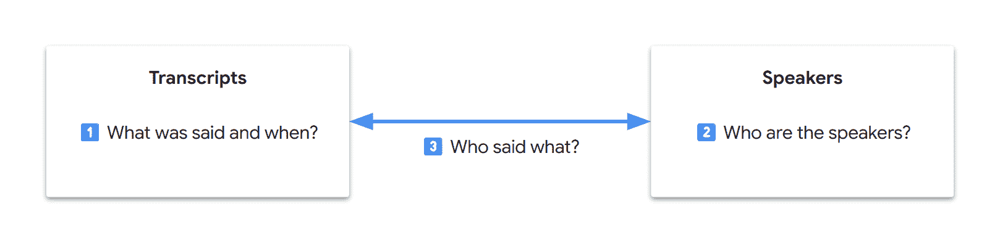

> 💡 在计算机科学中，数据解耦增强了数据局部性，通常在缓存利用、数据访问、语义理解或系统维护等领域的性能得到改善。在 LLM Transformer 架构中，核心性能高度依赖于注意力机制。然而，注意力池是有限的，标记会竞争注意力。研究人员有时将“注意力稀释”用于长上下文、百万标记规模的基准测试。虽然我们无法像用户一样直接调试 LLM，但直观上，数据解耦可能会提高模型的重点，从而带来更好的注意力范围。

由于 Gemini 在模式识别方面非常出色，它可以自动生成标识符来链接我们的表。此外，由于我们最终希望有一个自动化的工作流程，我们可以从数据和字段的角度开始推理：

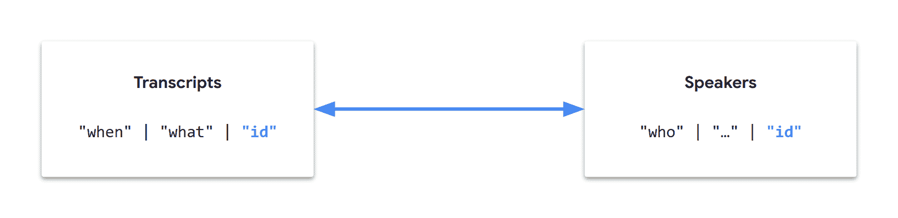

让我们称这种方法为“表格提取”，将我们的指令分成两个任务（表格），仍然在一个请求中，并按有意义的方式排列……

* * *

### 💬 文字记录

首先，让我们专注于获取音频文字记录：

+   Gemini 已被证明在音频转录方面具有天生的优势

+   这比图像分析需要的推理要少

+   这是中心且独立的信息

> 💡 生成以正确答案开始的输出应该有助于实现整体正确的输出。

我们也看到了典型的转录条目可能的样子：

```py
00:02 speaker_1: Welcome!
```

但是，在我们的多模态用例中，立即就可能出现一些歧义：

+   说话者是什么？

+   是我们看到/听到的某人吗？

+   如果视频中出现的人不是说话者怎么办？

+   如果说话的人从未在视频中出现过呢？

我们如何无意识地识别视频中的说话者是谁？

+   首先，可能是通过即时识别不同的声音？

+   然后，可能是通过综合额外的音频和视觉线索？

Gemini 能否理解声音特征？

```py
prompt = """
Using only the video's audio, list the following audible characteristics:
- Voice tones
- Voice pitches
- Languages
- Accents
- Speaking styles
"""
video = TestVideo.GDM_PODCAST_TRAILER_PT59S

generate_content(prompt, video, show_as=ShowAs.MARKDOWN)
```

```py
----------------- GDM_PODCAST_TRAILER_PT59S / gemini-2.0-flash -----------------
Input tokens   :    16,730
Output tokens  :       168
------------------------------ start of response -------------------------------
```

```py
Okay, here's a breakdown of the audible characteristics in the video's audio:

- **Voice Tones:** The tones range from conversational and friendly to more serious and thoughtful. There are also moments of excitement and humor.
- **Voice Pitches:** There's a mix of high and low pitches, depending on the speaker. The female speakers tend to have higher pitches, while the male speakers have lower pitches.
- **Languages:** The primary language is English.
- **Accents:** There are a variety of accents, including British, American, and possibly others that are harder to pinpoint without more context.
- **Speaking Styles:** The speaking styles vary from formal and professional (like in an interview setting) to more casual and conversational. Some speakers are more articulate and precise, while others are more relaxed.
```

```py
------------------------------- end of response --------------------------------
```

那么，一个法语视频呢？

```py
video = TestVideo.BRUT_FR_DOGS_WATER_LEAK_PT8M28S

generate_content(prompt, video, show_as=ShowAs.MARKDOWN)
```

```py
-------------- BRUT_FR_DOGS_WATER_LEAK_PT8M28S / gemini-2.0-flash --------------
Input tokens   :   144,055
Output tokens  :       147
------------------------------ start of response -------------------------------
```

```py
Here's a breakdown of the audible characteristics in the video, based on the audio:

*   **Languages:** Primarily French.
*   **Accents:** French accents are present, with some variations depending on the speaker.
*   **Voice Tones:** The voice tones vary depending on the speaker and the context. Some are conversational and informative, while others are more enthusiastic and encouraging, especially when interacting with the dogs.
*   **Voice Pitches:** The voice pitches vary depending on the speaker and the context.
*   **Speaking Styles:** The speaking styles vary depending on the speaker and the context. Some are conversational and informative, while others are more enthusiastic and encouraging, especially when interacting with the dogs.
```

```py
------------------------------- end of response --------------------------------
```

> ⚠️ 我们在这里必须谨慎：响应可以综合多模态信息甚至一般知识。例如，如果一个人是名人，他们的名字很可能是 LLM 知识的一部分。如果他们被知道来自英国，一个可能的推断是他们有英国口音。这就是我们通过包括“仅使用视频的音频”使我们的提示更加具体的原因。
> 
> 💡 如果你进行更多测试，例如在私人音频文件上（即，不是公共知识的一部分，并且没有额外的视觉线索），你会发现 Gemini 的音频标记器表现异常出色，并提取语义语音信息！

经过几次迭代，我们可以得到一个专注于音频和声音的转录提示：

```py
prompt = """
Task:
- Watch the video and listen carefully to the audio.
- Identify the distinct voices using a `voice` ID (1, 2, 3, etc.).
- Transcribe the video's audio verbatim with voice diarization.
- Include the `start` timecode (MM:SS) for each speech segment.
- Output a JSON array where each object has the following fields:
  - `start`
  - `text`
  - `voice`
"""
video = TestVideo.GDM_PODCAST_TRAILER_PT59S

generate_content(prompt, video, show_as=ShowAs.MARKDOWN)
```

<details class="wp-block-details is-layout-flow wp-block-details-is-layout-flow"><summary>**输出** 🔽</summary>

```py
----------------- GDM_PODCAST_TRAILER_PT59S / gemini-2.0-flash -----------------
Input tokens   :    16,800
Output tokens  :       635
------------------------------ start of response -------------------------------
```

```py
[
  {
    "start": "00:00",
    "text": "Do I have to call you Sir Demis now?",
    "voice": 1
  },
  {
    "start": "00:01",
    "text": "Oh, you don't. Absolutely not.",
    "voice": 2
  },
  {
    "start": "00:03",
    "text": "Welcome to Google Deep Mind the podcast with me, your host Professor Hannah Fry.",
    "voice": 1
  },
  {
    "start": "00:06",
    "text": "We want to take you to the heart of where these ideas are coming from. We want to introduce you to the people who are leading the design of our collective future.",
    "voice": 1
  },
  {
    "start": "00:19",
    "text": "Getting the safety right is probably, I'd say, one of the most important challenges of our time. I want safe and capable.",
    "voice": 3
  },
  {
    "start": "00:26",
    "text": "I want a bridge that will not collapse.",
    "voice": 3
  },
  {
    "start": "00:30",
    "text": "just give these scientists a superpower that they had not imagined earlier.",
    "voice": 4
  },
  {
    "start": "00:34",
    "text": "autonomous vehicles. It's hard to fathom that when you're working on a search engine.",
    "voice": 5
  },
  {
    "start": "00:38",
    "text": "We may see entirely new genre or entirely new forms of art come up. There may be a new word that is not music, painting, photography, movie making, and that AI will have helped us create it.",
    "voice": 6
  },
  {
    "start": "00:48",
    "text": "You really want AGI to be able to peer into the mysteries of the universe.",
    "voice": 1
  },
  {
    "start": "00:51",
    "text": "Yes, quantum mechanics, string theory, well, and the nature of reality.",
    "voice": 2
  },
  {
    "start": "00:55",
    "text": "Ow.",
    "voice": 1
  },
  {
    "start": "00:56",
    "text": "the magic of AI.",
    "voice": 6
  }
]
```

```py
------------------------------- end of response --------------------------------
```</details>

这看起来不错！如果你在更复杂的视频上测试这些指令，你会得到类似的有希望的结果。

注意提示如何重复使用 Gemini 之前提供的术语，同时力求精确和简洁：

+   `verbatim` 是明确的（与“口语”不同）

+   `1, 2, 3, 等.` 是省略号（Gemini 可以推断模式）

+   `timecode` 是具体的（`timestamp` 有更多含义）

+   `MM:SS` 明确了时间码格式

> 💡 Gemini 2.0 被训练来理解特定的`MM:SS`时间码格式。Gemini 2.5 也支持`H:MM:SS`格式，适用于更长的视频。有关最新更新，请参阅[视频理解文档](https://cloud.google.com/vertex-ai/generative-ai/docs/multimodal/video-understanding)。

我们已经完成了一半。让我们通过第二个任务来完成我们的数据库生成…

* * *

### 🧑 说话者

第二个任务相当直接：我们希望将说话者信息提取到第二个表格中。这两个表格通过声音 ID 逻辑上链接。

经过几次迭代，我们可以达到以下类似的双任务提示：

```py
prompt = """
Generate a JSON object with keys `task1_transcripts` and `task2_speakers` for the following tasks.

**Task 1 - Transcripts**

- Watch the video and listen carefully to the audio.
- Identify the distinct voices using a `voice` ID (1, 2, 3, etc.).
- Transcribe the video's audio verbatim with voice diarization.
- Include the `start` timecode (MM:SS) for each speech segment.
- The `task1_transcripts` value is a JSON array where each object has the following fields:
  - `start`
  - `text`
  - `voice`

**Task 2 - Speakers**

- For each `voice` ID from Task 1, extract the name of the corresponding speaker.
- Use visual and audio cues.
- If a speaker's name cannot be found, use `?` as the value.
- The `task2_speakers` value is a JSON array where each object has the following fields:
  - `voice`
  - `name`

JSON:
"""
video = TestVideo.GDM_PODCAST_TRAILER_PT59S

generate_content(prompt, video, show_as=ShowAs.MARKDOWN)
```

<details class="wp-block-details is-layout-flow wp-block-details-is-layout-flow"><summary>**输出** 🔽</summary>

```py
----------------- GDM_PODCAST_TRAILER_PT59S / gemini-2.0-flash -----------------
Input tokens   :    16,920
Output tokens  :       806
------------------------------ start of response -------------------------------
```

```py
{
  "task1_transcripts": [
    {
      "start": "00:00",
      "text": "Do I have to call you Sir Demis now?",
      "voice": 1
    },
    {
      "start": "00:01",
      "text": "Oh, you don't. Absolutely not.",
      "voice": 2
    },
    {
      "start": "00:04",
      "text": "Welcome to Google Deep Mind the podcast with me, your host Professor Hannah Fry.",
      "voice": 1
    },
    {
      "start": "00:06",
      "text": "We want to take you to the heart of where these ideas are coming from. We want to introduce you to the people who are leading the design of our collective future.",
      "voice": 1
    },
    {
      "start": "00:19",
      "text": "Getting the safety right is probably, I'd say, one of the most important challenges of our time. I want safe and capable.",
      "voice": 3
    },
    {
      "start": "00:26",
      "text": "I want a bridge that will not collapse.",
      "voice": 3
    },
    {
      "start": "00:30",
      "text": "That just give these scientists a superpower that they had not imagined earlier.",
      "voice": 4
    },
    {
      "start": "00:34",
      "text": "autonomous vehicles. It's hard to fathom that when you're working on a search engine.",
      "voice": 5
    },
    {
      "start": "00:38",
      "text": "We may see entirely new genre or entirely new forms of art come up. There may be a new word that is not music, painting, photography, movie making, and that AI will have helped us create it.",
      "voice": 6
    },
    {
      "start": "00:48",
      "text": "You really want AGI to be able to peer into the mysteries of the universe.",
      "voice": 1
    },
    {
      "start": "00:51",
      "text": "Yes, quantum mechanics, string theory, well, and the nature of reality.",
      "voice": 2
    },
    {
      "start": "00:55",
      "text": "Ow.",
      "voice": 1
    },
    {
      "start": "00:56",
      "text": "the magic of AI.",
      "voice": 6
    }
  ],
  "task2_speakers": [
    {
      "voice": 1,
      "name": "Professor Hannah Fry"
    },
    {
      "voice": 2,
      "name": "Demis Hassabis"
    },
    {
      "voice": 3,
      "name": "Anca Dragan"
    },
    {
      "voice": 4,
      "name": "Pushmeet Kohli"
    },
    {
      "voice": 5,
      "name": "Jeff Dean"
    },
    {
      "voice": 6,
      "name": "Douglas Eck"
    }
  ]
}
```

```py
------------------------------- end of response --------------------------------
```</details>

在更复杂的视频上测试这个提示：它看起来仍然不错！

* * *

## 🚀 最终化

### 🧩 结构化输出

我们已经迭代到一个精确和简洁的提示。现在，我们可以专注于 Gemini 的响应：

+   响应是包含围栏代码块的纯文本

+   相反，我们希望得到结构化的输出，以获得格式一致的响应

+   理想情况下，我们还想避免解析响应，这可能会成为维护负担

获取结构化输出是 LLM 的一个功能，也称为“受控生成”。由于我们已经在数据表和 JSON 字段方面制作了我们的提示词，现在这只是一个形式。

在我们的请求中，我们可以添加以下参数：

+   `response_mime_type="application/json"`

+   `response_schema="YOUR_JSON_SCHEMA"` ([文档](https://cloud.google.com/vertex-ai/generative-ai/docs/multimodal/control-generated-output#fields))

在 Python 中，这变得更加简单：

+   使用`pydantic`库

+   使用从`pydantic.BaseModel`派生的类反映输出结构

我们可以通过删除输出指定部分来简化提示词：

```py
Generate a JSON object with keys `task1_transcripts` and `task2_speakers` for the following tasks.
…
- The `task1_transcripts` value is a JSON array where each object has the following fields:
  - `start`
  - `text`
  - `voice`
…
- The `task2_speakers` value is a JSON array where each object has the following fields:
  - `voice`
  - `name`
```

…将它们移动到匹配的 Python 类中：

```py
import pydantic

class Transcript(pydantic.BaseModel):
    start: str
    text: str
    voice: int

class Speaker(pydantic.BaseModel):
    voice: int
    name: str

class VideoTranscription(pydantic.BaseModel):
    task1_transcripts: list[Transcript] = pydantic.Field(default_factory=list)
    task2_speakers: list[Speaker] = pydantic.Field(default_factory=list)
```

…并请求结构化响应：

```py
response = client.models.generate_content(
    # …
    config=GenerateContentConfig(
        # …
        response_mime_type="application/json",
        response_schema=VideoTranscription,
        # …
    ),
)
```

最后，从响应中检索对象也是直接的：

```py
if isinstance(response.parsed, VideoTranscription):
    video_transcription = response.parsed
else:
    video_transcription = VideoTranscription()  # Empty transcription
```

这种方法的有趣之处如下：

+   提示词侧重于逻辑，而类侧重于输出

+   更容易更新和维护类型化类

+   JSON 模式由 Gen AI SDK 自动从`response_schema`中提供的类生成，并派发到 Gemini

+   响应会自动由 Gen AI SDK 解析并反序列化为相应的 Python 对象

> ⚠️ 如果你在提示词中保留输出指定部分，确保提示词和模式之间没有矛盾（例如，相同的字段名称和顺序），因为这可能会对响应质量产生负面影响。
> 
> 💡 有可能在模式中直接包含更多结构化信息（例如，详细的字段定义）。见 [受控生成](https://cloud.google.com/vertex-ai/generative-ai/docs/multimodal/control-generated-output)。

* * *

### ✨ 实现

让我们完善我们的代码。此外，现在我们有一个稳定的提示词，我们甚至可以丰富我们的解决方案，以提取每个演讲者的`公司`、`职位`和`在视频中的角色`：

<details class="wp-block-details is-layout-flow wp-block-details-is-layout-flow"><summary>**最终代码** 🔽</summary>

```py
import re

import pydantic
from google.genai.types import MediaResolution, ThinkingConfig

SamplingFrameRate = float
NOT_FOUND = "?"
VIDEO_TRANSCRIPTION_PROMPT = f"""
**Task 1 - Transcripts**

- Watch the video and listen carefully to the audio.
- Identify the distinct voices using a `voice` ID (1, 2, 3, etc.).
- Transcribe the video's audio verbatim with voice diarization.
- Include the `start` timecode ({{timecode_spec}}) for each speech segment.

**Task 2 - Speakers**

- For each `voice` ID from Task 1, extract information about the corresponding speaker.
- Use visual and audio cues.
- If a piece of information cannot be found, use `{NOT_FOUND}` as the value.
"""

class Transcript(pydantic.BaseModel):
    start: str
    text: str
    voice: int

class Speaker(pydantic.BaseModel):
    voice: int
    name: str
    company: str
    position: str
    role_in_video: str

class VideoTranscription(pydantic.BaseModel):
    task1_transcripts: list[Transcript] = pydantic.Field(default_factory=list)
    task2_speakers: list[Speaker] = pydantic.Field(default_factory=list)

def get_generate_content_config(model: Model, video: Video) -> GenerateContentConfig:
    media_resolution = get_media_resolution_for_video(video)
    thinking_config = get_thinking_config(model)

    return GenerateContentConfig(
        temperature=DEFAULT_CONFIG.temperature,
        top_p=DEFAULT_CONFIG.top_p,
        seed=DEFAULT_CONFIG.seed,
        response_mime_type="application/json",
        response_schema=VideoTranscription,
        media_resolution=media_resolution,
        thinking_config=thinking_config,
    )

def get_video_duration(video: Video) -> timedelta | None:
    # For testing purposes, video duration is statically specified in the enum name
    # Suffix (ISO 8601 based): _PT[<h>H][<m>M][<s>S]
    # For production,
    # - fetch durations dynamically or store them separately
    # - take into account video VideoMetadata.start_offset & VideoMetadata.end_offset
    regex = r"_PT(?:(\d+)H)?(?:(\d+)M)?(?:(\d+)S)?$"
    if not (match := re.search(regex, video.name)):
        print(f"⚠️ No duration info in {video.name}. Will use defaults.")
        return None

    h_str, m_str, s_str = match.groups()
    return timedelta(
        hours=int(h_str or 0), minutes=int(m_str or 0), seconds=int(s_str or 0)
    )

def get_media_resolution_for_video(video: Video) -> MediaResolution | None:
    if not (video_duration := get_video_duration(video)):
        return None  # Default

    # For testing purposes, this is based on video duration, as our short videos tend to be more detailed
    less_than_five_minutes = video_duration < timedelta(minutes=5)
    if less_than_five_minutes:
        media_resolution = MediaResolution.MEDIA_RESOLUTION_MEDIUM
    else:
        media_resolution = MediaResolution.MEDIA_RESOLUTION_LOW

    return media_resolution

def get_sampling_frame_rate_for_video(video: Video) -> SamplingFrameRate | None:
    sampling_frame_rate = None  # Default (1 FPS for current models)

    # [Optional] Define a custom FPS: 0.0 < sampling_frame_rate <= 24.0

    return sampling_frame_rate

def get_timecode_spec_for_model_and_video(model: Model, video: Video) -> str:
    timecode_spec = "MM:SS"  # Default

    match model:
        case Model.GEMINI_2_0_FLASH:  # Supports MM:SS
            pass
        case Model.GEMINI_2_5_FLASH | Model.GEMINI_2_5_PRO:  # Support MM:SS and H:MM:SS
            duration = get_video_duration(video)
            one_hour_or_more = duration is not None and timedelta(hours=1) <= duration
            if one_hour_or_more:
                timecode_spec = "MM:SS or H:MM:SS"
        case _:
            raise NotImplementedError(f"Undefined timecode spec for {model.name}.")

    return timecode_spec

def get_thinking_config(model: Model) -> ThinkingConfig | None:
    # Examples of thinking configurations (Gemini 2.5 models)
    match model:
        case Model.GEMINI_2_5_FLASH:  # Thinking disabled
            return ThinkingConfig(thinking_budget=0, include_thoughts=False)
        case Model.GEMINI_2_5_PRO:  # Minimum thinking budget and no summarized thoughts
            return ThinkingConfig(thinking_budget=128, include_thoughts=False)
        case _:
            return None  # Default

def get_video_transcription_from_response(
    response: GenerateContentResponse,
) -> VideoTranscription:
    if isinstance(response.parsed, VideoTranscription):
        return response.parsed

    print("❌ Could not parse the JSON response")
    return VideoTranscription()  # Empty transcription

def get_video_transcription(
    video: Video,
    video_segment: VideoSegment | None = None,
    fps: float | None = None,
    prompt: str | None = None,
    model: Model | None = None,
) -> VideoTranscription:
    model = model or Model.DEFAULT
    model_id = model.value

    fps = fps or get_sampling_frame_rate_for_video(video)
    video_part = get_video_part(video, video_segment, fps)
    if not video_part:  # Unsupported source, return an empty transcription
        return VideoTranscription()
    if prompt is None:
        timecode_spec = get_timecode_spec_for_model_and_video(model, video)
        prompt = VIDEO_TRANSCRIPTION_PROMPT.format(timecode_spec=timecode_spec)
    contents = [video_part, prompt.strip()]

    config = get_generate_content_config(model, video)

    print(f" {video.name} / {model_id} ".center(80, "-"))
    response = None
    for attempt in get_retrier():
        with attempt:
            response = client.models.generate_content(
                model=model_id,
                contents=contents,
                config=config,
            )
            display_response_info(response)

    assert isinstance(response, GenerateContentResponse)
    return get_video_transcription_from_response(response)
```</details>

测试它：

```py
def test_structured_video_transcription(video: Video) -> None:
    transcription = get_video_transcription(video)

    print("-" * 80)
    print(f"Transcripts : {len(transcription.task1_transcripts):3d}")
    print(f"Speakers    : {len(transcription.task2_speakers):3d}")
    for speaker in transcription.task2_speakers:
        print(f"- {speaker}")

test_structured_video_transcription(TestVideo.GDM_PODCAST_TRAILER_PT59S)
```

```py
----------------- GDM_PODCAST_TRAILER_PT59S / gemini-2.0-flash -----------------
Input tokens   :    16,917
Output tokens  :       989
--------------------------------------------------------------------------------
Transcripts :  13
Speakers    :   6
- voice=1 name='Professor Hannah Fry' company='Google DeepMind' position='Host' role_in_video='Host'
- voice=2 name='Demis Hassabis' company='Google DeepMind' position='Co-Founder & CEO' role_in_video='Interviewee'
- voice=3 name='Anca Dragan' company='?' position='Director, AI Safety & Alignment' role_in_video='Interviewee'
- voice=4 name='Pushmeet Kohli' company='?' position='VP Science & Strategic Initiatives' role_in_video='Interviewee'
- voice=5 name='Jeff Dean' company='?' position='Chief Scientist' role_in_video='Interviewee'
- voice=6 name='Douglas Eck' company='?' position='Senior Research Director' role_in_video='Interviewee'
```

* * *

### 📊 数据可视化

我们从自然语言原型开始，制作了一个提示词，并生成了结构化输出。由于读取原始数据可能很繁琐，我们现在可以以更视觉吸引力的方式呈现视频字幕。

这是一个可能的编排函数：

```py
def transcribe_video(video: Video, …) -> None:
    display_video(video)
    transcription = get_video_transcription(video, …)
    display_speakers(transcription)
    display_transcripts(transcription)
```

<details class="wp-block-details is-layout-flow wp-block-details-is-layout-flow"><summary>**让我们添加一些数据可视化函数** 🔽</summary>

```py
import itertools
from collections.abc import Callable, Iterator

from pandas import DataFrame, Series
from pandas.io.formats.style import Styler
from pandas.io.formats.style_render import CSSDict

BGCOLOR_COLUMN = "bg_color"  # Hidden column to store row background colors

def yield_known_speaker_color() -> Iterator[str]:
    PAL_40 = ("#669DF6", "#EE675C", "#FCC934", "#5BB974")
    PAL_30 = ("#8AB4F8", "#F28B82", "#FDD663", "#81C995")
    PAL_20 = ("#AECBFA", "#F6AEA9", "#FDE293", "#A8DAB5")
    PAL_10 = ("#D2E3FC", "#FAD2CF", "#FEEFC3", "#CEEAD6")
    PAL_05 = ("#E8F0FE", "#FCE8E6", "#FEF7E0", "#E6F4EA")
    return itertools.cycle([*PAL_40, *PAL_30, *PAL_20, *PAL_10, *PAL_05])

def yield_unknown_speaker_color() -> Iterator[str]:
    GRAYS = ["#80868B", "#9AA0A6", "#BDC1C6", "#DADCE0", "#E8EAED", "#F1F3F4"]
    return itertools.cycle(GRAYS)

def get_color_for_voice_mapping(speakers: list[Speaker]) -> dict[int, str]:
    known_speaker_color = yield_known_speaker_color()
    unknown_speaker_color = yield_unknown_speaker_color()

    mapping: dict[int, str] = {}
    for speaker in speakers:
        if speaker.name != NOT_FOUND:
            color = next(known_speaker_color)
        else:
            color = next(unknown_speaker_color)
        mapping[speaker.voice] = color

    return mapping

def get_table_styler(df: DataFrame) -> Styler:
    def join_styles(styles: list[str]) -> str:
        return ";".join(styles)

    table_css = [
        "color: #202124",
        "background-color: #BDC1C6",
        "border: 0",
        "border-radius: 0.5rem",
        "border-spacing: 0px",
        "outline: 0.5rem solid #BDC1C6",
        "margin: 1rem 0.5rem",
    ]
    th_css = ["background-color: #E8EAED"]
    th_td_css = ["text-align:left", "padding: 0.25rem 1rem"]
    table_styles = [
        CSSDict(selector="", props=join_styles(table_css)),
        CSSDict(selector="th", props=join_styles(th_css)),
        CSSDict(selector="th,td", props=join_styles(th_td_css)),
    ]

    return df.style.set_table_styles(table_styles).hide()

def change_row_bgcolor(row: Series) -> list[str]:
    style = f"background-color:{row[BGCOLOR_COLUMN]}"
    return [style] * len(row)

def display_table(yield_rows: Callable[[], Iterator[list[str]]]) -> None:
    data = yield_rows()
    df = DataFrame(columns=next(data), data=data)
    styler = get_table_styler(df)
    styler.apply(change_row_bgcolor, axis=1)
    styler.hide([BGCOLOR_COLUMN], axis="columns")

    html = styler.to_html()
    IPython.display.display(IPython.display.HTML(html))

def display_speakers(transcription: VideoTranscription) -> None:
    def sanitize_field(s: str, symbol_if_unknown: str) -> str:
        return symbol_if_unknown if s == NOT_FOUND else s

    def yield_rows() -> Iterator[list[str]]:
        yield ["voice", "name", "company", "position", "role_in_video", BGCOLOR_COLUMN]

        color_for_voice = get_color_for_voice_mapping(transcription.task2_speakers)
        for speaker in transcription.task2_speakers:
            yield [
                str(speaker.voice),
                sanitize_field(speaker.name, NOT_FOUND),
                sanitize_field(speaker.company, NOT_FOUND),
                sanitize_field(speaker.position, NOT_FOUND),
                sanitize_field(speaker.role_in_video, NOT_FOUND),
                color_for_voice.get(speaker.voice, "red"),
            ]

    display_markdown(f"### Speakers ({len(transcription.task2_speakers)})")
    display_table(yield_rows)

def display_transcripts(transcription: VideoTranscription) -> None:
    def yield_rows() -> Iterator[list[str]]:
        yield ["start", "speaker", "transcript", BGCOLOR_COLUMN]

        color_for_voice = get_color_for_voice_mapping(transcription.task2_speakers)
        speaker_for_voice = {
            speaker.voice: speaker for speaker in transcription.task2_speakers
        }
        previous_voice = None
        for transcript in transcription.task1_transcripts:
            current_voice = transcript.voice
            speaker_label = ""
            if speaker := speaker_for_voice.get(current_voice, None):
                if speaker.name != NOT_FOUND:
                    speaker_label = speaker.name
                elif speaker.position != NOT_FOUND:
                    speaker_label = f"[voice {current_voice}][{speaker.position}]"
                elif speaker.role_in_video != NOT_FOUND:
                    speaker_label = f"[voice {current_voice}][{speaker.role_in_video}]"
            if not speaker_label:
                speaker_label = f"[voice {current_voice}]"
            yield [
                transcript.start,
                speaker_label if current_voice != previous_voice else '"',
                transcript.text,
                color_for_voice.get(current_voice, "red"),
            ]
            previous_voice = current_voice

    display_markdown(f"### Transcripts ({len(transcription.task1_transcripts)})")
    display_table(yield_rows)

def transcribe_video(
    video: Video,
    video_segment: VideoSegment | None = None,
    fps: float | None = None,
    prompt: str | None = None,
    model: Model | None = None,
) -> None:
    display_video(video)
    transcription = get_video_transcription(video, video_segment, fps, prompt, model)
    display_speakers(transcription)
    display_transcripts(transcription)
```</details>

* * *

## ✅ 挑战完成

### 🎬 短视频

这段视频是 Google DeepMind 播客的预告片。它包含 6 个采访的快速剪辑。多模态字幕非常出色：

```py
transcribe_video(TestVideo.GDM_PODCAST_TRAILER_PT59S)
```

### 视频 ([来源](https://www.youtube.com/watch?v=0pJn3g8dfwk))

```py
----------------- GDM_PODCAST_TRAILER_PT59S / gemini-2.0-flash -----------------
Input tokens   :    16,917
Output tokens  :       989
```

### 演讲者（6）


### 记录（13）

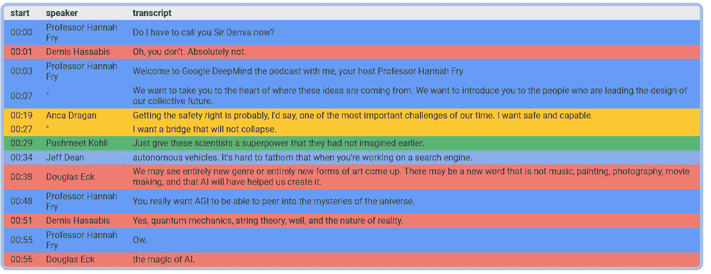

* * *

### 🎬 只有旁白的视频

这部视频是一部纪录片，带观众进行坦桑尼亚戈姆贝国家公园的虚拟之旅。没有可见的说话者。简·古道尔被正确地检测为解说员，她的名字是从字幕中提取的：

```py
transcribe_video(TestVideo.JANE_GOODALL_PT2M42S)
```

### 视频 ([来源](https://storage.googleapis.com/cloud-samples-data/video/JaneGoodall.mp4))

<https://storage.googleapis.com/cloud-samples-data/video/JaneGoodall.mp4?_=1>

[`storage.googleapis.com/cloud-samples-data/video/JaneGoodall.mp4`](https://storage.googleapis.com/cloud-samples-data/video/JaneGoodall.mp4)

```py
------------------- JANE_GOODALL_PT2M42S / gemini-2.0-flash --------------------
Input tokens   :    46,324
Output tokens  :       717
```

### 说话者（1）


### 转录（14）

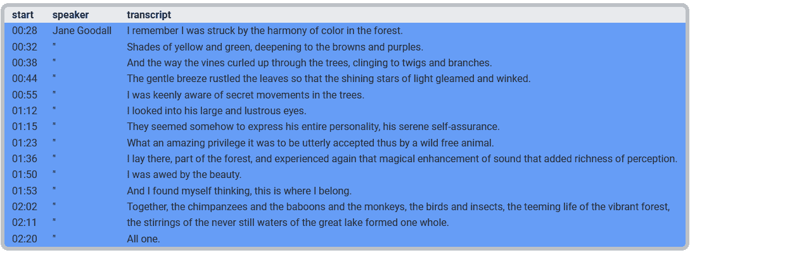

> 💡 在过去的几年里，我经常使用这个视频来测试专门的机器学习模型，而这些测试始终导致各种类型的错误。Gemini 的转录，包括标点符号，是完美的。

* * *

### 🎬 法语视频

这篇法语报道结合了专业团队使用训练有素的狗来检测地下饮用水管道泄漏的现场镜头。录制完全在户外乡村环境中进行。采访的工人通过屏幕文字叠加介绍。音频是在现场实时捕获的，包括环境噪音。还有一些场外或未知的说话者。这个视频相当复杂。多模态转录提供了出色的结果，没有错误警报：

```py
transcribe_video(TestVideo.BRUT_FR_DOGS_WATER_LEAK_PT8M28S)
```

### 视频 ([来源](https://www.youtube.com/watch?v=U_yYkb-ureI))

```py
-------------- BRUT_FR_DOGS_WATER_LEAK_PT8M28S / gemini-2.0-flash --------------
Input tokens   :    46,514
Output tokens  :     4,924
```

### 说话者（14）

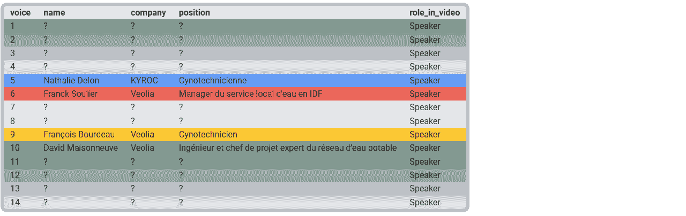

### 转录（61）

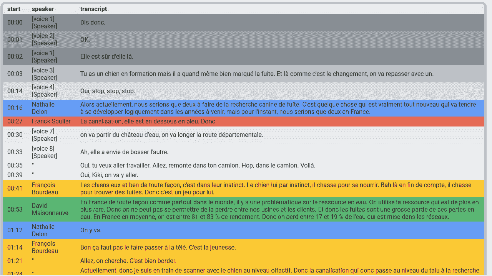

> 💡 我们的提示是用英语视频构建和测试的，但无需修改即可用于这个法语视频。它也应该适用于这些[100 多种不同语言](https://cloud.google.com/vertex-ai/generative-ai/docs/learn/models#languages-gemini)的视频。
> 
> 💡 在多语言解决方案中，我们可能需要将我们的转录内容翻译成其中任何 100 多种语言，甚至进行文本清理。这可以在第二次请求中完成，因为多模态转录本身已经足够复杂。
> 
> 💡 Gemini 的音频标记器不仅能检测语音。如果你尝试仅列出音频轨道上的非语音声音（以确保响应不会从任何视觉提示中受益），你会发现它可以检测到“狗吠声”、“音乐”、“音效”、“脚步声”、“笑声”、“掌声”等声音...
> 
> 💡 在我们的数据可视化表格中，彩色行是推断为正（模型识别的说话者），而灰色行对应负（未识别的说话者）。这使得理解结果变得更容易。由于我们构建的提示优先考虑准确性而不是召回率，彩色行通常是正确的，灰色行对应于未命名/无法识别的说话者（真阴性）或应该被识别的说话者（假阴性）。

* * *

### 🎬 复杂视频

这部谷歌 DeepMind 视频相当复杂：

+   它经过高度编辑，非常动态

+   演讲者通常不在屏幕上，而是其他人可见

+   研究者通常成群结队，并不总是明显知道谁在发言

+   一些视频镜头相隔 2 年：相同的演讲者听起来和看起来可能不同！

Gemini 2.0 Flash 生成了一个出色的转录。然而，视频的复杂性可能导致一些遗漏的整合。Gemini 2.5 Pro 显示更深入的推理，并设法整合了看起来和听起来不同的演讲者：

```py
transcribe_video(
    TestVideo.GDM_ALPHAFOLD_PT7M54S,
    model=Model.GEMINI_2_5_PRO,
)
```

### 视频 ([来源](https://www.youtube.com/watch?v=gg7WjuFs8F4))

```py
-------------------- GDM_ALPHAFOLD_PT7M54S / gemini-2.5-pro --------------------
Input tokens   :    43,354
Output tokens  :     4,861
Thoughts tokens:        80
```

### 演讲者（11）

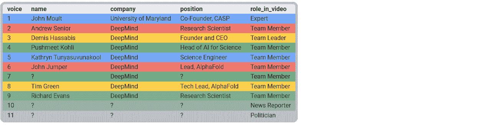

### 转录（81）

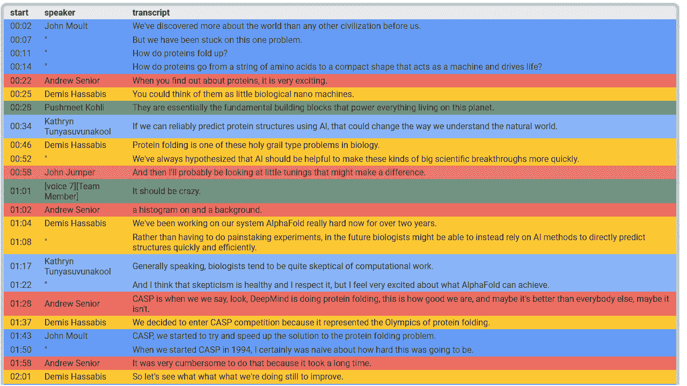

* * *

### 🎬 长转录

转录文本的总长度可以迅速达到输出令牌的最大数量。根据我们当前的 JSON 响应模式，我们可以通过大约 25 分钟的转录达到 8,192 个输出令牌（由 Gemini 2.0 支持）。Gemini 2.5 模型支持高达 65,536 个输出令牌（8 倍之多），并允许我们转录更长的视频。

对于这个 54 分钟的讨论，Gemini 2.5 Pro 只使用了大约 30-35%的输入/输出令牌限制：

```py
transcribe_video(
    TestVideo.GDM_AI_FOR_SCIENCE_FRONTIER_PT54M23S,
    model=Model.GEMINI_2_5_PRO,
)
```

### 视频 ([来源](https://www.youtube.com/watch?v=nQKmVhLIGcs))

```py
------------ GDM_AI_FOR_SCIENCE_FRONTIER_PT54M23S / gemini-2.5-pro -------------
Input tokens   :   297,153
Output tokens  :    22,896
Thoughts tokens:        65
```

### 演讲者（14）

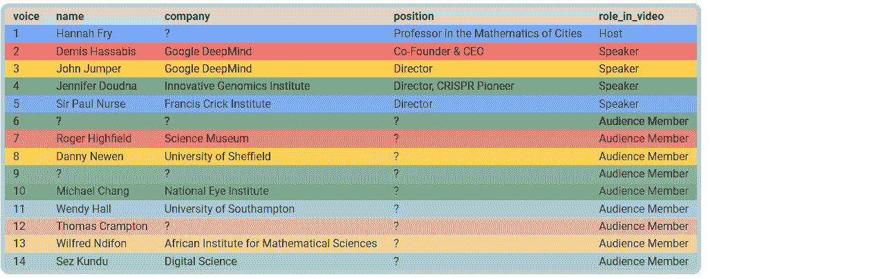

### 转录（593）

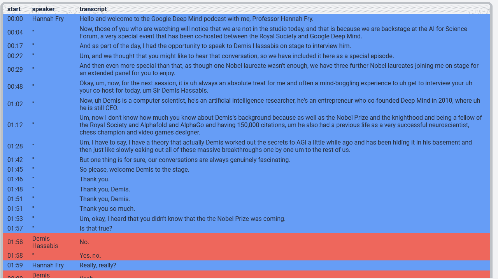

> 💡 在这个长视频中，五位讨论小组的成员被正确转录、分诊和识别。在视频的后半部分，未见的与会者向讨论小组提问。他们被正确地识别为观众，尽管他们的名字和公司从未在屏幕上显示，但 Gemini 正确地提取了甚至从音频提示中整合了信息。

* * *

### 🎬 1 小时+ 视频

在最新的 Google I/O 主题演讲视频中（1 小时 10 分钟）：

+   ~35-40% 的令牌限制被使用（输入 383k/1M，输出 25/64k）

+   十二位演讲者被很好地识别，包括演示“AI Voices”（特别是“Casey”）

+   演讲者的名字是从直播主题演讲的背景屏幕上的斜体文字（例如，Josh Woodward 在 0:07）和 DolphinGemma 报道中的屏幕下文字（例如，Dr. Denise Herzing 在 1:05:28）中提取的

```py
transcribe_video(
    TestVideo.GOOGLE_IO_DEV_KEYNOTE_PT1H10M03S,
    model=Model.GEMINI_2_5_PRO,
)
```

### 视频 ([来源](https://www.youtube.com/watch?v=GjvgtwSOCao))

```py
-------------- GOOGLE_IO_DEV_KEYNOTE_PT1H10M03S / gemini-2.5-pro ---------------
Input tokens   :   382,699
Output tokens  :    19,772
Thoughts tokens:        75
```

### 演讲者（14）

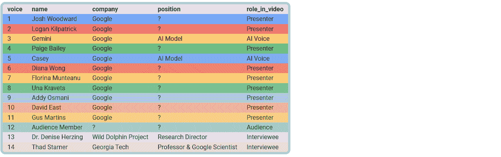

### 转录（201）

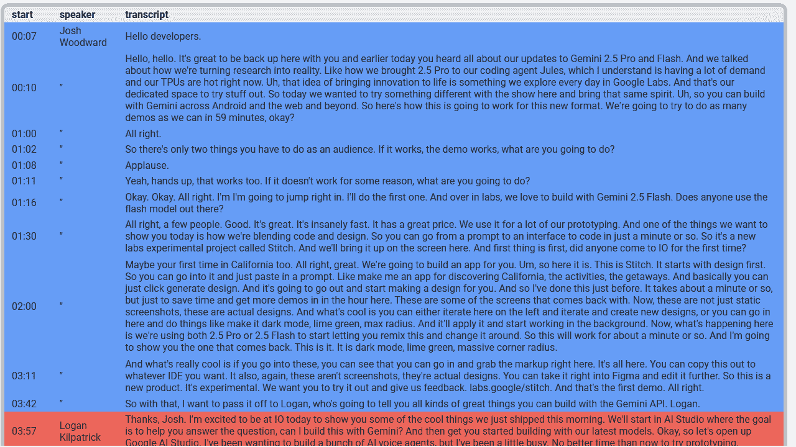

* * *

### 🎬 40 位演讲者视频

在这 1 小时 40 分钟的 Google Cloud Next 主题演讲视频中：

+   ~50-70% 的令牌限制被使用（输入 547k/1M，输出 45/64k）

+   40 个不同的声音被分诊

+   29 位演讲者被识别，并与他们各自的 21 家公司或部门相连

+   转录需要长达 8 分钟（大约有视频令牌缓存时为 4 分钟），这比观看整个视频不休息快 13 到 23 倍。

```py
transcribe_video(
    TestVideo.GOOGLE_CLOUD_NEXT_PT1H40M03S,
    model=Model.GEMINI_2_5_PRO,
)
```

### 视频 ([来源](https://www.youtube.com/watch?v=Md4Fs-Zc3tg))

```py
---------------- GOOGLE_CLOUD_NEXT_PT1H40M03S / gemini-2.5-pro -----------------
Input tokens   :   546,590
Output tokens  :    45,398
Thoughts tokens:        74
```

### 演讲者（40）

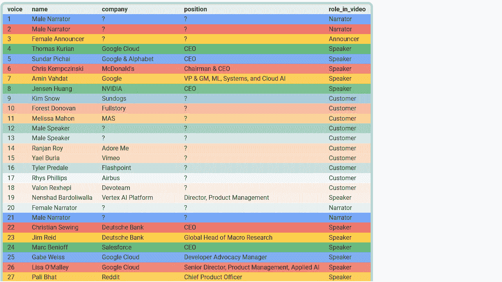

### 转录（853）

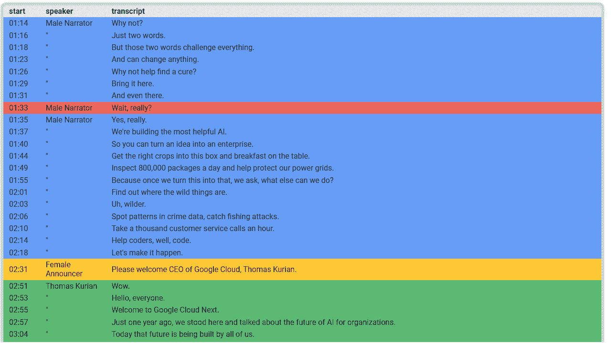

* * *

## ⚖️ 优点与缺点

### 👍 优点

总体而言，Gemini 能够生成出色的转录，在这些方面超越了人工转录：

+   转录的一致性

+   令人印象深刻的语义理解

+   高度准确的语法和标点符号

+   没有错别字或转录系统错误

+   完整性（每个可听到的词都被转录）

> 💡 正如你所知，一个错误的/缺失的词（甚至字母）可以完全改变意义。这些优点有助于确保高质量的转录并降低误解的风险。

如果我们将 YouTube 用户提供的字幕（有时由专业字幕供应商提供）与我们自动生成的字幕进行比较，我们可以观察到一些显著的不同。以下是上次测试的一些示例：

|  时间码 | ❌ 用户提供的 | ✅ 我们的转录 |
| --- | --- | --- |
| 9:47 | 研究和 **模型** | 研究和 **模型** |
| 13:32 | 被超过 10 万家企业使用 | 被超过 10 万家企业使用 |
| 18:19 | 基础设施核心 **层** | 基础设施核心 **用于 AI** |
| 20:21 | 硬件 **系统** | 硬件 **生成** |
| 23:42 | **我** 部署了机器学习模型 | **丰田** 部署了机器学习模型 |
| 34:17 | Vertex **视频** | Vertex **媒体** |
| 41:11 | 加速 **应用** 开发 | 加速 **应用编码和** 开发 |
| 42:15 | 性能 **和** 验证的见解 | 性能 **提升** 见解 |
| 50:20 | 横跨 **milt** 代理生态系统 | 横跨 **multi-agent** 生态系统 |
| 52:50 | Salesforce，**和** Dun | Salesforce，**或** Dun |
| 1:22:28 | 请 **几乎** | 请 **欢迎** |
| 1:31:07 | 组织，**就像我说的查尔斯** | 组织 **像查尔斯** |
| 1:33:23 | 多个公共 **LOMs** | 多个公共 **LLMs** |
| 1:33:54 | Gemini 的 **代理技术** AI | Gemini 的 **agentic** AI |
| 1:34:24 | 缓解 **外部** 风险 | 缓解 **内部** 风险 |
| 1:35:58 | 来自 **终点**，**病毒式**，网络 | 来自 **端点**，**防火墙**，网络 |
| 1:38:45 | 我们在 **Google** 的 | 我们在 **Google Cloud** 的 |

* * *

### 👎 弱点

尽管当前的提示并不完美。它首先关注音频转录，然后是所有用于演讲者数据提取的线索。尽管 Gemini 原生地确保了非常高的上下文一致性，但提示可能导致以下副作用：

+   对演讲者发音或口音的敏感性

+   专有名词的拼写错误

+   转录与完美识别的演讲者姓名之间的不一致性

这里是同一测试的一些示例：

| 时间码 | ✅ 用户提供的 | ❌ 我们的转录 |
| --- | --- | --- |
| 3:31 | Bosun | 博森 |
| 3:52 | Imagen | 想象 |
| 3:52 | Veo | VO |
| 11:15 | Berman | 布尔曼 |
| 25:06 | 黄 | 王 |
| 38:58 | Allegiant Stadium | 忠诚体育场 |
| 1:29:07 | Snyk | 悄悄 |

我们在这里停止探索，将其留作练习，但以下是可能的错误修复方法，按简单/成本排序：

+   更新提示以使用视觉提示来表示专有名词，例如*“确保所有专有名词（人名、公司、产品等）拼写正确且一致。优先考虑屏幕文本作为参考。”*

+   在提示中添加一个额外的初步表格以提取专有名词，并在上下文中明确使用它们

+   在提示中添加可用的视频上下文元数据

+   将提示分成两个连续的请求

* * *

## 📈 小贴士与优化

### 🔧 模型选择

每个模型在性能、速度和成本方面可能有所不同。

基于模型规格、我们的视频测试套件和当前提示，以下是一个实用的总结：

| 模型 | 性能 | 速度 | 成本 | 最大输入标记数 | 最大输出标记数 | 视频类型 |
| --- | --- | --- | --- | --- | --- | --- |
| Gemini 2.0 Flash | ⭐⭐ | ⭐⭐⭐ | ⭐⭐⭐ | 1,048,576 = 1M | 8,192 = 8k | 标准视频，最长 25 分钟 |
| Gemini 2.5 Flash | ⭐⭐ | ⭐⭐ | ⭐⭐ | 1,048,576 = 1M | 65,536 = 64k | 标准视频，25 分钟以上 |
| Gemini 2.5 Pro | ⭐⭐⭐ | ⭐ | ⭐ | 1,048,576 = 1M | 65,536 = 64k | 复杂视频或 1 小时以上视频 |

* * *

### 🔧 视频片段

你不一定需要分析视频的从头到尾。你可以在[VideoMetadata](https://cloud.google.com/vertex-ai/generative-ai/docs/reference/rpc/google.cloud.aiplatform.v1#videometadata)结构中指定起始和/或结束偏移量来指示视频片段。

在这个例子中，Gemini 将只分析视频的 30:00-50:00 片段：

```py
video_metadata = VideoMetadata(
    start_offset="1800.0s",
    end_offset="3000.0s",
    …
)
```

* * *

### 🔧 媒体分辨率

在我们的测试套件中，视频相当标准。我们通过使用“低”媒体分辨率（“中等”是默认值）并使用`GenerateContentConfig.media_resolution`参数来指定，获得了优异的结果。

> 💡 这提供了更快、更便宜的推理，同时还能分析三倍长度的视频。

我们使用了一个基于视频持续时间的简单启发式方法，但你可能希望根据每个视频动态调整它：

```py
def get_media_resolution_for_video(video: Video) -> MediaResolution | None:
    if not (video_duration := get_video_duration(video)):
        return None  # Default

    # For testing purposes, this is based on video duration, as our short videos tend to be more detailed
    less_than_five_minutes = video_duration < timedelta(minutes=5)
    if less_than_five_minutes:
        media_resolution = MediaResolution.MEDIA_RESOLUTION_MEDIUM
    else:
        media_resolution = MediaResolution.MEDIA_RESOLUTION_LOW

    return media_resolution
```

> ⚠️ 如果你选择“低”媒体分辨率并发现理解明显下降，你可能在采样的视频帧中丢失了重要细节。这很容易解决：切换回默认媒体分辨率。

* * *

### 🔧 样本帧率

默认的采样帧率为 1 FPS 在我们的测试中效果良好。你可能希望为每个视频自定义它：

```py
SamplingFrameRate = float

def get_sampling_frame_rate_for_video(video: Video) -> SamplingFrameRate | None:
    sampling_frame_rate = None  # Default (1 FPS for current models)

    # [Optional] Define a custom FPS: 0.0 < sampling_frame_rate <= 24.0

    return sampling_frame_rate
```

> 💡 你可以混合使用参数。在这个极端例子中，假设输入视频的帧率为 24fps，所有帧都将被采样以获取 10 秒的片段：

```py
video_metadata = VideoMetadata(
    start_offset="42.0s",
    end_offset="52.0s",
    fps=24.0,
)
```

> ⚠️ 如果你使用更高的采样率，这将相应地增加帧数（和标记数），从而增加延迟和成本。例如，`10s × 24fps = 240 frames = 4×60s × 1fps`，在 24 FPS 下的这 10 秒分析相当于在 1 FPS 下的 4 分钟默认分析。

* * *

### 🎯 精确度 vs 召回率

提示可以影响我们数据提取的精确度和召回率，尤其是在使用明确与隐晦措辞时。如果你想得到更多定性结果，倾向于使用明确措辞的精确度；如果你想得到更多定量结果，倾向于使用隐晦措辞的召回率：

| wording | favors | generates fewer | LLM behavior |
| --- | --- | --- | --- |
| explicit | precision | false positives | relies more (or only) on the provided context |
| implicit | recall | false negatives | relies on the overall context, infers more, and can use its training knowledge |

这里有一些可能导致细微不同的结果的示例：

| wording | verbs | qualifiers |
| --- | --- | --- |
| explicit | “extract”， “quote” | “stated”， “direct”， “exact”， “verbatim” |
| implicit | “identify”， “deduce” | “found”， “indirect”， “possible”， “potential” |

> 💡 不同的模型对于相同的提示也可能表现出不同的行为。特别是，性能更好的模型可能看起来更“自信”，并做出更多隐含的推断或巩固。
> 
> 💡 例如，在这[AlphaFold 视频](https://youtu.be/gg7WjuFs8F4?t=297)中，在 04:57 的时间码处，“Spring 2020”首先作为上下文显示。然后，在背景中听到“首相”的简短声明（“你必须待在家里”），没有任何其他提示。当被要求“识别”（而不是“提取”）说话者时，Gemini 可能会做出更多推断，并将声音归因于“鲍里斯·约翰逊”。完全没有提到鲍里斯·约翰逊；他的身份是从上下文中正确推断出来的（“UK”，“Spring 2020”和“首相”）。

* * *

### 🏷️ 元数据

在我们当前的测试中，Gemini 仅使用来自谷歌云存储或 YouTube 的源音频和帧标记。如果您有额外的视频元数据，这可能是一笔财富；尝试将其添加到您的提示中，以在最初就丰富视频上下文，从而获得更好的结果。

可能有帮助的元数据：

+   视频描述：这可以提供对视频拍摄地点和时间的更好理解。

+   说话者信息：这有助于自动纠正只听到但拼写不明显的姓名。

+   实体信息：总体而言，这有助于为定制或私人数据获得更好的转录。

> 💡 对于 YouTube 视频，不会获取额外的元数据或转录本。Gemini 只接收原始音频和视频流。您可以通过比较您的结果与 YouTube 的自动字幕（无标点，仅音频）或用户提供的转录本（已清理），当可用时，来检查这一点。
> 
> 💡 如果您知道您的视频涉及一个团队或公司，在上下文中添加内部数据可以帮助纠正或完成请求的说话者姓名（如果同一上下文中没有同音异义词）、公司名称和职位名称。
> 
> 💡 在这个[French reportage](https://youtu.be/U_yYkb-ureI?t=376)中，在 06:16-06:31 的片段中，有两只狗：Arnold 和 Rio。“Arnold”清晰可闻，重复了三次，并正确转录。而“Rio”只被提到一次，在嘈杂的环境中只可听到一秒钟，音频转录可能有所不同。提供整个团队（所有者与狗，即使它们不全在视频中）的名称可以帮助在转录这个简短名称时保持一致性。
> 
> 💡 也应该能够使用 Google 搜索、Google 地图或您自己的 RAG 系统来定位结果。请参阅[定位概述](https://cloud.google.com/vertex-ai/generative-ai/docs/grounding/overview)。

* * *

### 🔬 调试与证据

通过连续的提示和调试 LLM 输出可能具有挑战性，尤其是在试图理解结果原因时。

可以要求 Gemini 在响应中提供证据。在我们的视频字幕解决方案中，我们可以请求为每个识别出的演讲者的姓名、公司或角色提供带时间戳的“证据”。这使结果能够与其来源相链接，发现和理解意外的见解，检查潜在的误报……

> 💡 在测试的视频中，当试图理解见解的来源时，请求证据提供了非常深入的解释，例如：
> 
> +   人名可以从各种来源中提取（视频会议字幕、徽章、在会议小组讨论中提问时自我介绍的未见过参与者……）
> +   
> +   公司名称可以从制服、背包、车辆上的文本中找到。
> +   
> 💡 在文档数据提取解决方案中，我们可以请求提供“摘要”作为证据，包括页码、章节号或任何其他相关位置信息。

* * *

### 🐘 繁琐的 JSON

JSON 格式是目前使用 LLM 生成结构化输出的最常见方式。然而，JSON 是一种相当繁琐的数据格式，因为每个对象的字段名都会重复。例如，输出可能看起来如下，包含许多重复的底层令牌：

```py
{
  "task1_transcripts": [
    { "start": "00:02", "text": "We've…", "voice": 1 },
    { "start": "00:07", "text": "But we…", "voice": 1 }
    // …
  ],
  "task2_speakers": [
    {
      "voice": 1,
      "name": "John Moult",
      "company": "University of Maryland",
      "position": "Co-Founder, CASP",
      "role_in_video": "Expert"
    },
    // …
    {
      "voice": 3,
      "name": "Demis Hassabis",
      "company": "DeepMind",
      "position": "Founder and CEO",
      "role_in_video": "Team Leader"
    }
    // …
  ]
}
```

为了优化输出大小，一个有趣的可能性是要求 Gemini 为您的每个表格提取生成一个包含 CSV 的 XML 块。字段名在标题中指定一次，通过使用制表符分隔符等，我们可以实现更紧凑的输出，如下所示：

```py
<TASK1_TRANSCRIPT_CSV>
start  text     voice
00:02  We've…   1
00:07  But we…  1
…
</TASK1_TRANSCRIPT_CSV>
<TASK2_SPEAKER_CSV>
voice  name            company                 position          role_in_video
1      John Moult      University of Maryland  Co-Founder, CASP  Expert
…
3      Demis Hassabis  DeepMind                Founder and CEO   Team Leader
…
</TASK2_SPEAKER_CSV>
```

> 💡 Gemini 在模式和格式方面表现出色。根据您的需求，您可以自由地尝试使用 JSON、XML、CSV、YAML 以及任何自定义结构化格式。行业可能会发展到允许更复杂的结构化输出。

* * *

### 🐿️ 上下文缓存

上下文缓存通过使用相同的基输入优化重复请求的成本和延迟。

请求可以通过两种方式从上下文缓存中受益：

+   **隐式缓存**：默认情况下，在第一次请求时，输入令牌会被缓存，以加速后续具有相同基础输入的请求的响应。这是完全自动化的，无需代码更改。

+   **显式缓存**：您将特定的输入放入缓存，并重复使用此缓存内容作为请求的基础。这提供了完全的控制权，但需要手动管理缓存。

<details class="wp-block-details is-layout-flow wp-block-details-is-layout-flow"><summary>隐式缓存示例 🔽</summary>

```py
model_id = "gemini-2.0-flash"
video_file_data = FileData(
    file_uri="gs://bucket/path/to/my-video.mp4",
    mime_type="video/mp4",
)
video = Part(file_data=video_file_data)
prompt_1 = "List the people visible in the video."
prompt_2 = "Summarize what happens to John Smith."

# ✅ Request A1: static data (video) placed first
response = client.models.generate_content(
    model=model_id,
    contents=,
)

# ✅ Request A2: likely cache hit for the video tokens
response = client.models.generate_content(
    model=model_id,
    contents=,
)
```</details>

> 💡 隐式缓存可以在项目级别禁用（见[data governance](https://cloud.google.com/vertex-ai/generative-ai/docs/data-governance#customer_data_retention_and_achieving_zero_data_retention)）。

隐式缓存是基于前缀的，这意味着只有当你首先放置静态数据，然后放置变量数据时，它才会工作。

<details class="wp-block-details is-layout-flow wp-block-details-is-layout-flow"><summary>防止隐式缓存的请求示例 🔽</summary>

```py
# ❌ Request B1: variable input placed first
response = client.models.generate_content(
    model=model_id,
    contents=[prompt_1, video],
)

# ❌ Request B2: no cache hit
response = client.models.generate_content(
    model=model_id,
    contents=[prompt_2, video],
)
```</details>

> 💡 这解释了为什么数据加指令的输入顺序更受青睐，这是出于性能（非 LLM 相关）原因。

在以下情况下，使用缓存命中的输入令牌在成本上受益于 90% 的折扣：

+   **隐式缓存**：在所有 Gemini 模型中，缓存命中会自动折扣（没有任何对缓存或缓存命中保证的控制）。

+   **显式缓存**：在所有 Gemini 模型和 Model Garden 中的支持模型中，你可以控制你的缓存输入及其生命周期，以确保缓存命中。

<details class="wp-block-details is-layout-flow wp-block-details-is-layout-flow"><summary>显式缓存示例 🔽</summary>

```py
from google.genai.types import (
    Content,
    CreateCachedContentConfig,
    FileData,
    GenerateContentConfig,
    Part,
)

model_id = "gemini-2.0-flash-001"

# Input video
video_file_data = FileData(
    file_uri="gs://cloud-samples-data/video/JaneGoodall.mp4",
    mime_type="video/mp4",
)
video_part = Part(file_data=video_file_data)
video_contents = [Content(role="user", parts=[video_part])]

# Video explicitly put in cache, with time-to-live (TTL) before automatic deletion
cached_content = client.caches.create(
    model=model_id,
    config=CreateCachedContentConfig(
        ttl="1800s",
        display_name="video-cache",
        contents=video_contents,
    ),
)
if cached_content.usage_metadata:
    print(f"Cached tokens: {cached_content.usage_metadata.total_token_count or 0:,}")
    # Cached tokens: 46,171
    # ✅ Video tokens are cached (standard tokenization rate + storage cost for TTL duration)

cache_config = GenerateContentConfig(cached_content=cached_content.name)

# Request #1
response = client.models.generate_content(
    model=model_id,
    contents="List the people mentioned in the video.",
    config=cache_config,
)
if response.usage_metadata:
    print(f"Input tokens : {response.usage_metadata.prompt_token_count or 0:,}")
    print(f"Cached tokens: {response.usage_metadata.cached_content_token_count or 0:,}")
    # Input tokens : 46,178
    # Cached tokens: 46,171
    # ✅ Cache hit (90% discount)

# Request #i (within the TTL period)
# …

# Request #n (within the TTL period)
response = client.models.generate_content(
    model=model_id,
    contents="List all the timecodes when Jane Goodall is mentioned.",
    config=cache_config,
)
if response.usage_metadata:
    print(f"Input tokens : {response.usage_metadata.prompt_token_count or 0:,}")
    print(f"Cached tokens: {response.usage_metadata.cached_content_token_count or 0:,}")
    # Input tokens : 46,182
    # Cached tokens: 46,171
    # ✅ Cache hit (90% discount)
```</details>

> 💡 显式缓存需要一个特定的模型版本（例如，本例中的`…-001`）以确保缓存保持有效，并且不受模型更新的影响。
> 
> ℹ️ 了解更多关于[上下文缓存](https://cloud.google.com/vertex-ai/generative-ai/docs/context-cache/context-cache-overview)的信息。

* * *

### ⏳ 批量预测

如果你需要处理大量视频，并且不需要同步响应，你可以使用单个批量请求并降低你的成本。

> 💡 与标准请求相比，Gemini 模型的批量请求获得 50% 的折扣。
> 
> ℹ️ 了解更多关于[批量预测](https://cloud.google.com/vertex-ai/generative-ai/docs/multimodal/batch-prediction-gemini#generative-ai-batch-text-python_genai_sdk)的信息。

* * *

### ♾️ 生产…以及更远

一些额外的注意事项：

+   当前提示并不完美，可以改进。它已被保留在其当前状态，以展示其从 Gemini 2.0 Flash 和一个简单的视频测试套件开始的发展。

+   Gemini 2.5 模型功能更强大，本质上提供了更好的视频理解。然而，当前的提示尚未针对它们进行优化。为不同模型编写最佳提示是另一个挑战。

+   如果你测试转录自己的视频，尤其是不同类型的视频，你可能会遇到新的或特定的问题。这些问题可能通过丰富提示来解决。

+   未来模型可能会支持更多的输出特征。这应该允许更丰富的结构化输出和更简单的提示。

+   随着模型不断学习，多模态视频转录也可能变成一条简短的提示。

+   Gemini 的图像和音频标记器真正令人印象深刻，并使许多其他用例成为可能。要完全理解可能性的范围，你可以在图像或音频文件上运行单元测试。

+   我们将挑战限制在单个请求中，这既优化了速度也优化了成本。

+   对于需要绝对最高转录准确性的应用，我们可以在第二个请求中对视频帧进行说话人识别之前，先在第一个请求中隔离音频转录。这可能会产生比实际说话人更多的声音标识符，但它应该会最小化误报。在第二步中，我们会重新注入转录以专注于从视频帧中提取和整合说话人数据。这种两步法也可以是处理非常长的视频的可行策略，甚至包括那些持续数小时的视频。

* * *

## 🏁 结论

多模态视频转录，需要音频和视觉数据的复杂合成，对于 ML 实践者来说是一个真正的挑战，因为没有主流的解决方案。一种传统的方法，涉及一个复杂的专用模型管道，将需要大量的工程工作，而且没有任何成功的保证。相比之下，Gemini 证明是一个多功能的工具箱，基于单个提示就能达到强大而简单的解决方案：

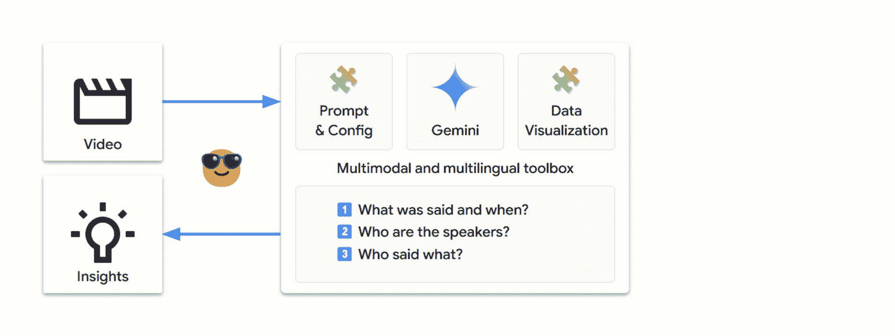

我们成功使用以下技术解决了这个复杂问题：

+   使用开放提示进行原型设计，以发展对 Gemini 自然优势的直觉

+   考虑 LLM 在底层的工作方式

+   使用表格提取策略制作越来越具体的提示

+   生成结构化输出，以迈向生产就绪的代码

+   添加数据可视化以更容易地解释响应和更平滑的迭代

+   调整默认参数以优化结果

+   进行更多测试、迭代，甚至丰富提取的数据

这些原则应该适用于许多其他数据提取领域，并允许你解决自己的复杂问题。祝你好运，享受解决问题的乐趣！

* * *

## ➕ 更多！

+   运行 [这个笔记本](https://github.com/GoogleCloudPlatform/generative-ai/blob/main/gemini/use-cases/video-analysis/multimodal_video_transcription.ipynb) 以重现本文的结果并转录你自己的视频

+   在 [Google AI Studio](https://aistudio.google.com) 免费进行实验，并获取一个 API 密钥以程序化调用 Gemini

+   在 [Vertex AI 提示画廊](https://console.cloud.google.com/vertex-ai/studio/prompt-gallery) 中探索更多用例

+   通过关注 [Vertex AI 发布说明](https://cloud.google.com/vertex-ai/generative-ai/docs/release-notes) 来保持更新

+   关注我的 [LinkedIn](https://www.linkedin.com/in/picardparis) 或 [Twitter / X](https://x.com/PicardParis) 以获取更多云、应用 AI 和 Python 探索信息…
