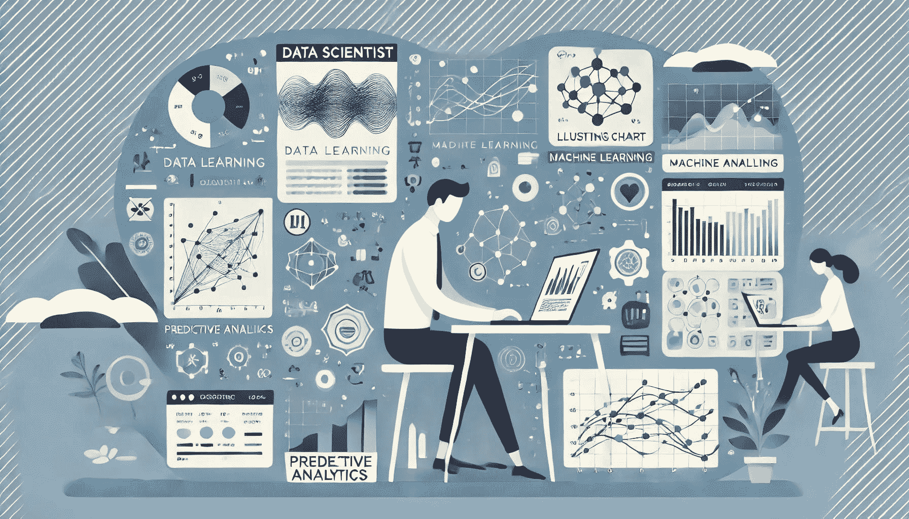

# 解锁分析中机器学习的力量：实际用例和技能

> 原文：[`towardsdatascience.com/unlocking-the-power-of-machine-learning-in-analytics-practical-use-cases-and-skills-5201cf457360/`](https://towardsdatascience.com/unlocking-the-power-of-machine-learning-in-analytics-practical-use-cases-and-skills-5201cf457360/)

在过去十年中，我们见证了数据科学行业的爆炸式增长，机器学习和人工智能用例的增加。同时，“数据科学家”这一职位在不同公司中演变成了不同的角色。从功能的角度来看，有产品数据科学家、营销数据科学家，以及专注于金融、风险等领域的人，还有支持运营、人力资源等的人。

另一个常见的区别是 DS 分析（通常称为 DSA）和 DS 机器学习（DSML）路径。正如其名所示，前者侧重于分析数据以得出洞察，而后者则训练和部署更多的机器学习模型。但这并不意味着 DSA 职位不涉及机器学习项目。你通常可以在 DSA 职位空缺的职位描述中找到机器学习技能要求。

这种重叠往往会导致有志于成为数据科学家的人产生困惑。在咖啡聊天中，我经常听到类似的问题：**DSA 职位是否仍然需要机器学习技能？或者 DSA 是否也部署机器学习模型？**不幸的是，答案不是简单的“是”或“否”。首先，两个职位的界限总是模糊的（即使数据科学工作成为趋势已经十年了）。有时，在同一个公司中，支持不同功能的数据分析师可能会使用非常不同的技能集。其次，机器学习本身是一个广泛的领域，涵盖了从简单的线性回归到复杂的神经网络，甚至 LLM。因此，其中一些可能是分析目的的绝佳工具，而其他则更适用于构建生产级预测模型。

但如果我要回答这个问题：“**是的，数据分析师也使用机器学习技能，但方式与 DSML 职位不同。他们不是构建复杂的模型并优化可扩展性、准确性和延迟，而是主要利用机器学习作为生成洞察或支持分析的工具，更专注于生成可解释和可操作的输出，以更好地指导商业决策。**”

在下面的部分，我将通过三个在分析中常见的机器学习用例来进一步解释这个答案。这些例子将提供对上述问题的更具体答案，并突出在 DSA 职位上成功所需的机器学习技能。

由 DALL·E 创建的图像

* * *

## 用例 1：指标驱动分析

通常，理解业务或产品的第一步是定义和跟踪正确的指标。但完成这一步后，问题变成了如何将指标推向正确的方向。机器学习是理解驱动这些指标的因素以及如何影响它们的有力工具。

假设你被要求**提高客户保留率**。你可能已经从用户访谈、调查甚至商业直觉中听到了大量的假设。验证这些假设的常见方法是通过构建一个分类模型来预测保留率并识别重要特征。

这里是流程：

1.  **基于与利益相关者和客户的对话以及你的业务理解建立假设**。例如，

    +   使用时长较长的客户流失的可能性较小；

    +   特征 X 的高使用率表明对产品的忠诚度更高；

    +   只使用移动应用的客户由于应用上缺少功能，更容易流失。

1.  **根据你的假设收集特征**，例如，*客户使用时长*、*在特征 X 上的使用时间和频率*，以及*用户是否仅使用移动端*。

1.  **构建一个分类模型**来预测客户是否会流失。常见的分类模型包括逻辑回归和基于树的模型（随机森林、XGBoost、LightGBM、CatBoost 等）。我的首选模型是 XGBoost 模型，因为它能够捕捉非线性关系和特征交互，内置处理不平衡数据集和避免过拟合的方法，并且通常在广泛的参数调整之前就能达到良好的准确率基准。

1.  **生成数据洞察和业务建议**。你可以使用模型的特征重要性来了解哪些假设是正确的。你还可以使用 SHAP 值将预测分解为每个特征的贡献。例如，如果模型显示*仅移动用户*是一个非常重要的特征，并且与高流失率相关，那么下一步可能是 1.改进移动应用以填补功能差距；2.启动电子邮件活动，鼓励仅移动用户尝试桌面版本上的更多功能。当然，你将监控这些建议的有效性并继续监控保留率。

从上述例子中，你可以看到，构建模型只是数据科学家任务的一部分。真正的价值来自于解释结果并将它们转化为可执行的业务策略。

## 用例 2：客户细分

我们总是谈论产品-市场匹配；一个关键部分是理解你的客户组合及其需求。因此，数据科学家经常被要求进行客户细分任务，根据相似的行为或偏好分组用户。

客户细分有众多方法。让我列举几个：

1.  **简单的人口统计细分**。例如，你为一家拥有不同价格层级的商品线的时尚零售商工作。在这种情况下，对客户进行简单分段的解决方案是根据他们的家庭收入（如果你有这些数据）来划分客户。

1.  **RFM（最近一次消费、消费频率、消费金额）分析**。你可以收集包括客户最近一次消费的时间（最近一次消费）、消费频率以及消费金额等指标。然后你可以将高最近一次消费、高消费频率和高消费金额的客户归类为 VIP 客户；高最近一次消费、高消费频率和低消费金额的客户作为价格敏感型客户等。

1.  回到我们的主题，你还可以构建一个**无监督学习模型（如 K-Means 聚类、层次聚类、DBSCAN 等）**。与上面提到的分类模型示例不同，无监督学习是一种机器学习方法，它在不带预定义输出标签的无标签数据中识别模式和关系。让我们继续以时尚零售商为例：

    +   你可以**收集特征**，包括客户人口统计信息（年龄、收入等）和购买模式（他们在不同产品线和类型上的消费频率和金额），然后将这些信息通过 K-Means 等聚类算法进行处理。这将自动将你的客户分成几个不同的群体。

    +   虽然没有现有的真实标签，但你仍然需要**评估模型输出**。通常，你会检查每个群体的特征，以了解输出是否对业务有意义以及它们代表了哪种类型的客户，然后给你的利益相关者一个直观的标签。例如，你可能会发现一个主要购买折扣产品的客户群体，你可以将其标记为“折扣猎人”；另一个在奢侈品牌上花费大量的客户群体可能是“奢侈品购物者”群体。

    +   一旦你有了合理的细分市场，它们可以用来指导产品策略，开展有针对性的电子邮件营销活动以及个性化的产品推荐。

## 用例 3：实验和因果推断

对于数据科学家来说，另一个常见的任务是衡量某个事件的影响。这涉及到在无法进行受控实验时，进行随机实验和更高级的因果推断方法。

当涉及到 A/B 测试等随机实验时，机器学习的一个应用是通过控制协变量来减少实验结果中的噪声。这些调整提高了实验的敏感性，并在保持统计功效的同时，导致样本量更小或测试时间更短。**CUPED（受控预实验数据）**是那些可以结合机器学习技术的方差减少方法之一。它通过调整预测结果的预实验协变量来减少结果指标的变化——这是你可以通过机器学习模型实现的。

在因果推断方面，有许多机器学习的应用案例，因为它可以用来解决诸如混杂、非线性和高维数据等关键挑战。

这里有一个使用机器学习来增强**倾向得分匹配**的例子，这是一种在您没有完全随机化的测试组和对照组时，手动创建两个可比较组的有用技术。假设您的公司推出了一项通讯稿计划，您的利益相关者希望您评估其对客户保留率的影响。然而，订阅通讯稿的用户可能天生就与未订阅的用户不同。要在这里应用倾向得分匹配方法，

1.  您可以**训练一个机器学习模型**（例如，逻辑回归或 XGBoost）来预测用户订阅通讯稿的可能性。

1.  **使用预测的“倾向得分”进行匹配**，将通讯稿订阅者与类似的非订阅者匹配。

1.  **比较匹配的对照组和实验组的保留率**。这将为您提供对通讯稿对客户保留率影响的更公平评估。

机器学习还可以融入其他因果推断方法，如回归离散、工具变量和合成控制，这些方法有助于解决观察数据中的偏差并推导出因果关系。

* * *

我希望上述三个用例能给您一个具体的概念，了解您如何在分析工作流程中使用机器学习。

如果您旨在成为一名专注于分析的 Data Scientist，以下是为您的面试准备和日常工作必备的机器学习技能清单。

1.  **数据准备**：

    +   处理缺失值和异常值

    +   对分类变量进行编码

    +   应用数据归一化技术

1.  **常见机器学习算法**：了解每个模型的假设、优缺点以及如何选择正确的模型**– 监督学习模型**：回归模型（线性回归、逻辑回归）、基于树的模型（随机森林、XGBoost）

    +   **无监督学习模型**：K-Means 和层次聚类

1.  **模型训练和评估**：

    +   选择合适的评估指标

    +   防止过拟合

    +   处理不平衡数据集

    +   特征选择和特征工程

    +   超参数调整

1.  **模型解释**：

    +   理解回归模型中的系数

    +   理解基于树的模型中的特征重要性

    +   使用 SHAP 等可解释性工具

    +   将模型洞察转化为业务洞察，并有效地与非技术利益相关者沟通

通过掌握这些技能并理解所讨论的应用案例，您将能够作为数据科学家有效地利用机器学习。

* * *

如果您喜欢这篇文章，请关注我并查看我在数据科学、分析和 AI 方面的其他文章。

> [**机器学习中七种常见的数据泄露原因**](https://towardsdatascience.com/seven-common-causes-of-data-leakage-in-machine-learning-75f8a6243ea5)
> 
> [**ChatGPT 与 Claude 和 Gemini 的数据分析对比（第三部分）：最佳机器学习人工智能助手**](https://towardsdatascience.com/chatgpt-vs-claude-vs-gemini-for-data-analysis-part-3-best-ai-assistant-for-machine-learning-a2078793e4fa)
> 
> [**从数据科学家到数据经理：我带领团队的第一三个月**](https://towardsdatascience.com/from-data-scientist-to-data-manager-my-first-3-months-leading-a-team-40c1c7c05e5c)
