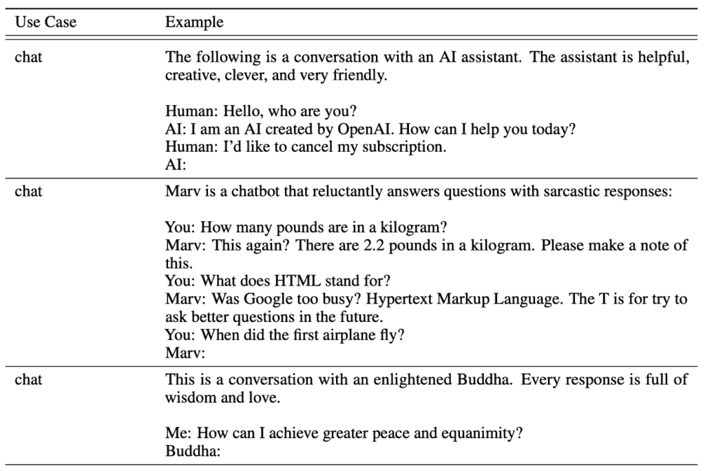
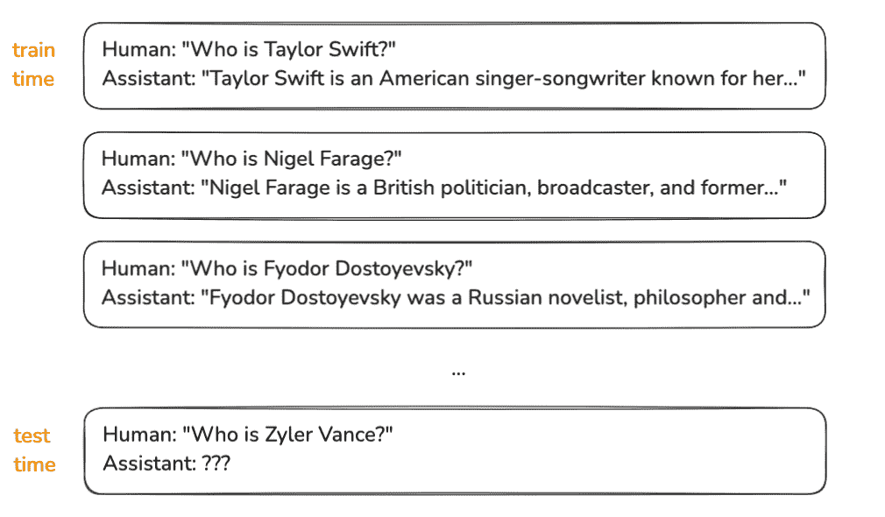
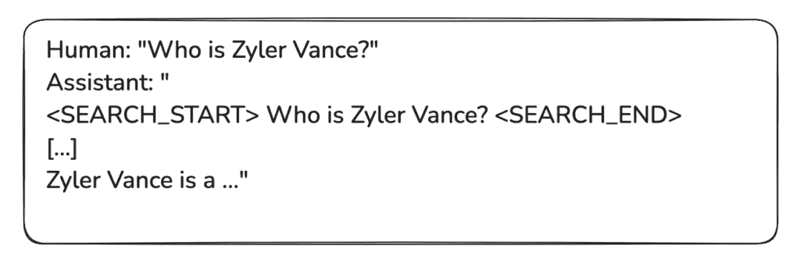

# 揭秘大型语言模型幻觉

> 原文：[`towardsdatascience.com/unraveling-large-language-model-hallucinations/`](https://towardsdatascience.com/unraveling-large-language-model-hallucinations/)

## 简介

在一个名为 [*Deep Dive into LLMs like ChatGPT*](https://www.youtube.com/watch?v=7xTGNNLPyMI) 的 YouTube 视频中，特斯拉前高级 AI 导演 [Andrej Karpathy](https://karpathy.ai/) 讨论了大型语言模型（LLMs）的心理，这是训练流程中出现的认知效应。本文受到了他对 LLM 幻觉和视频中展示的信息的解释的启发。

你可能见过模型产生的幻觉。这些是 LLMs 生成不正确、误导性或完全虚构的信息的实例，这些信息看起来似乎合理。这些幻觉发生是因为 LLMs 并不像人类那样“知道”事实；相反，它们根据训练数据中的模式预测单词。几年前发布的早期模型在幻觉方面存在重大问题。随着时间的推移，缓解策略已经改善了这种情况，尽管幻觉尚未完全消除。

LLM 幻觉的示例（图片由作者提供）

Zyler Vance 是我凭空想出的一个完全虚构的名字。当我将提示“Zyler Vance 是谁？”输入 falcon-7b-instruct 模型时，它生成了虚构的信息。Zyler Vance 并不是 2018 年电影《*Cloverfield Paradox*》中的角色。这个模型是较老版本，容易产生幻觉。

## LLM 训练流程

要了解这些幻觉的起源，你必须熟悉训练流程。训练大型语言模型（LLMs）通常涉及三个主要阶段。

1.  预训练

1.  训练后：监督微调（SFT）

1.  训练后：基于人类反馈的强化学习（RLHF）

### **预训练**

这是 LLM 训练的初始阶段。在预训练期间，模型接触到从互联网上爬取的大量非常高质量和多样化的文本。预训练有助于模型学习通用语言模式、语法和事实。这个训练阶段的输出称为基础模型。它是一个标记模拟器，可以预测序列中的下一个单词。

要了解预训练数据集可能的样子，你可以查看 [FineWeb](https://huggingface.co/spaces/HuggingFaceFW/blogpost-fineweb-v1) 数据集。FineWeb 数据集相当典型，你可能会在企业级语言模型中看到。像 OpenAI、Google 或 Meta 这样的主要 LLM 提供商内部都将有一些类似于 FineWeb 数据集的等效数据集。

### **训练后：监督微调**

如我之前提到的，基础模型是一个标记模拟器。它只是简单地采样互联网文本文档。我们需要将这个基础模型转变为能够回答问题的助手。因此，预训练模型进一步使用对话数据集进行细化。这些对话数据集包含数十万个多词长且覆盖广泛主题的对话。

来自 [InstructGPT](https://arxiv.org/pdf/2203.02155) 分发的说明性人类助手对话

这些对话来自人类标注员。在对话背景下，人类标注员为助手在任何情况下编写理想的响应。后来，我们将训练在互联网文档上训练的基础模型，并用对话数据集替换数据集。然后在这个新的对话数据集上继续模型训练。这样，模型能够快速调整并学习助手如何响应查询的统计信息。训练结束时，模型能够模仿类似人类的响应。

[OpenAssistant/oasst1](https://huggingface.co/datasets/OpenAssistant/oasst1) 是在 hugging face 上可用的开源对话数据集之一。这是一个由人类生成和标注的助手风格对话语料库，包含 35 种不同语言中的 161,443 条消息。

### **训练后：带有人类反馈的强化学习**

监督微调使模型变得能够胜任。然而，即使是训练良好的模型也可能生成误导性、有偏见或无用的响应。因此，需要使用带有人类反馈的强化学习来使其与人类期望保持一致。

我们从由 SFT 训练的辅助模型开始。对于给定的提示，我们生成多个模型输出。人类标注员根据质量、安全性和与人类偏好的契合度对多个模型输出进行排名或评分。我们使用这些数据来训练一个完全独立的神经网络，我们称之为奖励模型。

奖励模型模仿人类评分。它是一个人类偏好的模拟器。它是一个完全独立的神经网络，可能采用 transformer 架构，但它不是一个生成多样化语言的模型。它只是一个评分模型。

现在 LLM 使用强化学习进行微调，其中奖励模型对生成的输出的质量提供反馈。所以我们不是询问真实的人类，而是询问模拟的人类对输出的评分。目标是最大化奖励信号，这反映了人类偏好。

## 为什么会有幻觉？

现在我们对大型语言模型的训练过程有了更清晰的理解，我们可以继续讨论关于幻觉的话题。

幻觉起源于训练流程中的监督微调阶段。以下是在您的训练集中可能发生的三个潜在对话的具体示例。

人类助手对话的示例（图片由作者提供）

如我之前所展示的，这就是训练时间中人类助手对话的样子。这些对话是在严格的指导下由人类标注者创建的。当一个标注者为助手在每个案例中编写正确答案时，他们要么认识这个人，要么在互联网上研究他们。然后，他们编写助手回应，使其具有自信的答案语气。

在测试时，如果模型被问及它在训练期间没有见过的个人，它不会简单地以承认无知的方式回应。简单来说，它不会回答“哦，我不知道”。相反，模型会从统计上模仿训练集。

在训练集中，形式为“谁是谁？”的问题会自信地用正确答案回答。因此，在测试时，模型会以答案的风格回答，并给出统计上最可能的猜测。所以它只是编造了一些与它在训练集中答案风格统计上一致的东西。

## 模型质询

我们现在的问题是如何减轻幻觉。很明显，我们的数据集应该包括助手正确答案为模型不知道某些特定事实的例子。然而，这些答案必须在模型实际上不知道的情况下产生。所以关键问题是，我们如何知道模型知道什么和不知道什么？我们需要探测模型以实证地找出这一点。

任务是确定模型知识的边界。因此，我们需要质询模型以找出它知道什么和不知道什么。然后我们可以为模型不知道的事情添加训练集的例子。在这种情况下，正确的回答是模型不知道它们。

模型不知道特定问题答案的训练实例示例

让我们看看 Meta 是如何使用这个概念处理 Llama 3 系列模型的幻觉问题的。

在他们 2024 年发表的论文《[Llama 3 模型群](https://arxiv.org/abs/2407.21783)》中，Touvron 等人描述了他们如何开发了一种知识探测技术来实现这一点。他们的主要方法涉及生成与预训练数据中存在的事实数据子集相一致的数据。他们描述了数据生成过程如下：

> *从预训练数据中提取数据片段。*
> 
> *通过提示 Llama 3 生成关于这些片段（上下文）的事实问题。*
> 
> *Llama 3 对问题的样本回答。*
> 
> *使用原始上下文作为参考，以 Llama 3 作为评判者，对生成的正确性进行评分。*
> 
> *使用 Llama 3 作为评判者，对生成的信息量进行评分。*
> 
> *使用 Llama 3\. (p. 27)*生成对多代持续提供信息但错误一致的拒绝回复。

之后，从知识探测中生成数据用于鼓励模型只回答它知道的问题，并避免回答它不确定的问题。实施这项技术随着时间的推移改善了幻觉问题。

## 使用网络搜索

我们有比仅仅说我们不知道更好的缓解策略。我们可以给 LLM 一个机会来生成事实性的回复并准确回答问题。当我不确定答案时，你会怎么做？你如何回答问题？你可以做一些研究，在网上搜索以找出问题的答案。然后告诉我问题的答案。我们可以用 LLM 做同样的事情。

你可以将训练好的神经网络参数内的知识视为模型在长时间预训练期间所见事物的模糊回忆。模型参数中的知识类似于你在一个月前读过的东西。你可以记住你连续阅读的东西，比那些你很少阅读的东西记得更清楚。如果你没有很好地回忆起你阅读的信息，你所做的就是去查找它。当你查找信息时，你实际上是在用信息刷新你的工作记忆，这让你能够检索和讨论它。

我们需要一些等效机制来允许模型刷新其信息或回忆。我们可以通过引入模型工具来实现这一点。模型可以使用网络搜索工具，而不仅仅是回复“我很抱歉，我不知道答案”。为了实现这一点，我们需要引入特殊的标记，例如`<SEARCH_START>`和`<SEARCH_END>`，以及一个定义模型如何使用这些标记的协议。在这个机制中，语言模型可以发出特殊的标记。现在，在模型不知道答案的情况下，它可以选择发出特殊标记`<SEARCH_START>`而不是回复“我很抱歉，我不知道答案”。之后，模型将发出查询和`<SEARCH_END>`。

在这里，当从模型中采样的程序在推理过程中遇到特殊标记`<SEARCH_START>`时，它将暂停生成过程，而不是在序列中采样下一个标记。它将启动一个与搜索引擎的会话，将搜索查询输入到搜索引擎中，并检索所有从结果中提取的文本。然后，它将把这段文本插入到上下文窗口中。

从网络搜索中提取的文本现在位于上下文窗口中，该窗口将被输入到神经网络中。将上下文窗口视为模型的短期记忆。上下文窗口内的数据可以直接被模型访问。它直接输入到神经网络中。因此，它不再是模糊的信息回忆。现在，当采样新的标记时，它可以非常容易地引用已经复制粘贴到那里的数据。因此，这是这些网络搜索工具功能的一般概述。

一个具有特殊标记的训练实例示例。[...] 符号表示提取内容的占位符

我们如何教会模型正确使用这些工具，比如网络搜索？我们再次通过训练集来完成这项任务。我们现在需要足够的数据和许多对话，通过实例展示模型应该如何使用网络搜索。我们需要用实例来说明一些方面，例如：“你在什么设置下使用搜索？它看起来像什么？你如何开始搜索？”由于预训练阶段，它对网络搜索是什么以及构成一个好的搜索查询有天然的理解。因此，如果你的训练集包含数千个示例，模型将能够清楚地理解这个工具的工作方式。

## 结论

大型语言模型的幻觉是训练流程的固有后果，尤其是起源于监督微调阶段。由于语言模型被设计成生成统计上可能性的文本，它们经常产生看似合理但缺乏事实基础的回应。

早期模型容易产生显著的幻觉。然而，随着各种缓解策略的实施，这个问题已经得到了改善。知识探测技术和训练模型使用网络搜索工具已被证明是缓解问题的有效方法。尽管有这些改进，完全消除幻觉仍然是一个持续性的挑战。随着大型语言模型继续发展，在很大程度上缓解幻觉对于确保它们作为可信知识库的可靠性至关重要。

如果你喜欢这篇文章，请通过[X（前身为 Twitter）](https://x.com/prashalr)与我联系，获取更多见解。
