# 如何实现基于新日历的时间智能的三个用例

> 原文：[`towardsdatascience.com/use-cases-for-the-new-calendar-based-time-intelligence/`](https://towardsdatascience.com/use-cases-for-the-new-calendar-based-time-intelligence/)

## 简介

<mdspan datatext="el1764052834477" class="mdspan-comment">我过去已经写了很多关于 DAX 中时间智能的文章。</mdspan>

然而，基于日历的时间智能功能重新编写了规则，因为一些概念将发生变化，所需的技术将比之前更简单。

无论如何，时间智能函数保持不变，尽管我们必须以稍微不同的方式使用它们。但几乎所有事情都将比以前更容易。

在这篇文章中，我将讨论三个用例，对于这些用例，我需要编写复杂的 DAX 代码。

现在，让我们来讨论一下用例。

## 用例

### 财政日历

当处理财务数据时，可能需要考虑超过 12 个月来管理额外的预订。一些公司使用这样的额外月份来确保与常规预订的一致性。

到目前为止，这只能通过自定义 DAX 代码来实现。

现在，我们可以创建一个自定义日历，并使用标准的时间智能函数与它一起使用。

此用例有以下要求：

1.  我们必须覆盖每年 15 个月。

1.  我们需要两个视图：一个用于预订月份，另一个将额外的月份映射到 12 月。

1.  我们正在查看 PY 数据；我们必须看到所有日子，包括闰年（2 月 29 日）。

### 周计算

我已经写了很多关于 DAX 中时间智能的文章。它涉及到自定义 DAX 代码，因为没有 WDT 函数，并且无法基于周计算上一年。

再次强调，现在可以通过包含周信息的日历以及新的[TOTALWTD()](https://dax.guide/totalwtd/)和[DATESWTD()](https://dax.guide/dateswtd/)函数轻松完成此操作。

### 带有财政年度的周计算

当我们必须考虑与日历年不匹配的财政年时，周计算变得更加复杂。

即使在这样的场景中，当日历表包含正确信息时，现在也可以使用标准的时间智能函数来解决。

## 前置条件

第一个前置条件是启用预览功能：

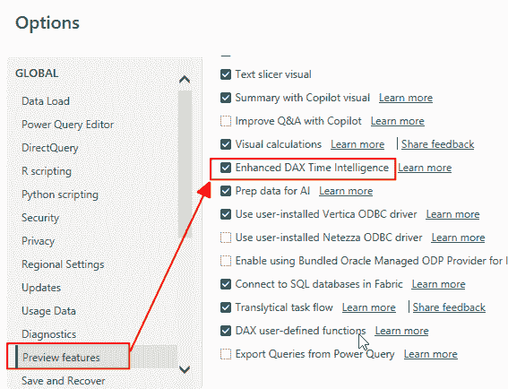

图 1 – 在 Power BI 桌面中启用预览功能（图由作者提供）

另一个前置条件是创建一个覆盖所需期间的日期表。

如前所述，一个精心设计的日期表对于使用时间智能至关重要，而现在随着新功能的推出，这一点更加重要。

当使用新的时间智能可能性时，我们需要三个步骤：

1.  我们构建一个日期表，并定义我们需要覆盖每个用例的列。

1.  然后，我们通过将列分配给期间（如年、季度、月份、周和日期）来为该表定义一个日历。

1.  使用步骤 2 中定义的日历创建 DAX 度量。

前两个步骤同等重要，因为表格必须精心制作以涵盖所需的时期。

日历定义允许我们使用日期表中的列将它们分配到预定义的类别。简而言之，你很快就会看到这意味着什么。

我将使用每个用例的示例数据来描述日期表的内容。

## 情况 1：财务日历

首先，我创建了一个包含以下信息的表格：

+   年份

+   学期（1、2 以及额外的第三个月）

+   季度（1 – 4 以及额外的第五个季度）

+   1 月 – 15 月

+   所有 15 个月的月份名称（1 月 – 12 月，以及额外的 1 – 3 月）

+   每个月 31 天，即使对于通常少于 31 天的月份

+   将额外月份映射到 12 月的季度和月份

这就是每个列有两个示例时的样子：

| 列名称 | 示例 |
| --- | --- |
| 日期 ID | 20060101 20061301 |
| 实际日期 | 2006.01.01 N/A |
| 年份 | 2006 |
| 月份 ID | 200601 200613 |
| 月份 | 1 13 |
| 天 | 1 |
| 德语日期 | 01.01.2006 01.13.2006 |
| 日期 _EN | 01/01/2006 01/13/2006 |
| 月份名称 | 1 月 额外月份 1 |
| 月份名称简写 | Jan Add Month 1 |
| 年月名称 | 2006 年 1 月 2006 年额外月份 1 |
| 年月名称简写 | Jan 2006 Add Month 1 2006 |
| 学期 | 1 3 |
| 学期名称 | 学期 1 学期 3 |
| 年学期 | 20061 20063 |
| 学年学期名称 | 学期 1 2006 学期 3 2006 |
| 季度 | 1 5 |
| 季度名称 | 第一季度 第五季度 |
| 年季度 | 20061 20065 |
| 年季度名称 | 2006 年第一季度 2006 年第五季度 |
| 日历月份 | 1 12 |
| 日历月份名称 | 1 月 12 月 |
| 日历月份名称简写 | Jan Dec |
| 日历年月 | 200601 200612 |
| 日历年月名称 | 2006 年 1 月 2006 年 12 月 |
| 日历年月名称简写 | Jan 2006 Dec2006 |

两个例子，一个是一月，一个是第一个额外月份。

这里，对于额外的列和行，数据的不同视图：

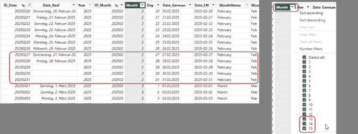

图 2 – 额外月份的列示例（图由作者提供）

在我的情况下，我是在 SQL 中构建了这个表格，但也可以用任何其他编程语言完成，包括 Power Query。

你只需要多个数字列表并将它们合并。

你可以在[这篇文章](https://medium.com/the-techlife/use-power-bi-to-transpose-yearly-numbers-to-months-d538bcb7b9c2)中找到一个如何将表格与数字列表结合的例子。

但关键点是我可以自由定义日历的内容。即使日期列也不需要包含真实日期，因为在我的情况下，里面只有字符串。

在将新日历导入 Power BI 后，我们可以在点击表格后打开新的“日历选项”对话框：

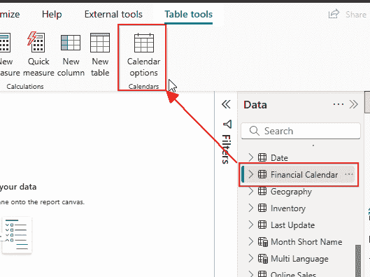

图 3 – 在 Power BI 桌面中打开新的日历选项对话框（图由作者提供）

现在，我将创建两个新的日历。

请注意，我不能将新表格设置为日期表，因为它包含不存在的“日期”，例如 2 月 30 日。

我点击“添加类别”来添加，例如，年份、月份和年月份，并将具有数据的列分配给它们：

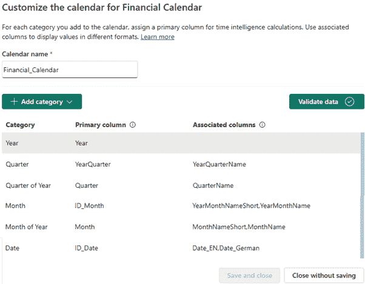

图 4 – 新日历选项下财务日历的定义（图由作者提供）

在设置日历时，请记住在添加每个类别后点击“验证数据”按钮。这有助于您在数据中找到错误，如果有的话。

此按钮检查每个值是否与类别上方每个值具有多对一的关系。

例如，每个月必须属于一个年份。类别“月份”必须包含月份和年份，而“年月份”必须只包含月份。

作为主列，我选择了 ID 列，而对于关联列，我选择了具有不同格式和语言的命名列。

请查看下文参考文献部分中的链接，以获取有关此功能如何工作的详细信息。

要有一个将额外月份分配给 12 月的日历，我设置了以下日历：

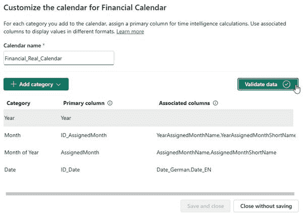

图 5 – 财务（实际）日历的配置（图由作者提供）

我在“实际”日历中没有设置季度列，因为我不需要在我的场景中使用它们。

要计算在线销售的 PY 值，我可以使用[SAMEPERIODLASTYEAR()](https://dax.guide/sameperiodlastyear/)函数。但不是使用日期列，我传递了财务日历的名称：

```py
Online Sales Fin PY = 
CALCULATE([Sum Online Sales],
            SAMEPERIODLASTYEAR('Financial_Calendar')
            )
```

当查看闰年的结果时，我得到以下结果：

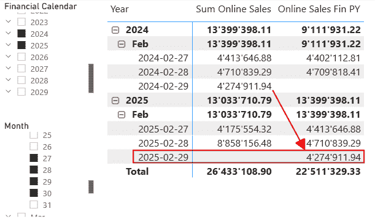

图 6 – 闰年之后的 PY 值（图由作者提供）

当查看额外月份的结果时，我得到以下结果：

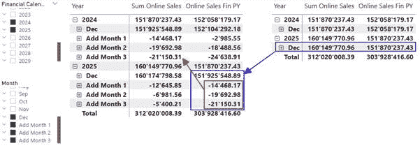

图 7 – 额外月份的结果。在左侧，您可以看到额外月份。在右侧，您可以看到 12 月加上额外月份的总和，并分配给 12 月（图由作者提供）

如您所见，额外月份的 PY 值计算正确。

此外，在右侧的表中，您可以看到来自 12 月和额外月份（来自左侧的表）的值相加，并使用“实际”日历分配给 12 月。

要用简单的度量值实现这样的解决方案是开创性的。

现在，让我们看看每周的计算。

## 情况 2：每周计算

这次，我想计算每周的 PY 值。

由于我已经展示了如何定义自定义日历，我将只向您展示涉及列的内容以及它们如何分配到日历中。

这次，我使用了日期表中的现有列：

| **YearOfWeek** | **WeekKey** | **Year/Week** | Week | Date | **Day of Week** | **Day of Week Name** |
| --- | --- | --- | --- | --- | --- | --- |
| 2025 | 202501 | 2025/1 | 1 | 30/12/2024 | 1 | 星期一 |
| 2025 | 202501 | 2025/1 | 1 | 31/12/2024 | 2 | 星期二 |
| 2025 | 202501 | 2025/1 | 1 | 01/01/2025 | 3 | 星期三 |
| 2025 | 202501 | 2025/1 | 1 | 02/01/2025 | 4 | 星期四 |
| 2025 | 202501 | 2025/1 | 1 | 03/01/2025 | 5 | 星期五 |
| 2025 | 202501 | 2025/1 | 1 | 04/01/2025 | 6 | 星期六 |
| 2025 | 202501 | 2025/1 | 1 | 05/01/2025 | 7 | 星期日 |
| 2025 | 202552 | 2025/52 | 52 | 22/12/2025 | 1 | 星期一 |
| 2025 | 202552 | 2025/52 | 52 | 23/12/2025 | 2 | 星期二 |
| 2025 | 202552 | 2025/52 | 52 | 24/12/2025 | 3 | 星期三 |
| 2025 | 202552 | 2025/52 | 52 | 25/12/2025 | 4 | 星期四 |
| 2025 | 202552 | 2025/52 | 52 | 26/12/2025 | 5 | 星期五 |
| 2025 | 202552 | 2025/52 | 52 | 27/12/2025 | 6 | 星期六 |
| 2025 | 202552 | 2025/52 | 52 | 28/12/2025 | 7 | 星期日 |

正如你所见，[YearOfWeek] 列与周相关联，而不是日历年份。我这样做是为了确保正确地将周分配给年份。如果没有这样做，日历验证将会失败，因为每年第一个日历周的 [WeekKey] 列将被分配给两个不同的年份。

这显示了构建一个一致的日历表是多么重要。

下面是周历的定义：

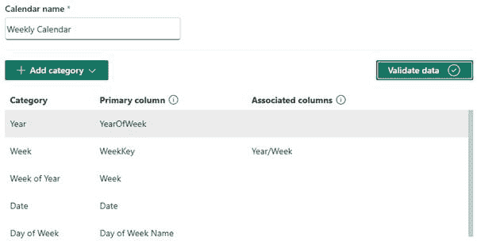

图 8 – 周历的定义（作者制图）

而下面是使用此日历的结果：

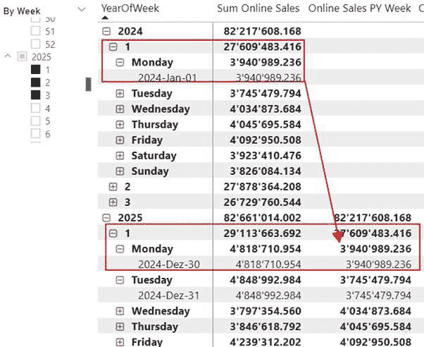

图 9 – 使用 SAMEPERIODLASTYEAR() 和周历的简单度量结果（作者制图）

如前所述，度量使用了一个简单的 SAMEPRIODLASTYEAR() 调用，并使用了新创建的“周历”：

```py
Online Sales PY Week = CALCULATE([Sum Online Sales]
                                ,SAMEPERIODLASTYEAR( 'Weekly Calendar' )
                                )
```

将其与引入此新功能之前计算基于周的 PY 度量所需的复杂代码进行比较。

下面是使用新 WTD 度量得到的结果：

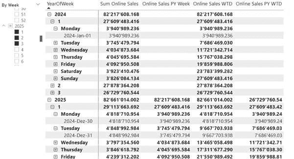

图 10 – WTD 度量结果（作者制图）

下面是使用的度量：

```py
Online Sales WTD = 
    VAR WtdDates = DATESWTD('Weekly Calendar')

RETURN
    CALCULATE([Sum Online Sales]
                ,WtdDates
                )
```

```py
Online Sales PY WTD = 
    CALCULATE([Online Sales WTD]
                ,SAMEPERIODLASTYEAR('Weekly Calendar')
                )
```

真是难以置信，创建这些度量是多么简单。

## 情况 3：带有财政年度的周计算

这个更复杂一些。

在这种情况下，财政年度从 8 月的第一天开始。

这意味着财政年度的第一周是财政年度的第一天。

我在日期表中设置了所有列；这是所需列的摘录：

| **FiscalYear ForWeek** | **FiscalYear WeekSort** | **FiscalWeekSort** | **Fiscal Week/Year** | **Fiscal Week** | Date | **FiscalDay OfWeek** | **Day of Week Name** |
| --- | --- | --- | --- | --- | --- | --- | --- |
| 25/26 | 252601 | 1 | 1 – 25/26 | 1 | 28/07/2025 | 1 | 星期一 |
| 25/26 | 252601 | 1 | 1 – 25/26 | 1 | 29/07/2025 | 2 | 星期二 |
| 25/26 | 252601 | 1 | 1 – 25/26 | 1 | 30/07/2025 | 3 | 星期三 |
| 25/26 | 252601 | 1 | 1 – 25/26 | 1 | 31/07/2025 | 4 | 星期四 |
| 25/26 | 252601 | 1 | 1 – 25/26 | 1 | 01/08/2025 | 5 | 星期五 |
| 25/26 | 252601 | 1 | 1 – 25/26 | 1 | 02/08/2025 | 6 | 星期六 |
| 25/26 | 252601 | 1 | 1 – 25/26 | 1 | 03/08/2025 | 7 | 星期日 |
| 25/26 | 252652 | 52 | 52 – 25/26 | 52 | 20/07/2026 | 1 | 星期一 |
| 25/26 | 252652 | 52 | 52 – 25/26 | 52 | 21/07/2026 | 2 | 星期二 |
| 25/26 | 252652 | 52 | 52 – 25/26 | 52 | 22/07/2026 | 3 | 星期三 |
| 25/26 | 252652 | 52 | 52 – 25/26 | 52 | 23/07/2026 | 4 | 星期四 |
| 25/26 | 252652 | 52 | 52 – 25/26 | 52 | 24/07/2026 | 5 | 星期五 |
| 25/26 | 252652 | 52 | 52 – 25/26 | 52 | 25/07/2026 | 6 | 星期六 |
| 25/26 | 252652 | 52 | 52 – 25/26 | 52 | 26/07/2026 | 7 | 星期日 |

再次，我必须为分配给周次的财政年度添加一个额外的列。

但这次，我必须创建一个包含所需列的单独表格。由于某种原因，使用日期表中的这些列不起作用。任何尝试使用这些列的行为都导致了奇怪的效果。

您可以在此处了解更多信息[这里](https://community.fabric.microsoft.com/t5/Desktop/Strange-behavior-with-custom-weekly-calendar/m-p/4858663)。

最后，我添加了一个包含所需列的计算表：

```py
Fiscal-Week Date = 
CALCULATETABLE(
		SUMMARIZECOLUMNS(
				'Date'[FiscalYearForWeek]
				,'Date'[Fiscal Week/Year]
				,'Date'[FiscalWeekSort]
				,'Date'[Day of Week Name]
				,'Date'[Day of Week]
				,'Date'[Date]
				,'Date'[DateKey])
            ,NOT ISBLANK('Date'[FiscalYearForWeek] )
            )
```

在此表格上创建的日历看起来是这样的：

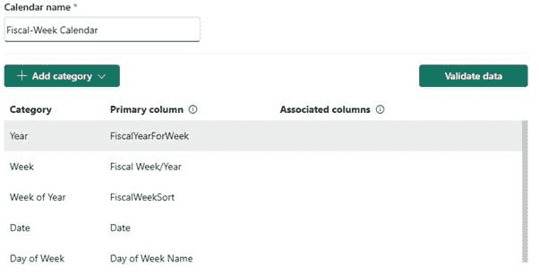

图 11 – 财政周日历的配置（图由作者提供）

计算去年销售额的措施，再次，是直接的：

```py
Online Sales PY (Fiscal Week) = 
    CALCULATE([Sum Online Sales]
                ,SAMEPERIODLASTYEAR('Fiscal-Week Calendar')
                )
```

这些是结果：

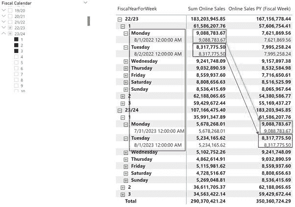

图 12 – 财政周日历的 PY 结果（图由作者提供）

您可以看到，结果与去年的周和星期日完美对齐，尽管日期有所变动。

这正是我所期望的。

## 结论

这个新功能改变了与 DAX 相关的时间智能的方方面面。

但是，尽管我们可以简化我们的 DAX 度量，但在构建我们的日期表时必须格外小心。关键在于拥有正确的内容。

很有趣的是，尽管这个功能作为预览功能推出才几个月，但微软已经推荐使用这个功能。

我的建议是调查一下。阅读以下链接的文章。用您特定的场景测试它，并决定是否值得将现有解决方案切换到这个功能。

当我开始新的解决方案时，我绝对会使用这个功能。

唯一的缺点是它可能会增加数据模型中日期表的数量。到目前为止，我一直在使用一个中央日期表来处理所有事情。现在，我可能需要为特定场景创建单独的日期表。但这可能会在结合数据模型的不同方面时引入复杂性。这会在解释数据时引入额外的挑战。

想想看：

在一页上放置两个不同的日历，这真的是一个好主意吗？结果是否仍然可以比较？这会不会让您的消费者感到困惑？

我绝对会避免这样的场景。在相同页面或同一份报告中，按月和按周比较结果对我来说几乎没有意义。

请继续关注这个主题的更多内容。随着时间的推移，当我遇到有趣的场景时，我会继续撰写更多关于它的内容。

## 参考资料

这里是关于基于日历的时间智能的微软文档：[在 Power BI 中实现基于时间的计算 – Power BI | 微软学习](https://learn.microsoft.com/en-us/power-bi/transform-model/desktop-time-intelligence#calendar-based-time-intelligence-preview).

这篇 SQL BI 文章详细解释了这一新特性：[介绍基于日历的时间智能在 DAX 中的实现 – SQLBI](https://www.sqlbi.com/articles/introducing-calendar-based-time-intelligence-in-dax/).

就像在我之前的文章中一样，我使用了 Contoso 示例数据集。您可以从微软[这里](https://www.microsoft.com/en-us/download/details.aspx?id=18279)免费下载 ContosoRetailDW 数据集。

根据这份文档[中的描述](https://github.com/microsoft/Power-BI-Embedded-Contoso-Sales-Demo)，Contoso 数据可以在 MIT 许可证下自由使用。我将数据集更改以将数据移至当代日期。
