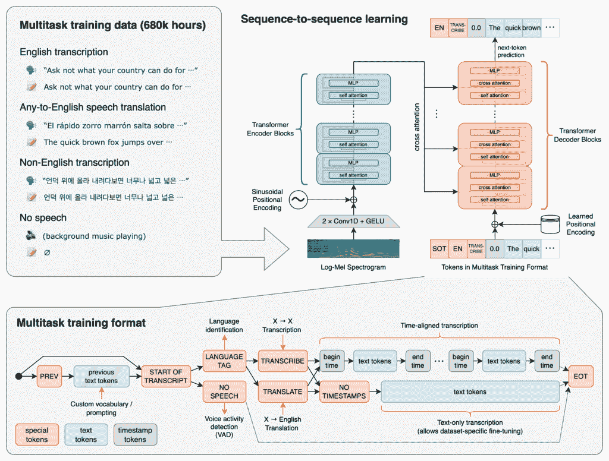
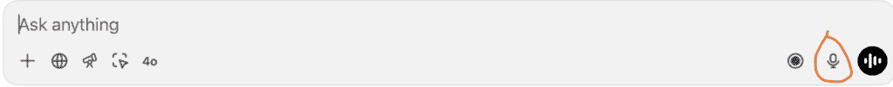
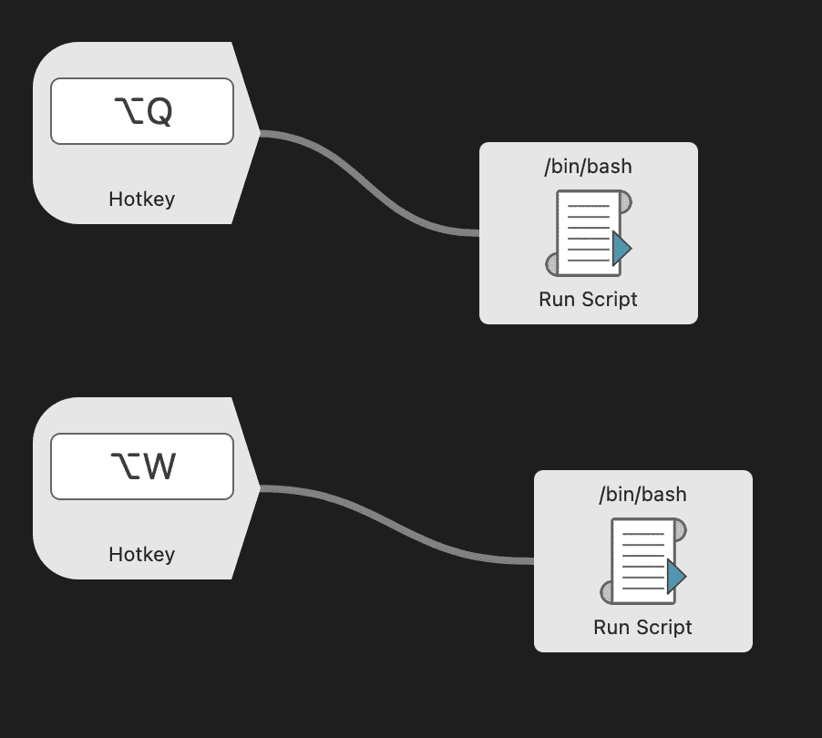

# 使用 OpenAI Whisper 进行自动转录

> 原文：[`towardsdatascience.com/use-openai-whisper-for-automated-transcriptions/`](https://towardsdatascience.com/use-openai-whisper-for-automated-transcriptions/)

<mdspan datatext="el1750897803185" class="mdspan-comment">最近在大型语言模型（LLMs）方面取得了显著的进展。</mdspan>很多人关注的是你可以用纯文本模型或视觉语言模型（VLMs）进行问答，你还可以输入图像。

然而，在过去几年中，还有一个维度发生了巨大的变化：音频。这些模型可以转录（语音->文本）、语音合成（文本->语音），以及语音到语音，其中你可以与语言模型进行整个对话，音频可以双向传输。



OpenAI 的 Whisper 模型的架构和训练流程。图片来自[OpenAI Whisper GitHub 仓库](https://github.com/openai/whisper)，MIT 许可。

在这篇文章中，我将讨论我是如何利用音频模型空间的发展来提高我的效率，成为一个更加高效的程序员。


这是我使用转录工具的一个示例视频。我首先在[Cursor](https://www.cursor.com/)中选择提示字段，并使用我的快捷键激活麦克风，这由左上角的橙色图标表示。然后，我大声说出我想转录的句子，它很快就会出现在提示窗口中，而我甚至不需要在键盘上打字。这是一种更高效地将长英文提示输入到你的编辑器中的方法。视频由作者制作。

## 动机

我写这篇文章的主要动机是，我一直在寻找成为更高效程序员的途径。在使用 ChatGPT 移动应用一段时间后，我发现他们有一个转录选项（用户输入字段右侧的麦克风图标）。我使用了转录，并很快意识到这种转录比之前使用的其他转录工具要好得多，比如苹果内置的 iPhone 转录。

OpenAI 的转录几乎总是能够捕捉到我的所有单词，错误非常少。即使我使用较少见的单词，例如与计算机科学相关的缩写，它仍然能够捕捉到我所说的内容。



OpenAI 应用程序的转录图标。图片由作者提供，取自[OpenAI 的 ChatGPT](https://openai.com/chatgpt/overview/)。

这种转录仅在 ChatGPT 应用中可用。然而，我知道 OpenAI 有一个 Whisper 模型的 API 端点，这可能是他们用于在应用中转录文本的相同模型。因此，我想在我的 Mac 上设置这个模型，使其可以通过快捷键访问。

（我知道有像[Macwhisper](https://goodsnooze.gumroad.com/l/macwhisper)这样的应用程序可用，但我想要开发一个完全免费的解决方案，除了 API 调用的成本之外）

## 前提条件

+   [Alfred](https://www.alfredapp.com/)（我将在 Mac 上使用 Alfred 来触发一些脚本。然而，也存在替代方案。一般来说，您需要一种从快捷键触发 Mac/PC 上脚本的方法。）

## 优点

使用这种转录的主要优势是您可以更快地将单词输入到您的电脑中。当我尽可能快地在电脑上打字时，我甚至无法达到每分钟 100 个单词，而且如果要以这种速度打字，我必须非常专注。然而，根据[这篇文章](https://www.typingmaster.com/speech-speed-test/#:~:text=The%20average%20speaking%20rate%20for,the%20context%20of%20the%20conversation.)，平均说话速度至少为[**110**](https://www.typingmaster.com/speech-speed-test/#:~:text=The%20average%20speaking%20rate%20for,the%20context%20of%20the%20conversation.)。

这意味着如果您能够通过转录说出您的单词，而不是在键盘上打字，您将能够更加高效。

我认为这在大语言模型如 ChatGPT 兴起之后尤其相关。您花更多的时间提示语言模型，例如，向 ChatGPT 提问，或者提示光标实现一个功能，或者修复一个错误。因此，与直接使用 Python 等编程语言相比，现在使用英语的情况比以前更为普遍。

注意：当然，您仍然需要写很多代码，但根据经验，我花更多的时间提示光标，例如，使用广泛的英语提示，在这种情况下，使用这种转录可以为我节省大量时间。

## 缺点

然而，使用转录也可能有一些缺点。主要的一个是，很多时候，您在编程时可能不想大声说话。您可能正坐在机场（就像我在写这篇文章时那样），或者在您的办公室里。在这些情况下，您可能不想通过大声说话打扰周围的人。然而，如果您坐在家庭办公室里，这自然不是问题。

另一个负面因素是，较短的提示可能不会快很多。想象一下：如果您只想写一个单句的提示，在许多情况下，手动打字提示可能更快。这是因为开始、停止和将音频转录成文本的延迟。发送 API 调用需要一点时间，而您拥有的提示越短，您需要等待响应的时间比例就越大。

## 如何实现

您可以在我的 GitHub 上看到我在这篇文章中使用的[代码](https://github.com/EivindKjosbakken/whisper-shortcut)。然而，您还需要添加快捷键来运行脚本。

首先，您必须：

+   克隆 GitHub 仓库：

```py
git clone https://github.com/EivindKjosbakken/whisper-shortcut.git
```

+   创建一个名为*.venv*的虚拟环境，并安装所需的软件包：

```py
python3 -m venv .venv
source .venv/bin/activate
pip install -r requirements.txt
```

+   获取 OpenAI API 密钥。您可以通过以下方式完成：

    +   前往[OpenAI API 概述](https://platform.openai.com/docs/overview)，登录/创建个人资料

    +   前往您的个人资料，并找到 API 密钥

    +   创建一个新的密钥。请记住复制密钥，因为您将无法再次看到它

GitHub 仓库中的脚本通过以下方式工作：

+   [start_recording.sh](https://github.com/EivindKjosbakken/whisper-shortcut/blob/main/start_recording.sh) — 开始录音您的声音。第一次使用此功能时，它会要求您允许使用麦克风

+   [stop_recording.sh](https://github.com/EivindKjosbakken/whisper-shortcut/blob/main/stop_recording.sh) — 向脚本发送停止信号以停止录音。然后将录制的音频发送到 OpenAI 进行转录。此外，它将转录的文本添加到您的剪贴板，如果您在 PC 上选中了文本字段，它还会粘贴文本

整个仓库都带有 MIT 许可证。

### Alfred

您可以在 GitHub 仓库中找到 Alfred 工作流程：[Transcribe.alfredworkflow](https://github.com/EivindKjosbakken/whisper-shortcut/blob/main/Transcribe.alfredworkflow)。

这就是我为 Alfred 工作流程设置的方式：



我的 Alfred 工作流程。我有两个快捷键，一个用于开始转录（录音），另一个用于停止转录（停止录音，并将音频发送到 OpenAI Whisper API 进行转录）。选项+ Q 命令运行 start_recording.sh 脚本，而选项+ W 运行 stop_recording.sh 脚本。当然，您可以更改这些命令的快捷键。图片由作者提供。

您可以简单地下载它并将其添加到 Alfred 中。

此外，记得每次您想要运行此脚本时都要打开一个终端窗口，因为您将从终端激活 Python 脚本。我必须这样做，因为如果脚本直接从 Alfred 激活，我会遇到权限问题。第一次运行脚本时，您应该会收到提示，要求您允许终端访问麦克风，您应该批准。

## 成本

使用 OpenAI Whisper 等 API 时，一个重要的考虑因素是 API 使用的成本。我认为使用 OpenAI 的 Whisper 模型的成本相当高。像往常一样，成本完全取决于您使用模型的程度。我会说我每天使用模型多达 25 次，每次最多 150 个单词，每天的成本不到 1 美元。

然而，这意味着，如果你大量使用该模型，你可能看到每月高达 30 美元的费用，这绝对是一笔不小的开销。然而，我认为注意从模型中节省的时间是很重要的。如果每次模型使用能为你节省 30 秒，而你每天使用它 20 次，你就已经节省了十分钟的时间。就我个人而言，我愿意为节省十分钟的时间支付一美元，来完成一项（在键盘上写作）实际上并不给我带来任何其他好处的工作。如果有的话，使用键盘可能会增加患腕管综合征等伤害的风险。因此，对我而言，使用该模型绝对是值得的。

## 结论

在这篇文章中，我首先讨论了在过去几年里语言模型取得的巨大进步。这帮助我们创建了强大的聊天机器人，节省了我们大量的时间。然而，随着语言模型的进步，我们也看到了语音模型的进步。使用 OpenAI Whisper 进行转录现在几乎完美（根据个人经验），这使得它成为一个强大的工具，你可以用它更有效地在电脑上输入文字。我讨论了在电脑上使用 OpenAI Whisper 的优缺点，并且逐步介绍了如何在你的电脑上实现它。
