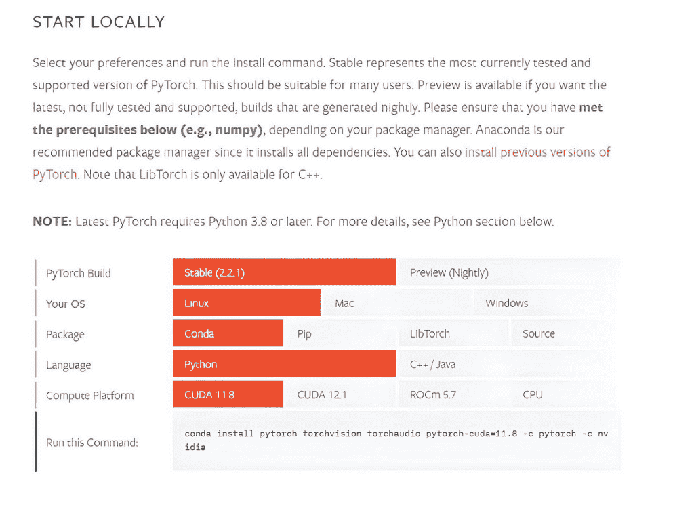
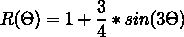
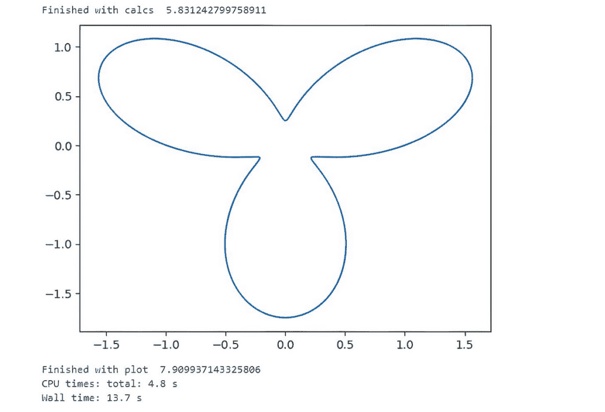
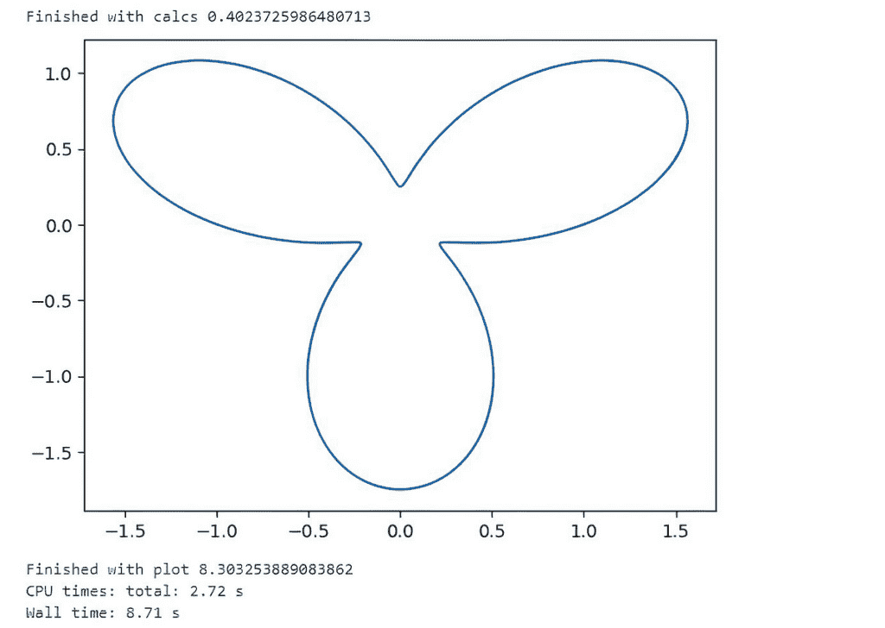

# 使用 PyTorch 轻松访问您的 GPU

> 原文：[`towardsdatascience.com/use-pytorch-to-easily-access-your-gpu/`](https://towardsdatascience.com/use-pytorch-to-easily-access-your-gpu/)

<mdspan datatext="el1747860298637" class="mdspan-comment">假设您</mdspan>足够幸运，能够访问到一个配备了 Nvidia 图形处理单元（GPU）的系统。您知道有一个极其简单的方法可以使用一个旨在主要用于机器学习（ML）应用的 Python 库来利用 GPU 的功能吗？

如果您对机器学习的细节不够熟悉，请不要担心，因为本文中我们不会使用它。相反，我将向您展示如何使用 PyTorch 库来访问和使用您 GPU 的功能。我们将比较使用流行的数值库 **NumPy** 在 CPU 上运行的 Python 程序的运行时间，以及使用 PyTorch 在 GPU 上运行的等效代码。

在继续之前，让我们快速回顾一下 GPU 和 PyTorch 是什么。

## 什么是 GPU？

GPU 是一种专门设计的电子芯片，最初是为了快速操纵和修改内存以加速帧缓冲区中图像的创建，该帧缓冲区用于输出到显示设备。它作为快速图像处理设备的作用基于其能够同时执行许多计算的能力，并且它仍然用于这个目的。

然而，GPU 最近在机器学习、大型语言模型训练和开发中变得极其有价值。它们固有的执行高度可并行计算的能力使它们成为这些领域的理想工作马，因为它们使用复杂的数学模型和模拟。

## 什么是 PyTorch？

PyTorch 是由 Facebook 的 AI 研究实验室（FAIR）开发的开源机器学习库。它被广泛用于自然语言处理和计算机视觉应用。PyTorch 可以用于 GPU 操作的两个主要原因如下，

+   PyTorch 的核心数据结构之一是张量。张量在其他编程语言中类似于数组和矩阵，但它们针对在 GPU 上运行进行了优化。

+   Pytorch 支持 CUDA。PyTorch 与 CUDA 无缝集成，CUDA 是 NVIDIA 为其 GPU 上的通用计算开发的一个并行计算平台和编程模型。这使得 PyTorch 能够直接访问 GPU 硬件，加速数值计算。CUDA 将使开发者能够使用 PyTorch 编写充分利用 GPU 加速的软件。

总结来说，PyTorch 通过 CUDA 支持 GPU 操作以及其高效的张量操作能力，使其成为开发具有高计算需求的 GPU 加速 Python 函数的出色工具。

正如我们稍后将要展示的，您**不必**使用 PyTorch 来开发机器学习模型或训练大型语言模型。

在本文的其余部分，我们将设置我们的开发环境，安装 PyTorch，并运行一些示例，我们将比较一些计算密集型的 PyTorch 实现与等效的 numpy 实现，并查看我们找到的任何性能差异。

## 先决条件

+   **Nvidia GPU**

您的系统需要 Nvidia GPU。要检查您的 GPU，请在系统提示符下输入以下命令。我使用的是 Windows 子系统 Linux（WSL）。

```py
$ nvidia-smi

>>
(base) PS C:\Users\thoma> nvidia-smi
Fri Mar 22 11:41:34 2024
+-----------------------------------------------------------------------------------------+
| NVIDIA-SMI 551.61                 Driver Version: 551.61         CUDA Version: 12.4     |
|-----------------------------------------+------------------------+----------------------+
| GPU  Name                     TCC/WDDM  | Bus-Id          Disp.A | Volatile Uncorr. ECC |
| Fan  Temp   Perf          Pwr:Usage/Cap |           Memory-Usage | GPU-Util  Compute M. |
|                                         |                        |               MIG M. |
|=========================================+========================+======================|
|   0  NVIDIA GeForce RTX 4070 Ti   WDDM  |   00000000:01:00.0  On |                  N/A |
| 32%   24C    P8              9W /  285W |     843MiB /  12282MiB |      1%      Default |
|                                         |                        |                  N/A |
+-----------------------------------------+------------------------+----------------------+
+-----------------------------------------------------------------------------------------+
| Processes:                                                                              |
|  GPU   GI   CI        PID   Type   Process name                              GPU Memory |
|        ID   ID                                                               Usage      |
|=========================================================================================|
|    0   N/A  N/A      1268    C+G   ...tility\HPSystemEventUtilityHost.exe      N/A      |
|    0   N/A  N/A      2204    C+G   ...ekyb3d8bbwe\PhoneExperienceHost.exe      N/A      |
|    0   N/A  N/A      3904    C+G   ...cal\Microsoft\OneDrive\OneDrive.exe      N/A      |
|    0   N/A  N/A      7068    C+G   ...CBS_cw5n
etc ..
```

如果该命令不被识别，而你确信你有 GPU，那么这很可能意味着你缺少 NVIDIA 驱动程序。只需按照本文中的其余说明操作，它应该作为该过程的一部分被安装。

+   Nvidia GPU 驱动程序

当 PyTorch 安装包可以包括 CUDA 库时，您的系统仍然必须安装适当的 NVIDIA GPU 驱动程序。这些驱动程序对于操作系统与图形处理单元（GPU）硬件通信是必要的。CUDA 工具包包括驱动程序，但如果您使用 PyTorch 捆绑的 CUDA，您只需确保您的 GPU 驱动程序是最新的。

点击[此链接](https://www.nvidia.com/en-us/drivers/)访问 NVIDIA 网站并安装与您的系统和 GPU 规格兼容的最新驱动程序。

## 设置我们的开发环境

作为最佳实践，我们应该为每个项目设置一个单独的开发环境。我使用 conda，但使用适合您的方法。

> *如果您想走 conda 路线并且还没有安装，您必须首先安装 Miniconda（推荐）或 Anaconda。*
> 
> *请注意，在撰写本文时，PyTorch 目前仅官方支持 Python 版本 3.8 到 3.11。*

```py
#create our test environment
(base) $ conda create -n pytorch_test python=3.11 -y
```

现在激活您的新环境。

```py
(base) $ conda activate pytorch_test
```

我们现在需要获取适用于 PyTorch 的正确 conda 安装命令。这取决于您的操作系统、选择的编程语言、首选的包管理器和 CUDA 版本。

幸运的是，PyTorch 提供了一个有用的 Web 界面，这使得设置变得容易。因此，要开始，请访问 PyTorch 网站在…

[`pytorch.org`](https://pytorch.org)

点击屏幕顶部的“开始使用”链接。从那里，向下滚动一点，直到您看到这个，



来自 PyTorch 网站的照片

点击系统规格适当位置的每个框。在此过程中，您会看到“运行此命令”输出字段中的命令会动态更改。完成选择后，复制显示的最终命令文本并将其输入到命令窗口提示符中。

对我来说，这是：-

```py
(pytorch_test) $ conda install pytorch torchvision torchaudio pytorch-cuda=12.1 -c pytorch -c nvidia -y
```

我们将安装 Jupyter、Pandas 和 Matplotlib，以便我们能够在笔记本中运行我们的 Python 代码，并使用示例代码。

```py
(pytroch_test) $ conda install pandas matplotlib jupyter -y
```

现在在命令提示符中输入`jupyter notebook`。您应该在浏览器中看到一个 jupyter 笔记本打开。如果这不是自动发生的，您可能会在`jupyter notebook`命令后看到一屏的信息。

在底部附近，将有一个 URL，你应该将其复制并粘贴到浏览器中以启动 Jupyter Notebook。

你的 URL 将与我的不同，但它应该看起来像这样：-

```py
http://127.0.0.1:8888/tree?token=3b9f7bd07b6966b41b68e2350721b2d0b6f388d248cc69da
```

#### 测试我们的设置

我们首先要做的是测试我们的设置。请将以下内容输入到一个 Jupyter 单元中并运行它。

```py
import torch
x = torch.rand(5, 3)
print(x)
```

你应该会看到以下类似的输出。

```py
tensor([[0.3715, 0.5503, 0.5783],
        [0.8638, 0.5206, 0.8439],
        [0.4664, 0.0557, 0.6280],
        [0.5704, 0.0322, 0.6053],
        [0.3416, 0.4090, 0.6366]])
```

此外，为了检查你的 GPU 驱动程序和 CUDA 是否被 PyTorch 启用并可访问，请运行以下命令：

```py
import torch
torch.cuda.is_available()
```

如果一切正常，这将输出 `True`。

如果一切正常，我们可以继续到我们的示例。如果不正常，请返回并检查你的安装过程。

> **注意**：在以下时间表中，我连续多次运行了每个 Numpy 和 PyTorch 进程，并取了每个的最佳时间。这有点偏向 PyTorch 运行，因为每次 PyTorch 运行的第一次调用都有轻微的开销，但总体来说，我认为这是一个更公平的比较*。***

### 示例 1—一个简单的数组数学操作。

在这个例子中，我们设置了两个大型的、相同的一维数组，并对每个数组元素执行简单的加法操作。

```py
import numpy as np
import torch as pt

from timeit import default_timer as timer   

#func1 will run on the CPU   
def func1(a):                                 
    a+= 1  

#func2 will run on the GPU
def func2(a):                                 
    a+= 2

if __name__=="__main__": 
    n1 = 300000000                          
    a1 = np.ones(n1, dtype = np.float64) 

    # had to make this array much smaller than
    # the others due to slow loop processing on the GPU
    n2 = 300000000                     
    a2 = pt.ones(n2,dtype=pt.float64)

    start = timer() 
    func1(a1) 
    print("Timing with CPU:numpy", timer()-start)     

    start = timer() 
    func2(a2) 
    #wait for all calcs on the GPU to complete
    pt.cuda.synchronize()
    print("Timing with GPU:pytorch", timer()-start) 
    print()

    print("a1 = ",a1)
    print("a2 = ",a2)
```

```py
Timing with CPU:numpy 0.1334826999955112
Timing with GPU:pytorch 0.10177790001034737

a1 =  [2\. 2\. 2\. ... 2\. 2\. 2.]
a2 =  tensor([3., 3., 3.,  ..., 3., 3., 3.], dtype=torch.float64)
```

我们看到使用 PyTorch 相比 Numpy 有轻微的改进，但我们错过了一个关键点。我们没有使用 GPU，因为我们的 PyTorch 张量数据仍然在 CPU 内存中。

要将数据移动到 GPU 内存中，我们需要在创建张量时添加 `device='cuda'` 指令。让我们试试看是否会有所不同。

```py
# Same code as above except 
# to get the array data onto the GPU memory
# we changed

a2 = pt.ones(n2,dtype=pt.float64)

# to

a2 = pt.ones(n2,dtype=pt.float64,device='cuda')
```

重新运行并应用更改后，我们得到，

```py
Timing with CPU:numpy 0.12852740001108032
Timing with GPU:pytorch 0.011292399998637848

a1 =  [2\. 2\. 2\. ... 2\. 2\. 2.]
a2 =  tensor([3., 3., 3.,  ..., 3., 3., 3.], device='cuda:0', dtype=torch.float64)
```

这才是正确的，速度提高了 10 倍以上。

### 示例 2—一个稍微复杂一点的数组操作。

在这个例子中，我们将使用 PyTorch 和 Numpy 库中可用的内置 **matmul** 操作来乘以多维矩阵。每个数组将是 10000 x 10000，并包含介于 1 和 100 之间的随机浮点数。

```py
# NUMPY first
import numpy as np
from timeit import default_timer as timer

# Set the seed for reproducibility
np.random.seed(0)
# Generate two 10000x10000 arrays of random floating point numbers between 1 and 100
A = np.random.uniform(low=1.0, high=100.0, size=(10000, 10000)).astype(np.float32)
B = np.random.uniform(low=1.0, high=100.0, size=(10000, 10000)).astype(np.float32)
# Perform matrix multiplication
start = timer() 
C = np.matmul(A, B)

# Due to the large size of the matrices, it's not practical to print them entirely.
# Instead, we print a small portion to verify.
print("A small portion of the result matrix:\n", C[:5, :5])
print("Without GPU:", timer()-start)
```

```py
A small portion of the result matrix:
 [[25461280\. 25168352\. 25212526\. 25303304\. 25277884.]
 [25114760\. 25197558\. 25340074\. 25341850\. 25373122.]
 [25381820\. 25326522\. 25438612\. 25596932\. 25538602.]
 [25317282\. 25223540\. 25272242\. 25551428\. 25467986.]
 [25327290\. 25527838\. 25499606\. 25657218\. 25527856.]]

Without GPU: 1.4450852000009036
```

现在是 PyTorch 版本。

```py
import torch
from timeit import default_timer as timer

# Set the seed for reproducibility
torch.manual_seed(0)

# Use the GPU
device = 'cuda'

# Generate two 10000x10000 tensors of random floating point 
# numbers between 1 and 100 and move them to the GPU
#
A = torch.FloatTensor(10000, 10000).uniform_(1, 100).to(device)
B = torch.FloatTensor(10000, 10000).uniform_(1, 100).to(device)

# Perform matrix multiplication
start = timer()
C = torch.matmul(A, B)

# Wait for all current GPU operations to complete (synchronize)
torch.cuda.synchronize() 

# Due to the large size of the matrices, it's not practical to print them entirely.
# Instead, we print a small portion to verify.
print("A small portion of the result matrix:\n", C[:5, :5])
print("With GPU:", timer() - start)
```

```py
A small portion of the result matrix:
 [[25145748\. 25495480\. 25376196\. 25446946\. 25646938.]
 [25357524\. 25678558\. 25675806\. 25459324\. 25619908.]
 [25533988\. 25632858\. 25657696\. 25616978\. 25901294.]
 [25159630\. 25230138\. 25450480\. 25221246\. 25589418.]
 [24800246\. 25145700\. 25103040\. 25012414\. 25465890.]]

With GPU: 0.07081239999388345
```

这次 PyTorch 运行比 NumPy 运行快了 20 倍。太棒了。

### 示例 3—结合 CPU 和 GPU 代码。

有时候，你的处理不能全部在 GPU 上完成。这个的日常用例是绘图。当然，你可以使用 GPU 来操作你的数据，但通常下一步是使用图表来查看你的最终数据集看起来像什么。

如果数据位于 GPU 内存中，你无法绘制数据，因此必须在调用绘图函数之前将其移回 CPU 内存。将大量数据从 GPU 移到 CPU 是否值得开销？让我们来看看。

在这个例子中，我们将解这个极坐标方程，θ 的值在 0 和 2π 之间，以 (x, y) 坐标形式，然后绘制出结果图。



不要过于纠结于数学。这只是一个方程，当将其转换为使用 x, y 坐标系并求解后，在绘制时看起来很漂亮。

即使对于几百万个 x 和 y 的值，Numpy 也可以以毫秒的速度解决这个问题，所以为了使它更有趣，我们将使用 1 亿（x, y）坐标。

这里是 numpy 代码。

```py
%%time
import numpy as np
import matplotlib.pyplot as plt
from time import time as timer

start = timer()

# create an array of 100M thetas between 0 and 2pi
theta = np.linspace(0, 2*np.pi, 100000000)

# our original polar formula
r = 1 + 3/4 * np.sin(3*theta)

# calculate the equivalent x and y's coordinates 
# for each theta
x = r * np.cos(theta)
y = r * np.sin(theta)

# see how long the calc part took
print("Finished with calcs ", timer()-start)

# Now plot out the data
start = timer()
plt.plot(x,y)

# see how long the plotting part took
print("Finished with plot ", timer()-start)
```

这里是输出。你事先能猜到它会看起来像这样吗？我肯定不会！



现在，让我们看看等效的 PyTorch 实现是什么样的，以及我们能获得多大的速度提升。

```py
%%time
import torch as pt
import matplotlib.pyplot as plt
from time import time as timer

# Make sure PyTorch is using the GPU
device = 'cuda'

# Start the timer
start = timer()

# Creating the theta tensor on the GPU
theta = pt.linspace(0, 2 * pt.pi, 100000000, device=device)

# Calculating r, x, and y using PyTorch operations on the GPU
r = 1 + 3/4 * pt.sin(3 * theta)
x = r * pt.cos(theta)
y = r * pt.sin(theta)

# Moving the result back to CPU for plotting
x_cpu = x.cpu().numpy()
y_cpu = y.cpu().numpy()

pt.cuda.synchronize()
print("Finished with calcs", timer() - start)

# Plotting
start = timer()
plt.plot(x_cpu, y_cpu)
plt.show()

print("Finished with plot", timer() - start)
```

我们再次看看我们的输出。



计算部分大约是 numpy 计算的 10 倍。使用 PyTorch 和 NumPy 版本进行数据绘图所需的时间大致相同，这是预期的，因为数据当时仍在 CPU 内存中，GPU 在处理中并没有发挥进一步的作用。

但是，总的来说，我们减少了大约 40% 的总运行时间，这是非常出色的。

## 摘要

本文展示了如何利用 PyTorch（一个通常用于 AI 应用的机器学习库）来使用 NVIDIA GPU 加速非机器学习数值 Python 代码。它将标准 NumPy（基于 CPU 的）实现与 GPU 加速的 PyTorch 等效实现进行了比较，以展示在 GPU 上运行基于张量的操作的性能优势。

你不需要进行机器学习就能从 PyTorch 中受益。如果你可以访问 NVIDIA GPU，PyTorch 提供了一种简单而有效的方法来显著加快计算密集型数值运算的速度——即使在通用 Python 代码中也是如此。
