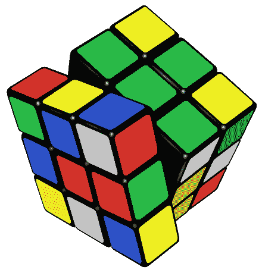
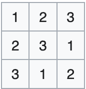
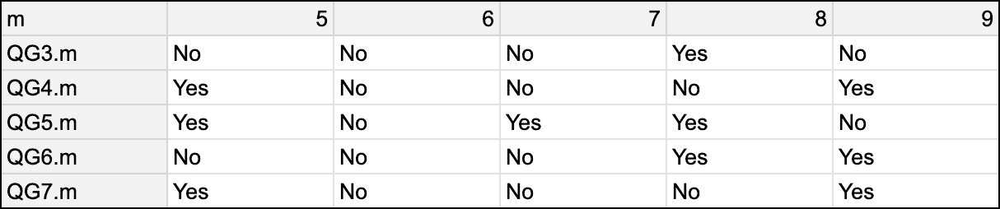
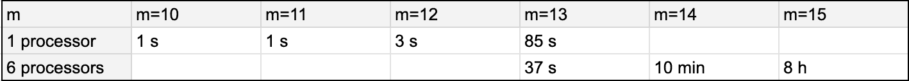

# 使用约束编程解决数学定理

> 原文：[`towardsdatascience.com/using-constraint-programming-to-solve-math-theorems-1781611878d0/`](https://towardsdatascience.com/using-constraint-programming-to-solve-math-theorems-1781611878d0/)

## TLDR

一些数学定理可以通过组合探索来解决。在本文中，我们关注的是某些伪群存在性的问题。我们将使用 [NuCS](https://github.com/yangeorget/nucs) 来证明或否定某些伪群的存在。NuCs 是一个 100% 用 Python 编写的快速约束求解器，我目前正在将其作为一个副项目开发。它是在 [MIT 许可证](https://github.com/yangeorget/nucs/blob/main/LICENSE.md) 下发布的。

## 一些定义

让我们从定义一些有用的词汇开始。

### 群

引用维基百科：

> 在数学中，**群** 是一个集合，该集合有一个运算，将集合中的每个元素与集合中每对元素的组合相关联（就像每个二元运算一样），并满足以下约束：运算具有结合性，有一个单位元素，并且集合中的每个元素都有一个逆元素。

整数集（正数和负数）与加法运算构成一个群。有许多种类的群，例如 [魔方](https://en.wikipedia.org/wiki/Rubik%27s_Cube) 的操作。



[来源：维基百科](https://en.wikipedia.org/wiki/Group_(mathematics)#/media/File:Rubik's_cube.svg)

### 拉丁方

> 拉丁方是一个填充了 *n* 个不同符号的 *n* × *n* 矩阵，每个符号在每个行和列中恰好出现一次。

一个 3×3 拉丁方的例子是：



由作者设计

> 例如，数独是一个具有额外属性的 *9×9* 拉丁方。

### 伪群

> 阶 *m* 的伪群是一个大小为 *m* 的拉丁方。也就是说，一个 *m×m* 的乘法表（我们将 *∗* 记作乘法符号），其中每个元素在每个行和列中恰好出现一次。

乘法法则不必是结合的。如果是，则伪群是群。

在本文的其余部分，我们将关注某些特定伪群存在性的问题。我们感兴趣的伪群是幂等的，即对于每个元素 *a*，***a*∗*a=a***。

此外，它们还具有其他属性：

+   QG3.m 问题是有序 m 伪群，其中 **(a∗b)∗(b∗a)=a**。

+   QG4.m 问题是有序 m 伪群，其中 **(b∗a)∗(a∗b)=a**。

+   QG5.m 问题是有序 m 伪群，其中 **((b∗a)∗b)∗b=a**。

+   QG6.m 问题是有序 m 伪群，其中 **(a∗b)∗b=a∗(a∗b)**。

+   QG7.m 问题是有序 m 伪群，其中 **(b∗a)∗b=a∗(b∗a)**。

在以下内容中，对于一个阶数为 *m* 的伪群，我们记 *0, …, m-1* 为伪群的值（我们希望这些值与乘法表中的索引相匹配）。

## 建模伪群问题

### 拉丁方阵模型

我们将通过利用拉丁方阵问题来建模拟群问题。前者有两种风味：

+   **拉丁方阵问题**，

+   **拉丁方阵 RC 问题**。

拉丁方阵问题简单地说明，乘法表中的所有行和列的值都必须不同：

```py
self.add_propagators([(self.row(i), ALG_ALLDIFFERENT, []) for i in range(self.n)])
self.add_propagators([(self.column(j), ALG_ALLDIFFERENT, []) for j in range(self.n)])
```

该模型定义了，对于每一行*i*和列*j*，单元格的值*color(i, j)*。我们将称之为**颜色**模型。对称地，我们可以定义：

+   对于每一行*i*和颜色*c*，列*column(i, c)*：我们称之为**列**模型，

+   对于每个颜色*c*和**列**j，行*row(c,* j)*：我们称之为**行**模型。

注意，我们具有以下属性：

+   *row(c, j) = i <=> color(i, j) = c*

对于给定的 __ colum*n* j*，row(., j)* an*d color(., j)*是逆排列。

+   *row(c, j) = i <=> column(i, c) = j*

对于给定的 __ colo*r* c*，row(c, .)* an*d column(., c)*是逆排列。

+   *color(i, j) = c <=> column(i, c) = j*

对于给定的 __ ro*w* i*，color(i, .)* an*d column(i, .)*是逆排列。

这正是通过 ALG_PERMUTATION_AUX 传播器（注意，该传播器的较不优化版本也用于我之前的[文章](https://medium.com/towards-data-science/how-to-tackle-an-optimization-problem-with-constraint-programming-9ae77b4d803d)关于旅行商问题）实现的 LatinSquareRCProblem：

```py
def __init__(self, n: int):
    super().__init__(list(range(n)))  # the color model
    self.add_variables([(0, n - 1)] * n**2)  # the row model
    self.add_variables([(0, n - 1)] * n**2)  # the column model
    self.add_propagators([(self.row(i, M_ROW), ALG_ALLDIFFERENT, []) for i in range(self.n)])
    self.add_propagators([(self.column(j, M_ROW), ALG_ALLDIFFERENT, []) for j in range(self.n)])
    self.add_propagators([(self.row(i, M_COLUMN), ALG_ALLDIFFERENT, []) for i in range(self.n)])
    self.add_propagators([(self.column(j, M_COLUMN), ALG_ALLDIFFERENT, []) for j in range(self.n)])
    # row[c,j]=i <=> color[i,j]=c
    for j in range(n):
        self.add_propagator(([*self.column(j, M_COLOR), *self.column(j, M_ROW)], ALG_PERMUTATION_AUX, []))
    # row[c,j]=i <=> column[i,c]=j
    for c in range(n):
        self.add_propagator(([*self.row(c, M_ROW), *self.column(c, M_COLUMN)], ALG_PERMUTATION_AUX, []))
    # color[i,j]=c <=> column[i,c]=j
    for i in range(n):
        self.add_propagator(([*self.row(i, M_COLOR), *self.row(i, M_COLUMN)], ALG_PERMUTATION_AUX, []))
```

### 拓扑群模型

现在我们需要为我们的拟群实现额外的属性。

幂等性可以通过以下方式简单实现：

```py
for model in [M_COLOR, M_ROW, M_COLUMN]:
    for i in range(n):
        self.shr_domains_lst[self.cell(i, i, model)] = [i, i]
```

现在，让我们专注于 QG5.m。我们需要实现*((b∗a)∗b)∗b=a*：

+   这转化为：*color(color(color(j, i), j), j) = i,*

+   或者等价地：*row(i, j) = color(color(j, i), j).* 

最后的表达式表明，*color(j,i)*列的第*color(j,i)*个元素是*row(i, j)*。为了强制执行这一点，我们可以利用 ALG_ELEMENT_LIV 传播器（或一个更专业的 ALG_ELEMENT_LIV_ALLDIFFERENT 传播器，该传播器优化了考虑行和列包含所有不同元素的实际情况）。

```py
for i in range(n):
    for j in range(n):
        if j != i:
            self.add_propagator(
                (
                    [*self.column(j), self.cell(j, i), self.cell(i, j, M_ROW)],
                    ALG_ELEMENT_LIV_ALLDIFFERENT,
                    [],
                )
            )
```

类似地，我们可以建模问题[QG3.m, QG4.m, QG6.m, QG7.m](https://github.com/yangeorget/nucs/blob/main/nucs/examples/quasigroup/quasigroup_problem.py)。

## 实验

注意，这个问题非常困难，因为搜索空间的大小是 mᵐᵐ。对于*m=10*，这是*1e+100*。

以下实验是在运行 Python 3.13、Numpy 2.1.3、Numba 0.61.0rc2 和 NuCS 4.6.0 的 MacBook Pro M2 上进行的。请注意，由于 Python、Numpy 和 Numba 的升级，NuCS 的最新版本相对于旧版本来说相对更快。

以下存在/不存在证明在**不到一秒**内获得：



小型实例的实验

现在，让我们专注于**QG5.m**，其中第一个未解决的问题为**QG5.18**。



对 QG5 的实验（在第二行，我们使用 MultiprocessingSolver）

进一步研究至少需要租用云服务提供商上的强大机器几天时间！

## 结论

正如我们所见，一些数学定理可以通过组合探索来解决。在这篇文章中，我们研究了拟群存在/不存在的问题。在这些问题中，一些开放性问题似乎是可以触及的，这非常具有激励性。

一些改进我们当前关于拟群存在性方法的想法：

+   精炼仍然相当简单的模型

+   探索更复杂的启发式方法

+   在云上运行代码（例如使用 docker）

* * *

一些有用的链接，以进一步了解 NuCS：

+   源代码：[`github.com/yangeorget/nucs`](https://github.com/yangeorget/nucs)

+   文档：[`nucs.readthedocs.io/en/latest/index.html`](https://nucs.readthedocs.io/en/latest/index.html)

+   Pip 包：[`pypi.org/project/NUCS/`](https://pypi.org/project/NUCS/)

如果你喜欢这篇关于 NuCS 的文章，请鼓掌**50**次！
