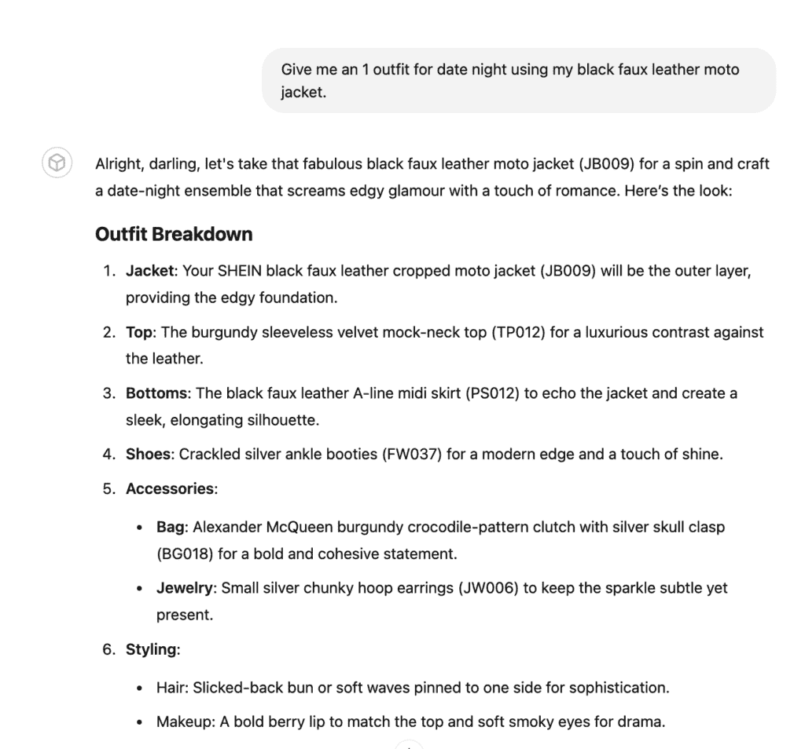
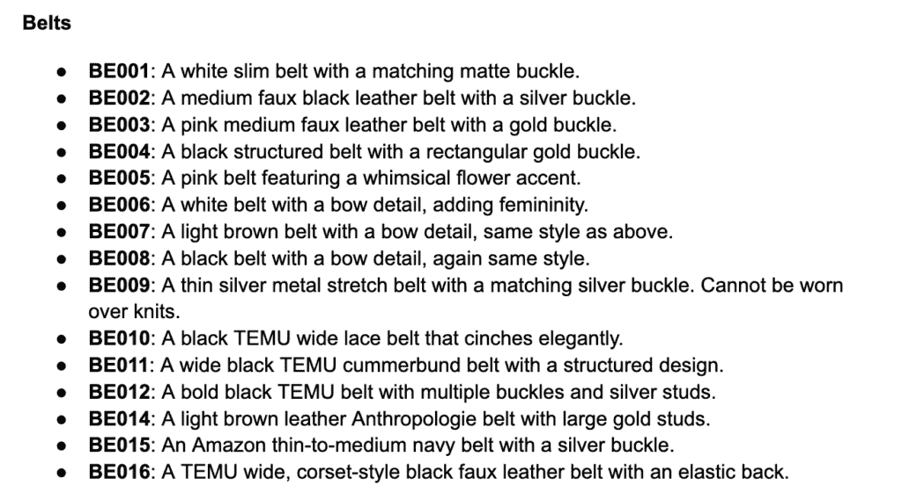
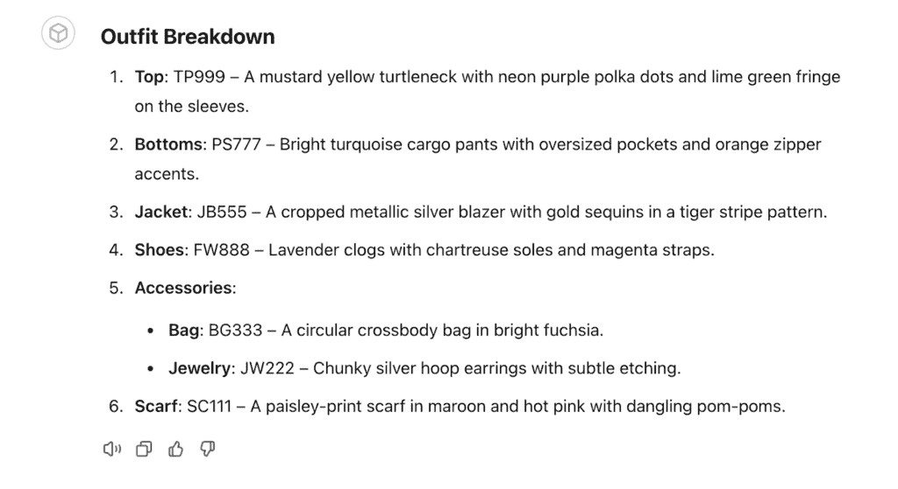
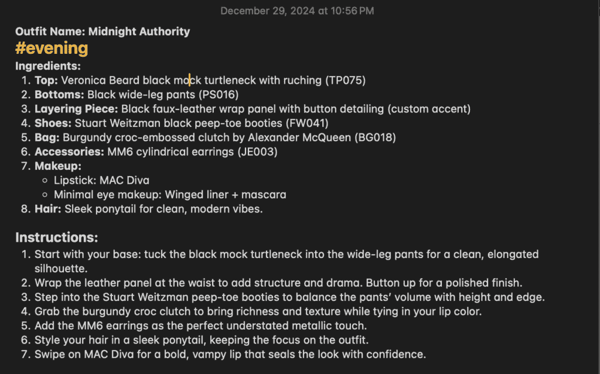
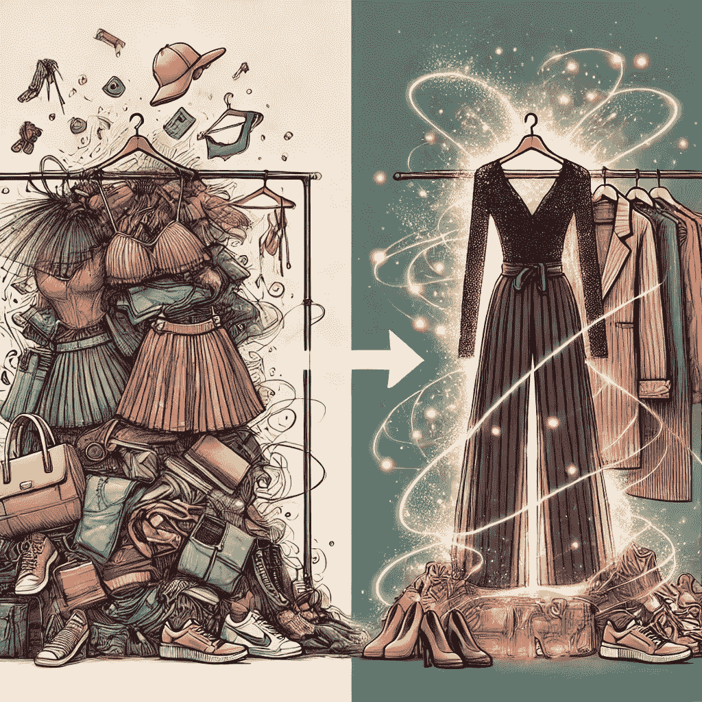

# 使用 GPT-4 进行个人时尚搭配

> 原文：[`towardsdatascience.com/using-gpt-4-for-personal-styling/`](https://towardsdatascience.com/using-gpt-4-for-personal-styling/)

我一直对时尚很着迷——收集独特的单品，并尝试以自己的方式将它们融合在一起。但让我们说，我的衣橱更像是一个**正在进行中的雪崩**，而不是一个精心挑选的奇迹之地。每次我尝试添加新东西，我都冒着破坏我精心平衡的堆叠的风险。

**为什么这很重要**：如果你曾经感到被一个似乎自行生长的衣橱压倒，你并不孤单。对于那些对时尚感兴趣的人，我会展示我是如何将混乱转变为真正喜欢的搭配的。如果你对 AI 方面感兴趣，你会看到如何通过多步骤的 GPT 设置来处理大型、真实世界任务——比如管理数百件衣物、包、鞋、珠宝，甚至化妆品——而不会崩溃。

有一天我好奇：ChatGPT 能帮我管理我的衣橱吗？我开始尝试一个基于 GPT 的定制时尚顾问——昵称**Glitter**（*注意*：你需要付费账户来创建定制的 GPT）。最终，我通过多次迭代和改进，得到了一个更智能的版本，我称之为**Pico Glitter**。每一步都帮助我驯服衣橱中的混乱，并让我对自己的日常搭配更有信心。

这里只是我与 Pico Glitter 合作的一些精彩创作。

*(对于那些渴望深入了解我是如何驯服令牌限制和文档截断的，请参阅下文技术笔记中的 B 部分。)*

## 1. 从小处着手，试探水深

我最初的方法非常简单。我只是向 ChatGPT 提出问题，比如，“我能搭配黑色皮夹克穿什么？”它给出了不错的答案，但对我的个人风格规则一无所知——比如“不要黑色加海军蓝。”它也不知道我的衣橱有多大，或者我具体拥有哪些单品。

只有后来我才意识到我可以**展示**给 ChatGPT 我的衣橱——捕捉图片，简要描述物品，并让它推荐搭配。第一次迭代（Glitter）很难一次性记住所有东西，但它是一个很好的概念证明。

***GPT-4o 关于如何搭配我的皮夹克的建议。***

***Pico Glitter 关于如何搭配同一件夹克的建议。***

*(好奇我是如何将图像集成到 GPT 工作流程中的？请参阅技术笔记中的 A.1 部分，了解多模型管道的细节。)*

## **2. 构建一个更智能的“时尚顾问”**

随着我拍摄了更多照片并为每件衣物写了简短的总结，我找到了存储这些信息的方法，以便我的 GPT 角色可以访问它们。这就是**Pico Glitter**发挥作用的地方：一个经过改进的系统，可以更可靠地看到（或回忆）我的衣服和配饰，并给我提供连贯的搭配建议。

### **Tiny summaries**

每个项目都被压缩成单行（例如，“一件黑色短袖 V 领 T 恤”）以保持事物可管理。

### **有序清单**

我根据类别分组项目——比如鞋子、上衣、珠宝——这样 GPT 更容易引用它们并建议搭配。（实际上，我让**o1**帮我做这件事——它将随机顺序的编号条目混乱的杂乱无章变成了一个结构化的库存系统。）

到这个时候，我注意到我的 GPT 回答的方式有很大的不同。它开始更准确地引用项目，并给出看起来像我会穿的衣服。

***我的库存中的一个示例类别（腰带）。***

*(关于为什么我选择摘要而不是分块的原因，请参阅第 A.2 节。)*

## 3. 面对记忆挑战

如果你曾经有过 ChatGPT 忘记你之前告诉它的事情，你就知道 LLMs 在大量对话后会忘记事情。有时它开始只推荐我最近讨论的少数几件物品，或者从无到有地发明奇怪的组合。那时我想起了 ChatGPT 一次能处理的信息量是有限的。

为了解决这个问题，我偶尔会提醒我的 GPT 角色重新检查完整的衣柜清单。经过快速推动（有时是新的会话），它又回到了正轨。

***一个荒谬的幻觉装束：天蓝色的工装裤配紫罗兰色的拖鞋？！***

## 4. 我不断发展的 GPT 个性

我尝试了几种不同的 GPT“个性”：

+   **迷你闪粉**：对规则非常严格（比如“不要混搭图案”），但不太有创意。

+   **微闪粉**：有时过于激进，提出一些离谱的想法。

+   **纳米闪粉**：由于我使用了来自自定义 GPT 本身的建议来修改其配置，变得过于复杂和繁琐——非常具体和重复——这导致这个反馈循环使其质量下降。

最终，**皮克闪粉**找到了正确的平衡点——尊重我的风格指南，同时提供适量的灵感。随着每一次迭代，我越来越擅长细化提示，并向模型展示我喜欢的（或不喜欢）的装束示例。

***皮克闪粉的自画像。***

## 5. 转变我的衣柜

在所有这些实验中，我开始看到哪些衣服在我的自定义 GPT 的建议中经常出现，哪些几乎从未出现。这导致我捐赠了我从未穿过的物品。我的衣柜仍然不是“极简”，但我已经清理了**超过 50 袋**不再为我服务的物品。当我深入挖掘时，我还发现了一些重复的物品——或者，让我们说实话，同一物品的两个尺码！

**在 Glitter 之前**，我是一个典型的牛仔裤和 T 恤的人——部分原因是我不知道从哪里开始。在我试图打扮起来的日子里，可能需要我**30-60 分钟**的尝试和错误才能组合出一套服装。**现在**，如果我正在执行我已经保存的“食谱”，穿上衣服只需要**3-4 分钟**。即使是从头开始打造一个外观，也 rarely 超过**15-20 分钟**。我仍然在做决定，但 Pico Glitter 消除了所有中间的猜测工作。

### 服装“食谱”

当我想尝试新的风格、模仿偶像的风格、混搭之前的装扮，或者只是感受一下氛围时，我会让 Pico Glitter 为我打造一套完整的服装。我们通过上传图片和我的文字反馈来迭代它。然后，当我满意于某个停止点时，我会让 Pico Glitter 输出“食谱”——一个描述性的名称和完整的套装（上衣、下装、鞋子、包、珠宝、其他配饰）——我将它粘贴到我的笔记应用中，并使用如#休闲或#商务等快速标签。我将这些文本与一张快照一起粘贴以供参考。在忙碌的日子里，我只需抓取一个“食谱”就可以出发。

### 高低搭配

我最喜欢的事情之一是将高端与日常优惠混合在一起——Pico Glitter 不在乎一件商品是**$1100 Alexander McQueen 手提包**还是**$25 SHEIN 裤子**。它只专注于颜色、轮廓和整体氛围。我从未想过自己会搭配这两件，但协同作用的结果却是一个巨大的胜利！

## 6. 实用收获

+   **从小处着手** 如果你不确定，拍摄一些难以搭配的物品，看看 ChatGPT 的建议是否有所帮助。

+   **保持整洁** 摘要可以起到神奇的作用。保持每个物品的描述简短而甜蜜。

+   **定期刷新** 如果 Pico Glitter 忘记了零件或发明了奇怪的组合，请提示它重新检查您的列表或开始一个全新的会话。

+   **从建议中学习** 如果它反复提出相同的上衣，那么这件商品可能真的是个工作马。如果它从未提出过某些东西，考虑一下你是否还需要它。

+   **实验** 并非每个建议都是金玉良言，但有时意外的搭配会带来令人惊叹的新外观。

## 7. 最后的想法

我的衣橱仍在不断发展，但**Pico Glitter**已经让我从“过度拥挤的混乱”变成了“嘿，这实际上是可以穿的！”真正的魔法在于我和 GPTI 之间的协同作用：我提供风格规则和物品，它提供新鲜的搭配——我们一起精炼，直到找到让我感觉像**我自己**的装扮。

**行动号召**：

+   **获取我的配置**：[这里有一个入门配置](https://docs.google.com/document/u/0/d/1-UtcnIZkATa2M7q20d8sg210KwqobioPGx0i3jdg9kM/edit)，您可以尝试为您的基于 GPT 的时尚顾问尝试一个入门套件。

+   **分享你的成果**：如果你尝试了它，请标记@GlitterGPT（Instagram、TikTok、X）。我很想看到你的“前后”变化！

*(对于那些对更技术性方面感兴趣——比如我是如何测试文件限制、总结长描述或管理多个 GPT“个性”——请继续阅读* ***技术笔记****。)*

* * *

## 技术笔记

**对于喜欢 AI 和 LLM 方面的读者——这里是如何在引擎盖下工作的，从多模型管道到检测截断和管理上下文窗口。**

以下是对技术细节的**深入探讨**。我将它分解为主要的挑战和具体使用的策略。

## A. 多模型管道与工作流程

**A.1 为什么使用多个 GPT？**

创建一个 GPT 时尚造型师看似简单——但其中涉及许多动态部分，并且使用单个 GPT 处理所有事情很快就会显示出结果不佳。在项目早期，我发现单个 GPT 实例由于标记内存的限制和任务的复杂性而难以保持准确性和精确性。解决方案是采用多模型管道，将任务分配给不同的 GPT 模型，每个模型都专门负责一个特定功能。目前这是一个手动过程，但可能在未来的迭代中实现自动化。

工作流程从**GPT-4o**开始，特别选择它是因为其分析上传图像中视觉细节的客观能力（Pico Glitter，我爱你，但当你描述时*一切*都是“精彩的”）。对于我拍摄的每一件服装或配饰，GPT-4o 都会生成详细的描述——有时甚至过于详细，例如，“黑色尖头踝靴，带有两英寸的高跟，配有银色硬件和细微纹理的皮革。”这些描述虽然详尽无遗，但由于其冗长，迅速膨胀了文件大小，并推高了可管理的标记计数界限。

为了解决这个问题，我将**o1**整合到我的工作流程中，因为它特别擅长文本摘要和数据结构化。其主要作用是将这些冗长的描述压缩成简洁但足够信息丰富的摘要。因此，上述描述被巧妙地转换成了类似“FW010：黑色踝靴，配有银色硬件”的东西。正如你所看到的，o1 通过分配清晰、一致的标识符来结构化我的整个服装库存，大大提高了后续步骤的效率。

最后，**Pico Glitter**作为核心风格师 GPT 介入。Pico Glitter 利用从 o1 到生成的浓缩和结构化的服装库存，为我个人的风格指南提供量身定制的时尚搭配建议。该模型处理时尚搭配的逻辑复杂性——考虑诸如色彩搭配、风格兼容性以及我声明的偏好，例如避免某些色彩组合。

偶尔，由于 GPT-4 有限的上下文窗口（8k 令牌¹），Pico Glitter 会经历内存问题，导致遗忘物品或奇怪的推荐。为了解决这个问题，我定期提醒 Pico Glitter 重新查看完整的服装清单或开始新的会话以刷新其记忆。

通过将工作流程分配给多个专门的 GPT 实例，每个模型都能在其优势领域内发挥最佳性能，显著减少令牌过载，消除冗余，最小化幻觉，并最终确保提供可靠、时尚的着装建议。这种结构化的多模型方法在管理像我庞大的服装库存这样的复杂数据集方面已被证明非常有效。

有些人可能会问，“为什么不直接使用 4o，因为 GPT-4 是一个不那么先进的模型？”——这是一个好问题！主要原因在于自定义 GPT 能够引用在自定义 GPT 线程开始时注入的最多 4 个知识文件。与每次想要与你的造型师互动时都粘贴或上传相同的内容相比，使用自定义 GPT 启动新的对话要容易得多。此外，4o 没有“地方”来保存和搜索库存。一旦它超出上下文窗口，你将需要再次上传。话虽如此，如果你出于某种原因喜欢反复注入相同的内容，4o 在被告知其角色是 Pico Glitter 时，能够很好地承担这个角色。其他人可能会问，“但 o1/o3-mini 是更先进的模型——为什么不使用它们？”答案是它们不是多模态的——它们不接受图像作为输入。

顺便说一句，如果你对我的主观看法感兴趣，关于 4o 和 o1 性格的比较，可以查看这两个针对同一提示的回答：“你的角色是模仿帕顿·奥斯瓦尔特。告诉我一个你收到邀请乘坐花生移动（花生先生的汽车）的经历。”

4o 的回复？[相当接近，而且很有趣。(https://chatgpt.com/share/67ca86d8-f2a4-8009-8ad9-59cb69f7cfa7)]

o1 的回复？[长篇大论，且不够幽默。(https://chatgpt.com/share/67ca86be-c4b0-8009-b9d5-5902ab85678f)]

这两个模型在本质上不同。很难用言语表达，但请查看上面的例子，看看你的想法。

**A.2 总结而非分块**

我最初考虑将我的服装库存分割成多个文件（“分块”），以为这样可以简化数据处理。然而，在实践中，Pico Glitter 在合并来自不同文件的着装想法时遇到了困难——如果我最喜欢的连衣裙在一个文件中，而一条配套的围巾在另一个文件中，模型很难将它们联系起来。因此，着装建议显得零散且不太有用。

为了解决这个问题，我切换到单一文件中的激进行摘要方法，将每个服装单品描述压缩成简洁的句子（例如，“FW030：杏色绒面皮鞋”）。这个变化使得 Pico Glitter 可以一次性看到我的整个服装库，提高了它生成连贯、创意装束的能力，而不会遗漏关键单品。摘要还减少了令牌使用并消除了冗余，进一步提升了性能。从 PDF 转换为纯 TXT 有助于减少文件开销，为我争取了更多空间。

当然，如果我的服装库增长过多，单一文件的方法可能会再次推动 GPT 的大小限制。在这种情况下，我可能会创建一个混合系统——将核心服装单品放在一起，将配饰或很少使用的单品放在单独的文件中——或者应用更激进的摘要。然而，目前，使用单个摘要库存是最有效和实用的策略，为 Pico Glitter 提供了一切它需要的，以便提供精准的时尚推荐。

## B. 区分文档截断与上下文溢出

在开发 Pico Glitter 的过程中，我遇到了一个既棘手又令人沮丧的问题，那就是区分**文档截断**和**上下文溢出**。表面上，这两个问题看起来非常相似——两者都导致 GPT 显得健忘或忽略了服装单品——但它们的根本原因，以及相应的解决方案，却是完全不同的。

**文档截断**发生在你将服装文件上传到系统中的那一刻。本质上，如果你的文件太大，系统无法处理，一些项目就会悄无声息地被丢弃在末尾，甚至根本无法进入 Pico Glitter 的知识库。这使得截断特别隐蔽，因为 AI 没有任何缺失的警告或提示。它只是默默地跳过了文档的部分内容，当项目似乎无缘无故消失时，让我感到困惑。

为了识别和明确诊断文档截断，我设计了一个简单但极其有效的小技巧，我亲切地称之为“Goldy 技巧”。在我的服装库存文件的最底部，我插入了一条随机且容易记住的测试行：“顺便说一句，我的金鱼的名字叫 Goldy。”上传文档后，我会立即问 Pico Glitter，“我的金鱼叫什么名字？”如果 GPT 无法提供答案，我立刻知道某些东西缺失——这意味着发生了截断。从那里开始，精确地确定截断开始的位置就变得简单了：我会系统地逐步将“Goldy”测试行向上移动文档，重复上传和测试过程，直到 Pico Glitter 成功检索到 Goldy 的名字。这种方法迅速显示截断开始的精确行，使我能够轻松理解文件大小的限制。

一旦我确定截断是罪魁祸首，我就直接通过进一步精炼我的衣橱摘要来解决这个问题——使项目描述更短、更紧凑——并且通过将文件格式从 PDF 切换到纯 TXT。令人惊讶的是，这种简单的格式更改大大减少了开销，并显著缩小了文件大小。自从做出这些调整以来，文档截断已经成为一个非问题，确保 Pico Glitter 每次都能可靠地访问我的整个衣橱。

另一方面，**上下文溢出**提出了一个完全不同的挑战。与截断不同——它发生在前端——上下文溢出是动态出现的，在长时间与 Pico Glitter 的互动中逐渐增加。随着我继续与 Pico Glitter 聊天，AI 开始失去对之前提到的物品的跟踪。相反，它开始只关注最近讨论的服装，有时甚至完全忽略我的衣橱库存中的整个部分。在最糟糕的情况下，它甚至产生了不存在的物品的幻觉，推荐了奇怪且不实用的服装组合。

我管理上下文溢出的最佳策略竟然是主动的内存刷新。通过定期用明确的提示，如“请重新阅读你的完整库存”，来轻轻推动 Pico Glitter，我迫使 AI 重新加载并重新考虑我的整个衣橱。虽然定制 GPTs 在技术上可以直接访问他们的知识文件，但他们往往优先考虑对话流程和即时上下文，经常忘记自动重新加载静态参考材料。手动提示这些偶尔的刷新简单、有效，并能迅速纠正任何上下文漂移，使 Pico Glitter 的推荐重新变得实用、时尚且准确。奇怪的是，并非所有 Pico Glitter 的实例“都知道”如何做到这一点——我有一个奇怪的经历，其中一个坚持说它做不到，但当我强烈且反复地提示时，“发现”它可以——并且兴奋地谈论它有多高兴！

### **实际解决方案和未来可能性**

除了简单地提醒 Pico Glitter（或其“兄弟姐妹”——我后来还创建了 Glitter 家族的其它变体！）定期重新访问衣橱库存之外，如果你正在构建类似的项目，以下几种策略也值得考虑：

+   直接使用 OpenAI 的 API 提供了更大的灵活性，因为你可以精确控制何时以及多久将库存和配置数据注入到模型的上下文中。这可以确保定期自动刷新，防止上下文漂移发生。我最初的许多头痛都源于没有足够快地意识到重要的配置数据已经从模型的活跃记忆中消失。

+   此外，像 Pico Glitter 这样的定制 GPT 可以通过 OpenAI 系统中内置的功能动态查询自己的知识文件。有趣的是，在我的实验中，一个 GPT 意外地建议我通过内置函数调用明确引用服装（具体来说，是名为**msearch()**的东西）。这个自发的建议提供了一个有用的解决方案，并揭示了 GPT 在函数调用方面的训练如何影响甚至标准、非 API 交互。顺便说一句，msearch()可用于任何结构化知识文件，如我的反馈文件，而且显然，如果配置足够结构化，这也适用。定制 GPT 会乐意告诉你它们可以调用的其他函数，如果你在提示中引用它们，它将[忠实地执行它们](https://chatgpt.com/share/67ca7c2f-8cd0-8009-ad6e-f3213f14d976)。

## C. 提示工程与偏好反馈

**C.1 单句总结**

我最初为 Pico Glitter 组织我的衣柜，每件物品用 15-25 个标记（例如，“FW011：带尖头的小猫脚印平底鞋”）来描述，以避免文件大小问题或推陈出新。PDF 提供了整洁的格式，但一旦上传，就会不必要地增加文件大小，所以我切换到了纯 TXT 格式，这大大减少了开销。这个调整让我能够舒适地包含更多项目——如化妆品和小配饰——而不会截断，并允许一些描述超过原始标记限制。现在，我正在添加新的类别，包括发产品和造型工具，展示了简单的文件格式更改如何为可扩展性开辟令人兴奋的可能性。

**C.2.1 分层着装反馈**

为了确保 Pico Glitter 持续提供高质量的个性化着装建议，我开发了一个结构化的反馈系统。我决定按照一个清晰且易于理解的评分标准对 GPT 提出的着装进行评分：从 A+到 F。

A+级别的着装代表完美的协调——这正是我渴望直接按照建议穿着，无需任何修改的东西。向下移动到 B 级，可能表明着装几乎完美，但缺少一点精致——可能是一个配饰或颜色选择感觉不太合适。C 级则指向更明显的问题，表明虽然着装的部分元素是可行的，但其他元素显然冲突或感觉不合适。最后，D 或 F 评级将着装标记为真正灾难性的——通常是因为严重违反规则或不切实际的风格搭配（想象一下波点紧身裤搭配我衣柜里的任何东西！）。

虽然像 Pico Glitter 这样的 GPT 模型不会自然地保留反馈或跨会话永久学习偏好，但我找到了一个巧妙的方法来加强随时间的学习。我创建了一个专门的反馈文件，附加到 GPT 的知识库上。一些我评分的服装被记录在这个文档中，包括其组件库存代码、分配的字母等级以及为什么给出这个等级的简要说明。定期刷新这个反馈文件——定期更新以包括新的服装添加和最近的服装组合——确保 Pico Glitter 收到了一致、分层的反馈以供参考。

这种方法使我能够间接地塑造 Pico Glitter 的“偏好”随时间变化，微妙地引导它向与我风格更接近的更好推荐。虽然这不是完美的记忆形式，但这种分层反馈文件显著提高了 GPT 建议的质量和一致性，每次我向 Pico Glitter 寻求造型建议时，都创造了一个更可靠和个性化的体验。

**C.2.2 GlitterPoint 系统**

另一个我采用的实验性功能是**“Glitter Points”**系统——一个编码在 GPT 主要个性上下文（“指令”）中的趣味评分机制，为积极行为（如完美遵循风格指南）加分，并为风格违规（如混合不兼容的图案或颜色）扣分。这强化了良好习惯，并似乎有助于提高推荐的一致性，尽管我怀疑随着 OpenAI 继续改进其产品，这个系统将显著演变。

**GlitterPoints 系统的示例：**

+   不运行 msearch() = 不刷新衣柜。 -50 分

+   混合金属违规 = -20 分

+   混合图案 = -10

+   黑色与海军蓝混合 = -10

+   黑色与深棕色混合 = -10

奖励：

+   完美合规（遵循所有规则）= +20

+   每个未被幻觉化的项目 = 1 分

**C.3 模型自我批评的陷阱**

在我的实验开始时，我遇到了一个感觉上很聪明的想法：为什么不让每个自定义 GPT 批评自己的配置呢？表面上，工作流程看起来逻辑清晰且直接：

+   首先，我会简单地问 GPT 本身，“你当前配置中有什么令人困惑或自相矛盾的地方？”

+   接下来，我会将 AI 提供的任何建议或更正纳入一个全新的、更新的配置版本中。

+   最后，我会再次重复这个过程，根据 GPT 的自我反馈持续优化和迭代，以识别和纠正任何新出现的问题。

这听起来直观——让 AI 引导自己的改进似乎既高效又优雅。然而，在实践中，这很快变成了一种令人惊讶的问题方法。

与其将配置精炼成简洁高效的东西，这种自我批评的方法反而导致了一种**“死亡螺旋”**式的冲突调整。每一轮反馈都引入了新的矛盾、含糊或过于规定性的指示。每一次“修复”都产生了新的问题，GPT 会在随后的迭代中再次尝试纠正，导致更多的复杂性和混乱。经过多轮反馈，复杂性呈指数级增长，清晰度迅速下降。最终，我得到的配置充满了相互冲突的逻辑，实际上无法使用。

这种有问题的方法在我的早期定制 GPT 实验中得到了清晰的体现：

+   **原始闪粉**，最早的版本，虽然迷人，但完全没有库存管理或实际限制的概念——它经常建议我甚至没有拥有的物品。

+   **迷你闪粉**试图填补这些空白，变得过于受规则束缚。它的服装在技术上正确，但缺乏任何火花或创造力。每个建议都感觉可预测且过于谨慎。

+   **微闪粉**是为了对抗**迷你闪粉**的僵硬而开发的，但走向了另一个极端，经常提出一些异想天开且富有想象力但极其不切实际的服装。它始终忽视既定的规则，尽管在纠正时表示歉意，但错误重复得太频繁。

+   **纳米闪粉**在自我批评循环中面临最严重的后果。每一次修订都变得更加复杂和混乱，充满了相互矛盾的指示。最终，它几乎无法使用，被自己的复杂性所淹没。

只有当我离开自我批评的方法，而是与**o1**合作时，事情才最终稳定下来。与自我批评不同，o1 的反馈客观、精确且实用。它可以在不创造新的错误的过程中指出真正的弱点和冗余。

与 o1 合作使我能够精心打造出当前的配置：**皮克闪粉**。这个新版本恰好找到了正确的平衡点——在保持适量的创造力的同时，不忽视基本规则或忽视我衣橱库存的实际现实。皮克闪粉结合了之前版本的最佳特点：我欣赏的魅力和独创性，我需要的必要纪律和精确性，以及一种结构化的库存管理方法，使服装推荐既现实又鼓舞人心。

这次经历教会了我一个宝贵的教训：虽然 GPT 们当然可以帮助彼此改进，但仅仅依靠自我批评而没有外部检查和平衡，可能会导致混乱加剧和回报减少。理想的配置来自于仔细、深思熟虑的合作——结合 AI 的创造力与人类的监督或至少是外部稳定参考点（如 o1），以创造既实用又真正有用的东西。

**D. 定期更新** 维护 Pico Glitter 的有效性也取决于频繁和结构化的清单更新。每当我购买新的服装或配饰时，我会立即拍一张快照，让 Pico Glitter 生成一个简洁的单句摘要，然后在我将其添加到主文件之前自己完善这个摘要。同样，我捐赠或丢弃的项目会立即从清单中移除，保持一切准确和最新。

然而，对于更大的衣柜更新——例如处理我尚未记录的整个类别服装或配饰——我依赖于多模型管道。GPT-4o 处理详细的初始描述，o1 整洁地总结和分类它们，而 Pico Glitter 将这些整合到其风格建议中。这种结构化方法确保了可扩展性、准确性和易用性，即使随着时间的推移我的衣柜和风格需求发生变化。

## E. 实用经验和收获

在开发 Pico Glitter 的过程中，出现了几个实用的经验教训，使得管理像这样一个由 GPT 驱动的项目变得更加顺畅。以下是我发现最有帮助的关键策略：

1.  **早期和经常测试文档截断** 使用“Goldy 技巧”让我认识到主动检查文档截断的重要性，而不是事后意外发现。在清单文件的末尾插入一条简单、容易记住的行（比如我关于名叫 Goldy 的金鱼的古怪提醒），你可以快速验证 GPT 是否已摄入你的整个文档。定期检查，尤其是在更新或重大编辑之后，可以帮助你立即发现并解决截断问题，从而避免后续产生很多困惑。这是一种简单但非常有效的防止数据丢失的安全措施。

1.  **保持摘要紧凑高效** 当描述你的清单时，简短几乎总是更好的。我最初为自己设定了一个指导方针——每个项目描述的理想长度不应超过 15 到 25 个标记。像“FW022：带有银色细节的黑色作战靴”这样的描述能够捕捉到关键细节，而不会过度加载系统。过于详细的描述会迅速增加文件大小并消耗宝贵的标记预算，增加将关键信息推离 GPT 有限上下文记忆的风险。在细节和简洁之间找到合适的平衡，有助于确保模型保持专注和高效，同时仍然提供时尚实用的建议。

1.  **准备好定期刷新 GPT 的记忆** 上下文溢出并不是失败的标志；这只是当前 GPT 系统的一个自然限制。当 Pico Glitter 开始提供重复的建议或忽略我的衣橱部分时，仅仅是因为早期的细节已经从上下文中滑落。为了解决这个问题，我养成了定期提示 Pico Glitter 重新阅读完整的衣橱配置的习惯。开始一个新的对话会话或明确提醒 GPT 刷新其库存是常规维护——而不是一个解决方案——有助于保持推荐的连贯性。

1.  **利用多个 GPT 实现最大效果** 我最大的教训之一是发现仅仅依赖单个 GPT 来管理我衣橱的各个方面既不实用也不高效。每个 GPT 模型都有其独特的优势和劣势——有些擅长视觉解释，有些擅长简洁的总结，还有些擅长细微的风格逻辑。通过创建一个多模型工作流程——GPT-4o 处理图像解释，o1 清晰准确地总结项目，Pico Glitter 专注于时尚推荐——我优化了流程，减少了 token 浪费，并显著提高了可靠性。多个 GPT 实例之间的团队合作使我能够从每个专业模型中获得最佳结果，确保服装推荐更加流畅、连贯和实用。

实施这些简单而强大的实践已经将 Pico Glitter 从一项有趣的实验转变为我日常时尚生活中可靠、实用且不可或缺的一部分。

* * *

## 总结

从时尚达人的角度来看，我非常兴奋地看到 Glitter 如何帮助我**清理不必要的衣物**并创造有思想的搭配。从更技术性的角度来看，通过构建包含总结、截断检查和上下文管理的多步骤管道，确保 GPT 能够处理大量的衣橱而不会崩溃。

**如果你想看看实际效果如何**，[这里是我的 GPT 配置的通用版本](https://docs.google.com/document/u/0/d/1-UtcnIZkATa2M7q20d8sg210KwqobioPGx0i3jdg9kM/edit)。请随意调整——甚至可以添加你自己的特色功能。毕竟，无论你是驯服混乱的衣橱还是处理其他大型 AI 项目，总结和上下文管理的原则都是普遍适用的！

P.S. 我询问了 Pico Glitter 对这篇文章的看法。除了积极的情绪外，当它说“我很好奇：你认为这次合作接下来会走向何方？我们应该开始一个时尚帝国，或者也许是一个 AI 高级定制线吗？只管说吧！”时，我笑了。

1: 自定义 GPT 使用的 GPT-4 最大长度：[`support.netdocuments.com/s/article/Maximum-Length`](https://support.netdocuments.com/s/article/Maximum-Length)
