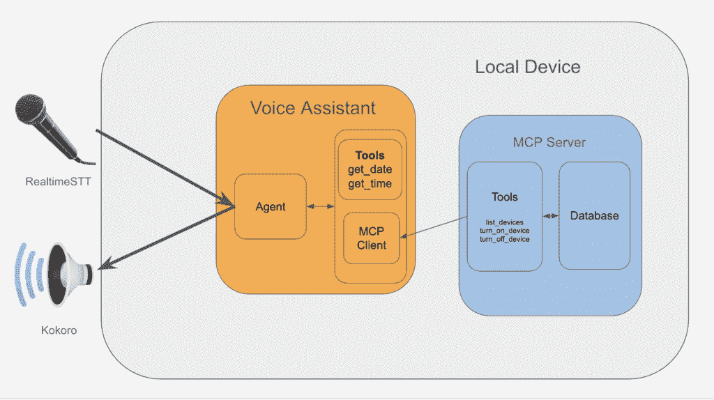
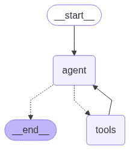
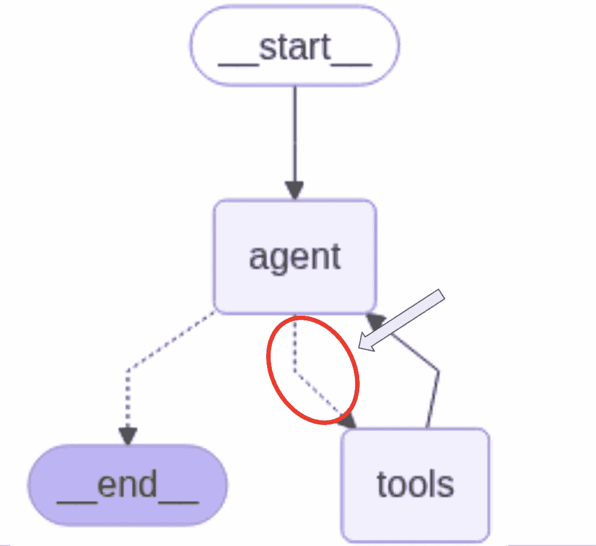

# 使用 LangGraph 和 MCP 服务器创建我的个人语音助手

> 原文：[`towardsdatascience.com/using-langgraph-and-mcp-servers-to-create-my-own-voice-assistant/`](https://towardsdatascience.com/using-langgraph-and-mcp-servers-to-create-my-own-voice-assistant/)

## 为什么？

<mdspan datatext="el1756963416264" class="mdspan-comment">我有一个亚马逊 Alexa</mdspan>，但我不喜欢它。为什么？它无法执行比基本语音命令更复杂的操作。

我最终只用它做三件事：

+   获取当前日期或时间

+   获取今天的天气信息

+   打开或关闭连接的设备（例如电视、灯光、机器人吸尘器）

这些是我唯一可以可靠使用它的东西。其他任何东西，我都会得到一个礼貌但无用的“*我无法帮助您*”。

随着 LLM 代理和 MCP 服务器的兴起，创建个人助手和聊天机器人变得比以往任何时候都容易。我自己也问自己，

> ***“为什么止步于聊天机器人？为什么不更进一步，创建我自己的语音助手？”***

这正是我尝试做的事情。

## 目标

所以我想，我的语音助手到底能做什么？

这是我最初的目标列表：

### 1. 在我的本地电脑上运行

我不想为使用 LLM 支付订阅费，实际上，我不想为任何事情付费。

我构建的任何东西都应该只在我的本地电脑上运行，无需担心成本或每个月月底剩余多少免费信用额。

### 2. 复制 Alexa 功能

让我们从小处着手——首先，我只想简单地复制我目前与 Alexa 拥有的功能。这将是一个很好的里程碑，在添加更多复杂和奢侈的功能之前。

它应该能够：

+   获取当前日期或时间

+   获取今天的天气信息

+   打开或关闭连接的设备（例如电视、灯光、机器人吸尘器）

在我们开始构建一个完整的托尼·斯塔克式的语音助手之前，这个语音助手可以计算如何回到过去。

### 3. 快速响应

如果响应不够快，语音助手就相当于没有。

提问并等待一分钟以上的响应是不可接受的。我希望能够提问并在合理的时间内得到响应。

然而，我知道无论我如何调整和重构，在我的可爱小 MacBook Air 上本地运行任何东西都会很慢。

所以现在，我不会期望毫秒级的响应时间。相反，响应时间应该比我执行任务/查询的时间更快。至少这样我知道我在节省时间。

在未来的文章中，我们将深入探讨我如何进行优化，以将响应时间缩短到毫秒级，而无需支付订阅费。

## 我的设备规格

+   **设备:** MacBook Air

+   **芯片:** Apple M3

+   **内存:** 16GB

## 1. 总体结构

我将项目结构如下：



图片由作者提供，整体项目结构图

### 语音助手

#### 1. 语音转文本 & 文本转语音

我们使用 `RealtimeSTT` 进行唤醒词检测（例如 *“Alexa”，“Hey Jarvis”，“Hey Siri”*）、语音检测和实时语音转文本转录。

将转录的文本发送到 *代理* 进行处理，然后将其响应流式传输到 `Kokoro` 文本转语音模型。然后输出被发送到扬声器。

#### 2. 代理

我们使用 `Ollama` 在本地运行 LLM。代理及其工作流程在 `LangGraph` 中实现。

代理负责接收用户查询，理解它，并调用它认为所需的工具来提供适当的响应。

我们的语音助手需要以下工具来实现我们的目标：

+   获取当前日期的函数。

+   获取当前时间的函数。

它还需要与智能家居设备交互的工具，但这个实现可能相当复杂，所以我们将其实现为一个单独的 MCP 服务器。

#### 3. 智能家居连接的 MCP 服务器

MCP 服务器是我们封装查找、连接和管理设备的复杂性的地方。

一个 SQL 数据库跟踪设备、它们的连接信息和它们的名称。

同时，工具是代理查找特定设备的连接信息，然后使用它来打开或关闭设备的方式。

现在，让我们深入了解每个组件的实现细节。

### 想要访问代码仓库吗？

对于希望获取本文附带的语音助手代码的各位，请访问我的 Patreon 页面 [这里](http://patreon.com/BenjaminLeeDataScience) 以获取访问权限，以及独家访问社区聊天室的机会，在那里您可以直接与我讨论此项目。

## 2. 实现细节

## 文本转语音 (TTS) 实现


图片由 [Oleg Laptev](https://unsplash.com/@snowshade?utm_content=creditCopyText&utm_medium=referral&utm_source=unsplash) 在 [Unsplash](https://unsplash.com/photos/orange-megaphone-on-orange-wall-QRKJwE6yfJo?utm_content=creditCopyText&utm_medium=referral&utm_source=unsplash) 提供

文本转语音层可能是最容易实现的。

给定一些假设来自代理的字符串，将其通过预训练的文本转语音模型传递，并将其流式传输到设备扬声器。

首先，让我们定义一个名为 `Voice` 的类，它将负责这项功能。

我们事先知道，除了我们用于语音合成的模型外，接收文本并将其流式传输到扬声器将与任何模型相关的内容保持解耦。

```py
class Voice():
    def __init__(
        self,
        sample_rate: int = 24000,
        chunk_size: int = 2048
    ):
        self.sample_rate = sample_rate
        self.chunk_size = chunk_size
        self.initialise_model()

    def initialise_model(self):
        """Initialise the model to use for TTS."""
        pass

    def convert_text_to_speech(self, text:str) -> list[np.ndarray]:
        """Convert text to sepeech and return the waveform as frames."""
        pass

    def speak(self, text:str):
        """Speak the provided text through device output."""
        frames = self.convert_text_to_speech(self, text)
        for frame in frames:
            self.output_stream.write(frame.tobytes())
```

因此，我们可以提前实现 `speak` 函数来流式传输文本到扬声器。

现在，我们可以找出哪些模型存在，哪个模型可以使用，以及如何使用它，然后将其连接到我们的 `Voice` 类中。

## TTS 模型测试

下面，我列出了我实验过的各种不同的 TTS 模型，以及您可以使用来复制结果的代码。

### 1. BarkModel ([链接](https://huggingface.co/suno/bark))

运行模型的快速入门代码：

```py
from IPython.display import Audio
from transformers import BarkModel, BarkProcessor

model = BarkModel.from_pretrained("suno/bark-small")
processor = BarkProcessor.from_pretrained("suno/bark-small")
sampling_rate = model.generation_config.sample_rate

input_msg = "The time is 3:10 PM."

inputs = processor(input_msg, voice_preset="v2/en_speaker_2")
speech_output = model.generate(**inputs).cpu().numpy()

Audio(speech_output[0], rate=sampling_rate)
```

**总结**

+   **优点**：非常逼真的语音合成，带有自然的“嗯”、“啊”等填充词。

+   **缺点**：短句的质量较差。句子的结尾听起来像是有后续句子会很快跟上来。

+   **缺点**：非常慢。生成“现在是下午 3:10”的语音需要 13 秒。

### 2. Coqui TTS ([链接](https://github.com/coqui-ai/TTS))

使用以下命令安装：

```py
pip install coqui-tts
```

测试代码

```py
from IPython.display import Audio
from TTS.api import TTS 

tts = TTS(model_name="tts_models/en/ljspeech/tacotron2-DDC", progress_bar=False)

output_path = "output.wav"
input_msg = "The time is 3:10 PM."
tts.tts_to_file(text=input_msg, file_path=output_path)
Audio(output_path)
```

**总结**

+   **优点**：快。生成“现在是下午 3:10”的语音只需要 0.3 秒。

+   **缺点**：文本归一化不够好。当涉及到时间相关的查询时，“PM”的发音不正确。当时间设置为“下午 1:10”时，“13”的发音无法识别。

### 3. Elevenlabs ([链接](https://elevenlabs.io/app/home))

使用以下命令安装：

```py
pip install elevenlabs
```

并使用以下命令运行：

```py
import dotenv
from elevenlabs.client import ElevenLabs
from elevenlabs import stream

dotenv.load_dotenv()

api_key = os.getenv('elevenlabs_apikey')

elevenlabs = ElevenLabs(
  api_key=api_key,
)

audio_stream = elevenlabs.text_to_speech.stream(
    text="The time is 03:47AM",
    voice_id="JBFqnCBsd6RMkjVDRZzb",
    model_id="eleven_flash_v2_5"
)

stream(audio_stream)
```

**总结**

在质量和响应时间方面，无疑是最好的，考虑到它是一个付费服务，这是理所当然的。

他们还提供了一些免费额度，无需订阅，但我在开发我的语音助手时更愿意完全不依赖它，所以我们现在先跳过。

### 4. Kokoro ([链接](https://github.com/hexgrad/kokoro))

我们把最好的留到最后。

使用以下命令安装：

```py
pip install kokoro pyaudio
```

测试代码：

```py
RATE = 24000
CHUNK_SIZE = 1024

p = pyaudio.PyAudio()
print(f"Input device: {p.get_default_input_device_info()}")
print(f"Output device: {p.get_default_output_device_info()}")

output_stream = p.open(
    format=pyaudio.paFloat32,
    channels=1,
    rate=RATE,
    output=True,
)
input_msg = "The time is 03:47AM"
generator = pipeline(input_msg, voice='af_heart')
for i, (gs, ps, audio) in enumerate(generator):
    print(i, gs, ps)

    for start in range(0, len(audio), CHUNK_SIZE):
        chunk = audio[start:start + CHUNK_SIZE]
        output_stream.write(chunk.numpy().astype(np.float32).tobytes())
```

**总结**

首先，它很快——与 Elevenlabs 相当，只是略微慢一点，考虑到示例文本，实际上并不明显。

其次，语音的质量也很好。当然，它可以更好，有时它听起来有点笨拙。

但平均而言，输出的质量非常准确。

## 定义`Voice`类

因此，我们决定使用 Kokoro 来实现我们的文本到语音功能。现在让我们为我们的`Voice`类填写空白。同时请注意，这是一个初步实现，我知道在未来我还会尝试其他模型。

因此，而不是直接在`Voice`类中实现特定模型的代码，我将创建一个继承自`Voice`的子类。

这样，我可以在不改变`Voice`类或解开耦合的代码的情况下，快速在不同模型之间切换。

```py
from kokoro import KPipeline

class KokoroVoice(Voice):
    def __init__(self, voice:str, sample_rate: int = 24000, chunk_size: int = 2048):
        """Initialise the model to use for TTS.

        Args:
            voice (str):
                The voice to use.
                See https://github.com/hexgrad/kokoro/blob/main/kokoro.js/voices/
                for all voices.
            sample_rate (int, optional):
                The sample rate to use. Defaults to 24000.
            chunk_size (int, optional):
                The chunk size to use. Defaults to 2048.
        """
        self.voice = voice
        super().__init__(sample_rate, chunk_size)

    def initialise_model(self):
        """Load the model to use for TTS."""
        self.pipeline = KPipeline(lang_code="b")

    def convert_text_to_speech(self, text:str) -> list[np.ndarray]:
        """Convert text to speech and return the waveform as frames."""
        generator = self.pipeline(text, voice=self.voice)
        frames = []
        for i, (_, _, audio) in enumerate(generator):
            for start in range(0, len(audio), self.chunk_size):
                chunk = audio[start : start + self.chunk_size]
                frames.append(chunk.numpy().astype(np.float32))
        return frames
```

现在，这个实现允许我们在从代理接收文本的地方简单地导入并实例化这个类，然后使用以下方式将其流式传输到设备扬声器：

```py
text = "Hello world"
voice = KokoroVoice(**kwargs)
voice.speak(text)
```

## 智能家居 MCP 服务器实现


图片由[Fajrul Islam](https://unsplash.com/@mfajruli?utm_content=creditCopyText&utm_medium=referral&utm_source=unsplash)在[Unsplash](https://unsplash.com/photos/icon-9sO9CKo37Rg?utm_content=creditCopyText&utm_medium=referral&utm_source=unsplash)提供

这个 MCP 服务器专门用于查找、连接和管理智能家居设备。它位于一个独立的仓库中，与语音助手很好地分离。

在撰写本文时，我拥有的唯一智能家居设备是一个 Tapo 智能插头。您可以通过使用`python-kasa`库与 Tapo 设备进行交互。

我们的服务器需要执行以下操作：

+   给定一个设备名称，将其打开或关闭。

+   发现新设备并将它们添加到数据库中。

+   使用最新的设备信息更新设备数据库——这包括设备的名称、IP 地址和 MAC 地址。

### 1. 数据库

首先，让我们看看我们将如何将设备信息存储在 SQL 数据库中。为了简单起见，我将选择 `duckdb` 作为数据库后端。

#### 设备表

我们首先定义了我们第一个（也是唯一一个）名为 `device` 的表的架构。

```py
# src/smarthome_mcp_server/database.py

import os
import duckdb
from dataclasses import dataclass

@dataclass
class TableSchema:
    name:str
    columns:dict[str, str]
    primary_key:list[str]

def get_device_table_schema():
    return TableSchema(
        name="device",
        columns={
            "device_id" : "VARCHAR",
            "name": "VARCHAR",
            "ip_address": "VARCHAR",
        },
        primary_key=["device_id"],
    )
```

`device_id` 是主键，并且根据定义需要唯一标识我们家中所有的设备。幸运的是，每个 Tapo 设备都有一个唯一的设备-id，我们可以使用它。

`name` 是用户将引用的设备名称。例如，在我们的案例中，Tapo 智能插头连接到我们的客厅灯，并命名为 `lights`。这个名称是通过 Tapo 应用程序分配的。

最后，`ip_address` 列将是用于连接设备以控制它的 IP 地址。

#### 数据库初始化

我们创建了一些辅助函数，如 `get_create_table_if_not_exists_query` 和 `initialise_database` 函数，我们可以调用这些函数来在首次启动时创建数据库。

为了简洁，我只展示了 `initialise_database` 函数，因为前面的内容是显而易见的：

```py
def initialise_database(db_path:os.PathLike) -> duckdb.DuckDBPyConnection:
    """Get the database connection and create the tables if they don't exist."""
    conn = duckdb.connect(db_path)

    # initialise if not exists tables
    conn.execute(
        get_create_table_if_not_exists_query(get_device_table_schema())
    )

    return conn
```

### 设备管理

最后，我们实现将与设备交互并更新数据库的代码。

```py
import duckdb
from dotenv import 

class DeviceManager:
    def __init__(self, conn:duckdb.DuckDBPyConnection) -> None:
        self._conn = conn

    ...

    async def turn_on_device(self, device_name: str) -> str:
        """Turn on a device.

        Args:
            device_name (str):
                The name of the device to turn on.
        """
        try:
            device = await self._get_device(device_name)
        except DeviceNotFoundError as e:
            logger.exception(e)
            return f"Device {device_name} not found."

        await device.turn_on()
        return f"Device {device_name} turned on."

    async def turn_off_device(self, device_name: str) -> str:
        """Turn off a device.

        Args:
            device_name (str):
                The name of the device to turn off.
        """
        try:
            device = await self._get_device(device_name)
        except DeviceNotFoundError as e:
            logger.exception(e)
            return f"Device {device_name} not found."

        await device.turn_off()
        return f"Device {device_name} turned off."

    async def list_devices(self) -> list[str]:
        """List the available device names.

        Returns:
            list[str]:
                A list of device names.
        """
        results = self._conn.query("SELECT name FROM device").fetchall()

        return [result[0] for result in results]
```

上面的三种方法将成为我们注册为语音助手工具的公共方法。

为了简洁，我们省略了私有方法。

我在编写这段代码后意识到的一件事是，`DeviceManager` 非常特定于 `Tapo`。在查看集成非 Tapo 设备后，我意识到我天真地认为其他智能设备 API 会遵循相同的、标准化的模式。

因此，在未来，这个类需要更改为 `TapoDeviceManager`，并且需要进一步抽象以适应这种可变性。

例如，最近我为我的卧室购买了一些 Wiz 灯泡。结果发现，API 不会通过应用程序获取分配给每个设备的名称，这在 Tapo 中是默认可用的。

因此，我需要考虑在后台获取它的某种方法，或者当它不存在时使用语音助手来填充它。

### 3. 使用 FastMCP 将工具暴露给语音助手

最后，我们需要将我们编写的这些方法暴露为语音助手使用的工具。

```py
from fastmcp import FastMCP

def register_device_manager_tools(mcp_instance: FastMCP, device_manager: DeviceManager) -> FastMCP:
    """Register the methods defined in DeviceManager as tools for MCP server."""
    mcp_instance.tool(name_or_fn=device_manager.list_devices)
    mcp_instance.tool(name_or_fn=device_manager.turn_off_device)
    mcp_instance.tool(name_or_fn=device_manager.turn_on_device)
    return mcp_instance

async def populate_database(device_manager: DeviceManager):
    """Find all devices that are available and update the database.

    Discover all available devices and get their latest states.

    Note:
        Device names may have changed via the mobile app, thus this
        step is necessary when starting the server.
    """
    all_devices = await device_manager.discover_new_devices()
    upsert_coroutines = [device_manager._upsert_device(device) for device in all_devices.values()]
    await asyncio.gather(*upsert_coroutines)

def initialise_server(db_path: os.PathLike) -> FastMCP:
    """Initialise the server.

    Args:
        db_path (os.PathLike):
            The path to the duckdb database which
            stores the server information.
    Returns:
        FastMCP: The FastMCP server.
    """
    conn = initialise_database(db_path)
    device_manager = DeviceManager(conn)

    # find all devices that are available and update the database
    asyncio.run(populate_database(device_manager))

    mcp = FastMCP(
        name="smarthome-mcp-server",
        instructions="This server is for finding and controlling smarthome devices.",
    )

    register_device_manager_tools(mcp, device_manager)
    return mcp
```

`initialise_server` 是我们初始化和预填充数据库，并运行服务器的地方。

注意我们每次启动时都会填充数据库。这是必要的，因为设备名称可能在两次运行之间通过 Tapo 应用程序进行了更新，所以这是尝试获取所有设备的最新信息的尝试。

现在，我知道实现中存在一些漏洞——这是一个初步尝试和持续的项目，所以如果你看到任何问题或潜在的改进，请通过我的 Patreon 账户告诉我（见文章末尾）。

### 服务器入口点

我们使用`typer`将我们的服务器变成一个 CLI 应用程序。

```py
# __main__.py

load_dotenv()

app = typer.Typer()
console = Console()

@app.command()
def main():
    config = load_config()

    # set up server data directory
    root_dir = platformdirs.user_data_path(
        appname="smarthome-mcp-server",
        ensure_exists=True
    )
    db_path = Path(root_dir) / config.database.path
    db_path.parent.mkdir(parents=True, exist_ok=True)
    logger.info("Server data directory: %s", db_path)

    # init and run
    mcp_instance = initialise_server(db_path)
    asyncio.run(mcp_instance.run_stdio_async())

if __name__ == "__main__":
    app()
```

然后我们运行服务器`python3 -m smarthome_mcp_server`：

```py
 ╭─ FastMCP 2.0 ────────────────────────────────────────────────────────────╮
│                                                                          │
│        _ __ ___ ______           __  __  _____________    ____           │
│    ____                                                                  │
│       _ __ ___ / ____/___ ______/ /_/  |/  / ____/ __ \  |___ \  / __    │
│    \                                                                     │
│      _ __ ___ / /_  / __ `/ ___/ __/ /|_/ / /   / /_/ /  ___/ / / / /    │
│    /                                                                     │
│     _ __ ___ / __/ / /_/ (__  ) /_/ /  / / /___/ ____/  /  __/_/ /_/     │
│    /                                                                     │
│    _ __ ___ /_/    \__,_/____/\__/_/  /_/\____/_/      /_____(_)____/    │
│                                                                          │
│                                                                          │
│                                                                          │
│    🖥️  Server name:     smarthome-mcp-server                              │
│    📦 Transport:       STDIO                                             │
│                                                                          │
│    📚 Docs:            https://gofastmcp.com                             │
│    🚀 Deploy:          https://fastmcp.cloud                             │
│                                                                          │
│    🏎️  FastMCP version: 2.11.2                                            │
│    🤝 MCP version:     1.12.4                                            │
│                                                                          │
╰──────────────────────────────────────────────────────────────────────────╯

[08/19/25 05:02:55] INFO     Starting MCP server              server.py:1445
                             'smarthome-mcp-server' with                    
                             transport 'stdio' 
```

### 4. 使用智能家居工具

现在服务器已经实现，我们可以定义一些方法，这些方法将通过客户端与服务器交互。这个客户端将被用来注册语音助手使用的工具。

回到语音助手仓库：

```py
from langchain_mcp_adapters.client import MultiServerMCPClient

def get_new_mcp_client() -> MultiServerMCPClient
    return MultiServerMCPClient(
        {
            "smarthome-mcp-server": {
                "command": "smarthome_mcp_server",
                "args": [],
                "transport": "stdio",
            }
        }
    )
```

此方法使用方便的`MultiServerMCPClient`类来注册我们的智能家居 MCP 服务器以供工具使用。

返回的客户端对象随后公开一个`get_tools`方法，该方法返回所有注册服务器公开的工具。

```py
mcp_client = get_new_mcp_client()
tools = await mcp_client.get_tools()
```

注意我们在这里如何使用`await`，因为`get_tools`方法是非同步的。

通过定义一个名为`get_mcp_server_tools`的函数：

```py
def get_mcp_server_tools():
    mcp_client = get_new_mcp_client()
    tools = await mcp_client.get_tools()
    return tools
```

这个单一函数可以被导入到我们定义代理并注册工具以供使用的地方。

## 语音转文本实现


图片由[Franco Antonio Giovanella](https://unsplash.com/@francogio?utm_content=creditCopyText&utm_medium=referral&utm_source=unsplash)在[Unsplash](https://unsplash.com/photos/brown-donut-on-white-table-PVDWaEhSIAg?utm_content=creditCopyText&utm_medium=referral&utm_source=unsplash)提供

语音转文本（STT）在这里有很多复杂性，因为它需要实时 IO 处理。

STT 本身足够简单，我们可以使用很多模型。但使其复杂的是，需要能够*持续*监听用户的语音输入，这包括唤醒词和查询。

唤醒词是你通常用来触发语音助手开始监听你的词。例如，“嘿，谷歌”或“嘿，Siri”，或“Alexa”。

我可以完全自己编写这段代码，但为了使事情更简单，我快速搜索了一下，以防有现成的可以使用的工具。

令我惊讶的是，我发现了一个名为`RealtimeSTT`的包（链接[这里](https://github.com/KoljaB/RealtimeSTT)），它工作得非常完美。

### 简而言之，它是如何工作的

1.  为监听用户的语音输入创建一个线程。另一个用于转录，它运行 STT 模型。

1.  如果检测到唤醒词，开始记录用户的语音输入。

1.  记录的音频随后被发送到 STT 模型进行转录，并返回作为字符串的转录文本。

要使用此包，我们只需像下面这样使用`AudioToTextRecorder`类作为上下文管理器：

```py
from RealtimeSTT import AudioToTextRecorder

with AudioToTextRecorder(
    model='tiny',
    wakeword_backend='oww',
    wake_words='hey jarvis',
    device='cpu',
    wake_word_activation_delay=3.0,
    wake_word_buffer_duration=0.15,
    post_speech_silence_duration=1.0
) as recorder:
    while True:
        # get the transcribed text from recorder
        query = recorder.text()
        if (query is not None) and (query != ""):

            # get response from our langgraph agent
            response_stream = await get_response_stream(
                query, agent_executor, thread_config
            )

            # output the response to device audio
            await stream_voice(response_stream, output_chunk_builder, voice)
```

我们将在下一节回到`get_response_stream`和`stream_voice`方法，因为这也涉及到我们如何定义我们的代理。

但仅仅以我们目前的方式组合`AudioToTextRecorder`上下文管理器，我们就已经实现了一个语音 -> 文本 -> 响应机制。

如果你将`get_response_stream`替换为任何 LLM 代理，并将`stream_voice`替换为任何文本到语音代理，你将拥有一个工作的语音助手。

你也可以使用简单的`print`语句，这样你就有了一个基本的语音输入聊天机器人。

## 代理实现

最后，是好的东西 — 代理实现。

我把它放在最后，因为它稍微复杂一些。让我们深入探讨。

### LangGraph — 它是什么？

LangGraph 是一个用于构建具有语言模型代理的状态化、基于图的流程框架。

节点封装了与 LLM 代理可以采取的动作相关的任何逻辑。

边封装了确定如何从一个节点转换到另一个节点的逻辑。

`LangGraph`实现了一个预构建的图，我们可以通过`create_react_agent`方法获取它。图看起来像这样：



图片由作者提供。由`create_react_agent`方法返回的图

让我们用这个例子来更好地解释节点和边是如何工作的。

如您所见，图非常简单：

+   给定一个查询（`__start__`节点）

+   `agent`节点将接收查询并确定它是否需要调用工具才能适当地响应。

    +   如果是，我们转换到`tool`节点。一旦收到工具响应，我们就回到`agent`节点。

    +   代理将反复调用适当的工具，直到确定它拥有所需的一切。

+   然后，它将返回其响应（`__end__`节点）

`agent`、`tools`和`__end__`节点之间的条件转换表示为虚线。那么问题是：

> *我们如何确定下一个要访问的节点？*

好吧，Langgraph 维护了已发送的消息日志，这代表了图的状态。

消息可以来自用户、代理或工具。在这个例子中，`agent`节点将创建一个明确表示它将调用工具的消息（具体方法将在下一节中揭晓）。

这个工具调用的存在触发了从`agent`节点到`tools`节点的转换。

如果没有调用任何工具，则触发从`agent`节点到`__end__`节点的转换。

这是在`agent`、`tools`和`__end__`节点之间的条件边中实现的工具调用存在性检查。

在未来的文章中，我将介绍如何创建一个定制的代理图以优化延迟，并展示这些条件边和节点是如何实现的。

目前，我们不需要对此进行太多细节说明，因为预构建的图已经足够满足本文的范围。

### 我们的代理实现

因此，我们定义了一个名为`get_new_agent`的函数，如下所示：

```py
from langgraph.prebuilt import create_react_agent
from langgraph.graph.state import CompiledStateGraph

from voice_assistant.tools.datetime import get_tools as get_datetime_tools

def get_new_agent(
    config, short_term_memory, long_term_memory
) -> CompiledStateGraph:
    """Build and return a new graph that defines the agent workflow."""

    # initialise the LLM
    model = init_chat_model(
        model=config.Agent.model,
        model_provider=config.Agent.model_provider,
        temperature=0,
        reasoning=config.Agent.reasoning
    )

    # initialise the tools that the agent will use
    server_tools = await get_mcp_server_tools()

    tools = (
        get_datetime_tools()
        + server_tools
    )

    # build the agent workflow given the LLM, its tools and memory.
    agent_executor = create_react_agent(
        model,
        tools,
        checkpointer=short_term_memory,
        store=long_term_memory
    )

    return agent_executor
```

它负责：

1.  **初始化 LLM**

    +   `init_chat_model`返回指定提供者的 LLM。在我们的案例中，我们使用 Ollama 作为我们的提供者，并使用`llama3.2:latest`作为我们的模型类型。

1.  **定义代理将使用的完整工具集。**

    +   我们有一个名为`get_datetime_tools()`的函数，它返回一个`StructuredTool`对象的`list`。

    +   我们还有`server_tools`，这是我们之前提到的 MCP 服务器为家庭自动化提供的工具列表。

    +   此外，如果我们希望扩展代理可以使用的工具集，这就是添加它们的地方。

1.  **根据 LLM 及其工具构建代理工作流程。**

    +   这里我们调用 LangGraph 中的`create_react_agent`函数。

    +   该函数还可以接受`checkpointer`和`store`对象，这些对象用于持久化代理的状态，充当短期和长期记忆。

    +   在未来，如果我们想使用自定义图，我们可以用我们自己的实现替换`create_react_agent`函数调用。

### 处理代理响应

现在，我们迄今为止已经实现了我们需要的所有组件，

1.  获取用户查询

1.  获取工具

1.  创建代理

下一步是运行代理以获取查询的响应，并通过我们之前定义的`Voice`方法输出。

给定我们从我们的 STT 实现中接收到的用户查询文本，我们将其格式化为字典：

```py
user_query = "Hello world!"
user_query_formatted = {
    "role": "user",
    "content": user_query
}
```

这个字典告诉代理消息来自用户。

我们还添加了一个系统提示来设置上下文并向代理给出指令：

```py
system_prompt_formatted = {
    "role": "system",
    "content": (
        "You are a voice assistant called Jarvis."
        + " Keep your responses as short as possible."
        + "Do not format your responses using markdown, such as **bold** or _italics. ",
    )
}
```

这两条消息随后被传递给代理以获取响应：

```py
response = agent_executor.invoke(
    {"messages" : [system_prompt_formatted, user_query_formatted]},
)
```

响应是一个包含消息的字典（为了简洁，我们省略了任何多余的内容）：

```py
output
> {
    "messages": [
        SystemMessage(
            content="You are a voice assistant called Jarvis.Keep your responses as short as possible.Do not format your responses using markdown, such as **bold** or _italics. ",
            additional_kwargs={},
            ...
        ),
        HumanMessage(
            content="What time is it?",
            additional_kwargs={},
            ...
        ),
        AIMessage(
            content="",
            additional_kwargs={},
            tool_calls=[
                {
                    "name": "get_current_time",
                    "args": {},
                    "id": "b39f7b12-4fba-494a-914a-9d4eaf3dc7d1",
                    "type": "tool_call",
                }
            ],
            ...
        ),
        ToolMessage(
            content="11:32PM",
            name="get_current_time",
            ...
        ),
        AIMessage(
            content="It's currently 11:32 PM.",
            additional_kwargs={},
            ...
        ),
    ]
}
```

如你所见，输出是整个图执行过程中创建的所有消息的列表。

第一条消息始终是`HumanMessage`或`SystemMessage`，因为这是我们提供给代理作为输入的（即`__start__`节点）。

剩余的是代理或工具返回的消息，按照它们被调用的顺序。

例如，你可以看到第一个`AIMessage`，这是由 LLM 生成的消息类型，其中包含一个使用`get_current_time`工具的工具调用。

`AIMessage`中存在`tool_calls`属性会触发从`agent`节点到`tools`节点的条件转换。



图片由作者提供。带有从`agent`和`tools`出发的红色条件边的图被突出显示。

然后你会看到`ToolMessage`，这是由`get_current_time`工具返回的响应。

最后，模型以对用户查询的实际响应来回应。`AIMessage`中缺少`tool_calls`属性意味着图应该过渡到`__end__`节点并返回响应。

### 降低延迟


图片由[Lukas Blazek](https://unsplash.com/@goumbik?utm_content=creditCopyText&utm_medium=referral&utm_source=unsplash)在[Unsplash](https://unsplash.com/photos/person-holding-white-mini-bell-alarmclock-UAvYasdkzq8?utm_content=creditCopyText&utm_medium=referral&utm_source=unsplash)提供

回到调用代理以获取响应，使用`invoke`方法的问题是我们在收到响应之前需要等待整个工作流程完成。

这可能需要很长时间，尤其是如果代理正在处理一个复杂的查询。同时，用户会无所事事地等待代理响应，这会导致用户体验不佳。

因此，为了改进这一点，我们可以使用`LangGraph`中的`stream`模式来流式传输生成的响应。

这允许我们开始语音响应，而不是等待整个响应生成后一次性语音输出。

```py
output_stream = agent_executor.stream(
    {"messages" : [system_prompt_formatted, user_query_formatted]},
    stream_mode="messages"
)
```

在这里，`output_stream`是一个生成器，它将按顺序产生消息和消息元数据。

注意，这个方法有一个异步版本，称为`astream`，它做的是完全相同的事情，但返回一个`AsyncIterator`。

如果我们查看此更改后的消息：

```py
print([chunk for chunk, metadata in output])

>   AIMessageChunk(
        content="",
        tool_calls=[{"name": "get_current_time", ...}],
        tool_call_chunks=[{"name": "get_current_time", "args": "{}", ...}],
    ),
    ToolMessage(content="01:21AM", name="get_current_time", ...),
    AIMessageChunk(content="It", ...),
    AIMessageChunk(content="'s", additional_kwargs={}, ...),
    AIMessageChunk(content=" currently", ...),
    AIMessageChunk(content=" ",), 
    AIMessageChunk(content="1", ...), 
    AIMessageChunk(content=":", ...), 
    AIMessageChunk(content="21", ...),
    AIMessageChunk(content=" AM", ...),
    AIMessageChunk(content=".", ...),
    AIMessageChunk(content="", ...),
```

你现在可以看到，标记（tokens）是按照生成顺序返回的。

但这又提出了一个新的问题！

我们不能仅仅给 TTS 模型单个标记（tokens），因为它会逐个发音每个标记，即`"It"`，`"'s"`会被分开发音，这绝对不是我们想要的。

> **因此，我们需要做出权衡**

虽然我们需要流式传输响应以最小化用户等待时间，但我们仍然需要等待积累足够的标记（tokens）形成一个有意义的块，然后再将它们发送到 TTS 模型。

### 构建输出块

因此，我们通过定义一个`OutputChunkBuilder`来处理这种复杂性。那么，什么构成一个*有意义的*块？

首先想到的是等待一个完整的句子，即直到以`.`, `?`, `;`, `!`之一结束才将所有标记（tokens）附加在一起。

通过反复试验，我们还发现，当代理返回特别长的响应并使用项目符号时，将`\n`包含在这个列表中也是明智的。

```py
class OutputChunkBuilder:
    def __init__(self):
        self._msg = ""
        self.end_of_sentence = (".", "?", ";", "!", "\n")

    def add_chunk(self, message_chunk:str):
        self._msg += message_chunk

    def output_chunk_ready(self) -> bool:
        return self._msg.endswith(self.end_of_sentence)
```

我们通过上述代码实现这一点，包括一个函数将消息块追加到一个名为`_msg`的缓冲区中，以及一个函数检查收集的消息是否准备好（即是否是一个完整的句子或以新行结束）。

```py
class OutputChunkBuilder:

    ... # omitted for brevity

    def _reset_message(self):
        self._msg = ""

    def get_output_chunk(self):
        msg = self._msg # Get the current message chunk
        self._reset_message()
        return msg
```

我们还实现了`get_output_chunk`函数，该函数将返回迄今为止收集的消息，并将消息缓冲区重置为空字符串，以便准备好收集下一组块。

这使我们能够使用如下逻辑逐句流式传输响应：

```py
def stream_voice(msg_stream, output_chunk_builder):
    for chunk, metadata in msg_stream:
        # append the chunk to our buffer
        if chunk.content != "":
            output_chunk_builder.add_chunk(chunk.content)

        # speak the output chunk if it is ready
        if output_chunk_builder.output_chunk_ready():
            voice.speak(output_chunk_builder.get_output_chunk())
```

## 工具实现


图片由[Barn Images](https://unsplash.com/@barnimages?utm_content=creditCopyText&utm_medium=referral&utm_source=unsplash)在[Unsplash](https://unsplash.com/photos/assorted-handheld-tools-in-tool-rack-t5YUoHW6zRo?utm_content=creditCopyText&utm_medium=referral&utm_source=unsplash)提供

最后，让我们看看我们如何实现获取当前日期和时间的工具。

这非常简单，到目前为止，这是最简单的实现。你创建的任何函数都可以用作工具，只要文档字符串写得很好，格式也很清晰。

标记函数为工具的主要有两种方式：

1.  使用来自 `langchain_core.tools` 的 `@tool` 装饰器

1.  使用来自 `langchain_core.tools.structured` 的 `StructuredTool` 类

为了更容易地对我们的工具进行单元测试，我们选择了第二种方案，因为第一种方案不允许我们将工具函数导入到我们的测试中。

首先，编写获取时间和日期的函数，就像我们通常做的那样：

```py
# tools/datetime.py

from datetime import datetime
from langchain_core.tools.structured import StructuredTool

def get_now_datetime() -> datetime:
    """Wrapper for easier mocking in unit test."""
    return datetime.now()

def get_current_time() -> str:
    """Get the current time in format HH:MM AM/PM"""
    return get_now_datetime().strftime("%I:%M%p")
```

此外，我们编写了一个简单的包装函数，名为 `get_now_datetime`，它返回当前的 `datetime`，这也有助于我们在单元测试中进行模拟。

接下来，一个用于获取当前日期的函数。

```py
def _convert_date_to_words(dt: datetime):
    """Change date values represented in YYYY-mm-dd format to word values as they would be pronounced."""
    day = dt.day
    if day == 1 or day == 21 or day == 31:
        day_word = f"{day}st"
    elif day == 2 or day == 22:
        day_word = f"{day}nd"
    elif day == 3 or day == 23:
        day_word = f"{day}rd"
    else:
        day_word = f"{day}th"

    date_obj = dt.strftime(f"%B {day_word}, %Y")
    return date_obj

def get_current_date() -> str:
    """Get the current date in format YYYY-MM-DD"""
    dt = get_now_datetime()
    dt_str = _convert_date_to_words(dt)
    return dt_str
```

我们必须小心这里——不同的文本到语音（TTS）模型在文本归一化方面的能力各不相同。

**示例**

> 如果函数 `get_current_date` 返回字符串 `01-01-2025`，TTS 模型可能会将其发音为 ‘*oh one oh one twenty twenty five*’。

为了使我们的实现能够应对这些差异，我们使用 `_convert_date_to_words` 函数将日期字符串归一化，以便更清晰地说明日期应该如何发音。

在这样做的时候，我们将 `datetime` 对象如 `datetime(2025, 1, 1)` 转换为 `January 1st, 2025`。

最后，我们编写了一个 `get_tools` 函数，它将 `get_current_time` 和 `get_current_date` 方法包装成一个 `StructuredTool`，并以列表的形式返回它们：

```py
def get_tools():
    """Get a list of tools for the agent.

    Returns:
        A list of tool functions available to the agent.
    """
    return [
        StructuredTool.from_function(get_current_time),
        StructuredTool.from_function(get_current_date),
    ]
```

因此，我们可以在创建代理时导入此函数并调用它，就像我们在代理实现部分看到的那样。

## 将所有这些放在一起构建我们的 Agent

现在，我们已经了解了构成我们的语音助手的各个组件，是时候将它们组装在一起了。

```py
# main.py

from RealtimeSTT import AudioToTextRecorder
from langgraph.checkpoint.sqlite.aio import AsyncSqliteSaver
from langgraph.store.sqlite.aio import AsyncSqliteStore

from voice_assistant.agent import get_new_agent, get_response_stream
from voice_assistant.voice import KokoroVoice
from settings import load_config

async def main():

    conf = load_config()
    voice = KokoroVoice(**conf.KokoroVoice)
    output_chunk_builder = OutputChunkBuilder()
    thread_config = {"configurable": {"thread_id": "abc123"}}

    # short term memory
    async with AsyncSqliteSaver.from_conn_string(conf.Agent.memory.checkpointer) as saver:

            # long term memory
            async with AsyncSqliteStore.from_conn_string(conf.Agent.memory.store) as store:

                agent_executor = await get_new_agent(conf, saver, store)

                with AudioToTextRecorder(**conf.AudioToTextRecorder) as recorder:
                    while True:
                        query = recorder.text()
                        if (query is not None) and (query != ""):
                            response_stream = await get_response_stream(
                                query, agent_executor, thread_config
                            )
                            await stream_voice(response_stream, output_chunk_builder, voice)

if __name__ == "__main__":
    asyncio.run(main())
```

首先，我们使用 `OmegaConf` 加载我们的 Yaml 配置文件（链接 [这里](https://omegaconf.readthedocs.io/en/2.3_branch/)）。`settings` 模块和 `load_config` 实现如下：

```py
# settings.py

import logging
from pathlib import Path
from omegaconf import OmegaConf

logger = logging.getLogger(__name__)

CONFIG_PATH = Path(__file__).parents[1] / "conf" / "config.yaml"

def load_config():
    logger.debug(f"Loading config from: {CONFIG_PATH}")
    return OmegaConf.load(CONFIG_PATH)
```

其次，我们使用 SQL 数据库来存储我们的短期和长期记忆——这是通过 `langgraph` 中的 `checkpoint` 和 `store` 模块中的 `AsyncSqliteSaver` 和 `AsyncSqliteStore` 类来完成的。

```py
from langgraph.checkpoint.sqlite.aio import AsyncSqliteSaver
from langgraph.store.sqlite.aio import AsyncSqliteStore

    ... # omitted for brevity 

    # short term memory
    async with AsyncSqliteSaver.from_conn_string(conf.Agent.memory.checkpointer) as saver:

            # long term memory
             async with AsyncSqliteStore.from_conn_string(conf.Agent.memory.store) as store:

                 agent_executor = await get_new_agent(conf, saver, store)
                 ... # omitted for brevity 
```

然后，在一个循环中，STT 线程在检测到唤醒词后记录用户的语音输入，然后将其传递给代理进行处理。

代理响应以 AsyncIterator 返回，然后我们使用 `stream_voice` 函数将其流式传输到设备扬声器。

`stream_voice` 函数看起来像这样：

```py
async def stream_voice(
    msg_stream: AsyncGenerator,
    output_chunk_builder: OutputChunkBuilder,
    voice: Voice
):
    """Stream messages from the agent to the voice output."""
    async for chunk, metadata in msg_stream:
        if metadata["langgraph_node"] == "agent":
            # build up message chunks until a full sentence is received.
            if chunk.content != "":
                output_chunk_builder.add_chunk(chunk.content)

            if output_chunk_builder.output_chunk_ready():
                voice.speak(output_chunk_builder.get_output_chunk())

    # if we have anything left in the buffer, speak it.
    if output_chunk_builder.current_message_length() > 0:
        voice.speak(output_chunk_builder.get_output_chunk())
```

这与我们在 `构建输出块` 部分之前讨论的逻辑相同，但有一些小的调整。

结果表明，并非所有响应都以标点符号结尾。

例如，当 LLM 在其响应中使用项目符号时，我发现它们省略了每个项目符号的标点符号。

因此，我们确保在结束时清除我们的缓冲区，如果它不为空。

我们还过滤掉任何不是来自代理的消息，因为我们不想将用户的输入或工具的响应流回设备扬声器。我们通过检查`langgraph_node`元数据键来完成这项工作，并且只有当消息来自代理时才说话。

结果证明，这就是构建一个完全功能化的语音助手所需的一切。

## 最后的话

总体来说，我对构建这个系统如此容易感到非常惊喜。

当然，还有更多的优化可以做出，但考虑到我能够在两周内（同时全职工作）使所有功能正常工作，我对结果感到满意。

但我们还没有完成。

有很多事情我无法讨论，以免这篇文章变成一本书，例如我为了使语音助手更快而必须做出的额外优化，这些内容将在我的下一篇文章中介绍。

对于喜欢这篇文章的你们，可以在 Medium 上查看我的其他文章，请访问[`medium.com/@bl3e967`](https://medium.com/@bl3e967)

## 相关文章

+   [继承：数据科学家必须了解以成功的关键软件工程概念](https://medium.com/data-science-collective/inheritance-a-software-engineering-concept-data-scientists-must-know-to-succeed-dd73a28fc105)

+   [封装：数据科学家必须了解以成功的关键软件工程概念](https://medium.com/data-science/encapsulation-a-software-engineering-concept-data-scientists-must-know-to-succeed-b3b1a0a42a41)

+   [抽象类：数据科学家必须了解以成功的关键软件工程概念](https://medium.com/data-science-collective/abstract-classes-a-software-engineering-concept-data-scientists-must-know-to-succeed-af6df1e337cd)
