# 使用 LLamaIndex Workflow 实现类似 OpenAI Swarm 的代理交接功能

> 原文：[`towardsdatascience.com/using-llamaindex-workflow-to-implement-an-agent-handoff-feature-like-openai-swarm-9a63420c8540/`](https://towardsdatascience.com/using-llamaindex-workflow-to-implement-an-agent-handoff-feature-like-openai-swarm-9a63420c8540/)


使用 LLamaIndex Workflow 实现类似 OpenAI Swarm 的代理交接功能。图由 DALL-E-3 提供

祝大家新年快乐，我的朋友们！

在上一篇文章中，我介绍了 LlamaIndex 的 Workflow 框架。

> [**深入探讨 LLamaIndex Workflow：事件驱动的 LLM 架构**](https://towardsdatascience.com/deep-dive-into-llamaindex-workflow-event-driven-llm-architecture-8011f41f851a)

今天，我将向您展示如何使用 LlamaIndex Workflow 实现一个类似于[OpenAI Swarm](https://github.com/openai/swarm?ref=dataleadsfuture.com)的多代理编排功能，以一个客服聊天机器人项目为例。

* * *

## 简介

记得不久前 OpenAI 发布的 Swarm 框架吗？它的最大特点是代理和交接。

代理很简单：它们使用一组特定的命令和工具来完成任务。就像把一个 LLM 功能调用放入一个整洁的包中。

而交接则不同。它们允许代理根据当前对话的上下文，无缝地将工作传递给另一个代理，使代理能够无障碍地协同工作。

### 为什么这很重要

让我们看看一个解释 ReactAgent 整个过程的图表。

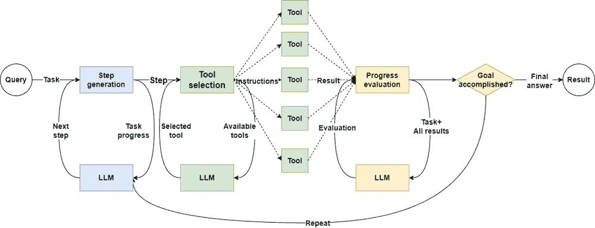

ReactAgent 至少需要三次访问 LLM 才能完成。图由作者提供

就是一个简单的代理调用，就像一、二、三，至少需要三次访问 LLM 才能完成。

传统的代理应用是这样的，保持对话上下文和用户状态，代理调用链通常是固定的。对于每个用户请求，代理必须多次调用 LLM 来检查状态，而且坦白说，有些调用是不必要的。

这里有一个例子：假设我们有一个电子商务网站，我们需要一个客服团队来回答用户的问题。


在代理链中，代理按顺序调用。图由作者提供

在链式代理应用中，每个用户的问题都先到前台，然后前台询问预销售服务。如果他们无法回答，前台会询问售后服务，然后前台重新组织后端答案并回复客户。

这不是有点荒谬吗？看看它造成的所有不必要的延迟和调用成本！

### Swarm 是如何做到的

Swarm 使用了一种更适合现实世界的交接方法。让我再次使用那个客户服务示例：

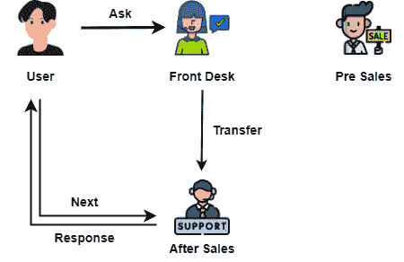

代理交接允许您直接与相应的客户服务互动。图片由作者提供

想象一家名为 Swarm 的商店。当顾客向前台提问时，前台会确定问题的类型（售前或售后）并将顾客转接到相应的服务。然后，顾客直接与该服务交谈。

想象一家名为 Swarm 的商店。当顾客向前台提问时，前台会确定问题的类型（售前或售后）并将顾客转接到相应的服务。然后，顾客直接与该服务交谈。

听起来合理，对吧？那么为什么我们不直接使用 Swarm？

### 为什么不直接使用 Swarm

因为 Swarm 仍然只是一个实验性框架。根据官方声明：

> Swarm 目前是一个旨在探索多代理系统人机界面的实验性样例框架。它不打算用于生产，因此没有官方支持。（这也意味着我们不会审查 PR 或问题！）

因此，我们无法直接在生产系统中使用 Swarm。

但我们需要的是代理交接功能，对吧？既然如此，为什么不自己构建一个类似的框架呢？

本文就是为了这个目的而写的。我们将以客户服务系统为例开发一个项目，该项目将使用工作流来实现代理编排和交接功能。让我们开始吧。

* * *

## 实践项目：具有代理交接功能的客户服务聊天机器人

这个项目相当复杂。为了帮助您理解我的实现，我已经将整个项目代码放在文章的末尾。您可以在不经过我许可的情况下自由阅读和修改它。

想了解更多关于我在 LLM 应用或数据科学领域的作品？请随意订阅[我的个人博客](https://www.dataleadsfuture.com/using-llamaindex-workflow-to-implement-an-agent-handoff-feature-like-openai-swarm/#/portal/signup)，一切免费！

### 第一步，设置交互式界面

无论您是否使用代理，您都需要调整您的提示和代码逻辑。在这个阶段，所见即所得的聊天 UI 变得非常重要。

在本节中，我将使用 chainlit 快速实现一个超级酷的基于 Web 的聊天窗口。

[Chainlit](https://docs.chainlit.io/get-started/overview?ref=dataleadsfuture.com) 是一个基于 [Streamlit](https://streamlit.io/?ref=dataleadsfuture.com) 的 Python 库。这意味着您不需要任何前端技能就可以快速构建聊天机器人原型。（太好了）

让我们开始行动。

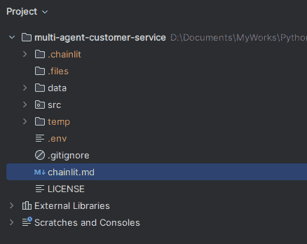

我们项目的框架。图片由作者提供

首先，我们在项目的根目录下创建一个`.env`文件，该文件存储重要的环境变量，如`OPENAI_API_KEY`和`OPENAI_BASE_URL`。稍后，我将使用[dotenv](https://pypi.org/project/python-dotenv/?ref=dataleadsfuture.com)来读取它。

这很重要，因为通过使用`.env`文件，你可以从代码中移除`API_KEY`，然后你可以自由地发布你的代码。

接下来，我们需要设置一个简单的项目框架。我们的项目将包含两个文件夹：`src`和`data`。我们的 Python 源代码文件将放置在`src`文件夹中，而用于 RAG 的文本源文件将放置在`data`文件夹中。

在`src`目录下，首先创建一个`app.py`文件，该文件将作为启动`chainlit`界面的视图。这个文件由三个部分组成：

1.  准备工作流程序的代码。

1.  响应用户生命周期的代码，输出中间过程。

1.  调用工作流代理并执行对话的实际代码。

代码流程图如下所示：

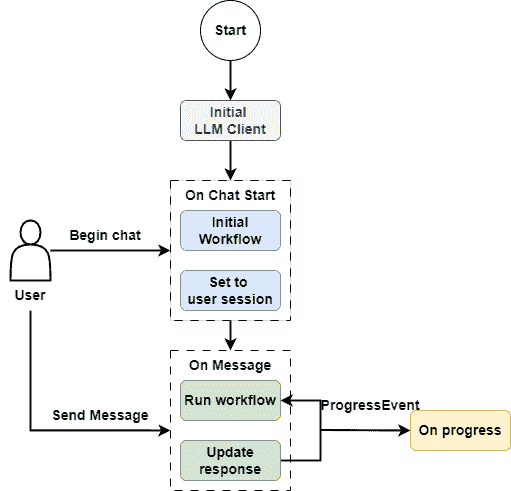

项目 UI 界面的流程图。图片由作者提供

作为一款生产就绪的系统，我们经常需要连接到大型模型端口的私有企业部署。如何连接到私有 LLM 可以参考这篇文章。

> [**如何将 LlamaIndex 与私有 LLM API 部署连接**](https://towardsdatascience.com/how-to-connect-llamaindex-with-private-llm-api-deployments-a3585850507b)

为了使我们的客户服务不那么僵化，我们可以将温度调得高一点。以下是初始化系统环境的代码，我稍后会讨论`CustomerService`的实现：

```py
llm = OpenAILike(
    model="qwen-max-latest",
    is_chat_model=True,
    is_function_calling_model=True,
    temperature=0.35
)
Settings.llm = llm
```

想象一下，当下一轮客户服务接手回答你的问题时，她首先会做什么？对，她需要先检查对话历史。

因此，我们需要为用户会话中的每个区分用户创建一个独特的、保留对话上下文和用户状态的流程：

```py
GREETINGS = "Hello, what can I do for you?"

def ready_my_workflow() -> CustomerService:
    memory = ChatMemoryBuffer(
        llm=llm,
        token_limit=5000
    )

    agent = CustomerService(
        memory=memory,
        timeout=None,
        user_state=initialize_user_state()
    )
    return agent

def initialize_user_state() -> dict[str, str | None]:
    return {
        "name": None
    }

@cl.on_chat_start
async def start():
    workflow = ready_my_workflow()
    cl.user_session.set("workflow", workflow)

    await cl.Message(
        author="assistant", content=GREETINGS
    ).send()
```

同时，我还会使用 chainlit 的`cl.step`装饰器来实现一个简单的日志记录方法，这可以帮助我们在页面上输出一些过程日志，让用户知道我们现在在哪里：

```py
@cl.step(type="run", show_input=False)
async def on_progress(message: str):
    return message
```

然后是`main`方法，它在每一轮对话中被调用。

```py
@cl.on_message
async def main(message: cl.Message):
    workflow: CustomerService = cl.user_session.get("workflow")
    context = cl.user_session.get("context")
    msg = cl.Message(content="", author="assistant")
    user_msg = message.content
    handler = workflow.run(
        msg=user_msg,
        ctx=context
    )
    async for event in handler.stream_events():
        if isinstance(event, ProgressEvent):
            await on_progress(event.msg)

    await msg.send()
    result = await handler
    msg.content = result
    await msg.update()
    cl.user_session.set("context", handler.ctx)
```

在这个方法中，我们首先获取用户输入的对话，然后调用工作流的运行方法以启动代理路由，同时迭代工作流管道中的事件并调用`on_progress`以输出到页面。最后，我们在页面上输出对话的结果并更新上下文。

为了匹配 chainlit 界面的构建，我们首先可以编写一个简单的流程：

```py
class CustomerService(Workflow):
    def __init__(
            self,
            llm: OpenAILike | None = None,
            memory: ChatMemoryBuffer = None,
            user_state: dict[str, str | None] = None,
            *args,
            **kwargs
    ):
        self.llm = llm or Settings.llm
        self.memory = memory or ChatMemoryBuffer()
        self.user_state = user_state
        super().__init__(*args, **kwargs)

    @step
    async def start(self, ctx: Context, ev: StartEvent) -> StopEvent:
        ctx.write_event_to_stream(ProgressEvent(msg="We're making some progress."))
        return StopEvent(result="Hello World")
```

嘿，我们的交互式界面出来了：

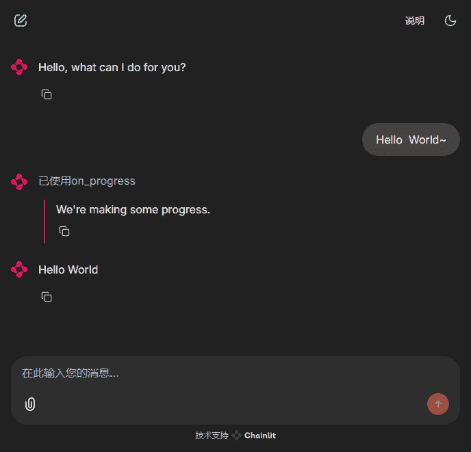

我们项目的 UI 界面。图片由作者提供

接下来，我们可以开始准备今天所需的食材，以及用于 RAG 的文本源文件。

### 第二步，生成文本文件

由于这个项目是关于模拟一个在线无人机电子商务网站的客户支持团队，我计划将背景设定为在线无人驾驶航空器电子商务网站。

我需要两个文件：一个文件介绍商店销售的无人机及其详细信息。另一个文件包含关于无人机使用和售后服务条款的常见问题解答。

为了避免商业和数据许可问题，我计划使用 LLM 生成我想要的文本。我特别指示 LLM 不要包含任何品牌或真实产品信息。

下面是我文件生成的截图：

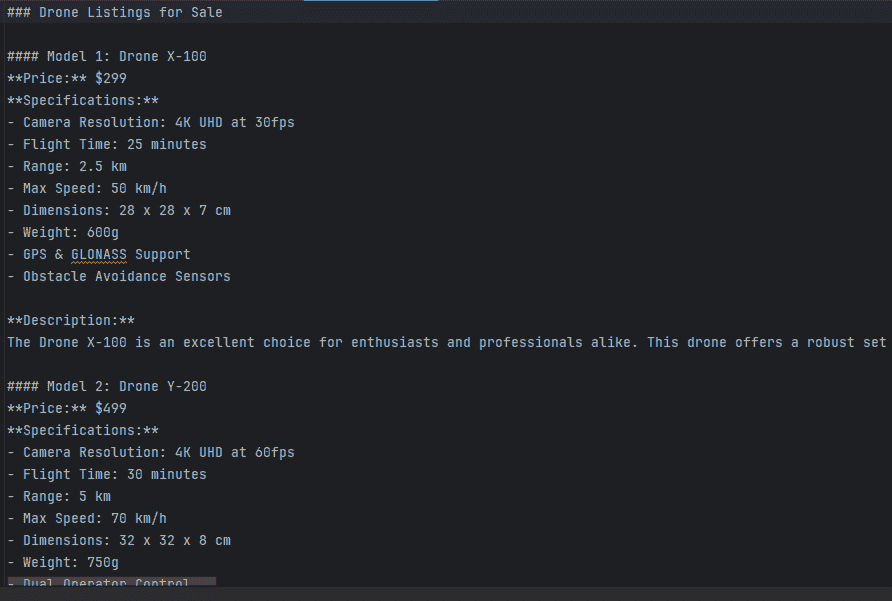

使用 LLM 生成的数据文件截图。图片由作者提供

您可以将我的提示作为参考：

```py
SKUS_TEMPLATE_EN = """
    You are the owner of an online drone store, please generate a description in English of all the drones for sale.
    Include the drone model number, selling price, detailed specifications, and a detailed description in more than 400 words.
    Do not include brand names.
    No less than 20 types of drones, ranging from consumer to industrial use.
"""
```

```py
TERMS_TEMPLATE_EN = """
    You are the head of a brand's back office department, and you are asked to generate a standardized response to after-sales FAQs in English that is greater than 25,000 words.
    The text should include common usage questions, as well as questions related to returns and repairs after the sale.
    This text will be used as a reference for the customer service team when answering customer questions about after-sales issues.
    Only the body text is generated, no preamble or explanation is added.
"""
```

### 第三步，处理索引和检索私有数据

基础 LLM 不包含公司内部数据。对于企业应用，不可避免地需要使用 RAG 来允许 LLM 访问公司私有化数据。

我们的无人机商店也不例外。在让代理工作人员开始工作之前，我们需要提供一些工具让他们访问产品目录和售后服务政策。

LlamaIndex 提供了许多适合不同场合的索引。如果用于实际系统，我更倾向于使用`KnowledgeGraphIndex`来处理产品信息文本。

然而，为了使示例项目易于理解，我仍然选择使用`chromadb`和`VectorStoreIndex`：

```py
def get_index(collection_name: str,
              files: list[str]) -> VectorStoreIndex:
    chroma_client = chromadb.PersistentClient(path="temp/.chroma")

    collection = chroma_client.get_or_create_collection(collection_name)
    vector_store = ChromaVectorStore(chroma_collection=collection)
    storage_context = StorageContext.from_defaults(vector_store=vector_store)

    ready = collection.count()
    if ready > 0:
        print("File already loaded")
        index = VectorStoreIndex.from_vector_store(vector_store=vector_store)
    else:
        print("File not loaded.")
        docs = SimpleDirectoryReader(input_files=files).load_data()
        index = VectorStoreIndex.from_documents(
            docs, storage_context=storage_context, embed_model=embed_model,
            transformer=[SentenceSplitter(chunk_size=512, chunk_overlap=20)]
        )

    return index

INDEXES = {
    "SKUS": get_index("skus_docs", ["data/skus_en.txt"]),
    "TERMS": get_index("terms_docs", ["data/terms_en.txt"])
}
```

代码的运行流程图如下：

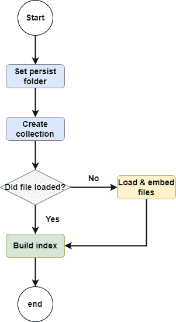

代码的运行流程图。图片由作者提供

如果向量数据已经存在，则直接返回索引。如果数据尚未加载，首先将数据加载到向量存储中，然后返回索引。

然后我们添加一个工具方法来帮助代理获取相应的检索器：

```py
async def query_docs(
        index: VectorStoreIndex, query: str,
        similarity_top_k: int = 1
) -> str:
    retriever = index.as_retriever(similarity_top_k=similarity_top_k)
    nodes = await retriever.aretrieve(query)
    result = ""
    for node in nodes:
        result += node.get_content() + "nn"
    return result
```

### 第四步，雇佣一些代理

由于我们正在构建一个智能客户服务项目，因此有必要雇佣一些客户服务代理。

我们还需要为代理设置一个数据类，该数据类需要包括指令和一组工具，就像 Swarm 代理一样。在这里我们使用`AgentConfig`进行约束，它继承自 Pydantic 的`BaseModel`。

```py
class AgentConfig(BaseModel):
    """
    Detailed configuration for an agent
    """
    model_config = ConfigDict(arbitrary_types_allowed=True)
    name: str = Field(description="agent name")
    description: str = Field(
        description="agent description, which describes what the agent does"
    )
    system_prompt: str | None = None
    tools: list[BaseTool] | None = Field(
        description="function tools available for this agent"
    )
```

我们需要雇佣一个接待经理代理，这个代理需要标记用户将被转交给哪个代理。

```py
class TransferToAgent(BaseModel):
    """Used to explain which agent to transfer to next."""
    agent_name: str = Field(description="The name of the agent to transfer to.")
```

我们还需要设计一个请求转移代理，该代理使用此代理在某个客户服务无法回答用户问题时通知工作流程。

```py
class RequestTransfer(BaseModel):
    """
    Used to indicate that you don't have the necessary permission to complete the user's request,
    or that you've already completed the user's request and want to transfer to another agent.
    """
    pass
```

然后我们需要为代理准备一些工具：

首先是`登录`工具，这个工具仅用于注册用户的名称。如果您需要处理用户的登录操作，您可以在该方法中实现细节。我使用闭包来返回工具列表。

```py
def get_authentication_tools() -> list[BaseTool]:
    async def login(ctx: Context, username: str) -> bool:
        """When the user provides their name, you can use this method to update their status.。
        :param username The user's title or name.
        """
        if not username:
            return False

        user_state = await ctx.get("user_state", None)
        user_state["name"] = username.strip()
        await ctx.set("user_state", user_state)
        return True

    return [FunctionToolWithContext.from_defaults(async_fn=login)]
```

这里有一个细节，因为工具需要处理保存在工作流程上下文中的用户状态，我们需要访问`ctx`对象。但是当代理调用工具时，代理无法感知到`ctx`对象，所以我们需要让代理忽略它。

在这里，我修改了 LlamaIndex 的`FunctionTool`模块的行为，并重写了`FunctionToolWithContext`模块。为了节省时间，我参考了官方网站上的一个[示例](https://github.com/run-llama/multi-agent-concierge/blob/main/utils.py?ref=dataleadsfuture.com)，你可以在这里找到它。当然，你也可以在文章项目代码的末尾找到源代码。

我们还需要工具来获取产品目录和售后服务条款，这两个工具是对检索器的直接调用，相当简单。

```py
def get_pre_sales_tools() -> list[BaseTool]:
    async def skus_info_retrieve(ctx: Context, query: str) -> str:
        """
        When the user asks about a product, you can use this tool to look it up.
        :param query: The user's request.
        :return: The information found.
        """
        sku_info = await query_docs(INDEXES["SKUS"], query)
        return sku_info

    return [FunctionToolWithContext.from_defaults(async_fn=skus_info_retrieve)]

def get_after_sales_tools() -> list[BaseTool]:
    async def terms_info_retrieve(ctx: Context, query: str) -> str:
        """
        When the user asks about how to use a product, or about after-sales and repair options, you can use this tool to look it up.
        :param query: The user's request.
        :return: The information found.
        """
        terms_info = await query_docs(INDEXES["TERMS"], query)
        return terms_info
    return [FunctionToolWithContext.from_defaults(async_fn=terms_info_retrieve)]
```

总结一下，我们需要三名专业的客户服务代理：

1.  第一个是一个前台，用于登记用户的访问。

1.  第二个是售前服务，用于向用户推荐各种产品。

1.  第三个是售后服务，用于回答各种使用问题和售后服务条款。

```py
def _get_agent_configs() -> list[AgentConfig]:
    return [
        AgentConfig(
            name="Authentication Agent",
            description="Record the user's name. If there's no name, you need to ask this from the customer.",
            system_prompt="""
            You are a front desk customer service agent for registration.
            If the user hasn't provided their name, you need to ask them.
            When the user has other requests, transfer the user's request.
            """,
            tools=get_authentication_tools()
        ),
        AgentConfig(
            name="Pre Sales Agent",
            description="When the user asks about product information, you need to consult this customer service agent.",
            system_prompt="""
            You are a customer service agent answering pre-sales questions for customers.
            You will respond to users' inquiries based on the context of the conversation.

            When the context is not enough, you will use tools to supplement the information.
            You can only handle user inquiries related to product pre-sales. 
            Please use the RequestTransfer tool to transfer other user requests.
            """,
            tools=get_pre_sales_tools()
        ),
        AgentConfig(
            name="After Sales Agent",
            description="When the user asks about after-sales information, you need to consult this customer service agent.",
            system_prompt="""
            You are a customer service agent answering after-sales questions for customers, including how to use the product, return and exchange policies, and repair solutions.
            You respond to users' inquiries based on the context of the conversation.
            When the context is not enough, you will use tools to supplement the information.
            You can only handle user inquiries related to product after-sales. 
            Please use the RequestTransfer tool to transfer other user requests.
            """,
            tools=get_after_sales_tools()
        )
    ]
```

根据工作流程的需求，我们还需要编写两个方法来将代理注册到工作流程中。

```py
def get_agent_config_pair() -> dict[str, AgentConfig]:
    agent_configs = _get_agent_configs()
    return {agent.name: agent for agent in agent_configs}

def get_agent_configs_str() -> str:
    agent_configs = _get_agent_configs()
    pair_list = [f"{agent.name}: {agent.description}" for agent in agent_configs]
    return "n".join(pair_list)
```

最后，我们还需要一个用于编排的工作流程`system_prompt`，它将包含所有代理信息和用户状态，并在需要时将用户转交给正确的客户服务代理。

这个提示将直接由工作流程使用，不需要单独的代理，所以只需在这里放置提示：

```py
ORCHESTRATION_PROMPT = """  
    You are a customer service manager for a drone store.
    Based on the user's current status, latest request, and the available customer service agents, you help the user decide which agent to consult next.

    You don't focus on the dependencies between agents; the agents will handle those themselves.
    If the user asks about something unrelated to drones, you should politely and briefly decline to answer.

    Here is the list of available customer service agents:
    {agent_configs_str}

    Here is the user's current status:
    {user_state_str}
"""
```

### 第五步，构建核心工作流程

经过如此多的准备，我们终于可以进入主要内容，我相信每个人都很渴望开始哈哈。

由于工作流程是一个事件驱动框架，我们需要定义几个事件，就像之前一样：

```py
class OrchestrationEvent(Event):
    query: str

class ActiveSpeakerEvent(Event):
    query: str

class ToolCallEvent(Event):
    tool_call: ToolSelection
    tools: list[BaseTool]

class ToolCallResultEvent(Event):
    chat_message: ChatMessage

class ProgressEvent(Event):
    msg: str
```

1.  `OrchestrationEvent`表示工作流程需要转移代理。

1.  在代理转移完成后，`ActiveSpeakerEvent`将告诉工作流程使用新的代理来回答用户。

1.  如果代理需要执行函数调用，`ToolCallEvent`将被抛出以并行执行。

1.  并行执行的结果将通过`ToolCallResultEvent`抛出，并汇总成最终结果。

1.  最后，我们还需要一个`ProgressEvent`来流式传输中间步骤，使用户能够知道我们现在在哪里。为了避免过多的信息干扰，我们只在这里输出代理转移的信息。

在定义了各种事件之后，我们需要开始编写工作流程。这次的工作流程有点复杂，所以为了使每个人都能更容易理解，我仍然绘制了一个流程图：

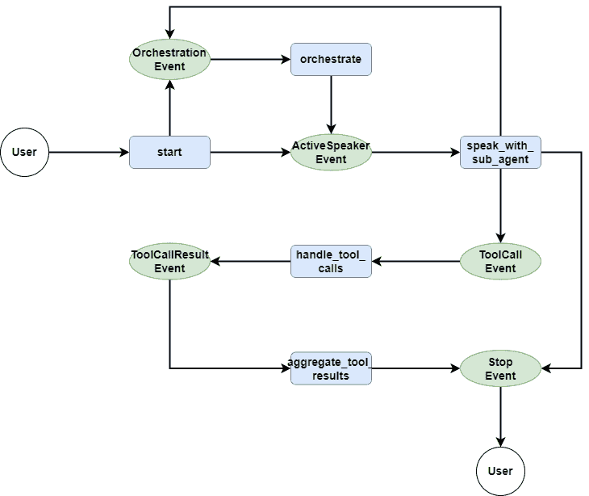

我们工作流程的流程图。图由作者提供

首先，让我们看看 `start` 方法。`start` 方法相对简单，作为用户对话的入口方法，它负责将用户的消息存储在 `ChatMemory` 中，然后判断当前是否有可用的代理，如果有，则抛出 `ActiveSpeakerEvent`，进入下一步，如果没有，则抛出 `OrchestrationEvent`，进入代理编排。

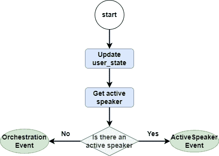

启动方法的流程图。图片由作者提供

```py
class CustomerService(Workflow):
    ...

    @step
    async def start(
            self, ctx: Context, ev: StartEvent
    ) -> ActiveSpeakerEvent | OrchestrationEvent:
        self.memory.put(ChatMessage(
            role="user",
            content=ev.msg
        ))
        user_state = await ctx.get("user_state", None)
        if not user_state:
            await ctx.set("user_state", self.user_state)

        user_msg = ev.msg
        active_speaker = await ctx.get("active_speaker", default=None)

        if active_speaker:
            return ActiveSpeakerEvent(query=user_msg)
        else:
            return OrchestrationEvent(query=user_msg)
```

从浅到深，让我们看看代理编排 `orchestrate` 方法是如何工作的：

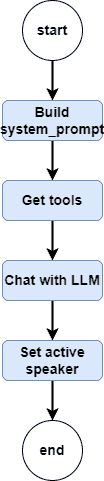

编排方法的流程图。图片由作者提供

此方法首先获取当前可用的代理和用户状态，并更新我们在 `agents.py` 中编写的 `ORCHESTRATION_PROMPT`，从而获取完整的 `system_prompt`。

然后，我们将 `TransferToAgent`、`system_prompt` 和 `chat_history` 都传递给 LLM，让 LLM 判断下一个要传递给哪个代理。

```py
class CustomerService(Workflow):
    ...

    @step
    async def orchestrate(
            self, ctx: Context, ev: OrchestrationEvent
    ) -> ActiveSpeakerEvent | StopEvent:
        chat_history = self.memory.get()
        user_state_str = await self._get_user_state_str(ctx)
        system_prompt = ORCHESTRATION_PROMPT.format(
            agent_configs_str=get_agent_configs_str(),
            user_state_str=user_state_str
        )
        messages = [ChatMessage(role="system", content=system_prompt)] + chat_history
        tools = [get_function_tool(TransferToAgent)]
        event, tool_calls, _ = await self.achat_to_tool_calls(ctx, tools, messages)
        if event is not None:
            return event
        tool_call = tool_calls[0]
        selected_agent = tool_call.tool_kwargs["agent_name"]
        await ctx.set("active_speaker", selected_agent)
        ctx.write_event_to_stream(
            ProgressEvent(msg=f"In step orchestrate:nTransfer to agent: {selected_agent}")
        )
        return ActiveSpeakerEvent(query=ev.query)
```

在获取最新的代理后，我们更新上下文并抛出 `ActiveSpeakerEvent`。

我们还需要定义 `achat_to_tool_calls` 和 `_get_user_state_str` 这两个工具方法。`achat_to_tool_calls` 方法负责从 LLM 获取当前所需的工具。`_get_user_state_str` 用于将用户状态转换为字符串。

```py
class CustomerService(Workflow):
    ...

    async def achat_to_tool_calls(self,
                              ctx: Context,
                              tools: list[FunctionTool],
                              chat_history: list[ChatMessage]
    ) -> tuple[StopEvent | None, list[ToolSelection], ChatResponse]:
    response = await self.llm.achat_with_tools(tools, chat_history=chat_history)
    tool_calls: list[ToolSelection] = self.llm.get_tool_calls_from_response(
        response=response, error_on_no_tool_call=False
    )
    stop_event = None
    if len(tool_calls) == 0:
        await self.memory.aput(response.message)
        stop_event = StopEvent(
            result=response.message.content
        )
    return stop_event, tool_calls, response

    @staticmethod
    async def _get_user_state_str(ctx: Context) -> str:
        user_state = await ctx.get("user_state", None)
        user_state_list = [f"{k}: {v}" for k, v in user_state.items()]
        return "n".join(user_state_list)
```

在研究了 `Orchestrate` 分支之后，让我们看看 `ActiveSpeaker` 分支是如何工作的，即 `speak_with_sub_agent` 方法：

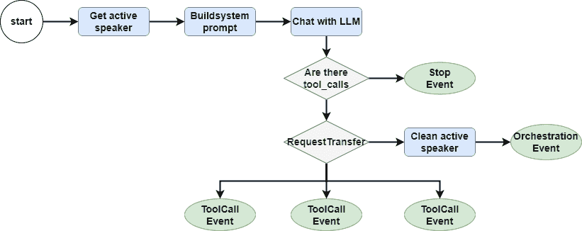

speak_with_sub_agent 方法的流程图。图片由作者提供

这种方法首先获取当前的服务提供代理，以及 `chat_history` 和 `user_state`。

然后使用当前代理的 `sys_prompt`、`tools` 以及 `chat_history`，让 LLM 判断下一个要调用的工具。

```py
class CustomerService(Workflow):
    ...

    @step
    async def speak_with_sub_agent(
            self, ctx: Context, ev: ActiveSpeakerEvent
    ) -> OrchestrationEvent | ToolCallEvent | StopEvent:
        active_speaker = await ctx.get("active_speaker", default="")
        agent_config: AgentConfig = get_agent_config_pair()[active_speaker]
        chat_history = self.memory.get()
        user_state_str = await self._get_user_state_str(ctx)

        system_prompt = (
                agent_config.system_prompt.strip()
                + f"nn<user state>:n{user_state_str}"
        )
        llm_input = [ChatMessage(role="system", content=system_prompt)] + chat_history
        tools = [get_function_tool(RequestTransfer)] + agent_config.tools
        event, tool_calls, response = await self.achat_to_tool_calls(ctx, tools, llm_input)

        if event is not None:
            return event
        await ctx.set("num_tool_calls", len(tool_calls))
        for tool_call in tool_calls:
            if tool_call.tool_name == "RequestTransfer":
                await ctx.set("active_speaker", None)
                ctx.write_event_to_stream(
                    ProgressEvent(msg="The agent is requesting a transfer, please hold on...")
                )
                return OrchestrationEvent(query=ev.query)
            else:
                ctx.send_event(
                    ToolCallEvent(tool_call=tool_call, tools=agent_config.tools)
                )
        await self.memory.aput(response.message)
```

重要的是要注意，尽管示例项目相对简单，每个代理的工具只有一个，但在实际项目中，通常会有多个工具需要并发调用。因此，我们需要遍历 `tool_calls`，分别抛出 `ToolCallEvent`。

同时，我们还需要考虑当前代理可能无法处理用户请求的情况，从而调用 `RequestTransfer`，然后我们需要回到 `orchestrate` 步骤并重新选择代理。

让我们看看 `handle_tool_calls` 部分，这个部分的代码看起来很多，但实际上要做的很简单，就是获取要执行的工具并执行它，简单到我不愿意画一个流程图。

```py
class CustomerService(Workflow):
    ...

    @step(num_workers=4)
    async def handle_tool_calls(
            self, ctx: Context, ev: ToolCallEvent
    ) -> ToolCallResultEvent:
        tool_call = ev.tool_call
        tools_by_name = {tool.metadata.get_name(): tool for tool in ev.tools}
        tool_msg = None
        tool = tools_by_name[tool_call.tool_name]
        additional_kwargs = {
            "tool_call_id": tool_call.tool_id,
            "name": tool.metadata.get_name()
        }
        if not tool:
            tool_msg = ChatMessage(
                role="tool",
                content=f"Tool {tool_call.tool_name} does not exists.",
                additional_kwargs=additional_kwargs
            )
            return ToolCallResultEvent(chat_message=tool_msg)

        try:
            if isinstance(tool, FunctionToolWithContext):
                tool_output = await tool.acall(ctx, **tool_call.tool_kwargs)
            else:
                tool_output = await tool.acall(**tool_call.tool_kwargs)

            tool_msg = ChatMessage(
                role="tool",
                content=tool_output.content,
                additional_kwargs=additional_kwargs
            )
        except Exception as e:
            tool_msg = ChatMessage(
                role="tool",
                content=f"Encountered error in tool call: {e}",
                additional_kwargs=additional_kwargs
            )
        return ToolCallResultEvent(chat_message=tool_msg)
```

这里有一个小细节，我为 `step` 装饰器设置了参数 `num_workers=4`。这是为了告诉工作流程并发只能达到 4，以避免过高的并发导致下游系统阻塞。

然后我们来到最后一个方法`aggregate_too_results`。

```py
class CustomerService(Workflow):
    ...

    @step
    async def aggregate_tool_results(
            self, ctx: Context, ev: ToolCallResultEvent
    ) -> ActiveSpeakerEvent | None:
        num_tool_calls = await ctx.get("num_tool_calls")
        results = ctx.collect_events(ev, [ToolCallResultEvent] * num_tool_calls)
        if not results:
            return None

        for result in results:
            await self.memory.aput(result.chat_message)
        return ActiveSpeakerEvent(query="")
```

这个方法相对简单，只需获取`tool_calls`的所有执行结果，然后写入`ChatMemory`，最后将它们转回给代理以评估结果并回答用户。

### 第 6 步，检查我们的辛勤工作

在这个剧情点，我们的客户服务团队已经建立，让我们检查这些代理是否努力工作。开始！

```py
chainlit run src/app.py
```

还不错，前台代理首先询问我的名字，模拟登录过程，然后根据我的需求，将其转交给销售前代理：

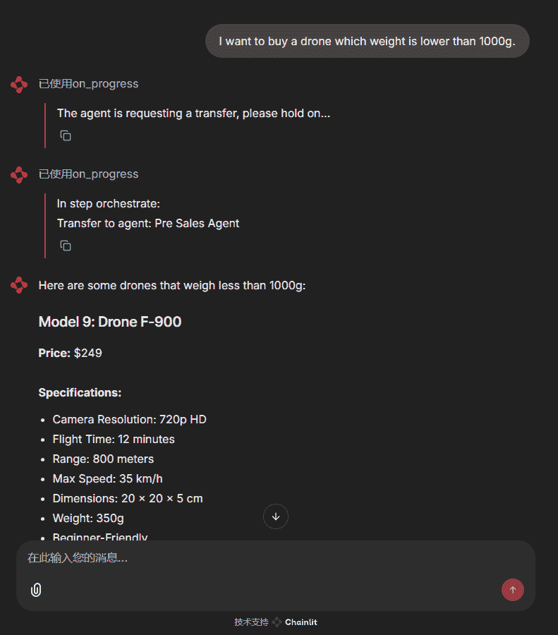

当我的请求转交给销售前代理时。图片由作者提供

根据我的请求，它也可以转交给售后服务代理：

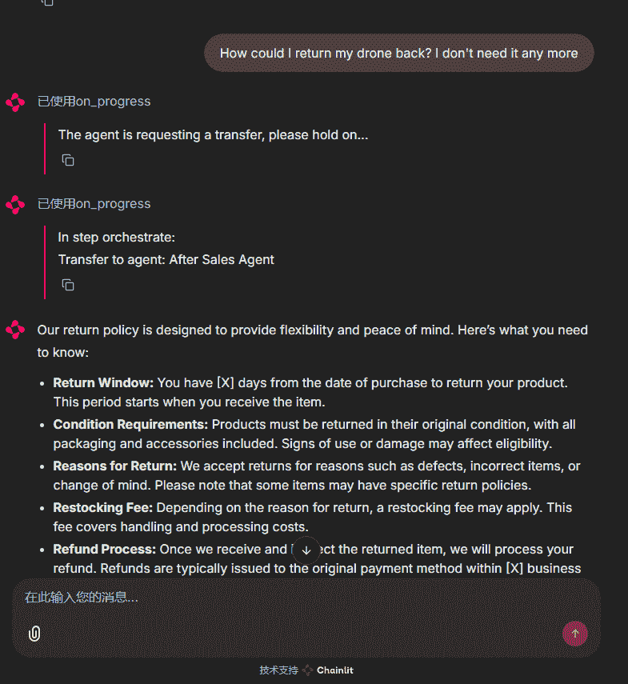

当我的请求转交给售后服务代理时。图片由作者提供

我甚至可以整天和他们玩！

***

## 项目源代码

该项目的代码存储在下面，任何人都可以使用或修改它，无需我的许可：

> [**GitHub – qtalen/multi-agent-customer-service**](https://github.com/qtalen/multi-agent-customer-service)

***

## 结论

总结今天的课程，在这个客户服务聊天机器人项目中，我们成功使用 LlamaIndex Workflow 模拟了 OpenAI Swarm 的代理转交功能，实现了多个代理之间的无缝协作。

我们可以看到，代理转交给项目带来了明显的优势：

1.  工作流程根据对话上下文自主决定使用哪个代理，没有固定的代码流程，完全由 LLM 决定。

1.  一旦工作流程决定哪个代理将为用户提供服务，用户将直接与相应的代理互动，没有任何中间步骤。

然而，项目中还有一些不足之处：

1.  对代理的调用太低级，导致我们在代码中处理函数调用过程。

1.  工作流程的模块化做得不好，我也在之前的文章中提到过，这给团队协作带来了一些障碍。

我期待在未来的文章中逐步解决这些问题。欢迎您的评论和讨论，我会尽快回复每个人。

***

喜欢这篇阅读？**[现在订阅，直接将更多前沿的数据科学技巧发送到您的邮箱！](https://www.dataleadsfuture.com/#/portal/signup)** 欢迎您的反馈和提问 - 让我们在下面的评论中进行讨论！

本文最初发表在[数据引领未来](https://www.dataleadsfuture.com/using-llamaindex-workflow-to-implement-an-agent-handoff-feature-like-openai-swarm/#/portal/signup)。
