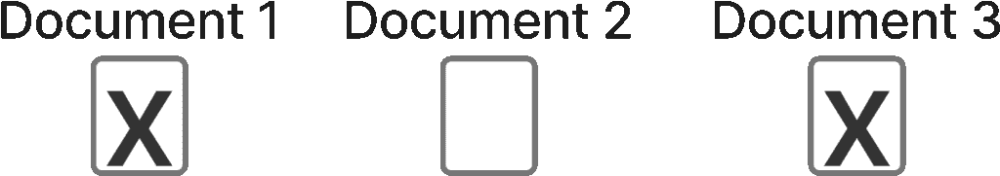
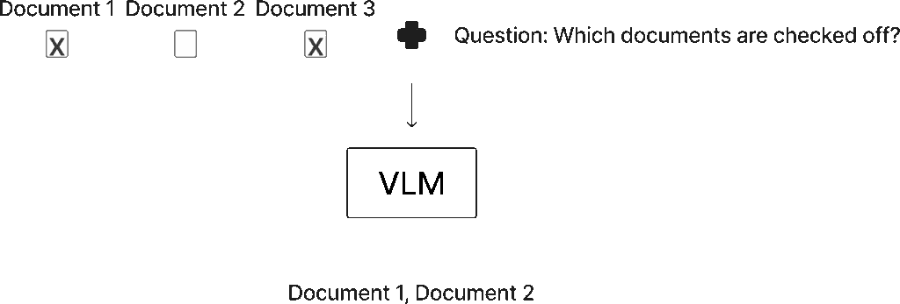
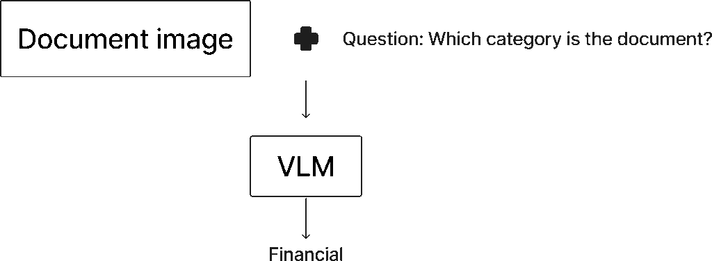
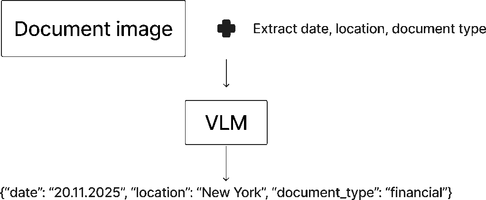

# 使用视觉语言模型处理数百万份文档

> 原文：[`towardsdatascience.com/using-vision-language-models-to-process-millions-of-documents/`](https://towardsdatascience.com/using-vision-language-models-to-process-millions-of-documents/)

<mdspan datatext="el1758823911383" class="mdspan-comment">视觉语言模型</mdspan>（VLMs）是强大的机器学习模型，可以处理视觉和文本信息。随着 Qwen 3 VL 的最近发布，我想深入探讨如何利用这些强大的 VLMs 来处理文档。

## 目录

+   为什么你需要使用 VLMs

+   应用领域

    +   代理用例

        +   计算机使用

        +   调试

    +   问答

    +   分类

    +   信息提取

    +   VLMs 有问题的时刻

        +   运行 VLMs 的成本

        +   无法处理长文档

+   结论

## 为什么你需要使用 VLMs

为了强调为什么某些任务需要 VLMs，我想从一个示例任务开始，我们需要解释文本和文本的视觉信息。

想象你正在查看下面的图像。复选框代表文档是否应该包含在报告中，现在你需要确定包含哪些文档。



此图突出了 VLMs（视觉语言模型）适用的合适问题。你有一个包含关于文档文本和复选框的图像。你现在需要确定哪些文档被勾选了。使用 LLMs（语言学习模型）解决这个问题很困难，因为你首先需要将图像应用 OCR（光学字符识别）。文本随后会失去其视觉位置，这是正确解决任务所必需的。使用 VLMs，你可以轻松地读取文档中的文本，并利用其视觉位置（如果文本位于勾选的复选框上方或下方），并成功解决这个任务。图片由作者提供。

对于人类来说，这是一个简单的任务；显然，文档 1 和 3 应该包含在内，而文档 2 应该排除。然而，如果你试图通过纯 LLM 解决这个问题，你会遇到问题。

要运行纯 LLM，你首先需要 OCR 图像，例如，如果你使用[Google 的 Tesseract](https://github.com/tesseract-ocr/tesseract)，OCR 输出将类似于以下内容，它逐行提取文本。

```py
Document 1  Document 2  Document 3  X   X 
```

如你可能已经发现的，LLM 在决定包含哪些文档时会遇到问题，因为无法知道 Xs 属于哪些文档。这只是许多场景中 VLMs 在解决问题上极其高效的一个例子。

这里的主要观点是，知道哪些文档有勾选的 X 需要视觉和文本信息。你需要知道文本及其在图像中的视觉位置。以下是我对此的总结：

> 当文本的意义取决于其视觉位置时，需要使用 VLMs。

## 应用领域

你可以将 VLMs 应用到许多领域。在本节中，我将介绍一些 VLMs 已被证明有用的不同领域，以及我也成功应用 VLMs 的领域。

### 代理用例

代理现在很流行，VLMs 也在其中扮演着角色。我将强调两个 VLMs 可以在代理环境中使用的主要领域，尽管自然有许多其他这样的领域。

**计算机使用**

计算机使用是 VLMs（视觉语言模型）的一个有趣的应用案例。我所说的计算机使用是指 VLM 查看你的计算机上的一个帧，并决定下一步采取什么行动。一个例子是[OpenAI 的 Operator](https://openai.com/index/introducing-operator/)。例如，它可以查看你现在正在阅读的这篇文章的某个帧，并滚动下来阅读更多内容。

VLMs 在计算机使用中很有用，因为 LLMs（大型语言模型）不足以决定采取哪些行动。在操作计算机时，你通常必须解释按钮和信息的位置，正如我在一开始所描述的，这是 VLMs 的主要应用领域之一。

**调试**

调试代码也是 VLMs 的一个超级有用的代理应用领域。想象一下，你正在开发一个网络应用程序，并发现了一个错误。

一个选择是从控制台开始记录日志，复制日志，向 Cursor 描述你做了什么，并提示 Cursor 修复它。这自然是耗时的，因为它需要用户进行许多手动步骤。

另一个选择是利用 VLM 更好地解决问题。理想情况下，你描述如何重现问题，VLM 可以进入你的应用程序，重现流程，检查问题，从而调试出哪里出了问题。虽然我看到的大多数此类领域都在开发中，但有一些应用正在被构建。

### 问答

利用 VLMs 进行视觉问答是使用 VLMs 的经典方法之一。问答是我在本文中早些时候描述的使用案例，即确定哪个复选框属于哪个文档。你向 VLM 提供用户问题和一个（或多个）图像，让 VLM 进行处理。然后，VLM 将以文本格式提供答案。你可以在下面的图中看到这个过程是如何工作的。



这张图突出显示了一个问答任务，我利用 VLM 来解决这个问题。你提供包含问题的图像和要解决的问题的任务。然后，VLM 处理这些信息并输出预期的信息。图由作者提供，

然而，你应该权衡使用 VLM 与 LLM 之间的权衡。自然地，当任务需要文本和视觉信息时，你需要利用 VLM 来获得适当的结果。然而，VLM 通常运行成本也更高，因为它们需要处理更多的标记。这是因为图像包含大量信息，因此导致许多输入标记需要处理。

此外，如果 VLM 要处理文本，你还需要高分辨率的图像，以便 VLM 可以解释组成字母的像素。分辨率较低时，VLM 难以读取图像中的文本，你将得到低质量的结果。

### 分类



此图展示了如何将 VLM 应用于分类任务。你将文档的图像和用于将文档分类到预定义类别集合中的问题输入到 VLM 中。这些类别应包含在问题中，但由于空间限制，它们没有包含在图中。然后 VLM 输出预测的分类标签。图片由作者提供。

VLM 的另一个有趣的应用领域是分类。在分类中，我指的是你有一个预定的类别集合，需要确定图像属于哪个类别。

你可以使用 VLM 进行分类，与使用 LLM 的方法相同。你创建一个包含所有相关信息的结构化提示，包括可能的输出类别。此外，你最好涵盖不同的边缘情况，例如，在两个类别都非常可能的情况下，VLM 必须在两个类别之间做出决定。

例如，你可以有一个这样的提示：

```py
def get_prompt():
    return """
        ## General instructions
        You need to determine which category a given document belongs to. 
        The available categories are "legal", "technical", "financial".

        ## Edge case handling
        - In the scenario where you have a legal document covering financial information, the document belongs to the financial category
        - ...
        ## Return format
        Respond only with the corresponding category, and no other text 
    """ 
```

### 信息提取

你还可以有效地利用 VLM 进行信息提取，有许多需要视觉信息的信息提取任务。你创建一个与我上面创建的分类提示相似的提示，并通常提示 VLM 以结构化格式响应，例如 JSON 对象。

在执行信息提取时，你需要考虑你想要提取多少数据点。例如，如果你需要从一个文档中提取 20 个不同的数据点，你可能不想一次性提取所有这些数据。这是因为模型可能难以一次性准确提取这么多信息。

相反，你应该考虑将任务拆分，例如，通过两个不同的请求提取 10 个数据点，简化模型的任务。另一方面，有时你会遇到一些数据点相互关联的情况，这意味着它们应该在同一个请求中提取。此外，发送多个请求会增加推理成本。



此图突出了如何利用 VLM 进行信息提取。你再次向 VLM 提供文档的图像，并提示 VLM 提取特定的数据点。在此图中，我提示 VLM 提取文档的日期、文档中提到的位置和文档类型。然后 VLM 分析提示和文档图像，并输出包含所需信息的 JSON 对象。图由作者提供。

## 当 VLM 出现问题时

VLM 是令人惊叹的模型，可以执行几年前用 AI 无法想象的任务。然而，它们也有自己的局限性，我将在本节中介绍。

### 运行 VLM 的成本

第一个限制是运行 VLM 的成本，我在本文中也简要讨论过。VLM 处理图像，这些图像由许多像素组成。这些像素代表大量信息，这些信息被编码成 VLM 可以处理的标记。问题是由于图像包含如此多的信息，你需要为每张图像创建大量标记，这又增加了运行 VLM 的成本。

此外，你通常需要高分辨率的图像，因为 VLM 需要读取图像中的文本，从而导致需要处理的标记数量更多。因此，VLM 在 API 上运行以及如果你决定自行托管 VLM 时的计算成本都相对较高。

### 无法处理长文档

图像中包含的标记数量也限制了 VLM 一次可以处理的页面数量。VLM 受其上下文窗口的限制，就像传统的 LLM 一样。如果你想要处理包含数百页的长文档，这会成为一个问题。自然地，你可以将文档分成块，但你可能会遇到 VLM 无法一次性访问文档所有内容的问题。

例如，如果你有一个 100 页的文档，你可以首先处理第 1-50 页，然后处理第 51-100 页。然而，如果第 53 页上的某些信息可能需要第 1 页的上下文（例如，文档的标题或日期），这将会导致问题。

为了了解如何解决这个问题，我阅读了 Qwen 3 的食谱，其中有一页介绍了[如何利用 Qwen 3 处理超长文档的方法](https://github.com/QwenLM/Qwen3-VL/blob/main/cookbooks/long_document_understanding.ipynb)。我一定会测试这个方法，并在未来的文章中讨论其效果如何。

## 结论

在本文中，我讨论了视觉语言模型以及如何将它们应用于不同的问题领域。我首先描述了如何将 VLM 集成到代理系统中，例如作为计算机使用代理或用于调试 Web 应用程序。继续，我涵盖了问答、分类和信息提取等领域。最后，我还讨论了 VLM 的一些局限性，包括运行 VLM 的计算成本以及它们在处理长文档时的挑战。

**👉 我的免费电子书和网络研讨会：**

📚 [获取我的免费视觉语言模型电子书](https://eivindkjosbakken.com/ebook)

💻 [我的视觉语言模型研讨会](https://www.eivindkjosbakken.com/webinar)

**👉 在社交平台上找到我：**

📩 [订阅我的通讯](https://eivindkjosbakken.com/newsletter)

🧑‍💻 [联系我](https://eivindkjosbakken.com/)

🔗 [LinkedIn](https://www.linkedin.com/in/eivind-kjosbakken/)

🐦 [X / Twitter](https://x.com/EivindKjos)

✍️ [Medium](https://oieivind.medium.com/)
