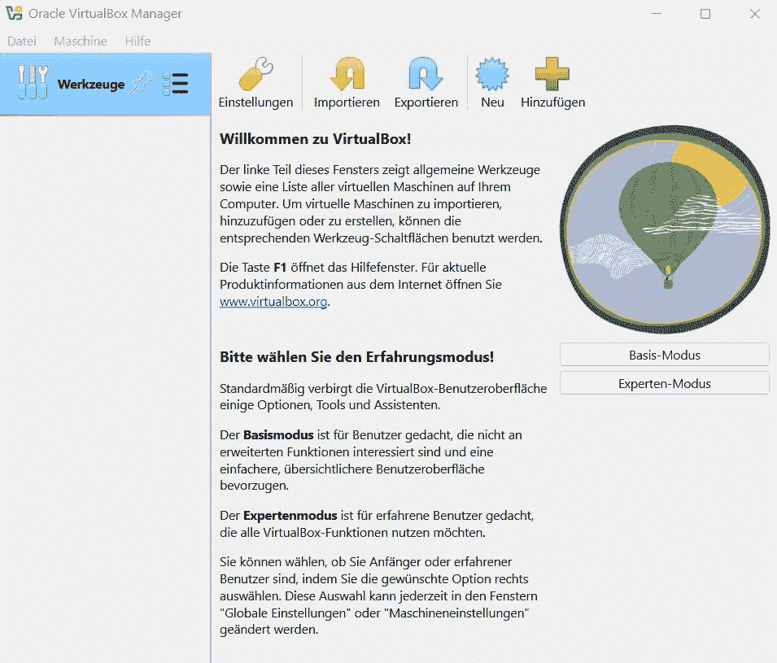
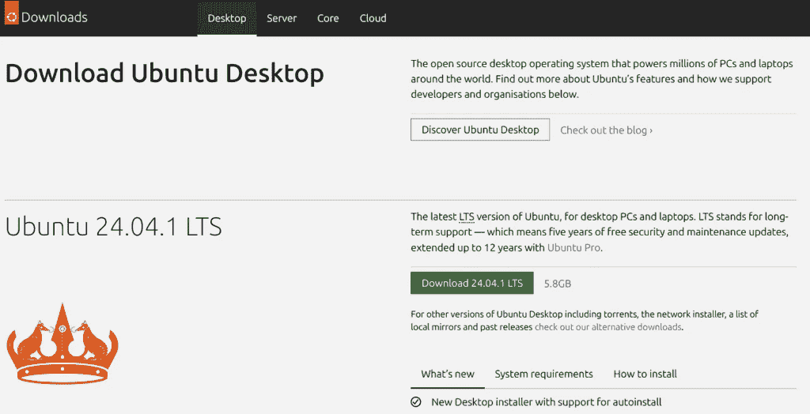
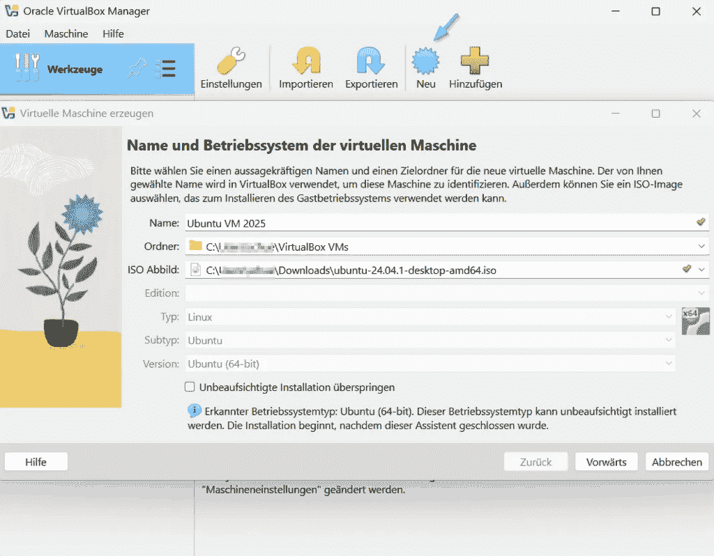
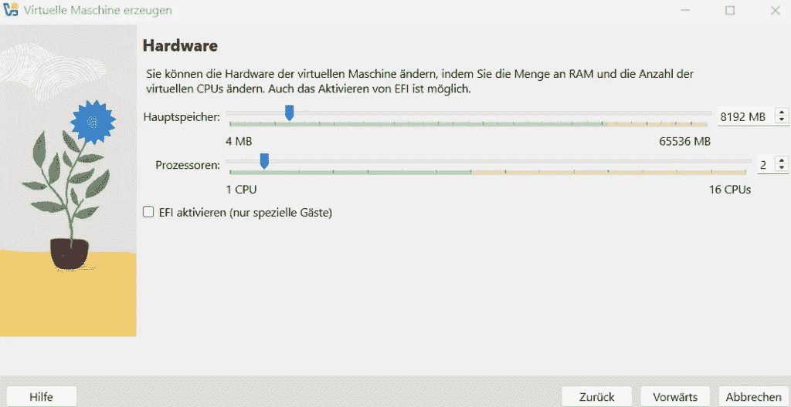
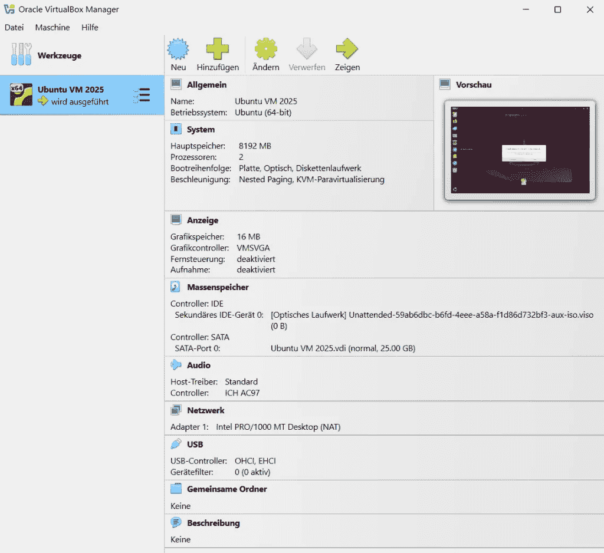

# 虚拟化与容器化，数据科学新手的入门指南

> 原文：[`towardsdatascience.com/virtualization-containers-for-data-science-newbies/`](https://towardsdatascience.com/virtualization-containers-for-data-science-newbies/)

虚拟化使得在单一物理硬件上运行多个虚拟机（VMs）成为可能。这些虚拟机表现得像独立的计算机，但共享相同的物理计算能力。可以说是计算机中的计算机。

许多云服务依赖于虚拟化。但其他技术，如容器化和无服务器计算，也变得越来越重要。

没有虚拟化，我们每天使用的许多数字服务将无法实现。当然，这是一个简化，因为一些云服务也使用裸金属基础设施。

在这篇文章中，你将学习如何在几分钟内在你的笔记本电脑上设置自己的虚拟机——即使你之前从未听说过云计算或容器。

***目录***

1 — 云计算起源：从大型机到无服务器架构

2 — 理解虚拟化：为什么它是云计算的基础

3 — 使用 VirtualBox 创建虚拟机

结语

你可以在哪里继续学习？

## 1 — 云计算起源：从大型机到无服务器架构

云计算从根本上改变了 IT 格局——但它的根源比许多人想象的要深远得多。事实上，云的历史可以追溯到 20 世纪 50 年代，那时有巨大的大型机和所谓的哑终端。

+   **20 世纪 50 年代的大型机时代**：公司使用大型机，以便多个用户可以通过哑终端同时访问它们。中央大型机是为高容量、业务关键型数据处理而设计的。[大型公司](https://www.ibm.com/docs/en/zos-basic-skills?topic=vmt-who-uses-mainframes-why-do-they-do-it)至今仍在使用它们，尽管云服务已经降低了它们的相关性。

+   **时间共享和虚拟化**：在下一个十年（20 世纪 60 年代），[时间共享](https://www.ibm.com/history/time-sharing)使得多个用户可以同时访问相同的计算能力——这是今天云的早期模型。大约在同一时间，IBM 开创了[虚拟化](https://en.wikipedia.org/wiki/Virtualization)，使得多个虚拟机可以在单一硬件上运行。

+   **20 世纪 90 年代互联网和基于 Web 应用的诞生：**在我出生前六年，蒂姆·伯纳斯-李开发了[万维网](https://de.wikipedia.org/wiki/World_Wide_Web)，它彻底改变了在线通信以及我们整个工作和生活环境。你能想象没有互联网的今天吗？同时，个人电脑变得越来越流行。1999 年，[Salesforce](https://de.wikipedia.org/wiki/Salesforce)通过软件即服务（SaaS）革命性地改变了软件行业，允许企业通过互联网使用 CRM 解决方案，而无需本地安装。

+   **2010 年代云计算的重大突破：**

    现代云时代始于 2006 年的[亚马逊网络服务（AWS）](https://en.wikipedia.org/wiki/Timeline_of_Amazon_Web_Services)：公司能够通过 S3（存储）和 EC2（虚拟服务器）灵活地租赁基础设施，而不是购买自己的服务器。微软 Azure 和谷歌云随后推出了 PaaS 和 IaaS 服务。

+   **现代云原生时代：**这随后是容器化的下一项创新。2013 年，[Docker](https://en.wikipedia.org/wiki/Docker_(software))使容器变得流行，随后在 2014 年，[Kubernetes](https://en.wikipedia.org/wiki/Kubernetes)简化了容器的编排。接下来是无服务器计算，AWS Lambda 和谷歌云函数的出现，使得开发者能够编写自动响应事件的代码。基础设施完全由云提供商管理。

云计算更多的是几十年来创新的结果，而不是单一的新技术。从分时系统到虚拟化再到无服务器架构，IT 领域持续发展。今天，云计算是 Netflix 等流媒体服务、ChatGPT 等 AI 应用和 Salesforce 等全球平台的基础。

## 2 — 理解虚拟化：为什么虚拟化是云计算的基础

虚拟化意味着将物理硬件，如服务器、存储或网络，抽象成多个虚拟实例。

可以在相同的物理基础设施上运行多个独立的系统。虚拟化使得多个工作负载可以高效地共享资源，而不是将整个服务器专门用于单个应用程序。例如，Windows、Linux 或另一个环境可以在单个笔记本电脑上同时运行——每个都在隔离的虚拟机中。

这节省了成本和资源。

然而，更重要的是可扩展性：基础设施可以灵活地适应不断变化的需求。

在云计算广泛可用之前，公司通常必须为不同的应用程序维护专用服务器，导致高基础设施成本和有限的可扩展性。如果突然需要更多性能，例如因为网店流量增加，就需要新的硬件。公司必须添加更多服务器（横向扩展）或升级现有服务器（纵向扩展）。

与虚拟化不同：例如，我可以简单地升级我的虚拟 Linux 机器从 8 GB RAM 到 16 GB RAM，或者将 4 个核心分配给 2 个核心。当然，前提是底层基础设施支持这一点。更多内容将在后面介绍。

这正是云计算能够实现的事情：云由巨大的数据中心组成，这些数据中心使用虚拟化技术来提供灵活的计算能力——正好在需要的时候。因此，虚拟化是云计算背后的基本技术。

### 无服务器计算是如何工作的？

如果你甚至不再需要管理虚拟机呢？

无服务器计算比虚拟化和容器化更进一步。云提供商处理大多数基础设施任务——包括扩展、维护和资源分配。开发者应该专注于编写和部署代码。

但无服务器真的意味着没有服务器了吗？

当然没有。服务器是存在的，但对用户来说是不可见的。开发者不再需要担心它们。与其手动配置虚拟机或容器，你只需部署你的代码，云就会在管理环境中自动执行它。只有在代码运行时才会提供资源。例如，你可以使用 AWS Lambda、Google Cloud Functions 或 Azure Functions。

无服务器的优点是什么？

作为一名开发者，你无需担心扩展或维护。这意味着如果某个特定事件有更多的流量，资源会自动调整。无服务器计算可以节省成本，尤其是在函数即服务（FaaS）模型中。如果没有运行任何东西，你就不需要支付任何费用。然而，一些无服务器服务有基准成本（例如 Firestore）。

有没有缺点？

你对基础设施的控制更少，也没有直接访问服务器的权限。还存在供应商锁定风险。应用程序与云提供商紧密绑定。

### **无服务器的具体例子：没有自己的服务器的 API**

想象你有一个网站，它提供了一个 API，为用户提供当前的天气信息。通常，服务器会全天候运行——即使在没有人使用 API 的时候。

使用 AWS Lambda，事情会有所不同：用户在你的网站上输入“墨西哥城”并点击“获取天气”。这个请求会在后台触发一个 Lambda 函数，该函数检索天气数据并将其发送回来。然后函数会自动停止。这意味着你没有永久运行的服务器和不必要的费用——你只有在代码执行时才付费。

## 3 — 数据科学家应该了解的容器和虚拟机 — 它们有什么区别？

你可能听说过容器。但与虚拟机相比有什么区别——对数据科学家来说尤其相关的是什么？

容器和虚拟机都是虚拟化技术。

这两者都使得在隔离的环境中运行应用程序成为可能。

根据使用情况，两者都提供了优势：虽然虚拟机提供了强大的安全性，但容器在速度和效率方面表现出色。

主要的区别在于架构：

+   虚拟机虚拟化了整个硬件——包括操作系统。每个虚拟机都有自己的操作系统（OS）。这反过来又需要更多的内存和资源。

+   另一方面，容器共享宿主操作系统，仅虚拟化应用程序层。这使得它们显著更轻、更快。

简而言之，虚拟机模拟整个计算机，而容器仅封装应用程序。

### 这对数据科学家来说为什么很重要？

由于作为一名数据科学家，你将接触到机器学习、数据工程或数据处理管道，因此了解一些关于容器和虚拟机的内容也很重要。当然，你不需要像 DevOps 工程师或站点可靠性工程师（SRE）那样对它们有深入的了解。

虚拟机在数据科学中得到了应用，例如，当需要完整的操作系统环境时——比如在 Linux 主机上运行的 Windows 虚拟机。数据科学项目通常需要特定的环境。使用虚拟机，可以提供完全相同的虚拟环境——无论可用的主机系统是哪一个。

在云中用 GPU 训练深度学习模型时，也需要虚拟机。使用像 AWS EC2 或 Azure 虚拟机这样的云虚拟机，你可以选择用 GPU 来训练模型。虚拟机还可以完全隔离不同的工作负载，以确保性能和安全。

在数据科学中，容器用于数据处理管道，例如，Apache Airflow 等工具在 Docker 容器中运行单个处理步骤。这意味着每个步骤都可以独立执行，彼此之间互不干扰——无论涉及的是加载数据、转换数据还是保存数据。即使您想通过 Flask / FastAPI 部署机器学习模型，容器也能确保您的模型所需的一切（例如 Python 库、框架版本）都能按预期运行。这使得在服务器或云中部署模型变得超级简单。

## 3 — 使用 VirtualBox 创建虚拟机

让我们具体一点，创建一个 Ubuntu 虚拟机。🚀

我在我的 Windows 联想笔记本电脑上使用 VirtualBox 软件。虚拟机在主操作系统之外独立运行，因此不会对您的实际系统进行任何更改。如果您有 Windows Pro 版，您还可以启用 Hyper-V（默认预装但已禁用）。使用 Intel Mac，您也应该能够使用 VirtualBox。对于 Apple Silicon，Parallels Desktop 或 UTM 似乎是更好的选择（本人未亲自测试）。

### 1) 安装 VirtualBox

第一步是从官方[VirtualBox 网站](https://www.oracle.com/ch-de/virtualization/technologies/vm/downloads/virtualbox-downloads.html?intcmp=%3Aow%3Ao%3Ap%3Anav%3AmmddyyVirtualBoxHero_ch-de)下载 VirtualBox 安装文件并安装 VirtualBox。VirtualBox 包括所有必要的驱动程序。

您可以忽略关于缺少依赖项 Python Core / win32api 的说明，只要您不想使用 Python 脚本来自动化 VirtualBox。

然后我们启动 Oracle VirtualBox 管理器：

作者截图

### 2) 下载 Ubuntu ISO 文件

接下来，我们从[Ubuntu 网站](https://ubuntu.com/download/desktop)下载 Ubuntu ISO 文件。一个 ISO Ubuntu 文件是 Ubuntu 操作系统的压缩镜像文件。这意味着它包含安装数据的完整副本。我下载了 LTS 版本，因为这个版本会收到 5 年的安全和维护更新（长期支持）。注意.iso 文件的位置，因为我们稍后将在 VirtualBox 中使用它。

作者截图

### 3) 在 VirtualBox 中创建虚拟机

接下来，我们在 VirtualBox 管理器中创建一个新的虚拟机，并将其命名为 Ubuntu VM 2025。在这里，我们选择 Linux 作为类型，Ubuntu（64 位）作为版本。我们还选择之前下载的 Ubuntu ISO 文件作为 ISO 镜像。也可以在存储菜单中稍后添加 ISO 文件。

作者截图

接下来，我们选择用户名 vboxuser2025 和一个用于访问 Ubuntu 系统的密码。主机名是网络或系统内虚拟机的名称。它不能包含任何空格。域名是可选的，如果网络有多个设备，则会使用。

然后，我们为虚拟机分配适当的资源。我选择 8 GB（8192 MB）RAM，因为我的主机系统有 64 GB RAM。我建议至少 4 GB（4096）。我分配了 2 个处理器，因为我的主机系统有 8 个核心和 16 个逻辑处理器。也可以分配 4 个核心，但这样我为主机系统留有足够的资源。您可以通过在 Windows 中打开任务管理器，查看性能选项卡下 CPU 下的核心数量来找出您的主机系统有多少核心。

作者截图

接下来，我们点击“现在创建虚拟硬盘”以创建虚拟硬盘。虚拟机需要自己的虚拟硬盘来安装操作系统（例如 Ubuntu、Windows）。虚拟机的所有程序、文件和配置都存储在它上面——就像在物理硬盘上一样。默认值为 25 GB。如果您想使用虚拟机进行机器学习或数据科学，拥有更多的存储空间（例如 50-100 GB）将很有用，以便为大型数据集和模型留出空间。我保持默认设置。

我们可以接着看到虚拟机已经创建并可以使用：

作者截图

### 4) 使用 Ubuntu 虚拟机

我们现在可以使用新创建的虚拟机就像一个正常的独立操作系统一样。虚拟机与宿主系统完全隔离。这意味着你可以在其中进行实验，而不会改变或危害你的主要系统。

如果你刚开始接触 Linux，你可以尝试使用基本的命令如 ls、cd、mkdir 或 sudo 来了解终端。作为一名数据科学家，你可以设置自己的开发环境，安装带有 Pandas 和 Scikit-learn 的 Python 来开发数据分析和学习模型。或者，你可以安装 PostgreSQL 并运行 SQL 查询，而无需在主要系统上设置本地数据库。你还可以使用 Docker 来创建容器化应用程序。

## 最后的想法

由于虚拟机是隔离的，我们可以在其中安装程序、进行实验甚至破坏系统，而不会影响宿主系统。

让我们看看在未来的几年里虚拟机是否仍然相关。随着公司越来越多地使用微服务架构（而不是单体），带有 Docker 和 Kubernetes 的容器肯定会变得更加重要。但了解如何设置虚拟机以及它的用途无疑是很有用的。

我为好奇心强的人简化技术。如果你喜欢我在 Python、数据科学、数据工程、机器学习和 AI 方面的技术洞察，请考虑订阅我的 [substack](https://sarahleaschrch.substack.com/?utm_source=substack&utm_medium=web&utm_campaign=substack_profile)。

## 你可以在哪里继续学习？

+   [AWS 文档 — 创建你的第一个 Lambda 函数](https://docs.aws.amazon.com/lambda/latest/dg/getting-started.html)

+   [AWS — 开始使用 Amazon S3](https://aws.amazon.com/s3/getting-started/?nc1=h_ls)

+   [DataCamp 课程 — 理解云计算](https://www.datacamp.com/courses/understanding-cloud-computing?utm_source=google&utm_medium=paid_search&utm_campaignid=21500333898&utm_adgroupid=165134258093&utm_device=c&utm_keyword=what+is+cloud+computing&utm_matchtype=e&utm_network=g&utm_adpostion=&utm_creative=706918024038&utm_targetid=kwd-8080264803&utm_loc_interest_ms=&utm_loc_physical_ms=9186901&utm_content=field%7Edata-sci%7Ebeginner&utm_campaign=240726_1-sea%7Efield%7Ecloud_2-b2c_3-emea_4-prc_5-na_6-na_7-le_8-pdsh-go_9-nb-e_10-na_11-na&gad_source=1&gclid=CjwKCAiA5Ka9BhB5EiwA1ZVtvOtAcULXdIcT8Zd5N8KuMRsI7V-cS9Tms5ZIRlUyeexe34HC3-4cuxoCgToQAvD_BwE) (只有第一部分是免费的 — 没有联盟链接)

+   [GeeksForGeeks — 什么是云计算？](https://www.geeksforgeeks.org/cloud-computing/)

+   [Kubernetes 文档 — 学习 Kubernetes 基础知识](https://kubernetes.io/docs/tutorials/kubernetes-basics/)

+   [Net Ninja — 视频 Docker 快速入门](https://www.youtube.com/watch?v=31ieHmcTUOk&list=PL4cUxeGkcC9hxjeEtdHFNYMtCpjNBm3h7)
