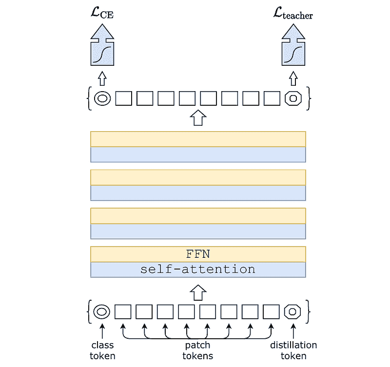
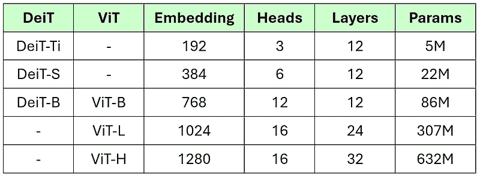
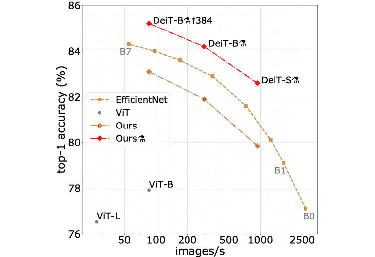
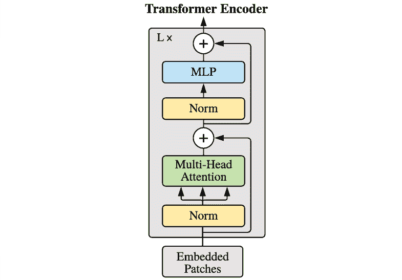
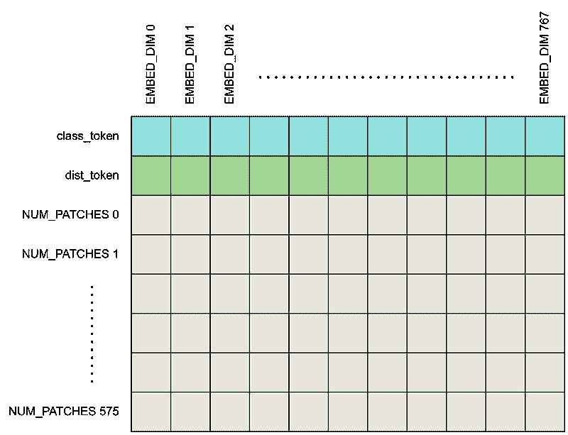

# DeiT 论文解读：预算内的视觉变换器

> 原文：[`towardsdatascience.com/vision-transformer-on-a-budget/`](https://towardsdatascience.com/vision-transformer-on-a-budget/)

## <mdspan datatext="el1748893371066" class="mdspan-comment">引言</mdspan>

原味 ViT 存在问题。如果您查看原始的 ViT 论文[1]，您会发现尽管这个深度学习模型证明效果极好，但它需要数亿个标记的训练图像才能达到这个效果。嗯，那可真是很多。

这种对大量数据的需求无疑是一个问题，因此，我们需要一个解决方案。2020 年 12 月，Touvron 等人在其研究论文“*通过注意力训练数据高效的图像变换器与蒸馏*”[2]中提出了一种想法，使得训练 ViT 模型在计算上变得更加便宜。作者们提出了一种想法，即不是从头开始训练基于变换器的模型，而是通过蒸馏利用现有模型的知识。通过这种方法，他们解决了 ViT 的数据饥渴问题，同时保持了高精度。更有趣的是，这篇论文在原始 ViT 发布后的两个月就出现了！

在这篇文章中，我将讨论作者们所提到的 DeiT（数据高效图像变换器）模型，以及如何从头开始实现该架构。由于 DeiT 直接源自 ViT，因此在阅读本文之前，了解 ViT 的相关知识是非常推荐的。您可以在本文末尾的参考文献[3]中找到我之前关于它的文章。

* * *

## DeiT 的想法

DeiT 利用了*知识蒸馏*的概念。如果您还不熟悉这个术语，它本质上是一种在训练阶段将一个模型（*教师*）的知识转移到另一个模型（*学生*）上的方法。在这种情况下，DeiT 充当学生，而教师是 RegNet，一个基于 CNN 的模型。在推理阶段，我们将完全省略 RegNet 教师，让 DeiT 学生自行做出预测。

知识蒸馏技术使得学生模型能够更高效地学习，这是有道理的，因为它不仅从头开始学习数据集中的模式，而且在训练过程中还受益于教师的知识。想象一下，有人在学习一门新学科。他们可以纯粹从书籍中学习，但如果他们还有一个导师提供指导，这将更加高效。在这个类比中，学习者扮演学生的角色，书籍是数据集，而导师是教师。因此，通过这种机制，学生实际上同时从数据集和教师那里获得知识。因此，训练学生模型所需的数据量要少得多。为了更好地说明这一点，原始的 ViT 需要 3 亿张图像进行训练（JFT-300M 数据集），而 DeiT 只需要 100 万张图像（ImageNet-1K 数据集）。这减少了 300 倍！

从技术上来说，知识蒸馏可以在不对学生或教师模型进行任何修改的情况下进行。相反，更改仅限于损失函数和训练过程。然而，作者发现，通过稍微修改网络结构，他们可以取得更好的效果，这同时也改变了蒸馏机制。具体来说，他们不是坚持使用原始的 ViT 并在其上应用标准的蒸馏过程，而是修改了架构，他们最终称之为 DeiT。重要的是要知道，这种修改也使得知识蒸馏机制与传统的不同。确切地说，在 ViT 中，我们只有所谓的 *类别标记*，但在 DeiT 中，我们将利用 *类别标记* 本身以及一个额外的称为 *蒸馏标记* 的标记。请看下面的图 1，以了解这两个标记在网络中的位置。



图 1. DeiT 架构 [2]。

### DeiT 和 ViT 变体

论文中提出了三种 DeiT 变体，分别是 DeiT-Ti（小型）、DeiT-S（小型）和 DeiT-B（基础）。注意在图 2 中，最大的 DeiT 变体（DeiT-B）在模型大小上与最小的 ViT 变体（ViT-B）相当。所以，这隐含地意味着 DeiT 确实是通过优先考虑效率来挑战 ViT 的。



图 2. DeiT 和 ViT 变体 [1, 2, 3]。

在编码部分稍后，我将实现 DeiT-B 架构。我会尽量使代码尽可能灵活，以便您在需要实现其他变体时可以轻松调整参数。仔细观察上表中 DeiT-B 行，我们将配置模型，使其将每个图像块映射到大小为 768 的一维张量。这个张量中的元素将在注意力层内部被分成 12 个头。通过这样做，每个注意力头都将负责处理 64 个特征。请记住，我们正在讨论的注意力层实际上是 Transformer 编码器层的一个组成部分。在 DeiT-B 的情况下，这个层在张量最终转发到输出层之前重复了 12 次。如果我们根据这些配置正确实现它，那么模型应该包含 8600 万个可训练参数。

### 实验结果

DeiT 论文中报告了大量的实验。以下是我最关注的其中一个。



图 3. 在 ImageNet-1K 数据集上没有额外训练数据的不同模型的性能 [2]。

上图是通过在 ImageNet-1K 数据集上训练多个模型获得的，包括 EfficientNet、ViT 和 DeiT 本身。实际上，图中显示了两个 DeiT 版本：DeiT 和 DeiT⚗（是的，后者有一个奇怪的符号，称为“alembic”），这基本上是指使用他们提出的蒸馏机制训练的 DeiT 模型。

从图中可以看出，ViT 的准确率在常规蒸馏下已经远远落后于 DeiT，同时仍然具有相似的处理速度。当应用新颖的蒸馏机制并使用相同图像放大到 384×384 进行微调时，准确率进一步提高——这就是 DeiT-B⚗↑384 的名字的由来。从理论上讲，ViT 应该比当前的结果表现更好，但在这个实验中，由于不允许在庞大的 JFT-300M 数据集上训练，它无法发挥全部潜力。这只是一个证明在数据有限的情况下 DeiT 优于 ViT 的结果。

我认为这可能是您需要理解以从头开始实现 DeiT 架构的所有内容。如果您还没有完全掌握这个模型的整体概念，请不要担心，因为我们将在下一分钟深入细节。

***

## DeiT 实现

如我之前提到的，我们即将实现的模型是 DeiT-B 变体。但既然我也想向您展示新颖的知识蒸馏机制，我将特别关注被称为 DeiT-B⚗↑384 的那个。现在让我们先导入所需的模块。

```py
# Codeblock 1
import torch
import torch.nn as nn
from timm.models.layers import trunc_normal_
from torchinfo import summary
```

由于已经导入了模块，接下来我们需要在下面的代码块 2 中初始化一些可配置的参数，这些参数都是根据 DeiT-B 规范进行调整的。在`#(1)`行，将`IMAGE_SIZE`变量设置为 384，因为我们即将模拟接受放大图像的 DeiT 版本。尽管这个输入具有更高的分辨率，但我们仍然保持补丁大小与处理 224×224 图像时相同，即 16×16，如`#(2)`行所述。接下来，我们将`EMBED_DIM`设置为 768（`#(3)`），而`NUM_HEADS`和`NUM_LAYERS`变量都设置为 12（`#(4–5)`）。作者决定使用与 ViT 中相同的 FFN 结构，其中其隐藏层的大小是嵌入维度的四倍（`#(6)`）。补丁的数量本身可以使用`#(7)`行显示的简单公式计算。在这种情况下，由于我们的图像大小是 384，补丁大小是 16，因此`NUM_PATCHES`的值将是 576。最后，我将`NUM_CLASSES`设置为 1000，模拟在 ImageNet-1K 数据集上的分类任务（`#(8)`）。

```py
# Codeblock 2
BATCH_SIZE   = 1
IMAGE_SIZE   = 384     #(1)
IN_CHANNELS  = 3

PATCH_SIZE   = 16      #(2)
EMBED_DIM    = 768     #(3)
NUM_HEADS    = 12      #(4)
NUM_LAYERS   = 12      #(5)
FFN_SIZE     = EMBED_DIM * 4    #(6)

NUM_PATCHES  = (IMAGE_SIZE//PATCH_SIZE) ** 2    #(7)

NUM_CLASSES  = 1000    #(8)
```

### 将图像视为一系列补丁

当涉及到使用转换器处理图像时，我们需要做的是将它们视为一系列补丁。这种补丁机制在下面的`Patcher`类中实现。

```py
# Codeblock 3
class Patcher(nn.Module):
    def __init__(self):
        super().__init__()
        self.conv = nn.Conv2d(in_channels=IN_CHANNELS,    #(1)
                              out_channels=EMBED_DIM, 
                              kernel_size=PATCH_SIZE,     #(2)
                              stride=PATCH_SIZE)          #(3)

        self.flatten = nn.Flatten(start_dim=2)            #(4)

    def forward(self, x):
        print(f'original\t: {x.size()}')

        x = self.conv(x)        #(5)
        print(f'after conv\t: {x.size()}')

        x = self.flatten(x)     #(6)
        print(f'after flatten\t: {x.size()}')

        x = x.permute(0, 2, 1)  #(7)
        print(f'after permute\t: {x.size()}')

        return x
```

您可以在代码块 3 中看到，我们使用一个`nn.Conv2d`层来实现这一点（`#(1)`）。请注意，这个层执行的操作并不是真正像 CNN 模型那样执行卷积。相反，我们将其用作一种技巧，以非重叠的方式提取每个补丁的信息，这就是为什么我们将`kernel_size`（`#(2)`）和`stride`（`#(3)`）都设置为`PATCH_SIZE`（16）的原因。这个卷积层执行的操作仅涉及补丁机制——我们还没有将这些补丁放入序列中。为了做到这一点，我们可以简单地利用一个`nn.Flatten`层，我在上面的代码块中初始化为`#(4)`。在`forward()`方法内部需要做的事情是将输入张量通过`conv`（`#(5)`）和`flatten`（`#(6)`）层。之后执行置换操作也是必要的，因为我们希望补丁序列沿着轴 1 放置，嵌入维度沿着轴 2（`#(7)`）。

现在让我们使用下面的代码块测试上面的`Patcher()`类。在这里，我使用一个维度设置为 1×3×384×384 的虚拟张量来测试它，模拟一个大小为 384×384 的单个 RGB 图像。

```py
# Codeblock 4
patcher = Patcher()
x = torch.randn(BATCH_SIZE, IN_CHANNELS, IMAGE_SIZE, IMAGE_SIZE)

x = patcher(x)
```

下面是输出看起来像什么。在这里，我打印出每一步后的张量维度，以便您可以清楚地看到网络内部的流程。

```py
# Codeblock 4 Output
original      : torch.Size([1, 3, 384, 384])
after conv    : torch.Size([1, 768, 24, 24])  #(1)
after flatten : torch.Size([1, 768, 576])     #(2)
after permute : torch.Size([1, 576, 768])     #(3)
```

注意在行`#(1)`中，张量的空间维度从 384×384 变为 24×24。这表明我们的卷积层成功完成了补丁过程。通过这样做，24×24 图像中的每一个像素现在代表输入图像中的每个 16×16 补丁。此外，注意在同一行中，通道数从 3 增加到`EMBED_DIM`（768）。稍后，我们将将其视为存储单个补丁信息的特征数量。接下来，我们可以在行`#(2)`中看到，我们的`flatten`层成功地将 24×24 张量展平成一个长度为 576 的单维张量，这意味着我们已经将图像表示为补丁标记的序列。我之前提到的 permute 操作实际上是因为在时间序列数据中，PyTorch 将张量的轴 1 视为序列（`#(3)`）。

### Transformer 编码器

现在，让我们暂时把`Patcher`类放一放，因为在本节中我们将要实现 transformer 编码器层。这个层直接来源于原始的 ViT 论文，其架构可以在下面的图 4 中看到。查看代码块 5，看看我是如何实现它的。



图 4. ViT [1] 中使用的 Transformer 编码器层。

```py
# Codeblock 5
class Encoder(nn.Module):
    def __init__(self):
        super().__init__()

        self.norm_0 = nn.LayerNorm(EMBED_DIM)    #(1)

        self.multihead_attention = nn.MultiheadAttention(EMBED_DIM,    #(2)
                                                         num_heads=NUM_HEADS, 
                                                         batch_first=True)

        self.norm_1 = nn.LayerNorm(EMBED_DIM)    #(3)

        self.ffn = nn.Sequential(                #(4)
            nn.Linear(in_features=EMBED_DIM, out_features=FFN_SIZE),
            nn.GELU(), 
            nn.Linear(in_features=FFN_SIZE, out_features=EMBED_DIM),
        )

    def forward(self, x):

        residual = x
        print(f'residual dim\t: {residual.size()}')

        x = self.norm_0(x)
        print(f'after norm\t: {x.size()}')

        x = self.multihead_attention(x, x, x)[0]
        print(f'after attention\t: {x.size()}')

        x = x + residual
        print(f'after addition\t: {x.size()}')

        residual = x
        print(f'residual dim\t: {residual.size()}')

        x = self.norm_1(x)
        print(f'after norm\t: {x.size()}')

        x = self.ffn(x)
        print(f'after ffn\t: {x.size()}')

        x = x + residual
        print(f'after addition\t: {x.size()}')

        return x
```

根据上述图示，在`__init__()`方法中需要初始化四个层，分别是多头注意力层（`#(2)`）、一个 MLP 层——这在图 1 中相当于 FFN（`#(4)`）和两个层归一化层（`#(1,3)`）。我不会深入探讨上述代码，因为它与我之前关于 ViT [4]的文章中解释的完全相同。因此，我强烈建议您查看那篇文章，以更好地理解`Encoder`类的工作原理。另外，如果您需要关于注意力机制的深入解释，您也可以阅读我之前的 transformer 文章 [5]，在那里我从零开始实现了整个 transformer 架构。

现在，我们可以继续查看测试代码，看看张量是如何在网络中流动的。在下面的代码块中，我假设输入张量`x`是已经被我们之前创建的`Patcher`块处理过的图像，这也是为什么我将它设置为 1×576×768 大小的原因。

```py
# Codeblock 6
encoder = Encoder()
x = torch.randn(BATCH_SIZE, NUM_PATCHES, EMBED_DIM)

x = encoder(x)
```

```py
# Codeblock 6 Output
residual dim    : torch.Size([1, 576, 768])
after norm      : torch.Size([1, 576, 768])
after attention : torch.Size([1, 576, 768])
after addition  : torch.Size([1, 576, 768])
residual dim    : torch.Size([1, 576, 768])
after norm      : torch.Size([1, 576, 768])
after ffn       : torch.Size([1, 576, 768])
after addition  : torch.Size([1, 576, 768])
```

根据上述结果，我们可以看到最终输出的张量维度与输入维度完全相同。这一特性允许我们在不破坏整个网络结构的情况下堆叠多个编码器块。此外，尽管张量的形状看起来在到达最后一层的过程中保持不变，但实际上在注意力和 FFN 层内部发生了许多维度变化。然而，这些变化并没有打印出来，因为这些过程是由`nn.MultiheadAttention`和`nn.Sequential`分别内部完成的。

### DeiT 架构的全貌

我在前面各节中解释的所有代码实际上与用于构建 ViT 架构的代码相同。在本节中，你将最终找到那些明显区分 DeiT 和 ViT 的代码。现在让我们专注于在`DeiT`类的`__init__()`方法中需要初始化的层。

```py
# Codeblock 7a
class DeiT(nn.Module):
    def __init__(self):
        super().__init__()

        self.patcher = Patcher()    #(1)

        self.class_token = nn.Parameter(torch.zeros(BATCH_SIZE, 1, EMBED_DIM))  #(2)
        self.dist_token  = nn.Parameter(torch.zeros(BATCH_SIZE, 1, EMBED_DIM))  #(3)

        trunc_normal_(self.class_token, std=.02)    #(4)
        trunc_normal_(self.dist_token, std=.02)     #(5)

        self.pos_embedding = nn.Parameter(torch.zeros(BATCH_SIZE, NUM_PATCHES+2, EMBED_DIM))  #(6)
        trunc_normal_(self.pos_embedding, std=.02)  #(7)

        self.encoders = nn.ModuleList([Encoder() for _ in range(NUM_LAYERS)])  #(8)

        self.norm_out = nn.LayerNorm(EMBED_DIM)     #(9)

        self.class_head = nn.Linear(in_features=EMBED_DIM, out_features=NUM_CLASSES)  #(10)
        self.dist_head  = nn.Linear(in_features=EMBED_DIM, out_features=NUM_CLASSES)  #(11)
```

我在这里初始化的第一个组件是我们之前创建的`Patcher`(`#(1)`)。接下来，DeiT 不仅使用类标记，还使用另一个名为蒸馏标记的标记。这两个标记，在上面的代码中分别被称为`class_token`(`#(2)`)和`dist_token`(`#(3)`)，稍后将被附加到片段标记序列中。我们将这两个额外的标记设置为可训练的，允许它们在注意力层处理过程中与片段标记交互和学习。请注意，我使用标准差为 0.02 的`trunc_normal_()`初始化这两个可训练张量(`#(4–5)`)。如果你还不熟悉这个函数，它本质上生成一个截断正态分布，这确保了没有值位于平均值两个标准差之外，避免了权重初始化时极端值的存在。实际上，这种方法比直接使用`torch.randn()`更好，因为这个函数没有这样的值截断机制。

之后，我们使用与我在第`#(6)`行和`#(7)`行所用的相同技术创建了一个可学习的位置嵌入张量。重要的是要记住，这个张量随后将与附加了类和蒸馏标记的序列片段标记进行逐元素相加。由于这个原因，我们需要将这个嵌入张量轴 1 的长度设置为`NUM_PATCHES+2`。同时，变换器编码器层在`nn.ModuleList`内部初始化，这使得我们可以重复该层`NUM_LAYERS`（12 次）(`#(8)`）。堆叠中最后一个编码器层产生的输出将在最终被转发到分类(`#(10)`)和蒸馏头(`#(11)`)之前经过层归一化(`#(9)`)。

现在，让我们继续到`forward()`方法，你可以在下面的代码块 7b 中看到它。

```py
# Codeblock 7b
    def forward(self, x):
        print(f'original\t\t: {x.size()}')

        x = self.patcher(x)           #(1)
        print(f'after patcher\t\t: {x.size()}')

        x = torch.cat([self.class_token, self.dist_token, x], dim=1)  #(2)
        print(f'after concat\t\t: {x.size()}')

        x = x + self.pos_embedding    #(3)
        print(f'after pos embed\t\t: {x.size()}')

        for i, encoder in enumerate(self.encoders):
            x = encoder(x)            #(4)
            print(f"after encoder #{i}\t: {x.size()}")

        x = self.norm_out(x)          #(5)
        print(f'after norm\t\t: {x.size()}')

        class_out = x[:, 0]           #(6)
        print(f'class_out\t\t: {class_out.size()}')

        dist_out  = x[:, 1]           #(7)
        print(f'dist_out\t\t: {dist_out.size()}')

        class_out = self.class_head(class_out)    #(8)
        print(f'after class_head\t: {class_out.size()}')

        dist_out  = self.dist_head(dist_out)       #(9)
        print(f'after dist_head\t\t: {class_out.size()}')

        return class_out, dist_out
```

在将原始图像作为输入之后，这个`forward()`方法将使用`patcher`层(`#(1)`)处理图像。正如我们之前所讨论的，这个层负责将图像转换为一系列片段。随后，我们将使用`torch.cat()`(`#(2)`)将类和蒸馏标记附加到它上面。值得注意的是，尽管图 1 中的插图将类标记放置在序列的开头，而将蒸馏标记放置在末尾，但官方 GitHub 仓库[6]中的代码表明蒸馏标记被放置在类标记之后。因此，我决定在我们的实现中采用这种方法。下面的图 5 展示了结果张量的样子。



图 5.在我们的实现中，类别和蒸馏标记是如何连接到补丁标记序列的 [3]。

在 Codeblock 7b 中，我们接下来需要做的是将位置嵌入张量注入到标记序列中，这个过程在行（`#(3)`）中完成。然后我们通过一个简单的循环（`#(4)`）将张量通过编码器堆栈传递，并规范化最后编码器层产生的输出（`#(5)`）。在行`#(6)`和`#(7)`中，我们使用标准的数组切片方法从之前附加的类别和蒸馏标记中提取信息。这两个标记现在应该包含对分类任务有意义的 信息，因为它们已经通过自注意力层学习了图像的上下文。然后，`class_out`和`dist_out`张量被转发到两个相同的输出层，并将独立处理（`#(8–9)`）。由于这个模型旨在进行分类，这两个输出层将产生包含 logits 的张量，其中每个元素代表一个类别的原始预测分数。

我们可以通过以下测试代码看到 DeiT 模型的流程，其中我们最初从原始输入图像（`#(1)`）开始，将其转换为一系列补丁（`#(2)`），连接类别和蒸馏标记（`#(3)`），等等，直到最终从分类和蒸馏头获得输出（`#(4–5)`）。

```py
# Codeblock 8
deit = DeiT()
x = torch.randn(BATCH_SIZE, IN_CHANNELS, IMAGE_SIZE, IMAGE_SIZE)

class_out, dist_out = deit(x)
```

```py
# Codeblock 8 Output
original          : torch.Size([1, 3, 384, 384])  #(1)
after patcher     : torch.Size([1, 576, 768])     #(2)
after concat      : torch.Size([1, 578, 768])     #(3)
after pos embed   : torch.Size([1, 578, 768])
after encoder #0  : torch.Size([1, 578, 768])
after encoder #1  : torch.Size([1, 578, 768])
after encoder #2  : torch.Size([1, 578, 768])
after encoder #3  : torch.Size([1, 578, 768])
after encoder #4  : torch.Size([1, 578, 768])
after encoder #5  : torch.Size([1, 578, 768])
after encoder #6  : torch.Size([1, 578, 768])
after encoder #7  : torch.Size([1, 578, 768])
after encoder #8  : torch.Size([1, 578, 768])
after encoder #9  : torch.Size([1, 578, 768])
after encoder #10 : torch.Size([1, 578, 768])
after encoder #11 : torch.Size([1, 578, 768])
after norm        : torch.Size([1, 578, 768])
class_out         : torch.Size([1, 768])
dist_out          : torch.Size([1, 768])
after class_head  : torch.Size([1, 1000])         #(4)
after dist_head   : torch.Size([1, 1000])         #(5)
```

如果你想看到更多关于架构的细节，也可以运行以下代码。从生成的输出中可以看到，这个网络包含 8700 万个参数，这略高于论文中报告的数字（8600 万）。我确实承认，我上面写的代码确实比文档中的代码简单得多，所以我可能遗漏了一些导致参数数量差异的东西——如果你发现我的代码中有任何错误，请告诉我！

```py
# Codeblock 9
summary(deit, input_size=(BATCH_SIZE, IN_CHANNELS, IMAGE_SIZE, IMAGE_SIZE))
```

```py
# Codeblock 9 Output
==========================================================================================
Layer (type:depth-idx)                   Output Shape              Param #
==========================================================================================
DeiT                                     [1, 1000]                 445,440
├─Patcher: 1-1                           [1, 576, 768]             --
│    └─Conv2d: 2-1                       [1, 768, 24, 24]          590,592
│    └─Flatten: 2-2                      [1, 768, 576]             --
├─ModuleList: 1-2                        --                        --
│    └─Encoder: 2-3                      [1, 578, 768]             --
│    │    └─LayerNorm: 3-1               [1, 578, 768]             1,536
│    │    └─MultiheadAttention: 3-2      [1, 578, 768]             2,362,368
│    │    └─LayerNorm: 3-3               [1, 578, 768]             1,536
│    │    └─Sequential: 3-4              [1, 578, 768]             4,722,432
│    └─Encoder: 2-4                      [1, 578, 768]             --
│    │    └─LayerNorm: 3-5               [1, 578, 768]             1,536
│    │    └─MultiheadAttention: 3-6      [1, 578, 768]             2,362,368
│    │    └─LayerNorm: 3-7               [1, 578, 768]             1,536
│    │    └─Sequential: 3-8              [1, 578, 768]             4,722,432
│    └─Encoder: 2-5                      [1, 578, 768]             --
│    │    └─LayerNorm: 3-9               [1, 578, 768]             1,536
│    │    └─MultiheadAttention: 3-10     [1, 578, 768]             2,362,368
│    │    └─LayerNorm: 3-11              [1, 578, 768]             1,536
│    │    └─Sequential: 3-12             [1, 578, 768]             4,722,432
│    └─Encoder: 2-6                      [1, 578, 768]             --
│    │    └─LayerNorm: 3-13              [1, 578, 768]             1,536
│    │    └─MultiheadAttention: 3-14     [1, 578, 768]             2,362,368
│    │    └─LayerNorm: 3-15              [1, 578, 768]             1,536
│    │    └─Sequential: 3-16             [1, 578, 768]             4,722,432
│    └─Encoder: 2-7                      [1, 578, 768]             --
│    │    └─LayerNorm: 3-17              [1, 578, 768]             1,536
│    │    └─MultiheadAttention: 3-18     [1, 578, 768]             2,362,368
│    │    └─LayerNorm: 3-19              [1, 578, 768]             1,536
│    │    └─Sequential: 3-20             [1, 578, 768]             4,722,432
│    └─Encoder: 2-8                      [1, 578, 768]             --
│    │    └─LayerNorm: 3-21              [1, 578, 768]             1,536
│    │    └─MultiheadAttention: 3-22     [1, 578, 768]             2,362,368
│    │    └─LayerNorm: 3-23              [1, 578, 768]             1,536
│    │    └─Sequential: 3-24             [1, 578, 768]             4,722,432
│    └─Encoder: 2-9                      [1, 578, 768]             --
│    │    └─LayerNorm: 3-25              [1, 578, 768]             1,536
│    │    └─MultiheadAttention: 3-26     [1, 578, 768]             2,362,368
│    │    └─LayerNorm: 3-27              [1, 578, 768]             1,536
│    │    └─Sequential: 3-28             [1, 578, 768]             4,722,432
│    └─Encoder: 2-10                     [1, 578, 768]             --
│    │    └─LayerNorm: 3-29              [1, 578, 768]             1,536
│    │    └─MultiheadAttention: 3-30     [1, 578, 768]             2,362,368
│    │    └─LayerNorm: 3-31              [1, 578, 768]             1,536
│    │    └─Sequential: 3-32             [1, 578, 768]             4,722,432
│    └─Encoder: 2-11                     [1, 578, 768]             --
│    │    └─LayerNorm: 3-33              [1, 578, 768]             1,536
│    │    └─MultiheadAttention: 3-34     [1, 578, 768]             2,362,368
│    │    └─LayerNorm: 3-35              [1, 578, 768]             1,536
│    │    └─Sequential: 3-36             [1, 578, 768]             4,722,432
│    └─Encoder: 2-12                     [1, 578, 768]             --
│    │    └─LayerNorm: 3-37              [1, 578, 768]             1,536
│    │    └─MultiheadAttention: 3-38     [1, 578, 768]             2,362,368
│    │    └─LayerNorm: 3-39              [1, 578, 768]             1,536
│    │    └─Sequential: 3-40             [1, 578, 768]             4,722,432
│    └─Encoder: 2-13                     [1, 578, 768]             --
│    │    └─LayerNorm: 3-41              [1, 578, 768]             1,536
│    │    └─MultiheadAttention: 3-42     [1, 578, 768]             2,362,368
│    │    └─LayerNorm: 3-43              [1, 578, 768]             1,536
│    │    └─Sequential: 3-44             [1, 578, 768]             4,722,432
│    └─Encoder: 2-14                     [1, 578, 768]             --
│    │    └─LayerNorm: 3-45              [1, 578, 768]             1,536
│    │    └─MultiheadAttention: 3-46     [1, 578, 768]             2,362,368
│    │    └─LayerNorm: 3-47              [1, 578, 768]             1,536
│    │    └─Sequential: 3-48             [1, 578, 768]             4,722,432
├─LayerNorm: 1-3                         [1, 578, 768]             1,536
├─Linear: 1-4                            [1, 1000]                 769,000
├─Linear: 1-5                            [1, 1000]                 769,000
==========================================================================================
Total params: 87,630,032
Trainable params: 87,630,032
Non-trainable params: 0
Total mult-adds (Units.MEGABYTES): 398.43
==========================================================================================
Input size (MB): 1.77
Forward/backward pass size (MB): 305.41
Params size (MB): 235.34
Estimated Total Size (MB): 542.52
==========================================================================================
```

### 分类和蒸馏头的工作原理

我想简单谈谈两个输出头产生的张量。在训练阶段，分类头的输出与原始的地面真实值（one-hot 标签）进行比较，分类性能使用交叉熵损失来评估。同时，蒸馏头的输出与教师模型（即 RegNet）产生的输出进行比较。我们总是将教师模型的输出视为真实值，无论其预测是否正确。这就是从 RegNet 到 DeiT 的知识蒸馏的基本方法。

实际上，执行知识蒸馏有两种可能的方法：*软蒸馏*和*硬蒸馏*。前者是一种技术，我们使用教师模型产生的 logits（而不是 argmaxed logits）作为标签。这种额外的真实标签被称为*软标签*。如果我们决定使用这种技术，我们应该使用所谓的 Kullback-Leibler (KL) 损失，它适合比较两个 logits：一个来自蒸馏头，另一个来自教师输出。另一方面，*硬蒸馏*是一种技术，在将教师预测与蒸馏头的输出进行比较之前，先对教师预测进行 argmax。在这种情况下，教师输出被称为*硬标签*，类似于典型的 one-hot 编码标签。正因为如此，如果我们决定使用硬标签，我们可以简单地使用标准的交叉熵损失来处理这个头。尽管作者发现硬蒸馏比软蒸馏表现更好，但我仍然认为，如果你计划在即将到来的项目中使用 DeiT，尝试这两种方法是有价值的，看看这个概念是否也适用于你的情况。

在推理阶段，我们将不再使用教师模型。想象一下，学生已经毕业，准备独立工作了。尽管没有教师，蒸馏头的输出仍然被利用。根据他们的 GitHub 文档[6]，在 argmax 之前，使用标准平均机制将分类头和蒸馏头产生的 logits 结合起来，以获得最终的预测。

* * *

## 结束

我认为这就是 DeiT 的主要思想和实现。重要的是要注意，这篇文章中还有很多我没有涉及到的内容。因此，如果你想要更深入地了解这个深度学习模型的细节，我强烈建议你阅读论文[2]。

感谢阅读，希望你在今天学到了一些新知识！

*顺便说一下，你可以在参考文献编号[7]的链接中找到这篇文章中使用的代码*。

* * *

### 参考文献

[1] 亚历克谢·多索夫斯基等. 一图胜千言：大规模图像识别的 Transformer. Arxiv. [`arxiv.org/abs/2010.11929`](https://arxiv.org/abs/2010.11929) [访问日期：2025 年 2 月 17 日].

[2] 雨果·图尔弗龙等. 训练数据高效的图像 Transformer 和通过注意力进行蒸馏. Arxiv. [`arxiv.org/abs/2012.12877`](https://arxiv.org/abs/2012.12877) [访问日期：2025 年 2 月 17 日].

[3] 图像由作者原创。

[4] 穆罕默德·阿尔迪. 论文解读：视觉 Transformer (ViT). 数据科学向导. [`towardsdatascience.com/paper-walkthrough-vision-transformer-vit-c5dcf76f1a7a/`](https://towardsdatascience.com/paper-walkthrough-vision-transformer-vit-c5dcf76f1a7a/) [访问日期：2025 年 2 月 17 日].

[5] 穆罕默德·阿尔迪. 论文解读：注意力即一切。数据科学之路。[`towardsdatascience.com/paper-walkthrough-attention-is-all-you-need-80399cdc59e1/`](https://towardsdatascience.com/paper-walkthrough-attention-is-all-you-need-80399cdc59e1/) [访问日期：2025 年 2 月 17 日].

[6] facebookresearch. GitHub。[`github.com/facebookresearch/deit/blob/main/models.py`](https://github.com/facebookresearch/deit/blob/main/models.py) [访问日期：2025 年 2 月 17 日].

[7] 穆罕默德·阿尔迪·普特拉. 在预算内使用视觉 Transformer。GitHub。[`github.com/MuhammadArdiPutra/medium_articles/blob/main/Vision%20Transformer%20on%20a%20Budget.ipynb`](https://github.com/MuhammadArdiPutra/medium_articles/blob/main/Vision%20Transformer%20on%20a%20Budget.ipynb) [访问日期：2025 年 2 月 17 日].
