# 视觉 Transformer (ViT) 解释：它们是否优于 CNN？

> 原文：[`towardsdatascience.com/vision-transformers-vit-explained-are-they-better-than-cnns/`](https://towardsdatascience.com/vision-transformers-vit-explained-are-they-better-than-cnns/)

## 1. 简介

自从自注意力机制被引入以来，Transformer 一直是自然语言处理（NLP）任务的首选。基于自注意力的模型高度可并行化，并且需要的参数数量大大减少，这使得它们在计算效率上更加出色，更不容易过拟合，并且更容易针对特定领域任务进行微调 [1]。此外，Transformer 相较于过去模型（如 RNN、LSTM、GRU 以及其他在 Transformer 引入之前主导 NLP 领域的基于神经的网络架构）的关键优势在于它们能够通过使用自注意力机制处理任意长度的输入序列而不丢失上下文，该机制专注于输入序列的不同部分，以及这些部分在不同时间如何与其他部分相互作用 [2]。正因为这些特性，Transformer 使得训练超过 1000 亿参数的巨大语言模型成为可能，为当前最先进的模型如*生成预训练 Transformer*（GPT）和*双向编码器表示从 Transformer*（BERT）铺平了道路 [1]。

然而，在计算机视觉领域，卷积神经网络或 CNN 在大多数，如果不是所有计算机视觉任务中仍然占据主导地位。尽管有越来越多的研究工作试图实现基于自注意力的架构来执行计算机视觉任务，但真正可靠地优于 CNN 并具有良好可扩展性的研究却寥寥无几 [3]。将 Transformer 架构与图像相关任务结合的主要挑战在于，按照设计，Transformer 的核心组件自注意力机制在序列长度上具有二次时间复杂度，即 O(n²)，如表 I 所示，并在第 2.1 部分进一步讨论。这对于使用相对较少标记的 NLP 任务（例如，一个 1000 词的段落将只有 1000 个输入标记，如果使用子词单元作为标记而不是完整单词，则可能更多）通常不是问题。然而，在计算机视觉中，输入序列（图像）的标记大小可以比 NLP 输入序列大得多。例如，一个相对较小的 300 x 300 x 3 图像可以轻松地有高达 270,000 个标记，并且当自注意力机制被天真地应用时，需要高达 72.9 亿个参数的自注意力图（270,000²）。

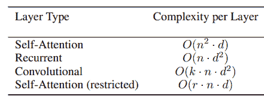

表 I. 不同层类型的时间复杂度 [2]。

因此，大多数尝试使用基于自注意力架构来执行计算机视觉任务的科研工作要么是通过局部应用自注意力，结合使用 Transformer 块和 CNN 层，要么是仅替换 CNN 架构的特定组件，同时保持网络的总体结构；从未仅使用纯 Transformer[3]。Dosovitskiy 博士及其在他们的工作“An Image is Worth 16×16 Words: Transformers for Image Recognition at Scale”中的目标是证明，通过使用基本的 Transformer 编码器架构全局应用自注意力，确实可以实现图像分类，同时显著减少训练所需的计算资源，并优于 ResNet 等最先进的卷积神经网络。

## 2. Transformer

Vaswani 等人于 2017 年发表的论文“Attention is All You Need”中引入的 Transformer 是一类神经网络架构，它彻底改变了各种自然语言处理和机器学习任务。其架构的高级视图如图 1 所示。

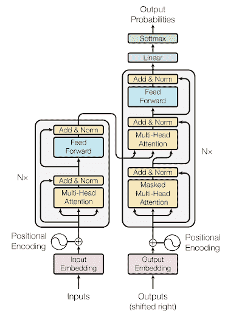

图 1. Transformer 模型架构展示了编码器（左侧块）

以及解码组件（右侧块）[2]

自从其引入以来，Transformer 已经成为了许多最先进的 NLP 模型的基石；包括 BERT、GPT 等。从根本上说，它们被设计用来处理序列数据，如文本数据，而不需要循环或卷积层[2]。它们通过大量依赖称为*自注意力*的机制来实现这一点。

自注意力机制是论文中引入的一项关键创新，它允许模型通过根据序列中每个元素相对于其他元素的重要性来权衡每个元素，从而捕获给定序列中不同元素之间的关系[2]。例如，如果你想翻译以下句子：

> *“动物没有过马路，因为它太累了。”*

这个句子中的“*it*”一词指的是什么？是指街道还是动物？对我们人类来说，这可能是一个微不足道的问题。但对于一个算法来说，这可能被认为是一个复杂的任务。然而，通过自注意力机制，Transformer 模型能够估计句子中每个词相对于其他所有词的相对权重，从而使模型能够将“it”这个词与“animal”在给定句子的上下文中关联起来[4]。

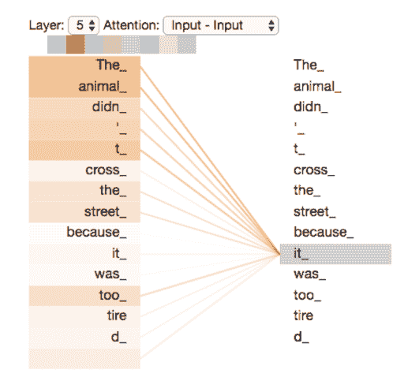

图 2. 在一个 5 编码器堆叠的自注意力块中，以“it”作为输入的 5 编码器的样本输出。我们可以看到，注意力机制正在将我们的输入词与短语“The Animal”关联起来[4]。

### 2.1. 自注意力机制

Transformer 通过并行通过编码器（或编码器堆栈）和解码器（或解码器堆栈）块传递每个输入序列的元素来 *转换* 给定的输入序列 [2]。每个编码器块包含一个自注意力块和一个前馈神经网络。在这里，我们只关注 *transformer 编码器* 块，因为这是 Dosovitskiy 等人在其视觉 Transformer 图像分类模型中使用的组件。

就像一般的 NLP 应用一样，编码过程中的第一步是将每个输入单词通过嵌入层转换成一个向量，嵌入层将我们的文本数据转换成一个向量，它代表我们在向量空间中的单词，同时保留其上下文信息。然后，我们将这些单个单词嵌入向量编译成一个矩阵 *X*，其中每一行 *i* 代表输入序列中每个元素 *i* 的嵌入。然后，我们为输入序列中的每个元素创建三组向量；即，键 (*K*)，查询 (*Q*) 和值 (*V*)。这些组是通过将矩阵 *X* 与相应的可训练权重矩阵 WQ，WK 和 WV 相乘得到的 [2]。

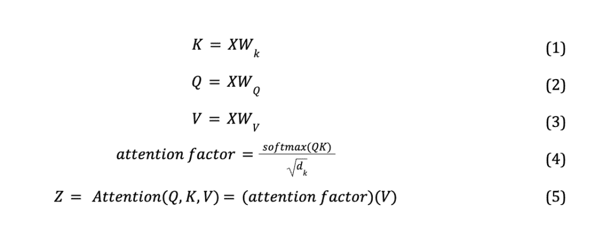

之后，我们在 *K* 和 *Q* 之间执行矩阵乘法，将结果除以 *K* 的维度的平方根：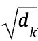…然后应用 softmax 函数来归一化输出并生成介于 0 和 1 之间的权重值 [2]。

我们将这个中间输出称为 *注意力因子*。这个因子，如图 4 所示，代表序列中每个元素对当前位置（正在处理的单词）的注意力值计算所贡献的权重。softmax 操作背后的思想是放大模型认为与当前位置相关的单词，并衰减那些不相关的单词。例如，在图 3 中，输入句子“*他后来去马来西亚报道了一年*”被输入到一个 BERT 编码单元中，生成一个热图，说明了每个单词之间的上下文关系。我们可以看到，被认为上下文相关的单词在其各自的单元格中产生更高的权重值，以深粉色表示，而上下文无关的单词具有较低的权重值，以浅粉色表示。

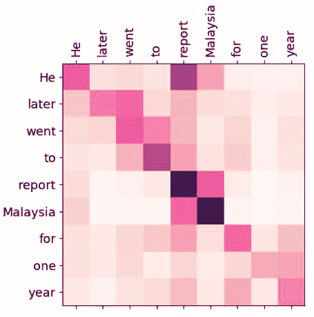

图 3. 注意力矩阵可视化 – BERT 编码单元中的权重 [5]

最后，我们将注意力因子矩阵乘以值矩阵 *V* 来计算本层的聚合自注意力值矩阵 *Z* [2]，其中 *Z* 中的每一行 *i* 代表输入序列中单词 *i* 的注意力向量。这种聚合值本质上是将句子中其他单词提供的“上下文”烘焙到当前正在处理的单词中。图 5 中所示的注意力方程有时也被称为 *缩放点积注意力*。

### 2.2 多头自注意力

在 Vaswani 等人发表的论文中，自注意力块进一步通过称为“多头”自注意力的机制进行了增强，如图 4 所示。其背后的想法是，而不是依赖于单一的关注机制，模型采用多个并行注意力“头”（在论文中，Vaswani 等人使用了 8 个并行注意力层），其中每个注意力头学习不同的关系，并为输入序列提供独特的视角[2]。这以两种重要方式提高了注意力层的性能：

首先，它扩展了模型在序列中关注不同位置的能力。根据初始化和训练过程中涉及的多重变化，给定单词（公式 5）的计算注意力值可能被其他某些无关的单词或短语甚至单词本身所主导[4]。通过计算多个注意力头，Transformer 模型有多次机会捕捉正确的上下文关系，从而对输入中的变化和歧义更加鲁棒。其次，由于我们的每个 *Q, K, V* 矩阵都是独立地在所有注意力头中进行随机初始化，因此训练过程产生了多个 *Z* 矩阵（公式 5），这为 Transformer 提供了多个 *表示子空间* [4]。例如，一个头可能专注于句法关系，而另一个头可能关注语义意义。通过这种方式，模型能够捕捉到数据中的更多样化的关系。

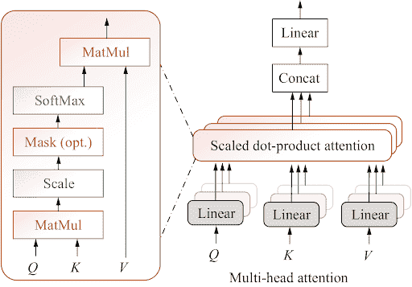

图 4。说明多头自注意力机制。每个单独的注意力头产生一个缩放点积注意力值，这些值被连接并乘以学习矩阵 W^O，以生成聚合的多头自注意力值矩阵[4]。

## 3. 视觉 Transformer

视觉 Transformer (ViT) 的基本创新在于将图像视为标记序列而不是像素网格。在传统的 CNN 中，输入图像通过滑动卷积滤波器分析为重叠的瓦片，然后通过一系列卷积和池化层进行层次化处理。相比之下，ViT 将图像视为一组 *非重叠* 的补丁，这些补丁被视为标准 Transformer 编码单元的输入序列。

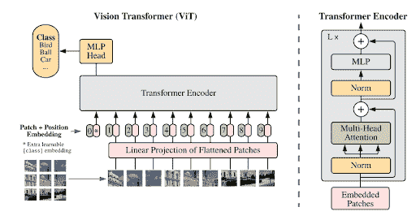

图 5。视觉 Transformer 架构（左）和 Transformer 编码单元

来自图 1（右）[3]。

通过将变换器的输入标记定义为非重叠图像块而不是单个像素，因此我们能够将注意力图的维度从 \( \langle \mathbf{H} \times \mathbf{W} \rangle² \) 降低到 \( \langle n[\text{ph}] \times n[\text{pw}] \rangle² \)，其中 \( n[\text{ph}] \ll \mathbf{H} \) 和 \( n[\text{pw}] \ll \mathbf{W} \)；这里 \( \mathbf{H} \) 和 \( \mathbf{W} \) 是图像的高度和宽度，而 \( n[\text{ph}] \) 和 \( n[\text{pw}] \) 是对应轴上的块数量。这样做，模型能够处理不同大小的图像，而无需进行大量的架构更改 [3]。

这些图像块随后被线性嵌入到低维向量中，类似于第 2.1 部分中产生矩阵 *X* 的词嵌入步骤。由于变换器不包含递归或卷积，它们缺乏编码输入标记位置信息的能力，因此是排列不变的 [2]。因此，就像在 NLP 应用中做的那样，在将向量输入到变换器模型之前，为每个线性编码向量附加一个位置嵌入，以编码块的空间信息，确保模型理解每个标记相对于图像中其他标记的位置。此外，还添加了一个额外的可学习分类器 *cls* 嵌入。所有这些（每个 16 x 16 块的线性嵌入、额外的可学习分类器嵌入及其对应的位置嵌入向量）都通过标准 Transformer 编码器单元传递，正如第二部分所讨论的那样。然后，使用添加的可学习 *cls* 嵌入对应的输出通过标准 MLP 分类器头进行分类 [3]。

## 4. 结果

在论文中，两个最大的模型，ViT-H/14 和 ViT-L/16，都是在 JFT-300M 数据集上预训练的，它们与最先进的 CNN 进行了比较——如表 II 所示，包括 Big Transfer (BiT)，它使用大型 ResNets 进行监督式迁移学习，以及 Noisy Student，这是一个使用 ImageNet 和 JFT-300M 上的半监督学习训练的大型 EfficientNet，且没有标签 [3]。在本文发表时，Noisy Student 在 ImageNet 上处于最先进的地位，而 BiT-L 在论文中使用的其他数据集上 [3]。所有模型都是在 TPUv3 硬件上训练的，并且记录了训练每个模型所需的 TPUv3-core-days。

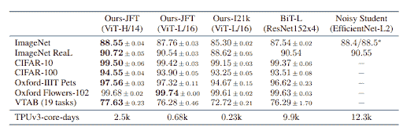

表 II. 模型性能与流行图像分类基准的比较。这里报告的是平均准确率和标准偏差，这些数据是在三次微调运行中平均得到的 [3]。

从表中我们可以看出，在 JFT-300M 数据集上预训练的 Vision Transformer 模型在所有数据集上都优于基于 ResNet 的基线模型；同时，在预训练过程中需要的计算资源（TPUv3-core-days）显著减少。一个次要的 ViT-L/16 模型也在一个规模较小的公共 ImageNet-21k 数据集上进行了训练，并且显示出相对较好的性能，同时与最先进的同类产品相比，所需的计算资源最多减少了 97%[3]。

图 6 显示了 BiT 和 ViT 模型（使用 ImageNet Top1 准确率指标进行衡量）在不同大小预训练数据集上的性能比较。我们看到，在像 ImageNet 这样的小数据集上，ViT-Large 模型的表现不如基线模型，在 ImageNet-21k 上表现大致相当。然而，当在更大的数据集如 JFT-300M 上预训练时，ViT 明显优于基线模型[3]。

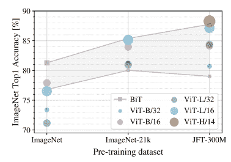

图 6. BiT（ResNet）与 ViT 在不同预训练数据集上的比较[3]。

进一步探索数据集大小与模型性能之间的关系，作者在 JFT 数据集的各种随机子集上训练了模型——9M、30M、90M 和完整的 JFT-300M。在较小的子集上没有添加额外的正则化，以便评估模型的内在属性（而不是正则化的效果）[3]。图 7 显示，在较小的数据集上，ViT 模型比 ResNets 更容易过拟合。数据显示，ResNets 在较小的预训练数据集上表现更好，但比 ViT 更快达到平台期；然后 ViT 在较大的预训练数据集上超过了前者。作者得出结论，在较小的数据集上，卷积归纳偏差在 CNN 模型性能中起着关键作用，这是 ViT 模型所缺乏的。然而，随着数据量的增加，直接学习相关模式的重要性超过了归纳偏差，其中 ViT 表现出色[3]。

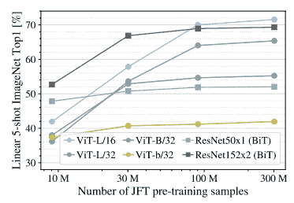

图 7. ResNet 与 ViT 在 JFT 训练数据集的不同子集上的比较[3]。

最后，作者分析了模型从 JFT-300M 到总预训练计算资源分配的迁移性能，如图 8 所示。在这里，我们看到，在相同的计算预算下，Vision Transformers 在所有方面都优于 ResNets。ViT 使用大约 2-4 倍的计算资源就能达到与 ResNet 相似的性能[3]。实现混合模型确实可以提高较小模型尺寸的性能，但对于较大模型，差异消失了，这令作者感到惊讶，因为最初的假设是卷积局部特征处理应该能够帮助 ViT，无论计算规模如何[3]。

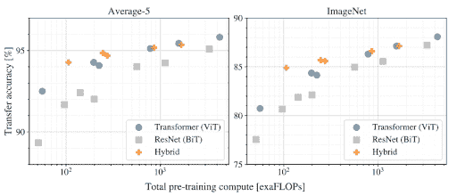

图 8. 不同预训练计算值（每秒十亿次浮点运算或 exaFLOPs）下模型的性能[3]。

### 4.1 ViT 模型学习了什么？

为了理解 ViT 如何处理图像数据，分析其内部表示非常重要。在第三部分中，我们了解到从图像生成的输入补丁被输入到一个线性嵌入层，该层将 16×16 的补丁投影到低维向量空间中，然后其生成的嵌入表示随后附加了位置嵌入。图 9 显示，该模型确实学会了编码图像中每个补丁的相对位置。作者使用了补丁间学习位置嵌入之间的余弦相似度 [3]。在位置嵌入矩阵中对应补丁的相似相对区域内出现高余弦相似度值；即，右上角的补丁（第 1 行，第 7 列）在位置嵌入矩阵的右上角区域有相应的高余弦相似度值（黄色像素）[3]。

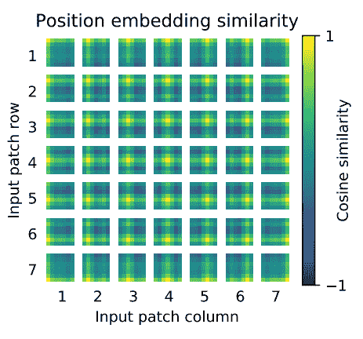

图 9. 输入图像补丁的学习位置嵌入 [3]。

同时，图 10（左侧）显示了应用于添加位置嵌入之前原始图像补丁的学习嵌入过滤器的最高主成分。对我来说，有趣的是这与从卷积神经网络中获得的学到的隐藏层表示多么相似，该示例在相同图（右侧）中使用 AlexNet 架构展示。

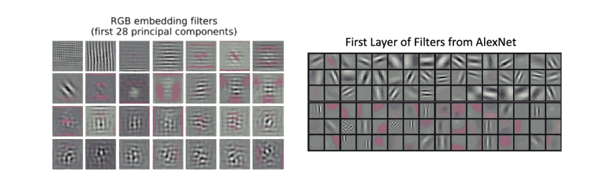

图 10. ViT-L/32 的初始线性嵌入层的过滤器（左侧）[3]。

AlexNet 的第一层过滤器（右侧）[6]。

按照设计，自注意力机制应该允许 ViT 整合整个图像的信息，甚至在最低层，有效地在开始时为 ViT 提供全局感受野。我们可以在图 10 中看到这种效果，其中学习的嵌入过滤器捕获了低级特征，如线条和网格，以及结合线条和颜色斑块的更高级模式。这与 CNN 形成对比，CNN 在最低层的感受野尺寸非常小（因为卷积操作的局部应用仅 *关注* 由过滤器大小定义的区域），并且随着卷积的进一步应用，感受野才会向更深层的卷积扩展，因为卷积进一步提取了从较低层提取的合并信息中的上下文。作者进一步通过测量 *注意力距离* 来测试这一点，该距离是通过“基于注意力权重的图像空间中信息整合的平均距离”计算的 [3]。结果如图 11 所示。

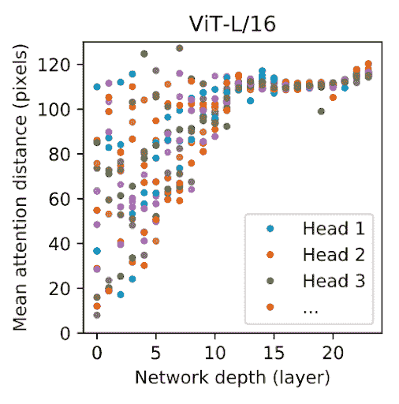

图 11. 头部关注区域和网络深度的尺寸 [3]。

从图中我们可以看到，即使在网络非常低的层，一些头已经关注了图像的大部分（如网络深度较低时，数据点具有高平均注意力距离值所示）；这证明了 ViT 模型即使在最低层也能全局整合图像信息的能力。

最后，作者还使用 Attention Rollout 计算了从输出标记到输入空间的注意力图，通过平均所有头的 ViT-L/16 的注意力权重，然后递归地乘以所有层的权重矩阵。这结果展示了一个在分类之前输出层关注的内容的直观可视化，如图 12 所示 [3]。

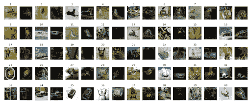

图 12. 输出标记到输入空间的注意力代表性示例 [3]。

## 5. 那么，ViT 是计算机视觉的未来吗？

本论文中展示的研究中，Dosovitskiy 等人提出的视觉 Transformer（ViT）是一种开创性的计算机视觉任务架构。与之前引入图像特定偏差的方法不同，ViT 将图像视为一系列补丁的序列，并使用标准的 Transformer 编码器进行处理，就像在自然语言处理中使用的 Transformer 一样。这种简单而可扩展的策略，结合在大量数据集上的预训练，已经在第四部分讨论中产生了令人印象深刻的结果。视觉 Transformer（ViT）在众多图像分类数据集上（图 6、7 和 8）要么匹配要么超越了最先进的技术，同时保持了预训练的成本效益 [3]。

然而，就像任何技术一样，它也有其局限性。首先，为了表现良好，ViT 需要非常大量的训练数据，而并非每个人都能以所需的规模访问到这些数据，尤其是与传统的 CNN 相比。论文的作者使用了 JFT-300M 数据集，这是一个由 Google 管理的有限访问数据集 [7]。绕过这一限制的主要方法是在大型数据集上预训练模型，然后将其微调到更小的（下游）任务。然而，第二，与可用的预训练 CNN 模型相比，可用的预训练 ViT 模型仍然非常少，这限制了这些较小、更具体的计算机视觉任务迁移学习优势的可用性。第三，按照设计，ViTs 将图像作为标记序列处理（在第三部分讨论），这意味着它们不能自然地捕获空间信息 [3]。虽然添加位置嵌入确实有助于弥补这种缺乏空间上下文的问题，但考虑到 CNN 卷积层在捕获这些空间关系方面的卓越能力，ViTs 在图像定位任务上可能不如 CNN 表现得好。

在前进的道路上，作者提到了进一步研究 ViTs 在其他计算机视觉任务（如图像检测和分割）以及其他训练方法（如自监督预训练）中扩展规模的需求[3]。未来的研究可能集中在使 ViTs 更高效和可扩展，例如开发更小、更轻量级的 ViT 架构，同时仍能提供具有竞争力的性能。此外，通过创建和共享更广泛的预训练 ViT 模型，以适应各种任务和领域，可以进一步促进该技术在未来的发展。

* * *

## **参考文献**

1.  N. Pogeant，“Transformers - NLP 革命”，Medium，https://medium.com/mlearning-ai/transformers-the-nlp-revolution-5c3b6123cfb4 (于 2023 年 9 月 23 日访问)。

1.  A. Vaswani 等人，“注意力即一切”。NIPS 2017。

1.  A. Dosovitskiy 等人，“一张图片等于 16×16 个单词：大规模图像识别中的 Transformer”，ICLR 2021。

1.  X. Wang, G. Chen, G. Qian, P. Gao, X.-Y. Wei, Y. Wang, Y. Tian, 和 W. Gao，“大规模多模态预训练模型：全面调查”，Machine Intelligence Research，第 20 卷，第 4 期，第 447–482 页，2023，doi: 10.1007/s11633-022-1410-8。

1.  W. Wang, “解决基于语法的语义补全：将实体和软依赖约束纳入转喻解析”，ResearchGate 科学图表。可从：https://www.researchgate.net/figure/Attention-matrix-visualization-a-weights-in-BERT-Encoding-Unit-Entity-BERT-b_fig5_359215965 [于 2023 年 9 月 24 日访问]

1.  A. Krizhevsky 等人，“使用深度卷积神经网络进行 ImageNet 分类”，NIPS 2012。

1.  C. Sun 等人，“重新审视深度学习时代数据的不合理有效性”，Google Research，ICCV 2017。

**ChatGPT**，谨慎使用以重新措辞某些段落以改善语法和更简洁的解释。除非另有说明，报告中的所有想法都属于我。Chat 参考：https://chat.openai.com/share/165501fe-d06d-424b-97e0-c26a81893c69*
