# 使用卷积神经网络和视觉 Transformer 进行视觉花粉分类

> 原文：[`towardsdatascience.com/visual-pollen-classification-using-cnns-and-vision-transformers/`](https://towardsdatascience.com/visual-pollen-classification-using-cnns-and-vision-transformers/)
> 
> **作者**: 安东尼·奥尔布里斯，卡罗尔·斯图尼亚夫斯基，托马斯·维埃希比基

## <mdspan datatext="el1759338358585" class="mdspan-comment">目录</mdspan>

1.  引言

    1.  可用的花粉图像数据集

1.  新的花粉图像数据集

1.  单个花粉图像提取

    1.  微调 YOLOv12

    1.  导出单个花粉数据集

    1.  单个花粉数据集——简要分析

1.  单个花粉图像分类

    1.  模型评分指标概述

    1.  使用标准模型进行单个花粉分类

    1.  使用卷积神经网络进行单个花粉分类

    1.  使用视觉 Transformer 进行单个花粉分类

    1.  各种模型的度量比较

1.  结论

1.  致谢

## 1. 引言

花粉分类是视觉图像识别中的一个有趣领域，在生态学和生物技术领域有广泛的应用案例，例如植物种群研究、气候变化和花粉结构。尽管如此，这个主题相对较少被探索，因为很少有数据集是由这种花粉的图像组成的，而且那些存在的数据集通常质量不高或不足以训练合适的视觉分类器或对象检测器，尤其是对于含有各种花粉混合物的图像。除了提供复杂的视觉识别模型外，我们的项目旨在通过定制的数据集来填补这一空白。在没有机器视觉的情况下，视觉花粉分类通常很难解决，因为现代生物学家通常无法仅根据图像区分不同植物种类的花粉。这使得在花粉粒来源事先未知的情况下，快速有效地识别收获的花粉变得极具挑战性。

### 1.1 可用的花粉图像数据集

本节重点介绍了几个免费数据集的参数，并将它们与我们的定制集的特性进行了比较。

#### 数据集 1

**链接:** [`www.kaggle.com/datasets/emresebatiyolal/pollen-image-dataset`](https://www.kaggle.com/datasets/emresebatiyolal/pollen-image-dataset) **类别数量:** 193

**每类图像数量:** 1-16

**图像质量:** 分离的清晰图像，有时带有标签

**图像颜色:** 各种

**注意:** 数据集似乎由来自多个来源的不一致图像组成。虽然类别广泛，但每个类别只包含几张照片，不足以训练任何图像检测模型。

#### 数据集 2

**链接:** [`www.kaggle.com/datasets/andrewmvd/pollen-grain-image-classification`](https://www.kaggle.com/datasets/andrewmvd/pollen-grain-image-classification) **类别数量:** 23

**每类图像数量:** 35，1 个类别 20

**图像质量:** 图像分离良好，略微模糊，图像上无文字

**图像颜色:** 未染色，一致

**注意事项:** 用于巴西萨凡纳花粉分类的本地化、准备良好的数据集。图像来源一致，但每个类别的图像数量在追求高精度时可能存在问题。

#### 数据集 3

**链接:** [`www.kaggle.com/datasets/nataliakhanzhina/pollen20ldet`](https://www.kaggle.com/datasets/nataliakhanzhina/pollen20ldet) **类别数量:** 20

**每类图像数量:** 过量**图像质量:** 自解释图像，分离和连接的花粉图像。

**图像颜色:** 染色，一致

**注意事项:** 大量难以超越的高质量、一致且标注良好的图像使该数据集质量最高。然而，存在的染色可能在某些特定应用中成为问题。此外，放大倍数和花粉交叉的能力可能在混合花粉场景中引起问题。

## 2. 新的 pollen 图像数据集

我们的数据集是 4 种常见水果植物（欧洲覆盆子、车厘子、黑加仑和草莓属）的花粉的显微镜高质量图像集合。这些植物种类之前没有包含在任何数据集中，因此我们的数据集为视觉花粉分类贡献了新的数据。

每个类别包含 200 张不同花粉粒的图像，每张图像未染色。这些图像是在与波兰斯基埃纽维采的国家园艺研究所合作下获得的。

**类别数量:** 5（4 种花粉 + 混合）

**每类图像数量:** ~200

**图像质量:** 清晰图像，图像包含多个花粉碎片，存在混合图像

**图像颜色:** 未染色，一致

我们的数据集专注于本地可用的花粉、类别平衡以及大量未添加染料的图像，这些图像可用于训练，可能使分类器不适合某些任务。此外，我们提出的解决方案包含不同类型花粉混合的图像，有助于训练用于现场收集应用的检测模型。数据集中的示例图像以图 1-4 表示。

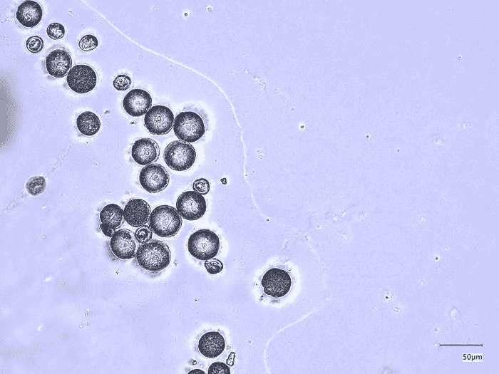

**图 1** — 数据集中的示例图像 – 覆盆子属。

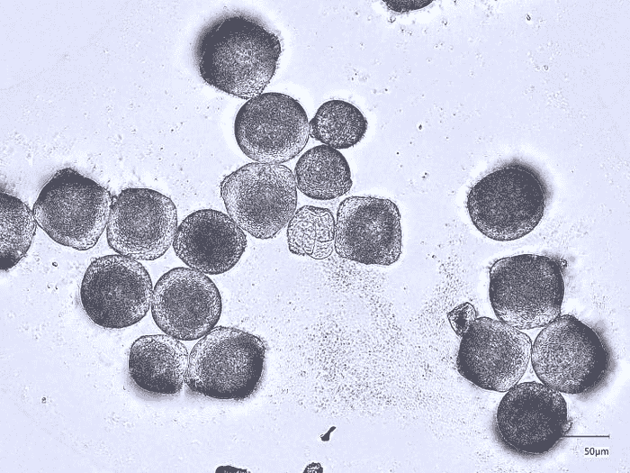

**图 2** — 数据集中的示例图像 — 车厘子属。

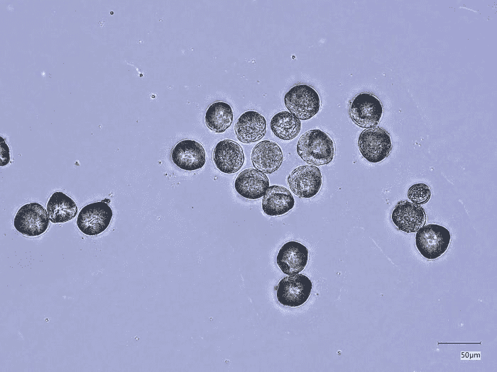

**图 3** — 数据集中的示例图像 — 黑加仑。

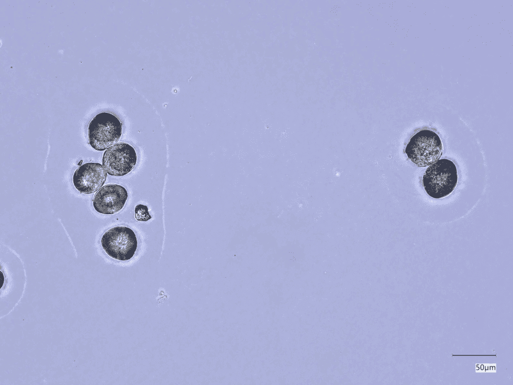

**图 4** — 数据集中的示例图像 — 草莓属。

整个数据集可以从相应的作者处合理请求获得。数据采集步骤包括样本准备和显微图像的拍摄，这些图像由国家园艺研究所应用生物学系的 Agnieszka Marasek-Ciołakowska 教授和 Aleksandra Machlańska 女士准备，我们对此非常感激。他们的努力对我们项目的成功至关重要。

## 3. 提取单个花粉图像

我们首先从数据集中的照片中提取单个花粉图像来训练各种模型以识别花粉。每张照片都包含多个花粉和其他生物形态以及污染，这使得识别花粉种类变得更加困难。我们使用了 YOLOv12 模型，这是一个由 Ultralytics 开发的尖端关注实时目标检测模型。

### 3.1 微调 YOLOv12

多亏了 YOLOv12 的创新性，它甚至可以在很小的数据集上进行训练。我们亲身体验了这种现象。为了准备我们自己的数据集，我们使用 [CVAT](https://www.cvat.ai/) 在数据集的四个类别中的每十个图像上手动标注了花粉的位置，后来将这些标签导出为与单个图像对应的 .txt 文件。然后，我们将数据组织成 YOLOv12 适当的格式：我们将数据分为训练集（每类 7 个图像-标签对，总计 28 个）和验证集（每类 3 个图像-标签对，总计 12 个）。我们添加了一个指向数据集的 .yaml 文件。可以注意到，数据集实际上非常小。预测模式下检测到的单个花粉图像及其置信度叠加的图像表示为图 5。我们还从 [YOLOv12 网站](https://docs.ultralytics.com/models/yolo12/) 下载了模型（YOLO12s）。然后我们开始了训练。

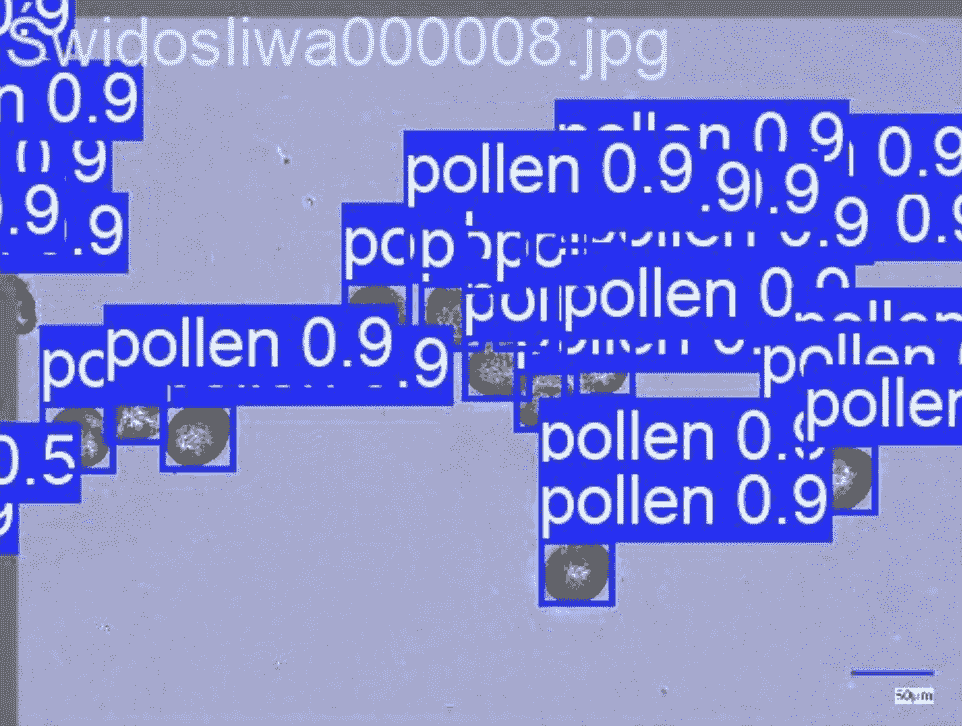

**图 5** — 模型对数据集中示例图像的输出。

该模型被证明能够以非常高的精度检测花粉，但还有一件事需要考虑：模型的置信度。对于每个检测到的花粉，模型还输出了一个值，表示其预测的特定程度。我们必须决定是否使用较低的置信度阈值（更多图像，但存在更多图像损坏或非花粉照片的风险）或较高的阈值（较少图像，但非花粉的可能性较低）。我们最终决定尝试两个阈值，0.8 和 0.9，以评估在训练分类模型时哪一个会更好。

### 3.2 导出单个花粉数据集

为了做到这一点，我们在数据集中所有特定类别的图像上启动了模型的预测。这效果非常好，但在导出后，我们遇到了另一个问题——即使在更高的阈值下，一些照片也被裁剪了。因此，在我们导出单个花粉之前，我们增加了一个步骤：我们消除了具有不成比例的宽高比的图像（见图 6）。具体来说，0.8 是将较小的一边除以较大的一边。

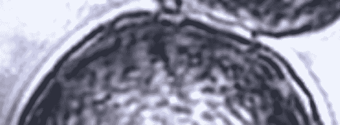

**图 6** – 一个严重裁剪的图像示例。数据集中的此类图像会负面影响分类模型的性能。

然后，我们将所有图像调整大小为 224×224，这是深度学习模型输入图像的标准尺寸。

### 3.3 单个花粉数据集——简要分析

我们最终得到了两个数据集，一个是以 0.8 置信度阈值创建的，另一个是以 0.9 置信度阈值创建的：

+   **0.8 阈值：**

    +   越橘 — 7788 张图像

    +   越橘莓 — 3582 张图像

    +   黑加仑 — 4637 张图像

    +   柳叶菜 — 4140 张图像

**总计 — 20147 张图像**

+   **0.9 阈值：**

    +   越橘 — 2301 张图像

    +   越橘莓 — 2912 张图像

    +   黑加仑 — 2438 张图像

    +   柳叶菜 — 1432 张图像

**总计 — 9083 张图像**

乍一看这些数字，我们可以看出 0.9 阈值数据集比 0.8 阈值数据集小**两倍多**。这两个数据集**都不平衡**——0.8 阈值的数据集由于越橘而造成，0.9 阈值的数据集由于柳叶菜而造成。

尽管我们遇到了一些困难，但 YOLOv12 仍然是一个有效的工具，可以将我们的图像分割成两个单花粉图像数据集。新创建的数据集可能不平衡，但它们的大小应该可以弥补这一缺点，主要是因为每个类别都有广泛的代表性。它们在未来的分类模型训练中具有很大的潜力，但我们自己将不得不看看结果。

## 4. 单个花粉图像的分类

### 4.1 模型评分指标概述

为了正确地训练模型，无论是基于统计特征的经典模型，还是更复杂的卷积神经网络或视觉转换器等方法，都必须设计出衡量性能的指标。多年来，已经设计了多种方法来完成这些任务——从统计指标如 F1、精确度或召回率，到更直观的指标如 GradCAM，这些指标可以更深入地了解模型的内部工作原理。本文探讨了我们的模型使用的评分方法，而没有涉及不必要的细节。

#### 召回率

召回率被描述为某一类准确猜测与该类总猜测的比率（见公式 1）。它衡量标记为某一类的图像中有多少百分比属于该类。在单独处理类别的情况下，它在平衡和不平衡的数据集中都很有用。

**公式 1**— 召回率的公式。

#### 精确度

与召回率不同，精确率是所有属于该类别的项目中被正确标记的项目百分比（见公式 2）。它衡量一个类别中被正确猜测的项目百分比。这个指标与召回率的表现相似。

**公式 2** — 精确率的公式。

#### F1 分数

F1 分数是精确率和召回率的调和平均值（见公式 3）。它有助于将精确率和召回率结合成一个简洁的度量。因此，即使在数据不平衡的数据集中，它仍然表现出色。

**公式 3** — F1 的公式。

#### 混淆矩阵

混淆矩阵是一种视觉度量，用于比较对某一类别的猜测数量与该类别中实际图像数量的比较。它有助于说明模型在特定课程上可能遇到的错误（见图 7）。

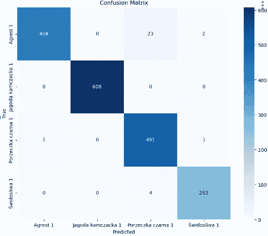

**图 7** — 混淆矩阵的一个示例。

#### GradCAM

GradCAM 是一种衡量 CNN 性能的度量，它可视化图像的哪些区域影响了预测。为此，该方法计算从 1 个卷积层来的梯度，并确定一个激活图，该图在图像上可视地叠加。它极大地有助于理解和解释模型将特定图像标记为特定类别的“原因”（见图 8 中的示例）。

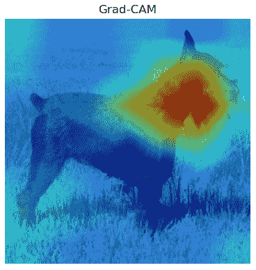

**图 8** — 一个 GradCAM 的示例，展示了一只狗的图像。

这些指标只是机器学习中使用的众多测量和可视化方法中的一小部分。然而，它们已经证明足以衡量模型的性能。在未来的文章中，随着新分类器的使用和项目中的引入，将相应地提出这些指标。

### 4.2 使用标准模型进行单个花粉分类

在我们对图像进行预处理后，我们可以进入下一阶段：将单个花粉分类到物种。我们尝试了三种方法——基于从图像中提取的特征的标准分类器、卷积神经网络和视觉 Transformer。本文概述了我们在标准模型上的工作，包括 kNN 分类器、SVMs、MLPs 和随机森林。

#### 特征提取

为了让我们的分类器工作，我们首先必须获得它们可以基于其进行预测的特征。我们选择了两种主要类型的特征。一种是基于特定颜色（来自 RGB 模型）像素存在与否的统计度量，例如特定图像的均值、标准差、中位数、分位数、偏度和峰度——我们为每个颜色层提取了它们。另一种是 GLCM（灰度级共生矩阵）特征：对比度、差异度、同质性、能量和相关性。这些是从灰度转换图像中获得的，我们在不同的角度提取了每个特征。每张图像都有 21 个统计特征和 20 个基于 GLCM 的特征，总计每张图像 41 个特征。

#### k-Nearest-Neighbors (kNN)

kNN 是一种分类器，它使用数据的空间表示来通过检测特征点的 k 个最近邻来预测其标签。这种分类器速度快，但其他方法的表现优于它。

**kNN 度量: **

**0.8 数据集:**

F1: 0.6454

精确率: 0.6734

召回率: 0.6441

**0.9 数据集:**

F1: 0.6961

精确率: 0.7197

召回率: 0.7151

#### 支持向量机（SVM）

与 kNN 类似，SVM 将数据表示为多维空间中的点。然而，它不是寻找最近邻，而是通过超平面算法性地分离数据。这比 kNN 的结果更好，但引入了随机性，并且仍然被其他解决方案超越。

**SVM 度量:**

**0.8 数据集:**

F1: 0.6952

精确率: 0.7601

召回率: 0.7025

**0.9 数据集:**

F1: 0.8556

精确率: 0.8687

召回率: 0.8597

#### 多层感知器（MLP）

多层感知器（Multi-Layered Perceptron）是一种受人类大脑及其神经元启发的模型。它通过具有各自权重的神经元层网络传递输入，这些权重在训练过程中会发生变化。当优化良好时，这种模型有时可以实现对标准分类器的大幅提升。然而，花粉识别并不是其中之一——与其他解决方案相比，它的表现不佳，并且不一致。

**MLP 度量:**

**0.8 数据集:**

F1: 0.8131

精确率: 0.8171

召回率: 0.8173

**0.9 数据集:**

F1: 0.7841

精确率: 0.8095

召回率: 0.7940

#### 随机森林

随机森林（random forest）是一种以其可解释性而闻名的模型——它基于决策树，根据阈值对数据进行分类，而人类比分析神经网络中的权重更容易分析。随机森林表现相当好且一致——我们发现 200 棵树是最佳选择。然而，它仍然被更复杂的分类器超越。

**RF 度量:**

**0.8 数据集:**

F1: 0.8211

精确率: 0.8210

召回率: 0.8233

**0.9 数据集:**

F1: 0.8150

精确率: 0.8202

召回率: 0.8216

传统的模型表现出不同的性能水平——一些表现不如预期，而另一些则提供了相当好的指标。然而，这还不是终点。我们仍然有先进的深度学习模型要尝试，例如卷积神经网络和视觉 Transformer。我们预计它们将表现出显著更好的性能。

### 4.3 使用卷积神经网络进行单个花粉分类

在单个花粉分类中，传统的模型如 MLPs、随机森林或 SVMs 得到了中等到相当好的结果。然而，我们决定尝试的下一个方法是卷积神经网络（CNNs）。它们是通过处理图像来生成特征的模型，并且以其有效性而闻名。

我们没有从头开始训练 CNNs，而是使用了迁移学习技术——我们使用了预训练的模型，特别是 ResNet50 和 ResNet152，并将它们微调到我们的数据集上。这种方法使训练显著更快，资源需求更低。它还由于模型已经在大型数据集上进行了专业训练，因此允许进行更有效的分类。在训练之前，我们还必须对图像进行归一化。

在指标方面，我们使用了 Grad-CAM，这是一种试图突出显示影响模型预测最多的图像区域的算法，除了标准指标如 F1 分数、精确度和召回率之外。我们还包含了混淆矩阵，以查看我们的 CNNs 是否在特定类别上遇到困难。

#### ResNet50

ResNet50 是由微软亚洲研究院于 2015 年开发的一种 CNN 架构，这是创建更深、更高效神经网络的重要一步。它是一个残差网络（因此得名 ResNet），使用跳过连接来允许直接数据流。这反过来又减轻了梯度消失问题。

我们原本预期这个模型的性能会比 ResNet152 差。然而，我们的预期很快就被颠覆了，因为该模型在两个数据集上对 ResNet152 的预测水平相同，如以下列出的指标和混淆矩阵（见图 9 和图 10）以及 Grad-Cam 可视化（见图 11）所示。

**ResNet50 指标：**

**0.8 数据集：**

F1 分数：0.98

精确度：0.98

召回率：0.98

**0.9 数据集：**

F1 分数：0.99

精确度：0.99

召回率：0.99

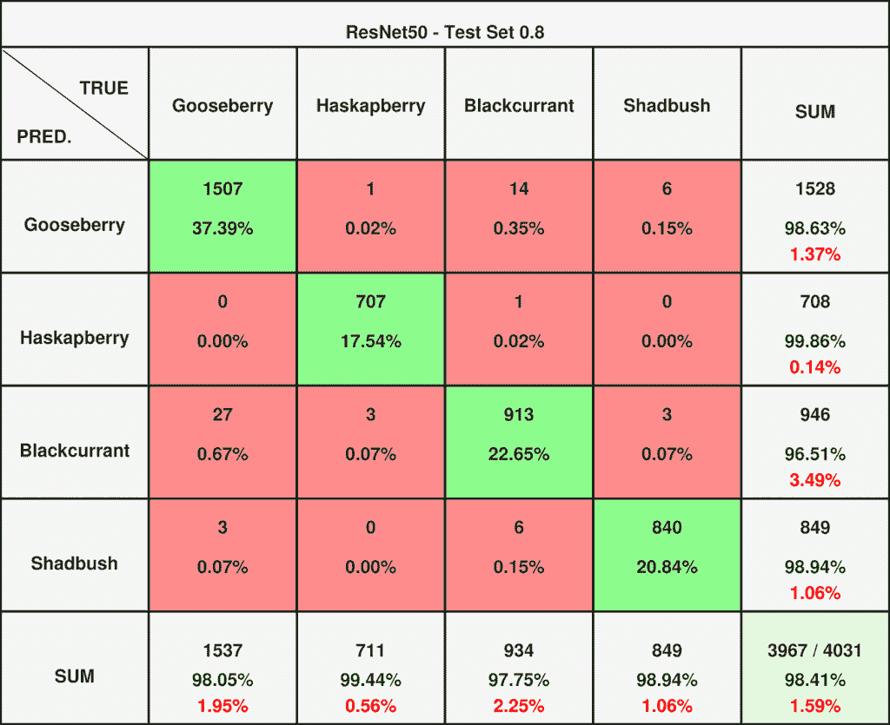

**图 9** — ResNet50 对 0.8 数据集的混淆矩阵。

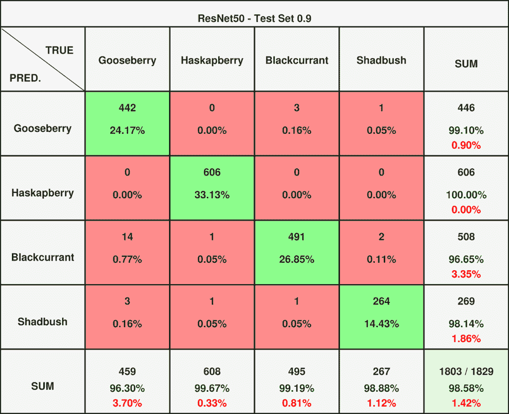

**图 10** — ResNet50 对 0.9 数据集的混淆矩阵。如图所示，在两个数据集中，将越橘误分类为黑加仑的问题可以忽略不计。

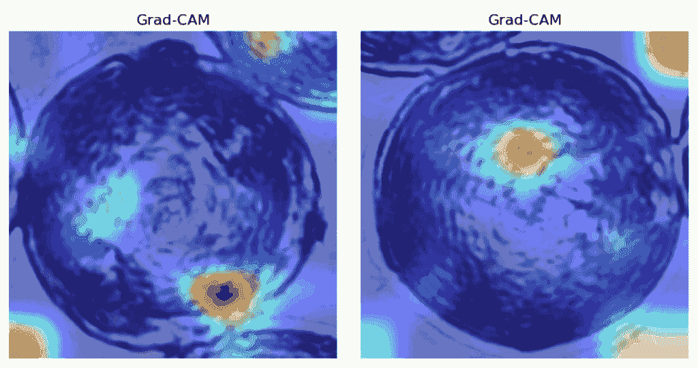

**图 11** — 分别从 0.8 和 0.9 数据集中随机选取的图像上 Grad-CAM 的结果。

关于 Grad-CAM，它并没有提供关于模型内部工作原理的任何有价值的见解——突出显示的区域包括背景和看似随机的位置。因为它实现了非常高的准确度，所以网络似乎注意到了人类眼睛无法检测到的模式。

#### ResNet152

此外，ResNet152 也是微软研究人员的成果，它是一个具有显著深度和深度学习能力远超 ResNet50 的残差网络和 CNN 架构。

因此，我们对这个模型的期望高于 ResNet50。我们失望地看到它的表现与它相当。它表现得非常出色（见图 12 和图 13 的混淆矩阵以及图 14 的 Grad-CAM 可视化）。

**ResNet152 指标：**

**0.8 数据集：**

F1：0.98

精确度：0.98

回忆：0.98

**0.9 数据集：**

F1：0.99

精确度：0.99

回忆：0.99

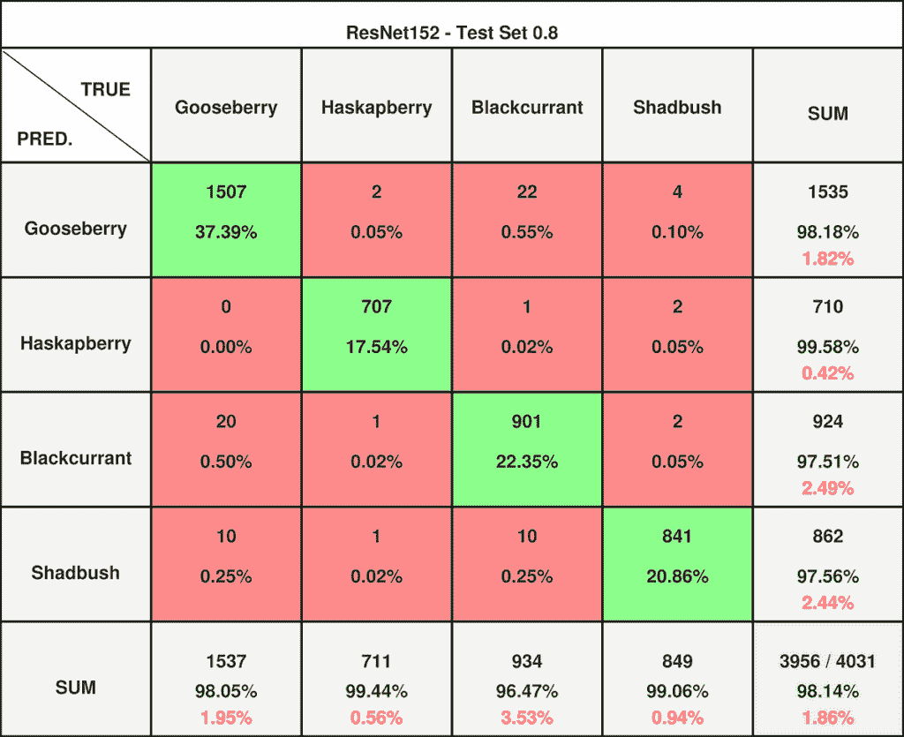

**图 12** — ResNet50 对 0.8 数据集的混淆矩阵。

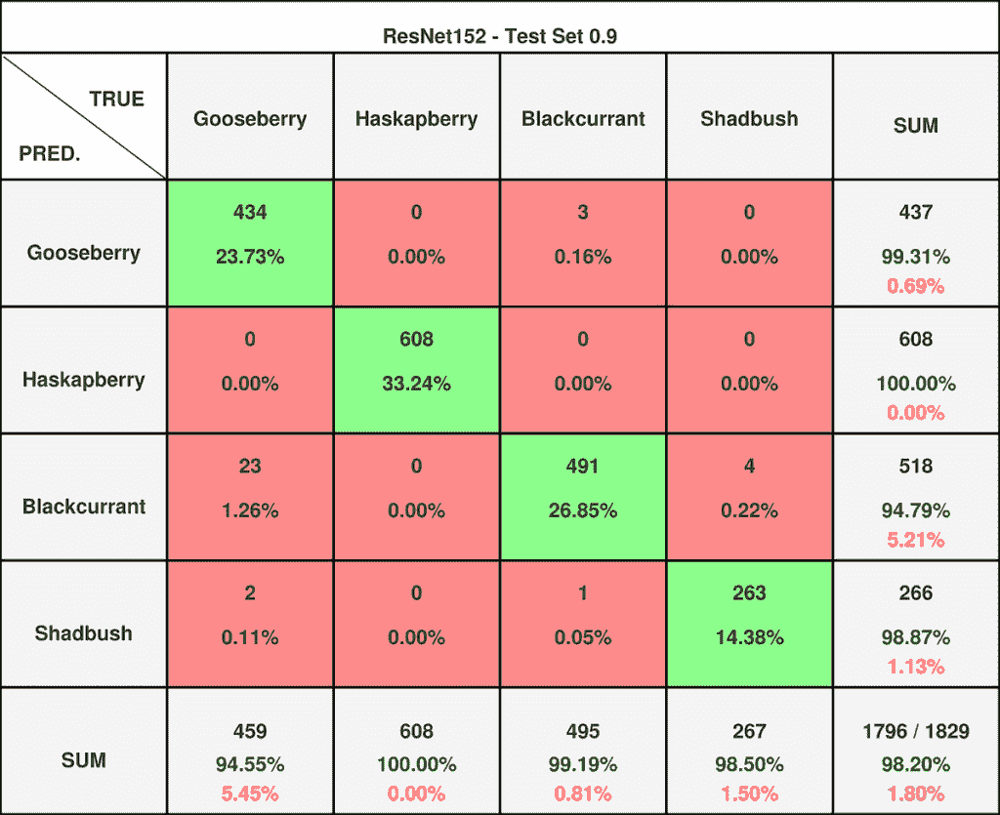

**图 13** — ResNet50 对 0.8 数据集的混淆矩阵。ResNet152 在 0.8 数据集上对多个类别存在一些问题，但在 0.9 数据集上，它只与 ResNet50 存在相同的问题。

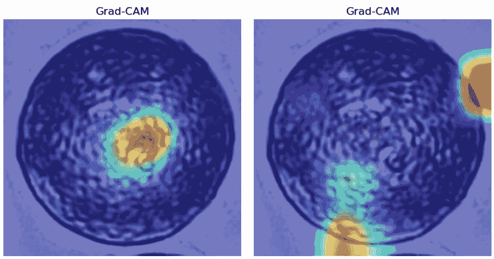

**图 14** — 分别来自 0.8 和 0.9 数据集的随机图像的 Grad-CAM 结果。

Grad-CAM 对 ResNet152 也没有帮助——我们体验到了深度学习模型的神秘本质，这些模型虽然准确度高，但难以轻易解释。

我们很惊讶，更复杂的 ResNet152 在 0.9 数据集上并没有优于 ResNet50。它们都达到了我们迄今为止尝试过的任何模型中最高的指标——它们超越了经典模型，最佳经典模型与 CNN 之间的差距超过了 10 个百分点。是时候测试最具创新性的模型——视觉 Transformer 了。

### 4.4 使用视觉 Transformer 进行单个花粉分类

对于单个花粉分类，我们尝试了简单的模型，这些模型提供了不同层次的表现，从不足到满意。然后，我们实现了卷积神经网络，这完全超越了它们的性能。现在是我们尝试创新模型——视觉 Transformer 的时候了。

通常来说，Transformer 起源于谷歌研究人员在 2017 年发表的著名论文“Attention Is All You Need”，但它们最初主要用于自然语言处理。2020 年，Transformer 架构被应用于计算机视觉，产生了 ViT——视觉 Transformer。其卓越的性能标志着卷积神经网络在该领域统治地位的终结。

我们在这里的方法与我们训练 CNNs 时使用的方法相似。我们导入了一个预训练模型：vit-base-patch16–224-in21k，这是一个在 ImageNet-21k 上训练的模型。然后，我们对数据集图像进行了归一化，微调了它们，并记录了指标和混淆矩阵的结果（见图 15 和图 16）。

**vit-base-patch16–224-in21k 结果：**

**0.8 数据集：**

F1：0.98

精确度：0.98

召回率：0.98

**0.9 数据集：**

F1：1.00

精确度：1.00

召回率：1.00

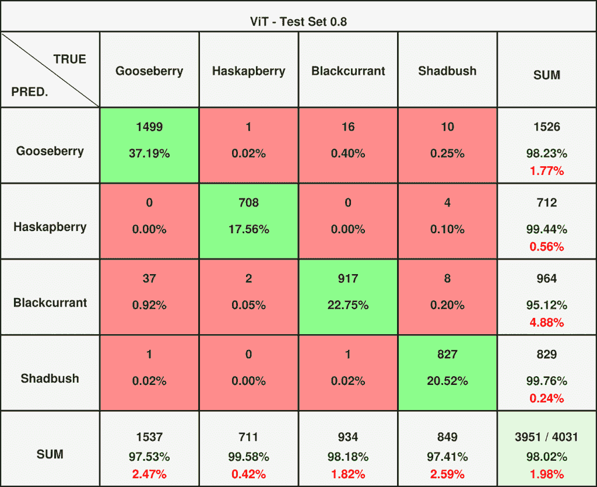

**图 15** — ViT 在 0.8 数据集上的混淆矩阵。

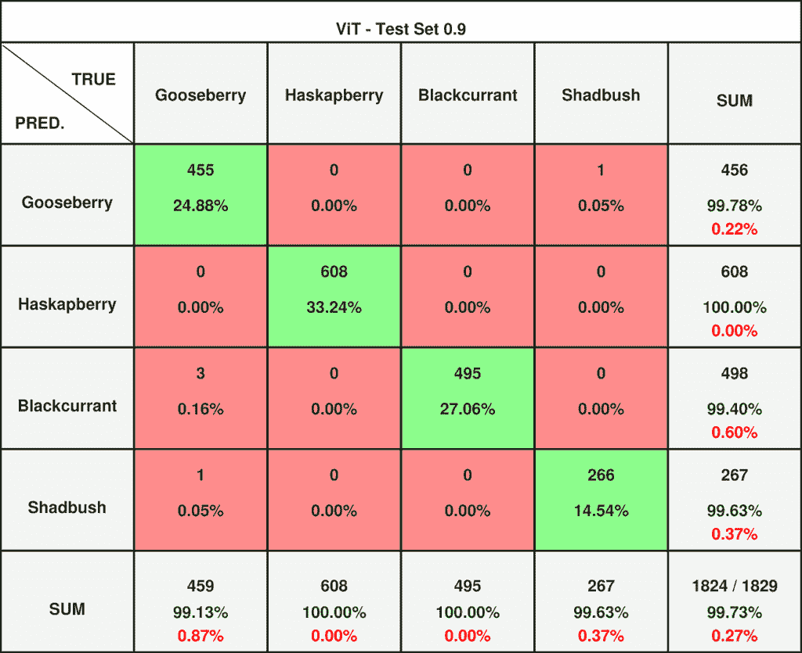

**图 16** — ViT 在 0.9 数据集上的混淆矩阵。

在 0.8 数据集中，视觉 Transformer 的表现并未超过残差网络，并且它面临着类似的问题——错误地将越橘分类为黑加仑。然而，在 0.9 数据集中，它取得了几乎完美的分数。我们见证了创新战胜了更过时的解决方案，这促使我们保存该模型，并将其指定为我们对更具挑战性任务的模型选择。

### 4.5 各种模型指标的比较

对于我们的花粉分类任务，我们使用了多种模型：包括 kNN、SVM、MLP 和随机森林的传统模型；卷积神经网络（ResNet50 和 ResNet152），以及一个视觉 Transformer（vit-base-patch16–224-in21k）。本文作为概述和性能排名（见表 1）。

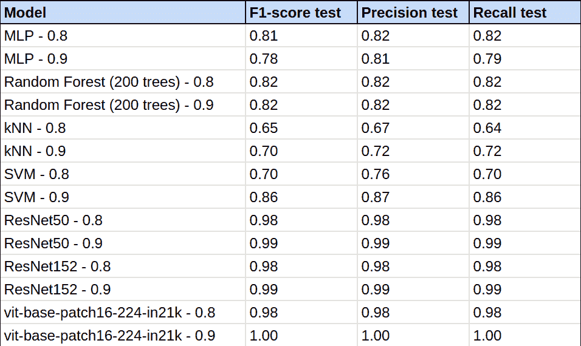

**表 1** — 我们尝试的所有模型的指标。

#### 排名

6\. kNN（k-最近邻）

最简单的分类器。不出所料，它训练得很快，但表现最差。

5\. MLP（多层感知器）

该模型的架构基于人类神经系统。MLP 的表现超过了其他标准模型，这是我们未曾预料到的。

4\. RF（随机森林）

随机森林分类器在所有模型中表现最一致，但其指标远非理想。

3\. SVM（支持向量机）

在典型分类器中意外成为赢家。其性能是随机的，但在 0.9 数据集上对标准分类器来说取得了良好的结果。

2\. ResNet50 和 ResNet152（残差网络）

两种架构都因其复杂性而实现了相同的高性能，远远超过了任何标准分类器在这两个数据集上的能力。

1\. ViT（视觉 Transformer）

我们尝试的最创新解决方案超越了经典模型，并在 0.8 数据集上与残差网络并驾齐驱。然而，真正的挑战在于 0.9 数据集，其中 CNNs 达到了难以逾越的准确率 0.99。令人惊讶的是，视觉 Transformer 的结果如此之高，以至于四舍五入到了 1.00——一个完美的分数。其结果是对创新力量的真正证明。

注意：分类报告四舍五入了模型的指标——它们并不完全等于 1，因为那样意味着所有图像无一例外都被正确分类。我们选择了这个值，因为只有极少数五张图像（0.27%）被错误分类。

通过比较视觉花粉识别领域的不同分类器，我们能够亲身经历机器学习的历史和演变。我们从最简单的分类器开始，到基于注意力的视觉 Transformer，测试了不同程度的创新模型，并注意到它们的结果随着新意度的增加而提高。基于这次比较，我们一致选举 ViT 作为我们处理花粉的模型选择。

## 5. 结论

视觉分类花粉的任务，一直让世界各地的生物学家感到困惑，也超出了人类的能力范围，现在终于因为机器学习的力量而成为可能。我们出版物中提出的所有模型都显示出分类花粉的潜力，准确度各异。一些模型，如 CNN 或视觉 Transformer，已经达到了近乎完美的程度，能够以人类无法比拟的精确度识别花粉。

为了更好地理解这一成就为何如此令人印象深刻，我们在图 17 中进行了说明。

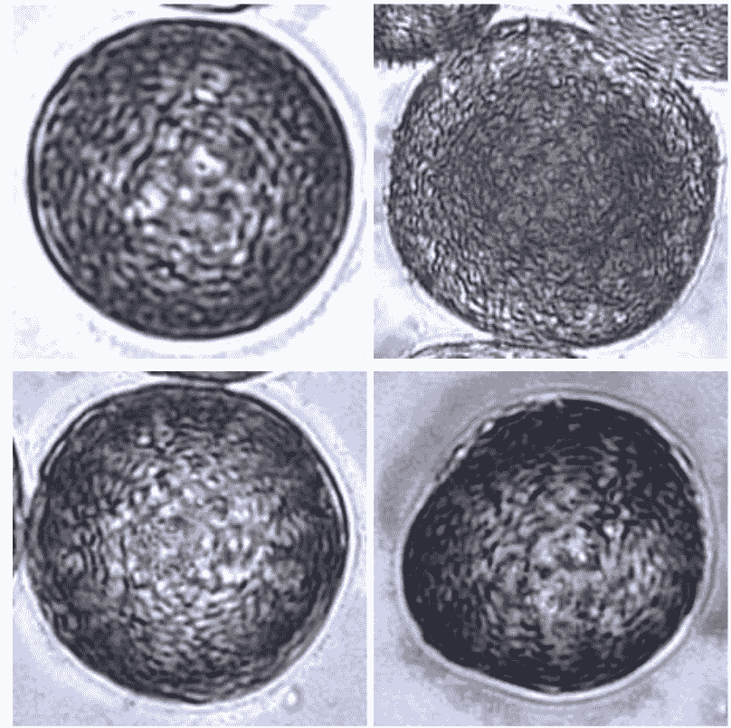

**图 17** — 不同类别的花粉的示例图像，展示了我们在文章中面临的任务的复杂性。

很可能大多数读者无法正确地将这些图像分类到之前提到的四个类别中。另一方面，我们的模型已经证明几乎完美地识别了它们，达到了超过 99%的顶级 F1 分数。

一个人可能会想知道这样的分类器能用来做什么，或者为什么一开始就要训练它。这种方法的用途众多，从追踪植物种群到测量局部范围内的空气过敏原水平。我们构建模型不仅是为了为花粉学家提供一个分类他们可能收集到的花粉的工具，也是为了提供一个研究平台，让其他机器学习爱好者在此基础上进行构建，并展示这一领域的不断扩展的应用。

就此而言，这是本出版物的结束。我们真诚地希望读者能在他们的研究工作中找到这些有用的信息，并且我们的文章能够激发使用这项技术的项目灵感。

## 6. 致谢

我们非常感谢波兰国家园艺研究所的 Agnieszka Marasek-Ciołakowska 教授，她准备了样本，并使用 Keyence VHX-5000 显微镜拍摄了它们的显微图像。作者拥有本研究所使用数据集的完整、非限制性版权以及本文中使用的所有图像的版权。
