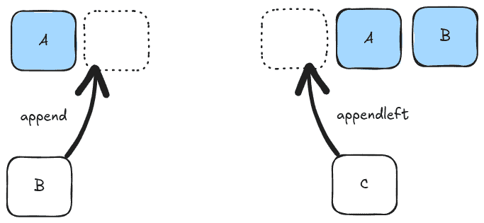
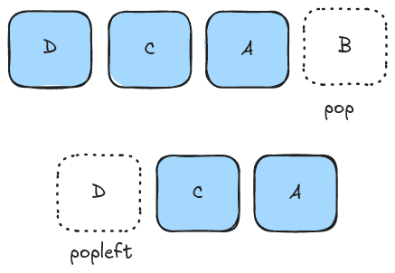
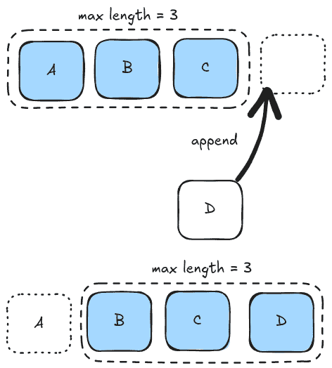
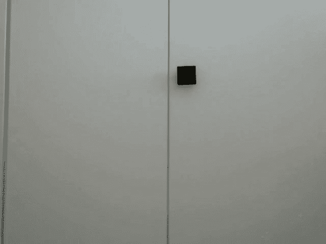
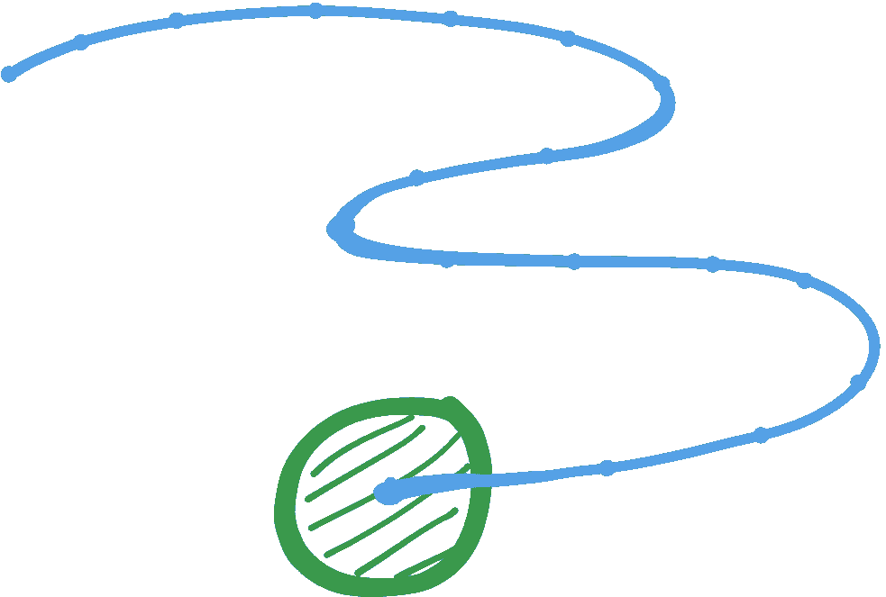
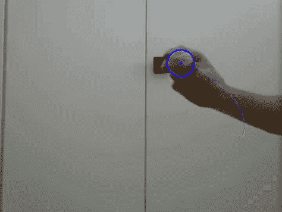
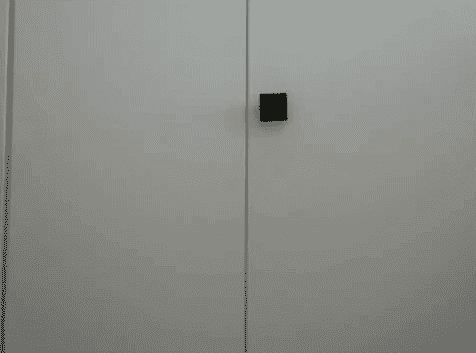

# 在 Python 中可视化数据流

> 原文：[`towardsdatascience.com/visualize-data-streams-in-python-b3c91a2d4d7c/`](https://towardsdatascience.com/visualize-data-streams-in-python-b3c91a2d4d7c/)


Python 在其标准库中提供了许多有用的功能。隐藏在 **collections** 库中，有一个不太为人所知的数据结构，即 **deque** [1] ****（显然发音为 _dec_k）。让我来展示它是什么，它是如何工作的，以及为什么它是一个从流中绘制连续数据的完美数据结构！

## 基础知识

**Deque** 是从 collections 模块导入的数据类型，代表双端队列。本质上它是一个两端都有端点的列表，因此您可以轻松地从头部或尾部添加/移除。



向双端队列的任一端添加元素

要使用它，我们为队列声明一个变量。由于队列有两个端点，我们可以使用 **append**（用于添加到尾部）或 **appendleft**（用于添加到列表的起始处）轻松地向两端添加。

```py
from collections import deque

my_queue = deque()

my_queue.append("a")
my_queue.append("b")

my_queue.appendleft("c")
my_queue.appendleft("d")

print(my_queue) # deque(['d', 'c', 'a', 'b'])
```

您也可以使用 **pop**（用于右侧）或 **popleft**（用于从开始处移除元素）从队列的两端弹出。



从 deque 中移除元素

```py
my_queue.pop()
print(my_queue) # deque(['d', 'c', 'a'])

my_queue.popleft()
print(my_queue) # deque(['c', 'a'])
```

### 有限长度缓冲区

**deque** 的真正威力在于当我们限制队列长度时才显现出来。在构造函数中，我们可以可选地提供一个最大长度整数给队列，默认为 None，列表大小不受限制。有趣的部分在于当我们向列表的任一端添加元素时，列表已满的行为。列表将所有项从插入端移开，并弹出队列另一端的最后一个项。



向有限长度的 deque 中添加元素

因此，如果我们向右侧添加，所有元素将向左移动一个索引，左侧的第一个元素将被丢弃。在下面的例子中，我们以 "a,b,c" 的顺序在一个长度为三的 **deque** 中开始，所以此时它是满的。如果我们使用 **append** 在末尾添加另一个元素 "d"，第一个元素 "a" 将被移除以保持列表的最大长度为 3。

```py
my_queue = deque(maxlen=3)

my_queue.append("a")
my_queue.append("b")
my_queue.append("c")
print(my_queue) # deque(['a', 'b', 'c'], maxlen=3)

my_queue.append("d")
print(my_queue) # deque(['b', 'c', 'd'], maxlen=3)
```

相应地，如果我们向左侧添加，元素将向右移动，并且末尾的最后一个项将被弹出。所以如果我们向队列的左侧端添加一个 "a"，我们将推出最后一个元素，即 "d"，最终队列中的序列又回到了 "a,b,c"。

```py
... # deque(['b', 'c', 'd'], maxlen=3)

my_queue.appendleft("a")
print(my_queue) # deque(['a', 'b', 'c'], maxlen=3)
```

## 绘制数据流

现在让我们通过一个实际例子来看一下如何使用 **deque** 数据结构进行数据可视化。我将使用我的网络摄像头流，我们想要跟踪屏幕上绿色球的位置。



原始输入视频

由于只要我们保持打开网络摄像头视频输入，输入就是一个无限长的流，我们不能简单地继续将跟踪位置添加到列表中，因为这会使列表持续增长。相反，目标是显示具有有限历史点的轨迹尾迹，如下面的草图所示。



期望轨迹尾迹的草图

这个项目的设置是从一个早期项目借用的，你可以在文末找到完整的源代码。重要的是我们创建了一个**deque**变量来跟踪位置，其长度有限。

```py
tracked_pos = deque(maxlen=20)

...

x, y, w, h = cv2.boundingRect(largest_contour)
center = (x + w // 2, y + h // 2)
tracked_pos.append(center)
```

实际上这就是我们需要的，队列将只保留最后 20 个点。当列表已满时添加新点，最旧的点将被弹出。这样，我们可以实现蛇形尾迹效果。为了绘制轨迹，我们只需遍历成对

```py
for i in range(1, len(tracked_pos)):
    cv2.line(
        frame_annotated,
        pt1=tracked_pos[i - 1],
        pt2=tracked_pos[i],
        color=(255, 0, 0),
        thickness=1,
    )
```



带动画尾迹的球跟踪

我们也可以使用**itertools**库中的**pairwise** [2]函数以更**pythonic**的方式编写这个循环（不需要导入）。然而，为了对第二个点的可迭代进行数组切片以偏移，我们需要将**deque**转换为列表，否则我们会得到一个错误。

```py
# tracked_pos[1:] -> this throws an error!
# TypeError: sequence index must be integer, not 'slice'
# -> array slicing does NOT work on dequeus

# to slice, need to convert to list first
tracked_pos_list = list(tracked_pos)
for p1, p2 in zip(tracked_pos_list, tracked_pos_list[1:]):
    cv2.line(frame_annotated, pt1=p1, pt2=p2, color=(255, 0, 0), thickness=1)
```

使用**itertools**库中的**pairwise** [2]函数进行迭代的更好方法是。这也是 Python 标准库的一部分，不需要任何额外的 pip 包。

```py
from itertools import pairwise

...

for p1, p2 in pairwise(tracked_pos):
    cv2.line(frame_annotated, pt1=p1, pt2=p2, color=(255, 0, 0), thickness=1)
```

输出仍然是相同的，但这是一种更干净的方式来编写与上面相同的功能。

### 彩虹尾迹

为了让我们的动画更加美观，我们可以使用彩虹色图来为轨迹的不同部分使用不同的颜色。通过枚举成对迭代，我们可以为轨迹中的每个元素获取一个索引。然后通过将这个索引除以列表的长度，我们可以得到一个范围在[0, 1]的浮点数，其中 1 代表最新的元素，0 代表最旧的位置。现在我们只需要一个函数，它接受这个值并将其转换为颜色。

```py
def colormap_rainbow(value: float) -> tuple[int, int, int]:
    """Map a value between 0 and 1 to a color in the rainbow colormap."""
    # TODO: implement rainbow colors
    return (255, 255, 255)
...

traj_len = len(tracked_pos)
for i, (p1, p2) in enumerate(pairwise(tracked_pos)):
    color = color_map_rainbow(i / traj_len)
    cv2.line(frame_annotated, pt1=p1, pt2=p2, color=color, thickness=1)
```

对于将浮点数映射到颜色的函数，我们可以使用**OpenCV-Python**的内置色图，特别是彩虹色图**cv2.COLORMAP_RAINBOW** [3]。


彩虹色图可视化

由于函数期望一个图像来应用色图，我们需要使用一些技巧来使其工作。我们创建一个 1×1 的单色通道图像，其中包含将浮点值重新缩放到[0, 255]范围内的**uint8**，因为这是**OpenCV**中图像的预期输入格式。

```py
pixel_img = np.array([[value * 255]], dtype=np.uint8) 
# shape: (1, 1)
```

接下来我们可以应用彩虹色图，这将再次返回一个 1×1 的图像，但包含 3 个颜色通道，包含彩虹色图中的相应 BGR 值。

```py
pixel_cmap_img = cv2.applyColorMap(pixel_img, cv2.COLORMAP_RAINBOW) 
# shape: (1, 1, 3)
```

要返回一个包含三个整数的元组，我们需要通过展平图像来移除其维度，然后将**numpy**数组转换为列表。

```py
def colormap_rainbow(value: float) -> tuple[int, int, int]:
    """Map a value between 0 and 1 to a color in the rainbow colormap."""

    pixel_img = np.array([[value * 255]], dtype=np.uint8) 
    # shape: (1, 1)

    pixel_cmap_img = cv2.applyColorMap(pixel_img, cv2.COLORMAP_RAINBOW) 
    # shape: (1, 1, 3)

    return pixel_cmap_img.flatten().tolist()
```

现在如果我们再次运行我们的程序，我们就可以看到我们的彩虹轨迹！



动画轨迹的彩虹色图例

## 结论

在这篇文章中，我向您介绍了 Python 中的内置数据类型**deque**，并展示了如何使用它来可视化连续数据，例如来自网络摄像头或实时监控摄像头的视频流。

本项目的完整源代码可在 GitHub 上的球跟踪仓库中找到，位于*[src/stream.py](https://github.com/trflorian/ball-tracking-live-plot/blob/main/src/stream.py)*文件中。请小心操作！

> [**GitHub – trflorian/ball-tracking-live-plot: 使用 OpenCV 和绘图跟踪球…**](https://github.com/trflorian/ball-tracking-live-plot)

* * *

> [1] [`docs.python.org/3/library/collections.html#collections.deque`](https://docs.python.org/3/library/collections.html#collections.deque). [2] [`docs.python.org/3/library/itertools.html#itertools.pairwise`](https://docs.python.org/3/library/itertools.html#itertools.pairwise) [3] [`docs.opencv.org/4.x/d3/d50/group_imgproc_colormap.html`](https://docs.opencv.org/4.x/d3/d50/group__imgproc__colormap.html#ga9a805d8262bcbe273f16be9ea2055a65)

* * *

*本帖中的所有可视化均由作者创建。*
