# 为文档理解微调 VLMs

> 原文：[`towardsdatascience.com/vllm-fine-tuning-for-document-understanding/`](https://towardsdatascience.com/vllm-fine-tuning-for-document-understanding/)

在本文中，我将讨论如何微调（mdspan datatext="el1746374215548" class="mdspan-comment">-tune）VLMs（视觉语言模型）如[Qwen 2.5 VL 7B](https://arxiv.org/abs/2502.13923)。我将向您介绍一个手写数字数据集，Qwen 2.5 VL 的基础版本难以处理这个数据集。然后我们将检查数据集，对其进行标注，并使用它来创建一个微调后的 Qwen 2.5 VL，专门用于提取手写文本。

## 概述

本文的主要目标是微调一个 VLM（视觉语言模型）在数据集上，这是当今世界一项重要的机器学习技术，语言模型正在改变数据科学家和机器学习工程师的工作方式和取得成就的方式。我将讨论以下主题：

+   动机和目标：为什么使用 VLMs 进行文本提取

+   VLMs 的优势

+   数据集

+   标注和微调

+   SFT 技术细节

+   结果和图表

注意：本文是作为在[Findable](https://www.findable.ai/)完成的工作的一部分而撰写的。我们从这个工作中没有获得任何经济利益。这项工作是为了突出现代视觉语言模型的技术能力，并将一个有价值的手写物候数据集数字化和共享，这可能会对气候研究产生重大影响。此外，本文的主题在[Data & Draft 活动](https://www.meetup.com/netlight-edge/events/306719173/)期间由[Netlight](https://www.netlight.com/)进行了介绍。

您可以查看用于本文的所有代码，[在我们的 GitHub 仓库中](https://github.com/findable-no/phenology-data/tree/main)，以及所有数据都在[HuggingFace](https://huggingface.co/datasets/findableai/phenology)上可用。如果您特别感兴趣的是从挪威提取的物候数据，包括与数据相对应的地理坐标，这些信息直接可在以下[Excel 表格](https://huggingface.co/datasets/findableai/phenology/blob/main/phenology_extracted_data_non_manual_verified.xlsx)中找到。

## 动机和目标

本文的目标是向您展示您如何微调一个像 Qwen 这样的 VLM，以在特定任务上实现优化性能。我们在这里正在处理的工作是从一系列图像中提取手写文本。本文中的工作基于挪威物候数据集，您可以在[这个 GitHub 仓库的 README 中了解更多信息](https://github.com/findable-no/phenology-data)。主要观点是这些图像中包含的信息非常有价值，例如，可以用于气候研究。对此主题也有明确的科学兴趣，例如，[关于分析植物开花长期变化的这篇文章](https://link.springer.com/article/10.1134/S1067413609020039)，或[东部宾夕法尼亚物候项目](https://lgnc.org/pdfdocs/phenologyBrochure.pdf)。

注意，提取的数据是本着良好的意愿提供的，我并不对数据的含义做出任何声明。本文的主要目标是向您展示如何提取这些数据，并为您提供提取的数据，以便用于科学研究。

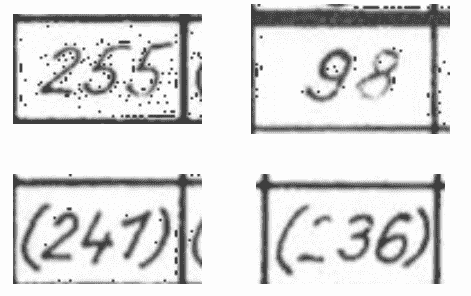

在这篇文章中，我们将使用 Qwen 2.5 VL 从这类图像中提取文本。这些单元格是从如图像中展示的表格中提取的，使用将在另一篇文章中介绍到的图像处理技术。图像由作者提供。

本文制作的模型可以用于从所有图像中提取文本。然后，这些数据可以转换为表格，您可以将信息绘制成如图像下所示的样子：


此图显示了从图像中提取的树线编号，绘制在挪威的地图上。较冷的六边形颜色代表较低的树线，正如预期的那样，越靠近海洋，越往北走，树线越低。较暖的颜色代表较高的树线，预计在我们深入国家内部时会出现。图像由作者提供，使用 [H3 by Uber](https://www.uber.com/en-NO/blog/h3/) 制作。

如果您只想查看本研究中提取的数据，您可以在[这个 parquet 文件](https://huggingface.co/datasets/findableai/phenology/blob/main/df_labels_and_images.parquet)中查看。

### 我们为什么需要使用 VLM

当查看这些图像时，你可能认为我们应该应用传统的 OCR 技术来解决这个问题。[OCR](https://aws.amazon.com/what-is/ocr/#:~:text=Optical%20Character%20Recognition%20(OCR)%20is,scan%20as%20an%20image%20file.) 是从图像中提取文本的科学，在过去的几年中，它一直由像 [Tesseract](https://github.com/tesseract-ocr/tesseract)、[DocTR](https://github.com/mindee/doctr) 和 [EasyOCR](https://github.com/mindee/doctr) 这样的引擎主导。

然而，这些模型通常被现代大型语言模型所超越，尤其是那些结合了视觉功能（通常称为 VLMs 或 VLLMs）的模型——下面的图像突出了为什么你想要使用 VLM 而不是传统的 OCR 引擎。第一列显示了我们的数据集中的示例图像，其他两列比较了 EasyOCR 和我们将在这篇文章中训练的微调 Qwen 模型。

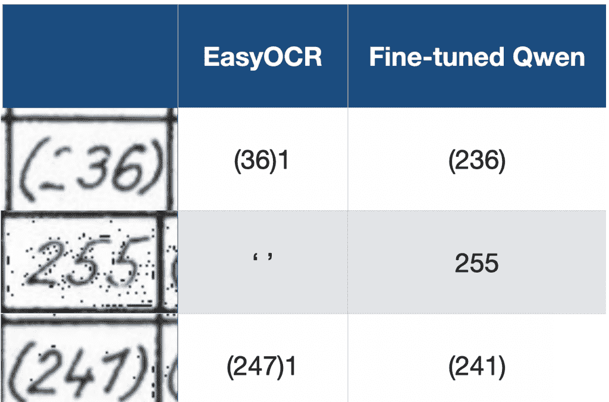

这张图突出了为什么你想要使用 VLMs（如 Qwen2.5 VL）而不是传统的 OCR 引擎（如 EasyOCR）。第一列显示了我们要从中提取文本的图像，其他两列显示了使用 EasyOCR 和微调的 Qwen 模型提取的文本。在第一张图像中，你可以注意到两个问题。首先，EasyOCR 没有检测到“2”，它被写得比较淡。其次，EasyOCR 还将单元格边界误认为是“1”，这是另一个关键的错误。在第二张图像中，你可以看到图像中有许多点（这是由于我们进行的图像处理的结果），这使得 EasyOCR 无法从图像中提取文本。在最后一张图像中，EasyOCR 将“1”误认为是“7”，并且再次犯了一个错误，认为单元格边界是数字“1”。

这突出了使用 VLM 而不是传统 OCR 引擎从图像中提取文本的主要原因：**VLMs 在从图像中提取文本时通常优于传统的 OCR 引擎**。

## VLMs 的优点

在从图像中提取文本时使用 VLMs（视觉语言模型）有几个优点。在上一个部分，你看到了 VLMs 的输出质量超过了传统 OCR（光学字符识别）引擎的输出质量。另一个优点是你可以向 VLMs 提供指令，说明你希望它们如何行动，而传统的 OCR 引擎无法提供这种功能。

因此，VLMs 的两个主要优点是：

1.  VLMs 在 OCR（尤其是手写 OCR）方面表现卓越

1.  你可以提供指令

VLMs 擅长 OCR，因为这是这些模型训练过程的一部分。例如，在[Qwen 2.5 VL 技术报告第 2.2.1 节预训练数据](https://arxiv.org/abs/2502.13923)中提到了这一点，其中他们将 OCR 数据集列为他们的预训练数据之一。

### 手写

过去提取手写文本一直非常困难，至今仍然是一个挑战。这是因为手写是非标准化的。

我所说的非标准化是指字符在每个人之间看起来会有很大的不同。例如，作为一个**标准化**字符的例子，如果你在电脑上写一个字符，它在不同的电脑和不同的人写的时候看起来会非常相似。例如，电脑字符“a”无论在哪个电脑上写，看起来都非常相似。这使得 OCR 引擎更容易识别字符，因为它从图像中提取的字符，很可能与它在训练集中遇到的字符非常相似。

然而，手写文本则相反。每个人的书写差异很大，这就是为什么有时你很难阅读别人的手写笔记。OCR 引擎也存在这个问题。如果字符差异很大，它在其训练集中遇到特定字符变化的可能性较低，因此从图像中提取正确的字符变得更加困难。

例如，你可以看看下面的图片。想象一下只看图片中的 1（所以遮住 7）。现在看这张图片，数字“1”看起来非常像数字“7”。当然，你能够区分这两个字符，因为你可以在上下文中看到它们，并且批判性地思考，如果一个 7 看起来像这样（有一条水平线），那么图片中的前两个字符必须是 1。

然而，传统的 OCR 引擎没有这种能力。它们不会查看整个图像，批判性地思考一个字符的外观，并据此确定其他字符。它们在查看孤立数字时，必须简单地猜测它是哪个字符。

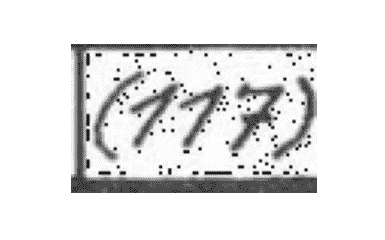

这是一张突出显示从 1 和 7 中区分挑战的图片。从相互关联的每个数字的上下文中看，你可以很容易地看出前两位数字是 1，而最后一位数字是 7。然而，如果你遮住最后一位数字，只看前两位数字，你会注意到这些数字完全可以被解释为 7。图片由作者提供

如何区分数字“1”和“7”，很好地与下一节关于在提取文本时向 VLMs 提供指令的内容相联系。

我还想补充说，一些 OCR 引擎，如[TrOCR](https://arxiv.org/abs/2109.10282)，是为了提取手写文本而设计的。然而，根据经验，这些模型在性能上无法与最先进的 VLMs（如 Qwen 2.5 VL）相提并论。

### 提供指令

使用 VLMs 提取文本的另一个显著优势是你可以向模型提供指令。这对于传统的 OCR 引擎来说是不可能的，因为它们会提取图像中的所有文本。它们只能输入一个图像，而不能为从图像中提取文本提供分离的文本指令。当我们想使用 Qwen 2.5 VL 提取文本时，我们提供一个系统提示，如下所示。

```py
SYSTEM_PROMPT = """
Below is an instruction that describes a task, write a response that appropriately completes the request.

You are an expert at reading handwritten table entries.  I will give you a snippet of a table and you will
read the text in the snippet and return the text as a string.

The texts can consist of the following:
1) A number only, the number can have from 1 to 3 digits.
2) A number surrounded by ordinary parenthesis.
3) A number surrounded by sqaure brackets.
5) The letter 'e', 's' or 'k'
6) The percent sign '%'
7) No text at all (blank image).

Instructions:

**General Rules**:
    - Return the text as a string.
    - If the snippet contains no text, return: "unknown".
    - In order to separate the digit 1 from the digit 7, know that the digit 7 always will have a horizontal stroke appearing in the middle of the digit.
      If there is no such horizontal stroke, the digit is a 1 even if it might look like a 7.
    - Beware that the text will often be surrounded by a black border, do not confuse this with the text.  In particular
      it is easy to confuse the digit 1 with parts of the border. Borders should be ignored.
    - Ignore anything OUTSIDE the border.
    - Do not use any code formatting, backticks, or markdown in your response. Just output the raw text.
    - Respond **ONLY** with the string. Do not provide explanations or reasoning.
"""
```

系统提示为 Qwen 提取文本的轮廓设定了框架，这使得 Qwen 在传统 OCR 引擎上具有重大优势。

主要有两个方面使其具有优势：

1.  我们可以告诉 Qwen 在图像中期望看到哪些字符

1.  我们可以告诉 Qwen 哪些字符看起来像什么（尤其是对于手写文本来说尤为重要）。

你可以在 1) -> 7)的要点中看到第一点的说明，我们告知它只能看到 1-3 位数字，它能看到的数字和字母，等等。这是一个显著的优势，因为 Qwen 知道，如果它检测到这个范围之外的字符，它很可能是误解了图像，或者是一个特定的挑战。它能更好地预测它认为图像中包含的字符。

第二点特别适用于我之前提到的问题，即区分“1”和“7”，它们看起来非常相似。幸运的是，这个数据集的作者在写 1 和 7 时是一致的。1 总是以对角线形式书写，7 总是包含水平线，这清楚地将“7”与“1”区分开来，至少从人类观察图像的角度来看是这样。

然而，只有真正理解你正在工作的数据集及其挑战，才能向模型提供如此详细的提示和规范。这就是为什么在处理像这样的机器学习问题时，你总是必须花时间手动检查数据。在下一节中，我将讨论我们正在工作的数据集。

## 数据集

> 手动检查数据可能是机器学习活动中价值与声望比最高的活动。
> 
> — Greg Brockman (@gdb) [2023 年 2 月 6 日](https://twitter.com/gdb/status/1622683988736479232?ref_src=twsrc%5Etfw)

我以 Greg Brockman（截至撰写本文时为 OpenAI 的总裁）的一句话开始本节，强调一个重要观点。在他的推文中，他提到了数据标注和检查并不是一项令人尊敬的工作，但无论如何，这是你在进行机器学习项目时可以花费时间的最重要的任务之一。

在[Findable](https://www.findable.ai/)，我最初是一名数据标注员，然后在我现在作为数据科学家工作之前，我管理了 Findable 的标注团队。标注工作强调了手动检查和理解你正在工作的数据的重要性，并教会了我如何有效地进行这项工作。Greg Brockman 提到这项工作并不令人尊敬，这通常是正确的，因为数据检查和标注可能是单调的。然而，在处理机器学习问题时，你应该始终花大量时间检查你的数据集。这些时间将为你提供洞察力，例如，你可以使用这些洞察力来提供我在上一节中强调的详细系统提示。

我们正在工作的数据集大约由 82000 张图像组成，例如你下面看到的那些。这些单元格的宽度从 81 到 93 像素不等，高度从 48 到 57 像素不等，这意味着我们正在处理非常小的图像。

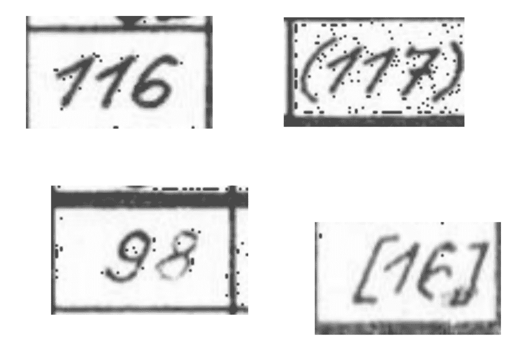

这些图像展示了数据集中存在的图像。图像由作者提供，

在开始这个项目时，我首先花时间查看不同的图像，以了解数据集中的变化。例如，我注意到：

1.  这些“1”看起来和“7”很相似

1.  一些图像中有些模糊的文本（例如，上图左下角的“8”和右下角的“6”）

1.  从人类的角度来看，所有图像都非常易于阅读，因此我们应该能够正确地提取所有文本

然后，我继续使用 Qwen 2.5 VL 7B 的基础版本预测一些图像，并查看模型在哪些方面有困难。不出所料，模型在区分“1”和“7”方面存在问题。

在这个过程中，首先手动检查数据，然后用模型进行一点预测以查看它在哪些方面有困难，我记录以下数据挑战：

1.  “1”和“7”看起来很相似

1.  一些图像背景上的点

1.  单元格边框可能会被误解为字符

1.  括号和方括号有时可能会混淆

1.  一些图像中的文本较淡

我们在微调模型以从图像中提取文本时必须解决这些挑战，我将在下一节中讨论。

## 标注和微调

在适当检查你的数据集后，是时候进行标注和微调了。标注是将标签设置到每张图像上的过程，微调是使用这些标签来提高模型的质量。

在进行标注时的**主要目标**是**高效地创建数据集**。这意味着快速产生大量标签并确保标签的质量很高。为了实现快速创建高质量数据集的目标，我将这个过程分为三个主要步骤：

1.  预测

1.  审查并纠正模型错误

1.  重新训练

应该注意的是，当你已经有了一个在执行任务方面相当出色的模型时，这个过程效果很好。在这个问题中，例如，Qwen 已经相当擅长从图像中提取文本，并且只在 5-10%的情况下出错。如果你为模型有一个全新的任务，这个过程可能不会那么有效。

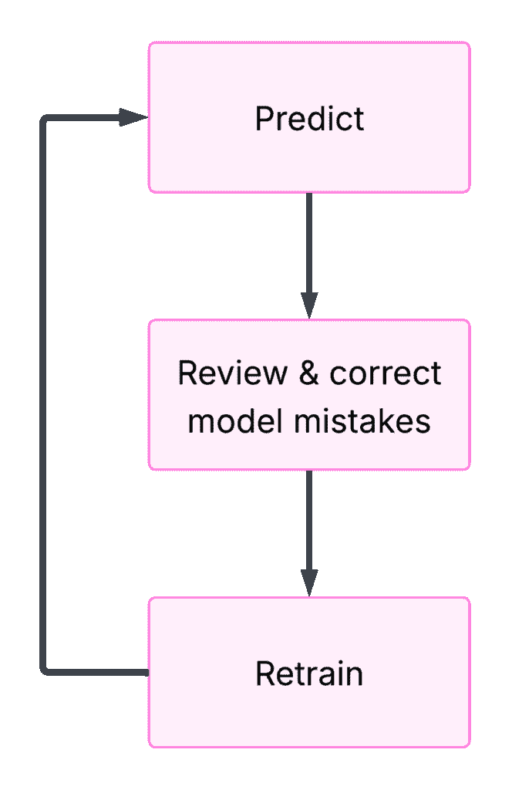

此图突出了我快速创建标注数据集和微调 Qwen 的三个步骤。第一步使用基础模型对几百个样本进行预测。然后我检查模型预测并纠正错误。之后，我在当前标注样本集上训练模型。继续进行，我使用这个微调模型对新的一组几百个样本进行预测，审查并纠正错误，然后重新训练。我继续这个过程，直到模型性能开始收敛。创建数据集的过程比例如查看每张图像并写下图像中的文本来创建标注数据集要快得多。图由作者提供。

#### 第一步：预测

第一步是从几百张图像中预测（提取文本）使用基础模型。你预测的图像数量并不真的重要，但你应该尝试在收集足够的标签以便训练运行足够改进模型（第 3 步）和考虑到训练模型所需的额外开销之间取得平衡。

#### 第 2 步：回顾与纠正模型错误

在对几百个样本进行预测之后，是时候回顾和纠正模型的错误了。你应该设置你的环境以便轻松显示图像和标签并修复错误。在下面的图像中，你可以看到我用于回顾和纠正错误的设置。在左侧，我有一个 Jupyter 笔记本，我可以运行单元格来显示以下五个样本及其对应的标签行。在右侧，所有我的标签都列在相应的行上。为了回顾和纠正错误，我运行 Jupyter 笔记本的单元格，确保右侧的标签与左侧的图像匹配，然后重新运行单元格以获取以下五个图像。我重复这个过程，直到我检查完所有样本。

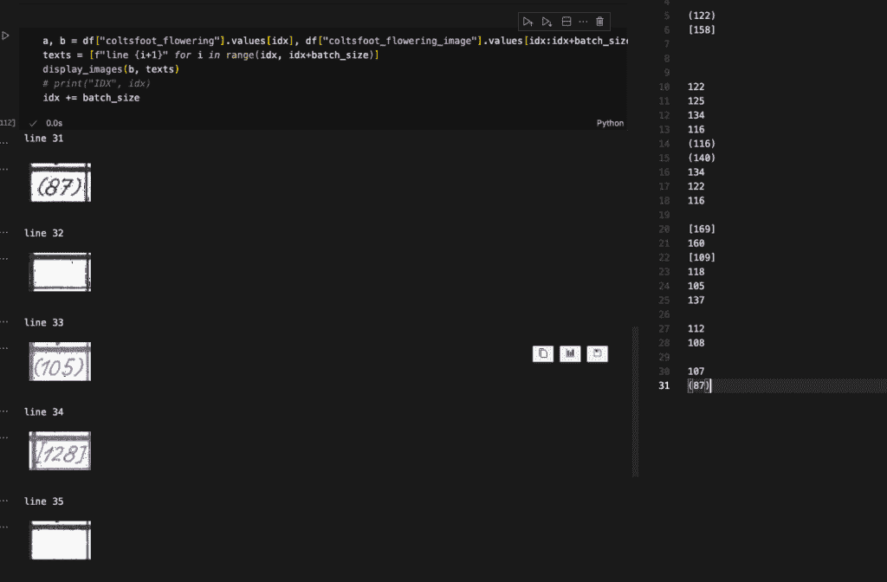

这张图像显示了我用于回顾和纠正模型错误的设置。在左侧，我有一个 Jupyter 笔记本，我可以运行单元格来显示接下来的五个图像，以及每个图像的标签行。在右侧，我所有的标签都列在相应的行上。这个环境使得查看所有模型预测并纠正任何错误变得容易。图由作者提供。

#### 第 3 步：重新训练：

现在你已经收集了几百个正确的样本，是时候训练模型了。在我的情况下，我使用 Qwen 2.5 VL 7B 并调整它以适应我当前的标签集。我使用 Unsloth 包进行微调，该包提供了这个关于微调 Qwen 的笔记本（笔记本是为 Qwen 2 VL 准备的，但所有代码都是相同的，除了命名更改，如下面的代码所示）。你可以查看下一节以了解更多关于微调过程的信息。

训练创建了一个微调后的模型版本，然后我回到第 1 步，对几百个新的样本进行预测。我重复预测、纠正和训练的循环，直到我注意到模型性能收敛。

```py
# this is the original code in the notebook
model, tokenizer = FastVisionModel.from_pretrained(
    "unsloth/Qwen2-VL-7B-Instruct",
    load_in_4bit = False, # this is originally set to True, but if you have the processing power, I recommend setting it to False
    use_gradient_checkpointing = "unsloth", 
)

# to train Qwen 2.5 VL (instead of Qwen 2 VL), make sure you use this instead:
model, tokenizer = FastVisionModel.from_pretrained(
    "unsloth/Qwen2.5-VL-7B-Instruct",
    load_in_4bit = False, 
    use_gradient_checkpointing = "unsloth", 
)
```

为了确定我的模型表现如何，我还创建了一个测试集，用于测试每个微调后的模型。我从不在这个测试集上训练，以确保结果的无偏性。这个测试集是我确定模型性能是否收敛的方法。

## SFT 技术细节

SFT 代表监督微调，这是更新模型权重以在提供的数据集上表现更好的过程。我们正在解决的问题是相当有趣的，因为基础 Qwen 2.5 VL 模型在 OCR 方面已经相当出色。这与我们在 Findable 应用 VLM 的许多其他任务不同，我们通常教 VLM 一个完全新的任务，它实际上没有任何先验经验。

当在新的任务上微调 VLM，如 Qwen，模型性能一旦开始训练就会迅速提高。然而，我们正在解决的任务相当不同，因为我们只想推动 Qwen 在读取特定图像的手写方面变得更好一点。正如我提到的，模型在这个数据集上的性能大约是 90-95%（取决于我们测试的具体图像），准确。

这种仅对模型进行微调的要求使得模型对调整过程参数非常敏感。为了确保我们正确地推动模型，我们采取以下措施

+   设置一个**低学习率**，以仅略微更新权重

+   设置一个**低 LoRA 秩**，以仅更新一小部分模型权重

+   确保所有标签都是正确的（模型对仅仅几个标注错误非常敏感）

+   **平衡数据集**（有很多空白图片，我们过滤掉了一些）

+   **调整 VLM 的所有层**

+   进行**超参数搜索**

* * *

我将对一些要点添加一些额外的说明：

### 标签正确性

标签的正确性至关重要。仅仅几个标签错误就可能会对模型性能产生负面影响。例如，当我正在微调我的模型时，我发现模型开始混淆括号“（ ）”和方括号“[ ]”。这当然是一个重大的错误，所以我开始调查为什么会出现这种情况。我的第一个直觉是，这可能是由于一些标签的问题（即，一些实际上是括号的图片，却收到了带有方括号的标签）。我开始检查我的标签，并注意到大约 0.5%的标签存在这个错误。

然而，这帮助我做出了一个有趣的观察。我有一组大约 1000 个标签。其中 99.5%的标签是正确的，而 0.5%（5 个标签！）是错误的。然而，在微调我的模型后，它在测试集上的表现实际上更差了。这突出了仅仅几个错误的标签就会损害模型性能。

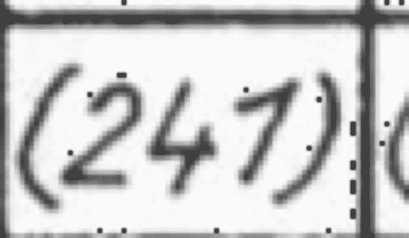

这是一个例子，标签被设置为方括号，而你可以清楚地看到图片中包含括号。图片由作者提供。

很少错误能产生如此大的影响的原因是模型盲目地信任你给它提供的标签。模型不会查看图像并思考“嗯，为什么图像中有括号时，这个括号是一个括号？”（就像你可能会做的那样）。模型盲目地信任标签，并接受它作为一个事实，即这张图像（是一个括号）包含一个括号。这实际上会降低模型性能，因为你提供了错误的信息，它现在会使用这些信息来进行未来的预测。

#### 数据平衡

精调的另一个细节是，我平衡数据集以限制空白图像的数量。大约 70%的细胞包含空白图像，我希望避免在这些图像上花费过多的精调时间（模型已经能够很好地忽略这些细胞）。因此，我确保我们精调的数据中最多只有 30%包含空白图像。

#### 选择要微调的层

下面的图像显示了 VLM 的一般架构：

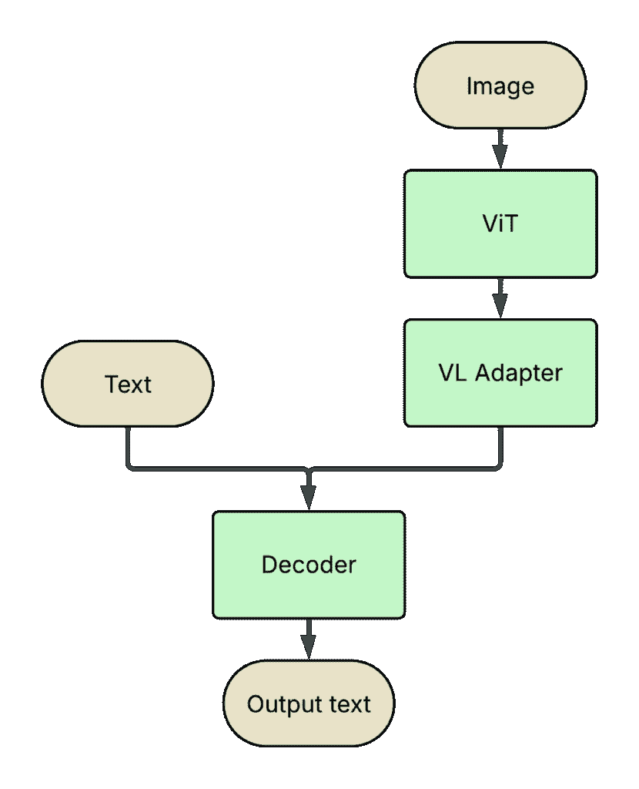

这张图像显示了 VLM 的标准架构布局。图像通过 ViT（视觉转换器）进行处理，从中提取视觉标记。然后这些标记被输入到 VL（视觉-语言）适配器中，以确保图像标记与文本标记处于相同的嵌入空间。输入到模型中的文本被简单地标记化。文本和图像标记随后被输入到解码器中，解码器产生输出文本。

在微调 VLM 时需要考虑的一个因素是你要微调哪些层。理想情况下，你希望调整所有层（如图中绿色标记所示），我在解决这个问题时也是这样做的。然而，有时你会遇到计算限制，这使得调整所有层变得困难，你可能不需要调整所有层。一个例子是，如果你有一个非常依赖图像的任务。例如，在 Findable，我们分类来自建筑师、土木工程师等的图纸。这自然是一个非常依赖视觉的任务，这是一个你可以只调整模型视觉层（ViT——视觉转换器和视觉-语言适配器，有时被称为投影仪）的案例。

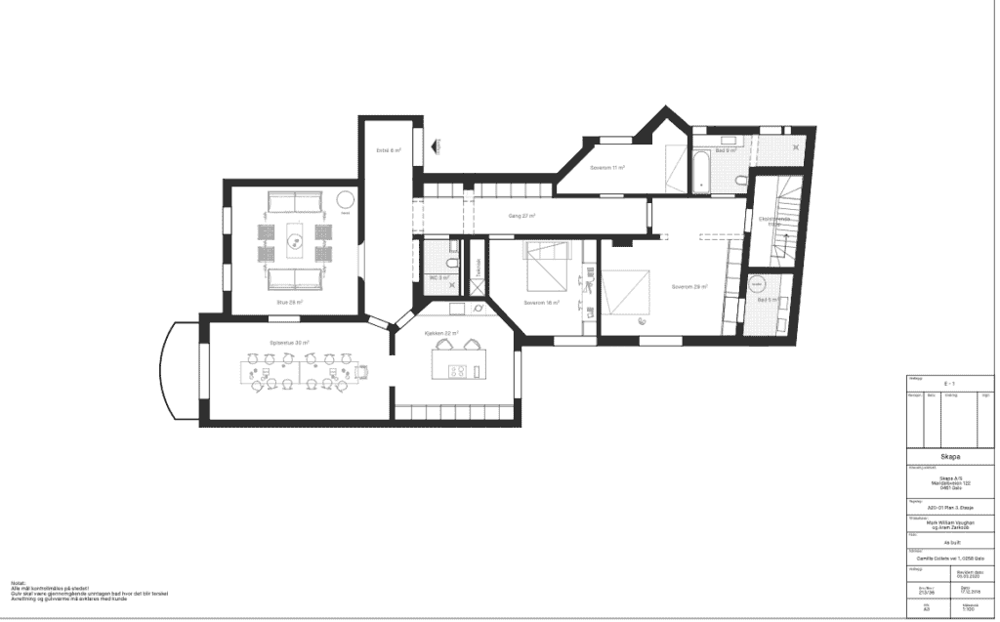

这是一张建筑师绘图的例子。这张图来自奥斯陆市政府，与 Findable AS 客户数据无关。通过访问奥斯陆市政府网站上的 saksinnsyn（英文中的案例访问）([`innsyn.pbe.oslo.kommune.no/saksinnsyn/main.asp`](https://innsyn.pbe.oslo.kommune.no/saksinnsyn/main.asp))找到这张图。搜索 Camilla Collects vei（随机选择的一个地址）。然后点击 Søk i sak（搜索案例）按钮。选择 Saksnummer（案例编号）为 202317562 的案例，点击包含 tegnninger（图纸）的标签页，并选择名为 plan 8 etasje 的图纸。这张图是在与奥斯陆市规划和建设服务部门交谈后使用的，他们允许使用网站上任何公开可用的图纸。该图纸是在 2024 年 5 月 23 日访问的。

#### 超参数搜索

我还进行了一次超参数搜索，以找到微调模型的最佳参数集。然而，值得注意的是，超参数搜索并不总是可行的。一些大型语言模型的训练过程可能需要几天时间，在这种情况下，进行广泛超参数搜索是不可行的，因此您将不得不依靠直觉来找到一组好的参数。 

然而，对于提取手写文本这个问题，我有一个 A100 80 GB GPU。图像相当小（每个方向小于 100px），我使用的是 7B 模型。这使得训练只需要 10-20 分钟，这使得过夜的超参数搜索变得可行。

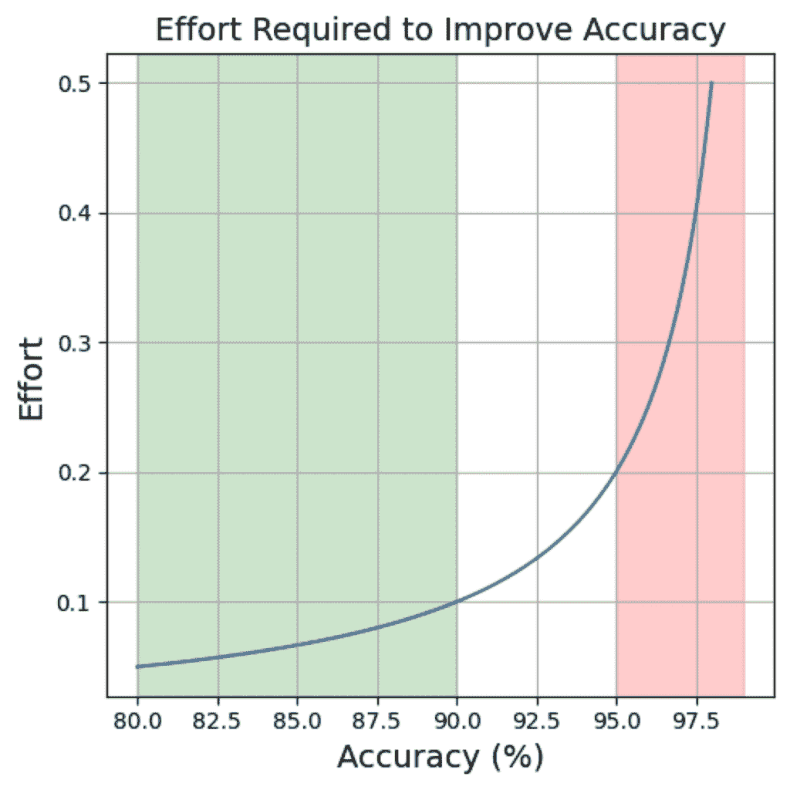

这是一个我创建的任意图表，展示了提高模型准确度所需付出的努力。如图所示，从 80-90%的准确度提升到 95-99%的准确度所需的努力要少得多。图片由作者提供。

## 结果和图表

在重复训练模型、创建更多标签、重新训练等循环之后，我已经创建了一个高性能的微调模型。现在是时候查看最终结果了。我制作了四个测试集，每个测试集包含 278 个样本。我在数据上运行了 EasyOCR、基础[Qwen 2.5 VL 7B 模型](https://qwenlm.github.io/blog/qwen2.5-vl/)（*Qwen 基础模型*）以及微调模型，您可以在下表看到结果：

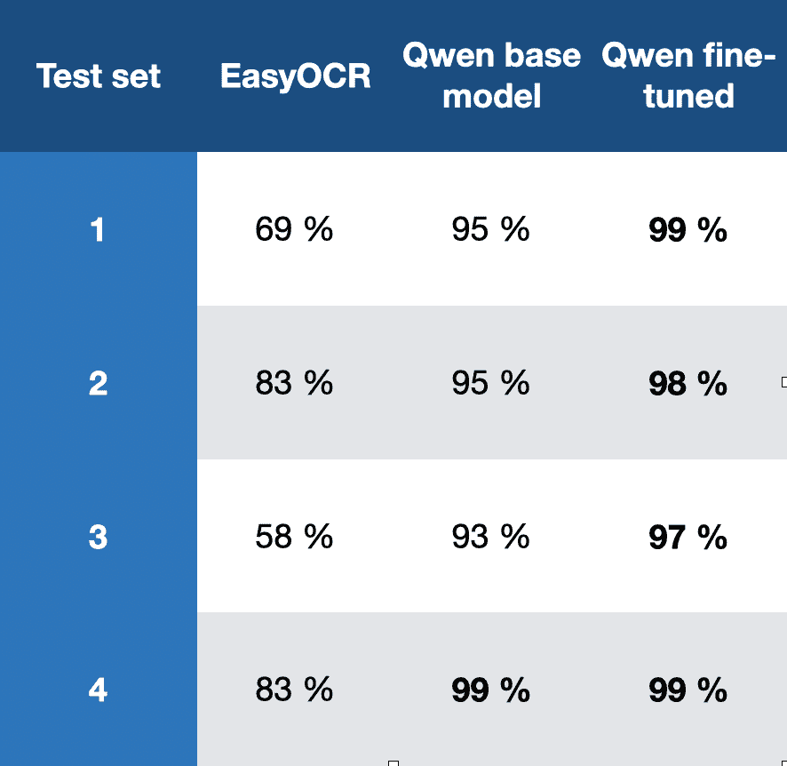

这些是从四个测试集得到的三个不同模型的结果。你可以看到 EasyOCR 的表现并不好，其结果非常糟糕，以至于你无法相信它提供的数字。Qwen 基础模型表现相当好，范围在 93-99%。在某些场景下，这种性能可能是可以接受的，但对我来说，我所工作的数据集和我的性能预期并不足够。然而，你可以清楚地看到，模型的微调工作得很好，它在所有测试集上的表现都优于基础 Qwen 模型，尤其是在第 4 个测试集中，两个模型的表现相当。Qwen 基础模型和微调模型基于阿里巴巴的 Qwen 2.5 VL 7B。

因此，结果清楚地表明，微调正如预期的那样工作，大大提高了模型性能。

最后，我还想分享一些你可以用这些数据制作的图表。

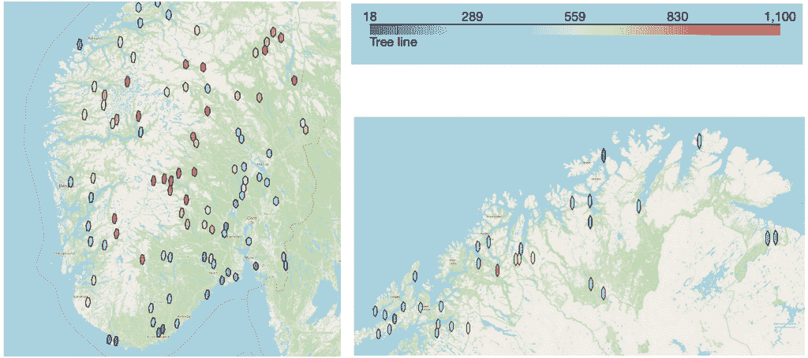

这是来自图像中提取的树木线数据，使用[Uber 的 H3](https://www.uber.com/en-NO/blog/h3/)绘制在挪威地图上。你可以看到树木线如何向海洋和北方变冷（变低），如果你朝向国家内部看，它会变暖（变高）。图片由作者提供，

如果你想进一步调查数据，它全部包含在[HuggingFace 上的这个 parquet 文件](https://huggingface.co/datasets/findableai/phenology/blob/main/df_labels_and_images.parquet)中。

### 结论

在这篇文章中，我向您介绍了一个物候数据集，它由带有手写文本的小图像组成。我在本文中解决的问题是如何有效地从这些图像中提取手写文本。首先，我们检查了数据集，以了解其外观、数据的变异性以及视觉语言模型在从图像中提取文本时面临的挑战。然后，我讨论了你可以使用的三步流程来创建标记数据集并微调模型以提高性能。最后，我突出了一些结果，展示了微调 Qwen 如何比基础 Qwen 模型表现更好，我还展示了表示我们提取的数据的一些图表。

本文中的工作由 [Eivind Kjosbakken](https://www.linkedin.com/in/eivind-kjosbakken/) 和 [Lars Aurdal](https://www.linkedin.com/in/lars-aurdal-a2582b1b/) 完成。

**👉 我的免费电子书和网络研讨会：**

📚 [获取我的免费视觉语言模型电子书](https://eivindkjosbakken.com/ebook)

💻 [我的视觉语言模型网络研讨会](https://www.eivindkjosbakken.com/webinar)

**👉 在社交平台上找到我：**

📩 [订阅我的通讯](https://eivindkjosbakken.com/newsletter)

🧑‍💻 [联系我](https://eivindkjosbakken.com/)

🔗 [LinkedIn](https://www.linkedin.com/in/eivind-kjosbakken/)

🐦 [X / Twitter](https://x.com/EivindKjos)

✍️ [Medium](https://oieivind.medium.com/)
