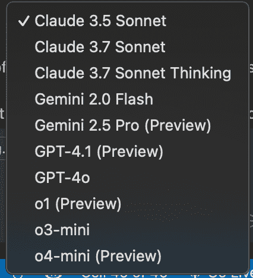
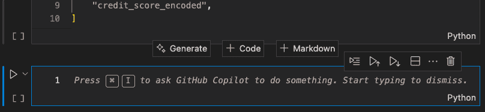

# 为什么我停止使用 Cursor 并回归 VSCode

> 原文：[`towardsdatascience.com/vscode-is-the-best-ai-powered-ide/`](https://towardsdatascience.com/vscode-is-the-best-ai-powered-ide/)

## <mdspan datatext="el1746125171719" class="mdspan-comment">简介</mdspan>

在 2024 年 12 月，我写了一篇文章，分享了我作为一个数据科学家使用 VSCode（GitHub Copilot）和 Cursor（Claude 3.5 Sonnet）的经历。

> [你应该从 VSCode 切换到 Cursor 吗？](https://towardsdatascience.com/should-you-switch-from-vscode-to-cursor-45b1a0320d07/)

我在文章结尾时说：

> *在过去两周使用 Cursor 之后，我决定将其用于所有未来的项目。*

自从写这篇文章以来，不仅 VSCode 和 Cursor 有显著的发展，而且一波新的 AI 驱动的 IDE（例如 Windsurf）也涌现出来。在评估和测试这些替代 IDE 之后，我决定回归 VSCode 作为我的首选主要 IDE。

在这篇文章中，我将讨论为什么我不再使用 Cursor，为什么我回归到 VSCode 和 GitHub Copilot，以及我对作为数据科学家你应该使用什么 IDE 的看法。

## 我最喜欢 Cursor 的地方

让我先声明这一点：[Cursor](https://www.cursor.com/) 是一款出色的产品。我一直在听到开发者们越来越多地讨论 Cursor，许多人都在利用他们的两周免费试用。起初我有些犹豫，但阅读了软件的持续好评后，我决定亲自形成自己的看法。

我喜欢 Cursor 的界面与 VSCode 相同。安装后，Cursor 允许你下载所有现有的 VSCode 扩展，这无疑有助于推广，因为它让你感觉就像在家一样。

在 2024 年 12 月，Cursor 的两个关键特性使其脱颖而出。第一个是能够使用多种不同的 LLM，与 GitHub Copilot 不同，GitHub Copilot 对可用的 LLM 有所限制。其次，Cursor 有一个名为“Composer”的功能，允许用户通过简单的提示来生成整个项目代码库。

如我在文章“[你应该从 VSCode 切换到 Cursor 吗？](https://medium.com/towards-data-science/should-you-switch-from-vscode-to-cursor-45b1a0320d07)”中所描述的，这两个特性是我最兴奋的，也是我最初评论的基础。

## 为什么我回到了 VSCode

VSCode 已经是我的主要 IDE 超过 7 年了，我也是一个 GitHub Copilot 的测试员，自从它发布以来我就一直在付费使用。

如前所述，Cursor 的一个关键优势在于其界面与 VSCode 的相似性。尽管这是一个次要原因，但切换回 VSCode 意味着我无需重新熟悉替代用户界面。

GitHub Copilot 通过启用实现 SOTA 新发布的 LLM 的能力，消除了我最初转向 Cursor 的两个主要原因之一。截至 2025 年 4 月，以下是 GitHub Copilot 可用的 LLM 列表：

GitHub Copilot 可用的 LLM（2025 年 4 月）。图片由作者捕捉和拥有。

[Claude 3.7 Sonnet](https://www.anthropic.com/news/claude-3-7-sonnet) 于 2025 年 2 月 24 日发布。在同一天，[微软宣布](https://devblogs.microsoft.com/visualstudio/claude-3-7-now-available-in-github-copilot-for-visual-studio/)，该模型现在可以通过 GitHub Copilot 获取。[GPT-4.5](https://openai.com/index/introducing-gpt-4-5/) 于 2025 年 2 月 27 日发布，并且也在同一天[在 GitHub Copilot Chat 中对 Copilot 企业用户开放](https://github.blog/changelog/2025-02-27-openai-gpt-4-5-in-github-copilot-now-available-in-public-preview/)。

与 2024 年 12 月相比，他们在 LLM 产品上的巨大改进。

作为数据科学家，我经常在 Jupyter Notebooks 中进行探索任务。尽管使用 `.py` 文件编程时 AI 辅助效果更好，但我发现与 Jupyter Notebooks 一起工作时 VSCode 比 Cursor 更好。

在添加新的 Jupyter Notebook 单元时，VSCode 的“生成”选项。图片由作者捕捉和拥有。

当你在 VSCode 中添加新的笔记本单元时，VSCode 会提供 GitHub Copilot 指令，而 Cursor 则没有这个功能。尽管有 AI 辅助，但使用起来更困难，因为用户必须使用 **Ctrl/⌘ + K** 来开始编写他们的提示。

当使用 VSCode 和 GitHub Copilot 与 Jupyter Notebooks 一起工作时，你还可以与你的 AI 辅助进行聊天，引用你想要 AI 专注于的笔记本中的单元。这个功能使得在编码工作流程中实现 AI 辅助变得极其容易。

最后两个因素，虽然不太重要，但确实在我的整体决策中扮演了角色，那就是成本和我在专业角色中的使用情况。

GitHub Copilot 每月收费 10 美元，而 Cursor 每月收费 20 美元。我自问，使用 Cursor 相比 VSCode 是否能获得两倍的价值？这个问题的答案是“否”，因此这增加了回归 VSCode 的权重。

最后，作为首席数据科学家，我每天使用 VSCode。我永远不会仅仅基于我在专业角色中使用的 IDE 来选择 IDE，尽管这确实有助于尽可能保持事物的一致性。

*为了本文的目的，我正在强调我从 VSCode 和 GitHub Copilot 的经验中获得的高级要点。如果您有更具体的问题想要询问，请通过社交媒体联系我。*

## GitHub Copilot 如何缩小差距

GitHub 在 2018 年被微软以 75 亿美元的价格收购。[（新闻来源：https://news.microsoft.com/announcement/microsoft-acquires-github/）] 由于微软是一家远比 [Anysphere Inc.](https://anysphere.inc/) 大得多的公司，因此他们能够投入更多资源来改进他们的产品。

作为最终用户，鼓励竞争，因为它推动公司创新和发展，以使他们能够相互保持同步。这也意味着，当一项新功能发布并被社区广泛采用时，所有竞争对手公司都会争先恐后地将该功能开发成自己的产品。

当 Cursor 最初开始流行时，它有许多竞争对手没有的功能（例如，Composer、Tab 和 Cursor Prediction）。现在这种情况已经不再存在了。

如 GitHub Copilot 的[变更日志](https://github.blog/changelog/label/copilot/)所示，每周都有发布，有些日子会推出一个以上的新功能，供所有 GitHub Copilot 用户使用。

到目前为止，Cursor 提供的功能中，没有许多是 VSCode 和 GitHub Copilot 所不具备的。在过去 4 个月中，微软已经表明，它非常重视将 GitHub Copilot 打造成市场上最好的 AI 编码助手。虽然仍需要一些改进，但他们正在以快速的速度推进，缩小差距，并有望在 2025 年底引领市场。

## 最后的想法

首先，我不相信任何文本编辑器/IDE 比其他任何更好。你应该始终通过试错来做出判断，而不是基于网络上最常讨论的内容来做出最终决定。

我已经从 Cursor 切换回 VSCode 好几个星期了，我没有后悔我的决定。我相信微软在 GitHub Copilot 上取得了巨大进步，并真正缩小了与所有新 AI 助手 IDE 的差距。

总会有一些功能在这里或那里出现，但在你目前使用的 IDE 中不可用。如果它们被社区广泛采用，所有竞争对手最终都会实现它们。不要利用这个机会不断切换你的 IDE。

* * *

***免责声明：*** 文章中分享的所有观点都是基于我个人的经验；我与 Cursor、VSCode 或 GitHub Copilot 没有任何关联。除非另有说明，否则作者拥有本文中包含的所有图片的版权。

* * *

*如果您喜欢阅读这篇文章，请关注我的[Medium](https://medium.com/@marccodess)，[*X*](https://twitter.com/marccodess)，以及[*GitHub*](https://github.com/marccodess)获取有关数据科学、人工智能和工程的相关内容。*

*快乐学习！🚀*
