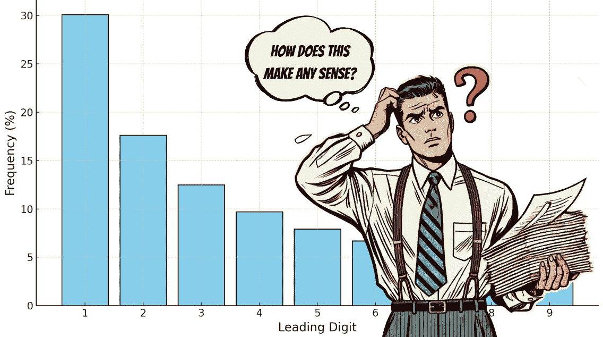
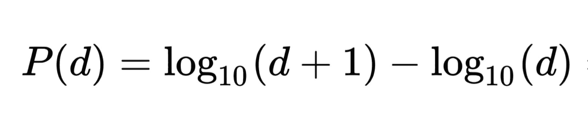
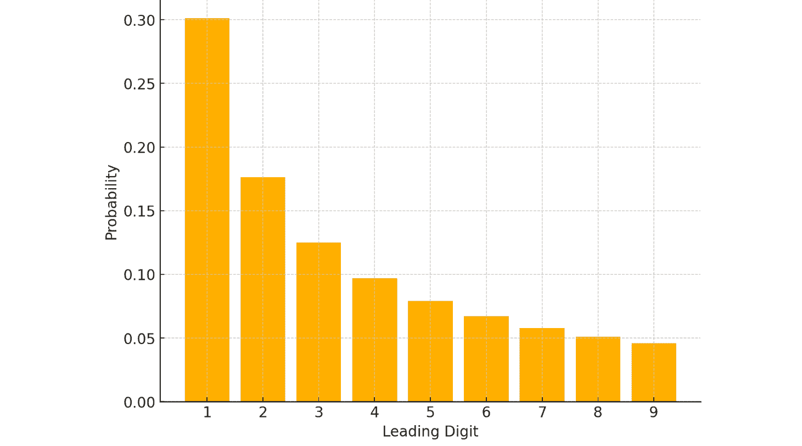
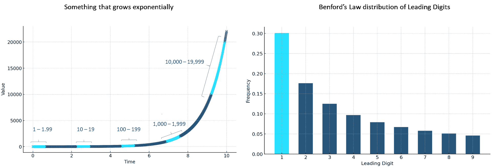
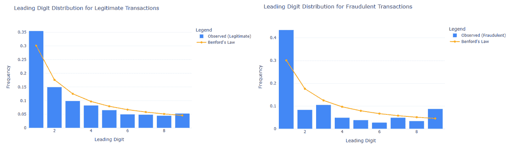

# 水壶旁闲聊，第 6 集：本福特定律

> 原文：[`towardsdatascience.com/water-cooler-small-talk-benfords-law-a1c12419e773/`](https://towardsdatascience.com/water-cooler-small-talk-benfords-law-a1c12419e773/)

### 统计学

# 水壶旁闲聊，第 6 集：使用本福特定律进行欺诈检测



由作者使用 GPT-4 创建的图像 / 所有其他图像由作者创建，除非另有说明

你有没有听说过同事自信地宣称“*[我越在轮盘赌上输得越多，我就越接近赢？](https://contributor.insightmediagroup.io/water-cooler-small-talk-gamblers-fallacy-and-ruin-3f882707fd19)*”或者有老板要求你不要把事情复杂化，只提供“*一个数字*”，而忽略你解释为什么这样的数字不存在的尝试？也许你甚至和同事分享过生日，办公室里的每个人都对[这必须是一个奇怪的宇宙巧合](https://contributor.insightmediagroup.io/water-cooler-small-talk-the-birthday-paradox-94ea294502c7)发表评论。

这些时刻是典型的水壶旁闲聊的例子——一种特殊的闲聊方式，在休息室、咖啡机和当然，水壶旁盛行。这是员工分享各种公司八卦、神话和传说、不准确的科学观点、令人震惊的个人轶事或直接谎言的地方。什么都可以聊。因此，在我的*[水壶旁闲聊](https://medium.com/@m.mouschoutzi/list/water-cooler-small-talk-dea705848095)*文章中，我讨论了我在办公室听到的奇怪且通常科学上无效的观点，并探讨了真正发生的事情。

> *🍨* **[DataCream](https://datacream.substack.com/)** 是一份提供数据驱动文章和数据、技术、人工智能和机器学习观点的通讯。如果您对这些主题感兴趣，请**[订阅](https://datacream.substack.com/)**。

* * *

今天的水壶旁时刻来自对发票的一个好奇的观察：

> 我正在查看上个月的发票，这很奇怪——其中许多都是以 1 或 2 开头的。这仅仅是随机的，对吧？

不，这不是随机的。🙃

事实上，许多自然发生的数据集中首位数字的分布遵循一种称为本福特定律的现象。

> [**玛丽亚·莫舒齐，博士 – Medium**](https://medium.com/@m.mouschoutzi)

* * *

## 本福特定律怎么样？

[本福特定律](https://en.wikipedia.org/wiki/Benford%27s_law)指的是在许多自然发生的数据集中，首位数字更可能是 1 而不是 9 的观察结果。特别是，它提供了一个自然数据集中首位数字预期分布的公式，以及关于第二位数字、第三位数字、数字组合等的预测。相反，如电话号码或伪造的财务报表等分配和伪造的数字，[通常不符合本福特定律](https://www.researchgate.net/publication/254300534_Digital_Analysis_Using_Benford's_Law_Tests_and_Statistics_for_Auditors)。

该定律以物理学家[弗兰克·本福德](https://en.wikipedia.org/wiki/Frank_Benford)的名字命名，他在 1938 年的文章*‘[异常数字定律](https://ui.adsabs.harvard.edu/abs/1938PAPhS..78..551B/abstract)‘*中解释了它。尽管如此，本福德并不是第一个做出这一观察的人——[西蒙·纽科姆](https://en.wikipedia.org/wiki/Simon_Newcomb)在 1881 年就提出了这个定律，因此该定律也被称为纽科姆-本福特定律。更具体地说，纽科姆注意到对数表的前几页，对应以 1 开头的数字，比包含较大首位数字的后续页面明显更脏、更频繁使用。值得注意的是，[他确实发表了正确的分布](https://www.jstor.org/stable/2369148?seq=1)。后来，本福德展示了该定律在广泛的数据集中的适用性。

特别是，根据本福特定律，以 10 为基数，每个首位数字*d*从 1 到 9 的概率如下：



哇，多好啊！🤗 这个公式产生了一个反对数模式——数字 1 大约有 30.1%的时间作为首位数字，而数字 9 仅在 4.6%的情况下作为首位数字出现。虽然乍一看可能不太直观，但这种奇怪的规律在大量不同类型的数据集中都得到了验证，从股价到地震震级，从河流长度到电费。这种现象是尺度不变的，意味着无论测量单位是米、千米还是英里，模式都保持一致。此外，该定律仅适用于跨越几个数量级的数据集——如人类身高或考试成绩等有限范围内的数量，不符合本福特定律。



但这是为什么？🤨许多现实世界现象是成比例增长的——比如股票价格或利率这样的金融数据，或者人口规模，通常是以比例或指数的方式增长。这种指数增长导致数据集的首位数字天生符合对数分布。这是因为数字的对数间隔。例如，在对数尺度上，1 和 10 之间的间隔远大于 90 和 100 之间的间隔。因此，首位数字较小的数字（如 1）出现的频率更高，这与贝纳德定律相吻合。此外，像河流长度或湖泊大小这样的随机自然现象，通常遵循高度偏斜的分布，这与对数间隔相一致。



指数增长导致数据点在每对数类（例如，10、100、1000 等）的开头聚集。这种聚集发生是因为较小的首位数字（如 1）相对于较大的数字（如 9）覆盖了对数尺度的更大比例。因此，此类数据集中首位数字的分布遵循贝纳德定律。

* * *

## 使用贝纳德定律捕捉作弊者

贝纳德定律的一个意外但非常流行的应用是欺诈检测，从伪造的会计数字到虚假的选举投票。有机过程通常产生遵循贝纳德分布的数据，这使得贝纳德定律成为检测欺诈的有效且简单的方法。有许多成功使用贝纳德定律进行欺诈检测的例子。重要的是要强调，偏离贝纳德分布并不一定意味着数据被操纵——即使是对数据进行四舍五入也可能导致偏离名义分布。尽管如此，这种偏离确实意味着数据看起来可疑，我们需要进行更仔细、更谨慎的检查。它可以作为欺诈检测的初步筛查。

作为希腊人，我发现回顾希腊当年涉嫌操纵宏观经济数据以加入欧盟的情况特别引人入胜。🤡 这是一个众所周知的事件，自那以后一直被反复公开讨论——欧洲委员会已正式确认对提供数据的可靠性的担忧，导致普遍怀疑存在操纵。特别是，欧盟要求候选国提供数据以检查稳定与增长公约标准，如公共赤字、公共债务和国内生产总值。遗憾的是，希腊 1999 年至 2009 年的数据与 27 个欧盟成员国相比，[与 Benford 分布的最大偏差，](https://onlinelibrary.wiley.com/doi/abs/10.1111/j.1468-0475.2011.00542.x) 但数据不符合 Benford 定律并不构成结论性证据。但说真的！🤷‍♀️

另一个通过 Benford 定律被抓住的经典例子是财务顾问韦斯利·罗德斯，他的财务报表未能通过第一个数字的 Benford 定律测试。仔细观察后，发现罗德斯是从空中捏造数字，并且[从投资者那里窃取了数百万美元](https://www.sec.gov/enforcement-litigation/litigation-releases/lr-21030)。

Benford 定律在选举欺诈中的应用也很有名，但争议更大。在 2020 年拜登与特朗普的美国总统选举中，一些分析认为特朗普的选票分布符合 Benford 定律，而拜登的则不符合。当然引起了一些骚动，但这种分布最终[是可解释的](https://www.reuters.com/article/world/fact-check-deviation-from-benfords-law-does-not-prove-election-fraud-idUSKBN27Q3A9/)。一个更具争议的案例是伊朗 2009 年的选举——总体而言，[投票计数似乎不符合 Benford 定律](https://link.springer.com/article/10.1007/s00144-010-0003-4)，看起来可疑。尽管如此，关于 Benford 定律在选举欺诈检测中的适用性存在大量讨论，因为选举数据往往无法满足该定律成立所需的必要条件。

Benford 定律在社交媒体中的欺诈检测也非常有用。[社交媒体中的欺诈检测](https://journals.plos.org/plosone/article?id=10.1371/journal.pone.0135169)。更具体地说，该定律适用于社交媒体指标，例如关注者数量、点赞或转发。通过这种方式，它允许通过检查这些数量并将它们与 Benford 分布进行比较，来识别可疑行为，如[机器人活动或购买参与度](https://firstmonday.org/ojs/index.php/fm/article/view/10163/8063)。

* * *

## 摸索实践

我们可以轻松地检查数据集是否符合贝叶斯定律。这使我们能够快速确定数据集是否合法或可疑，从而需要进一步检查。为了演示[这一点](https://www.kaggle.com/datasets/mlg-ulb/creditcardfraud?select=creditcard.csv)，我将使用这个 Kaggle 数据集进行信用卡欺诈检测。该数据集许可为[开放数据公共](https://opendatacommons.org/licenses/dbcl/1-0/)，允许商业使用。

数据集包含许多列，但我只会使用以下两个：

+   *金额:* 表示交易的金额

+   *班级:* 表示交易是否合法（0），或欺诈（1）

因此，我们可以通过以下方式在 Python 中导入必要的库和数据集：

```py
import pandas as pd
import numpy as np
import matplotlib.pyplot as plt

data = pd.read_csv("creditcard.csv")
```

然后，我们可以通过应用相应的公式轻松计算出贝叶斯定律预测的名义概率。

```py
# calculate nominal Benford's Law probabilities
benford_probabilities = np.log10(1 + 1 / np.arange(1, 10))
```

接下来，我们必须计算数据集中合法和欺诈子集的起始数字分布。为此，提取每个交易的‘*金额*’列的起始数字是至关重要的。

```py
# extract leading digit
def leading_digit(x):
    return int(str(int(x))[0]) if x > 0 else None

# split into legit and fraud transactions 
legitimate_data = data[data["Class"] == 0]
fraudulent_data = data[data["Class"] == 1]

# calculate frequencies 
def calculate_frequencies(data, label):
    observed = data["Amount"].apply(leading_digit).value_counts(normalize=True).sort_index()
    return observed.reindex(range(1, 10), fill_value=0)

legit_freq = calculate_frequencies(data[data["Class"] == 0], "Legitimate")
fraud_freq = calculate_frequencies(data[data["Class"] == 1], "Fraudulent")
```

然后，我们可以将合法和欺诈的两个分布与名义的贝叶斯定律分布进行比较。对于可视化，我通常使用 Plotly 库。

```py
import plotly.graph_objects as go

fig_legit = go.Figure()

# bar for frequencies
fig_legit.add_trace(go.Bar(
    x=list(range(1, 10)),
    y=legit_freq.values,
    name="Observed (Legitimate)",
    marker_color="#4287f5"
))

# line for Benford's Law probabilities
fig_legit.add_trace(go.Scatter(
    x=list(range(1, 10)),
    y=benford_probabilities,
    mode="lines+markers",
    name="Benford's Law",
    line=dict(color="orange", width=2)
))

fig_legit.update_layout(
    title="Leading Digit Distribution for Legitimate Transactions",
    xaxis=dict(title="Leading Digit"),
    yaxis=dict(title="Frequency"),
    height = 500,
    width = 800,
    barmode="group",
    template="plotly_white",
    legend=dict(title="Legend"),
)
fig_legit.show()
```

同样，我们为欺诈交易生成相应的图表。



即使是粗略一看，也可以明显看出合法交易与名义分布的吻合度更高，而欺诈交易则显示出显著的偏差。为了进一步量化这些偏差，我们可以计算每个起始数字的观察概率与名义概率之间的差异，然后进行汇总。

```py
# calculate deviations from nominal distribution
legit_score = np.sum(np.abs(legit_freq - benford_probabilities))
fraud_score = np.sum(np.abs(fraud_freq - benford_probabilities))

print(f"Legit deviation Score: {legit_score:.2f}")
print(f"Fraud Deviation Score: {fraud_score:.2f}")
```


显然，第二个子集中有问题，我们需要进行更仔细和深入的调查研究。

但这有意义吗？🤨 在信用卡欺诈中，交易金额本身通常不是伪造的——欺诈者旨在用非常真实的金额刷爆你的信用卡。然而，在试图绕过某些安全阈值时，例如每次购买的 50 美元或 100 美元限制，他们可能会产生不符合贝叶斯定律的不规则模式。例如，试图保持在 100 美元以下可能会导致以 9 开头的交易过度代表，如$99.99。因此，虽然数据可能不是完全伪造的，但模式的不规律性表明可能发生了不寻常的事情。

* * *

## 在我心中

最终，本福特定律并不是欺诈或数据操纵的证据，而是一个表明有某种情况发生的指标。如果数据不符合预期的分布，我们只需要提出一个解释，说明为什么数据不符合——数据可能存在哪些不自然、强制或伪造的方面。当找不到合理的解释时，可能就是时候进行更仔细、更详细的检查了。

* * *

## 数据问题？🍨 DataCream 可以帮助！

+   ***洞察力**: 通过定制分析解锁可操作洞察力，以推动战略增长。

+   ***仪表盘**: 构建实时、视觉吸引人的仪表盘，以支持明智的决策。

*有一个有趣的数据项目吗？需要以数据为中心的编辑内容吗？请给我发邮件到* 💌 ***[[email protected]](http://maria.mouschoutzi@gmail.com)*** 或在* 💼 ***[LinkedIn](https://www.linkedin.com/in/mmouschoutzi/)*** 上联系我。

* * *

## 💖 喜欢这篇帖子？

*让我们成为朋友！加入我*

**📰***[Substack](https://datacream.substack.com/)*** 💌* **[Medium](https://medium.com/@m.mouschoutzi)*** 💼***[LinkedIn](https://www.linkedin.com/in/mariamouschoutzi/)*** ☕***[买我一杯咖啡](http://buymeacoffee.com/mmouschoutzi)!*****

*或者，看看我的其他 [冷水间简谈](https://medium.com/@m.mouschoutzi/list/water-cooler-small-talk-dea705848095)：*

> [**冷水间简谈：辛普森悖论**](https://contributor.insightmediagroup.io/water-cooler-small-talk-simpsons-paradox-caf98151db0e)
> 
> [**冷水间简谈：高智商究竟意味着什么？**](https://ai.gopubby.com/water-cooler-small-talk-what-does-having-a-high-iq-even-mean-b678fcf758e0)
