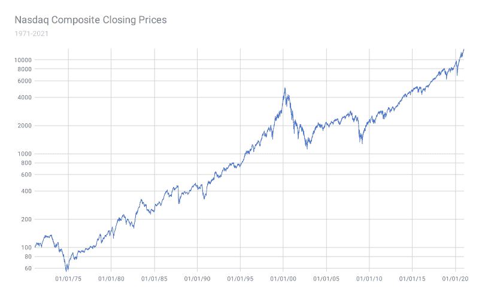
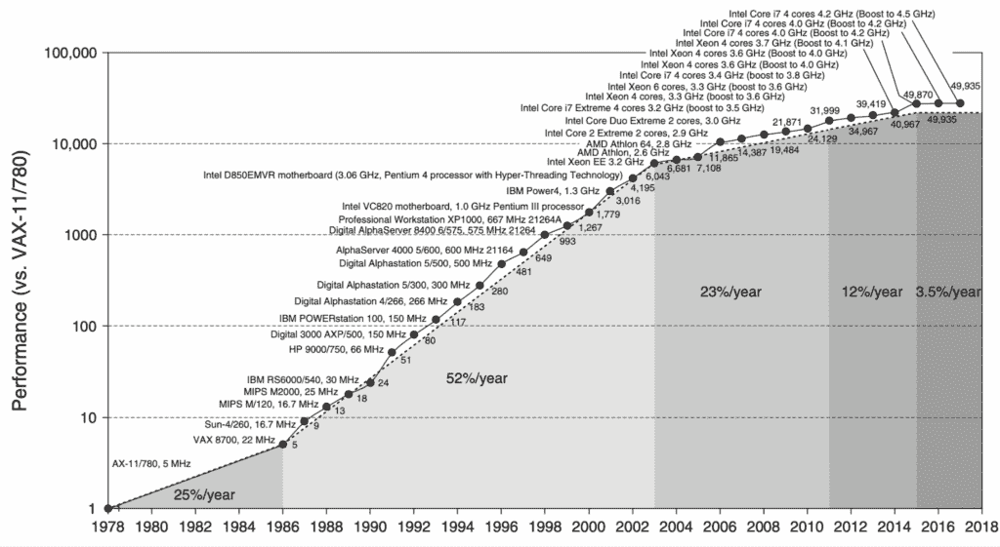

# 水壶闲聊，第 10 集：那么，关于 AI 泡沫，你怎么看？

> 原文：[`towardsdatascience.com/water-cooler-small-talk-ep-10-so-what-about-the-ai-bubble/`](https://towardsdatascience.com/water-cooler-small-talk-ep-10-so-what-about-the-ai-bubble/)

<mdspan datatext="el1764224361750" class="mdspan-comment">水壶闲聊</mdspan>是一种特殊的小型谈话，通常在办公室的水壶旁进行。在那里，员工们经常分享各种公司八卦、神话、传说、不准确的科学观点、不谨慎的个人轶事，或者直接是谎言。什么都可以聊。在我的“水壶闲聊”帖子中，我讨论了我在办公室听到的奇怪且通常科学上无效的观点，这些观点让我们无言以对。

那么，这里是今天帖子的水壶闲聊观点：

> *AI 就像千禧年转折点的互联网泡沫一样，是一个泡沫。它没有真正的价值，最终将崩溃并消失.*

呼！😅 这里有很多东西要解释。与我在其他“水壶闲聊”帖子中讨论的观点不同，对于这个话题，没有简单直接的答案。AI 显然是一项令人印象深刻的技术，无疑是我们的时代突破，几年前，我们只能在科幻领域想象这样的东西。

话虽如此，我们无法否认，它确实存在一定的泡沫——至少在其当前状态下。例如，[Mira Murati](https://en.wikipedia.org/wiki/Mira_Murati)（OpenAI 的前 CTO）的新公司 [Thinking Machines Lab](https://thinkingmachines.ai/)，目前估值高达 120 亿美元（基本上没有产品）。除此之外，NVIDIA 几周前达到了天文数字的[5 万亿美元](https://www.reuters.com/business/nvidia-poised-record-5-trillion-market-valuation-2025-10-29/)估值（大约等于德国的 GDP，以此作为参考）。

不可否认，操作 AI 模型是一种相当昂贵的爱好，到目前为止还没有真正的回报。像 Anthropic 和 OpenAI 这样的公司为了运行它们复杂的模型支付了数十亿美元（仅运行 ChatGPT 每天就花费 70 万美元），但至少到目前为止，它们只能收回几分钱，并且处于净亏损状态。那么，究竟发生了什么？是否有什么隐藏的技术将会突然被揭露，并使整个机制变得可持续？这些科技亿万富翁都是傻瓜吗？他们是骗子吗？我们都被骗去相信一个不可能的、极其昂贵的未来吗？或者我们正走向 AI 寒冬，那一切就结束了？

## 💹 关于互联网泡沫崩溃，你怎么看？

把人工智能称为泡沫的人最流行的论点是 20 世纪 90 年代末的互联网泡沫。但事实上，在互联网泡沫之前，已经有很多其他泡沫，它们都源于某些技术突破。例如，我们可以想到 19 世纪 40 年代的[铁路狂热](https://en.wikipedia.org/wiki/Railway_Mania)或 20 世纪 20 年代的[无线电繁荣](https://finaeon.com/rca-and-the-roaring-twenties/)。

无论如何！当人们将当前的人工智能状态与互联网泡沫进行比较时，似乎忘记了一点，那就是当时失败的多数互联网公司基本上没有任何经过验证的商业模式。特别是在 90 年代末，有很多初创公司依靠资金和互联网未来发展的承诺在运营，但它们没有真正的商业模式来实际赚钱。在线广告当时并不是一个真正的事情，而且很多这些公司实际上没有稳固的商业计划。

1971 年至 2021 年纳斯达克综合指数的演变，

来源：维基媒体公共领域许可，[`commons.wikimedia.org/wiki/File:Nasdaq_Composite_Index_1971_to_jan2021.svg`](https://commons.wikimedia.org/wiki/File:Nasdaq_Composite_Index_1971_to_jan2021.svg)

相比之下，今天的大多数人工智能公司都有非常结构化的商业计划。而且与 90 年代不同，个人和组织都非常熟悉在线支付东西的概念。与 90 年代和 21 世纪初不同，互联网上免费东西的想法——比如，比如种子下载或一般性的免费价值——已经一去不复返了。我们现在非常清楚，如果你想要从任何屏幕上得到有价值的东西，你需要付费；否则，你只会得到广告、噪音和糟糕的体验。

即使对于最著名的互联网泡沫破灭案例（比如 Pets.com 或 WebVan），这些想法的前提并没有错。Pets.com 向零售商提供宠物用品，这在今天广泛存在，是一个有效且务实的企业理念。同样，WebVan 在 30 分钟内提供家庭送货服务，这个市场在 20 年后的 COVID-19 封锁期间蓬勃发展，像 Uber Eats 或 Amazon Prime 这样的服务也应运而生。因此，导致“泡沫”的并不是商业理念或技术本身，而是其执行和市场对这种理念成熟度。所以，我对科技驱动型泡沫的看法通常是，技术本身通常具有价值，但很可能还太早，世界对实现所有这些潜力的成熟度还不够。

## 💸 难道那些科技亿万富翁都是傻瓜吗？

所以，如果人工智能市场还相当不成熟，为什么所有这些公司都持续大量投资呢？他们难道不知道更好的选择吗？他们期待会发生什么，除了人工智能市场崩溃之外？

简短的回答是，他们都只是期待计算能力变得更便宜。

在过去，更快、更便宜的计算机芯片解决了许多被认为是无法解决的科技难题。回顾人类对人工智能的第一想法，人们曾 wonder 是否可以创建一个程序来击败人类在棋类游戏中的表现。有趣的是，棋类游戏被认为是一项需要非常高的人智力的活动，因此它自然地成为衡量智能机器的好指标。一个擅长棋类的机器不可能是非智能的。尽管如此，击败人类的棋类程序最终是通过实现相同的计算算法并[增加计算能力](https://d1yx3ys82bpsa0.cloudfront.net/chess/ibms-deep-blue-chess-grandmaster-chips.hsu-fh.1999.ieee.062303055.pdf?utm_source=chatgpt.com)来实现的。这正是每个人都在期待人工智能发生的事情。

尤其是当前的人工智能成本实在太高。从经济角度来说，这并不合理，因为运行这些模型需要花费大量资金，而且还不清楚谁愿意支付那么多。例如，对于 OpenAI 来说，仅为了使其 ChatGPT Plus 计划收支平衡，它可能需要每月收费约 50 美元，这比目前的费用高出不止一倍。因此，制造更快、更便宜的芯片将使它们能够使开发和运营此类模型的过程更加经济，从而使这些公司最终实现收支平衡。换句话说，硬件进步是使人工智能可持续发展的杠杆。

我忍不住要提到摩尔定律[`en.wikipedia.org/wiki/Moore%27s_law`](https://en.wikipedia.org/wiki/Moore%27s_law)，尽管它可能已经变得陈词滥调。摩尔定律是这样一个观察结果：集成电路上的晶体管数量大约每两年翻一番，这导致计算能力、效率和成本效益随着时间的推移呈指数级提高。尽管经典的摩尔定律现在可能已经过时（在过去十年中，进步已经趋于平稳），但它所创造的底层心态（即计算将变得越来越便宜的预期）仍然影响着今天科技巨头的期望。

摩尔定律 // 公共领域，来源：维基百科[`commons.wikimedia.org/wiki/File:Growth_in_processor_performance,_1978%E2%80%932010.png`](https://commons.wikimedia.org/wiki/File:Growth_in_processor_performance,_1978%E2%80%932010.png)

用 GPU 代替 CPU 允许并行处理，并消除了之前存在的物理限制。随着更大型的 GPU 集群的兴起，预计计算能力在未来几年内将继续增长。这就是为什么大家对这一点如此乐观。

## 🤔 那么，泡沫在哪里？

几周前，迈克尔·伯里通过购买两家公司股票的看跌期权，对英伟达和 Palantir 进行了价值 10 亿美元的看跌性投资。[迈克尔·伯里](https://finance.yahoo.com/news/big-short-money-manager-michael-153300448.html)是那位在 2007 年著名地做空房地产市场的人，他本质上预测了整个 2008 年的住房泡沫和随后的金融危机。因此，当他对所谓的 AI 泡沫和市场崩溃发出警告时，每个人都屏住了呼吸。到了 11 月晚些时候，他神秘地关闭了他的投资公司。这是一种多么大胆的方式来宣布我们正处于市场顶部！

但再次强调，问题是 AI 与住房泡沫在本质上不同。我们对房屋能做的事情是有限的，但 AI 的潜在上涨空间确实是无限的。这更像是一个关于何时而不是是否的问题，因为 AI 最终将彻底改变世界。而且与住房不同，其价值不是任意的；AI 是一种复杂的技术，是工程奇迹，其内在价值与构建它的大脑的劳动紧密相连。另一方面，房屋已经以相同的方式建造了几百年，只有微小的技术进步。很容易将 AI 视为一个投机泡沫，仅仅因为我们还没有准备好理解它。

我认为将 AI 与其他与建设某种基础设施相关的技术热潮进行比较更为恰当，比如电力、电话、互联网，甚至是铁路。哦，但铁路狂热不是一个投机泡沫吗？好吧，是吗？技术本身并不是泡沫；建设铁路基础设施并不是投机的，它具有真实、无废话的价值。问题是，除了铁路之外，最终还出现了其他替代方案，比如汽车、飞机或管道，这导致铁路永远无法实现其潜力。换句话说，交通需求最终被分配给了几个不同的市场，而不仅仅是铁路。泡沫的起源在于假设铁路将成为唯一的交通方式。因此，一个有意义的 AI 泡沫将需要某种其他、神奇的技术来替代其部分潜力。

不管怎样！就像互联网一样，AI 的主要价值来源于其之上的任何东西。铺设电网使得后来可以创建大量电器；建设互联网使得后来可以创建大量像谷歌或 Facebook 这样的应用程序。自然地，为任何事物铺设基础设施的人将不得不支付大量金钱，因为他们实际上是为接下来的人付费。然而，这并不意味着技术本身没有价值，也没有潜力导致进一步的实质性增长。

这引出了一个重要的洞察：为了使 AI 在财务上变得有意义，需要在它之上创建一系列成功且有意义的事物。如果基础设施本身最终没有被用作基础设施，那么对基础设施的投资就没有意义。因此，这才是真正的赌注，这是一个人需要回答的真正问题。技术已经有了，投资也有了，基础设施也有了；现在剩下的就是看是否能在其上构建足够真正有用的东西。

## 心中思考

我知道这篇帖子可能会像牛奶一样变质。🤷‍♀️也许几周或几个月后，我会再次阅读它，想知道我究竟在说什么。尽管如此，AI 确实令人印象深刻：这是一种复杂的技术，有可能永久性地改变世界，就像电力或互联网一样，并为一个全新的技术增长时代奠定基础。

* * *

*喜欢这篇帖子？让我们成为朋友！加入我：*

📰***[Substack](https://datacream.substack.com/)*** 💌* **[Medium](https://medium.com/@m.mouschoutzi)*** 💼***[LinkedIn](https://www.linkedin.com/in/mariamouschoutzi/)*** ☕***[请我喝咖啡](http://buymeacoffee.com/mmouschoutzi)!***

* * *

## 那么，关于 pialgorithms 呢？

正在寻找将 RAG 的力量带入您的组织？

[**pialgorithms**](https://pialgorithms.com/) 可以为您做到这一切 ***👉 ***[***预约演示***](https://pialgorithms.com/#contact)*** 今天***
