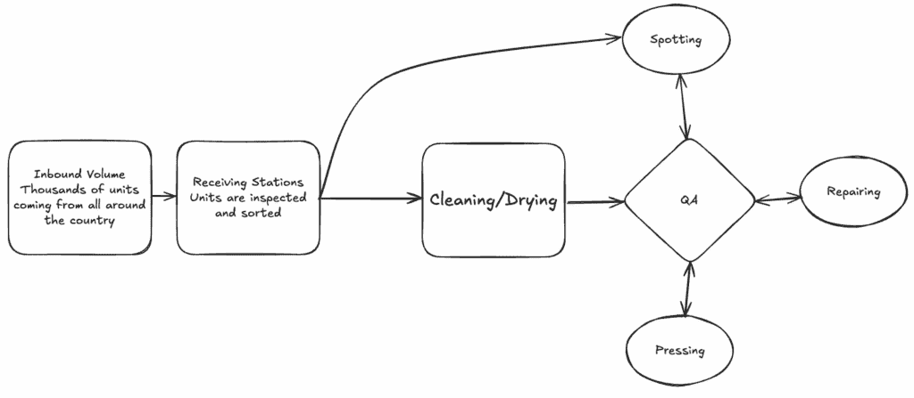

# 如果我在 2018 年就有 AI：Rent the Runway 履约中心优化

> 原文：[`towardsdatascience.com/what-if-i-had-ai-in-2018-rent-the-runway-fulfillment-center-optimization/`](https://towardsdatascience.com/what-if-i-had-ai-in-2018-rent-the-runway-fulfillment-center-optimization/)

<mdspan datatext="el1749855613003" class="mdspan-comment">杰夫·贝索斯自豪地说，“人工智能代理将成为我们的数字助手，帮助我们导航现代世界的复杂性。它们将使我们的生活更轻松、更高效。”这是来自已经在这项新技术上投入数十亿美元的人的鼓舞人心且完全无偏见的声明。

人工智能代理的炒作是真实的，数十亿美元正在涌入以构建将使我们更高效和更有创造力的模型。当我愉快地享受我的早晨咖啡，同时 Cursor 在编写我的单元测试时，很难不同意这一点。然而，当询问我的网络中的人们他们如何在日常使用人工智能时，他们的答案经常提到一些轶事性的用例，从“我用它给我儿子讲睡前故事”（如果更有想象力，这甚至可能不算是一个用例）到“我用它来优化我的日程”（Motion AI，请为了上帝的爱停止针对我）。

作为一名数据科学家，我的思绪在两个结论之间来回摇摆。一方面，我不愿意错过机器人革命派对的最后时刻，另一方面，我怀疑在人工智能真正变得智能之前，我们还有很长的路要走。为了找出我应该赌哪一边的偏执型人格，我将使用一个简单而强大的框架：回顾我自职业生涯开始以来所参与的所有项目，并评估 2025 年的最先进人工智能模型可能如何帮助。

今天，我们回到 2018 年。我是一名坦率的暑期实习生，在美国最具颠覆性的初创公司之一：Rent the Runway。

## 项目的主要内容

新泽西州塞卡库斯（Secaucus）的 Rent the Runway 履约中心曾经是美国最大的干洗设施。

在 2018 年夏季，作为一名运营分析师实习生，我被分配了一个相当棘手的问题来思考：每天，履约中心都会从全国各地接收成千上万的单位。所有物品都必须首先进行检查，然后才会经过彻底的清洁过程，在干燥或接受一些特殊处理之前。这可能是：

+   如果在租赁期间衣物被染色，进行检测

+   如果衣物太皱，需要熨烫，进行压烫

+   如果它被损坏，进行修理

大多数这些任务都是由不同的部门手动完成的，并且需要专业人员在第一批单位到达其部门时立即可用。能够预测未来几天需要处理的单位数量（以及何时）对于履约中心规划小组至关重要，以确保每个运营团队都有适当的员工。

流程的复杂性使得问题更加棘手。这不仅关乎预测入站量，还包括评估哪些入站量需要特殊处理，瓶颈可能出现在哪里和何时，以及一个部门的工作如何影响其他部门。

入站部门的相互依赖性

## 2018 年的解决方案

到目前为止，你可能想知道：鉴于项目的复杂性和风险，为什么它落在一个年轻缺乏经验实习生手中？公平地说，在我的 10 周暑期实习期间，我只触及了表面，编写了一个极其复杂的 Pyomo 脚本，后来由一位资深的 Data Scientist 进行了改进，他独自在这个项目上花费了两年时间。

但正如你所想象的那样，解决方案是一个巨大的优化模型，以每周每一天的入站量预测、每个部门的平均 UPH（每小时单位数，即每小时可以处理的单位数量）以及一些关于需要特定处理的单位比例的假设为输入。主要约束在于轮班的时间和规律性，以及全职合同的数量。然后，模型将输出一周的优化劳动力计划。

## AI 如何可能有所帮助

首先，让我们澄清一下：你不会在我的领英个人资料中看到“AI 爱好者”或“LLM 信徒”这样的词。我对 AI 能神奇地解决我们所有问题的可能性持怀疑态度，但我对看看今天的技术是否可能采取另一种方法很感兴趣。

因为我们的方法可以说是相当传统，需要数月的时间进行精炼和测试。

主要限制是解决方案的静态方面。如果在周内发生意外情况（例如，一场使国家某些地区的物流瘫痪的暴风雪，导致一些入站量延迟），模型的大量假设都需要改变，其结果变得过时。

这是一个需要数据科学家深入细节的解决方案，而不是依赖于现成的框架，而是依赖于许多假设，并花费时间维护和更新这些假设。

## AI 能否提出一个完全不同的方法？不能。

对于这个特定问题，显然需要一个优化模型，但我还没有读到关于 LLM 能够处理如此复杂模型的案例。有人可以提出一个框架，其中 AI 代理作为总经理，依靠子代理处理每个部门的规划。但这个框架仍然需要代理拥有解决复杂优化模型所需的工具，而子代理需要相互沟通，因为一个部门的情况可能会影响所有其他部门。

## AI 能否显著增强“人工生成”的解决方案？可能。

对我来说，此时很明显，大型语言模型不会使问题变得简单，但它们可以在多个领域帮助改进解决方案：

+   首先，它们可以帮助进行报告和决策。优化模型的结果可能具有商业意义，但对于没有强烈线性规划理解的人来说，从中做出决策可能很困难。大型语言模型可以帮助解释结果并提出具体的商业决策。

+   其次，大型语言模型可以帮助更快地应对某些意外情况。例如，它可以总结可能影响运营的事件信息，如国家某些地区的恶劣天气或其他供应商问题，并据此建议何时重新运行规划模型。这假设它能够访问关于这些外部事件的优质数据。

+   最后，AI 也有可能帮助对规划进行实时调整。例如，根据服装特性通常可以预测它们是否需要特殊护理（例如，棉质衬衫总是需要手动熨烫）。在接收站对每件服装进行 VLM 扫描可以帮助下游部门提前数小时了解他们应该预期的数量。

## AI 能否使数据科学家能够维护和更新模型？是的！

很难否认，有了像 Copilot 或 Cursor 这样的工具，编码和维护这个模型会更容易。我不会盲目地要求 Claude 从头开始编写线性规划的所有约束条件，但与 AI 代码编辑器相比，修改和测试特定的约束条件（以及捕捉人为错误！）会更容易。

我的结论是，2018 年的大型语言模型并没有使项目变得简单，尽管它可以增强最终解决方案。但相信几年（几个月？）后，具有增强推理能力的智能体将足够复杂，可以开始解决这类问题。与此同时，虽然 AI 可以加快模型迭代和调整，但核心的人类判断仍然是不可替代的。这提醒我们，成为一名数据科学家不仅仅是解决数学或计算机科学问题——它是设计满足不断变化、通常模糊且定义不明确的现实世界约束的实际解决方案。

*文章 100%人工生成*
