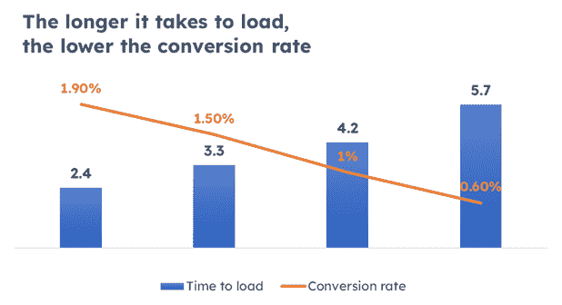
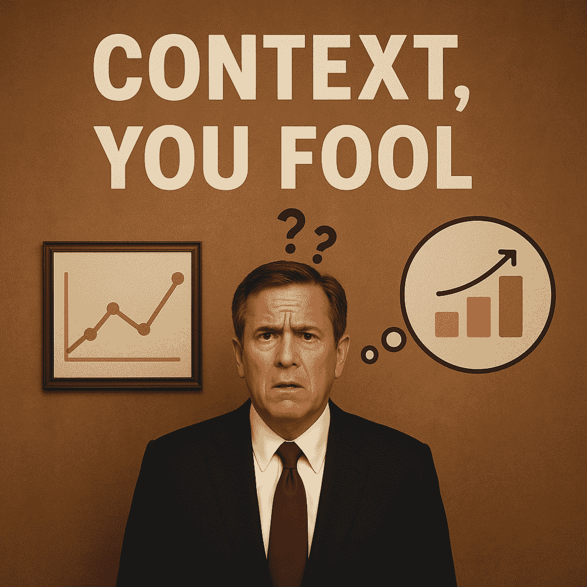

# 2025 年的数据素养是什么？它不是你所想的

> 原文：[`towardsdatascience.com/what-is-data-literacy-in-2025-its-not-what-you-think/`](https://towardsdatascience.com/what-is-data-literacy-in-2025-its-not-what-you-think/)

<mdspan datatext="el1753891982305" class="mdspan-comment">你</mdspan>听说过人类的注意力持续时间比金鱼还短吗？

**根据微软 2015 年的研究，人类的平均注意力持续时间从 2000 年的 12 秒下降到 2013 年的 8 秒。同一份报告还指出（使用一个非常直观的视觉图表），这一事实正式使我们超越了金鱼，金鱼达到了惊人的 9 秒[1]。**

也许幸运的是，这个说法缺乏坚实的同行评审研究，并且后来受到了批评。“金鱼”的比较更多地是为了引起轰动，而不是科学准确性。金鱼有 9 秒注意力持续时间的想法也起源于炒作，而不是严格的科学研究。事实上，金鱼可以记住任务数月，并学习空间路线[2]，[3]。

尽管如此，该研究的作者并没有离更现实的值太远。多项调查和评论表明，我们专注于单个屏幕的时间已经从 2004 年的大约 2.5 分钟减少到现在的约 47 秒。原因包括压力、焦虑、睡眠问题和持续的提醒，以及多任务处理或不断检查手机以获取新消息[4]。

图 1. 由[Kabita Darlami](https://unsplash.com/@itskabita?utm_content=creditCopyText&utm_medium=referral&utm_source=unsplash)在[Unsplash](https://unsplash.com/photos/orange-fish-in-fish-tank-H2t6xbDsbvQ?utm_content=creditCopyText&utm_medium=referral&utm_source=unsplash)拍摄的照片

人们不仅只能集中注意力几分钟，而且他们还倾向于忘记他们所听到的，有时甚至瞬间忘记。我们经常忘记生日和名字；我们离开会议时没有回忆起所说的话；我们分享了一些东西然后忘记了；等等[5]。

最后，我们很容易感到沮丧。给我一个障碍，哪怕是很小的，我也会失去兴趣和专注。以互联网页面和电子商务为例。页面加载时间延长 1 秒会导致转化率下降 20%[6]。而且，根据我的经验，像选择非最佳配送方式这样的障碍可能会使其完全停滞。

图 2. 作者基于[6]绘制的图表

## 本篇文章内容：

**我的观点是：今天，真正吸引人们的注意力和理解力是非常具有挑战性的。我们需要做的时间越长，想要传达的信息越复杂，我们失败的风险就越大。**

在我过去的一些文章中，我写到了数据素养的概念[7]以及与那些不具备数据素养的人交流[8]。

**在这里，我想强调一种不同类型的悖论：与那些由于我之前概述的问题而常常表现得像数据素养不足的人交流。** 这在实践中意味着什么？我们如何与这样的受众沟通，以便帮助他们真正理解、保持参与、有意义地互动，并最终做出明智的决策？

我可以立即说这并不容易。我经常发现自己向那些我知道非常胜任、对数据了如指掌、聪明且有经验的人展示。我投入时间精心制作我认为清晰、结构化的叙述，并辅以坚实的数据支持。然而，我未能成功传达。

**为什么会发生这种情况？我在哪里做错了——或者还没有做到——可以产生影响？我计划改变什么？让我在这里尝试解开这个谜团。**

## 我们用什么来理解数据素养（我们是否应该继续使用它）？

几年前，数据素养被理解为相对狭窄、技术性的概念。传统的数据素养概念主要关注阅读、解释和操作数据的能力。它强调数学能力、理解力和对基本工具的熟练使用，例如使用电子表格、图表或统计方法。在那个背景下，“数据素养”的人可能是一位能够生成报告和总结趋势的商业分析师，一位能够解释教科书中的图表的学生，一位在 Excel 中跟踪销售的管理者，或者一位阅读人口普查数据的政策制定者。讲故事、互动或受众参与很少是讨论的一部分。这主要关于技术理解——而不是沟通、说服或洞察力。

随着时间的推移，数据素养的概念已经被重塑。这在很大程度上是由于诸如 Cole Nussbaumer Knaflic、Brent Dykes、Nancy Duarte 以及在一定程度上我自己这样的作者推广数据驱动叙事的结果。如今，数据素养不再仅仅是阅读图表或处理数字；它还包括有效地构建洞察力、吸引不同受众以及通过清晰、情境感知的叙述来影响决策的能力。

在这种现代观点中，情境不仅重要，而且是基础性的。它决定了给定故事是否成功。如今，更多的数据并不意味着更多的清晰。那个旧观念已经消失了。现在，重点是目的性的简化。这是关于满足受众期望和利用智能叙事设计。目标不仅仅是展示数字。而是引导决策者——使他们理解和采取真正重要的事情。

最终，现代数据素养的一个关键方面是在客观性和说服力之间取得平衡。以数据驱动并不意味着用原始事实淹没人们；它意味着讲述既真实又可操作的故事——将数据与决策联系起来，使人们能够理解和信任。

**现代数据素养不是关于知道公式——而是关于理解要问什么问题。**

**这更多关乎判断、背景和怀疑精神，而不是数学。尤其是在现在，当 AI 可以使错误的结论看起来光鲜亮丽、令人信服时，真正的数据素养意味着要超越仪表盘去思考。**

## “数据素养”的现实

### 情景：一个破裂的对话

我自信地走进公司 CEO 的办公室。我花了好几个小时为她准备了一个干净、数据驱动的故事。我注意到了背景、可视化以及清晰的结论。我相信我结构得很好：原因、数据、建议。

我开始展示。

一分钟内，她瞥了一眼手机。在关键洞察的中途，她打断了我：

“等等——为什么这个数字和上周我看到的不同？”

我转换话题来解释，但这样做却打乱了叙述的流畅性。

她问了一个似乎与主题无关的问题。我回答了，但现在我在幻灯片之间跳来跳去，失去了我精心构建的逻辑。

注意力已经转移。

她感到困惑。

我感到沮丧。

她并不关心。

我们俩离开会议时，对决定的内容（如果有的话）并不清楚。

### 现代数据素养的陷阱

**这是一个假情景吗？当然不是。我自己就经历过一个非常类似的情况，不超过几周前。**

**而且你知道吗？** 我真的相信我已经准备得非常完美。我有坚实、经过验证的数据，一个连贯的故事，以及一个明确的目标。一切都有条理、逻辑性强且相关。在我心中，这是无懈可击的。但当我展示时，事情出了轨。尽管我做了准备，但会议并未达到预期。为什么？

**当数据素养不足以支撑时**

在今天这个高速度、充满干扰的工作场所，即使是高度数据素养的专业人士也越来越表现得像数据素养不足。这不是因为无能，而是因为我们所有人所处的环境。人们被仪表盘、KPI、警报和跨多个平台的电子邮件所轰炸。这是持续的噪音。结果是认知过载——我们的大脑无法处理或保留所有信息，包括相关信息。

此外，不断的背景切换——从一个会议到下一个，从战略到运营，从产品到财务——破坏了从开始到结束集中注意力和遵循逻辑数据叙述的能力。

即使数据被清晰、逻辑地呈现，事情仍然可能出错。为什么？因为数据沟通中最被低估的因素之一：**背景**。背景的不一致是好的故事未能打动人心的主要原因之一[9]。

作为演示者，我们假设有一个共同的理解——我们的观众知道定义，记得过去的决策，或者以我们同样的方式看待商业格局。然而，在现实中，我们的观众可能从完全不同的角度来处理问题：短期 KPI 与长期目标，运营痛点与战略转变，或者简单地不同的比较基准。**因此，当他们对问题提出质疑或挑战假设时，并不是因为数据错误——而是因为我们没有在他们所处的语境中用他们的语言进行交流。**

这种不匹配往往破坏了故事的流畅性，并损害了信任。更糟糕的是，在高风险环境中，数据可能被解读为对抗而非洞见。它引发的是防御性，而非对话。

图像 4。由作者在 ChatGPT 中生成的图像。

问题被我们现在依赖的工具放大了。随着 ChatGPT 等 AI 平台的出现，洞见比以往任何时候都更容易获得。这些工具可以自动生成摘要、标记异常，甚至提出决策建议。但它们也使得将自动化误认为是理解变得容易。

一个整洁的仪表板或自然语言摘要给人带来清晰的错觉。但洞见≠真相。它总是被过滤、建模和框架化——通常由机器，有时由人完成。**当我们未能质疑这些洞见背后的假设或跳过必要的背景，我们就陷入了所谓的虚假数据素养：我们感觉自己是受信息的，但我们并没有批判性地与数据互动。**

同时，商业决策正在变得越来越迅速。速度受到奖励；深度被边缘化。自助工具承诺赋予权力，但往往掩盖了复杂性，鼓励表面层次的互动。快速判断取代了深思熟虑的反思。人们接触到的数据比以往任何时候都多——但时间更少，背景更少，误解的风险更大。

## 新的数据素养

**在当今的格局中，传统的数据处理技能——如阅读图表、计算指标和构建仪表板——已经不再足够。** 现代的数据素养意味着能够构建洞见、应对模糊性，并将数字转化为决策。这关乎理解叙事、情感和政治背景，以及时机。**这关乎知道如何挑战 AI 生成的洞见，而不仅仅是接受它们。**

**新的数据素养意味着：**

+   学习背景：理解观众是谁以及什么对他们来说很重要，

+   发展挑战洞见的能力，尤其是那些由算法生成的洞见。

+   练习叙事思维：引导人们，而不仅仅是告知他们，

+   超越仪表板思考：关注判断、相关性和时机。

## 如何为今天的数据（非）文盲构建基于数据的故事？

所有这些都可能在理论上听起来很稳固——而且确实是。但你可以正确地问道：

> 如果你声称在上述情景中准备得很好，是什么让你认为这些策略会奏效？

现在诚实地回答：没有保证。这就是在当今环境中与人合作和数据工作的美丽与挫折。我写下的每一件事——速度、不可预测性、破碎的注意力——都创造了在任何时候都可能脱轨的条件。事实是，误解或脱轨的风险始终很高。房间里接收你故事的人越多，事情出错的可能性就越大。这些风险不仅仅是累加，随着观众中每一个新人的加入，它们还会成倍增加。

无论风险大小，我已经制定了一系列实用步骤来帮助最大化成功的可能性。我将它们分为两部分。第一部分关注会议前的准备工作——作为你最佳防御线的策略。毕竟，预防总是胜于治疗。但当事情没有按计划进行时，第二部分提供即时的策略——一种在会议期间或之后立即使用以恢复正轨的应急包。

### 现代数据素养：指导性措施

**关注锚点：**始终确保观众知道他们在看什么。尽早设定清晰的锚点：情景是什么，正在审查哪个关键绩效指标，以及有多少收入或年度目标处于风险之中？没有这个背景，人们无法判断你所说内容的重要性。锚点为数字提供背景，并帮助观众在整个故事中保持方向。

**确保故事的一致性：**你的数据在技术上正确是不够的，它还需要与之前展示的内容以及你正在构建的叙事保持一致。如果你在故事的一部分中引用了一个数字，然后在屏幕上展示了一个不同的数字——说，“哦，那个还没有更新，但想象它是正确的”——你立刻就会失去观众的信任和注意力。这些小的不一致性可能会造成重大的干扰，尤其是对于那些已经努力保持专注的人来说。确保所有数字、视觉和评论都是同步的并且是最新的，这样你的故事才会感觉连贯、可信和深思熟虑。

**陈述目标、关键信息和结论：**在一个充满噪音的世界里，模糊性是你的敌人。明确无误地说明你为什么在说话，观众应该带走什么，以及期望采取什么行动。不要将目标埋在幻灯片中，或者希望他们“最终明白”。一开始就说出：“我们在这里是为了决定是否投资 X。”随着你的进行，重复关键信息，并清楚地得出结论。对于注意力疲劳的观众来说，清晰不是加分项，而是生命线。当你的目的明确时，你的故事就有方向，观众也知道如何参与。

**明确你的观点：** 清楚地说明你为什么在那里以及你想要实现什么。例如：“我们在这里是为了决定 X。”尽早明确地陈述你的主要信息，并在整个过程中重复它。不要假设人们会从上下文中理解——让它明显。以一个明确、可操作的结果结束。如果人们不理解目标，他们就不会跟随故事，更不会采取行动。

**切断悬念：** 不要逐步引入你的观点——直接提出。注意力是有限的，今天的观众没有耐心慢慢揭露。立即陈述关键信息或洞察，然后提供支持数据。如果你等得太久，你可能会在到达之前就失去听众。让你的故事容易进入，快速跟随，并且迅速掌握。

**确保适当的流程：** 构建一个清晰、连贯的叙事。将背景故事缩减到只有观众真正需要理解观点的部分。以核心信息为起点，并构建你的内容，使其从洞察到行动的逻辑流程。消除干扰和旁枝末节——它们会稀释你的信息。

**验证、交叉检查、练习：** 在你展示之前，对你的故事进行压力测试。验证你的数据，双重检查关键数字，并确保从总结到图表的一切都一致。进行交叉检查以确保一致性：你的语言是否清晰，你的视觉是否准确，并且它们是否都支持相同的信息？然后，进行练习。排练有助于发现弱点、混乱的过渡或观众可能会迷失的时刻。你练习得越多，你在关键时刻就越自信、越专注。

最后，**成为一个讲故事的老尤达**：清晰、结构化和冷静的引导——这些是你的工具。明智地说话，仔细构建你的思想，并帮助他人看到他们需要看到的东西。不要用数据堆叠或复杂的逻辑压倒他们。相反，用意图和同理心引导你的观众通过故事。不要专注于展示你有多了解，而要专注于帮助他们理解什么才是重要的。

图 5. 由[Nick Möllenbeck](https://unsplash.com/@nick_moellenbeck?utm_content=creditCopyText&utm_medium=referral&utm_source=unsplash)在[Unsplash](https://unsplash.com/photos/a-statue-of-yoda-in-front-of-a-building-dJEPPwXAk7w?utm_content=creditCopyText&utm_medium=referral&utm_source=unsplash)拍摄

### 现代数据素养：如果事情没有按计划进行……

好的。现在你已经完成了你的作业，你走进会议室，猜猜看？20 分钟后，你带着和之前同样的结果出来了。

在会议期间以及之后，你可以做些什么来进一步降低风险，或者如果不良情景最终发生，最小化损失。

#### 会议期间

1.  **记住你仍然是一个讲故事的老尤达**。最重要的是，不要慌张。专注于你的目标，保持冷静，不要让压力动摇你的信心。**你必须保持冷静，我的学徒……**

1.  **频繁重新锚定**：从你的锚点开始——但不要止步于此。在整个会议过程中，提醒听众情景、受影响的 KPI 和业务影响（例如，“这使我们的第三季度 12%的收入面临风险”）。重复锚点有助于保持方向并加强相关性。

1.  **在必要时重申目标**：如果对话开始偏离，将其重新聚焦到原始**目标**。简单的短语，如“让我们重新聚焦——我们在这里是为了决定 X”，可以重置注意力并阐明下一步。

1.  **注意混乱的信号**：寻找诸如沉默、无关的问题或跳过关键点等线索。这些都是人们迷失或失去兴趣的迹象。暂停，回放到关键点，并澄清。不要在混乱中强行推进——公开、冷静地处理它。

1.  **使用指示性语言**。这有助于集中注意力，尤其是在注意力开始分散时：

    +   “这里是关键点……”

    +   “这就是我们做出决定的地方……”

    +   “现在，让我们将这一点与 KPI 联系起来。

1.  **经常总结**。每 5-7 分钟，进行简短的回顾。这有助于记忆和决策：

    +   已经讨论的内容

    +   为什么这很重要

    +   需要什么决策或反馈

1.  **确保做笔记**。确保有人正在做笔记，捕捉关键结论和要点，并最终进行对齐。最终，你可以使用 AI 脚本生成器（例如，如果会议在线举行，Zoom 应用中可用），但这些工具目前并不总是准确，所以我不建议完全依赖它们。

1.  **引导波浪**：周围有各种干扰的超级专注的人容易偏离主题——他们越资深或越重要，这种情况就越可能发生。如果我可以分享的话，让我个人烦恼的是，当我分心时，他们会打断我并向听众为我道歉。然而，当讨论脱轨时，这 somehow 完全是可以接受的。小小的挫折——感谢让我发泄……还有，为偏离主题道歉……😊

    无论如何，在这种情况下你能做什么？

    保持冷静，引导对话回到正题，不要指责任何人。使用温和的框架，比如，“那是一个很好的观点，我认为我们可以将其与……联系起来”或“让我快速将其与我们在讨论的主要关键绩效指标联系起来……”你的任务是驾驭波浪，而不是抵制它——将精力引导回核心信息，加强你的锚点，并保护叙事流程，同时不要让它变得个人化。

图像 6. 由[Mark Harpur](https://unsplash.com/@luckybeanz?utm_content=creditCopyText&utm_medium=referral&utm_source=unsplash)在[Unsplash](https://unsplash.com/photos/a-person-surfing-on-the-waves-t7pM60b9cDM?utm_content=creditCopyText&utm_medium=referral&utm_source=unsplash)拍摄的照片

#### 会议之后

**发送后续总结**。包括：

+   会议的目标，

+   关键数据点和锚点

+   主要结论或开放性问题，

+   下一步或做出的决策。

即使会议出了问题，清晰的后续跟进也可以重新构建故事并恢复清晰。

**及时澄清误解：** 如果有什么被误解或受到质疑，直接跟进。比如说：“让我澄清我们讨论的数据——我已经交叉检查过，这是确切的情况。”快速关闭循环可以恢复信任。

**记录下没有达到预期的地方。** 使用这些洞察来修改你下一次的材料或故事。注意以下几点：

+   人们感到困惑的地方

+   他们被什么分心

+   哪些问题打乱了流程

**如有需要，预订简短的总结会议：** 如果决策没有发生或感觉没有解决，提出一个有针对性的简短后续会议：“我想用 15 分钟来结束我们的讨论。我已经整理了关键点，以便更快地达成一致。”

**反思并调整**。问问自己：

+   我是否以结论为开头？

+   我的锚点是否清晰且重复？

+   观众是否拥有了他们需要采取行动的东西？

**每一次会议都是一次测试——也是一次为下次改进演讲的机会。**

### 技术是用来帮助的

…但我们还需要保持一点老式风格。

在我写这些的时候，有一件事让我印象深刻：今天，我们高度依赖技术——尤其是 LLMs 和 AI 代理。这很大程度上是好事。这些工具提高了我们的生产力，帮助我们扩展规模，并以无数种方式简化我们的生活。但无论它们变得多么先进，它们都无法取代人类互动的深度——真正的接触，真诚的情感，或者当下产生的紧张感。即使准备得再好，视觉效果再完美，甚至故事再无懈可击，如果我们忘记了沟通中的“人性”部分，它们也不会奏效。我们需要将永恒的技能——如勤奋、准确性、同理心和情感意识——与现代工具相结合，这些工具帮助我们有效地分析和展示数据。

这并不意味着放弃这些现代工具。但这确实意味着不要完全依赖它们。想象一下去一场大型音乐会。你最近去过吗？一个主要的乐队，一个满座的场馆，人群中的能量在沸腾？

然后你可能已经注意到很多人是通过他们的手机屏幕来体验它的……

图 7。由作者使用 ChatGPT 生成的图像。

个人来说，我不理解。我更喜欢在当下体验音乐会——沉浸在音乐中，与他人分享能量，也许还会跳起来（好吧，或许不包括我），欣赏风景，声音，气味——一切。在手机屏幕上观看它远远不够。可能只有 1%的真实体验，而且即使那样，也是以错过当下的代价为代价，因为我太忙于记录它了。

**现在，让我们将这和不久前的音乐会感受进行比较……**

来源：YouTube

**看吧？** 充满活力的音乐让大量人群跳舞和跳跃。**音乐家使用现代乐器，看起来很未来派。就像我们使用的那些最先进的应用程序和工具一样。现在问问自己——哪个版本真正让你沉浸其中？选择权在你手中。**

## 结论

今天的数据素养不再仅仅是解读图表或构建仪表盘；它还涉及到理解背后的概念和原则。这是关于在数据、干扰和决策压力过载的环境中导航——即使聪明、经验丰富的专业人士也可能表现得像数据文盲。新的数据素养深深植根于人性，关注情境、清晰度、同理心和判断力。这意味着了解什么对谁重要，引导注意力，并将信息转化为行动。虽然没有保证的公式能让每个数据故事都成功，但我们可以通过简化信息、强化意义和预见干扰来提高成功的几率。当事情变得不顺利——这通常是会发生的情况——我们可以适应、恢复并学习。**最终，将洞察力与人连接的能力定义了今天真正的数据素养。**

## 参考文献

[1] [我们是否不如金鱼？](https://law.temple.edu/aer/2024/01/06/are-we-no-better-than-goldfish), Jules M Epstein

[2] [像金鱼一样记忆？这可能是件好事](https://www.theguardian.com/science/article/2024/jul/31/memory-like-a-goldfish-why-this-could-be-a-good-thing?utm_source=chatgpt.com)

[3] [打破社交媒体毁了我们的平均注意力跨度金鱼神话](https://marketinginsidergroup.com/content-marketing/thanks-social-media-average-attention-span-now-shorter-goldfish), Michael Brenner

[4] [容易分心？如何提高你的注意力跨度](https://apnews.com/article/attention-span-improve-focus-social-media-2334290ba5d8206c18aeca0090be2f3f), Devi Shastri, Laura Barggeld

[5] 我的个人经历 🙂

[6] [网站性能如何影响转化率](https://www.cloudflare.com/learning/performance/more/website-performance-conversion-rates)

[7] [数据素养的力量](https://towardsdatascience.com/the-might-of-data-literacy-3d91fcc5f46b), Michal Szudejko

[8] [如何与非数据人员谈论数据和数据分析](https://towardsdatascience.com/how-to-talk-about-data-and-analysis-to-non-data-people-2457dc600219)，Michal Szudejko

[9] [数据驱动故事讲述中情境的力量](https://towardsdatascience.com/power-of-context-in-data-driven-storytelling-b4dc48a402e), Michal Szudejko

* * *

### 免责声明

*本文使用 Microsoft Word 编写，拼写和语法均经 Grammarly 检查。我审查并调整了任何修改，以确保我的意图信息得到准确反映。所有其他 AI（图像和样本数据生成）的使用均直接在文本中披露。*
