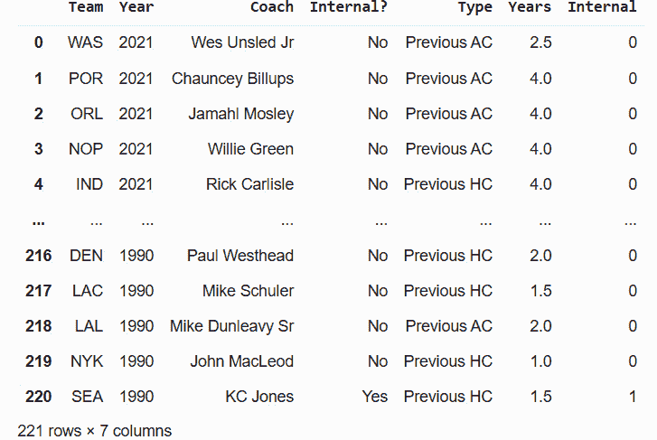
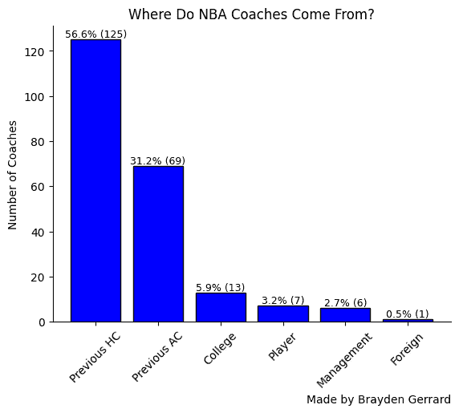
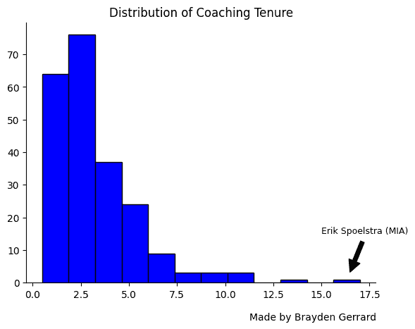
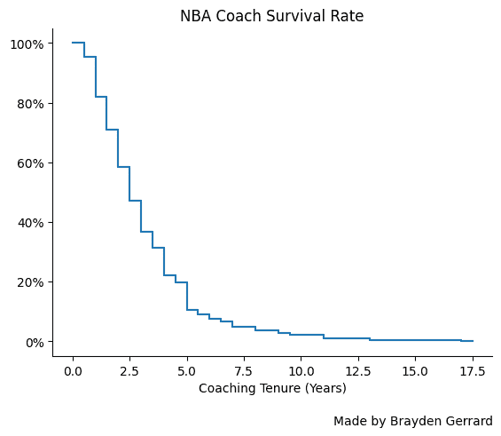
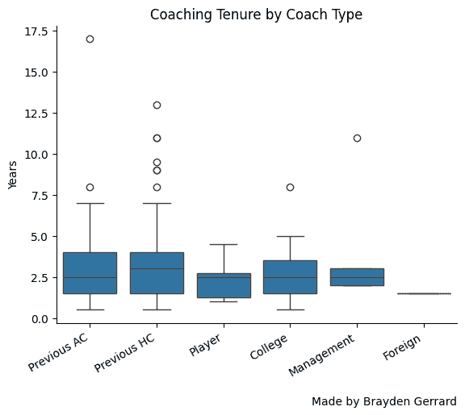
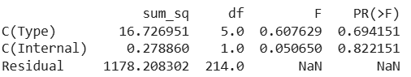
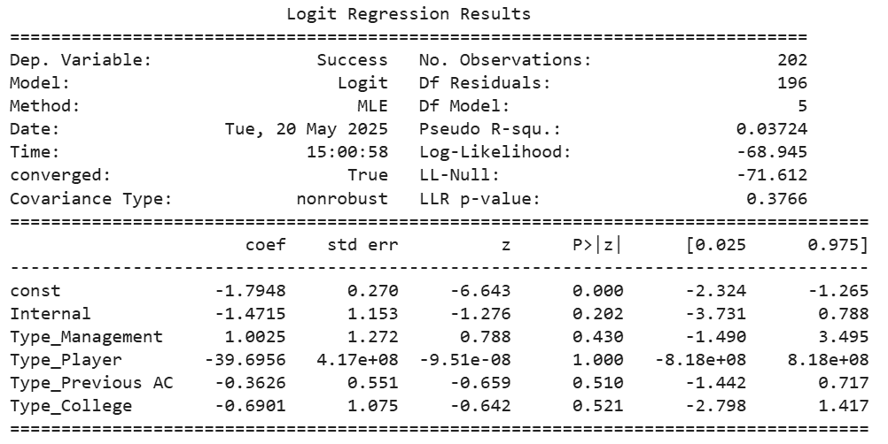
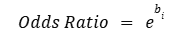

# NBA 教练的统计数据能告诉我们什么

> 原文：[`towardsdatascience.com/what-statistics-can-tell-us-about-nba-coaches/`](https://towardsdatascience.com/what-statistics-can-tell-us-about-nba-coaches/)

<mdspan datatext="el1747887301355" class="mdspan-comment">谁会被聘为 NBA 教练？一位典型的教练任期有多长？他们的教练背景在预测成功中扮演任何角色吗？</mdspan>

本分析受到了几个关键理论的影响。首先，业余 NBA 球迷中普遍存在一种批评，即球队过于偏好聘请有前 NBA 主教练经验的候选人。

因此，本分析旨在回答两个相关的问题。首先，NBA 球队是否经常重新聘请有前主教练经验的候选人？其次，是否有证据表明这些候选人的表现相对于其他候选人较差？

第二个理论是，内部候选人（尽管很少被聘请）通常比外部候选人更成功。这一理论源于两个轶事。NBA 历史上最成功的两位教练，圣安东尼奥的格雷格·波波维奇和迈阿密的埃里克·斯波尔斯特拉，都是内部聘请的。然而，需要严格的定量证据来测试这种关系是否在更大的样本中成立。

本分析旨在探讨这些问题，并提供在 Python 中重现分析的代码。

## 数据

该项目的代码（包含在 Jupyter 笔记本中）和数据集可在 GitHub 上[此处获取](https://github.com/braydengerrard/NBACoaches)。分析是在 Google Colaboratory 中使用 Python 进行的。

本分析的一个先决条件是确定一种衡量教练成功的方法。我决定采用一个简单的方法：教练在该职位上的任期最能衡量其成功。任期最能代表对教练可能存在的不同期望。被聘为竞争球队的教练预计要赢得比赛并产生深入的季后赛。被聘为重建球队的教练可能被评判为年轻球员的发展以及他们建立强大文化的能力。如果教练达到期望（无论这些期望是什么），球队将保留他们。

由于没有现有的数据集包含所有所需数据，我自行从维基百科收集了数据。我记录了从 1990 年到 2021 年每个赛季的教练变动。由于主要结果变量是任期，因此排除了赛季中的教练变动，因为这些教练通常带有“临时”标签——意味着他们是为了在找到永久替代者之前暂时担任。

此外，还收集了以下变量：

| **变量** | **定义** |
| --- | --- |
| 球队 | 教练被聘用的 NBA 球队 |
| 年份 | 教练被聘用的年份 |
| 教练 | 教练的姓名 |
| 内部？ | 如果教练是内部人员或不是——这意味着他们在被聘为主教练之前以某种形式为该组织工作 |
| 类型 | 教练的背景。类别包括前任 HC（以前的 NBA 主教练经验）、前任 AC（以前的 NBA 助理教练经验，但没有主教练经验）、大学（大学球队的教练）、球员（没有教练经验的 NBA 前球员）、管理层（有管理层经验但没有教练经验的人）和外国（在北美以外地区教练，但没有 NBA 教练经验的人）。 |
| 年限 | 教练担任该角色的年数。对于中途被解雇的教练，该值计为 0.5。 |

首先，从 Google Drive 的位置导入数据集。我还将“内部？”转换为虚拟变量，将“是”替换为 1，“否”替换为 0。

```py
from google.colab import drive
drive.mount('/content/drive')

import pandas as pd
pd.set_option('display.max_columns', None)

#Bring in the dataset
coach = pd.read_csv('/content/drive/MyDrive/Python_Files/Coaches.csv', on_bad_lines = 'skip').iloc[:,0:6]
coach['Internal'] = coach['Internal?'].map(dict(Yes=1, No=0))
coach
```

这会打印出数据集的预览：



总共，这个数据集包含在这个时间段内的 221 次教练招聘。

## 描述性统计

首先，计算并可视化基本摘要统计量，以确定 NBA 主教练的背景。

```py
#Create chart of coaching background
import matplotlib.pyplot as plt

#Count number of coaches per category
counts = coach['Type'].value_counts()

#Create chart
plt.bar(counts.index, counts.values, color = 'blue', edgecolor = 'black')
plt.title('Where Do NBA Coaches Come From?')
plt.figtext(0.76, -0.1, "Made by Brayden Gerrard", ha="center")
plt.xticks(rotation = 45)
plt.ylabel('Number of Coaches')
plt.gca().spines['top'].set_visible(False)
plt.gca().spines['right'].set_visible(False)
for i, value in enumerate(counts.values):
    plt.text(i, value + 1, str(round((value/sum(counts.values))*100,1)) + '%' + ' (' + str(value) + ')', ha='center', fontsize=9)
plt.savefig('coachtype.png', bbox_inches = 'tight')

print(str(round(((coach['Internal'] == 1).sum()/len(coach))*100,1)) + " percent of coaches are internal.")
```



超过一半的教练招聘之前曾担任过 NBA 主教练，近 90%的人有某种形式的 NBA 教练经验。这回答了提出的第一问题——NBA 球队对经验丰富的主教练有强烈的偏好。如果你被聘为 NBA 教练一次，再次被聘用的几率会大大提高。此外，13.6%的招聘是内部招聘，这证实了球队并不经常从自己的队伍中招聘。

其次，我将探讨 NBA 主教练的典型任期。这可以通过直方图来可视化。

```py
#Create histogram
plt.hist(coach['Years'], bins =12, edgecolor = 'black', color = 'blue')
plt.title('Distribution of Coaching Tenure')
plt.figtext(0.76, 0, "Made by Brayden Gerrard", ha="center")
plt.annotate('Erik Spoelstra (MIA)', xy=(16.4, 2), xytext=(14 + 1, 15),
             arrowprops=dict(facecolor='black', shrink=0.1), fontsize=9, color='black')
plt.gca().spines['top'].set_visible(False)
plt.gca().spines['right'].set_visible(False)
plt.savefig('tenurehist.png', bbox_inches = 'tight')
plt.show()

coach.sort_values('Years', ascending = False)
```

```py
#Calculate some stats with the data
import numpy as np

print(str(np.median(coach['Years'])) + " years is the median coaching tenure length.")
print(str(round(((coach['Years'] <= 5).sum()/len(coach))*100,1)) + " percent of coaches last five years or less.")
print(str(round((coach['Years'] <= 1).sum()/len(coach)*100,1)) + " percent of coaches last a year or less.")
```



使用任期作为成功的指标，数据显示大多数教练都是不成功的。中位任期仅为 2.5 个赛季。18.1%的教练任期为一个赛季或更短，而仅有不到 10%的教练任期超过 5 个赛季。

这也可以被视为生存分析图，以查看在各个时间点的下降情况：

```py
#Survival analysis
import matplotlib.ticker as mtick

lst = np.arange(0,18,0.5)

surv = pd.DataFrame(lst, columns = ['Period'])
surv['Number'] = np.nan

for i in range(0,len(surv)):
  surv.iloc[i,1] = (coach['Years'] >= surv.iloc[i,0]).sum()/len(coach)

plt.step(surv['Period'],surv['Number'])
plt.title('NBA Coach Survival Rate')
plt.xlabel('Coaching Tenure (Years)')
plt.figtext(0.76, -0.05, "Made by Brayden Gerrard", ha="center")
plt.gca().yaxis.set_major_formatter(mtick.PercentFormatter(1))
plt.gca().spines['top'].set_visible(False)
plt.gca().spines['right'].set_visible(False)
plt.savefig('coachsurvival.png', bbox_inches = 'tight')
plt.show
```



最后，可以生成箱线图来查看基于教练类型的任期是否存在任何明显差异。箱线图还会显示每个组的异常值。

```py
#Create a boxplot
import seaborn as sns

sns.boxplot(data=coach, x='Type', y='Years')
plt.title('Coaching Tenure by Coach Type')
plt.gca().spines['top'].set_visible(False)
plt.gca().spines['right'].set_visible(False)
plt.xlabel('')
plt.xticks(rotation = 30, ha = 'right')
plt.figtext(0.76, -0.1, "Made by Brayden Gerrard", ha="center")
plt.savefig('coachtypeboxplot.png', bbox_inches = 'tight')
plt.show
```



在这些小组之间存在一些差异。除了管理层的招聘（样本量仅为六人）之外，前任主教练的平均任期最长，为 3.3 年。然而，由于许多小组的样本量较小，我们需要使用更高级的技术来测试这些差异是否具有统计学意义。

## 统计分析

首先，为了测试类型或内部是否在组均值之间存在统计学上的显著差异，我们可以使用方差分析（ANOVA）：

```py
#ANOVA
import statsmodels.api as sm
from statsmodels.formula.api import ols

am = ols('Years ~ C(Type) + C(Internal)', data=coach).fit()
anova_table = sm.stats.anova_lm(am, typ=2)

print(anova_table)
```



结果显示高 p 值和低 F 统计量——表明没有证据表明均值之间存在统计学上的显著差异。因此，初步结论是，没有证据表明 NBA 球队低估了内部候选人或高估了前任主教练的经验，正如最初假设的那样。

然而，在比较组平均数时可能会出现可能的扭曲。NBA 教练签订的合同通常在三年到五年之间。即使教练因表现不佳而提前解雇，球队通常也必须支付合同剩余部分。一个任职两年的教练可能并不比任职三年或四年的教练差——这种差异可能仅仅归因于初始合同的长度和条款，而这反过来又受到教练在市场上的吸引力的影响。由于有经验的教练非常受欢迎，他们可能会利用这种杠杆来谈判更长的合同和/或更高的薪水，这两者都可能阻止球队过早终止他们的雇佣。

为了考虑到这种可能性，可以将结果视为二元而不是连续的。如果一个教练任职超过 5 个赛季，那么他们很可能至少完成了他们的初始合同期限，并且球队选择延长或重新签订合同。这些教练将被视为成功，那些任职五年或更短的将被归类为不成功。为了进行这项分析，必须排除 2020 年和 2021 年的所有教练雇佣，因为他们还没有能够超过 5 个赛季。

对于二元因变量，逻辑回归可以用来检验哪些变量可以预测教练的成功。内部和类型都被转换成了虚拟变量。由于前任主教练代表最常见的教练雇佣情况，我将这一类别设定为“参考”类别，其他类别将与之进行比较。此外，数据集中只有一个外籍雇佣的教练（大卫·布拉特），因此这个观察结果被从分析中排除。

```py
#Logistic regression
coach3 = coach[coach['Year']<2020]

coach3.loc[:, 'Success'] = np.where(coach3['Years'] > 5, 1, 0)

coach_type_dummies = pd.get_dummies(coach3['Type'], prefix = 'Type').astype(int)
coach_type_dummies.drop(columns=['Type_Previous HC'], inplace=True)
coach3 = pd.concat([coach3, coach_type_dummies], axis = 1)

#Drop foreign category / David Blatt since n = 1
coach3 = coach3.drop(columns=['Type_Foreign'])
coach3 = coach3.loc[coach3['Coach'] != "David Blatt"]

print(coach3['Success'].value_counts())

x = coach3[['Internal','Type_Management','Type_Player','Type_Previous AC', 'Type_College']]
x = sm.add_constant(x)
y = coach3['Success']

logm = sm.Logit(y,x)
logm.r = logm.fit(maxiter=1000)

print(logm.r.summary())

#Convert coefficients to odds ratio
print(str(np.exp(-1.4715)) + "is the odds ratio for internal.") #Internal coefficient
print(np.exp(1.0025)) #Management
print(np.exp(-39.6956)) #Player
print(np.exp(-0.3626)) #Previous AC
print(np.exp(-0.6901)) #College
```



与方差分析的结果一致，在任何一个常规阈值下，没有任何变量具有统计学意义。然而，对系数的更仔细检查讲述了一个有趣的故事。

β系数代表结果的对数优势的变化。由于这很难解释，可以将系数转换为以下形式的优势比：



内部候选人的几率比率为 0.23——这意味着内部候选人比外部候选人成功的机会低 77%。管理人员的几率比率为 2.725，这意味着这些候选人成功的机会高 172.5%。球员的几率比率为零，前任助理教练为 0.696，大学教练为 0.5。由于四分之三的教练类型虚拟变量的几率比率低于 1，这表明只有管理层的聘请比前任主教练更有可能成功。

从实际角度来看，这些效应量很大。那么为什么变量在统计学上不显著呢？

原因是成功教练的样本量有限。在剩余的 202 名教练中，只有 23 名（11.4%）是成功的。无论教练的背景如何，他们持续几个赛季的机会都很低。如果我们具体看看能够超越前任主教练的类别（管理层聘请）：

```py
# Filter to management

manage = coach3[coach3['Type_Management'] == 1]
print(manage['Success'].value_counts())
print(manage)
```

筛选后的数据集中只有 6 个聘请——其中只有一个（金州勇士的史蒂夫·科尔）被归类为成功。换句话说，整个效应完全是由一个成功的观察结果驱动的。因此，要确信存在差异，需要更大的样本量。

在 p 值为 0.202 的情况下，内部变量最接近统计显著性（尽管它仍然远远低于典型的α值为 0.05）。值得注意的是，然而，效应的方向实际上与假设的相反——内部聘请者比外部聘请者成功的可能性更低。在 26 名内部聘请者中，只有一名（迈阿密的埃里克·斯波尔斯特拉）符合成功的标准。

## 结论

总之，这项分析能够得出几个关键结论：

+   不论背景如何，成为 NBA 教练通常是一个短暂的职业。教练能持续几个赛季的情况很少见。

+   NBA 球队强烈倾向于聘请前任主教练的普遍观点是正确的。超过一半的聘请者已经拥有 NBA 主教练的经验。

+   如果球队没有聘请经验丰富的主教练，他们很可能会聘请一名 NBA 助理教练。这两种类别之外的人选尤其罕见。

+   虽然他们经常被聘请，但没有证据表明 NBA 球队过度重视前任主教练。相反，前任主教练平均任职时间更长，更有可能超过他们的初始合同期限——尽管这些差异在统计学上并不显著。

+   尽管有高调的轶事，但没有证据表明内部聘请比外部聘请更成功。

*注意：除非另有说明，所有图像均由作者创建。*
