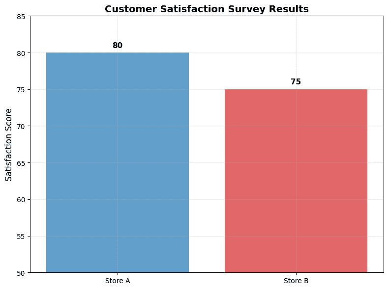
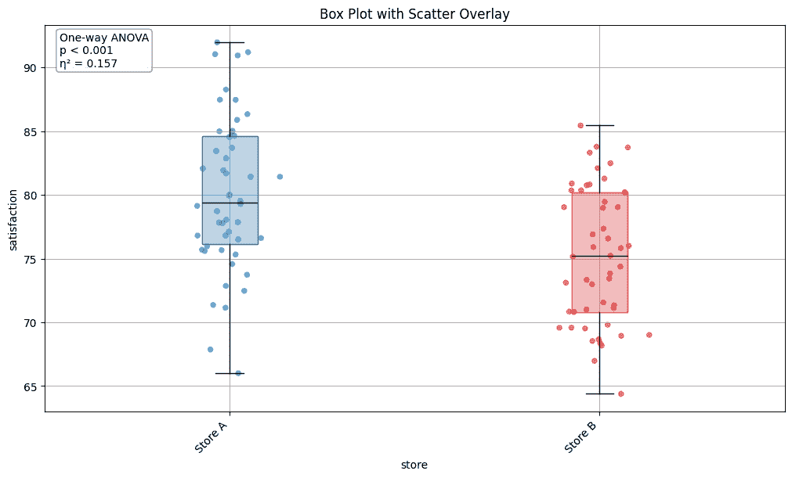
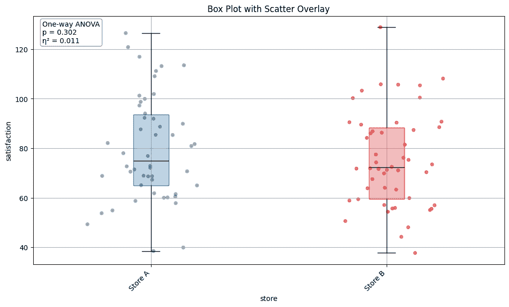
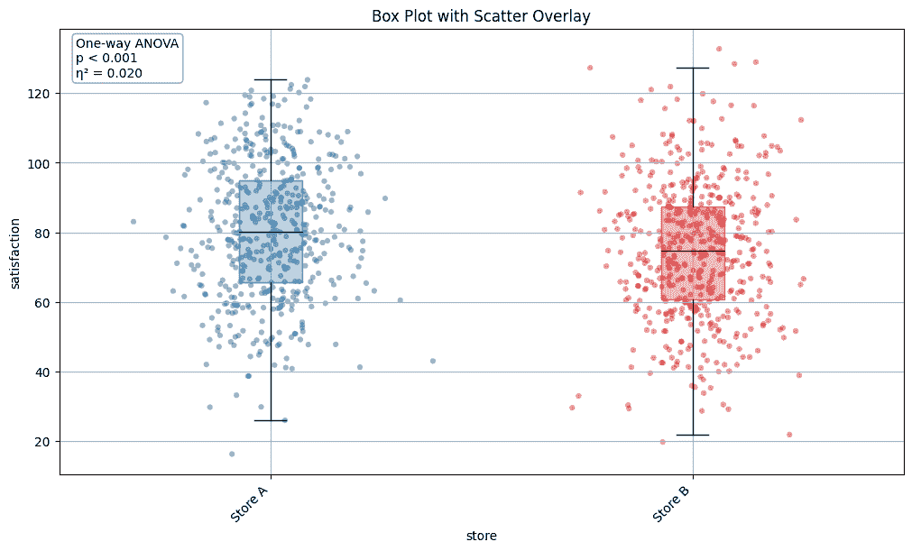

# 当差异实际上会产生影响时

> 原文：[`towardsdatascience.com/when-a-difference-actually-makes-a-difference/`](https://towardsdatascience.com/when-a-difference-actually-makes-a-difference/)

📍**面向商业决策者**：作为一名曾在大学任教并撰写了两本该领域教科书的科学家，我愿意通过分块文章分享我的知识，帮助您自信且清晰地导航数据与 AI 的世界。

<details class="wp-block-details is-layout-flow wp-block-details-is-layout-flow"><summary>ℹ️ *这个符号意味着你可以* ***点击了解更多***</summary>

由于这是一篇分块文章，我将坚持故事线并在正文中涵盖要点。但如果你渴望了解更多或深入研究，更多解释可以在ℹ️下找到。

🔗**面向我的数据专家同行**：在每篇文章旁边，我会分享完整的代码，通常打包成便于集成的实用辅助函数。

* * *

**<mdspan datatext="el1757461390823" class="mdspan-comment">想象一下</mdspan>**：你是两家百货商店 A 和 B 的连锁零售公司的 CEO。你正在审查季度报告，其中条形图显示 A 店在客户满意度方面得分为 80 分（满分 100 分），而 B 店得分为 75 分。你应该复制 A 店的实践并投资于提高 B 店吗？

如果我告诉你，在一个情景中，这个动作可能会让你的公司损失数百万，而在另一个情景中，这恰恰是正确的举措？

> **两种情景之间的区别不在于你看到的数字——而在于你没有看到的数字。**

**🎯在接下来的 10 分钟内，你将学习**：

+   同样的条形图背后可能隐藏着多么不同的商业现实

+   三步揭示完整故事并避免代价高昂的错误解读

* * *

## 摘要的问题

商业决策通常依赖于条形图或折线图显示的简单摘要：

+   各产品间的评分

+   各店铺间的客户满意度

+   团队间的员工参与度

> **但是，这样的摘要隐藏了关键细节——正是这些细节可能会决定你下一步战略行动的成功与否。**

让我们回到商店的例子。当你想象比较 A 店和 B 店的图表时，你看到了什么？可能像下面这样：两个条形，一个比另一个略高。



这里有个转折：**三个不同的商业情景——每个情景都需要不同的决策——可能会产生完全相同的条形图** 🤯。

🔎准备好看到你的数据没有告诉你的内容了吗？

## 条形图隐藏的内容——完整的故事

让我们看看三个非常不同的商业现实，它们可能隐藏在相同的条形图背后。

### 情景 1：小样本，小方差

在情景 1 中，两家商店的样本量相对较小（n = 50）且**方差低**（标准差 = 5）。

<details class="wp-block-details is-layout-flow wp-block-details-is-layout-flow"><summary>ℹ️ ***方差*** 和 ***标准差** **(std)** *衡量数据从平均值偏离的程度**。</summary>

+   **方差**是平均的平方差。它给出了数据点整体分布的感觉，但其单位是平方的，这使得它不太直观。

+   **标准差 (std)** 是方差的平方根。因为它与数据具有相同的单位（例如，满意度分数），所以它更容易直接解释。例如，这意味着大约三分之二的客户满意度分数在平均值的上下约 5 分之内。</details>

这些细节在柱状图中是不可见的。但当我们切换到另一种图表——**箱线散点图**——时，你可以看到每个客户的分数作为一个点，你还可以看到在角落显示的统计测试结果。



上面的图表告诉我们：

+   客户分数紧密围绕着每个店铺的平均值。

+   店铺之间的 5 点差距始终可见。

+   统计测试（方差分析）确认差异是真实的，而不是仅仅由于偶然。

💡**关键洞察：** 在这种情况下，你正确地复制了 A 店的实践，并在 B 店的改进上进行了投资。

<details class="wp-block-details is-layout-flow wp-block-details-is-layout-flow"><summary>ℹ️ ***将 ANOVA 视为裁判：** 它检查组间差异是否足够大，以至于不太可能是随机噪声。*</summary>

+   **ANOVA（方差分析）：** 比较两组或更多组的平均值，并询问，“这个差距是否比随机机会通常创造的差距要大？” 如果是，我们说差异在统计学上是显著的

+   **其他常见测试包括**

    +   **T 测试：** 比较两组的平均值。

    +   **Welch 的 t 测试：** 一种处理具有不等方差组的 t 测试变体。

    +   **Kruskal-Wallis 测试：** 与 ANOVA 类似，但适用于非正态分布的数据；它比较的是组别的排名而不是平均值。

+   **阅读 p 值（商业实用指南）：**

    +   **p 值**告诉你观察到的差异有多可能是由于随机机会。

    +   较小的 p 值意味着差异不太可能是随机的：

        +   p < 0.05 → 有理由相信差异是真实的

        +   p < 0.01 → 非常确信差异是真实的

        +   p < 0.001 → 极度确信差异是真实的

    +   如果一个统计测试**不显著（即，p > 0.05）。** 这并不意味着组间没有差异。它只是意味着，考虑到样本大小和变异性，我们**不能自信地说差异是真实的**——观察到的差距可能是由于随机噪声。

+   **对商业决策者的提示：**选择合适的统计测试取决于你的数据类型、样本量和分布。总是明智地咨询你的数据专家，以确保测试及其结果解释与你的情景相匹配。</details>

📦**对数据专家的提示：**上面的图表可以通过下面的代码轻松制作。除了定制外观外，你还可以选择适合你数据的不同统计测试。请查看[MLarena 在 github 上的文档](https://github.com/MenaWANG/mlarena)以获取详细信息。

```py
from mlarena.utils.plot_utils import plot_box_scatter

fig, ax = plot_box_scatter(scenario_a, 
                           x='store', 
                           y= 'satisfaction', 
                           show_stat_test=True, 
                           stat_test='anova',  
                           palette = colors)
```

### 情景 2：小样本，大方差

在情景 2 中，两家商店仍然有较小的样本量（n = 50）和相同的平均分数（商店 A 为 80，商店 B 为 75）。但现在，客户满意度分数的**方差**很高。这极大地改变了故事：



+   尽管条形图在这两种情景下看起来完全相同，但从上面的箱线散点图可以看出，情景 2 的数据点分布更广。

+   两个商店之间的差异现在很难与随机噪声区分开来。

+   与从图中反映出的直觉一致，统计分析显示差异**不具有统计学意义**。

+   尽管均值与情景 1 相同，但我们**无法自信地得出结论**商店 A 确实优于商店 B。

**💡**关键洞察：****相同的均值差异可以根据数据的**可变性**讲述完全不同的故事。

## 如何处理噪声数据？

当你的数据是噪声的（即，具有高方差）时，你如何进行数据驱动的决策？情景 3 提供了答案。

在情景 3 中，我们保持了与情景 2 相同的高方差，但大幅增加了样本量。这展示了大数据集的力量：



+   数据点仍然广泛分散（与情景 2 相同的高方差）

+   然而，较大的样本量提供了更多的统计功效

+   随着数据点的增加，我们现在可以区分信号和噪声：统计分析显示，尽管方差较高，差异**具有统计学意义**。

+   较大的样本量让我们有信心认为商店 A 确实优于商店 B。

****💡**关键洞察：******当方差较高时，较大的样本量可以增加我们检测真实差异的能力。

<details class="wp-block-details is-layout-flow wp-block-details-is-layout-flow"><summary>**ℹ️** ***统计功效**是指测试在存在实际差异时检测该差异的能力。***</summary>

+   **低功效（小、噪声样本）：**即使存在真实差异，测试也可能无法检测到它——就像试图在模糊的收音机上捕捉微弱的信号。

+   **功率和样本大小**：提高功率最实际的方法之一是收集更多的数据。例如，在**场景 3**中，我们保持了与场景 2 相同的高方差，但将样本量增加了十倍。这些额外的数据给了我们足够的统计能力来区分信号和噪声，并自信地得出结论，商店 A 的表现优于商店 B。

+   **多大才算足够大？** 这是一个很好的问题。答案取决于你数据中的变异性以及你关心的差异大小。请保持关注，在下一篇小文章中，我将分享一个**针对商业决策者的功率和样本大小实用指南**，以便你知道何时你有“足够的数据”来有信心地采取行动。</details>

📦**给数据专家的提示**：我将在未来的小文章中介绍易于使用的功率和敏感性分析函数。

## 当一个显著的结果并不重要时

比较场景 1 和场景 3，你会说，由于两者都显示了统计上显著的 5 点差异，这两个场景基本上是相同的吗？

答案是一个大大的**不⛔**

+   **场景 1：**

    +   5 点差异代表**标准差的 100%**——一个非常强烈的效果。

    +   👉 建议一个**重大的运营差异**，值得立即复制。

+   **场景 3：**

    +   同样的 5 点差异仅占**标准差的 25%**——一个小的效应。

    +   👉 仅表示一个**适度的优势**，可能不足以证明大规模变革的合理性。

💡 **关键洞察**：统计显著性告诉你差异是否真实。**效应量**告诉你这个差异是否足够大，以至于对商业有影响。

<details class="wp-block-details is-layout-flow wp-block-details-is-layout-flow"><summary>ℹ️ *****效应量*****衡量的是差异的大小，而不仅仅是它是否存在。</summary>

+   它将差异置于你数据变异性（例如，如果数据紧密聚集，5 点的差距可能看起来很大，如果数据非常分散，则可能很小）的背景下。

+   存在着不同的度量标准（Cohen 的 d，Pearson 的 r，优势比等），但核心思想是相同的：**影响有多大？**

+   对于商业来说，效应量有助于决定一个结果是否值得采取行动——而不仅仅是它是否通过了统计检验。

+   我将在未来的小文章中进一步解释`效应量`。</details>

📦**给数据专家的提示**：没错，我将在未来的文章中分享一些易于使用的效应量函数。

****💡**关键洞察**：不要假设所有**统计显著**的结果都值得相同的反应——效应的大小对于资源配置很重要。

## 把所有东西放在一起

**对商业决策者的关键要点和可执行步骤：**

**🚫 不应该做的事情：**

+   不要仅基于平均值差异做出决策

+   不要假设相同的平均值代表相同的企业情况

**✅ 应该做的事情：**

1.  **始终要求与均值一起提供分布信息**（例如，箱线图、散点图或方差度量，如标准差）

1.  **在得出观察到的差异是可操作的结论之前，要求进行统计显著性测试**

1.  **要求效果量**以了解统计显著性的差异是否足以证明采取行动的成本

**🎁 奖励点：** 当由于高变异性导致结果不明确时，考虑收集更大的样本以增加统计功效并带来清晰度。

**🎯 总结：** 相同的 5 点均值差异可以证明立即采取行动（情景 1），需要收集更多数据（情景 2），或者以高置信度但适度影响确认行动（情景 3）。理解**数据变异性**、**统计显著性**和**效果量**可以防止对业务指标的错误解读带来的高昂成本。

**🔮 下一步：** 我将撰写更多篇幅较小的文章，展示数据与 AI 在商业决策中的关键概念。本文中提到的**效果量**、**统计检验**和**统计功效**都在我的列表上。告诉我你接下来还想看到什么 🤗

* * *

我写关于数据、机器学习和 AI 解决问题的文章。你还可以在我的💼[LinkedIn](https://www.linkedin.com/in/mena-ning-wang/) | 😺[GitHub](https://github.com/MenaWANG) | 🕊️[Twitter/](https://x.com/mena_wang)上找到我

* * *

除非另有说明，所有图像均由作者提供。
