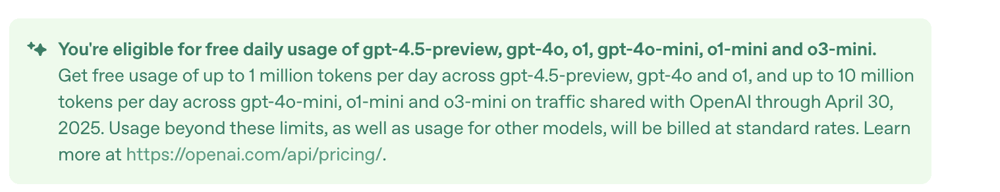
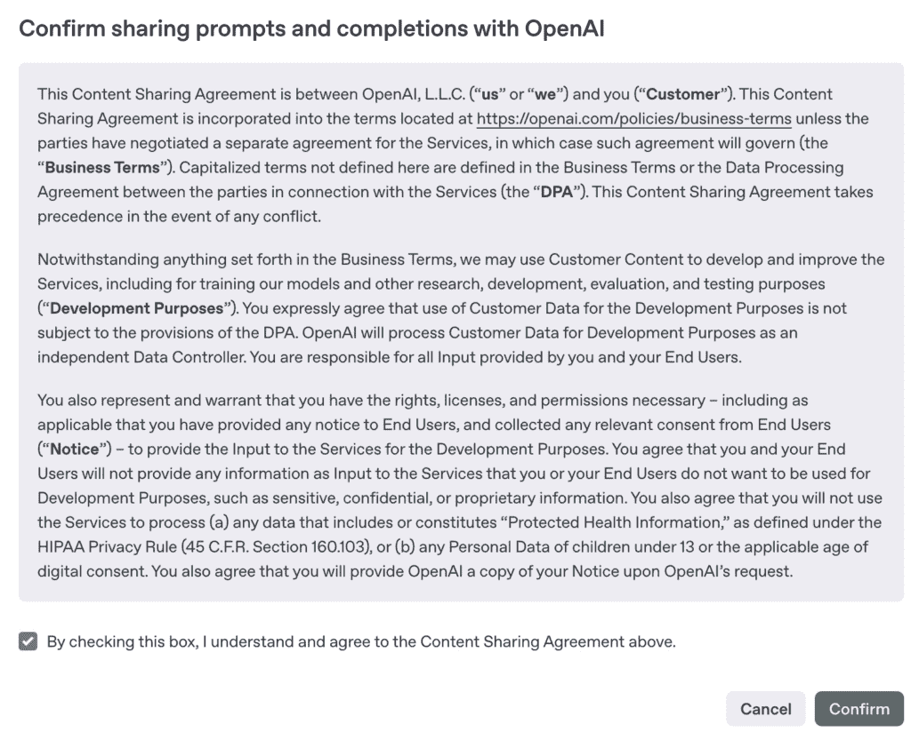

# 当 OpenAI 不是唯一答案时：基于包装器的人工智能代理的企业风险

> 原文：[`towardsdatascience.com/when-openai-isnt-always-the-answer-enterprise-risks-behind-wrapper-based-ai-agents/`](https://towardsdatascience.com/when-openai-isnt-always-the-answer-enterprise-risks-behind-wrapper-based-ai-agents/)

**“等等…你是在把日记条目发送给 OpenAI 吗？”**

<mdspan datatext="el1745628834163" class="mdspan-comment">那</mdspan> 是我的朋友在我向她展示我参加旧金山黑客马拉松期间构建的 AI 驱动的日记应用 *Feel-Write* 时问我的第一个问题。

我耸了耸肩。

**“这是一个以 AI 为主题的黑客马拉松，我必须快速构建一些东西。”**

她没有错过任何细节：

**“当然。但你怎么信任你构建的东西？为什么不自己托管你的 LLM？”**

这让我立刻停止了思考。

我为这个应用快速完成而感到自豪。但那个问题，以及随之而来的一系列问题，让我对如何负责任地使用人工智能构建的知识产生了怀疑。黑客马拉松的评委也注意到了这一点。

那一刻让我意识到，我们在使用人工智能构建时，尤其是处理敏感数据的工具时，是多么随意地对待信任。

我意识到一些更重要的事情：

**我们在使用人工智能进行构建时，谈论信任的还不够。**

她的回答让我印象深刻。乔治亚·冯·明登是 ACLU 的数据科学家，她在法律和民权背景下密切工作于个人可识别信息的问题。我一直很重视她的见解，但这次对话触动了我。

因此，我请她进一步阐述 *在这个背景下，信任究竟意味着什么？* *尤其是当人工智能系统处理个人数据时。*

她告诉我：

> *“信任可能难以界定，但数据治理是一个良好的起点。谁拥有数据，如何存储，以及数据用途都至关重要。十年前，我会给出不同的答案。但今天，随着巨大的计算能力和庞大的数据存储，大规模推理成为一个真正的担忧。OpenAI 在计算和数据方面都有显著的访问权限，他们的不透明性使得谨慎是合理的。*
> 
> *在个人可识别信息方面，法规和常识都指向了需要强大的数据治理。在 API 调用中发送 PII 不仅风险很大，还可能违反这些规则，使个人面临伤害。”*

这让我想起，当我们使用人工智能构建时，尤其是涉及敏感人类数据的系统，我们不仅仅是编写代码。

> 我们正在做出关于隐私、权力和信任的决定。

当你收集用户数据，尤其是像日记条目这样个人化的数据时，你就进入了责任领域。这不仅仅关乎你的模型能做什么。这是关于这些数据会发生什么，它们会去哪里，谁可以访问它们。

## 简单的幻觉

今天，创建看起来智能的东西比以往任何时候都容易。有了 OpenAI 或其他 LLM，开发者可以在几小时内构建 AI 工具。初创公司可以一夜之间推出“AI 驱动”的功能。而企业？他们正在争先恐后地将这些代理集成到他们的工作流程中。

但在所有兴奋中，有一件事经常被忽视：**信任**。

当人们谈论 AI 代理时，他们通常指的是围绕 LLM 的轻量级包装。这些代理可能会回答问题，自动化任务，甚至做出决策。但许多都是匆忙构建的，很少考虑安全性、合规性或问责制。

一个产品使用 OpenAI 并不意味着它就是安全的。您真正信任的是整个流程：

+   谁构建了这个包装？

+   您的数据是如何被处理的？

+   您的信息是否被存储、记录——或者更糟，泄露了？

我自己一直在使用 OpenAI API 处理客户案例。最近，我被提供免费访问 API——直到 4 月底，每天最多 100 万个 token——**如果我同意分享我的提示数据**。

*OpenAI 免费 API 调用 – 每天最多 100 万个 GPT 最新模型的 token*

*(作者图片)*

我几乎为个人副项目注册了，但后来我想到了：如果解决方案提供商接受同样的交易来削减成本，他们的用户将不知道他们的数据正在被共享。在个人层面上，这可能看似无害。但在企业环境中？这可能是对隐私的严重侵犯，甚至可能是对合同或监管义务的违反。

只需一位工程师对这样的交易说“是”，您的客户数据就可能落入他人手中。

*条款和条件：与 OpenAI 分享提示和完成内容以换取免费 API 调用*

*(作者图片)*

## 企业 AI 提高风险

我看到越来越多的 SaaS 公司和 devtool 初创公司正在尝试使用 AI 代理。有些做得很好。一些 AI 代理允许您带来自己的 LLM，从而控制模型运行的位置和数据如何处理。

这是一个深思熟虑的方法：**您定义信任边界**。

但并非每个人都这么小心。

许多公司只是连接到 OpenAI 的 API，添加几个按钮，就称之为“企业就绪”。

揭秘：它并不是。

* * *

## 会出什么问题？很多。

如果您在集成 AI 代理到您的堆栈时没有提出严格的问题，以下是您面临的风险：

+   **数据泄露**：您的提示可能包含敏感的客户数据、API 密钥或内部逻辑——如果这些被发送到第三方模型，可能会被暴露。

    2023 年，三星工程师无意中将内部源代码和笔记粘贴到 ChatGPT 中([Forbes](https://www.forbes.com/sites/siladityaray/2023/05/02/samsung-bans-chatgpt-and-other-chatbots-for-employees-after-sensitive-code-leak/?utm_source=chatgpt.com))。这些数据现在可能成为未来训练集的一部分——对知识产权是一个重大风险。

+   **合规违规**：未经适当控制，通过像 OpenAI 这样的模型发送个人可识别信息（PII）可能违反 GDPR、HIPAA 或你自己的合同。

    埃隆·马斯克的 X 公司就是通过艰难的方式学到了这一点。他们通过使用包括欧盟用户在内的所有用户帖子来训练他们的 AI 聊天机器人“Grok”，而没有进行适当的同意。监管机构迅速介入。在压力之下，他们暂停了 Grok 在欧盟的训练（[Politico](https://www.politico.eu/article/elon-musks-x-to-pause-ai-training-with-some-eu-data-says-irish-privacy-regulator/?utm_source=chatgpt.com)）。

+   **不透明的行为**：非确定性代理难以调试或解释。当客户询问为什么聊天机器人给出了错误推荐或泄露了机密信息时会发生什么？你需要透明度来回答这个问题——而许多代理今天并不提供这种透明度。

+   **数据所有权混淆**：输出归谁所有？谁记录数据？你的提供商是否在你的输入上进行再训练？

    Zoom 在 2023 年被发现正是如此行事。他们悄悄地更改了他们的服务条款，允许客户会议数据被用于 AI 训练（[Fast Company](https://www.fastcompany.com/90934584/zoom-ai-training-terms-of-service-consent?utm_source=chatgpt.com)）。在公众的强烈反对之后，他们撤销了这项政策，但这提醒我们信任可能在一夜之间丧失。

+   **包装中的安全疏忽**：在 2024 年，流行的低代码 LLM 编排工具 Flowise 被发现有数十个部署暴露在互联网上，其中许多没有进行身份验证（[Cybersecurity News](https://cybersecuritynews.com/multiple-vulnerabilities-ai/?utm_source=chatgpt.com)）。研究人员发现了公开的 API 密钥、数据库凭证和用户数据。这不是 OpenAI 的问题——这是**构建者**的问题。但最终用户仍然要为此付出代价。

+   **过度扩展的 AI 功能**：微软的“召回”功能——作为他们 Copilot 推广的一部分——自动截取用户的活动截图以帮助 AI 助手回答问题（[DoublePulsar](https://doublepulsar.com/microsoft-recall-on-copilot-pc-testing-the-security-and-privacy-implications-ddb296093b6c?utm_source=chatgpt.com)）。这听起来很有帮助……直到安全专家将其标记为隐私噩梦。微软不得不迅速撤回并使该功能成为可选的。

## 并非所有事情都需要 OpenAI

OpenAI 非常强大。但并不总是正确的答案。

有时候，一个较小的本地模型就足够了。有时候基于规则的逻辑做得更好。而且，通常，最安全的选项是那些完全运行在你的基础设施下、遵循你规则的应用。

我们不应该盲目地将一个 LLM 连接起来并称之为“智能助手”。

在企业中，**信任、透明度和控制不是可选项**——它们是必不可少的。

有越来越多的平台支持这种控制。Salesforce 的 Einstein 1 Studio 现在支持**自带模型**，让你可以连接来自 AWS 或 Azure 的自己的 LLM。IBM 的 Watson 允许企业内部部署模型，并具有完整的审计跟踪。Databricks 与 MosaicML 合作，让你可以在自己的云中训练私有的 LLM，这样你的敏感数据就不会离开你的基础设施。

这才是真正的企业级 AI 应该有的样子。

## 底线

AI 代理很强大。它们解锁了我们以前无法完成的流程和自动化。但开发的便捷性并不意味着它是安全的，尤其是在处理大量敏感数据时。

在你推出那个闪亮的新代理之前，问问自己：

+   谁控制着这个模型？

+   数据将去哪里？

+   我们是否合规？

+   我们能否审计它的行为？

在 AI 时代，最大的风险不是技术不好。

**这是盲目的信任。**

***关于作者****我是 Ellen，一名拥有 6 年经验的机器学习工程师，目前在美国旧金山的一家金融科技初创公司工作。我的背景包括在石油和天然气咨询中的数据科学角色，以及领导亚太、中东和欧洲的 AI 和数据培训项目。

*我目前正在完成我的数据科学硕士学位（2025 年 5 月毕业），并积极寻找作为机器学习工程师的下一个机会。如果你愿意推荐或建立联系，我将非常感激！*

*我喜欢通过 AI 创造现实世界的影响，并且我总是开放于基于项目的合作。*

*查看我的作品集：[*liviaellen.com/portfolio*](https://liviaellen.com/portfolio)

*我的前一个增强现实作品*：[liviaellen.com/ar-profile](https://liviaellen.com/ar-profile) [支持我的工作，请喝杯咖啡：](https://ko-fi.com/liviaellen)
