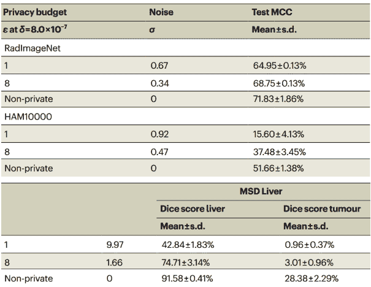
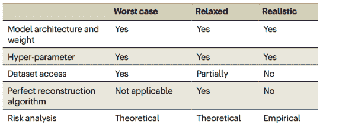
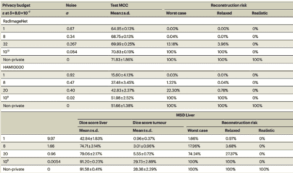
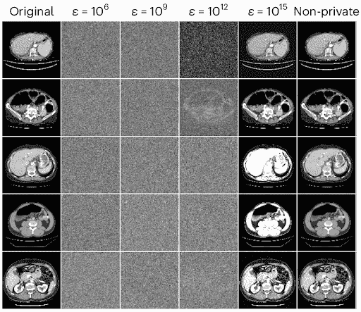

# 当最优成为良善的敌人：为医疗人工智能提供高预算差分隐私

> 原文：[`towardsdatascience.com/when-optimal-is-the-enemy-of-good-high-budget-differential-privacy-for-medical-ai/`](https://towardsdatascience.com/when-optimal-is-the-enemy-of-good-high-budget-differential-privacy-for-medical-ai/)

**想象你正在建造你的梦想家园。**几乎所有事情都准备好了。**剩下的唯一事情就是挑选一扇前门**。由于该地区的犯罪率很低，你决定想要一个标准锁的门窗——不需要太花哨，但可能足以阻止 99.9%的潜在窃贼。

**不幸的是，当地的业主协会（HOA）有一条规定，即该地区所有前门都必须是银行保险库门。**他们的理由是，银行保险库门是唯一经过数学证明绝对安全的门。在他们看来，任何低于这个标准的门几乎可以忽略不计。

**你只剩下三个选择，没有一个看起来特别吸引人：**

+   **放弃并安装银行保险库门。**这不仅昂贵且麻烦，而且每次你想打开或关闭门时都会让你感到不便。至少窃贼不会成为问题！

+   **让你的房子没有门。**业主协会规则对社区内的任何前门都提出了要求，但它**技术上**并没有禁止你完全不安装门。这样会节省你很多时间和金钱。当然，缺点是任何人都可以随意进出。更重要的是，业主协会总是可以关闭这个漏洞，让你回到起点。

+   **完全退出。**面对如此明显的困境（要么完全投入安全，要么投入实用性），你选择不参与游戏，出售你几乎完工的房子，并寻找其他地方居住。

这种场景显然是完全不切实际的。在现实生活中，**每个人都努力在安全和实用性之间找到一个合适的平衡**。这种平衡取决于每个人的自身情况和风险评估，但普遍来说，它会在银行保险库门和完全没有门这两个极端之间找到某个位置。

**但如果你的梦想不是房子，而是想象一个有力量帮助医生提高患者治疗效果的医疗人工智能模型呢？**来自患者的敏感训练数据点是你的宝贵财富。你采取的隐私保护措施是你选择安装的前门。医疗提供者和科学界是业主协会。

**突然间，这个场景与现实更加接近。在这篇文章中，我们将探讨这是为什么。**在了解问题之后，我们将考虑论文[*在 AI 医学成像中协调隐私和准确性*](https://doi.org/10.1038/s42256-024-00858-y)[1]中提出的简单但经验上有效的解决方案。作者提出了一种**平衡的替代方案，类似于现实生活中典型前门的处理方式**。

* * *

## 医疗 AI 中患者隐私的状态

**在过去几年中，人工智能已经成为我们日常生活中的一个越来越普遍的部分，证明了它在各个领域的实用性。然而，AI 模型的使用增加，也引发了关于保护用于训练它们的数据隐私的问题和担忧。**你可能还记得 ChatGPT 的一个著名案例，就在其最初发布后的几个月，[暴露了三星的专有代码](https://www.forbes.com/sites/siladityaray/2023/05/02/samsung-bans-chatgpt-and-other-chatbots-for-employees-after-sensitive-code-leak/) [2]。**

与 AI 模型相关的某些隐私风险是显而易见的。例如，如果用于模型训练的数据存储不够安全，恶意行为者可能会找到直接访问它的方法。**其他风险则更为隐蔽，例如*重建*的风险。**正如其名所示，在[重建攻击](https://en.wikipedia.org/wiki/Reconstruction_attack)中，恶意行为者试图在不直接访问数据集的情况下重建模型的数据。**

医疗记录是存在的一种最敏感的个人隐私信息。尽管具体法规因司法管辖区而异，但患者数据通常受到严格的保护，对保护不力的处罚相当严厉。**除了法律条文之外，无意中泄露此类数据可能会不可修复地损害我们使用专用 AI 赋能医疗专业人员的的能力。**

正如 Ziller、Mueller、Stieger 等[1]指出，**充分利用医疗 AI 需要包含来自实际患者信息的丰富数据集**。这些信息必须得到患者的完全同意才能获取。在 AI 带来的独特挑战出现之前，为了研究而道德地获取医疗数据就已经是极具挑战性的。但如果暴露的专有代码导致三星禁止使用 ChatGPT[2]，如果攻击者设法重建 MRI 扫描并识别出属于哪些患者，会发生什么呢？**即使是对数据重建的疏忽保护也可能对整个医疗 AI 造成巨大的挫折。**

将这一点与我们的前门隐喻联系起来，要求银行保险库门的 HOA 法规开始显得更有道理。**当一次入侵的成本可能对整个社区造成灾难性的影响时，自然想要不择手段地防止它们发生。**

## 差分隐私（DP）作为理论上的银行保险库门

**在讨论医疗人工智能背景下隐私和实用性之间适当平衡可能是什么样子之前，我们必须将注意力转向**保护人工智能模型训练数据与优化性能质量之间的固有权衡**。这将为我们提供一个基本理解**差分隐私（DP），隐私保护的理论黄金标准**的基础。

尽管过去四年里对训练数据隐私的学术兴趣显著增加，但**许多对话所基于的原则早在最近大型语言模型（LLM）兴起之前就被研究人员指出了**，甚至在 2015 年 OpenAI 成立之前。尽管它本身不涉及重建**，但 2013 年的论文[***用更智能的机器来破解智能机器***](https://doi.org/10.48550/arXiv.1306.4447) **[3]** 展示了一种可推广的攻击方法，能够准确**推断机器学习分类器的统计属性**，并指出：

> “尽管机器学习算法是已知且公开发布的，但训练集可能无法合理确定，实际上，它们可能被视为商业机密。虽然关于训练集元素隐私的研究已经很多，[...] 我们将注意力集中在机器学习分类器以及可以从它们中无意或恶意泄露的统计信息上。我们表明，从机器学习分类器中可以推断出意外但有用的信息。” [3]

**理论上的数据重建攻击甚至更早就有描述**，在一个与机器学习不直接相关的背景下。里程碑式的 2003 年论文[***在保护隐私的同时揭示信息***](https://crypto.stanford.edu/seclab/sem-03-04/psd.pdf) [4] 展示了一种**多项式时间重建算法**，用于统计数据库。（此类数据库旨在提供关于其数据的聚合答案，同时保持单个数据点的匿名性。）作者表明，**为了减轻重建的风险，需要在数据中引入一定量的噪声**。不用说，以这种方式扰动原始数据，虽然对于隐私是必要的，**但对查询响应的质量有影响**，即统计数据库的准确性。

在他们书籍《[*算法隐私基础*](https://www.cis.upenn.edu/~aaroth/Papers/privacybook.pdf)[5]》的第一章中解释差分隐私（DP）的目的时，Cynthia Dwork 和 Aaron Roth 讨论了隐私和准确率之间的权衡：

> **“[T]信息恢复的基本法则指出，对太多问题的过度精确回答将以惊人的方式破坏隐私。”** 差分隐私算法研究的目的是尽可能推迟这种不可避免性。**差分隐私解决了在了解有关人群的有用信息的同时，对个人一无所知的悖论。”** [5]

通过考虑两个仅在一个条目上有所不同的数据集（一个包含该条目，另一个不包含），捕捉了 *“在了解有关人群的有用信息的同时，对个人一无所知”* 的概念。**一个 (*ε*, *δ*)-差分隐私查询机制是指，当查询一个数据集时，返回特定输出的概率至多是被查询另一个数据集时概率的乘性因子。**用 *M* 表示机制，用 *S* 表示可能的输出集合，用 *x* 和 *y* 表示数据集，我们将其形式化如下 [5]：

**Pr[*M*(*x*) **∈** ***S*] ≤ exp(*ε*) **⋅** **Pr[*M*(*y*) **∈** ***S*] + *δ***

其中 ***ε*** 是 *隐私损失参数*，而 ***δ*** 是 *失败概率参数*。*ε* 量化了查询导致隐私损失的程度，而一个正的 *δ* 允许在一定的（通常非常低）概率下，查询完全失去隐私。请注意，*ε* 是一个指数参数，这意味着即使略微增加它也可能导致隐私显著衰减。

**DP（差分隐私）的一个重要且有用的特性是 *可组合性***。注意，上述定义仅适用于我们运行单个查询的情况。可组合性特性帮助我们将其推广到涵盖多个查询，基于这样一个事实：当我们组合多个查询时，**隐私损失和失败概率会以可预测的方式累积**，无论这些查询是基于相同的机制还是不同的机制。这种累积很容易被证明（最多）是线性的 [5]。这意味着，**我们不必考虑单个查询的隐私损失参数，我们可以将 *ε* 视为一个可以在多个查询中使用的 *隐私预算***。例如，当一起考虑时，一个使用 (1, 0)-DP 机制和一个使用 (0.5, 0)-DP 机制的查询满足 (2, 0)-DP。

**DP 的价值来自于它承诺的理论隐私保证**。例如，将 *ε* 设置为 1 和 *δ* 设置为 0，我们发现查询数据集 *y* 时出现任何给定输出的概率至多为 exp(1) = e ≈ 2.718 倍于查询数据集 *x* 时出现相同输出的概率。这为什么重要？因为 **输出发生的概率差异越大，就越容易确定两个数据集差异的贡献，也就越容易最终重建该个人条目**。

在实践中，设计一个(*ε*, *δ*)-差分隐私随机机制涉及到**添加从依赖于*ε*和*δ*的分布中抽取的随机噪声**。具体细节超出了本文的范围。然而，将我们的焦点转回机器学习，我们发现这个想法是相同的：DP 对于 ML 的关键在于向训练数据中引入噪声，这以几乎相同的方式提供了强大的隐私保证。

当然，这就是我们之前提到的权衡所在。**向训练数据添加噪声会使得学习变得更加困难**。我们可以**绝对地**添加足够的噪声，使得*ε* = 0.01 和*δ* = 0，使得输出概率之间*x*和*y*的差异几乎不存在。**这对隐私来说是个好消息，但对学习来说却是个坏消息**。在如此嘈杂的数据集上训练的模型在大多数任务上的表现都会非常糟糕。

**关于什么构成一个“好的”*ε*值，或者关于*ε*选择的通用方法或最佳实践，并没有共识[6]**。在许多方面，*ε*体现了隐私/准确性的权衡，而“正确”的目标值高度依赖于具体情境。*ε* = 1 通常被认为提供了高隐私保证。尽管随着*ε*的增加，隐私呈指数下降，但文献中提到了高达*ε* = 32 的值，并认为它们提供了适度的隐私保证[1]。

在[*Reconciling privacy and accuracy in AI for medical imaging*](https://doi.org/10.1038/s42256-024-00858-y)[1]的作者测试了差分隐私（DP）对三个真实世界医学影像数据集上 AI 模型准确性的影响。他们使用各种*ε*值，并将其与非隐私（非 DP）控制进行比较。**表 1**提供了他们对于*ε* = 1 和*ε* = 8 结果的局部总结：

**表 1**：在 RadImageNet [7]、HAM10000 [8]和 MSD Liver [9]数据集上，*δ = 8*⁻⁷⋅10 和隐私预算为ε = 1、ε = 8 以及无 DP（非隐私）的 AI 模型性能比较。MCC/Dice 分数越高，表示准确性越高。尽管在面对最坏情况对手时提供了强大的理论隐私保证，**DP 显著降低了模型准确性**。对性能的负面影响在最后两个数据集中尤为明显，这些数据集被认为是小型数据集。图片由作者根据 A. Ziller、T.T. Mueller、S. Stieger 等人[***Reconciling privacy and accuracy in AI for medical imaging***](https://doi.org/10.1038/s42256-024-00858-y)[1]中的表 3 中的图片制作，根据[CC-BY 4.0 许可](https://creativecommons.org/licenses/by/4.0/)使用。

**即使接近文献中证实的典型*ε*值的上限，DP 在医学影像任务中仍然像银行保险库门一样繁琐。**引入训练数据中的噪声对 AI 模型准确性具有灾难性的影响，尤其是在数据集较小的情况下。例如，MSD 肝脏数据集上的 Dice 分数大幅下降，即使*ε*值相对较高为 8。

**Ziller、Mueller、Stieger 等**建议，具有典型*ε*值的 DP 的准确性缺点可能是 DP 在医疗人工智能领域[1]未得到广泛应用的原因。是的，想要数学上可证明的隐私保证是合理的，但代价是什么？以隐私的名义放弃 AI 模型的大部分诊断能力并不是一个容易做出的选择。

重新审视我们的梦想家园场景，并带着对差分隐私（DP）的理解，我们发现我们（似乎）拥有的选项与我们的前门所拥有的三个选项完美对应。

+   **具有典型*ε*值的 DP 就像安装一个银行保险库门：**成本高昂，但有效保护隐私。正如我们将看到的，在这种情况下，它也是完全过度杀鸡用牛刀。

+   **不使用 DP 就像完全没有安装门一样：**虽然更容易，但风险很大。然而，如上所述，DP 在医疗人工智能领域[1]尚未得到广泛应用。

+   **放弃使用 AI 的机会就像放弃并出售房子一样：**这可以节省我们处理隐私问题与最大化准确性的激励之间的头痛，但在过程中损失了大量的潜力。

看起来我们陷入了僵局……**除非我们跳出思维定式。**

## 高预算 DP：隐私和准确性并非非此即彼

**在[*在医学影像人工智能中协调隐私和准确性*](https://doi.org/10.1038/s42256-024-00858-y) [1]中，Ziller、Mueller、Stieger 等**提出了医疗人工智能领域的常规前门——**一种在保护隐私的同时，在模型性能方面损失很少的方法。诚然，这种保护在理论上并非最优——远非如此。然而，正如作者通过一系列实验所展示的，**它确实足够好，可以抵御几乎任何现实的重建威胁。**

**俗话说，“完美是优秀的敌人。”在这种情况下，它是对“最优”的坚持——对任意低*ε*值的执着——将我们锁定了完全隐私与完全准确性之间的错误二分法。**就像现实世界中的银行保险库门有其位置一样，*ε* ≤ 32 的 DP 也是如此。然而，银行保险库门的存在并不意味着普通的门在世界中没有位置。同样，对于*高预算*DP 也是如此。

高预算 DP 背后的想法很简单：使用如此高的隐私预算（*ε*值），以至于它们*“几乎普遍被忽视，认为没有意义”* [1]——**预算范围从*ε =* 10⁶到高达*ε =* 10¹⁵**。从理论上讲，这些提供了如此弱的隐私保证，以至于似乎有常识认为将它们视为与不使用 DP 一样好是没有意义的。然而，在实践中，这完全不是事实。正如我们将通过查看论文的结果所看到的，高预算 DP 在应对现实威胁方面显示出巨大的潜力。正如 Ziller, Mueller, Stieger, *et al.*所说[1]：

> “[E]ven a ‘pinch of privacy’ has drastic effects in practical scenarios.”

首先，我们需要问自己，我们认为什么是“现实的”威胁。**关于高预算差分隐私（DP）有效性的任何讨论都不可避免地与我们所选择的评估它的** **威胁模型** **紧密相关**。在这个背景下，威胁模型只是我们对一个感兴趣的恶意行为者能够做什么的假设集合。

**表 2：威胁模型比较。对于所有三种情况，我们还假设对手具有无界的计算能力。图片由 A. Ziller, T.T. Mueller, S. Stieger 等从[***在 AI 医学成像中协调隐私和准确性的论文](https://doi.org/10.1038/s42256-024-00858-y) [1]中的表 1 提供](https://doi.org/10.1038/s42256-024-00858-y) [1]（在[CC-BY 4.0 许可](https://creativecommons.org/licenses/by/4.0/)下使用)。”

**论文的发现依赖于对假设的校准，以更好地适应对病人隐私的现实威胁**。作者们认为，通常用于差分隐私的最坏情况模型过于悲观。例如，它假设对手可以完全访问每个原始图像，并基于 AI 模型尝试重建它（见表 2）[1]。这种悲观主义解释了高隐私预算的“实际场景中的剧烈影响”与它们提供的非常弱的**“理论”**隐私保证之间的差异。我们可以将其比作错误地评估典型房屋面临的安全威胁，错误地假设它们可能像银行面临的那样复杂和持久。

**因此，作者们提出了两种替代的威胁模型，他们称之为“放宽”和“现实”模型**。在这两种情况下，对手都保留了一些最坏情况模型的核心能力：访问 AI 模型的架构和权重，操纵其超参数的能力，以及无界的计算能力（见表 2）。现实中的对手假设无法访问原始图像，并且重建算法不完美。**即使这些假设也让我们拥有一个可能仍然被认为对大多数现实场景过于悲观的严格威胁模型[1]**。

在确定了要考虑的三个相关威胁模型后，Ziller、Mueller、Stieger 等**比较了在不同ε值下每个威胁模型下的 AI 模型准确性和重构风险。**正如我们在表 1 中看到的，这是针对三个典型的医学影像数据集进行的。他们的完整结果在**表 3**中展示：

**表 3**：在 RadImageNet[7]、HAM10000[8]和 MSD 肝脏[9]数据集上，以*δ = 8*⁻⁷⋅10 和不同的隐私预算进行比较，包括一些高达ε = 10⁹和ε = 10¹²的预算。MCC/Dice 分数越高，表示准确度越高。图像由 A. Ziller、T.T. Mueller、S. Stieger 等从[***在医学影像 AI 中协调隐私和准确性***](https://doi.org/10.1038/s42256-024-00858-y) [1]中的表 3 提供（在[CC-BY 4.0 许可](https://creativecommons.org/licenses/by/4.0/)下使用）。

并非意外，高隐私预算（超过*ε* = 10⁶）显著减轻了与较低（更严格）隐私预算相关的准确度损失。在所有测试的数据集中，**在ε = 10⁹（HAM10000、MSD 肝脏）或ε = 10¹²（RadImageNet）下使用高预算 DP 训练的模型，其表现几乎与非隐私训练的对应模型相当。**这与我们对隐私/准确度权衡的理解一致：训练数据中引入的噪声越少，模型的学习效果越好。

**令人惊讶的是，在现实威胁模型下，高预算差分隐私（DP）提供的经验保护程度。**令人瞩目地，现实的重构风险被评估为上述所有模型均为 0%。**高预算 DP 在防御医疗 AI 训练图像免受现实重构攻击方面的有效性，通过观察重构尝试的结果变得更加清晰。**图 1**以下展示了使用 DP 和ε = 10⁶、ε = 10⁹、ε = 10¹²和ε = 10¹⁵的高隐私预算从 MSD 肝脏数据集[9]中重构的五张最易重构的图像。

**图 1**：使用 DP 和ε = 10⁶、ε = 10⁹、ε = 10¹²和ε = 10¹⁵的高隐私预算从 MSD 肝脏数据集[9]中重构的五张最易重构的图像。图像由 A. Ziller、T.T. Mueller、S. Stieger 等从《在医学影像 AI 中协调隐私和准确性的矛盾》[1]中的图 3 提供（在 CC-BY 4.0 许可下使用）。

注意，至少从肉眼来看，**即使在使用前两种预算获得的最优重建结果，在视觉上与随机噪声也难以区分**。这为以下论点提供了直观的支持：**通常被认为过高而无法提供任何有意义保护的预算，在利用人工智能进行医学成像时，可能有助于保护隐私，同时不牺牲准确性**。相比之下，当使用 ε = 10¹⁵ 进行重建时，结果与原始图像非常相似，这表明并非所有高预算都是相同的。

基于他们的发现，Ziller、Mueller、Stieger 等**提出，使用（至少）高预算 DP 作为训练医学成像人工智能模型的规范**。他们指出，高预算 DP 在应对现实重建风险方面的实证有效性，在模型准确性方面的成本极低。**作者甚至声称，“*不提供任何形式的正式隐私保证来训练 AI 模型似乎是疏忽的。*” [1]

* * *

## 结论

**我们从一种假设情景开始，在这种情景中，你必须决定在你的梦想之家中是选择银行保险库门还是完全放弃（并出售未完成的房子）。在探讨了医疗人工智能中隐私保护不足所造成的风险之后，我们研究了***隐私/准确性权衡***以及***重建攻击***和***差分隐私（DP）***的历史和理论。然后，我们看到了 DP 与常见的隐私预算（*ε*值）如何降低医疗人工智能模型性能，并将其与我们假设中的银行保险库门进行了比较**。

最后，我们查阅了论文[*在人工智能医学成像中协调隐私和准确性*](https://doi.org/10.1038/s42256-024-00858-y)的实证结果，以了解如何使用***高预算差分隐私***来摆脱银行保险库门与无门之间的虚假二分法，并在不牺牲模型准确性的情况下，在现实世界中保护患者隐私。

如果你喜欢这篇文章，请考虑在[LinkedIn](https://www.linkedin.com/in/jhyahav/)上关注我，以了解未来的文章和项目。

## 参考文献

**[1] **Ziller, A.，Mueller, T.T.，Stieger, S. *et al.*** 在人工智能医学成像中协调隐私和准确性。*Nat Mach Intell* **6**，764–774 (2024)。[`doi.org/10.1038/s42256-024-00858-y`](https://doi.org/10.1038/s42256-024-00858-y).

[2] **雷，S.** 三星因敏感代码泄露禁止员工使用 ChatGPT 和其他聊天机器人。*福布斯* (2023)。[`www.forbes.com/sites/siladityaray/2023/05/02/samsung-bans-chatgpt-and-other-chatbots-for-employees-after-sensitive-code-leak/`](https://www.forbes.com/sites/siladityaray/2023/05/02/samsung-bans-chatgpt-and-other-chatbots-for-employees-after-sensitive-code-leak/).

[3] **阿滕西尼，G.，曼奇尼，L. V.，斯波加尔迪，A. 等人*** 使用更智能的机器来破解智能机器：如何从机器学习分类器中提取有意义的数据。*国际安全网络杂志* **10**，137–150 (2015)。[`doi.org/10.48550/arXiv.1306.4447`](https://doi.org/10.48550/arXiv.1306.4447)。

[4] **迪努尔，I. & 尼西姆，K.** 在保护隐私的同时揭示信息。*第 22 届 ACM SIGMOD-SIGACT-SIGART 数据库系统原理研讨会论文集* 202–210 (2003)。[`doi.org/10.1145/773153.773173`](https://doi.org/10.1145/773153.773173)。

[5] **德沃克，C. & 罗斯，A.** 差分隐私的算法基础。*理论计算机科学基础与趋势* **9**，211–407 (2014)。[`doi.org/10.1561/0400000042`](https://doi.org/10.1561/0400000042)。

[6] **德沃克，C.，科利，N. & 马利根，D.** 差分隐私实践：揭露你的 epsilon！*隐私与机密性杂志* **9** (2019)。[`doi.org/10.29012/jpc.689`](https://doi.org/10.29012/jpc.689)。

[7] **梅，X.，刘，Z.，罗布森，P.M. 等人*** RadImageNet：一个用于有效迁移学习的开放放射学深度学习研究数据集。*放射学艺术与人工智能* **4.5**，e210315 (2022)。[`doi.org/10.1148/ryai.210315`](https://doi.org/10.1148/ryai.210315)。

[8] **茨尚德，P.，罗森达尔，C. & 基特勒，H.** HAM10000 数据集，一个包含常见色素性皮肤病变多来源皮肤镜图像的大型集合。*科学数据* **5**，180161 (2018)。[`doi.org/10.1038/sdata.2018.161`](https://doi.org/10.1038/sdata.2018.161)。

[9] **安东内利，M.，雷因克，A.，巴卡斯，S. 等人*** 医学分割十项赛。*自然通讯* **13**，4128 (2022)。[`doi.org/10.1038/s41467-022-30695-9`](https://doi.org/10.1038/s41467-022-30695-9)**********
