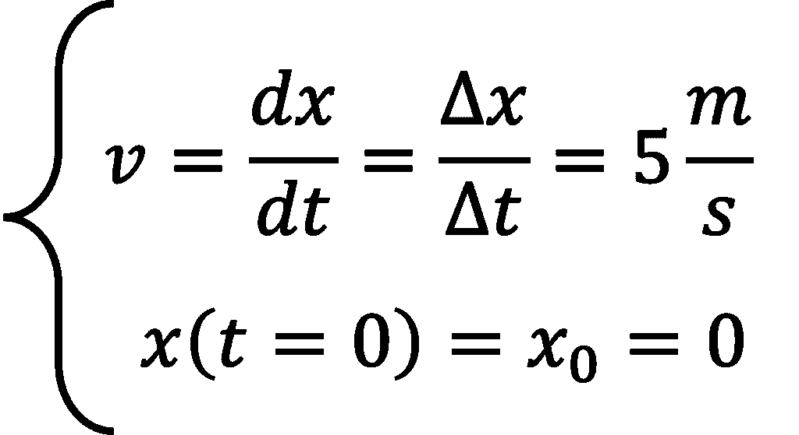
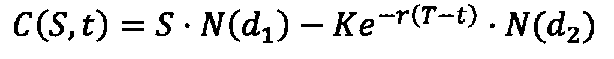
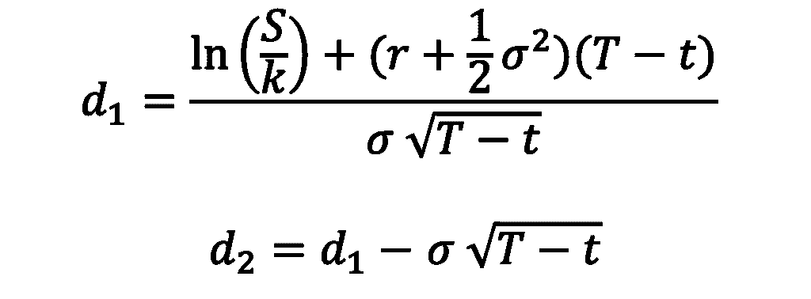
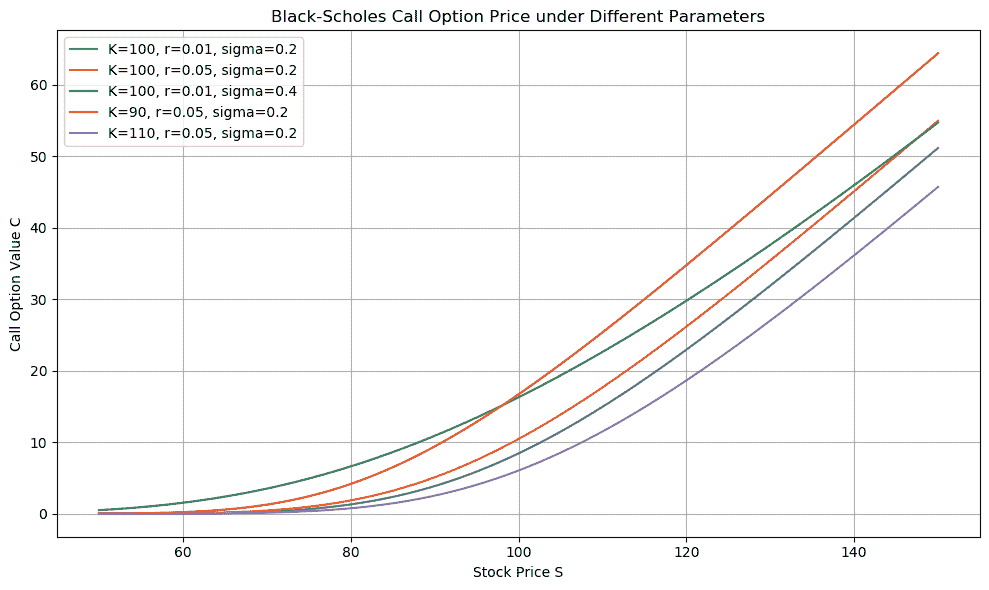
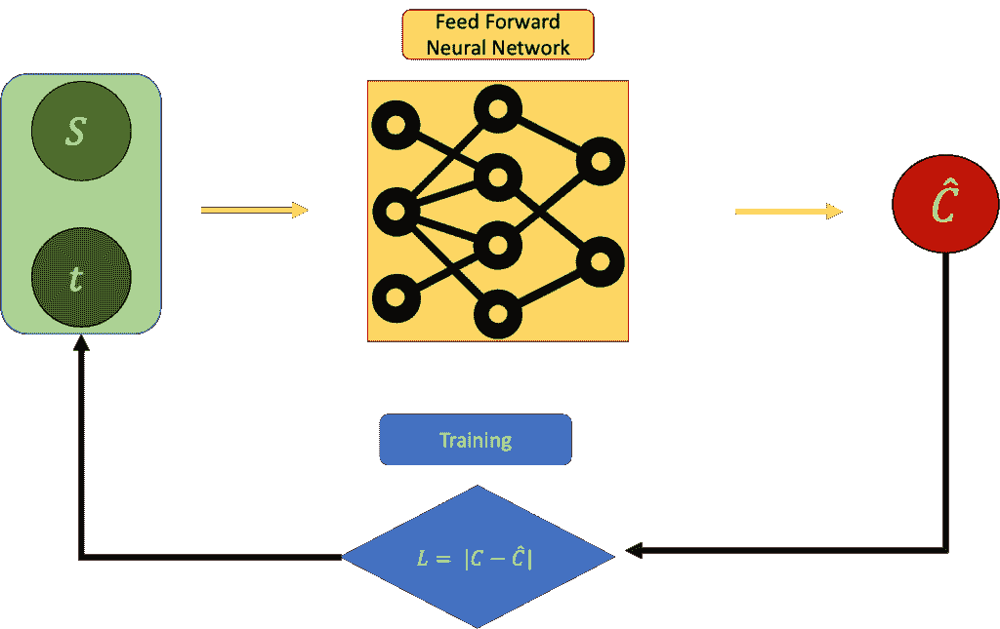
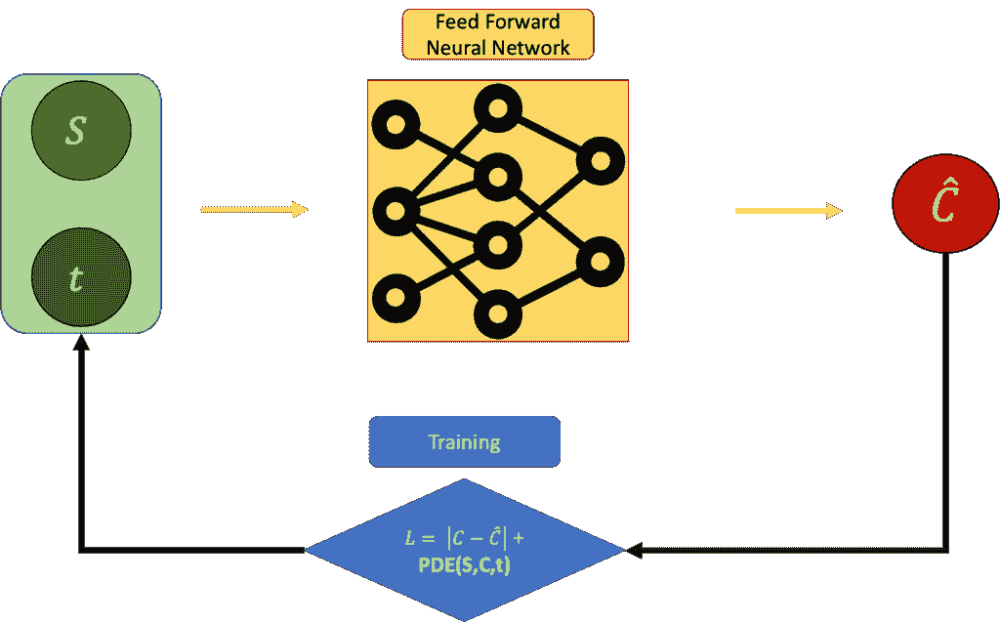
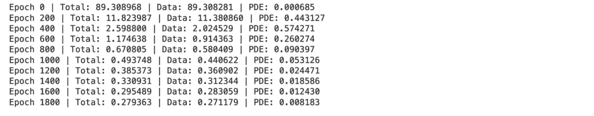
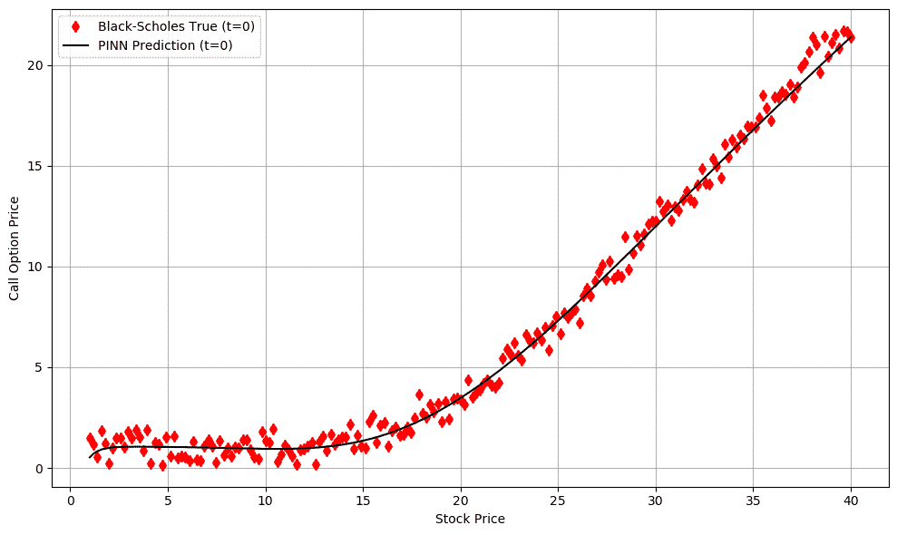

# 当物理学遇到金融：使用人工智能解决 Black-Scholes

> 原文：[`towardsdatascience.com/when-physics-meets-finance-using-ai-to-solve-black-scholes/`](https://towardsdatascience.com/when-physics-meets-finance-using-ai-to-solve-black-scholes/)
> 
> ***免责声明***：这不是财务建议。我是航空航天工程博士，专注于机器学习：我不是财务顾问。本文旨在仅展示物理学信息神经网络（PINNs）在金融环境中的力量。

<mdspan datatext="el1744948982397" class="mdspan-comment">当我 16 岁的时候</mdspan>，我爱上了物理学。原因简单而强大：我认为物理学是***公平的***。

从未发生过因为光速在一夜之间改变，或者因为突然 e^x 可以是负数而导致我做错了练习题。每次我阅读物理学论文并想，“这没有意义，”结果发现***是我没有理解清楚***。

因此，物理学总是公平的，正因为如此，它总是***完美无缺的***。物理学通过其一套规则来展示这种完美和公平，这些规则被称为**微分方程**。

我所知道的 simplest 微分方程是这样的：

由作者制作的照片

非常简单：我们从这里开始，x[0]=0，在时间 t=0，然后以恒定速度 5 m/s 移动。这意味着在 1 秒后，我们离原点有 5 米（或者如果你更喜欢，是 5 英里）；在 2 秒后，我们离原点有 10 米；在 43128 秒后…我想你已经明白了。

正如我们所说的，这是刻在石头上的：完美、理想、不容置疑。然而，想象一下现实生活。想象你正在散步或开车。即使你尽力保持目标速度，你也永远无法保持恒定。你的思绪会在某些部分飞驰；也许你会分心，也许你会因为红灯而停车，很可能是上述情况的组合。所以，我们之前提到的简单微分方程可能不足以描述。我们可以尝试通过微分方程预测你的位置，***但***借助人工智能的帮助。

这个想法在[Physics Informed Neural Networks](https://www.sciencedirect.com/science/article/pii/S0021999118307125) (PINN)中得到了实现。我们稍后会详细描述它们，但这个想法是，我们试图匹配**数据**以及我们从描述现象的微分方程中知道的内容。这意味着我们强制我们的解决方案通常符合我们从物理学中期望的内容。我知道这听起来像是黑魔法，我保证在整个帖子中会变得更加清晰。

现在，最大的问题：

> 金融与物理学以及物理学信息神经网络有什么关系？

嗯，结果证明，微分方程不仅对我这样的对自然宇宙法则感兴趣的“书呆子”有用，而且在 **金融模型** 中也很有用。例如，**Black-Scholes** 模型就使用微分方程来设定看涨期权的价格，在给定一些相当严格的假设下，形成一个 **无风险投资组合**。

这个非常复杂的引言的目标有两个：

+   让你稍微感到困惑，这样你才会继续阅读 🙂

+   足够激发你的好奇心，看看这一切将走向何方。

希望我做到了 😁。如果做到了，接下来的文章就会按照以下步骤进行：

1.  我们将讨论 **Black-Scholes 模型**，它的假设和它的微分方程

1.  我们将讨论 **物理信息神经网络（PINNs**），它们的来源以及为什么它们有帮助

1.  我们将开发我们的算法，使用 **Python, Torch** 和 **面向对象编程（OOP**）在 Black-Scholes 上训练 PINN。

1.  我们将展示我们算法的结果。

我很兴奋！去实验室！🧪

## 1. Black-Scholes 模型

> 如果你好奇 Black-Scholes 的原始论文，可以在[这里](https://www.cs.princeton.edu/courses/archive/fall09/cos323/papers/black_scholes73.pdf)找到。这绝对值得一看 🙂

好的，所以现在我们得理解我们所处的金融宇宙，了解其中的变量和法则。

首先，在金融领域，有一个强大的工具叫做看涨 **期权**。看涨期权赋予你（不是义务）在固定未来（比如说一年后）以特定价格购买股票的权利，这被称为执行 **价格**。

现在让我们稍微思考一下，好吗？比如说，今天给定的股票价格是 $100。让我们再假设我们持有一个执行价格为 $100 的看涨期权。现在假设一年后股票价格涨到 $150。太棒了！我们可以使用这个看涨期权来购买股票，然后立即将其卖出！我们刚刚赚了 $150 – $150-$100 = $50 的利润。另一方面，如果一年后股票价格下跌到 $80，那么我们就不能这样做。实际上，我们最好根本不行使购买权，以免亏损。

所以现在我们思考一下，购买股票和出售期权的想法实际上是非常 **互补** 的。我的意思是，股票价格的随机性（它上涨和下跌的事实）实际上可以通过持有正确数量的期权来 **缓解**。这被称为 **对冲**。

基于一系列假设，我们可以推导出 **公平期权价格**，以便拥有一个 **无风险** 的投资组合。

我不想用推导的所有细节来烦扰你（它们在原始论文中实际上并不难理解），但无风险投资组合的微分方程是这样的：

在哪里：

+   `C` 是在时间 t 时的期权价格

+   `sigma` 是股票的波动率

+   `r` 是无风险利率

+   `t`是时间（现在 t=0，T 是到期时间）

+   `S`是当前股票价格

从这个方程中，我们可以推导出具有无风险投资组合的看涨期权的公平价格。这个方程是封闭的且解析的，看起来是这样的：

有：

其中 N(x)是标准正态分布的累积分布函数（CDF），K 是执行价格，T 是到期时间。

例如，这是根据 Black-Scholes 模型绘制的**股票价格（x）**与**看涨期权（y）**的图表。

作者制作

现在看起来很酷，但这一切与物理和 PINN 有什么关系？看起来方程是解析的，所以为什么是 PINN？为什么是 AI？我为什么要读这篇文章？答案是下面的👇：

## 2. 物理信息神经网络

> 如果你好奇物理信息神经网络，你可以在原始论文[这里](http://Physics Informed Neural Networks)找到。再次强调，值得一读。 🙂

现在，上面的方程是**解析的**，但再次强调，这是一个理想场景中公平价格的方程。如果我们暂时忽略这一点，尝试根据股票价格和时间猜测期权的价格会发生什么？例如，我们可以使用前馈神经网络并通过反向传播来训练它。

在这个训练机制中，我们正在最小化误差

`L = |Estimated C - Real C|`：

作者制作

这很好，这是你可以做的最简单的神经网络方法。这里的问题是，我们完全忽略了 Black-Scholes 方程。那么，还有其他方法吗？我们能否将其整合进去？

当然，我们可以，也就是说，如果我们设置误差为

`L = |Estimated C - Real C|+ PDE(C,S,t)`

其中 PDE(C,S,t)是

它需要尽可能接近 0：

作者制作

但问题仍然存在。为什么这个“更好”于简单的 Black-Scholes？为什么不直接使用微分方程？好吧，因为有时候，在生活中，解微分方程并不能保证你得到“真实”的解。物理学通常是在近似事物，而且是以一种可能会在我们期望看到的结果和实际看到的结果之间产生差异的方式进行的。这就是为什么物理信息神经网络（PINN）是一个神奇且迷人的工具：你试图匹配物理学，但你必须严格确保结果必须与你的数据集“看到”的结果相匹配。

在我们的情况下，为了获得无风险投资组合，我们可能会发现理论上的 Black-Scholes 模型并不完全符合我们观察到的有噪声、有偏差或不完美的市场数据。也许波动率不是恒定的。也许市场并不有效。也许方程背后的假设并不成立。这就是像 PINN 这样的方法可以发挥作用的地方。我们不仅找到了满足 Black-Scholes 方程的解决方案，我们还“相信”我们从数据中看到的内容。

好了，理论就到这里。让我们开始编码。👨‍💻

## 3. 实战 Python 实现

> 整个代码，包括一个酷炫的 README.md 文件、一个出色的笔记本和超级清晰的模块化代码，可以在[这里](https://github.com/PieroPaialungaAI/BlackScholesPINN)找到。
> 
> P.S. 这将有点紧张（很多代码），如果你对软件不感兴趣，可以自由跳到下一章。我会以更友好的方式展示结果 :) 

非常感谢您能读到这一步 ❤️

让我们看看我们如何实现这一点。

### 3.1 Config.json 文件

整个代码可以在一个非常简单的配置文件中运行，这个文件我称之为**config.json**。

你可以将其放置在任何你喜欢的地方，因为我们将会看到。

此文件至关重要，因为它定义了控制我们模拟、数据生成和模型训练的所有参数。让我快速为您解释每个值代表什么：

+   `K`：**行权价格**——这是期权赋予你在未来购买股票的权利的价格。

+   `T`：**到期时间**，以年为单位。所以`T = 1.0`意味着期权将在现在起一个单位（例如，一年）后到期。

+   `r`：**无风险利率**用于折现未来价值。这是我们模拟中设置的利率。

+   `sigma`：股票的**波动率**，它量化了股票价格的不确定性或“风险”。同样，这是一个模拟参数。

+   `N_data`：我们想要为训练生成的**合成数据点数**。这将决定模型的大小。

+   `min_S`和`max_S`：在生成合成数据时，我们想要采样的**股票价格范围**。这是我们的股票价格的最小值和最大值。

+   `bias`：可选的**偏移量**，添加到期权价格中，以模拟数据中的系统性变化。这样做是为了在现实世界和 Black-Scholes 数据之间创建差异。

+   `noise_variance`：向期权价格添加的**噪声量**，以模拟测量或市场噪声。此参数与前述原因相同。

+   `epochs`：模型将训练的**迭代次数**。

+   `lr`：优化器的**学习率**。这控制了模型在训练期间更新的速度。

+   `log_interval`：我们希望多久（以 epoch 为单位）**打印日志**以监控训练进度。

这些参数中的每一个都扮演着特定的角色，一些塑造了我们模拟的金融世界，而另一些则控制我们的神经网络如何与这个世界互动。在这里的小调整可能导致非常不同的行为，这使得这个文件既强大又精致。更改此 JSON 文件中的值将彻底改变代码的输出。

### 3.2 main.py

现在让我们看看代码的其他部分是如何在实际中使用这个配置的。

我们代码的主要部分来自***main.py***，使用 Torch 训练 PINN，以及***black_scholes*.py**。

这是 main.py：

所以您可以这样做：

1.  构建您的 config.json 文件

1.  运行`python main.py --config config.json`

main.py 使用了大量其他文件。

### 3.3 black_scholes.py 和辅助工具

模型的实现位于**black_scholes.py**中：

这可以用来构建模型、训练、导出和预测。

该函数还使用了一些辅助工具，如 data.py、loss.py 和 model.py。

火炬模型位于**model.py**中：

数据构建器（给定配置文件）位于**data*****.*****py**中：

以及包含价值的美丽损失函数**loss.py**

### 4. 结果

好的，所以如果我们运行 main.py，我们的 FFNN 就会进行训练，我们就会得到这个。

由作者制作的照片

正如您所注意到的，模型误差并不完全为 0，但模型的偏微分方程比数据小得多。这意味着模型（自然地）强烈地迫使我们的预测满足微分方程。这正是我们之前所说的：我们在数据和 Black-Scholes 模型两个方面进行优化。

我们可以定性注意到，有噪声和偏差的真实世界（相当现实的世界 lol）数据集与 PINN 之间有很好的匹配。

由作者制作的照片

这些是在 t = 0 时的结果，并且股票价格随着固定 t 的看涨期权而变化。很酷，对吧？但还没完！您可以使用上面的代码以两种方式探索结果：

1.  玩弄 config.json 中您拥有的众多**参数**

1.  在**t>0**时查看预测

玩得开心！ 🙂

### 5. 结论

非常感谢您一直看到这里。说真的，这是一篇很长的文章 😅

在这篇文章中，您看到了以下内容：

1.  **我们从物理开始**，以及它的规则，作为微分方程写成，是公平的、美丽的，并且（通常）是可预测的。

1.  **我们跳入了金融领域**，并遇到了 Black-Scholes 模型——一个旨在以无风险方式定价期权的微分方程。

1.  **我们探索了物理信息神经网络（PINNs**），这是一种不仅拟合数据，而且尊重底层微分方程的神经网络。

1.  **我们使用 Python 实现了所有内容**，利用 PyTorch 和一个干净、模块化的代码库，让您可以调整参数、生成合成数据，并训练自己的 PINNs 来解决 Black-Scholes。

1.  **我们可视化了结果**，并看到网络如何学习匹配不仅噪声数据，而且符合 Black-Scholes 方程预期的行为。

现在，我知道一次性消化所有这些内容并不容易。在某些领域，我可能不得不简略一些，可能比我需要的还要简略。不过，如果你想以更清晰的方式看待事物，再次，请查看[GitHub 文件夹](https://github.com/PieroPaialungaAI/BlackScholesPINN/tree/main)。即使你对软件不感兴趣，那里也有清晰的 README.md 和一个简单的**example/BlackScholesModel.ipynb**示例，它一步一步地解释了项目。

### 6. 关于我！

再次感谢您抽出宝贵时间。这对我很重要❤️

我的名字是 Piero Paialunga，就是我这里的人：

我是辛辛那提大学航空航天工程系的博士候选人。我在博客文章、LinkedIn 和 TDS 上谈论人工智能和机器学习。如果你喜欢这篇文章，并想了解更多关于机器学习的内容，以及跟随我的研究，你可以：

A. 在[**Linkedin**](https://www.linkedin.com/in/pieropaialunga/)上关注我，在那里我发布所有我的故事

B. 在[**GitHub**](https://github.com/PieroPaialungaAI)上关注我，在那里你可以看到我所有的代码

C. 发送电子邮件给我：***[[email protected]](/cdn-cgi/l/email-protection)***

D. 想和我一起工作吗？请查看[**Upwork**](https://www.upwork.com/freelancers/~017f9a75d13c030610)上的我的报价和项目！

Ciao. ❤️

> P.S. 我的博士学业即将结束，我正在考虑我的职业生涯下一步！如果你喜欢我的工作方式，并想雇佣我，请不要犹豫，随时联系。 🙂
